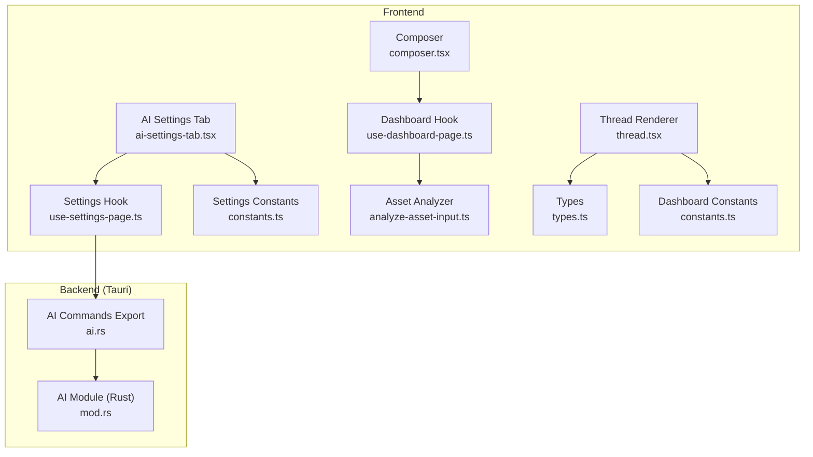
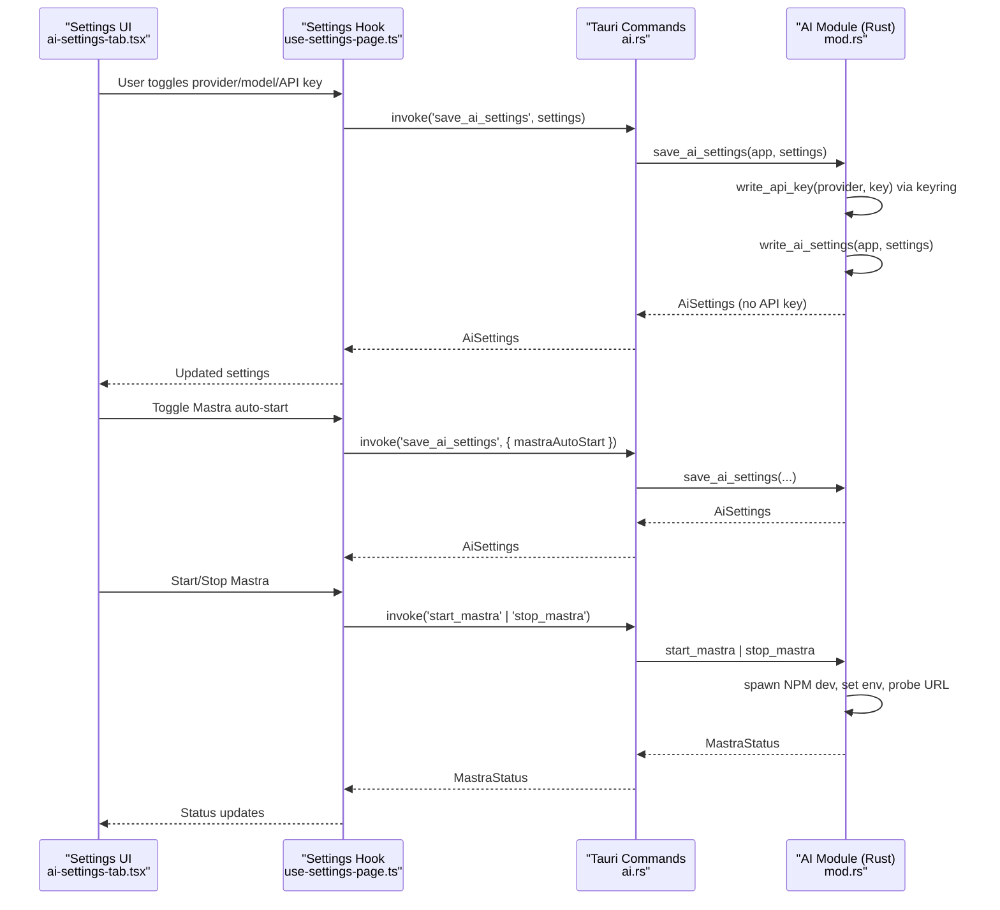
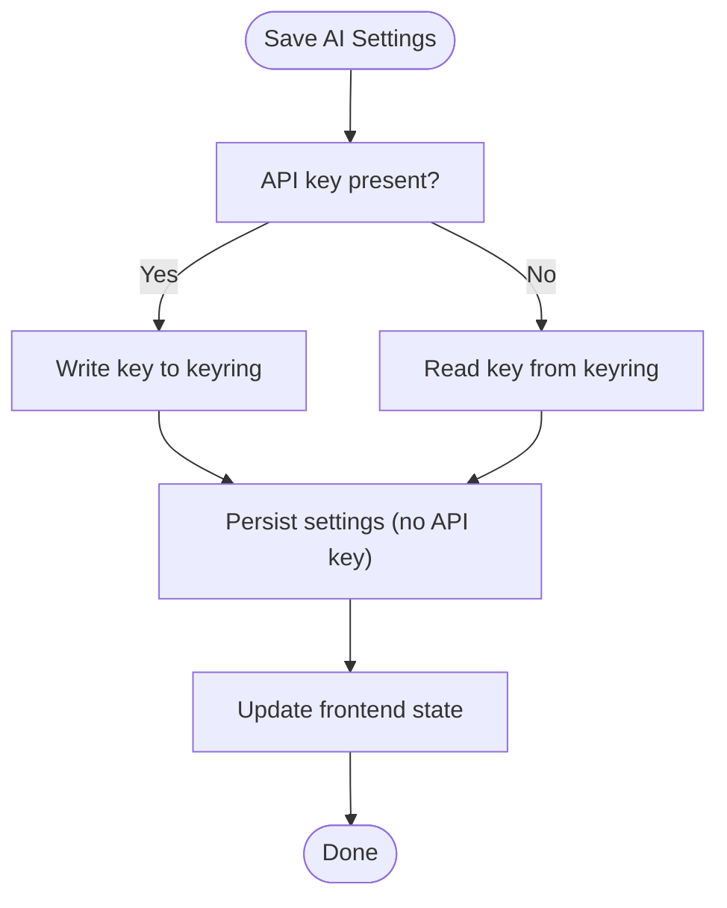
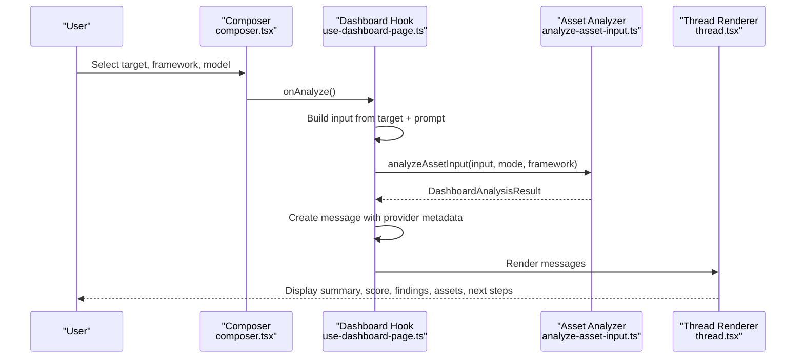
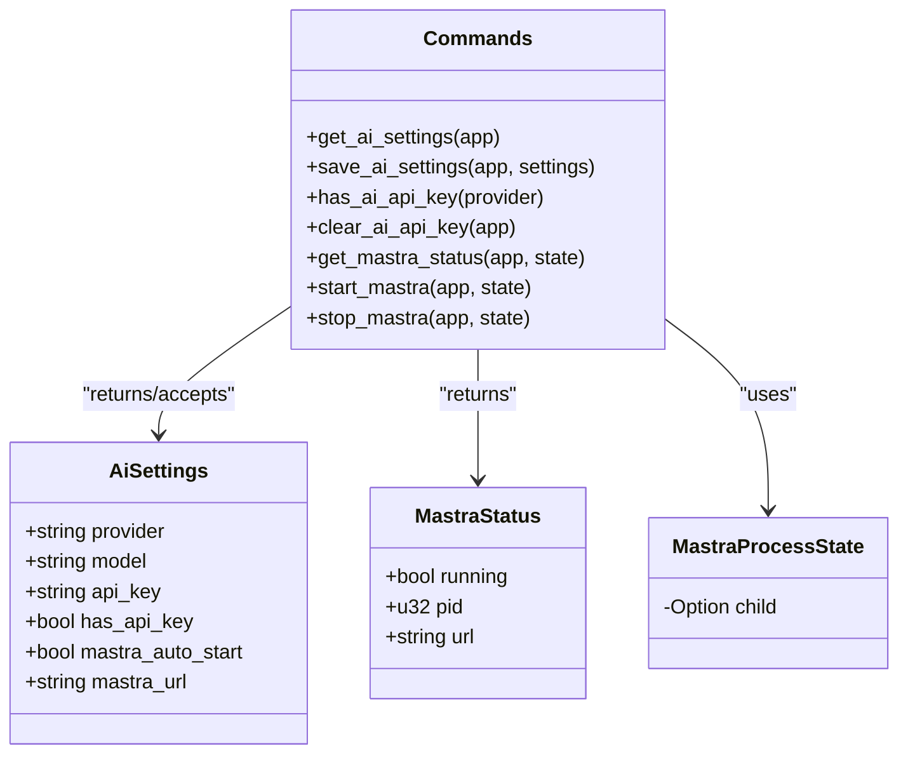
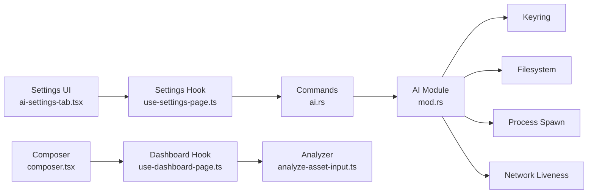

# AI Assistant System

<cite>
**Referenced Files in This Document**
- [ai-settings-tab.tsx](file://src/pages/settings/components/ai-settings-tab.tsx)
- [constants.ts](file://src/pages/settings/constants.ts)
- [use-settings-page.ts](file://src/pages/settings/hooks/use-settings-page.ts)
- [composer.tsx](file://src/pages/ai-chat/components/composer.tsx)
- [thread.tsx](file://src/pages/ai-chat/components/thread.tsx)
- [use-dashboard-page.ts](file://src/pages/ai-chat/hooks/use-dashboard-page.ts)
- [analyze-asset-input.ts](file://src/pages/ai-chat/lib/analyze-asset-input.ts)
- [types.ts](file://src/pages/ai-chat/types.ts)
- [constants.ts](file://src/pages/ai-chat/constants.ts)
- [mod.rs](file://src-tauri/src/ai/mod.rs)
- [ai.rs](file://src-tauri/src/commands/ai.rs)
</cite>

## Table of Contents
1. [Introduction](#introduction)
2. [Project Structure](#project-structure)
3. [Core Components](#core-components)
4. [Architecture Overview](#architecture-overview)
5. [Detailed Component Analysis](#detailed-component-analysis)
6. [Dependency Analysis](#dependency-analysis)
7. [Performance Considerations](#performance-considerations)
8. [Troubleshooting Guide](#troubleshooting-guide)
9. [Conclusion](#conclusion)
10. [Appendices](#appendices)

## Introduction
This document describes the AI Assistant System in AppRecon, focusing on the MCP (Model Context Protocol) server integration via Mastra, provider configuration, and model management. It also covers the AI settings management system for OpenAI and DeepSeek providers, secure API key storage using the system keyring, and auto-start functionality. The conversation management system is documented with thread handling, message composition, and asset analysis capabilities. The AI assistant interface is explained with chat input, message rendering, and real-time conversation flow. Practical examples, prompt engineering techniques for security testing, integration patterns with AppRecon’s traffic analysis features, and guidance on secure AI-assisted penetration testing practices are included.

## Project Structure
The AI Assistant System spans frontend React components and hooks, backend Tauri commands, and Rust modules implementing the MCP/Mastra runtime and keyring-backed settings.

**Diagram sources**
- [ai-settings-tab.tsx:1-185](file://src/pages/settings/components/ai-settings-tab.tsx#L1-L185)
- [use-settings-page.ts:1-291](file://src/pages/settings/hooks/use-settings-page.ts#L1-L291)
- [constants.ts:143-164](file://src/pages/settings/constants.ts#L143-L164)
- [composer.tsx:1-103](file://src/pages/ai-chat/components/composer.tsx#L1-L103)
- [thread.tsx:1-161](file://src/pages/ai-chat/components/thread.tsx#L1-L161)
- [use-dashboard-page.ts:1-90](file://src/pages/ai-chat/hooks/use-dashboard-page.ts#L1-L90)
- [analyze-asset-input.ts:1-269](file://src/pages/ai-chat/lib/analyze-asset-input.ts#L1-L269)
- [types.ts:1-12](file://src/pages/ai-chat/types.ts#L1-L12)
- [constants.ts:58-77](file://src/pages/ai-chat/constants.ts#L58-L77)
- [ai.rs:1-11](file://src-tauri/src/commands/ai.rs#L1-L11)
- [mod.rs:1-398](file://src-tauri/src/ai/mod.rs#L1-L398)

**Section sources**
- [ai-settings-tab.tsx:1-185](file://src/pages/settings/components/ai-settings-tab.tsx#L1-L185)
- [use-settings-page.ts:1-291](file://src/pages/settings/hooks/use-settings-page.ts#L1-L291)
- [constants.ts:143-164](file://src/pages/settings/constants.ts#L143-L164)
- [composer.tsx:1-103](file://src/pages/ai-chat/components/composer.tsx#L1-L103)
- [thread.tsx:1-161](file://src/pages/ai-chat/components/thread.tsx#L1-L161)
- [use-dashboard-page.ts:1-90](file://src/pages/ai-chat/hooks/use-dashboard-page.ts#L1-L90)
- [analyze-asset-input.ts:1-269](file://src/pages/ai-chat/lib/analyze-asset-input.ts#L1-L269)
- [types.ts:1-12](file://src/pages/ai-chat/types.ts#L1-L12)
- [constants.ts:58-77](file://src/pages/ai-chat/constants.ts#L58-L77)
- [ai.rs:1-11](file://src-tauri/src/commands/ai.rs#L1-L11)
- [mod.rs:1-398](file://src-tauri/src/ai/mod.rs#L1-L398)

## Core Components
- AI Settings Management (frontend and backend):
  - Provider selection (OpenAI, DeepSeek), model selection, API key entry, and OS keyring integration.
  - Auto-start toggle and manual start/stop controls for the Mastra runtime.
- Conversation Management:
  - Composer for selecting target, framework, and model; initiating analysis.
  - Thread renderer displaying assistant messages, risk scores, findings, assets, and next steps.
  - Asset analyzer scoring and categorizing security signals from pasted content.
- MCP/Mastra Integration:
  - Backend Rust module manages settings persistence, keyring-backed API keys, Mastra process lifecycle, and environment propagation.

**Section sources**
- [ai-settings-tab.tsx:25-185](file://src/pages/settings/components/ai-settings-tab.tsx#L25-L185)
- [use-settings-page.ts:38-288](file://src/pages/settings/hooks/use-settings-page.ts#L38-L288)
- [composer.tsx:33-103](file://src/pages/ai-chat/components/composer.tsx#L33-L103)
- [thread.tsx:20-161](file://src/pages/ai-chat/components/thread.tsx#L20-L161)
- [analyze-asset-input.ts:56-261](file://src/pages/ai-chat/lib/analyze-asset-input.ts#L56-L261)
- [mod.rs:13-132](file://src-tauri/src/ai/mod.rs#L13-L132)

## Architecture Overview
The AI Assistant System integrates frontend UX with backend Tauri commands and a Rust module that:
- Persists AI settings to the app data directory.
- Stores and retrieves API keys via the OS keyring per provider.
- Starts/stops the Mastra runtime (NPM dev script) and probes its URL for liveness.
- Propagates provider/model and API keys into the Mastra process environment.

**Diagram sources**
- [ai-settings-tab.tsx:25-185](file://src/pages/settings/components/ai-settings-tab.tsx#L25-L185)
- [use-settings-page.ts:174-257](file://src/pages/settings/hooks/use-settings-page.ts#L174-L257)
- [ai.rs:4-11](file://src-tauri/src/commands/ai.rs#L4-L11)
- [mod.rs:58-132](file://src-tauri/src/ai/mod.rs#L58-L132)

## Detailed Component Analysis

### AI Settings Management
- Provider and Model Selection:
  - Provider options include OpenAI and DeepSeek; models are provider-specific.
  - On provider change, models reset and API key fields are cleared; key presence is rechecked.
- API Key Storage:
  - Keys are stored in the OS keyring under service-specific accounts.
  - Saving settings writes the key to keyring and clears the in-memory field before persisting settings.
  - Clearing removes the key from keyring and updates settings accordingly.
- Mastra Runtime Controls:
  - Auto-start flag enables automatic startup on app launch.
  - Manual start/stop spawns the Mastra process via NPM and probes the configured URL for liveness.
  - Environment variables propagate provider, model, and API key to the Mastra process.

**Diagram sources**
- [use-settings-page.ts:174-189](file://src/pages/settings/hooks/use-settings-page.ts#L174-L189)
- [mod.rs:58-70](file://src-tauri/src/ai/mod.rs#L58-L70)
- [mod.rs:379-397](file://src-tauri/src/ai/mod.rs#L379-L397)

**Section sources**
- [constants.ts:143-164](file://src/pages/settings/constants.ts#L143-L164)
- [use-settings-page.ts:150-203](file://src/pages/settings/hooks/use-settings-page.ts#L150-L203)
- [mod.rs:134-159](file://src-tauri/src/ai/mod.rs#L134-L159)
- [mod.rs:379-397](file://src-tauri/src/ai/mod.rs#L379-L397)

### Conversation Management and Asset Analysis
- Composer:
  - Allows selecting a target from the library, choosing an analysis framework, and selecting a model.
  - Triggers analysis when a target is selected.
- Dashboard Hook:
  - Builds analysis input from the selected target and optional prompt.
  - Calls the asset analyzer to produce findings, assets, and next steps.
  - Stores messages with provider metadata and renders them in the thread.
- Asset Analyzer:
  - Extracts URLs, hosts, IPs, emails, cloud storage identifiers, and tech signals.
  - Detects potential credential exposure, sensitive environments, CORS misconfigurations, and verbose errors.
  - Scores findings and ranks severity; produces actionable next steps aligned with frameworks.

**Diagram sources**
- [composer.tsx:33-103](file://src/pages/ai-chat/components/composer.tsx#L33-L103)
- [use-dashboard-page.ts:47-70](file://src/pages/ai-chat/hooks/use-dashboard-page.ts#L47-L70)
- [analyze-asset-input.ts:56-261](file://src/pages/ai-chat/lib/analyze-asset-input.ts#L56-L261)
- [thread.tsx:52-156](file://src/pages/ai-chat/components/thread.tsx#L52-L156)

**Section sources**
- [composer.tsx:33-103](file://src/pages/ai-chat/components/composer.tsx#L33-L103)
- [use-dashboard-page.ts:21-89](file://src/pages/ai-chat/hooks/use-dashboard-page.ts#L21-L89)
- [analyze-asset-input.ts:56-261](file://src/pages/ai-chat/lib/analyze-asset-input.ts#L56-L261)
- [thread.tsx:20-161](file://src/pages/ai-chat/components/thread.tsx#L20-L161)
- [types.ts:4-11](file://src/pages/ai-chat/types.ts#L4-L11)
- [constants.ts:58-77](file://src/pages/ai-chat/constants.ts#L58-L77)

### MCP/Mastra Integration and Provider Setup
- Backend Commands:
  - Expose commands for getting/setting AI settings, checking API key presence, clearing keys, and managing Mastra status/start/stop.
- Rust AI Module:
  - Defines settings structure, default values, and Mastra status.
  - Implements keyring-backed storage and retrieval for provider-specific accounts.
  - Manages Mastra process lifecycle, environment propagation, and URL liveness checks.
  - Reads optional Mastra environment file and injects variables into the spawned process.

**Diagram sources**
- [mod.rs:13-45](file://src-tauri/src/ai/mod.rs#L13-L45)
- [ai.rs:1-11](file://src-tauri/src/commands/ai.rs#L1-L11)

**Section sources**
- [ai.rs:1-11](file://src-tauri/src/commands/ai.rs#L1-L11)
- [mod.rs:13-132](file://src-tauri/src/ai/mod.rs#L13-L132)
- [mod.rs:196-280](file://src-tauri/src/ai/mod.rs#L196-L280)

## Dependency Analysis
- Frontend-to-Backend:
  - Settings UI invokes Tauri commands to manage AI settings and Mastra runtime.
  - Dashboard UI composes inputs and renders results produced by the asset analyzer.
- Backend Dependencies:
  - Keyring crate for secure API key storage.
  - Process spawning and environment variable propagation for Mastra.
  - JSON serialization/deserialization for settings persistence.

**Diagram sources**
- [ai-settings-tab.tsx:25-185](file://src/pages/settings/components/ai-settings-tab.tsx#L25-L185)
- [use-settings-page.ts:174-257](file://src/pages/settings/hooks/use-settings-page.ts#L174-L257)
- [ai.rs:1-11](file://src-tauri/src/commands/ai.rs#L1-L11)
- [mod.rs:379-397](file://src-tauri/src/ai/mod.rs#L379-L397)
- [composer.tsx:33-103](file://src/pages/ai-chat/components/composer.tsx#L33-L103)
- [use-dashboard-page.ts:47-70](file://src/pages/ai-chat/hooks/use-dashboard-page.ts#L47-L70)
- [analyze-asset-input.ts:56-261](file://src/pages/ai-chat/lib/analyze-asset-input.ts#L56-L261)

**Section sources**
- [mod.rs:379-397](file://src-tauri/src/ai/mod.rs#L379-L397)
- [mod.rs:227-262](file://src-tauri/src/ai/mod.rs#L227-L262)

## Performance Considerations
- Local-first analysis:
  - The dashboard performs local analysis and displays results immediately, reducing latency compared to remote calls.
- Efficient asset extraction:
  - Regex-based extraction and early filtering minimize overhead during input parsing.
- Mastra startup:
  - The system probes the Mastra URL to avoid unnecessary restarts and only spawns the process when needed.
- Recommendations:
  - Prefer local analysis for initial triage; offload heavy reasoning to Mastra only when required.
  - Batch requests to Mastra to reduce process spawn frequency.
  - Cache frequently used settings and environment variables to avoid repeated reads.

[No sources needed since this section provides general guidance]

## Troubleshooting Guide
- API key not applied:
  - Verify the key is present in the OS keyring for the selected provider.
  - Confirm saving settings writes the key and that the in-memory field is cleared.
- Mastra not starting:
  - Ensure the Mastra directory contains a package manifest and that the NPM command is available.
  - Check Mastra URL liveness; the system probes the configured address/port.
  - Review environment variables propagated to the process (provider, model, API key).
- Auto-start not working:
  - Confirm the auto-start flag is enabled and that the app loads settings on startup.
  - Manually start Mastra to validate the process lifecycle.

**Section sources**
- [mod.rs:379-397](file://src-tauri/src/ai/mod.rs#L379-L397)
- [mod.rs:227-280](file://src-tauri/src/ai/mod.rs#L227-L280)
- [use-settings-page.ts:174-257](file://src/pages/settings/hooks/use-settings-page.ts#L174-L257)

## Conclusion
The AI Assistant System in AppRecon combines a secure settings and keyring-backed configuration with a flexible conversation interface and asset analysis pipeline. The MCP/Mastra integration is managed through Tauri commands and a Rust module that ensures safe, reliable operation. Users can configure providers and models, securely store API keys, and leverage local and remote analysis for efficient security assessments.

[No sources needed since this section summarizes without analyzing specific files]

## Appendices

### Practical Examples and Prompt Engineering
- Surface analysis:
  - Paste raw logs or traffic captures; the analyzer detects URLs, hosts, IPs, emails, and storage references, then ranks findings by severity.
- OWASP frameworks:
  - Use the OWASP API Top 10 or Web Top 10 frameworks to focus on specific threat categories.
- Analyst prompts:
  - Add contextual prompts to refine the analysis scope (e.g., “Focus on authentication and authorization gaps”).
- Integration with traffic analysis:
  - Combine live traffic insights with AI-generated findings to prioritize remediation steps.

[No sources needed since this section provides general guidance]

### Secure AI-Assisted Penetration Testing Practices
- Least privilege:
  - Store API keys in the OS keyring; avoid embedding secrets in code or configs.
- Principle of least exposure:
  - Limit the data sent to external providers; redact sensitive information before sending.
- Audit trail:
  - Keep track of provider/model usage and maintain logs of AI-assisted decisions.
- Validation:
  - Treat AI outputs as hypotheses; validate findings manually before taking action.

[No sources needed since this section provides general guidance]