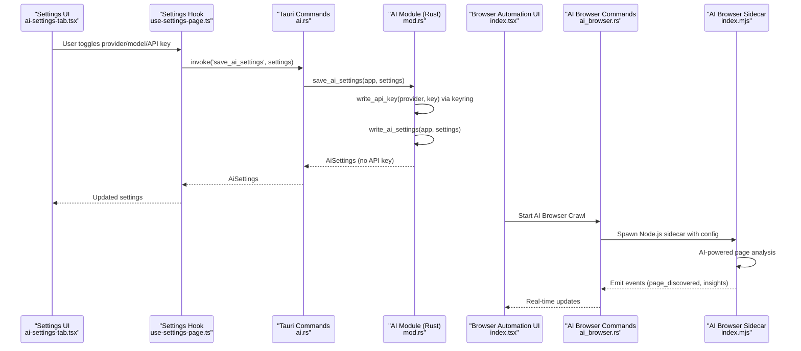
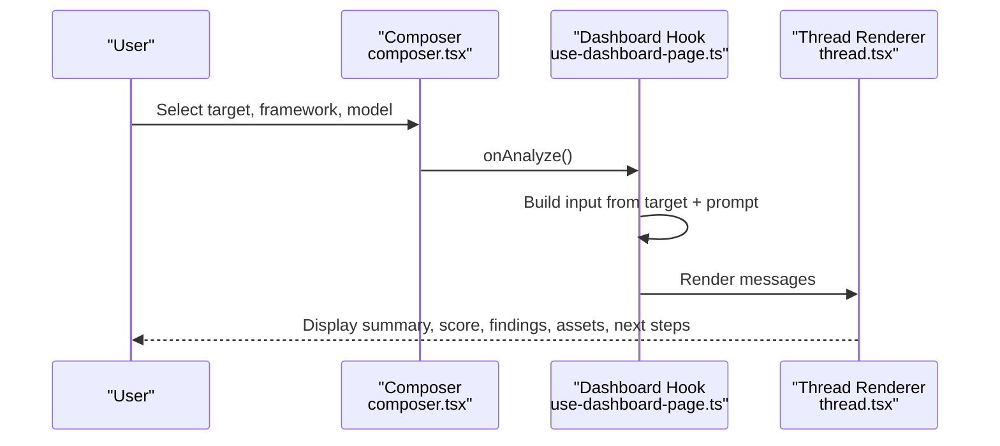
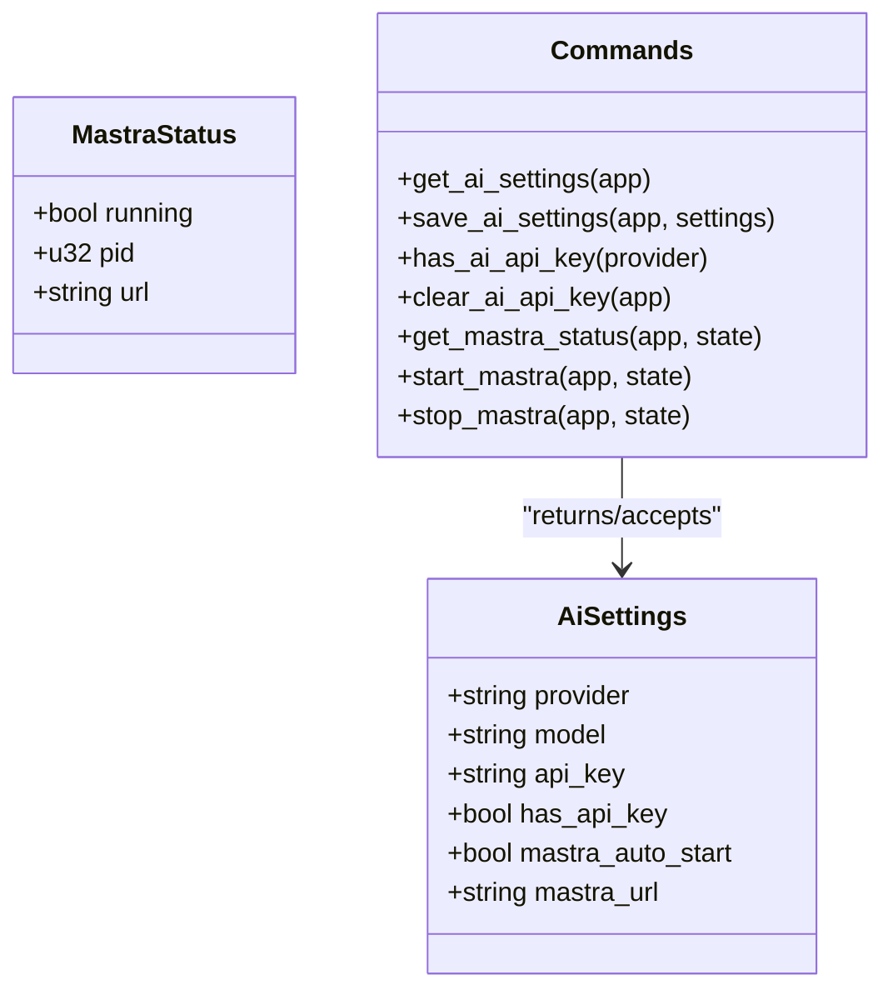
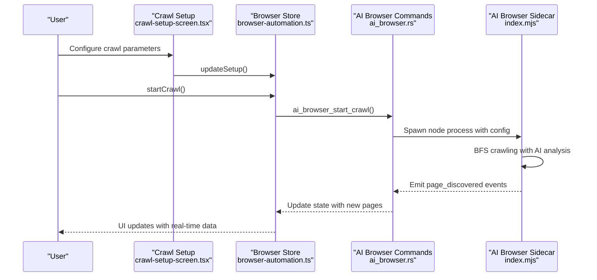
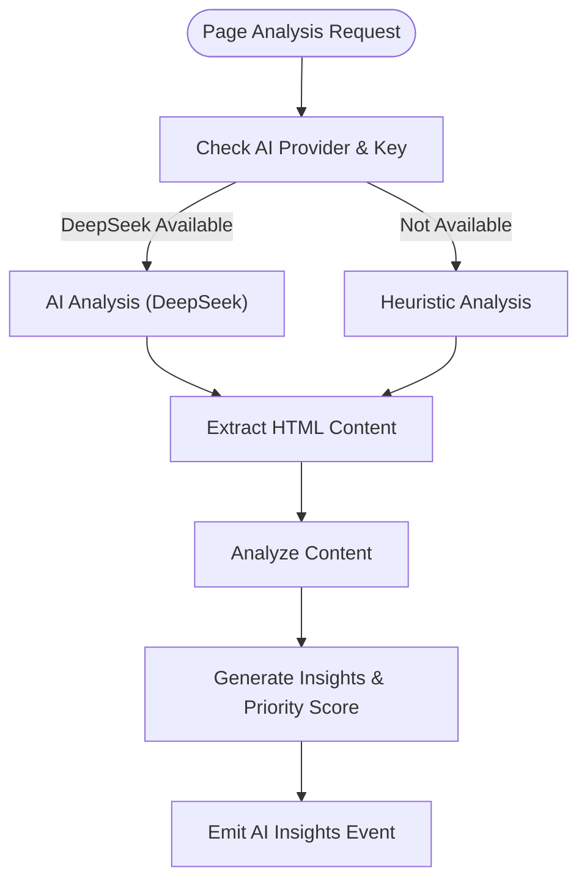
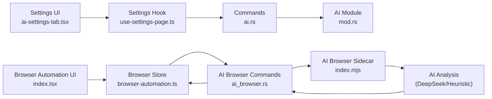

# AI Assistant System

<cite>
**Referenced Files in This Document**
- [ai-settings-tab.tsx](file://src/pages/settings/components/ai-settings-tab.tsx)
- [constants.ts](file://src/pages/settings/constants.ts)
- [use-settings-page.ts](file://src/pages/settings/hooks/use-settings-page.ts)
- [composer.tsx](file://src/pages/ai-chat/components/composer.tsx)
- [thread.tsx](file://src/pages/ai-chat/components/thread.tsx)
- [use-dashboard-page.ts](file://src/pages/ai-chat/hooks/use-dashboard-page.ts)
- [types.ts](file://src/pages/ai-chat/types.ts)
- [constants.ts](file://src/pages/ai-chat/constants.ts)
- [mod.rs](file://src-tauri/src/ai/mod.rs)
- [ai.rs](file://src-tauri/src/commands/ai.rs)
- [ai_browser.rs](file://src-tauri/src/ai_browser.rs)
- [index.tsx](file://src/pages/browser-automation/index.tsx)
- [types.ts](file://src/pages/browser-automation/types.ts)
- [crawl-setup-screen.tsx](file://src/pages/browser-automation/components/crawl-setup-screen.tsx)
- [use-browser-automation-page.ts](file://src/pages/browser-automation/hooks/use-browser-automation-page.ts)
- [browser-automation.ts](file://src/stores/browser-automation.ts)
- [index.mjs](file://scripts/ai-browser-sidecar/index.mjs)
- [index.tsx](file://src/pages/ai-tools/index.tsx)
- [prompt-injection/index.tsx](file://src/pages/ai-tools/components/prompt-injection/index.tsx)
- [app.tsx](file://src/app.tsx)
</cite>

## Update Summary
**Changes Made**
- Added comprehensive AI Browser Automation capabilities with new dedicated page and sidecar architecture
- Expanded AI services with integrated prompt injection testing tools
- Enhanced AI-assisted penetration testing workflows with automated crawling and insights
- Integrated AI-powered reconnaissance with DeepSeek analysis and heuristic fallback
- Added real-time activity logging and AI insights panel for browser automation sessions

## Table of Contents
1. [Introduction](#introduction)
2. [Project Structure](#project-structure)
3. [Core Components](#core-components)
4. [Architecture Overview](#architecture-overview)
5. [Detailed Component Analysis](#detailed-component-analysis)
6. [AI Browser Automation System](#ai-browser-automation-system)
7. [AI Tools and Prompt Injection](#ai-tools-and-prompt-injection)
8. [Enhanced AI Services](#enhanced-ai-services)
9. [Dependency Analysis](#dependency-analysis)
10. [Performance Considerations](#performance-considerations)
11. [Troubleshooting Guide](#troubleshooting-guide)
12. [Conclusion](#conclusion)
13. [Appendices](#appendices)

## Introduction
This document describes the AI Assistant System in AppRecon, focusing on the enhanced AI integration with new AI Browser Automation capabilities, expanded AI services, and improved AI-assisted penetration testing workflows. The system now includes comprehensive browser automation with AI-powered reconnaissance, integrated prompt injection testing tools, and advanced conversation management with thread handling, message composition, and asset analysis capabilities.

The AI Assistant System spans frontend React components and hooks, backend Tauri commands, and Rust modules implementing the MCP/Mastra runtime, AI browser automation sidecar, and keyring-backed settings. It provides secure API key storage using the system keyring, auto-start functionality, and real-time conversation flow with enhanced AI-assisted workflows.

## Project Structure
The AI Assistant System now encompasses multiple specialized components including AI chat interfaces, browser automation capabilities, and AI tools for penetration testing.

```mermaid
graph TB
subgraph "Frontend - AI Chat"
AIST["AI Settings Tab<br/>ai-settings-tab.tsx"]
USET["Settings Hook<br/>use-settings-page.ts"]
COMPOSER["Composer<br/>composer.tsx"]
THREAD["Thread Renderer<br/>thread.tsx"]
DASHHOOK["Dashboard Hook<br/>use-dashboard-page.ts"]
TYPES["Types<br/>types.ts"]
end
subgraph "Frontend - Browser Automation"
BA_PAGE["Browser Automation Page<br/>index.tsx"]
BA_SETUP["Crawl Setup Screen<br/>crawl-setup-screen.tsx"]
BA_HOOK["Browser Automation Hook<br/>use-browser-automation-page.ts"]
BA_STORE["Browser Store<br/>browser-automation.ts"]
end
subgraph "Frontend - AI Tools"
AITOOLS["AI Tools Page<br/>index.tsx"]
PROMPT_INJ["Prompt Injection Tool<br/>prompt-injection/index.tsx"]
end
subgraph "Backend (Tauri)"
CMD["AI Commands Export<br/>ai.rs"]
MOD["AI Module (Rust)<br/>mod.rs"]
AB_CMD["AI Browser Commands<br/>ai_browser.rs"]
END
AIST --> USET
USET --> CMD
CMD --> MOD
COMPOSER --> DASHHOOK
THREAD --> TYPES
BA_PAGE --> BA_HOOK
BA_HOOK --> BA_STORE
BA_SETUP --> BA_PAGE
AITOOLS --> PROMPT_INJ
AB_CMD --> BA_PAGE
```

**Diagram sources**
- [ai-settings-tab.tsx:1-185](file://src/pages/settings/components/ai-settings-tab.tsx#L1-L185)
- [use-settings-page.ts:1-291](file://src/pages/settings/hooks/use-settings-page.ts#L1-L291)
- [composer.tsx:1-94](file://src/pages/ai-chat/components/composer.tsx#L1-L94)
- [thread.tsx:1-161](file://src/pages/ai-chat/components/thread.tsx#L1-L161)
- [use-dashboard-page.ts:1-103](file://src/pages/ai-chat/hooks/use-dashboard-page.ts#L1-L103)
- [types.ts:1-12](file://src/pages/ai-chat/types.ts#L1-L12)
- [index.tsx:1-163](file://src/pages/browser-automation/index.tsx#L1-L163)
- [crawl-setup-screen.tsx:1-180](file://src/pages/browser-automation/components/crawl-setup-screen.tsx#L1-L180)
- [use-browser-automation-page.ts:1-61](file://src/pages/browser-automation/hooks/use-browser-automation-page.ts#L1-L61)
- [browser-automation.ts:1-139](file://src/stores/browser-automation.ts#L1-L139)
- [index.tsx:1-24](file://src/pages/ai-tools/index.tsx#L1-L24)
- [prompt-injection/index.tsx:1-78](file://src/pages/ai-tools/components/prompt-injection/index.tsx#L1-L78)
- [ai.rs:1-11](file://src-tauri/src/commands/ai.rs#L1-L11)
- [mod.rs:1-398](file://src-tauri/src/ai/mod.rs#L1-L398)
- [ai_browser.rs:1-744](file://src-tauri/src/ai_browser.rs#L1-L744)

**Section sources**
- [ai-settings-tab.tsx:1-185](file://src/pages/settings/components/ai-settings-tab.tsx#L1-L185)
- [use-settings-page.ts:1-291](file://src/pages/settings/hooks/use-settings-page.ts#L1-L291)
- [composer.tsx:1-94](file://src/pages/ai-chat/components/composer.tsx#L1-L94)
- [thread.tsx:1-161](file://src/pages/ai-chat/components/thread.tsx#L1-L161)
- [use-dashboard-page.ts:1-103](file://src/pages/ai-chat/hooks/use-dashboard-page.ts#L1-L103)
- [types.ts:1-12](file://src/pages/ai-chat/types.ts#L1-L12)
- [index.tsx:1-163](file://src/pages/browser-automation/index.tsx#L1-L163)
- [crawl-setup-screen.tsx:1-180](file://src/pages/browser-automation/components/crawl-setup-screen.tsx#L1-L180)
- [use-browser-automation-page.ts:1-61](file://src/pages/browser-automation/hooks/use-browser-automation-page.ts#L1-L61)
- [browser-automation.ts:1-139](file://src/stores/browser-automation.ts#L1-L139)
- [index.tsx:1-24](file://src/pages/ai-tools/index.tsx#L1-L24)
- [prompt-injection/index.tsx:1-78](file://src/pages/ai-tools/components/prompt-injection/index.tsx#L1-L78)
- [ai.rs:1-11](file://src-tauri/src/commands/ai.rs#L1-L11)
- [mod.rs:1-398](file://src-tauri/src/ai/mod.rs#L1-L398)
- [ai_browser.rs:1-744](file://src-tauri/src/ai_browser.rs#L1-L744)

## Core Components
- **AI Settings Management**: Provider selection (OpenAI, DeepSeek), model selection, API key entry, OS keyring integration, and Mastra runtime controls.
- **Conversation Management**: Composer for selecting target, framework, and model; thread renderer displaying assistant messages, risk scores, findings, assets, and next steps.
- **AI Browser Automation**: Dedicated browser automation system with BFS crawling, AI-powered insights, activity logging, and real-time session management.
- **AI Tools**: Integrated prompt injection testing tools for security assessment workflows.
- **MCP/Mastra Integration**: Backend Rust module manages settings persistence, keyring-backed API keys, Mastra process lifecycle, and environment propagation.

**Section sources**
- [ai-settings-tab.tsx:25-185](file://src/pages/settings/components/ai-settings-tab.tsx#L25-L185)
- [use-settings-page.ts:38-288](file://src/pages/settings/hooks/use-settings-page.ts#L38-L288)
- [composer.tsx:33-94](file://src/pages/ai-chat/components/composer.tsx#L33-L94)
- [thread.tsx:20-161](file://src/pages/ai-chat/components/thread.tsx#L20-L161)
- [index.tsx:14-163](file://src/pages/browser-automation/index.tsx#L14-L163)
- [index.tsx:1-24](file://src/pages/ai-tools/index.tsx#L1-L24)
- [mod.rs:13-132](file://src-tauri/src/ai/mod.rs#L13-L132)

## Architecture Overview
The enhanced AI Assistant System integrates multiple specialized components with frontend UX, backend Tauri commands, and Rust modules implementing various AI services and browser automation capabilities.



**Diagram sources**
- [ai-settings-tab.tsx:25-185](file://src/pages/settings/components/ai-settings-tab.tsx#L25-L185)
- [use-settings-page.ts:174-257](file://src/pages/settings/hooks/use-settings-page.ts#L174-L257)
- [ai.rs:4-11](file://src-tauri/src/commands/ai.rs#L4-L11)
- [mod.rs:58-132](file://src-tauri/src/ai/mod.rs#L58-L132)
- [index.tsx:14-163](file://src/pages/browser-automation/index.tsx#L14-L163)
- [ai_browser.rs:490-595](file://src-tauri/src/ai_browser.rs#L490-L595)
- [index.mjs:338-445](file://scripts/ai-browser-sidecar/index.mjs#L338-L445)

## Detailed Component Analysis

### AI Settings Management
- **Provider and Model Selection**: Provider options include OpenAI and DeepSeek; models are provider-specific. On provider change, models reset and API key fields are cleared; key presence is rechecked.
- **API Key Storage**: Keys are stored in the OS keyring under service-specific accounts. Saving settings writes the key to keyring and clears the in-memory field before persisting settings.
- **Mastra Runtime Controls**: Auto-start flag enables automatic startup on app launch. Manual start/stop spawns the Mastra process via NPM and probes the configured URL for liveness.


**Diagram sources**
- [use-settings-page.ts:174-189](file://src/pages/settings/hooks/use-settings-page.ts#L174-L189)
- [mod.rs:58-70](file://src-tauri/src/ai/mod.rs#L58-L70)
- [mod.rs:379-397](file://src-tauri/src/ai/mod.rs#L379-L397)

**Section sources**
- [constants.ts:143-164](file://src/pages/settings/constants.ts#L143-L164)
- [use-settings-page.ts:150-203](file://src/pages/settings/hooks/use-settings-page.ts#L150-L203)
- [mod.rs:134-159](file://src-tauri/src/ai/mod.rs#L134-L159)
- [mod.rs:379-397](file://src-tauri/src/ai/mod.rs#L379-L397)

### Conversation Management
- **Composer**: Allows selecting a target from the library, choosing an analysis framework, and selecting a model. Triggers analysis when a target is selected.
- **Dashboard Hook**: Builds analysis input from the selected target and optional prompt. Calls the asset analyzer to produce findings, assets, and next steps.
- **Thread Renderer**: Displays messages with provider metadata, risk scores, findings, assets, and next steps.



**Diagram sources**
- [composer.tsx:33-94](file://src/pages/ai-chat/components/composer.tsx#L33-L94)
- [use-dashboard-page.ts:62-87](file://src/pages/ai-chat/hooks/use-dashboard-page.ts#L62-L87)
- [thread.tsx:52-156](file://src/pages/ai-chat/components/thread.tsx#L52-L156)

**Section sources**
- [composer.tsx:33-94](file://src/pages/ai-chat/components/composer.tsx#L33-L94)
- [use-dashboard-page.ts:21-103](file://src/pages/ai-chat/hooks/use-dashboard-page.ts#L21-L103)
- [thread.tsx:20-161](file://src/pages/ai-chat/components/thread.tsx#L20-L161)
- [types.ts:4-11](file://src/pages/ai-chat/types.ts#L4-L11)
- [constants.ts:58-77](file://src/pages/ai-chat/constants.ts#L58-L77)

### MCP/Mastra Integration and Provider Setup
- **Backend Commands**: Expose commands for getting/setting AI settings, checking API key presence, clearing keys, and managing Mastra status/start/stop.
- **Rust AI Module**: Defines settings structure, default values, and Mastra status. Implements keyring-backed storage and retrieval for provider-specific accounts.



**Diagram sources**
- [mod.rs:13-45](file://src-tauri/src/ai/mod.rs#L13-L45)
- [ai.rs:1-11](file://src-tauri/src/commands/ai.rs#L1-L11)

**Section sources**
- [ai.rs:1-11](file://src-tauri/src/commands/ai.rs#L1-L11)
- [mod.rs:13-132](file://src-tauri/src/ai/mod.rs#L13-L132)

## AI Browser Automation System
The AI Browser Automation system provides comprehensive web crawling capabilities with AI-powered insights and real-time monitoring.

### Core Components
- **Browser Automation Page**: Main interface for managing crawl sessions with resizable panels for activity logs, crawl overview, and AI insights.
- **Crawl Setup Screen**: Configuration interface for target URL, crawl limits, scope rules, timing, and AI analysis options.
- **AI Browser Commands**: Tauri commands for controlling crawl sessions, managing state, and retrieving historical data.
- **AI Browser Sidecar**: Node.js process that handles actual crawling, AI analysis, and event emission.

### Crawl Configuration and Control
- **Configuration Options**: Target URL, max depth, max pages, same-domain only, include/exclude paths, request delay, timeout, and AI insights toggle.
- **Session Management**: Start, pause, resume, and stop crawl operations with real-time status updates.
- **Real-time Monitoring**: Activity logs, crawl tree visualization, and AI insights panel with filtering capabilities.



**Diagram sources**
- [crawl-setup-screen.tsx:31-179](file://src/pages/browser-automation/components/crawl-setup-screen.tsx#L31-L179)
- [browser-automation.ts:101-139](file://src/stores/browser-automation.ts#L101-L139)
- [ai_browser.rs:490-595](file://src-tauri/src/ai_browser.rs#L490-L595)
- [index.mjs:338-445](file://scripts/ai-browser-sidecar/index.mjs#L338-L445)

**Section sources**
- [index.tsx:14-163](file://src/pages/browser-automation/index.tsx#L14-L163)
- [types.ts:15-26](file://src/pages/browser-automation/types.ts#L15-L26)
- [crawl-setup-screen.tsx:31-179](file://src/pages/browser-automation/components/crawl-setup-screen.tsx#L31-L179)
- [use-browser-automation-page.ts:23-61](file://src/pages/browser-automation/hooks/use-browser-automation-page.ts#L23-L61)
- [browser-automation.ts:46-139](file://src/stores/browser-automation.ts#L46-L139)
- [ai_browser.rs:490-744](file://src-tauri/src/ai_browser.rs#L490-L744)

### AI-Powered Page Analysis
The AI Browser Sidecar implements sophisticated page analysis using both AI and heuristic approaches:

- **Heuristic Analysis**: Identifies login pages, admin routes, upload forms, and error pages based on URL patterns and HTML content.
- **AI Analysis (DeepSeek)**: Provides comprehensive page understanding with structured insights, priority scoring, and actionable recommendations.
- **Fallback Mechanism**: Automatically falls back to heuristic analysis when AI is unavailable or misconfigured.



**Diagram sources**
- [index.mjs:269-336](file://scripts/ai-browser-sidecar/index.mjs#L269-L336)
- [index.mjs:212-267](file://scripts/ai-browser-sidecar/index.mjs#L212-L267)

**Section sources**
- [index.mjs:269-336](file://scripts/ai-browser-sidecar/index.mjs#L269-L336)
- [index.mjs:212-267](file://scripts/ai-browser-sidecar/index.mjs#L212-L267)
- [ai_browser.rs:317-340](file://src-tauri/src/ai_browser.rs#L317-L340)

## AI Tools and Prompt Injection
The AI Tools system provides integrated security testing capabilities with prompt injection testing and payload management.

### Prompt Injection Testing
- **Payload Management**: Comprehensive payload dialog with manual entry, file import, and bundled payload support.
- **Attack Configuration**: Flexible attack settings with endpoint specification, attack type selection, and payload mode configuration.
- **Real-time Results**: Interactive result pane with success/anomaly tracking, response copying, and export capabilities.

### Integration with Browser Automation
The AI Tools complement the browser automation system by providing targeted security testing capabilities that can be combined with automated reconnaissance workflows.

**Section sources**
- [index.tsx:8-23](file://src/pages/ai-tools/index.tsx#L8-L23)
- [prompt-injection/index.tsx:13-77](file://src/pages/ai-tools/components/prompt-injection/index.tsx#L13-L77)

## Enhanced AI Services
The system now provides expanded AI services beyond basic chat functionality:

### Multi-Modal AI Capabilities
- **Browser Automation Insights**: AI-powered page analysis with structured insights and priority scoring
- **Prompt Injection Testing**: Automated security payload testing with comprehensive result tracking
- **Real-time Session Management**: Live crawl monitoring with activity logging and status updates
- **Integrated Workflows**: Seamless combination of automated reconnaissance with targeted security testing

### Advanced Data Persistence
- **Historical Session Storage**: Complete crawl session data with pages, insights, and logs
- **Structured Data Models**: Well-defined schemas for crawl sessions, pages, AI insights, and activity logs
- **Event-Driven Architecture**: Real-time updates through Tauri event system

**Section sources**
- [types.ts:28-94](file://src/pages/browser-automation/types.ts#L28-L94)
- [ai_browser.rs:85-91](file://src-tauri/src/ai_browser.rs#L85-L91)
- [ai_browser.rs:666-743](file://src-tauri/src/ai_browser.rs#L666-L743)

## Dependency Analysis
The enhanced system introduces new dependencies and integration points:

- **Frontend-to-Backend**: Settings UI invokes Tauri commands for AI management; browser automation UI communicates with AI browser commands.
- **Backend Dependencies**: Keyring crate for secure API storage, process spawning for AI browser sidecar, JSON serialization for configuration persistence.
- **Cross-Component Communication**: Real-time event system connecting browser automation UI with backend commands and sidecar processes.



**Diagram sources**
- [ai-settings-tab.tsx:25-185](file://src/pages/settings/components/ai-settings-tab.tsx#L25-L185)
- [use-settings-page.ts:174-257](file://src/pages/settings/hooks/use-settings-page.ts#L174-L257)
- [ai.rs:1-11](file://src-tauri/src/commands/ai.rs#L1-L11)
- [mod.rs:379-397](file://src-tauri/src/ai/mod.rs#L379-L397)
- [index.tsx:14-163](file://src/pages/browser-automation/index.tsx#L14-L163)
- [browser-automation.ts:101-139](file://src/stores/browser-automation.ts#L101-L139)
- [ai_browser.rs:490-595](file://src-tauri/src/ai_browser.rs#L490-L595)
- [index.mjs:269-336](file://scripts/ai-browser-sidecar/index.mjs#L269-L336)

**Section sources**
- [mod.rs:379-397](file://src-tauri/src/ai/mod.rs#L379-L397)
- [ai_browser.rs:409-487](file://src-tauri/src/ai_browser.rs#L409-L487)
- [browser-automation.ts:1-139](file://src/stores/browser-automation.ts#L1-139)

## Performance Considerations
- **Local-first analysis**: The dashboard performs local analysis and displays results immediately, reducing latency compared to remote calls.
- **Efficient asset extraction**: Regex-based extraction and early filtering minimize overhead during input parsing.
- **Mastra startup**: The system probes the Mastra URL to avoid unnecessary restarts and only spawns the process when needed.
- **Browser automation optimization**: AI Browser Sidecar uses BFS crawling with configurable limits and intelligent URL blocking to prevent resource exhaustion.
- **Real-time streaming**: AI browser events are streamed in real-time to avoid polling overhead and provide immediate feedback.
- **Memory management**: Browser automation state is efficiently managed with proper cleanup and memory optimization for long-running crawls.

## Troubleshooting Guide
- **API key not applied**: Verify the key is present in the OS keyring for the selected provider. Confirm saving settings writes the key and that the in-memory field is cleared.
- **Mastra not starting**: Ensure the Mastra directory contains a package manifest and that the NPM command is available. Check Mastra URL liveness; the system probes the configured address/port.
- **AI Browser Sidecar failing**: Verify Node.js is available in PATH, check that the sidecar script exists in the expected location, and ensure APPRECON_CRAWL_CONFIG_JSON environment variable is properly formatted.
- **Crawl not progressing**: Check proxy configuration (APPRECON_PROXY_PORT), verify target URL accessibility, and review activity logs for specific error messages.
- **AI insights not appearing**: Ensure AI insights are enabled in crawl configuration and that a valid API key is configured for the selected provider.
- **Auto-start not working**: Confirm the auto-start flag is enabled and that the app loads settings on startup. Manually start Mastra to validate the process lifecycle.

**Section sources**
- [mod.rs:379-397](file://src-tauri/src/ai/mod.rs#L379-L397)
- [mod.rs:227-280](file://src-tauri/src/ai/mod.rs#L227-L280)
- [use-settings-page.ts:174-257](file://src/pages/settings/hooks/use-settings-page.ts#L174-L257)
- [ai_browser.rs:409-487](file://src-tauri/src/ai_browser.rs#L409-L487)
- [index.mjs:20-31](file://scripts/ai-browser-sidecar/index.mjs#L20-L31)

## Conclusion
The enhanced AI Assistant System in AppRecon now provides comprehensive AI-powered capabilities including dedicated browser automation with AI insights, integrated prompt injection testing tools, and advanced conversation management. The system combines secure settings and keyring-backed configuration with flexible conversation interfaces, automated reconnaissance workflows, and real-time monitoring capabilities. The MCP/Mastra integration is managed through Tauri commands and Rust modules that ensure safe, reliable operation across multiple AI services.

## Appendices

### Practical Examples and Prompt Engineering
- **Surface analysis**: Paste raw logs or traffic captures; the analyzer detects URLs, hosts, IPs, emails, and storage references, then ranks findings by severity.
- **OWASP frameworks**: Use the OWASP API Top 10 or Web Top 10 frameworks to focus on specific threat categories.
- **Analyst prompts**: Add contextual prompts to refine the analysis scope (e.g., "Focus on authentication and authorization gaps").
- **Integration with traffic analysis**: Combine live traffic insights with AI-generated findings to prioritize remediation steps.
- **Browser automation workflows**: Use AI-powered crawling to systematically discover vulnerabilities across target applications.
- **Prompt injection testing**: Leverage integrated tools to test application security against injection attacks with comprehensive result tracking.

### Secure AI-Assisted Penetration Testing Practices
- **Least privilege**: Store API keys in the OS keyring; avoid embedding secrets in code or configs.
- **Principle of least exposure**: Limit the data sent to external providers; redact sensitive information before sending.
- **Audit trail**: Keep track of provider/model usage and maintain logs of AI-assisted decisions.
- **Validation**: Treat AI outputs as hypotheses; validate findings manually before taking action.
- **Controlled testing**: Use AI Browser Automation with configurable limits and scope rules to prevent unintended system impact.
- **Real-time monitoring**: Utilize activity logs and insights panels to track testing progress and identify potential issues.

### AI Browser Automation Best Practices
- **Configurable crawling**: Adjust max depth, max pages, and request delays based on target characteristics and testing objectives.
- **Scope management**: Use include/exclude patterns and same-domain-only settings to focus testing on relevant areas.
- **AI analysis tuning**: Enable AI insights for comprehensive analysis or use heuristic-only mode for faster, rule-based detection.
- **Resource management**: Monitor crawl progress and adjust configuration to prevent excessive resource consumption.
- **Integration workflows**: Combine automated crawling with manual testing approaches for comprehensive security assessment.