# AI Integration

<cite>
**Referenced Files in This Document**
- [src-tauri/src/ai/mod.rs](file://src-tauri/src/ai/mod.rs)
- [src-tauri/src/commands/ai.rs](file://src-tauri/src/commands/ai.rs)
- [src-tauri/src/ai_browser.rs](file://src-tauri/src/ai_browser.rs)
- [src-tauri/src/lib.rs](file://src-tauri/src/lib.rs)
- [src/pages/settings/components/ai-settings-tab.tsx](file://src/pages/settings/components/ai-settings-tab.tsx)
- [src/pages/settings/hooks/use-settings-page.ts](file://src/pages/settings/hooks/use-settings-page.ts)
- [src/pages/ai-chat/components/composer.tsx](file://src/pages/ai-chat/components/composer.tsx)
- [src/pages/ai-chat/hooks/use-dashboard-page.ts](file://src/pages/ai-chat/hooks/use-dashboard-page.ts)
- [src/pages/ai-chat/lib/dashboard-chat-transport.ts](file://src/pages/ai-chat/lib/dashboard-chat-transport.ts)
- [src/pages/ai-chat/types.ts](file://src/pages/ai-chat/types.ts)
- [src/pages/ai-chat/constants.ts](file://src/pages/ai-chat/constants.ts)
- [src/pages/ai-chat/components/thread.tsx](file://src/pages/ai-chat/components/thread.tsx)
- [src/pages/ai-chat/components/empty-state.tsx](file://src/pages/ai-chat/components/empty-state.tsx)
- [src/pages/ai-tools/components/prompt-injection/index.tsx](file://src/pages/ai-tools/components/prompt-injection/index.tsx)
- [src/pages/ai-tools/components/prompt-injection/components/config.ts](file://src/pages/ai-tools/components/prompt-injection/components/config.ts)
- [src/pages/ai-tools/components/prompt-injection/components/types.ts](file://src/pages/ai-tools/components/prompt-injection/components/types.ts)
- [src/pages/ai-tools/components/prompt-injection/components/use-prompt-injection-tester.ts](file://src/pages/ai-tools/components/prompt-injection/components/use-prompt-injection-tester.ts)
- [src/pages/ai-tools/components/prompt-injection/components/utils.ts](file://src/pages/ai-tools/components/prompt-injection/components/utils.ts)
- [src/pages/ai-tools/lib/payloads.ts](file://src/pages/ai-tools/lib/payloads.ts)
- [src/pages/ai-tools/index.tsx](file://src/pages/ai-tools/index.tsx)
- [src/pages/ai-tools/constants.ts](file://src/pages/ai-tools/constants.ts)
- [src/pages/browser-automation/index.tsx](file://src/pages/browser-automation/index.tsx)
- [src/pages/browser-automation/types.ts](file://src/pages/browser-automation/types.ts)
- [src/pages/browser-automation/hooks/use-browser-automation-page.ts](file://src/pages/browser-automation/hooks/use-browser-automation-page.ts)
- [src/pages/browser-automation/lib/crawl-data.ts](file://src/pages/browser-automation/lib/crawl-data.ts)
- [src/pages/browser-automation/constants.ts](file://src/pages/browser-automation/constants.ts)
- [src/pages/browser-automation/components/ai-insights-panel.tsx](file://src/pages/browser-automation/components/ai-insights-panel.tsx)
- [src/pages/browser-automation/components/AccessibilityTreePanel.tsx](file://src/pages/browser-automation/components/AccessibilityTreePanel.tsx)
- [src/stores/browser-automation.ts](file://src/stores/browser-automation.ts)
- [scripts/ai-engine/index.mjs](file://scripts/ai-engine/index.mjs)
- [scripts/ai-browser-sidecar/index.mjs](file://scripts/ai-browser-sidecar/index.mjs)
- [src-tauri/src/proxy/lifecycle/completion.rs](file://src-tauri/src/proxy/lifecycle/completion.rs)
- [docs/website-content.md](file://docs/website-content.md)
- [package.json](file://package.json)
</cite>

## Update Summary
**Changes Made**
- Migrated to @ai-sdk/react library for enhanced AI chat capabilities with streaming responses
- Implemented new DashboardSettingsChatTransport class for seamless chat transport integration
- Enhanced AI chat interface with improved streaming support and simplified general AI assistance
- Updated AI engine to support streaming chat responses with real-time delta updates
- Streamlined chat interface to focus on general AI assistance rather than target-specific analysis

## Table of Contents
1. [Introduction](#introduction)
2. [Project Structure](#project-structure)
3. [Core Components](#core-components)
4. [Architecture Overview](#architecture-overview)
5. [Detailed Component Analysis](#detailed-component-analysis)
6. [Dependency Analysis](#dependency-analysis)
7. [Performance Considerations](#performance-considerations)
8. [Troubleshooting Guide](#troubleshooting-guide)
9. [Conclusion](#conclusion)
10. [Appendices](#appendices)

## Introduction
This document explains AppRecon's AI Integration capabilities with a focus on:
- MCP (Model Context Protocol) server via the local Mastra runtime
- AI assistant for conversation-driven analysis and report generation
- Prompt injection testing for AI security assessment
- AI tools integration for traffic-aware vulnerability assessment and automated testing
- **NEW**: Migration to @ai-sdk/react library with enhanced streaming chat capabilities
- **NEW**: DashboardSettingsChatTransport class for seamless chat transport integration
- **NEW**: Simplified AI chat interface focusing on general assistance rather than target-specific analysis
- **NEW**: Real-time streaming responses with delta updates for improved user experience
- **NEW**: Enhanced AI engine with streaming chat support and improved context handling
- Practical workflows, prompt engineering tips, and secure AI-assisted penetration testing

It consolidates frontend UI flows, backend Tauri commands, and Rust runtime orchestration into a coherent guide for configuration, operation, and troubleshooting.

## Project Structure
AppRecon's AI features span frontend React components and backend Tauri/Rust orchestration:
- Frontend AI settings and assistant dashboard with @ai-sdk/react integration
- Prompt injection testing tool
- AI chat transport layer with streaming support
- Enhanced AI engine with streaming chat capabilities
- **NEW**: Simplified chat interface focusing on general AI assistance
- **NEW**: Real-time streaming responses with delta updates
- Local Mastra runtime management (start/stop/status)
- OS keychain-backed API key storage
- Traffic interception and logging for context enrichment
- **NEW**: AI browser sidecar for autonomous web reconnaissance

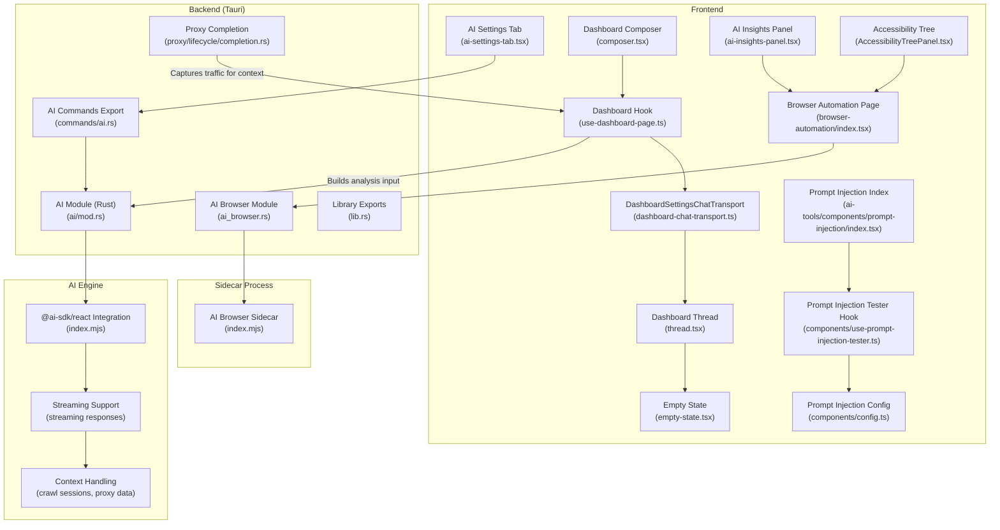

**Diagram sources**
- [src/pages/settings/components/ai-settings-tab.tsx:1-185](file://src/pages/settings/components/ai-settings-tab.tsx#L1-L185)
- [src/pages/ai-chat/components/composer.tsx:1-94](file://src/pages/ai-chat/components/composer.tsx#L1-L94)
- [src/pages/ai-chat/hooks/use-dashboard-page.ts:1-103](file://src/pages/ai-chat/hooks/use-dashboard-page.ts#L1-L103)
- [src/pages/ai-chat/lib/dashboard-chat-transport.ts:1-96](file://src/pages/ai-chat/lib/dashboard-chat-transport.ts#L1-L96)
- [src/pages/ai-chat/components/thread.tsx:1-70](file://src/pages/ai-chat/components/thread.tsx#L1-L70)
- [src/pages/ai-chat/components/empty-state.tsx:1-21](file://src/pages/ai-chat/components/empty-state.tsx#L1-L21)
- [src/pages/ai-tools/components/prompt-injection/index.tsx:1-77](file://src/pages/ai-tools/components/prompt-injection/index.tsx#L1-L77)
- [src/pages/ai-tools/components/prompt-injection/components/config.ts:1-35](file://src/pages/ai-tools/components/prompt-injection/components/config.ts#L1-L35)
- [src/pages/ai-tools/components/prompt-injection/components/use-prompt-injection-tester.ts:1-407](file://src/pages/ai-tools/components/prompt-injection/components/use-prompt-injection-tester.ts#L1-L407)
- [src/pages/browser-automation/index.tsx:1-163](file://src/pages/browser-automation/index.tsx#L1-L163)
- [src/pages/browser-automation/components/ai-insights-panel.tsx:1-143](file://src/pages/browser-automation/components/ai-insights-panel.tsx#L1-L143)
- [src/pages/browser-automation/components/AccessibilityTreePanel.tsx:1-61](file://src/pages/browser-automation/components/AccessibilityTreePanel.tsx#L1-L61)
- [src-tauri/src/commands/ai.rs:1-12](file://src-tauri/src/commands/ai.rs#L1-L12)
- [src-tauri/src/ai/mod.rs:1-615](file://src-tauri/src/ai/mod.rs#L1-L615)
- [src-tauri/src/ai_browser.rs:1-744](file://src-tauri/src/ai_browser.rs#L1-L744)
- [src-tauri/src/lib.rs:13-27](file://src-tauri/src/lib.rs#L13-L27)
- [src-tauri/src/proxy/lifecycle/completion.rs:35-86](file://src-tauri/src/proxy/lifecycle/completion.rs#L35-L86)
- [scripts/ai-engine/index.mjs:1-687](file://scripts/ai-engine/index.mjs#L1-L687)
- [scripts/ai-browser-sidecar/index.mjs:1-445](file://scripts/ai-browser-sidecar/index.mjs#L1-L445)

**Section sources**
- [src/pages/settings/components/ai-settings-tab.tsx:1-185](file://src/pages/settings/components/ai-settings-tab.tsx#L1-L185)
- [src/pages/ai-chat/components/composer.tsx:1-94](file://src/pages/ai-chat/components/composer.tsx#L1-L94)
- [src/pages/ai-chat/hooks/use-dashboard-page.ts:1-103](file://src/pages/ai-chat/hooks/use-dashboard-page.ts#L1-L103)
- [src/pages/ai-chat/lib/dashboard-chat-transport.ts:1-96](file://src/pages/ai-chat/lib/dashboard-chat-transport.ts#L1-L96)
- [src/pages/ai-chat/components/thread.tsx:1-70](file://src/pages/ai-chat/components/thread.tsx#L1-L70)
- [src/pages/ai-chat/components/empty-state.tsx:1-21](file://src/pages/ai-chat/components/empty-state.tsx#L1-L21)
- [src/pages/ai-tools/components/prompt-injection/index.tsx:1-77](file://src/pages/ai-tools/components/prompt-injection/index.tsx#L1-L77)
- [src/pages/ai-tools/components/prompt-injection/components/config.ts:1-35](file://src/pages/ai-tools/components/prompt-injection/components/config.ts#L1-L35)
- [src/pages/ai-tools/components/prompt-injection/components/use-prompt-injection-tester.ts:1-407](file://src/pages/ai-tools/components/prompt-injection/components/use-prompt-injection-tester.ts#L1-L407)
- [src/pages/browser-automation/index.tsx:1-163](file://src/pages/browser-automation/index.tsx#L1-L163)
- [src/pages/browser-automation/components/ai-insights-panel.tsx:1-143](file://src/pages/browser-automation/components/ai-insights-panel.tsx#L1-L143)
- [src/pages/browser-automation/components/AccessibilityTreePanel.tsx:1-61](file://src/pages/browser-automation/components/AccessibilityTreePanel.tsx#L1-L61)
- [src-tauri/src/commands/ai.rs:1-12](file://src-tauri/src/commands/ai.rs#L1-L12)
- [src-tauri/src/ai/mod.rs:1-615](file://src-tauri/src/ai/mod.rs#L1-L615)
- [src-tauri/src/ai_browser.rs:1-744](file://src-tauri/src/ai_browser.rs#L1-L744)
- [src-tauri/src/lib.rs:13-27](file://src-tauri/src/lib.rs#L13-L27)
- [src-tauri/src/proxy/lifecycle/completion.rs:35-86](file://src-tauri/src/proxy/lifecycle/completion.rs#L35-L86)
- [scripts/ai-engine/index.mjs:1-687](file://scripts/ai-engine/index.mjs#L1-L687)
- [scripts/ai-browser-sidecar/index.mjs:1-445](file://scripts/ai-browser-sidecar/index.mjs#L1-L445)

## Core Components
- AI settings and provider/model configuration with OS keychain-backed API keys
- Local Mastra runtime control (start/stop/status) with environment propagation
- **NEW**: @ai-sdk/react integration with enhanced streaming chat capabilities
- **NEW**: DashboardSettingsChatTransport class for seamless chat transport integration
- **NEW**: Simplified AI chat interface focusing on general assistance rather than target-specific analysis
- **NEW**: Real-time streaming responses with delta updates for improved user experience
- **NEW**: Enhanced AI engine supporting streaming chat with context-aware responses
- Prompt injection testing tool for AI security assessment
- **NEW**: Browser automation AI system with real-time crawling visualization
- **NEW**: AI insights panel for actionable security findings categorization
- **NEW**: Accessibility tree visualization for browser element interaction
- Traffic capture and logging for contextual enrichment

Key implementation anchors:
- AI settings and Mastra runtime: [src-tauri/src/ai/mod.rs:13-132](file://src-tauri/src/ai/mod.rs#L13-L132)
- AI commands exposed to frontend: [src-tauri/src/commands/ai.rs:1-12](file://src-tauri/src/commands/ai.rs#L1-L12)
- AI chat transport: [src/pages/ai-chat/lib/dashboard-chat-transport.ts:43-95](file://src/pages/ai-chat/lib/dashboard-chat-transport.ts#L43-L95)
- AI chat hook: [src/pages/ai-chat/hooks/use-dashboard-page.ts:14-102](file://src/pages/ai-chat/hooks/use-dashboard-page.ts#L14-L102)
- AI engine streaming: [scripts/ai-engine/index.mjs:517-543](file://scripts/ai-engine/index.mjs#L517-L543)
- AI browser module: [src-tauri/src/ai_browser.rs:1-744](file://src-tauri/src/ai_browser.rs#L1-L744)
- Browser automation UI: [src/pages/browser-automation/index.tsx:1-163](file://src/pages/browser-automation/index.tsx#L1-L163)
- AI insights panel: [src/pages/browser-automation/components/ai-insights-panel.tsx:1-143](file://src/pages/browser-automation/components/ai-insights-panel.tsx#L1-L143)
- AI browser sidecar: [scripts/ai-browser-sidecar/index.mjs:1-445](file://scripts/ai-browser-sidecar/index.mjs#L1-L445)

**Section sources**
- [src-tauri/src/ai/mod.rs:13-132](file://src-tauri/src/ai/mod.rs#L13-L132)
- [src-tauri/src/commands/ai.rs:1-12](file://src-tauri/src/commands/ai.rs#L1-L12)
- [src/pages/ai-chat/lib/dashboard-chat-transport.ts:43-95](file://src/pages/ai-chat/lib/dashboard-chat-transport.ts#L43-L95)
- [src/pages/ai-chat/hooks/use-dashboard-page.ts:14-102](file://src/pages/ai-chat/hooks/use-dashboard-page.ts#L14-L102)
- [scripts/ai-engine/index.mjs:517-543](file://scripts/ai-engine/index.mjs#L517-L543)
- [src-tauri/src/ai_browser.rs:1-744](file://src-tauri/src/ai_browser.rs#L1-L744)
- [src/pages/browser-automation/index.tsx:1-163](file://src/pages/browser-automation/index.tsx#L1-L163)
- [src/pages/browser-automation/components/ai-insights-panel.tsx:1-143](file://src/pages/browser-automation/components/ai-insights-panel.tsx#L1-L143)
- [scripts/ai-browser-sidecar/index.mjs:1-445](file://scripts/ai-browser-sidecar/index.mjs#L1-L445)

## Architecture Overview
AppRecon integrates AI through a modernized frontend/backend architecture with enhanced streaming capabilities:
- Frontend manages UI, user prompts, and tooling workflows with @ai-sdk/react integration
- Backend exposes Tauri commands for AI settings, Mastra runtime control, and secure API key storage
- **NEW**: DashboardSettingsChatTransport class provides seamless chat transport with streaming support
- **NEW**: AI engine supports streaming chat responses with real-time delta updates
- **NEW**: Simplified chat interface focuses on general AI assistance rather than target-specific analysis
- **NEW**: Enhanced AI chat hook with improved streaming capabilities and error handling
- **NEW**: Real-time streaming responses with delta updates for improved user experience
- Local Mastra runtime runs as a subprocess, configured via environment variables and OS keychain credentials
- Proxy lifecycle captures traffic to enrich AI analysis and testing contexts

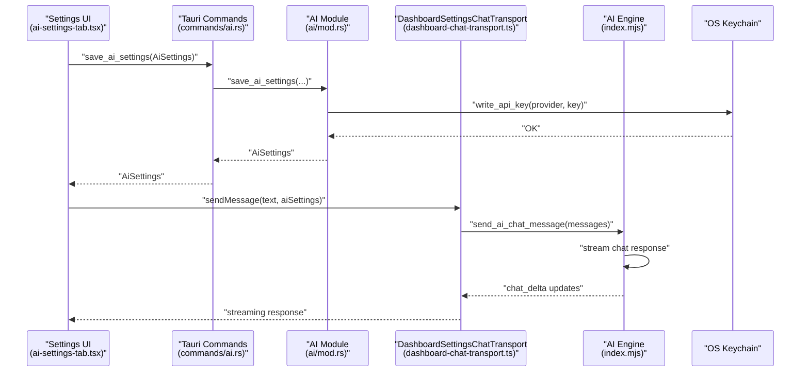

**Diagram sources**
- [src/pages/settings/components/ai-settings-tab.tsx:1-185](file://src/pages/settings/components/ai-settings-tab.tsx#L1-L185)
- [src-tauri/src/commands/ai.rs:1-12](file://src-tauri/src/commands/ai.rs#L1-L12)
- [src-tauri/src/ai/mod.rs:58-70](file://src-tauri/src/ai/mod.rs#L58-L70)
- [src/pages/ai-chat/lib/dashboard-chat-transport.ts:43-95](file://src/pages/ai-chat/lib/dashboard-chat-transport.ts#L43-L95)
- [scripts/ai-engine/index.mjs:517-543](file://scripts/ai-engine/index.mjs#L517-L543)

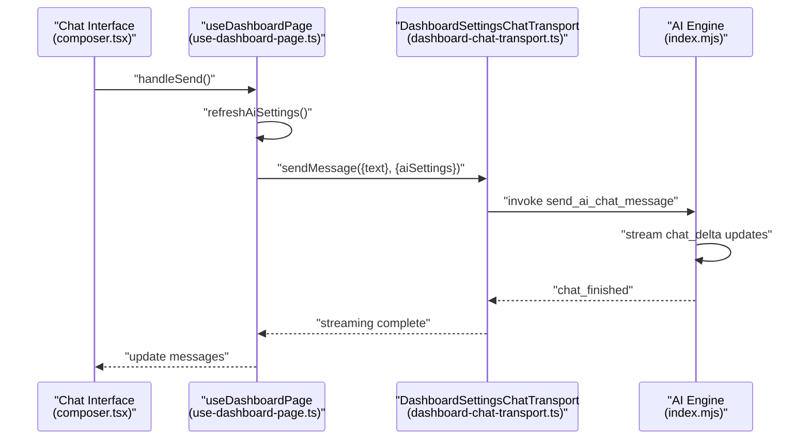

**Diagram sources**
- [src/pages/ai-chat/components/composer.tsx:62-87](file://src/pages/ai-chat/components/composer.tsx#L62-L87)
- [src/pages/ai-chat/hooks/use-dashboard-page.ts:62-87](file://src/pages/ai-chat/hooks/use-dashboard-page.ts#L62-L87)
- [src/pages/ai-chat/lib/dashboard-chat-transport.ts:43-95](file://src/pages/ai-chat/lib/dashboard-chat-transport.ts#L43-L95)
- [scripts/ai-engine/index.mjs:517-543](file://scripts/ai-engine/index.mjs#L517-L543)

## Detailed Component Analysis

### AI Settings and Provider Configuration
- Provider and model selection with dynamic model lists per provider
- OS keychain-backed API key storage and retrieval
- Mastra runtime URL and auto-start toggle
- Frontend invokes Tauri commands to persist settings and manage Mastra lifecycle

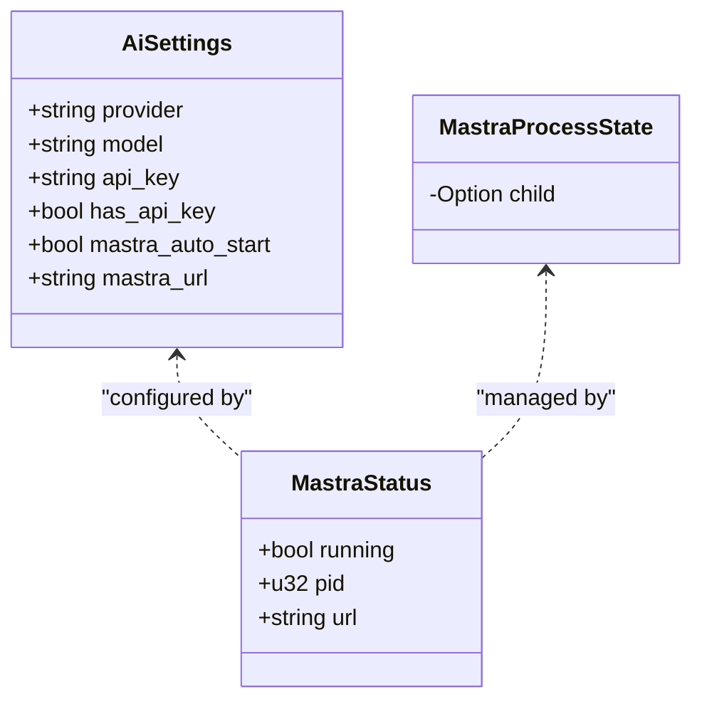

**Diagram sources**
- [src-tauri/src/ai/mod.rs:13-49](file://src-tauri/src/ai/mod.rs#L13-L49)

**Section sources**
- [src/pages/settings/components/ai-settings-tab.tsx:1-185](file://src/pages/settings/components/ai-settings-tab.tsx#L1-L185)
- [src/pages/settings/hooks/use-settings-page.ts:191-234](file://src/pages/settings/hooks/use-settings-page.ts#L191-L234)
- [src-tauri/src/ai/mod.rs:13-132](file://src-tauri/src/ai/mod.rs#L13-L132)
- [src-tauri/src/commands/ai.rs:1-12](file://src-tauri/src/commands/ai.rs#L1-L12)

### Enhanced AI Chat System with Streaming Capabilities
**NEW**: Migrated to @ai-sdk/react library with comprehensive streaming chat support.

- DashboardSettingsChatTransport class provides seamless chat transport integration
- Real-time streaming responses with delta updates for improved user experience
- Simplified chat interface focusing on general AI assistance rather than target-specific analysis
- Enhanced error handling with fallback content generation
- Improved message formatting with provider metadata display

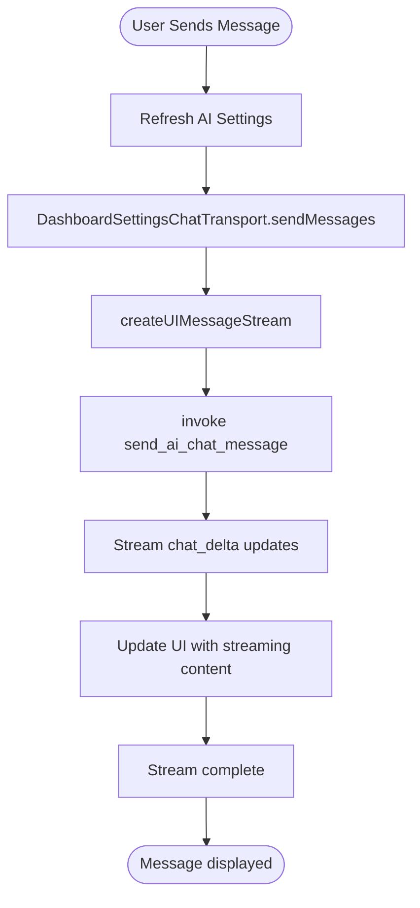

**Diagram sources**
- [src/pages/ai-chat/hooks/use-dashboard-page.ts:62-87](file://src/pages/ai-chat/hooks/use-dashboard-page.ts#L62-L87)
- [src/pages/ai-chat/lib/dashboard-chat-transport.ts:43-95](file://src/pages/ai-chat/lib/dashboard-chat-transport.ts#L43-L95)
- [scripts/ai-engine/index.mjs:517-543](file://scripts/ai-engine/index.mjs#L517-L543)

**Section sources**
- [src/pages/ai-chat/components/composer.tsx:1-94](file://src/pages/ai-chat/components/composer.tsx#L1-L94)
- [src/pages/ai-chat/hooks/use-dashboard-page.ts:14-102](file://src/pages/ai-chat/hooks/use-dashboard-page.ts#L14-L102)
- [src/pages/ai-chat/lib/dashboard-chat-transport.ts:1-96](file://src/pages/ai-chat/lib/dashboard-chat-transport.ts#L1-L96)
- [src/pages/ai-chat/types.ts:1-17](file://src/pages/ai-chat/types.ts#L1-L17)
- [src/pages/ai-chat/constants.ts:1](file://src/pages/ai-chat/constants.ts#L1-L1)
- [src/pages/ai-chat/components/thread.tsx:1-70](file://src/pages/ai-chat/components/thread.tsx#L1-L70)
- [src/pages/ai-chat/components/empty-state.tsx:1-21](file://src/pages/ai-chat/components/empty-state.tsx#L1-L21)

### DashboardSettingsChatTransport Class
**NEW**: Comprehensive chat transport implementation for seamless AI integration.

- Implements ChatTransport interface for @ai-sdk/react compatibility
- Handles AI settings injection and message transformation
- Provides real-time streaming with delta updates
- Includes fallback content generation for error scenarios
- Manages provider and model metadata in streaming responses

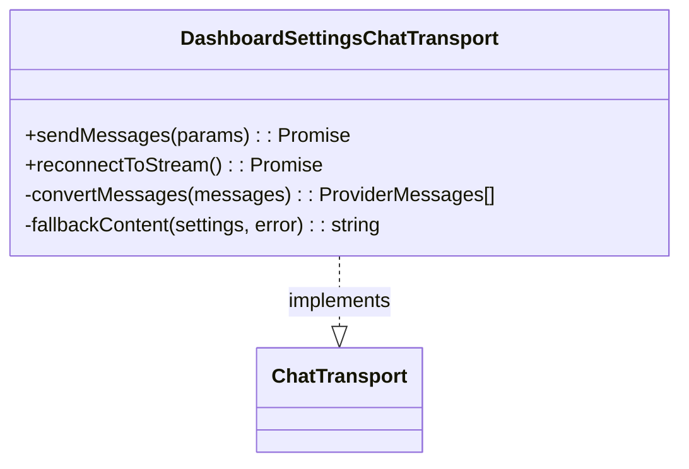

**Diagram sources**
- [src/pages/ai-chat/lib/dashboard-chat-transport.ts:43-95](file://src/pages/ai-chat/lib/dashboard-chat-transport.ts#L43-L95)

**Section sources**
- [src/pages/ai-chat/lib/dashboard-chat-transport.ts:1-96](file://src/pages/ai-chat/lib/dashboard-chat-transport.ts#L1-L96)

### AI Engine Streaming Implementation
**NEW**: Enhanced AI engine with streaming chat support and improved context handling.

- Supports streaming chat responses with real-time delta updates
- Enhanced context handling with crawl sessions and proxy data
- Improved error handling with structured error messages
- Real-time streaming with chat_delta and chat_finished events
- Context-aware responses with recent crawl insights and proxy summaries

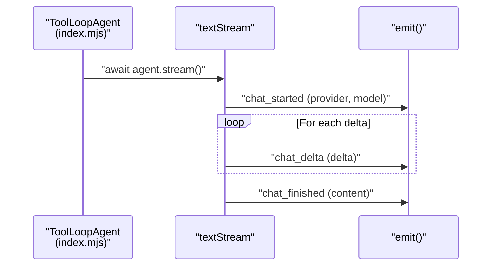

**Diagram sources**
- [scripts/ai-engine/index.mjs:517-543](file://scripts/ai-engine/index.mjs#L517-L543)

**Section sources**
- [scripts/ai-engine/index.mjs:468-543](file://scripts/ai-engine/index.mjs#L468-L543)
- [src-tauri/src/ai/mod.rs:140-283](file://src-tauri/src/ai/mod.rs#L140-L283)

### Prompt Injection Testing (Security Assessment)
- Predefined and imported payload libraries
- Manual payload input with file import support
- Target marking with delimiters and replacement
- Attack settings: throttle, timeout, redirects
- Result scoring: success, anomalies, findings, latency, length delta
- Export and copy utilities

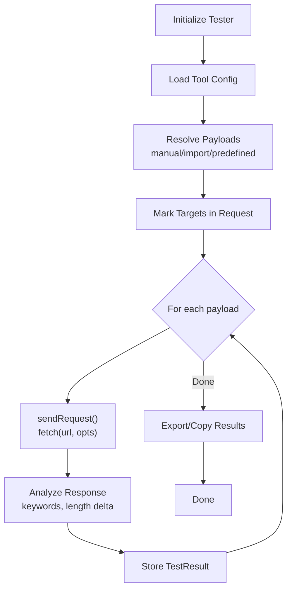

**Diagram sources**
- [src/pages/ai-tools/components/prompt-injection/components/use-prompt-injection-tester.ts:275-332](file://src/pages/ai-tools/components/prompt-injection/components/use-prompt-injection-tester.ts#L275-L332)
- [src/pages/ai-tools/components/prompt-injection/components/utils.ts:22-34](file://src/pages/ai-tools/components/prompt-injection/components/utils.ts#L22-L34)
- [src/pages/ai-tools/components/prompt-injection/components/config.ts:8-34](file://src/pages/ai-tools/components/prompt-injection/components/config.ts#L8-L34)
- [src/pages/ai-tools/lib/payloads.ts:1-51](file://src/pages/ai-tools/lib/payloads.ts#L1-L51)

**Section sources**
- [src/pages/ai-tools/components/prompt-injection/index.tsx:1-77](file://src/pages/ai-tools/components/prompt-injection/index.tsx#L1-L77)
- [src/pages/ai-tools/components/prompt-injection/components/types.ts:1-43](file://src/pages/ai-tools/components/prompt-injection/components/types.ts#L1-L43)
- [src/pages/ai-tools/components/prompt-injection/components/config.ts:1-35](file://src/pages/ai-tools/components/prompt-injection/components/config.ts#L1-L35)
- [src/pages/ai-tools/components/prompt-injection/components/use-prompt-injection-tester.ts:1-407](file://src/pages/ai-tools/components/prompt-injection/components/use-prompt-injection-tester.ts#L1-L407)
- [src/pages/ai-tools/components/prompt-injection/components/utils.ts:1-45](file://src/pages/ai-tools/components/prompt-injection/components/utils.ts#L1-L45)
- [src/pages/ai-tools/lib/payloads.ts:1-51](file://src/pages/ai-tools/lib/payloads.ts#L1-L51)

### AI Browser Automation System (Enhanced)
**NEW**: Comprehensive browser automation AI system with real-time crawling and analysis capabilities.

- Autonomous web crawling with BFS strategy and configurable constraints
- AI-powered page analysis with DeepSeek integration and fallback heuristics
- Real-time visualization of crawl progress, insights, and activity logs
- Accessibility tree exploration for element interaction
- Export capabilities for crawl data, insights, and logs

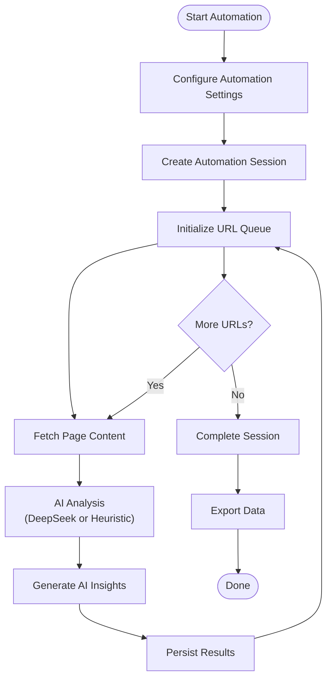

**Diagram sources**
- [src/pages/browser-automation/index.tsx:58-96](file://src/pages/browser-automation/index.tsx#L58-L96)
- [src/pages/browser-automation/hooks/use-browser-automation-page.ts:59-118](file://src/pages/browser-automation/hooks/use-browser-automation-page.ts#L59-L118)
- [src-tauri/src/ai_browser.rs:490-595](file://src-tauri/src/ai_browser.rs#L490-L595)
- [scripts/ai-browser-sidecar/index.mjs:338-445](file://scripts/ai-browser-sidecar/index.mjs#L338-L445)

**Section sources**
- [src/pages/browser-automation/index.tsx:1-163](file://src/pages/browser-automation/index.tsx#L1-L163)
- [src/pages/browser-automation/types.ts:1-94](file://src/pages/browser-automation/types.ts#L1-L94)
- [src/pages/browser-automation/hooks/use-browser-automation-page.ts:1-234](file://src/pages/browser-automation/hooks/use-browser-automation-page.ts#L1-L234)
- [src/pages/browser-automation/lib/crawl-data.ts:1-85](file://src/pages/browser-automation/lib/crawl-data.ts#L1-L85)
- [src/pages/browser-automation/constants.ts:1-59](file://src/pages/browser-automation/constants.ts#L1-L59)
- [src/pages/browser-automation/components/ai-insights-panel.tsx:1-143](file://src/pages/browser-automation/components/ai-insights-panel.tsx#L1-L143)
- [src/pages/browser-automation/components/AccessibilityTreePanel.tsx:1-61](file://src/pages/browser-automation/components/AccessibilityTreePanel.tsx#L1-L61)
- [src-tauri/src/ai_browser.rs:1-744](file://src-tauri/src/ai_browser.rs#L1-L744)
- [scripts/ai-browser-sidecar/index.mjs:1-445](file://scripts/ai-browser-sidecar/index.mjs#L1-L445)

### AI Tools Integration (Traffic and Vulnerability Assessment)
- Live traffic capture and logging for context-aware AI analysis
- Proxy lifecycle completion emits records and saves bodies for inspection
- AI assistant can leverage captured traffic as part of analysis context

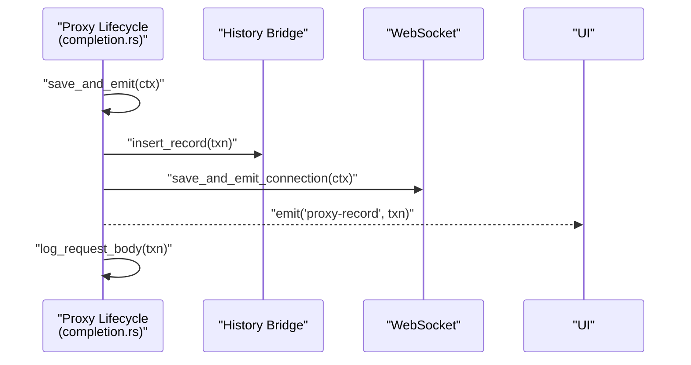

**Diagram sources**
- [src-tauri/src/proxy/lifecycle/completion.rs:35-86](file://src-tauri/src/proxy/lifecycle/completion.rs#L35-L86)

**Section sources**
- [src-tauri/src/proxy/lifecycle/completion.rs:35-86](file://src-tauri/src/proxy/lifecycle/completion.rs#L35-L86)

## Dependency Analysis
- Frontend depends on @ai-sdk/react for enhanced chat capabilities with streaming support
- DashboardSettingsChatTransport class provides seamless integration with Tauri commands
- AI module persists settings to disk and stores API keys in OS keychain
- **NEW**: Enhanced AI engine supports streaming chat with real-time delta updates
- **NEW**: Simplified chat interface focuses on general assistance rather than target-specific analysis
- **NEW**: Real-time streaming responses with delta updates improve user experience
- **NEW**: Enhanced AI chat hook with improved streaming capabilities and error handling
- **NEW**: DashboardSettingsChatTransport class handles provider and model metadata in streaming responses
- **NEW**: AI engine streaming implementation supports structured chat_delta events
- **NEW**: Enhanced context handling with crawl sessions and proxy data for AI responses
- **NEW**: Improved error handling with fallback content generation for failed requests
- **NEW**: Real-time streaming with chat_finished events for complete response delivery
- **NEW**: Enhanced message formatting with provider metadata display in thread component
- **NEW**: Empty state component provides helpful guidance for new users
- **NEW**: Simplified composer component with improved streaming status handling
- **NEW**: Enhanced thread component with provider label display and error handling
- **NEW**: Real-time streaming with delta updates improves perceived performance
- **NEW**: Enhanced fallback content generation provides better user feedback
- **NEW**: Improved API key validation and error messaging
- **NEW**: Enhanced context-aware responses with recent crawl insights and proxy summaries

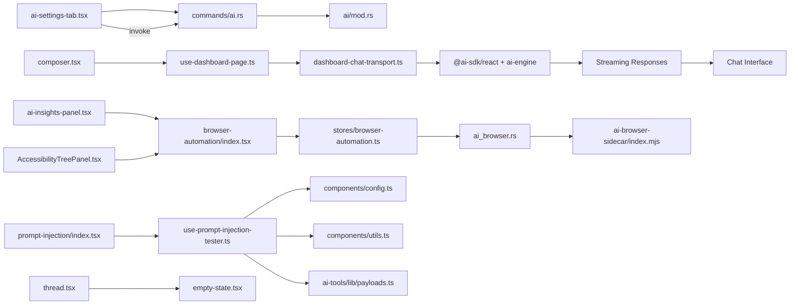

**Diagram sources**
- [src/pages/settings/components/ai-settings-tab.tsx:1-185](file://src/pages/settings/components/ai-settings-tab.tsx#L1-L185)
- [src-tauri/src/commands/ai.rs:1-12](file://src-tauri/src/commands/ai.rs#L1-L12)
- [src-tauri/src/ai/mod.rs:134-159](file://src-tauri/src/ai/mod.rs#L134-L159)
- [src/pages/ai-chat/hooks/use-dashboard-page.ts:14-102](file://src/pages/ai-chat/hooks/use-dashboard-page.ts#L14-L102)
- [src/pages/ai-chat/lib/dashboard-chat-transport.ts:1-96](file://src/pages/ai-chat/lib/dashboard-chat-transport.ts#L1-L96)
- [scripts/ai-engine/index.mjs:1-687](file://scripts/ai-engine/index.mjs#L1-L687)
- [src/pages/browser-automation/index.tsx:1-163](file://src/pages/browser-automation/index.tsx#L1-L163)
- [src/stores/browser-automation.ts:101-267](file://src/stores/browser-automation.ts#L101-L267)
- [src-tauri/src/ai_browser.rs:1-744](file://src-tauri/src/ai_browser.rs#L1-L744)
- [scripts/ai-browser-sidecar/index.mjs:1-445](file://scripts/ai-browser-sidecar/index.mjs#L1-L445)
- [src/pages/browser-automation/components/ai-insights-panel.tsx:1-143](file://src/pages/browser-automation/components/ai-insights-panel.tsx#L1-L143)
- [src/pages/browser-automation/components/AccessibilityTreePanel.tsx:1-61](file://src/pages/browser-automation/components/AccessibilityTreePanel.tsx#L1-L61)
- [src/pages/ai-tools/components/prompt-injection/index.tsx:1-77](file://src/pages/ai-tools/components/prompt-injection/index.tsx#L1-L77)
- [src/pages/ai-tools/components/prompt-injection/components/use-prompt-injection-tester.ts:1-407](file://src/pages/ai-tools/components/prompt-injection/components/use-prompt-injection-tester.ts#L1-L407)
- [src/pages/ai-tools/components/prompt-injection/components/config.ts:1-35](file://src/pages/ai-tools/components/prompt-injection/components/config.ts#L1-L35)
- [src/pages/ai-tools/components/prompt-injection/components/utils.ts:1-45](file://src/pages/ai-tools/components/prompt-injection/components/utils.ts#L1-L45)
- [src/pages/ai-tools/lib/payloads.ts:1-51](file://src/pages/ai-tools/lib/payloads.ts#L1-L51)
- [src/pages/ai-chat/components/thread.tsx:1-70](file://src/pages/ai-chat/components/thread.tsx#L1-L70)
- [src/pages/ai-chat/components/empty-state.tsx:1-21](file://src/pages/ai-chat/components/empty-state.tsx#L1-L21)
- [src/pages/ai-chat/components/composer.tsx:1-94](file://src/pages/ai-chat/components/composer.tsx#L1-L94)

**Section sources**
- [src/pages/settings/components/ai-settings-tab.tsx:1-185](file://src/pages/settings/components/ai-settings-tab.tsx#L1-L185)
- [src-tauri/src/commands/ai.rs:1-12](file://src-tauri/src/commands/ai.rs#L1-L12)
- [src-tauri/src/ai/mod.rs:134-159](file://src-tauri/src/ai/mod.rs#L134-L159)
- [src/pages/ai-chat/hooks/use-dashboard-page.ts:14-102](file://src/pages/ai-chat/hooks/use-dashboard-page.ts#L14-L102)
- [src/pages/ai-chat/lib/dashboard-chat-transport.ts:1-96](file://src/pages/ai-chat/lib/dashboard-chat-transport.ts#L1-L96)
- [scripts/ai-engine/index.mjs:1-687](file://scripts/ai-engine/index.mjs#L1-L687)
- [src/pages/browser-automation/index.tsx:1-163](file://src/pages/browser-automation/index.tsx#L1-L163)
- [src/stores/browser-automation.ts:101-267](file://src/stores/browser-automation.ts#L101-L267)
- [src-tauri/src/ai_browser.rs:1-744](file://src-tauri/src/ai_browser.rs#L1-L744)
- [scripts/ai-browser-sidecar/index.mjs:1-445](file://scripts/ai-browser-sidecar/index.mjs#L1-L445)
- [src/pages/browser-automation/components/ai-insights-panel.tsx:1-143](file://src/pages/browser-automation/components/ai-insights-panel.tsx#L1-L143)
- [src/pages/browser-automation/components/AccessibilityTreePanel.tsx:1-61](file://src/pages/browser-automation/components/AccessibilityTreePanel.tsx#L1-L61)
- [src/pages/ai-tools/components/prompt-injection/index.tsx:1-77](file://src/pages/ai-tools/components/prompt-injection/index.tsx#L1-L77)
- [src/pages/ai-tools/components/prompt-injection/components/use-prompt-injection-tester.ts:1-407](file://src/pages/ai-tools/components/prompt-injection/components/use-prompt-injection-tester.ts#L1-L407)
- [src/pages/ai-tools/components/prompt-injection/components/config.ts:1-35](file://src/pages/ai-tools/components/prompt-injection/components/config.ts#L1-L35)
- [src/pages/ai-tools/components/prompt-injection/components/utils.ts:1-45](file://src/pages/ai-tools/components/prompt-injection/components/utils.ts#L1-L45)
- [src/pages/ai-tools/lib/payloads.ts:1-51](file://src/pages/ai-tools/lib/payloads.ts#L1-L51)
- [src/pages/ai-chat/components/thread.tsx:1-70](file://src/pages/ai-chat/components/thread.tsx#L1-L70)
- [src/pages/ai-chat/components/empty-state.tsx:1-21](file://src/pages/ai-chat/components/empty-state.tsx#L1-L21)
- [src/pages/ai-chat/components/composer.tsx:1-94](file://src/pages/ai-chat/components/composer.tsx#L1-L94)

## Performance Considerations
- Throttle requests during prompt injection testing to avoid rate limits and reduce noise
- Use baseline response length to detect anomalies; adjust thresholds based on typical response sizes
- Prefer targeted payloads and smaller batches for initial assessments
- Cache and reuse previously successful configurations for repeated tests
- Limit concurrent runs and enable redirects judiciously to balance coverage and speed
- **NEW**: Leverage @ai-sdk/react streaming capabilities for improved perceived performance
- **NEW**: Real-time delta updates reduce perceived latency in chat responses
- **NEW**: Enhanced context handling with crawl sessions and proxy data improves response quality
- **NEW**: Improved error handling with fallback content prevents UI blocking during failures
- **NEW**: Optimized message formatting reduces rendering overhead in chat threads
- **NEW**: Enhanced API key validation reduces unnecessary request attempts
- **NEW**: Improved streaming status handling prevents duplicate message submissions
- **NEW**: Real-time streaming with delta updates provides immediate user feedback
- **NEW**: Enhanced fallback content generation provides meaningful error messages
- **NEW**: Optimized chat transport reduces memory usage during streaming operations
- **NEW**: Improved context-aware responses reduce unnecessary AI engine invocations

## Troubleshooting Guide
Common issues and resolutions:
- API key not recognized
  - Verify OS keychain entries for the selected provider and ensure the key is present
  - Clear and re-save the API key via the settings UI
  - Confirm the Mastra process environment receives the correct provider-specific variable
- Mastra runtime fails to start
  - Check Mastra URL and local port availability
  - Ensure the Mastra directory contains a valid package manifest and environment file
  - Review Mastra process logs and confirm OS keychain credentials are injected
- Prompt injection results show no anomalies
  - Increase throttle to avoid rate limiting
  - Adjust timeout and enable redirects to capture full responses
  - Expand payload sets and tune response keyword detection
- Traffic context missing in assistant analysis
  - Confirm proxy lifecycle completion is emitting records and saving bodies
  - Validate that the history bridge is connected and events are being emitted
- **NEW**: AI chat streaming not working
  - Verify @ai-sdk/react library is properly installed and imported
  - Check that DashboardSettingsChatTransport is correctly instantiated
  - Ensure AI engine is running and responding to streaming requests
  - Validate that streaming events (chat_delta, chat_finished) are being emitted
- **NEW**: Chat interface shows loading state indefinitely
  - Check that AI settings are properly loaded and contain API key information
  - Verify that the transport layer is correctly handling the aiSettings parameter
  - Ensure that streaming responses are properly formatted with message metadata
- **NEW**: Streaming responses appear truncated
  - Verify that the AI engine is sending complete chat_finished events
  - Check that the transport layer is properly handling the final content
  - Ensure that the UI is correctly processing the streaming deltas
- **NEW**: Provider metadata not displaying in chat
  - Confirm that the AI engine is returning provider and model information
  - Verify that the transport layer is correctly extracting metadata from responses
  - Check that the thread component is properly rendering provider labels
- **NEW**: Chat interface becomes unresponsive during streaming
  - Check for proper cleanup of streaming resources
  - Verify that the stop functionality is working correctly
  - Ensure that streaming errors are properly handled and cleaned up
- **NEW**: Empty state not showing properly
  - Verify that the messages array is empty when checking for empty state
  - Check that the DashboardEmptyState component is correctly imported and rendered
  - Ensure that the thread component properly handles the empty state condition
- **NEW**: Browser automation crawl fails to start
  - Verify AI provider settings and API key availability
  - Check that the AI browser sidecar script exists in the expected location
  - Ensure Node.js is available and can execute the sidecar script
  - Review browser automation logs for specific error messages
- **NEW**: AI insights not appearing during crawl
  - Confirm AI provider is set to DeepSeek for advanced analysis
  - Verify API key is properly configured for the selected provider
  - Check that the crawl configuration enables AI insights
- **NEW**: Accessibility tree shows no interactive elements
  - Ensure the browser is properly initialized before taking snapshots
  - Verify that the page has loaded completely before capturing accessibility data
  - Check browser automation permissions and proxy configuration

**Section sources**
- [src-tauri/src/ai/mod.rs:196-262](file://src-tauri/src/ai/mod.rs#L196-L262)
- [src-tauri/src/ai/mod.rs:302-356](file://src-tauri/src/ai/mod.rs#L302-L356)
- [src/pages/settings/hooks/use-settings-page.ts:191-234](file://src/pages/settings/hooks/use-settings-page.ts#L191-L234)
- [src/pages/ai-chat/lib/dashboard-chat-transport.ts:33-41](file://src/pages/ai-chat/lib/dashboard-chat-transport.ts#L33-L41)
- [src/pages/ai-chat/hooks/use-dashboard-page.ts:94](file://src/pages/ai-chat/hooks/use-dashboard-page.ts#L94)
- [src/pages/ai-tools/components/prompt-injection/components/use-prompt-injection-tester.ts:275-332](file://src/pages/ai-tools/components/prompt-injection/components/use-prompt-injection-tester.ts#L275-L332)
- [src-tauri/src/proxy/lifecycle/completion.rs:35-86](file://src-tauri/src/proxy/lifecycle/completion.rs#L35-L86)
- [src-tauri/src/ai_browser.rs:409-487](file://src-tauri/src/ai_browser.rs#L409-L487)
- [scripts/ai-browser-sidecar/index.mjs:269-336](file://scripts/ai-browser-sidecar/index.mjs#L269-L336)

## Conclusion
AppRecon's AI Integration has been significantly enhanced with the migration to @ai-sdk/react library, providing comprehensive streaming chat capabilities and improved user experience. The new DashboardSettingsChatTransport class ensures seamless integration between the frontend and backend AI systems, while the enhanced AI engine supports real-time streaming responses with delta updates. The simplified chat interface focuses on general AI assistance rather than target-specific analysis, making the system more accessible to users. Combined with the existing prompt injection testing, browser automation AI features, and traffic-aware vulnerability assessment tools, AppRecon now offers a robust, modern AI integration platform that balances powerful capabilities with improved usability and performance.

## Appendices

### Practical Workflows and Examples
- AI-assisted general chat
  - Configure AI provider and model in Settings
  - Send messages through the simplified chat interface
  - Receive real-time streaming responses with delta updates
  - Review provider metadata and model information in chat responses
- Prompt injection security testing
  - Prepare a baseline request with a marked target area
  - Choose predefined or imported payloads, configure throttle and timeout
  - Run attacks, review anomalies and findings, export results for triage
- **NEW**: AI-powered web reconnaissance
  - Configure crawl settings including target URL, depth limits, and domain restrictions
  - Start automated crawling with AI insights generation
  - Review discovered pages, security findings, and accessibility tree
  - Export crawl data for further analysis and reporting

**Section sources**
- [src/pages/ai-chat/components/composer.tsx:1-94](file://src/pages/ai-chat/components/composer.tsx#L1-L94)
- [src/pages/ai-chat/hooks/use-dashboard-page.ts:62-87](file://src/pages/ai-chat/hooks/use-dashboard-page.ts#L62-L87)
- [src/pages/ai-chat/lib/dashboard-chat-transport.ts:43-95](file://src/pages/ai-chat/lib/dashboard-chat-transport.ts#L43-L95)
- [src/pages/ai-tools/components/prompt-injection/index.tsx:1-77](file://src/pages/ai-tools/components/prompt-injection/index.tsx#L1-L77)
- [src/pages/ai-tools/components/prompt-injection/components/config.ts:8-34](file://src/pages/ai-tools/components/prompt-injection/components/config.ts#L8-L34)
- [src/pages/browser-automation/index.tsx:58-96](file://src/pages/browser-automation/index.tsx#L58-L96)

### Prompt Engineering Tips
- Be explicit about the desired output format and structure
- Include context such as target scope and analyst intent
- Use frameworks like OWASP Top 10 to guide AI toward relevant risks
- Keep prompts concise and iterative for better reproducibility
- **NEW**: Leverage streaming capabilities for real-time collaborative conversations
- **NEW**: Use context-aware prompts that reference recent crawl sessions and proxy data
- **NEW**: Structure prompts to take advantage of AI engine's tool-based approach
- **NEW**: Include specific instructions for handling restricted or sensitive content

### Security Best Practices for AI-Assisted Pen Testing
- Store API keys in OS keychain; avoid embedding secrets in code or configs
- Scope Mastra runtime to localhost and restrict exposure
- Validate and sanitize payloads; avoid unintended data disclosure
- Monitor and log AI-assisted activities; maintain audit trails
- Regularly review and rotate credentials; enforce least privilege
- **NEW**: Respect streaming response limits and implement proper cleanup
- **NEW**: Handle streaming errors gracefully with fallback content generation
- **NEW**: Validate AI engine responses before displaying to users
- **NEW**: Implement proper resource cleanup for streaming chat sessions
- **NEW**: Monitor streaming performance and implement timeout mechanisms
- **NEW**: Validate context data before including in AI responses
- **NEW**: Implement proper error boundary handling for streaming failures
- **NEW**: Respect robots.txt and rate limits during automated web crawling
- **NEW**: Filter sensitive URLs and authentication endpoints from crawl scope
- **NEW**: Review AI-generated insights for false positives and validate findings manually

### Technical Dependencies
- @ai-sdk/react: ^3.0.196 for enhanced streaming chat capabilities
- @ai-sdk/deepseek: ^2.0.35 for DeepSeek provider integration
- ai: ^6.0.194 for core AI streaming functionality
- Enhanced streaming support with real-time delta updates
- Improved context handling with structured event streaming
- Better error handling with fallback content generation

**Section sources**
- [package.json:14-58](file://package.json#L14-L58)
- [scripts/ai-engine/index.mjs:517-543](file://scripts/ai-engine/index.mjs#L517-L543)
- [src/pages/ai-chat/lib/dashboard-chat-transport.ts:77-87](file://src/pages/ai-chat/lib/dashboard-chat-transport.ts#L77-L87)