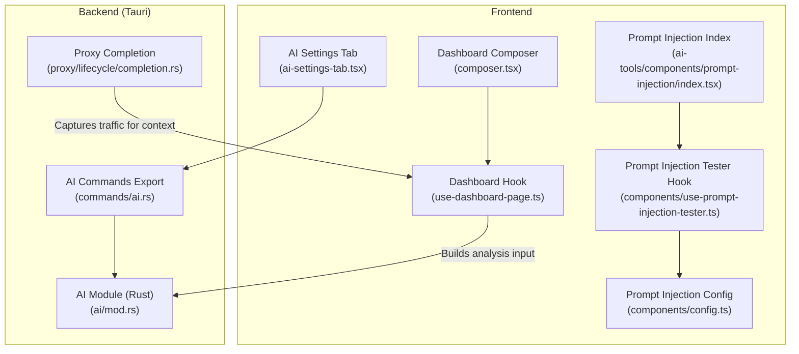
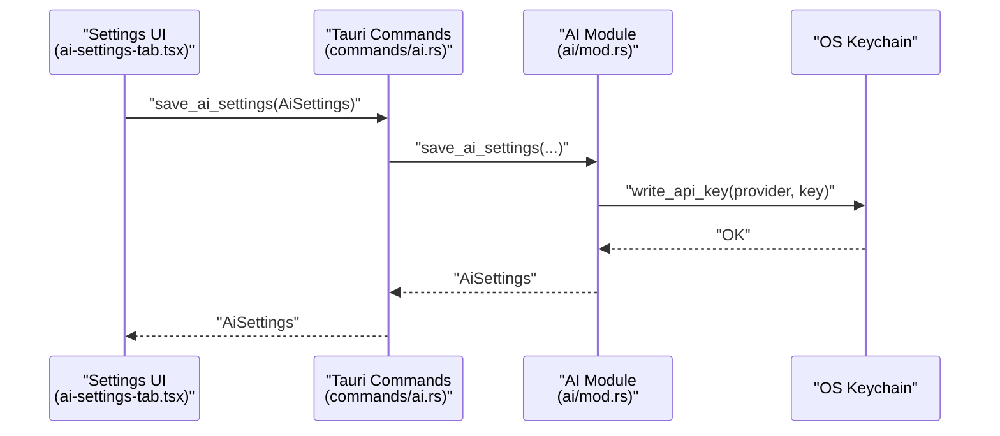
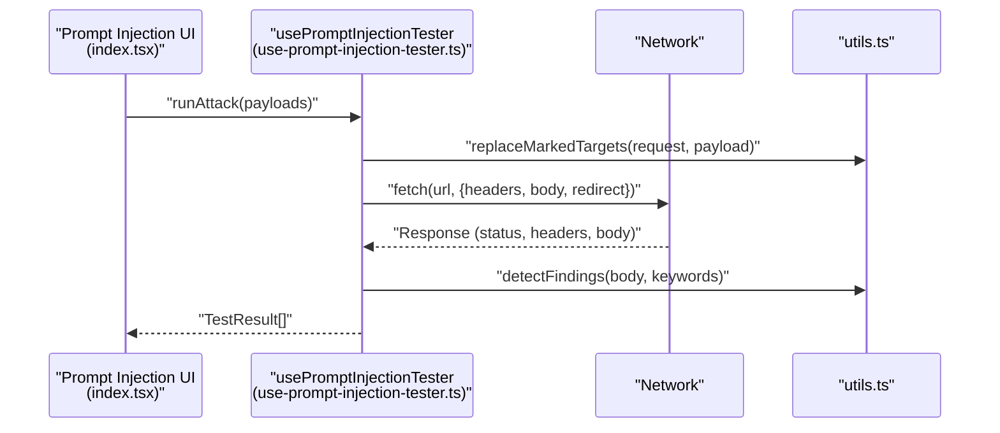
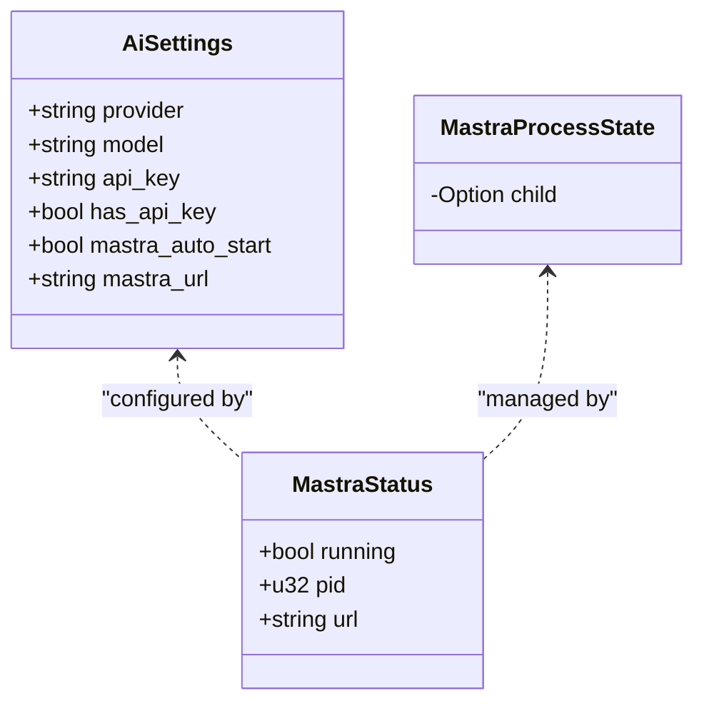
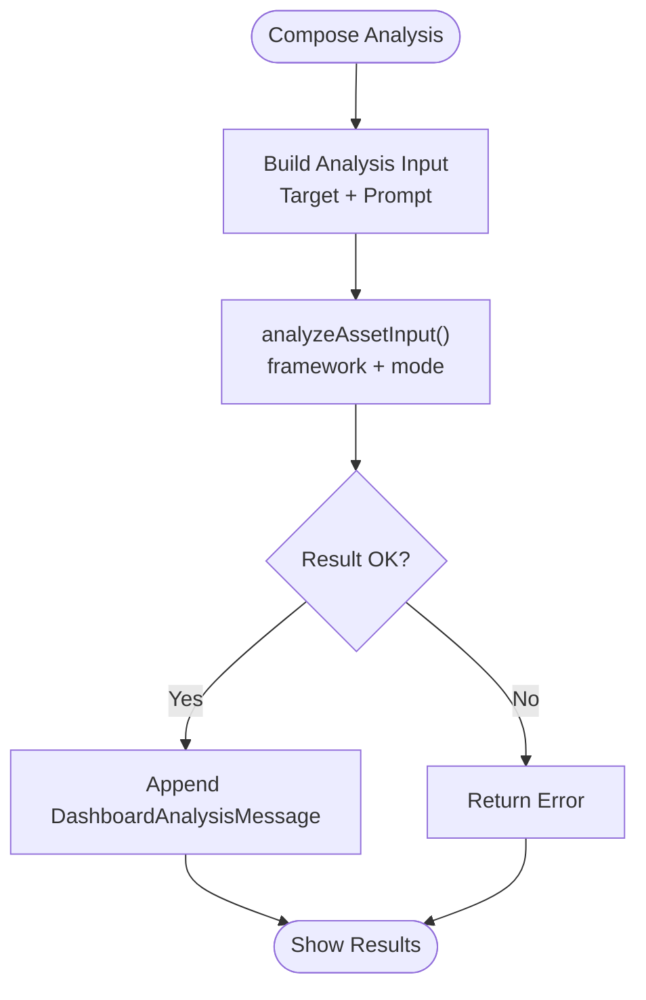
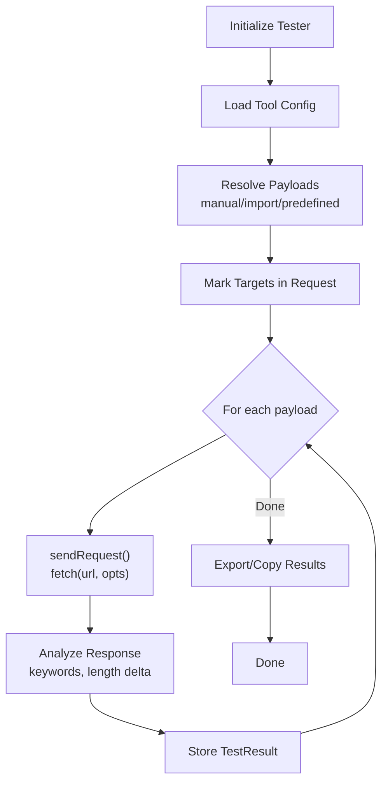
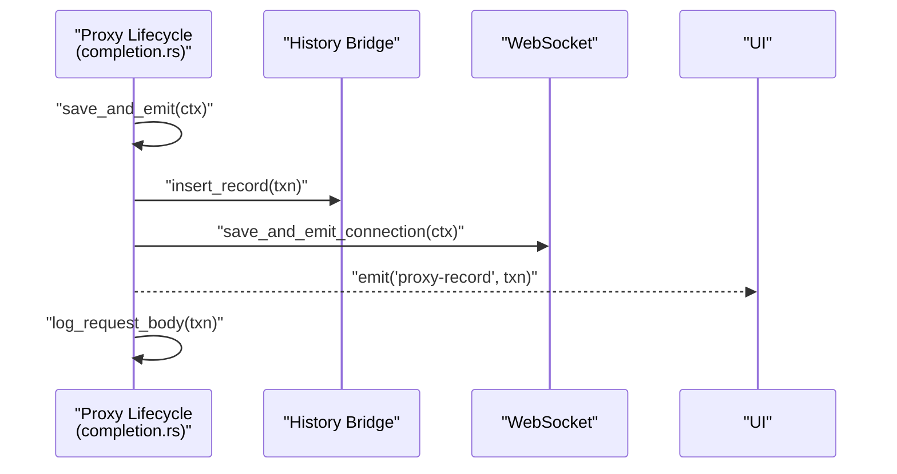
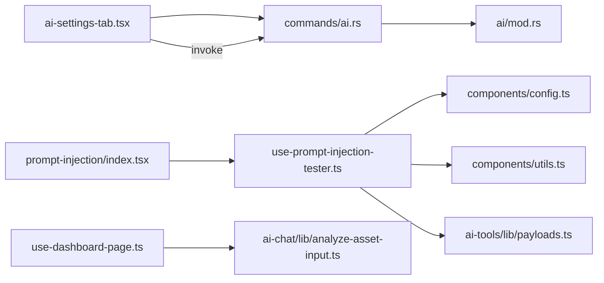

# AI Integration

<cite>
**Referenced Files in This Document**
- [src-tauri/src/ai/mod.rs](file://src-tauri/src/ai/mod.rs)
- [src-tauri/src/commands/ai.rs](file://src-tauri/src/commands/ai.rs)
- [src/pages/settings/components/ai-settings-tab.tsx](file://src/pages/settings/components/ai-settings-tab.tsx)
- [src/pages/settings/hooks/use-settings-page.ts](file://src/pages/settings/hooks/use-settings-page.ts)
- [src/pages/ai-chat/components/composer.tsx](file://src/pages/ai-chat/components/composer.tsx)
- [src/pages/ai-chat/hooks/use-dashboard-page.ts](file://src/pages/ai-chat/hooks/use-dashboard-page.ts)
- [src/pages/ai-chat/lib/analyze-asset-input.ts](file://src/pages/ai-chat/lib/analyze-asset-input.ts)
- [src/pages/ai-chat/types.ts](file://src/pages/ai-chat/types.ts)
- [src/pages/ai-chat/constants.ts](file://src/pages/ai-chat/constants.ts)
- [src/pages/ai-tools/components/prompt-injection/index.tsx](file://src/pages/ai-tools/components/prompt-injection/index.tsx)
- [src/pages/ai-tools/components/prompt-injection/components/config.ts](file://src/pages/ai-tools/components/prompt-injection/components/config.ts)
- [src/pages/ai-tools/components/prompt-injection/components/types.ts](file://src/pages/ai-tools/components/prompt-injection/components/types.ts)
- [src/pages/ai-tools/components/prompt-injection/components/use-prompt-injection-tester.ts](file://src/pages/ai-tools/components/prompt-injection/components/use-prompt-injection-tester.ts)
- [src/pages/ai-tools/components/prompt-injection/components/utils.ts](file://src/pages/ai-tools/components/prompt-injection/components/utils.ts)
- [src/pages/ai-tools/lib/payloads.ts](file://src/pages/ai-tools/lib/payloads.ts)
- [src/pages/ai-tools/index.tsx](file://src/pages/ai-tools/index.tsx)
- [src/pages/ai-tools/constants.ts](file://src/pages/ai-tools/constants.ts)
- [src-tauri/src/proxy/lifecycle/completion.rs](file://src-tauri/src/proxy/lifecycle/completion.rs)
- [docs/website-content.md](file://docs/website-content.md)
</cite>

## Table of Contents
1. [Introduction](#introduction)
2. [Project Structure](#project-structure)
3. [Core Components](#core-components)
4. [Architecture Overview](#architecture-overview)
5. [Detailed Component Analysis](#detailed-component-analysis)
6. [Dependency Analysis](#dependency-analysis)
7. [Performance Considerations](#performance-considerations)
8. [Troubleshooting Guide](#troubleshooting-guide)
9. [Conclusion](#conclusion)
10. [Appendices](#appendices)

## Introduction
This document explains AppRecon’s AI Integration capabilities with a focus on:
- MCP (Model Context Protocol) server via the local Mastra runtime
- AI assistant for conversation-driven analysis and report generation
- Prompt injection testing for AI security assessment
- AI tools integration for traffic-aware vulnerability assessment and automated testing
- Practical workflows, prompt engineering tips, and secure AI-assisted penetration testing

It consolidates frontend UI flows, backend Tauri commands, and Rust runtime orchestration into a coherent guide for configuration, operation, and troubleshooting.

## Project Structure
AppRecon’s AI features span frontend React components and backend Tauri/Rust orchestration:
- Frontend AI settings and assistant dashboard
- Prompt injection testing tool
- Local Mastra runtime management (start/stop/status)
- OS keychain-backed API key storage
- Traffic interception and logging for context enrichment

**Diagram sources**
- [src/pages/settings/components/ai-settings-tab.tsx:1-185](file://src/pages/settings/components/ai-settings-tab.tsx#L1-L185)
- [src/pages/ai-chat/components/composer.tsx:1-103](file://src/pages/ai-chat/components/composer.tsx#L1-L103)
- [src/pages/ai-chat/hooks/use-dashboard-page.ts:1-90](file://src/pages/ai-chat/hooks/use-dashboard-page.ts#L1-L90)
- [src/pages/ai-tools/components/prompt-injection/index.tsx:1-77](file://src/pages/ai-tools/components/prompt-injection/index.tsx#L1-L77)
- [src/pages/ai-tools/components/prompt-injection/components/config.ts:1-35](file://src/pages/ai-tools/components/prompt-injection/components/config.ts#L1-L35)
- [src/pages/ai-tools/components/prompt-injection/components/use-prompt-injection-tester.ts:1-407](file://src/pages/ai-tools/components/prompt-injection/components/use-prompt-injection-tester.ts#L1-L407)
- [src-tauri/src/commands/ai.rs:1-10](file://src-tauri/src/commands/ai.rs#L1-L10)
- [src-tauri/src/ai/mod.rs:1-398](file://src-tauri/src/ai/mod.rs#L1-L398)
- [src-tauri/src/proxy/lifecycle/completion.rs:35-86](file://src-tauri/src/proxy/lifecycle/completion.rs#L35-L86)

**Section sources**
- [src/pages/settings/components/ai-settings-tab.tsx:1-185](file://src/pages/settings/components/ai-settings-tab.tsx#L1-L185)
- [src/pages/ai-chat/components/composer.tsx:1-103](file://src/pages/ai-chat/components/composer.tsx#L1-L103)
- [src/pages/ai-chat/hooks/use-dashboard-page.ts:1-90](file://src/pages/ai-chat/hooks/use-dashboard-page.ts#L1-L90)
- [src/pages/ai-tools/components/prompt-injection/index.tsx:1-77](file://src/pages/ai-tools/components/prompt-injection/index.tsx#L1-L77)
- [src/pages/ai-tools/components/prompt-injection/components/config.ts:1-35](file://src/pages/ai-tools/components/prompt-injection/components/config.ts#L1-L35)
- [src/pages/ai-tools/components/prompt-injection/components/use-prompt-injection-tester.ts:1-407](file://src/pages/ai-tools/components/prompt-injection/components/use-prompt-injection-tester.ts#L1-L407)
- [src-tauri/src/commands/ai.rs:1-10](file://src-tauri/src/commands/ai.rs#L1-L10)
- [src-tauri/src/ai/mod.rs:1-398](file://src-tauri/src/ai/mod.rs#L1-L398)
- [src-tauri/src/proxy/lifecycle/completion.rs:35-86](file://src-tauri/src/proxy/lifecycle/completion.rs#L35-L86)

## Core Components
- AI settings and provider/model configuration with OS keychain-backed API keys
- Local Mastra runtime control (start/stop/status) with environment propagation
- AI assistant dashboard for asset analysis and report generation
- Prompt injection testing tool for AI security assessment
- Traffic capture and logging for contextual enrichment

Key implementation anchors:
- AI settings and Mastra runtime: [src-tauri/src/ai/mod.rs:13-132](file://src-tauri/src/ai/mod.rs#L13-L132)
- AI commands exposed to frontend: [src-tauri/src/commands/ai.rs:1-10](file://src-tauri/src/commands/ai.rs#L1-L10)
- AI settings UI and controls: [src/pages/settings/components/ai-settings-tab.tsx:1-185](file://src/pages/settings/components/ai-settings-tab.tsx#L1-L185)
- Assistant dashboard composition: [src/pages/ai-chat/components/composer.tsx:1-103](file://src/pages/ai-chat/components/composer.tsx#L1-L103)
- Prompt injection tooling: [src/pages/ai-tools/components/prompt-injection/index.tsx:1-77](file://src/pages/ai-tools/components/prompt-injection/index.tsx#L1-L77)

**Section sources**
- [src-tauri/src/ai/mod.rs:13-132](file://src-tauri/src/ai/mod.rs#L13-L132)
- [src-tauri/src/commands/ai.rs:1-10](file://src-tauri/src/commands/ai.rs#L1-L10)
- [src/pages/settings/components/ai-settings-tab.tsx:1-185](file://src/pages/settings/components/ai-settings-tab.tsx#L1-L185)
- [src/pages/ai-chat/components/composer.tsx:1-103](file://src/pages/ai-chat/components/composer.tsx#L1-L103)
- [src/pages/ai-tools/components/prompt-injection/index.tsx:1-77](file://src/pages/ai-tools/components/prompt-injection/index.tsx#L1-L77)

## Architecture Overview
AppRecon integrates AI through a hybrid frontend/backend architecture:
- Frontend manages UI, user prompts, and tooling workflows
- Backend exposes Tauri commands for AI settings, Mastra runtime control, and secure API key storage
- Local Mastra runtime runs as a subprocess, configured via environment variables and OS keychain credentials
- Proxy lifecycle captures traffic to enrich AI analysis and testing contexts

**Diagram sources**
- [src/pages/settings/components/ai-settings-tab.tsx:1-185](file://src/pages/settings/components/ai-settings-tab.tsx#L1-L185)
- [src-tauri/src/commands/ai.rs:1-10](file://src-tauri/src/commands/ai.rs#L1-L10)
- [src-tauri/src/ai/mod.rs:58-70](file://src-tauri/src/ai/mod.rs#L58-L70)

**Diagram sources**
- [src/pages/ai-tools/components/prompt-injection/index.tsx:1-77](file://src/pages/ai-tools/components/prompt-injection/index.tsx#L1-L77)
- [src/pages/ai-tools/components/prompt-injection/components/use-prompt-injection-tester.ts:275-332](file://src/pages/ai-tools/components/prompt-injection/components/use-prompt-injection-tester.ts#L275-L332)
- [src/pages/ai-tools/components/prompt-injection/components/utils.ts:22-34](file://src/pages/ai-tools/components/prompt-injection/components/utils.ts#L22-L34)

## Detailed Component Analysis

### AI Settings and Provider Configuration
- Provider and model selection with dynamic model lists per provider
- OS keychain-backed API key storage and retrieval
- Mastra runtime URL and auto-start toggle
- Frontend invokes Tauri commands to persist settings and manage Mastra lifecycle

**Diagram sources**
- [src-tauri/src/ai/mod.rs:13-49](file://src-tauri/src/ai/mod.rs#L13-L49)

**Section sources**
- [src/pages/settings/components/ai-settings-tab.tsx:1-185](file://src/pages/settings/components/ai-settings-tab.tsx#L1-L185)
- [src/pages/settings/hooks/use-settings-page.ts:141-231](file://src/pages/settings/hooks/use-settings-page.ts#L141-L231)
- [src-tauri/src/ai/mod.rs:13-132](file://src-tauri/src/ai/mod.rs#L13-L132)
- [src-tauri/src/commands/ai.rs:1-10](file://src-tauri/src/commands/ai.rs#L1-L10)

### AI Assistant System (Conversation and Analysis)
- Dashboard composer allows selecting target, framework, and model
- Assistant builds analysis input from target scope and optional analyst prompt
- Results include summary, score, findings, assets, next steps, and analyst note
- Messages are appended to the conversation history

**Diagram sources**
- [src/pages/ai-chat/components/composer.tsx:1-103](file://src/pages/ai-chat/components/composer.tsx#L1-L103)
- [src/pages/ai-chat/hooks/use-dashboard-page.ts:47-70](file://src/pages/ai-chat/hooks/use-dashboard-page.ts#L47-L70)
- [src/pages/ai-chat/lib/analyze-asset-input.ts:1-160](file://src/pages/ai-chat/lib/analyze-asset-input.ts#L1-L160)
- [src/pages/ai-chat/types.ts:1-12](file://src/pages/ai-chat/types.ts#L1-L12)
- [src/pages/ai-chat/constants.ts:69-77](file://src/pages/ai-chat/constants.ts#L69-L77)

**Section sources**
- [src/pages/ai-chat/components/composer.tsx:1-103](file://src/pages/ai-chat/components/composer.tsx#L1-L103)
- [src/pages/ai-chat/hooks/use-dashboard-page.ts:1-90](file://src/pages/ai-chat/hooks/use-dashboard-page.ts#L1-L90)
- [src/pages/ai-chat/lib/analyze-asset-input.ts:1-160](file://src/pages/ai-chat/lib/analyze-asset-input.ts#L1-L160)
- [src/pages/ai-chat/types.ts:1-12](file://src/pages/ai-chat/types.ts#L1-L12)
- [src/pages/ai-chat/constants.ts:69-77](file://src/pages/ai-chat/constants.ts#L69-L77)

### Prompt Injection Testing (Security Assessment)
- Predefined and imported payload libraries
- Manual payload input with file import support
- Target marking with delimiters and replacement
- Attack settings: throttle, timeout, redirects
- Result scoring: success, anomalies, findings, latency, length delta
- Export and copy utilities

**Diagram sources**
- [src/pages/ai-tools/components/prompt-injection/components/use-prompt-injection-tester.ts:275-332](file://src/pages/ai-tools/components/prompt-injection/components/use-prompt-injection-tester.ts#L275-L332)
- [src/pages/ai-tools/components/prompt-injection/components/utils.ts:22-34](file://src/pages/ai-tools/components/prompt-injection/components/utils.ts#L22-L34)
- [src/pages/ai-tools/components/prompt-injection/components/config.ts:8-34](file://src/pages/ai-tools/components/prompt-injection/components/config.ts#L8-L34)
- [src/pages/ai-tools/lib/payloads.ts:1-51](file://src/pages/ai-tools/lib/payloads.ts#L1-L51)

**Section sources**
- [src/pages/ai-tools/components/prompt-injection/index.tsx:1-77](file://src/pages/ai-tools/components/prompt-injection/index.tsx#L1-L77)
- [src/pages/ai-tools/components/prompt-injection/components/types.ts:1-43](file://src/pages/ai-tools/components/prompt-injection/components/types.ts#L1-L43)
- [src/pages/ai-tools/components/prompt-injection/components/config.ts:1-35](file://src/pages/ai-tools/components/prompt-injection/components/config.ts#L1-L35)
- [src/pages/ai-tools/components/prompt-injection/components/use-prompt-injection-tester.ts:1-407](file://src/pages/ai-tools/components/prompt-injection/components/use-prompt-injection-tester.ts#L1-L407)
- [src/pages/ai-tools/components/prompt-injection/components/utils.ts:1-45](file://src/pages/ai-tools/components/prompt-injection/components/utils.ts#L1-L45)
- [src/pages/ai-tools/lib/payloads.ts:1-51](file://src/pages/ai-tools/lib/payloads.ts#L1-L51)

### AI Tools Integration (Traffic and Vulnerability Assessment)
- Live traffic capture and logging for context-aware AI analysis
- Proxy lifecycle completion emits records and saves bodies for inspection
- AI assistant can leverage captured traffic as part of analysis context

**Diagram sources**
- [src-tauri/src/proxy/lifecycle/completion.rs:35-86](file://src-tauri/src/proxy/lifecycle/completion.rs#L35-L86)

**Section sources**
- [src-tauri/src/proxy/lifecycle/completion.rs:35-86](file://src-tauri/src/proxy/lifecycle/completion.rs#L35-L86)

## Dependency Analysis
- Frontend depends on Tauri commands for AI settings and Mastra control
- AI module persists settings to disk and stores API keys in OS keychain
- Prompt injection tooling depends on payload libraries and HTTP parsing utilities
- Assistant dashboard composes analysis input and renders structured results

**Diagram sources**
- [src/pages/settings/components/ai-settings-tab.tsx:1-185](file://src/pages/settings/components/ai-settings-tab.tsx#L1-L185)
- [src-tauri/src/commands/ai.rs:1-10](file://src-tauri/src/commands/ai.rs#L1-L10)
- [src-tauri/src/ai/mod.rs:134-159](file://src-tauri/src/ai/mod.rs#L134-L159)
- [src/pages/ai-tools/components/prompt-injection/index.tsx:1-77](file://src/pages/ai-tools/components/prompt-injection/index.tsx#L1-L77)
- [src/pages/ai-tools/components/prompt-injection/components/use-prompt-injection-tester.ts:1-407](file://src/pages/ai-tools/components/prompt-injection/components/use-prompt-injection-tester.ts#L1-L407)
- [src/pages/ai-tools/components/prompt-injection/components/config.ts:1-35](file://src/pages/ai-tools/components/prompt-injection/components/config.ts#L1-L35)
- [src/pages/ai-tools/components/prompt-injection/components/utils.ts:1-45](file://src/pages/ai-tools/components/prompt-injection/components/utils.ts#L1-L45)
- [src/pages/ai-tools/lib/payloads.ts:1-51](file://src/pages/ai-tools/lib/payloads.ts#L1-L51)
- [src/pages/ai-chat/hooks/use-dashboard-page.ts:1-90](file://src/pages/ai-chat/hooks/use-dashboard-page.ts#L1-L90)
- [src/pages/ai-chat/lib/analyze-asset-input.ts:1-160](file://src/pages/ai-chat/lib/analyze-asset-input.ts#L1-L160)

**Section sources**
- [src/pages/settings/components/ai-settings-tab.tsx:1-185](file://src/pages/settings/components/ai-settings-tab.tsx#L1-L185)
- [src-tauri/src/commands/ai.rs:1-10](file://src-tauri/src/commands/ai.rs#L1-L10)
- [src-tauri/src/ai/mod.rs:134-159](file://src-tauri/src/ai/mod.rs#L134-L159)
- [src/pages/ai-tools/components/prompt-injection/index.tsx:1-77](file://src/pages/ai-tools/components/prompt-injection/index.tsx#L1-L77)
- [src/pages/ai-tools/components/prompt-injection/components/use-prompt-injection-tester.ts:1-407](file://src/pages/ai-tools/components/prompt-injection/components/use-prompt-injection-tester.ts#L1-L407)
- [src/pages/ai-tools/components/prompt-injection/components/config.ts:1-35](file://src/pages/ai-tools/components/prompt-injection/components/config.ts#L1-L35)
- [src/pages/ai-tools/components/prompt-injection/components/utils.ts:1-45](file://src/pages/ai-tools/components/prompt-injection/components/utils.ts#L1-L45)
- [src/pages/ai-tools/lib/payloads.ts:1-51](file://src/pages/ai-tools/lib/payloads.ts#L1-L51)
- [src/pages/ai-chat/hooks/use-dashboard-page.ts:1-90](file://src/pages/ai-chat/hooks/use-dashboard-page.ts#L1-L90)
- [src/pages/ai-chat/lib/analyze-asset-input.ts:1-160](file://src/pages/ai-chat/lib/analyze-asset-input.ts#L1-L160)

## Performance Considerations
- Throttle requests during prompt injection testing to avoid rate limits and reduce noise
- Use baseline response length to detect anomalies; adjust thresholds based on typical response sizes
- Prefer targeted payloads and smaller batches for initial assessments
- Cache and reuse previously successful configurations for repeated tests
- Limit concurrent runs and enable redirects judiciously to balance coverage and speed

[No sources needed since this section provides general guidance]

## Troubleshooting Guide
Common issues and resolutions:
- API key not recognized
  - Verify OS keychain entries for the selected provider and ensure the key is present
  - Clear and re-save the API key via the settings UI
  - Confirm the Mastra process environment receives the correct provider-specific variable
- Mastra runtime fails to start
  - Check Mastra URL and local port availability
  - Ensure the Mastra directory contains a valid package manifest and environment file
  - Review Mastra process logs and confirm OS keychain credentials are injected
- Prompt injection results show no anomalies
  - Increase throttle to avoid rate limiting
  - Adjust timeout and enable redirects to capture full responses
  - Expand payload sets and tune response keyword detection
- Traffic context missing in assistant analysis
  - Confirm proxy lifecycle completion is emitting records and saving bodies
  - Validate that the history bridge is connected and events are being emitted

**Section sources**
- [src-tauri/src/ai/mod.rs:196-262](file://src-tauri/src/ai/mod.rs#L196-L262)
- [src-tauri/src/ai/mod.rs:302-356](file://src-tauri/src/ai/mod.rs#L302-L356)
- [src/pages/settings/hooks/use-settings-page.ts:191-231](file://src/pages/settings/hooks/use-settings-page.ts#L191-L231)
- [src/pages/ai-tools/components/prompt-injection/components/use-prompt-injection-tester.ts:275-332](file://src/pages/ai-tools/components/prompt-injection/components/use-prompt-injection-tester.ts#L275-L332)
- [src-tauri/src/proxy/lifecycle/completion.rs:35-86](file://src-tauri/src/proxy/lifecycle/completion.rs#L35-L86)

## Conclusion
AppRecon’s AI Integration combines a configurable provider/model setup with a local Mastra runtime, an AI assistant for structured analysis, and a robust prompt injection testing tool. By leveraging OS keychain-backed credentials, traffic capture, and curated payload libraries, teams can automate AI-assisted reconnaissance and security testing while maintaining operational control and security hygiene.

[No sources needed since this section summarizes without analyzing specific files]

## Appendices

### Practical Workflows and Examples
- AI-assisted asset analysis
  - Select target, choose framework (e.g., OWASP Top 10), pick model, and submit prompt
  - Review findings, assets, and next steps in the assistant output
- Prompt injection security testing
  - Prepare a baseline request with a marked target area
  - Choose predefined or imported payloads, configure throttle and timeout
  - Run attacks, review anomalies and findings, export results for triage

**Section sources**
- [src/pages/ai-chat/components/composer.tsx:1-103](file://src/pages/ai-chat/components/composer.tsx#L1-L103)
- [src/pages/ai-chat/hooks/use-dashboard-page.ts:47-70](file://src/pages/ai-chat/hooks/use-dashboard-page.ts#L47-L70)
- [src/pages/ai-tools/components/prompt-injection/index.tsx:1-77](file://src/pages/ai-tools/components/prompt-injection/index.tsx#L1-L77)
- [src/pages/ai-tools/components/prompt-injection/components/config.ts:8-34](file://src/pages/ai-tools/components/prompt-injection/components/config.ts#L8-L34)

### Prompt Engineering Tips
- Be explicit about the desired output format and structure
- Include context such as target scope and analyst intent
- Use frameworks like OWASP Top 10 to guide AI toward relevant risks
- Keep prompts concise and iterative for better reproducibility

[No sources needed since this section provides general guidance]

### Security Best Practices for AI-Assisted Pen Testing
- Store API keys in OS keychain; avoid embedding secrets in code or configs
- Scope Mastra runtime to localhost and restrict exposure
- Validate and sanitize payloads; avoid unintended data disclosure
- Monitor and log AI-assisted activities; maintain audit trails
- Regularly review and rotate credentials; enforce least privilege

[No sources needed since this section provides general guidance]