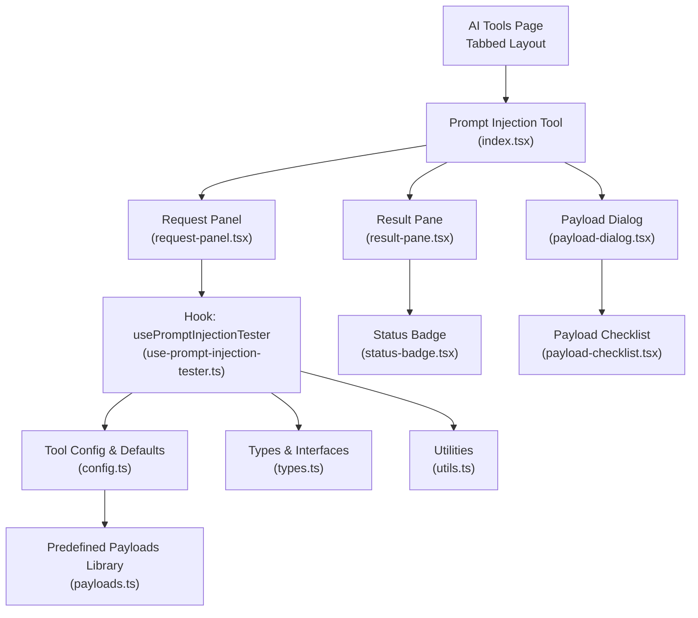
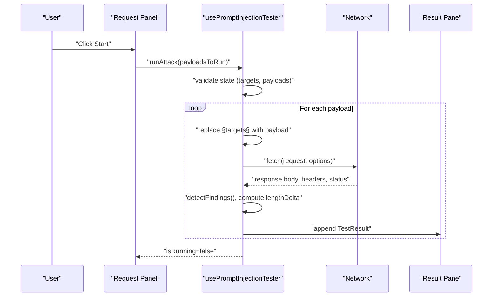
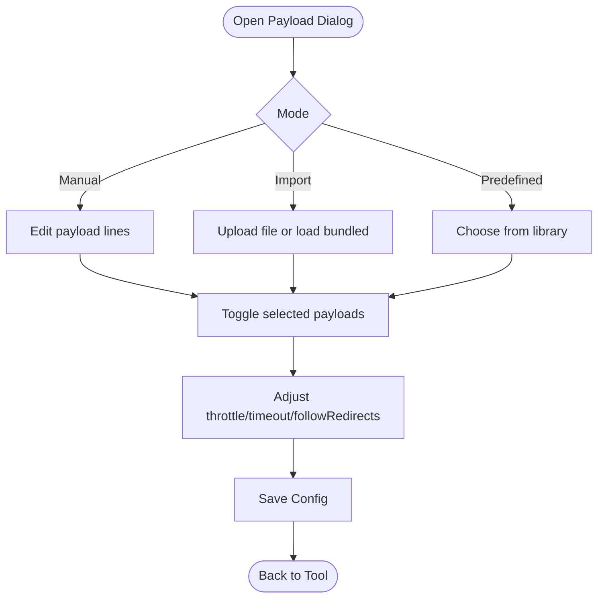
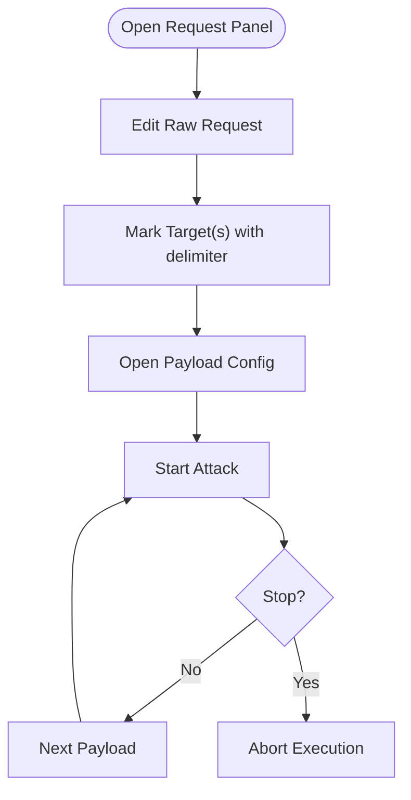
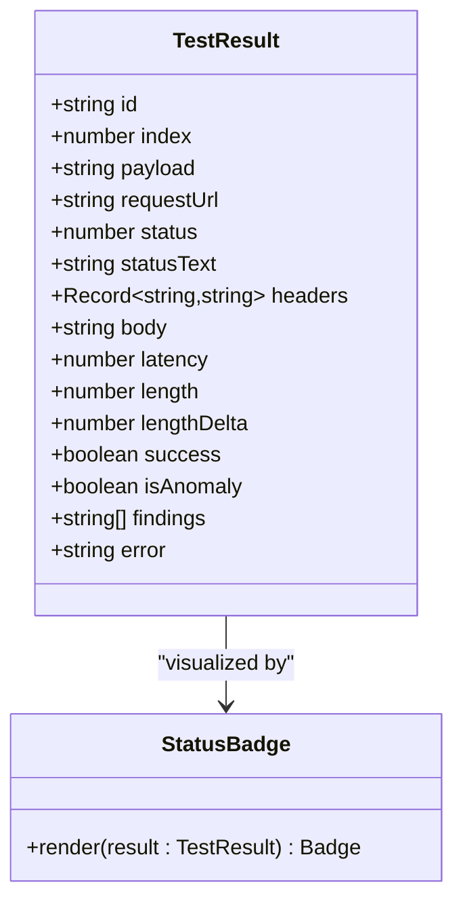
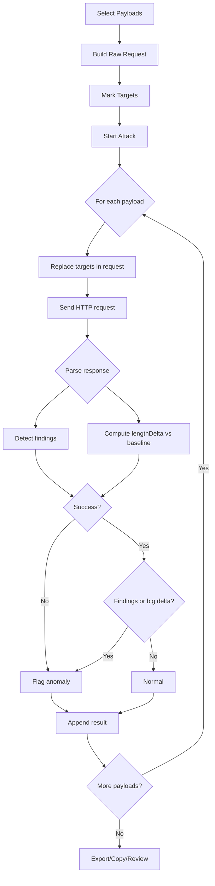
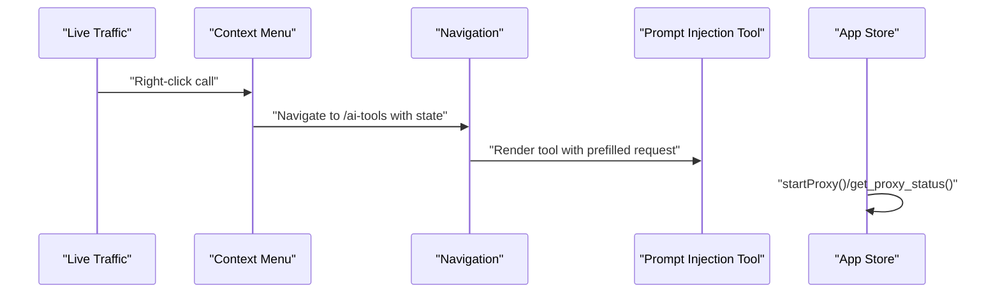
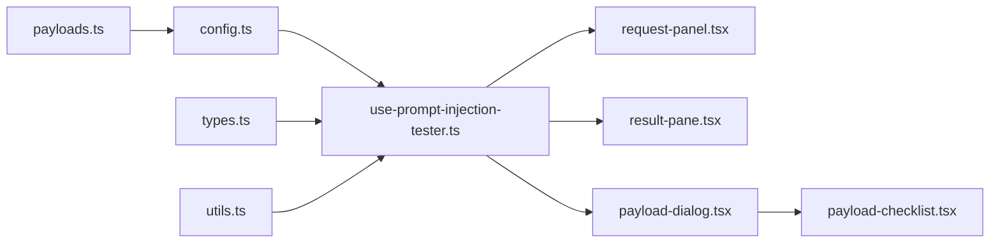

# Prompt Injection Testing

<cite>
**Referenced Files in This Document**
- [index.tsx](file://src/pages/ai-tools/components/prompt-injection/index.tsx)
- [use-prompt-injection-tester.ts](file://src/pages/ai-tools/components/prompt-injection/components/use-prompt-injection-tester.ts)
- [request-panel.tsx](file://src/pages/ai-tools/components/prompt-injection/components/request-panel.tsx)
- [result-pane.tsx](file://src/pages/ai-tools/components/prompt-injection/components/result-pane.tsx)
- [payload-dialog.tsx](file://src/pages/ai-tools/components/prompt-injection/components/payload-dialog.tsx)
- [payload-checklist.tsx](file://src/pages/ai-tools/components/prompt-injection/components/payload-checklist.tsx)
- [config.ts](file://src/pages/ai-tools/components/prompt-injection/components/config.ts)
- [types.ts](file://src/pages/ai-tools/components/prompt-injection/components/types.ts)
- [utils.ts](file://src/pages/ai-tools/components/prompt-injection/components/utils.ts)
- [payloads.ts](file://src/pages/ai-tools/lib/payloads.ts)
- [index.tsx](file://src/pages/ai-tools/index.tsx)
- [log-context-menu.tsx](file://src/pages/live-traffic/components/log-table/log-context-menu.tsx)
- [app.ts](file://src/stores/app.ts)
- [lib.rs](file://src-tauri/src/lib.rs)
</cite>

## Table of Contents
1. [Introduction](#introduction)
2. [Project Structure](#project-structure)
3. [Core Components](#core-components)
4. [Architecture Overview](#architecture-overview)
5. [Detailed Component Analysis](#detailed-component-analysis)
6. [Dependency Analysis](#dependency-analysis)
7. [Performance Considerations](#performance-considerations)
8. [Troubleshooting Guide](#troubleshooting-guide)
9. [Conclusion](#conclusion)
10. [Appendices](#appendices)

## Introduction
This document describes the Prompt Injection Testing functionality in AppRecon’s AI tools. It explains how the system identifies potential vulnerabilities in AI systems by injecting malicious prompts into chat endpoints, how payloads are managed and validated, how requests are crafted and executed, and how results are analyzed and reported. It also covers the integration with AppRecon’s proxy system for capturing and reusing real traffic, along with ethical hacking and responsible disclosure guidance for AI security assessments.

## Project Structure
The Prompt Injection tool is organized as a self-contained module under the AI Tools page. It consists of:
- A central orchestrator that wires UI panels and state
- A request panel for editing raw HTTP requests and launching tests
- A result pane for reviewing outcomes and exporting reports
- A payload configuration dialog supporting manual, imported, and predefined payload modes
- Shared configuration, types, utilities, and predefined payload libraries

**Diagram sources**
- [index.tsx:1-78](file://src/pages/ai-tools/components/prompt-injection/index.tsx#L1-L78)
- [request-panel.tsx:1-132](file://src/pages/ai-tools/components/prompt-injection/components/request-panel.tsx#L1-L132)
- [result-pane.tsx:1-160](file://src/pages/ai-tools/components/prompt-injection/components/result-pane.tsx#L1-L160)
- [payload-dialog.tsx:1-188](file://src/pages/ai-tools/components/prompt-injection/components/payload-dialog.tsx#L1-L188)
- [payload-checklist.tsx:1-38](file://src/pages/ai-tools/components/prompt-injection/components/payload-checklist.tsx#L1-L38)
- [use-prompt-injection-tester.ts:1-407](file://src/pages/ai-tools/components/prompt-injection/components/use-prompt-injection-tester.ts#L1-L407)
- [config.ts:1-35](file://src/pages/ai-tools/components/prompt-injection/components/config.ts#L1-L35)
- [types.ts:1-44](file://src/pages/ai-tools/components/prompt-injection/components/types.ts#L1-L44)
- [utils.ts:1-45](file://src/pages/ai-tools/components/prompt-injection/components/utils.ts#L1-L45)
- [payloads.ts:1-78](file://src/pages/ai-tools/lib/payloads.ts#L1-L78)

**Section sources**
- [index.tsx:1-78](file://src/pages/ai-tools/components/prompt-injection/index.tsx#L1-L78)
- [index.tsx:1-24](file://src/pages/ai-tools/index.tsx#L1-L24)

## Core Components
- Prompt Injection Tool: Orchestrates the request panel, result pane, and payload dialog, and binds them to the tester hook.
- Tester Hook: Manages payload lists, attack settings, request body, endpoint, running state, and test execution loop.
- Request Panel: Edits raw HTTP requests, marks injection targets, selects attack type, and starts/stops tests.
- Result Pane: Displays per-payload results, highlights anomalies, and allows copying/exporting/clearing results.
- Payload Dialog: Manages payload modes (manual/import/predefined), import from files, bundled payloads, and attack settings.
- Utilities: Parse payload lists, detect findings via keyword matching, count/replace marked targets, and download exports.
- Predefined Payloads: Provides curated sets of injection and jailbreak prompts.

**Section sources**
- [index.tsx:13-77](file://src/pages/ai-tools/components/prompt-injection/index.tsx#L13-L77)
- [use-prompt-injection-tester.ts:21-406](file://src/pages/ai-tools/components/prompt-injection/components/use-prompt-injection-tester.ts#L21-L406)
- [request-panel.tsx:33-131](file://src/pages/ai-tools/components/prompt-injection/components/request-panel.tsx#L33-L131)
- [result-pane.tsx:24-159](file://src/pages/ai-tools/components/prompt-injection/components/result-pane.tsx#L24-L159)
- [payload-dialog.tsx:45-187](file://src/pages/ai-tools/components/prompt-injection/components/payload-dialog.tsx#L45-L187)
- [utils.ts:3-44](file://src/pages/ai-tools/components/prompt-injection/components/utils.ts#L3-L44)
- [payloads.ts:1-78](file://src/pages/ai-tools/lib/payloads.ts#L1-L78)

## Architecture Overview
The tool follows a reactive, state-driven architecture:
- UI components update state via callbacks exposed by the tester hook.
- The hook computes derived values (e.g., payloads to run) and executes HTTP requests against the configured endpoint.
- Results are enriched with anomaly detection and findings, then rendered in the result pane.

**Diagram sources**
- [request-panel.tsx:72-87](file://src/pages/ai-tools/components/prompt-injection/components/request-panel.tsx#L72-L87)
- [use-prompt-injection-tester.ts:275-332](file://src/pages/ai-tools/components/prompt-injection/components/use-prompt-injection-tester.ts#L275-L332)
- [result-pane.tsx:72-116](file://src/pages/ai-tools/components/prompt-injection/components/result-pane.tsx#L72-L116)

## Detailed Component Analysis

### Payload Management System
- Modes:
  - Manual: Enter payloads in a text area; parsed line-by-line.
  - Import: Load payloads from a file (.txt/.list/.csv) or use bundled payloads.
  - Predefined: Choose from curated libraries of injection/jailbreak/prompt-leak payloads.
- Validation and selection:
  - Payloads are normalized by trimming and filtering empty lines.
  - Selected payloads are tracked in a set; “Select All” toggles selection across visible payloads.
- Attack settings:
  - Throttle: delay between requests.
  - Timeout: request timeout.
  - Follow redirects: whether to follow redirects automatically.

**Diagram sources**
- [payload-dialog.tsx:78-184](file://src/pages/ai-tools/components/prompt-injection/components/payload-dialog.tsx#L78-L184)
- [payload-checklist.tsx:13-37](file://src/pages/ai-tools/components/prompt-injection/components/payload-checklist.tsx#L13-L37)
- [utils.ts:3-8](file://src/pages/ai-tools/components/prompt-injection/components/utils.ts#L3-L8)

**Section sources**
- [payload-dialog.tsx:45-187](file://src/pages/ai-tools/components/prompt-injection/components/payload-dialog.tsx#L45-L187)
- [payload-checklist.tsx:13-37](file://src/pages/ai-tools/components/prompt-injection/components/payload-checklist.tsx#L13-L37)
- [utils.ts:3-26](file://src/pages/ai-tools/components/prompt-injection/components/utils.ts#L3-L26)
- [payloads.ts:1-78](file://src/pages/ai-tools/lib/payloads.ts#L1-L78)

### Request Panel: Crafting Malicious Prompts
- Raw request editor with syntax highlighting.
- Mark target placeholders in the request body using a special delimiter to inject payloads.
- Attack type selector (currently supports a single sniper mode).
- Start/stop controls with validation to ensure targets are marked and payloads are selected.

**Diagram sources**
- [request-panel.tsx:50-129](file://src/pages/ai-tools/components/prompt-injection/components/request-panel.tsx#L50-L129)

**Section sources**
- [request-panel.tsx:33-131](file://src/pages/ai-tools/components/prompt-injection/components/request-panel.tsx#L33-L131)
- [use-prompt-injection-tester.ts:185-204](file://src/pages/ai-tools/components/prompt-injection/components/use-prompt-injection-tester.ts#L185-L204)

### Result Pane: Analysis and Reporting
- Displays a list of test results with status badges indicating success/error and anomaly flags.
- Shows length delta compared to a baseline response to highlight abnormal outputs.
- Highlights findings detected via keyword matching.
- Provides actions to copy response, export results, and clear results.

**Diagram sources**
- [types.ts:10-26](file://src/pages/ai-tools/components/prompt-injection/components/types.ts#L10-L26)
- [result-pane.tsx:24-159](file://src/pages/ai-tools/components/prompt-injection/components/result-pane.tsx#L24-L159)
- [status-badge.tsx:7-30](file://src/pages/ai-tools/components/prompt-injection/components/status-badge.tsx#L7-L30)

**Section sources**
- [result-pane.tsx:24-159](file://src/pages/ai-tools/components/prompt-injection/components/result-pane.tsx#L24-L159)
- [status-badge.tsx:7-30](file://src/pages/ai-tools/components/prompt-injection/components/status-badge.tsx#L7-L30)
- [types.ts:10-26](file://src/pages/ai-tools/components/prompt-injection/components/types.ts#L10-L26)

### Testing Workflow: From Payload Selection to Result Interpretation
- Step 1: Configure payloads (manual/import/library) and attack settings.
- Step 2: Craft a raw HTTP request and mark injection targets.
- Step 3: Start the attack; the tool iterates through selected payloads.
- Step 4: For each payload, replace targets, send the request, and record the response.
- Step 5: Compute anomalies using a combination of:
  - Keyword-based findings in the response body
  - Non-successful responses
  - Length delta threshold compared to a baseline response
- Step 6: Review results, copy or export findings, and iterate with refined payloads.

**Diagram sources**
- [use-prompt-injection-tester.ts:275-332](file://src/pages/ai-tools/components/prompt-injection/components/use-prompt-injection-tester.ts#L275-L332)
- [utils.ts:22-34](file://src/pages/ai-tools/components/prompt-injection/components/utils.ts#L22-L34)

**Section sources**
- [use-prompt-injection-tester.ts:275-332](file://src/pages/ai-tools/components/prompt-injection/components/use-prompt-injection-tester.ts#L275-L332)
- [utils.ts:22-34](file://src/pages/ai-tools/components/prompt-injection/components/utils.ts#L22-L34)

### Integration with AppRecon’s Proxy System
- Live Traffic captures real HTTP(S) calls and can be used to populate the Prompt Injection tool:
  - Right-click a captured call and use the context menu to open the request in the Prompt Injection tool.
  - The tool reads the request state and pre-populates the raw request and endpoint.
- Proxy runtime management:
  - The application exposes commands to start/stop the proxy and query its status.
  - The front-end invokes these commands to enable real-time traffic interception and analysis.

**Diagram sources**
- [log-context-menu.tsx:107-147](file://src/pages/live-traffic/components/log-table/log-context-menu.tsx#L107-L147)
- [index.tsx:64-70](file://src/pages/ai-tools/components/prompt-injection/index.tsx#L64-L70)
- [app.ts:38-57](file://src/stores/app.ts#L38-L57)
- [lib.rs:39-50](file://src-tauri/src/lib.rs#L39-L50)

**Section sources**
- [log-context-menu.tsx:107-147](file://src/pages/live-traffic/components/log-table/log-context-menu.tsx#L107-L147)
- [index.tsx:64-70](file://src/pages/ai-tools/components/prompt-injection/index.tsx#L64-L70)
- [app.ts:38-57](file://src/stores/app.ts#L38-L57)
- [lib.rs:39-50](file://src-tauri/src/lib.rs#L39-L50)

## Dependency Analysis
- Centralized configuration defines tool metadata, default request, and response keywords.
- The tester hook depends on:
  - Configuration and defaults
  - Utilities for parsing, replacing targets, and detecting findings
  - Payload libraries for predefined sets
- UI components depend on the tester hook for state and callbacks.

**Diagram sources**
- [config.ts:1-35](file://src/pages/ai-tools/components/prompt-injection/components/config.ts#L1-L35)
- [types.ts:1-44](file://src/pages/ai-tools/components/prompt-injection/components/types.ts#L1-L44)
- [utils.ts:1-45](file://src/pages/ai-tools/components/prompt-injection/components/utils.ts#L1-L45)
- [payloads.ts:1-78](file://src/pages/ai-tools/lib/payloads.ts#L1-L78)
- [use-prompt-injection-tester.ts:1-407](file://src/pages/ai-tools/components/prompt-injection/components/use-prompt-injection-tester.ts#L1-L407)
- [request-panel.tsx:1-132](file://src/pages/ai-tools/components/prompt-injection/components/request-panel.tsx#L1-L132)
- [result-pane.tsx:1-160](file://src/pages/ai-tools/components/prompt-injection/components/result-pane.tsx#L1-L160)
- [payload-dialog.tsx:1-188](file://src/pages/ai-tools/components/prompt-injection/components/payload-dialog.tsx#L1-L188)
- [payload-checklist.tsx:1-38](file://src/pages/ai-tools/components/prompt-injection/components/payload-checklist.tsx#L1-L38)

**Section sources**
- [config.ts:1-35](file://src/pages/ai-tools/components/prompt-injection/components/config.ts#L1-L35)
- [use-prompt-injection-tester.ts:1-407](file://src/pages/ai-tools/components/prompt-injection/components/use-prompt-injection-tester.ts#L1-L407)

## Performance Considerations
- Throttle requests to avoid overwhelming the target endpoint and to reduce rate-limiting risk.
- Use timeouts appropriate to the endpoint’s expected latency.
- Limit the number of concurrent requests by relying on the sequential runner; parallelization is not implemented.
- Prefer targeted payloads and a small subset of predefined/jailbreak combinations to minimize noise.
- Export results periodically to avoid memory pressure with long test runs.

## Troubleshooting Guide
- No targets marked:
  - The tool prevents starting if no targets are marked; use the “Mark Target” action to wrap the desired insertion point with delimiters.
- Empty payload list:
  - Ensure at least one payload is selected; for manual mode, verify non-empty lines; for import mode, confirm a file was loaded or bundled payloads were applied.
- Requests fail:
  - Verify endpoint correctness and network connectivity; check timeout and redirect settings; review error messages in the result pane.
- Anomalies not detected:
  - Adjust response keywords in the tool configuration; consider increasing the length delta threshold by adjusting baseline expectations.
- Export issues:
  - Confirm results exist; use the export action to download a JSON report for further analysis.

**Section sources**
- [request-panel.tsx:72-87](file://src/pages/ai-tools/components/prompt-injection/components/request-panel.tsx#L72-L87)
- [use-prompt-injection-tester.ts:280-283](file://src/pages/ai-tools/components/prompt-injection/components/use-prompt-injection-tester.ts#L280-L283)
- [result-pane.tsx:141-147](file://src/pages/ai-tools/components/prompt-injection/components/result-pane.tsx#L141-L147)

## Conclusion
The Prompt Injection Testing tool provides a structured, repeatable approach to assessing AI systems for prompt injection vulnerabilities. By combining predefined and custom payloads, precise target marking, and robust anomaly detection, it enables security professionals to efficiently uncover weaknesses in chat endpoints. Integration with the proxy system enhances realism by leveraging actual traffic, while built-in reporting and export capabilities support responsible disclosure and remediation workflows.

## Appendices

### Practical Examples of Common Prompt Injection Patterns
- System override and role manipulation: prompts designed to bypass content policies and assume elevated roles.
- Jailbreaking: prompts encouraging unrestricted responses or workarounds around safety constraints.
- Prompt leakage: attempts to coerce the model into revealing internal instructions or configuration.

These patterns are curated in the predefined payload libraries and can be extended via manual or imported sources.

**Section sources**
- [payloads.ts:1-78](file://src/pages/ai-tools/lib/payloads.ts#L1-L78)

### Ethical Hacking and Responsible Disclosure Guidelines
- Scope and authorization:
  - Only test systems you own or have explicit written permission to assess.
- Minimize impact:
  - Use conservative throttle and timeout settings; avoid causing service degradation.
- Data handling:
  - Do not extract sensitive data; sanitize logs and reports before sharing.
- Reporting:
  - Provide clear reproduction steps, affected endpoints, and severity classification.
- Follow-up:
  - Coordinate remediation timelines and verify fixes before public disclosure.

[No sources needed since this section provides general guidance]