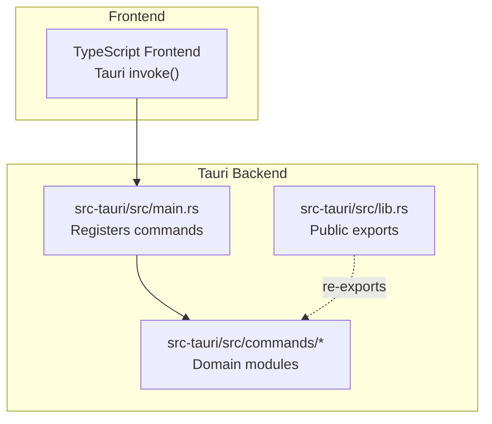
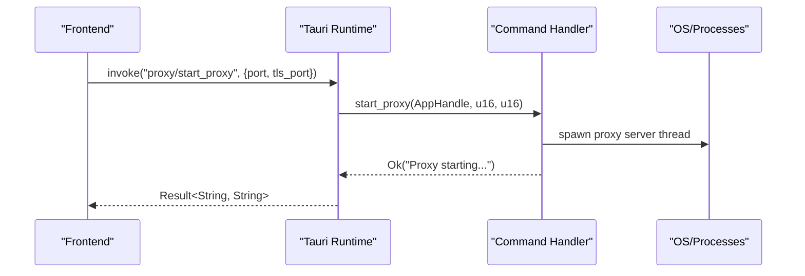
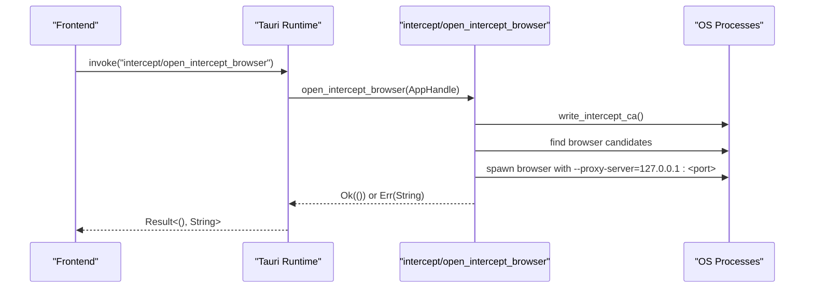
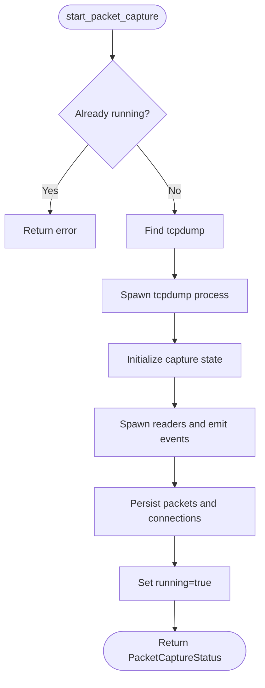
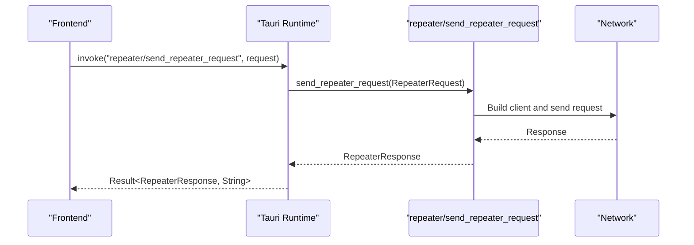
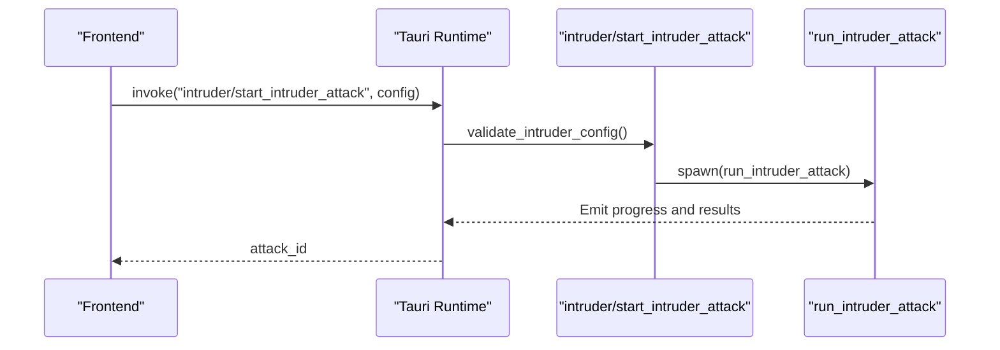
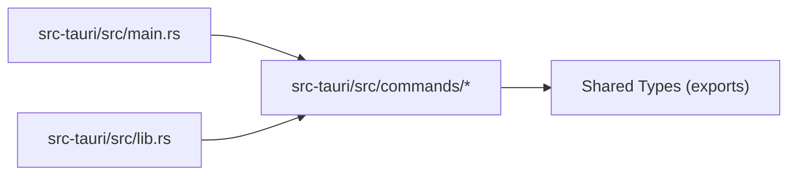

# API Reference

<cite>
**Referenced Files in This Document**
- [src-tauri/src/main.rs](file://src-tauri/src/main.rs)
- [src-tauri/src/lib.rs](file://src-tauri/src/lib.rs)
- [src-tauri/src/commands/mod.rs](file://src-tauri/src/commands/mod.rs)
- [src-tauri/src/commands/proxy.rs](file://src-tauri/src/commands/proxy.rs)
- [src-tauri/src/commands/intercept.rs](file://src-tauri/src/commands/intercept.rs)
- [src-tauri/src/commands/history.rs](file://src-tauri/src/commands/history.rs)
- [src-tauri/src/commands/packet_capture.rs](file://src-tauri/src/commands/packet_capture.rs)
- [src-tauri/src/commands/repeater.rs](file://src-tauri/src/commands/repeater.rs)
- [src-tauri/src/commands/intruder.rs](file://src-tauri/src/commands/intruder.rs)
- [src-tauri/src/commands/cert.rs](file://src-tauri/src/commands/cert.rs)
- [src-tauri/src/commands/storage.rs](file://src-tauri/src/commands/storage.rs)
- [src-tauri/src/commands/ai.rs](file://src-tauri/src/commands/ai.rs)
- [src-tauri/tauri.conf.json](file://src-tauri/tauri.conf.json)
</cite>

## Table of Contents
1. [Introduction](#introduction)
2. [Project Structure](#project-structure)
3. [Core Components](#core-components)
4. [Architecture Overview](#architecture-overview)
5. [Detailed Component Analysis](#detailed-component-analysis)
6. [Dependency Analysis](#dependency-analysis)
7. [Performance Considerations](#performance-considerations)
8. [Troubleshooting Guide](#troubleshooting-guide)
9. [Conclusion](#conclusion)
10. [Appendices](#appendices)

## Introduction
This document describes the Tauri command system powering AppRecon’s backend. It covers all public IPC endpoints exposed via Tauri, including proxy management, traffic interception, database access, packet capture, security testing tools, and AI integrations. It also provides parameter schemas, return value specifications, error handling, response formats, authentication and security considerations, and TypeScript interface guidance for frontend integration.

## Project Structure
AppRecon’s backend is implemented in Rust under src-tauri. Commands are grouped by domain (proxy, intercept, history, packet capture, repeater, intruder, cert, storage, AI) and registered in the Tauri Builder’s invoke handler. The frontend (TypeScript) invokes these commands using Tauri’s invoke mechanism.

**Diagram sources**
- [src-tauri/src/main.rs](file://src-tauri/src/main.rs)
- [src-tauri/src/lib.rs](file://src-tauri/src/lib.rs)
- [src-tauri/src/commands/mod.rs](file://src-tauri/src/commands/mod.rs)

**Section sources**
- [src-tauri/src/main.rs](file://src-tauri/src/main.rs)
- [src-tauri/src/lib.rs](file://src-tauri/src/lib.rs)
- [src-tauri/src/commands/mod.rs](file://src-tauri/src/commands/mod.rs)

## Core Components
- Proxy management: start/stop proxy, get runtime status, and related intercept controls.
- Traffic interception: enable/disable, pause/resume requests, forward/drop, manage bypass patterns, open managed browser, trust CA.
- History/database: CRUD for documents, proxy logs, WebSocket logs, paginated queries, tree views, and clearing operations.
- Packet capture: list interfaces, configure wireless, start/stop capture, emit events, paginate stored packets.
- Repeater: send HTTP requests and manage WebSocket repeater sessions.
- Intruder: define attack modes, payloads, concurrency, delays, retries, and receive progress/results via events.
- Certificate operations: export and save CA certificate.
- Storage: get app data and database paths.
- AI: manage AI settings and Mastra process lifecycle.

**Section sources**
- [src-tauri/src/main.rs](file://src-tauri/src/main.rs)
- [src-tauri/src/commands/proxy.rs](file://src-tauri/src/commands/proxy.rs)
- [src-tauri/src/commands/intercept.rs](file://src-tauri/src/commands/intercept.rs)
- [src-tauri/src/commands/history.rs](file://src-tauri/src/commands/history.rs)
- [src-tauri/src/commands/packet_capture.rs](file://src-tauri/src/commands/packet_capture.rs)
- [src-tauri/src/commands/repeater.rs](file://src-tauri/src/commands/repeater.rs)
- [src-tauri/src/commands/intruder.rs](file://src-tauri/src/commands/intruder.rs)
- [src-tauri/src/commands/cert.rs](file://src-tauri/src/commands/cert.rs)
- [src-tauri/src/commands/storage.rs](file://src-tauri/src/commands/storage.rs)
- [src-tauri/src/commands/ai.rs](file://src-tauri/src/commands/ai.rs)

## Architecture Overview
The Tauri Builder registers a curated set of Rust command functions. Each command accepts typed parameters and returns typed results or errors. Some commands spawn OS-level processes or threads and emit events to the frontend.

**Diagram sources**
- [src-tauri/src/main.rs](file://src-tauri/src/main.rs)
- [src-tauri/src/commands/proxy.rs](file://src-tauri/src/commands/proxy.rs)

**Section sources**
- [src-tauri/src/main.rs](file://src-tauri/src/main.rs)

## Detailed Component Analysis

### Proxy Management APIs
- Command: proxy/start_proxy
  - Parameters: port: u16, tls_port: u16
  - Returns: Result<String, String> (status message)
  - Behavior: Spawns a background thread to run the proxy with provided ports.
  - Notes: Logs to a temporary file for diagnostics.
  
- Command: proxy/stop_proxy
  - Parameters: none
  - Returns: Result<String, String> (success message)
  - Behavior: Stops the proxy gracefully.
  
- Command: proxy/get_proxy_status
  - Parameters: none
  - Returns: Result<ProxyRuntimeStatus, String>
  - Fields: running: bool, port: Option<u16>, default_port: u16, connections: usize
  - Behavior: Probes local port connectivity to infer runtime status.

**Section sources**
- [src-tauri/src/commands/proxy.rs](file://src-tauri/src/commands/proxy.rs)

### Traffic Interception APIs
- Command: intercept/get_intercept_status
  - Parameters: none
  - Returns: Result<InterceptStatus, String>
  - Behavior: Reads current proxy intercept status from state.

- Command: intercept/set_intercept_enabled
  - Parameters: enabled: bool
  - Returns: Result<InterceptStatus, String>
  - Behavior: Sets intercept mode to Enabled or Disabled.

- Command: intercept/get_paused_requests
  - Parameters: none
  - Returns: Result<Vec<PausedRequest>, String>
  - Behavior: Lists paused intercepted requests.

- Command: intercept/forward_intercepted_request
  - Parameters: request_id: String, request: Option<InterceptForwardRequest>
  - Returns: Result<(), String>
  - Behavior: Resumes a paused request; optionally re-encodes body if content-encoding header is present.

- Command: intercept/drop_intercepted_request
  - Parameters: request_id: String
  - Returns: Result<(), String>
  - Behavior: Drops a paused request.

- Command: intercept/get_intercept_bypass_patterns
  - Parameters: none
  - Returns: Result<Vec<String>, String>
  - Behavior: Retrieves current bypass patterns.

- Command: intercept/set_intercept_bypass_patterns
  - Parameters: patterns: Vec<String>
  - Returns: Result<Vec<String>, String>
  - Behavior: Sets bypass patterns and returns current list.

- Command: intercept/add_intercept_bypass_pattern
  - Parameters: pattern: String
  - Returns: Result<Vec<String>, String>
  - Behavior: Adds a single bypass pattern.

- Command: intercept/remove_intercept_bypass_pattern
  - Parameters: pattern: String
  - Returns: Result<Vec<String>, String>
  - Behavior: Removes a single bypass pattern.

- Command: intercept/open_intercept_browser
  - Parameters: none
  - Returns: Result<(), String>
  - Behavior: Launches a managed Chromium/Chrome instance with proxy configured to the active proxy port. Writes CA to a profile-specific location and attempts to import CA via NSS certutil.

- Command: intercept/trust_intercept_ca
  - Parameters: none
  - Returns: Result<String, String>
  - Behavior: On macOS, installs and trusts the CA in the login keychain; otherwise, writes and imports into a managed Chrome profile.

**Diagram sources**
- [src-tauri/src/commands/intercept.rs](file://src-tauri/src/commands/intercept.rs)

**Section sources**
- [src-tauri/src/commands/intercept.rs](file://src-tauri/src/commands/intercept.rs)

### Database Access APIs (History/Storage)
- Command: history/clear_proxy_all
  - Parameters: none
  - Returns: Result<(), String>
  - Behavior: Clears all proxy logs.

- Command: history/get_documents
  - Parameters: none
  - Returns: Result<Vec<DocumentRecord>, String>
  - Behavior: Lists all saved documents.

- Command: history/save_document
  - Parameters: document: DocumentRecord
  - Returns: Result<(), String>
  - Behavior: Saves a document.

- Command: history/delete_document
  - Parameters: document_id: String
  - Returns: Result<(), String>
  - Behavior: Deletes a document by ID.

- Command: history/delete_proxy_by_id
  - Parameters: log_id: String
  - Returns: Result<(), String>
  - Behavior: Deletes a proxy log by ID.

- Command: history/get_proxy_all
  - Parameters: none
  - Returns: Result<Vec<ProxyRecord>, String>
  - Behavior: Retrieves all proxy records.

- Command: history/get_proxy_filtered
  - Parameters: filter: ProxyFilter
  - Returns: Result<Vec<ProxyRecord>, String>
  - Behavior: Retrieves filtered proxy records.

- Command: history/get_proxy_paginated
  - Parameters: page: u32, per_page: u32, filter: Option<ProxyFilter>, sort_order: Option<String>
  - Returns: Result<PaginatedResponse<ProxyLogSummary>, String>
  - Behavior: Paginated proxy logs with optional filter and sort order.

- Command: history/get_proxy_detail
  - Parameters: log_id: String
  - Returns: Result<ProxyRecord, String>
  - Behavior: Retrieves a single proxy record by ID; returns error if not found.

- Command: history/get_proxy_tree
  - Parameters: filter: Option<ProxyFilter>
  - Returns: Result<Vec<TreeNode>, String>
  - Behavior: Builds a tree view of proxy logs.

- Command: history/get_websocket_paginated
  - Parameters: page: u32, per_page: u32, filter: Option<WebSocketFilter>
  - Returns: Result<PaginatedResponse<WebSocketConnectionSummary>, String>
  - Behavior: Paginated WebSocket connections.

- Command: history/get_websocket_detail
  - Parameters: connection_id: String
  - Returns: Result<WebSocketConnectionDetail, String>
  - Behavior: Retrieves a single WebSocket connection detail; returns error if not found.

- Command: history/clear_websocket_all
  - Parameters: none
  - Returns: Result<(), String>
  - Behavior: Clears all WebSocket records.

- Command: history/delete_websocket_by_id
  - Parameters: connection_id: String
  - Returns: Result<(), String>
  - Behavior: Deletes a WebSocket connection by ID.

**Section sources**
- [src-tauri/src/commands/history.rs](file://src-tauri/src/commands/history.rs)

### Packet Capture APIs
- Command: packet_capture/prepare_packet_capture_permissions
  - Parameters: none
  - Returns: Result<String, String>
  - Behavior: macOS-only; attempts to grant BPF device permissions.

- Command: packet_capture/list_capture_interfaces
  - Parameters: none
  - Returns: Result<Vec<CaptureInterface>, String>
  - Behavior: Enumerates capture interfaces, enriching with IP addresses and WiFi/loopback metadata.

- Command: packet_capture/configure_capture_network
  - Parameters: config: NetworkCaptureConfig
  - Returns: Result<String, String>
  - Behavior: macOS-only; connects to a specified SSID with optional password for wireless capture.

- Command: packet_capture/start_packet_capture
  - Parameters: config: NetworkCaptureConfig
  - Returns: Result<PacketCaptureStatus, String>
  - Behavior: Spawns tcpdump, parses lines, emits “packet-capture-event” and “packet-capture-error” events, persists packets and connections, and updates capture metadata.

- Command: packet_capture/stop_packet_capture
  - Parameters: none
  - Returns: Result<PacketCaptureStatus, String>
  - Behavior: Stops the active capture and finalizes the record.

- Command: packet_capture/get_packet_capture_status
  - Parameters: none
  - Returns: Result<PacketCaptureStatus, String>
  - Behavior: Returns current capture status and active capture ID.

- Command: packet_capture/get_packets_paginated
  - Parameters: capture_id: String, page: u32, per_page: u32
  - Returns: Result<PaginatedResponse<StoredPacketSummary>, String>
  - Behavior: Paginated retrieval of captured packets.

**Diagram sources**
- [src-tauri/src/commands/packet_capture.rs](file://src-tauri/src/commands/packet_capture.rs)

**Section sources**
- [src-tauri/src/commands/packet_capture.rs](file://src-tauri/src/commands/packet_capture.rs)

### Repeater APIs
- Command: repeater/send_repeater_request
  - Parameters: request: RepeaterRequest
  - Returns: Result<RepeaterResponse, String>
  - Behavior: Sends an HTTP request with optional body re-encoding based on content-encoding header, measures latency, and returns structured response.

- Command: repeater/ws_repeater_connect
  - Parameters: url: String, headers: HashMap<String, String>
  - Returns: Result<String, String>
  - Behavior: Establishes a WebSocket connection, normalizes scheme, manages connection lifecycle, and emits “ws-repeater-message” events.

- Command: repeater/ws_repeater_send
  - Parameters: connection_id: String, message: String
  - Returns: Result<(), String>
  - Behavior: Sends a message on an established WebSocket connection.

- Command: repeater/ws_repeater_disconnect
  - Parameters: connection_id: String
  - Returns: Result<(), String>
  - Behavior: Cancels and closes a WebSocket connection.

**Diagram sources**
- [src-tauri/src/commands/repeater.rs](file://src-tauri/src/commands/repeater.rs)

**Section sources**
- [src-tauri/src/commands/repeater.rs](file://src-tauri/src/commands/repeater.rs)

### Intruder Attack APIs
- Command: intruder/start_intruder_attack
  - Parameters: config: IntruderAttackConfig
  - Returns: Result<String, String>
  - Behavior: Validates config, assigns an attack ID, spawns async attack runner, and returns the ID.

- Command: intruder/stop_intruder_attack
  - Parameters: attack_id: String
  - Returns: Result<(), String>
  - Behavior: Signals cancellation for the given attack ID.

- Events:
  - “intruder-progress-<attack_id>”: Progress updates with current/total counts.
  - “intruder-result-<attack_id>”: Individual result payloads with status, timing, and optional grep match/extraction.

- Validation and Execution:
  - Validates base request URL, payload positions, position ranges, and payload sources.
  - Supports Sniper, BatteringRam, Pitchfork, and ClusterBomb modes.
  - Concurrency via semaphore, optional delays, retries, and session handling.

**Diagram sources**
- [src-tauri/src/commands/intruder.rs](file://src-tauri/src/commands/intruder.rs)

**Section sources**
- [src-tauri/src/commands/intruder.rs](file://src-tauri/src/commands/intruder.rs)

### Certificate Operations APIs
- Command: cert/get_ca_cert
  - Parameters: none
  - Returns: Result<String, String>
  - Behavior: Exports the CA certificate as PEM.

- Command: cert/save_ca_cert
  - Parameters: path: String, content: String
  - Returns: Result<(), String>
  - Behavior: Writes the provided PEM content to disk.

**Section sources**
- [src-tauri/src/commands/cert.rs](file://src-tauri/src/commands/cert.rs)

### Storage Information APIs
- Command: storage/get_storage_info
  - Parameters: none
  - Returns: Result<StorageInfo, String>
  - Fields: app_data_dir: String, database_path: String
  - Behavior: Resolves app data directory and constructs database path.

**Section sources**
- [src-tauri/src/commands/storage.rs](file://src-tauri/src/commands/storage.rs)

### AI Integration APIs
- Command: ai/get_ai_settings
  - Parameters: none
  - Returns: Result<AiSettings, String>
  - Behavior: Retrieves AI settings.

- Command: ai/save_ai_settings
  - Parameters: settings: AiSettings
  - Returns: Result<(), String>
  - Behavior: Persists AI settings.

- Command: ai/has_ai_api_key
  - Parameters: none
  - Returns: Result<bool, String>
  - Behavior: Checks presence of AI API key.

- Command: ai/clear_ai_api_key
  - Parameters: none
  - Returns: Result<(), String>
  - Behavior: Clears AI API key.

- Command: ai/get_mastra_status
  - Parameters: none
  - Returns: Result<MastraStatus, String>
  - Behavior: Reports Mastra process status.

- Command: ai/start_mastra
  - Parameters: none
  - Returns: Result<(), String>
  - Behavior: Starts Mastra process if configured.

- Command: ai/stop_mastra
  - Parameters: none
  - Returns: Result<(), String>
  - Behavior: Stops Mastra process.

**Section sources**
- [src-tauri/src/commands/ai.rs](file://src-tauri/src/commands/ai.rs)

## Dependency Analysis
The Tauri Builder aggregates all command modules and exposes them via the invoke handler. Public re-exports in lib.rs surface types used across modules.

**Diagram sources**
- [src-tauri/src/main.rs](file://src-tauri/src/main.rs)
- [src-tauri/src/lib.rs](file://src-tauri/src/lib.rs)
- [src-tauri/src/commands/mod.rs](file://src-tauri/src/commands/mod.rs)

**Section sources**
- [src-tauri/src/main.rs](file://src-tauri/src/main.rs)
- [src-tauri/src/lib.rs](file://src-tauri/src/lib.rs)
- [src-tauri/src/commands/mod.rs](file://src-tauri/src/commands/mod.rs)

## Performance Considerations
- Concurrency: Intruder uses a semaphore to cap concurrent requests; adjust concurrency based on target capacity.
- Payload generation: ClusterBomb and large number ranges can produce very large workloads; validate limits and consider rate limiting.
- Packet capture: tcpdump output parsing and persistence occur on separate threads; ensure sufficient CPU and disk throughput.
- Repeater: Body re-encoding occurs when content-encoding is detected; avoid unnecessary re-encoding for binary payloads.
- Interceptor: Forwarding/dropping paused requests is O(1) lookup; bypass pattern lists should be kept reasonably sized.

[No sources needed since this section provides general guidance]

## Troubleshooting Guide
- Proxy start/stop failures:
  - Verify ports are free and accessible.
  - Check logs written to the temporary log file for diagnostics.
- Interception browser launch:
  - Ensure a supported Chromium/Chrome executable is discoverable or available in PATH.
  - On macOS, trust the CA in the login keychain; on others, import into a managed Chrome profile.
- Packet capture:
  - On macOS, run permission preparation if capture fails due to BPF device access.
  - Confirm tcpdump availability and correct interface selection.
- Intruder:
  - Validate payload configurations and position markers; ensure payload sources are non-empty.
  - Use stop_intruder_attack to cancel long-running jobs.
- Repeater:
  - For WebSocket, ensure scheme normalization (http/https to ws/wss) and proper close handling.

**Section sources**
- [src-tauri/src/commands/proxy.rs](file://src-tauri/src/commands/proxy.rs)
- [src-tauri/src/commands/intercept.rs](file://src-tauri/src/commands/intercept.rs)
- [src-tauri/src/commands/packet_capture.rs](file://src-tauri/src/commands/packet_capture.rs)
- [src-tauri/src/commands/intruder.rs](file://src-tauri/src/commands/intruder.rs)
- [src-tauri/src/commands/repeater.rs](file://src-tauri/src/commands/repeater.rs)

## Conclusion
AppRecon’s Tauri command system provides a comprehensive toolkit for proxy management, traffic interception, database-backed history, packet capture, HTTP/WebSocket repeater, bulk security testing via Intruder, certificate operations, storage introspection, and AI integration. The APIs are designed for robust error handling, event-driven progress reporting, and OS-level integration where required.

[No sources needed since this section summarizes without analyzing specific files]

## Appendices

### Authentication and Security
- Authentication: No built-in authentication is enforced at the IPC level. Treat all commands as privileged operations and restrict exposure accordingly.
- Rate limiting: Not implemented in commands. Apply rate limiting at the frontend or wrapper layer if invoking commands frequently.
- Security implications:
  - Proxy and interception can MITM traffic; ensure compliance with applicable laws and policies.
  - Packet capture requires elevated privileges on some platforms; handle permissions carefully.
  - CA installation affects trust stores; revoke or remove certificates after use.

**Section sources**
- [src-tauri/src/commands/intercept.rs](file://src-tauri/src/commands/intercept.rs)
- [src-tauri/src/commands/packet_capture.rs](file://src-tauri/src/commands/packet_capture.rs)

### TypeScript Integration Guide
- Invoke commands using Tauri’s invoke function with the exact command names listed above.
- Use the exported types from lib.rs to model request/response shapes in TypeScript:
  - ProxyRuntimeStatus, InterceptStatus, PausedRequest, ProxyFilter, WebSocketFilter, PaginatedResponse<T>, TreeNode, DocumentRecord, ProxyRecord, WebSocketConnectionSummary, WebSocketConnectionDetail, StoredPacketSummary, PacketCaptureStatus, NetworkCaptureConfig, RepeaterRequest, RepeaterResponse, WsRepeaterMessage, IntruderAttackConfig, IntruderProgress, IntruderAttackResult, AiSettings, MastraStatus.
- Subscribe to emitted events:
  - Packet capture: “packet-capture-event”, “packet-capture-error”
  - Intruder: “intruder-progress-<attack_id>”, “intruder-result-<attack_id>”
  - WebSocket repeater: “ws-repeater-message”

**Section sources**
- [src-tauri/src/lib.rs](file://src-tauri/src/lib.rs)
- [src-tauri/src/commands/packet_capture.rs](file://src-tauri/src/commands/packet_capture.rs)
- [src-tauri/src/commands/intruder.rs](file://src-tauri/src/commands/intruder.rs)
- [src-tauri/src/commands/repeater.rs](file://src-tauri/src/commands/repeater.rs)

### Migration and Backwards Compatibility
- Versioning: The application version is declared in tauri.conf.json; use semantic versioning for breaking changes.
- Command signatures: Keep parameter names and types stable; deprecate fields with new optional ones and maintain backward-compatible defaults.
- Event names: Prefix with domain (e.g., “intruder-*”) to avoid collisions; document changes in release notes.
- Error messages: Return descriptive strings; avoid internal stack traces in production builds.

**Section sources**
- [src-tauri/tauri.conf.json](file://src-tauri/tauri.conf.json)