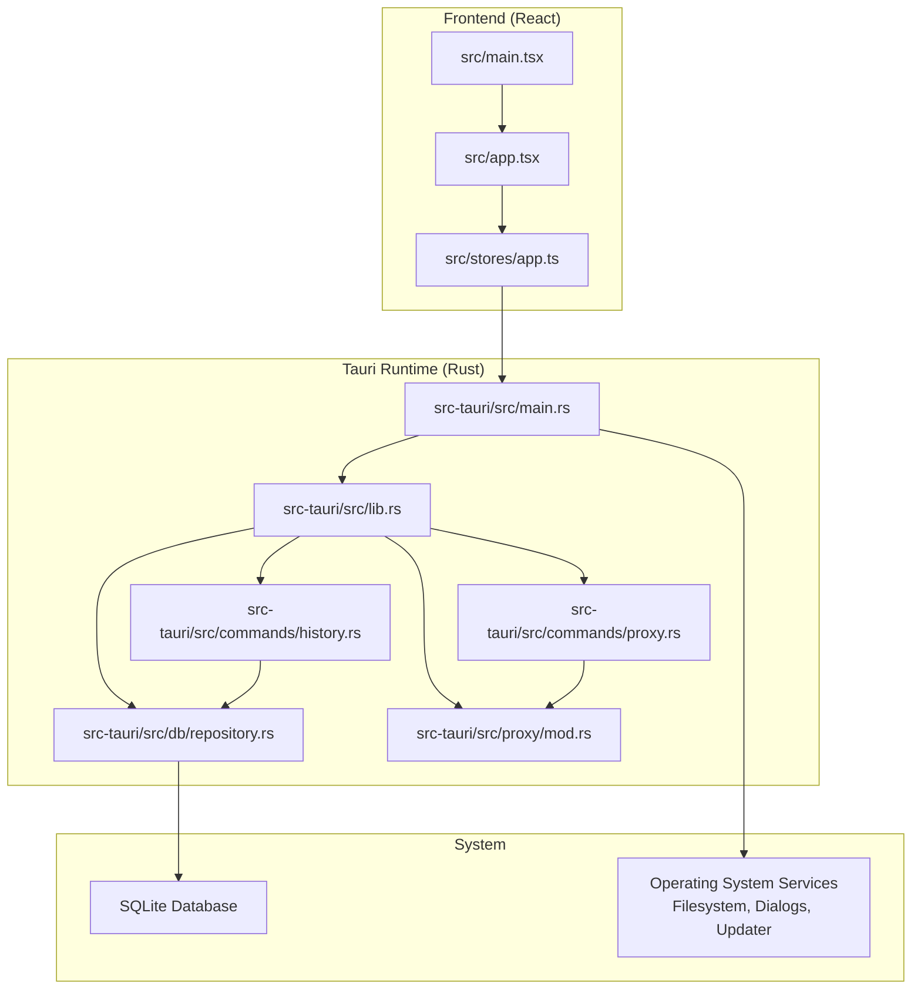
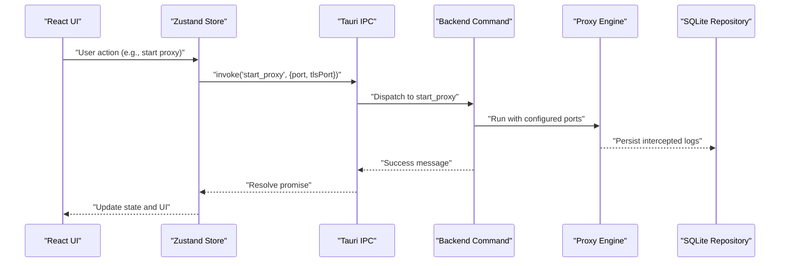
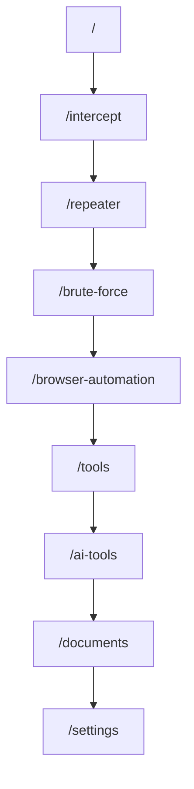
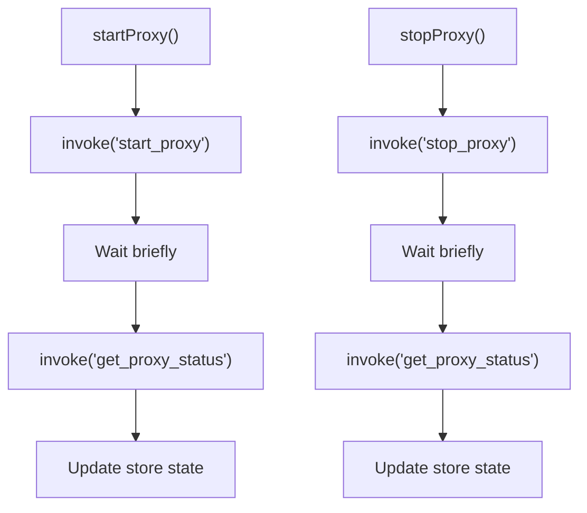
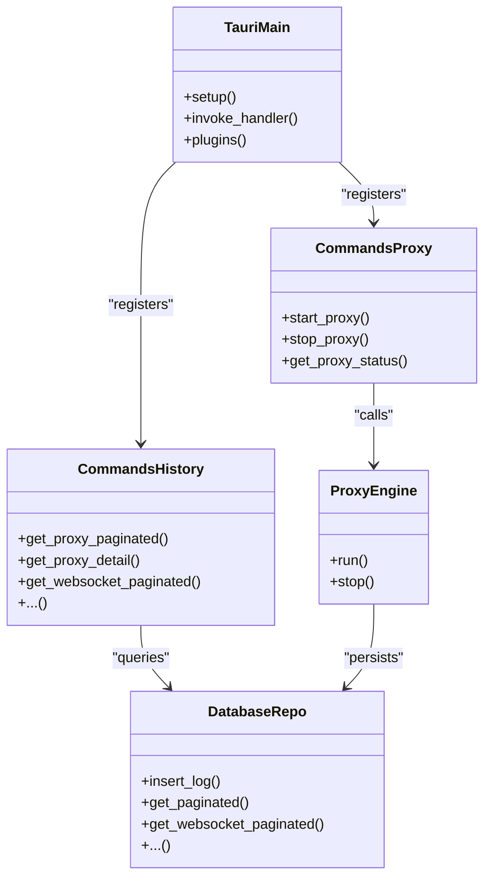
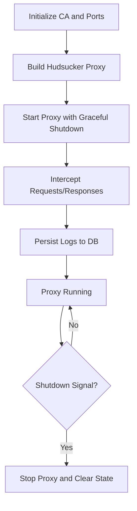
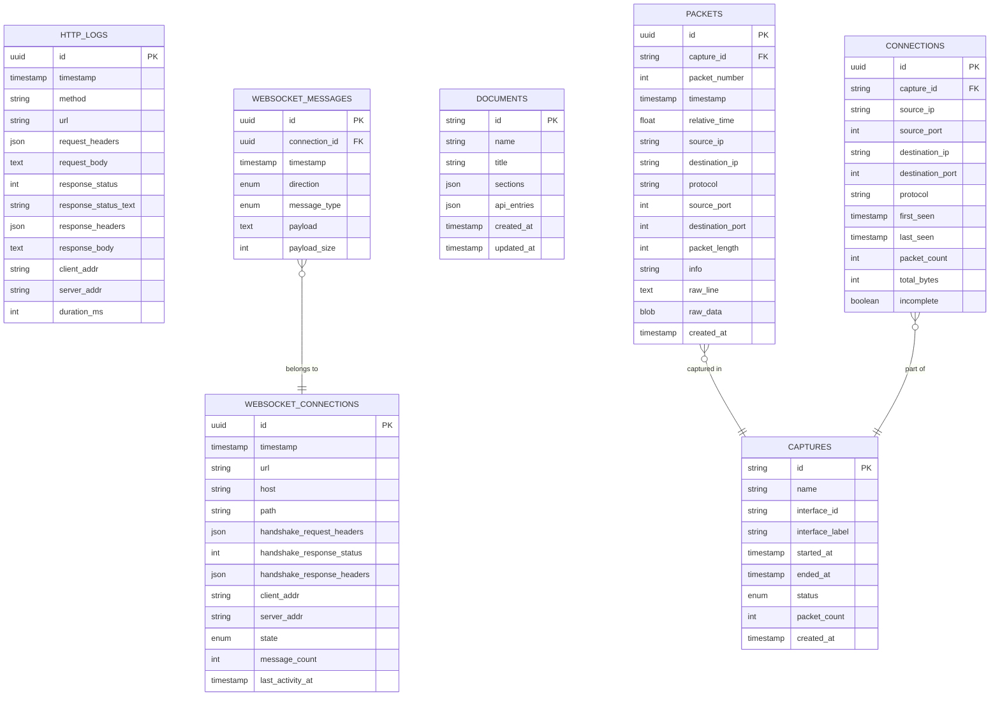
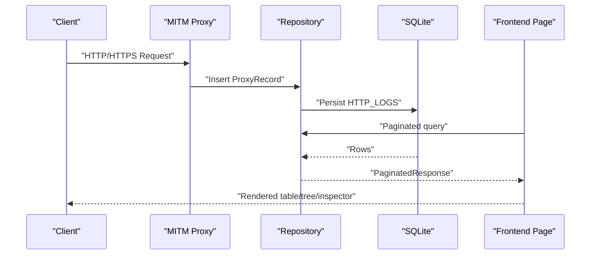
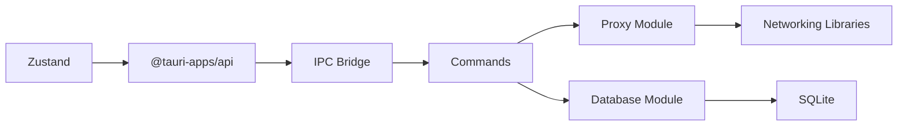
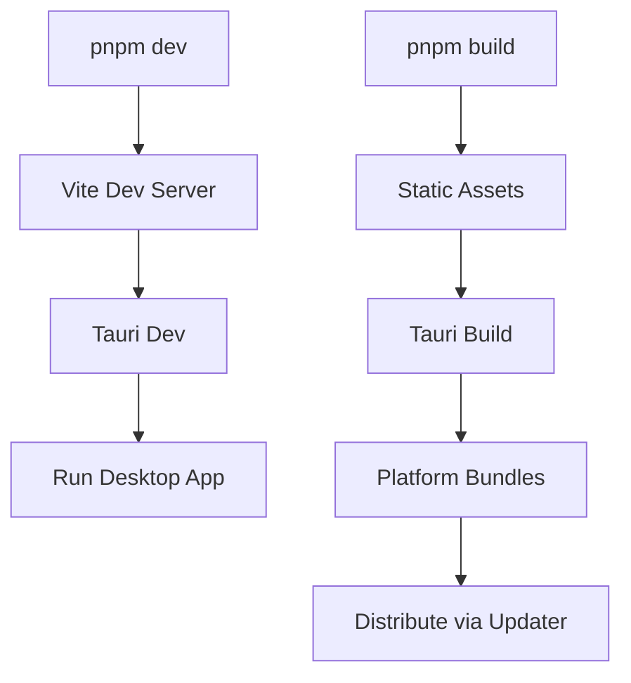

# Architecture Overview

<cite>
**Referenced Files in This Document**
- [README.md](file://README.md)
- [src-tauri/tauri.conf.json](file://src-tauri/tauri.conf.json)
- [src-tauri/Cargo.toml](file://src-tauri/Cargo.toml)
- [src/main.tsx](file://src/main.tsx)
- [src/app.tsx](file://src/app.tsx)
- [package.json](file://package.json)
- [src-tauri/src/main.rs](file://src-tauri/src/main.rs)
- [src-tauri/src/lib.rs](file://src-tauri/src/lib.rs)
- [src-tauri/src/commands/proxy.rs](file://src-tauri/src/commands/proxy.rs)
- [src-tauri/src/commands/history.rs](file://src-tauri/src/commands/history.rs)
- [src-tauri/src/db/repository.rs](file://src-tauri/src/db/repository.rs)
- [src-tauri/src/proxy/mod.rs](file://src-tauri/src/proxy/mod.rs)
- [src/stores/app.ts](file://src/stores/app.ts)
</cite>

## Table of Contents
1. [Introduction](#introduction)
2. [Project Structure](#project-structure)
3. [Core Components](#core-components)
4. [Architecture Overview](#architecture-overview)
5. [Detailed Component Analysis](#detailed-component-analysis)
6. [Dependency Analysis](#dependency-analysis)
7. [Performance Considerations](#performance-considerations)
8. [Security Considerations](#security-considerations)
9. [Scalability Considerations](#scalability-considerations)
10. [Build Pipeline and Deployment Topology](#build-pipeline-and-deployment-topology)
11. [Troubleshooting Guide](#troubleshooting-guide)
12. [Conclusion](#conclusion)

## Introduction
This document describes the hybrid architecture of AppRecon, a desktop application that combines a React-based frontend with a Rust backend powered by Tauri. The system centers around a Man-in-the-Middle (MITM) HTTP/HTTPS proxy, a local SQLite-backed persistence layer, and a modular UI organized into distinct functional pages. The Tauri IPC layer exposes backend services as commands to the frontend, enabling tight integration between UI actions and system capabilities such as proxy control, packet capture, and database operations.

## Project Structure
The repository follows a clear separation of concerns:
- Frontend: React application bootstrapped via Vite, routed with React Router, styled with Tailwind and Radix UI primitives, and state managed with Zustand stores.
- Backend: Tauri application written in Rust, exposing commands for proxy control, history retrieval, packet capture, and more.
- Shared libraries: Tauri plugins for filesystem, dialogs, process, clipboard, and updater enable OS-level integrations.
- Data persistence: SQLite via rusqlite for HTTP logs, WebSocket logs, documents, and packet capture records.

**Diagram sources**
- [src/main.tsx:1-72](file://src/main.tsx#L1-L72)
- [src/app.tsx:1-35](file://src/app.tsx#L1-L35)
- [src/stores/app.ts:1-109](file://src/stores/app.ts#L1-L109)
- [src-tauri/src/main.rs:14-147](file://src-tauri/src/main.rs#L14-L147)
- [src-tauri/src/lib.rs:1-51](file://src-tauri/src/lib.rs#L1-L51)
- [src-tauri/src/commands/proxy.rs:1-74](file://src-tauri/src/commands/proxy.rs#L1-L74)
- [src-tauri/src/commands/history.rs:1-117](file://src-tauri/src/commands/history.rs#L1-L117)
- [src-tauri/src/db/repository.rs:1-800](file://src-tauri/src/db/repository.rs#L1-L800)
- [src-tauri/src/proxy/mod.rs:1-188](file://src-tauri/src/proxy/mod.rs#L1-L188)

**Section sources**
- [src/main.tsx:1-72](file://src/main.tsx#L1-L72)
- [src/app.tsx:1-35](file://src/app.tsx#L1-L35)
- [package.json:1-90](file://package.json#L1-L90)
- [src-tauri/tauri.conf.json:1-48](file://src-tauri/tauri.conf.json#L1-L48)
- [src-tauri/Cargo.toml:1-62](file://src-tauri/Cargo.toml#L1-L62)

## Core Components
- React Frontend
  - Bootstrapped in src/main.tsx with routing via src/app.tsx.
  - Uses Zustand stores for state management, including a proxy store that invokes Tauri commands.
- Tauri Backend
  - Application entrypoint initializes plugins, manages shared state, and registers commands.
  - Commands expose proxy control, history queries, and packet capture operations.
- Proxy Engine
  - Built on Hudsucker with rustls support, supporting HTTP and HTTPS MITM interception.
  - Integrates certificate authority generation and management.
- Database Layer
  - SQLite-backed repository implementing CRUD and paginated queries for HTTP logs, WebSocket logs, documents, and packet captures.
- IPC Layer
  - Tauri’s invoke-based command system connects frontend actions to backend services.

**Section sources**
- [src/main.tsx:1-72](file://src/main.tsx#L1-L72)
- [src/app.tsx:1-35](file://src/app.tsx#L1-L35)
- [src/stores/app.ts:1-109](file://src/stores/app.ts#L1-L109)
- [src-tauri/src/main.rs:14-147](file://src-tauri/src/main.rs#L14-L147)
- [src-tauri/src/commands/proxy.rs:1-74](file://src-tauri/src/commands/proxy.rs#L1-L74)
- [src-tauri/src/db/repository.rs:1-800](file://src-tauri/src/db/repository.rs#L1-L800)
- [src-tauri/src/proxy/mod.rs:1-188](file://src-tauri/src/proxy/mod.rs#L1-L188)

## Architecture Overview
The system architecture is a hybrid desktop application:
- Frontend renders UI pages and triggers actions via Zustand stores.
- Stores call Tauri commands using @tauri-apps/api.
- Backend commands orchestrate proxy lifecycle, database operations, and OS integrations.
- The MITM proxy intercepts HTTP/HTTPS traffic, persists logs, and streams WebSocket events to the database.
- The UI consumes persisted data through history commands and paginated queries.

**Diagram sources**
- [src/stores/app.ts:26-109](file://src/stores/app.ts#L26-L109)
- [src-tauri/src/commands/proxy.rs:15-52](file://src-tauri/src/commands/proxy.rs#L15-L52)
- [src-tauri/src/proxy/mod.rs:93-188](file://src-tauri/src/proxy/mod.rs#L93-L188)
- [src-tauri/src/db/repository.rs:259-293](file://src-tauri/src/db/repository.rs#L259-L293)

## Detailed Component Analysis

### Frontend Pages and Routing
- The application routes to multiple pages: live traffic, intercept, repeater, brute force, tools, AI tools, documents, browser automation, packet capture, and settings.
- A global CA installation dialog is rendered alongside routes to guide certificate setup.

**Diagram sources**
- [src/app.tsx:14-32](file://src/app.tsx#L14-L32)

**Section sources**
- [src/app.tsx:1-35](file://src/app.tsx#L1-L35)

### State Management with Zustand
- The application store encapsulates proxy lifecycle and UI state.
- It invokes Tauri commands to start/stop the proxy and to poll its status.
- The store persists selected state segments to local storage.

**Diagram sources**
- [src/stores/app.ts:26-109](file://src/stores/app.ts#L26-L109)

**Section sources**
- [src/stores/app.ts:1-109](file://src/stores/app.ts#L1-L109)

### Backend Services and Tauri Commands
- The backend registers commands for proxy control, history retrieval, repeater, intruder, packet capture, AI, certificates, storage, browser automation, and SQL injection scanning.
- Commands delegate to internal modules (proxy, history, db, packet_capture, sqli) and use Tauri’s state management to access shared resources.

**Diagram sources**
- [src-tauri/src/main.rs:71-139](file://src-tauri/src/main.rs#L71-L139)
- [src-tauri/src/commands/proxy.rs:15-74](file://src-tauri/src/commands/proxy.rs#L15-L74)
- [src-tauri/src/commands/history.rs:7-117](file://src-tauri/src/commands/history.rs#L7-L117)
- [src-tauri/src/proxy/mod.rs:93-188](file://src-tauri/src/proxy/mod.rs#L93-L188)
- [src-tauri/src/db/repository.rs:259-748](file://src-tauri/src/db/repository.rs#L259-L748)

**Section sources**
- [src-tauri/src/main.rs:14-147](file://src-tauri/src/main.rs#L14-L147)
- [src-tauri/src/lib.rs:1-51](file://src-tauri/src/lib.rs#L1-L51)

### MITM Proxy Engine
- The proxy listens on configurable HTTP and HTTPS ports, generates a CA, and terminates TLS for inspection.
- It integrates lifecycle handlers and graceful shutdown signaling.
- Intercepts requests and responses, emitting structured records to the database.

**Diagram sources**
- [src-tauri/src/proxy/mod.rs:93-188](file://src-tauri/src/proxy/mod.rs#L93-L188)
- [src-tauri/src/commands/proxy.rs:15-74](file://src-tauri/src/commands/proxy.rs#L15-L74)
- [src-tauri/src/db/repository.rs:259-293](file://src-tauri/src/db/repository.rs#L259-L293)

**Section sources**
- [src-tauri/src/proxy/mod.rs:1-188](file://src-tauri/src/proxy/mod.rs#L1-L188)
- [src-tauri/src/commands/proxy.rs:1-74](file://src-tauri/src/commands/proxy.rs#L1-L74)

### Database Persistence
- The repository initializes SQLite tables for HTTP logs, WebSocket logs, documents, and packet captures.
- Provides paginated queries, filtering, and tree-based grouping for efficient UI rendering.
- Uses transactions for batch inserts and maintains counts and timestamps for analytics.

**Diagram sources**
- [src-tauri/src/db/repository.rs:16-800](file://src-tauri/src/db/repository.rs#L16-L800)

**Section sources**
- [src-tauri/src/db/repository.rs:1-800](file://src-tauri/src/db/repository.rs#L1-L800)

### Data Flow: From Traffic to Visualization
- Network traffic enters the MITM proxy, which parses and normalizes messages.
- The proxy persists structured records to SQLite via the repository.
- Frontend pages query paginated data and render interactive views (tables, trees, inspectors).
- WebSocket connections and messages are stored separately and retrieved for detailed inspection.

**Diagram sources**
- [src-tauri/src/proxy/mod.rs:93-188](file://src-tauri/src/proxy/mod.rs#L93-L188)
- [src-tauri/src/db/repository.rs:259-570](file://src-tauri/src/db/repository.rs#L259-L570)
- [src-tauri/src/commands/history.rs:56-65](file://src-tauri/src/commands/history.rs#L56-L65)

**Section sources**
- [src-tauri/src/db/repository.rs:259-748](file://src-tauri/src/db/repository.rs#L259-L748)
- [src-tauri/src/commands/history.rs:1-117](file://src-tauri/src/commands/history.rs#L1-L117)

## Dependency Analysis
- Frontend depends on @tauri-apps/api for IPC and Zustand for state.
- Backend depends on Tauri v2, Tauri plugins, hyper/hudsucker for proxying, rusqlite for persistence, and various utilities for networking and cryptography.
- Commands depend on internal modules for proxy, history, packet capture, and database operations.

**Diagram sources**
- [package.json:49-79](file://package.json#L49-L79)
- [src-tauri/Cargo.toml:11-54](file://src-tauri/Cargo.toml#L11-L54)
- [src-tauri/src/main.rs:71-139](file://src-tauri/src/main.rs#L71-L139)

**Section sources**
- [package.json:1-90](file://package.json#L1-L90)
- [src-tauri/Cargo.toml:1-62](file://src-tauri/Cargo.toml#L1-L62)

## Performance Considerations
- Proxy throughput: The proxy leverages Tokio runtime and rustls for concurrency and TLS termination. Ensure adequate CPU and memory allocation for high-volume traffic.
- Database writes: Batch operations and transactions (e.g., packet capture inserts) reduce overhead. Consider WAL mode and appropriate indexing for large datasets.
- Pagination: Use paginated queries to limit memory usage in UI tables and trees.
- IPC latency: Minimize round trips by coalescing related operations and debouncing frequent UI updates.

## Security Considerations
- Certificate Authority: The application generates and manages a CA for HTTPS interception. Ensure secure storage and controlled distribution of the CA certificate.
- Permissions: Packet capture and low-level network operations require elevated permissions on some platforms. The build scripts and plugins reflect platform-specific needs.
- CSP and Sandboxing: The Tauri configuration disables CSP for flexibility; ensure that the application enforces safe defaults and least privilege access to system resources.

**Section sources**
- [src-tauri/src/proxy/mod.rs:93-188](file://src-tauri/src/proxy/mod.rs#L93-L188)
- [src-tauri/tauri.conf.json:23-25](file://src-tauri/tauri.conf.json#L23-L25)

## Scalability Considerations
- Horizontal scaling: As a desktop application, scaling is primarily constrained by local resources. Offload heavy analytics to background workers or external services if needed.
- Data growth: Use paginated queries and efficient filters to manage large histories. Consider partitioning or archiving older entries.
- Concurrency: The Tokio runtime supports concurrent proxy handling; tune worker threads and connection limits based on workload.

## Build Pipeline and Deployment Topology
- Development
  - Frontend: Vite dev server runs on a fixed port during development.
  - Backend: Tauri CLI builds and bundles the desktop application.
- Build and Packaging
  - Frontend build outputs static assets served by the backend.
  - Tauri configuration defines bundling targets and updater endpoints.
- Distribution
  - Updater plugin enables automatic updates from a remote endpoint.
  - Platform-specific icons and bundle metadata are configured centrally.

**Diagram sources**
- [package.json:6-12](file://package.json#L6-L12)
- [src-tauri/tauri.conf.json:6-11](file://src-tauri/tauri.conf.json#L6-L11)
- [src-tauri/tauri.conf.json:39-46](file://src-tauri/tauri.conf.json#L39-L46)

**Section sources**
- [package.json:1-90](file://package.json#L1-L90)
- [src-tauri/tauri.conf.json:1-48](file://src-tauri/tauri.conf.json#L1-L48)

## Troubleshooting Guide
- Proxy fails to start
  - Verify port availability and reuse settings.
  - Check CA initialization and certificate paths.
- Status polling inconsistencies
  - Ensure the frontend waits briefly after invoking commands before polling status.
- Database errors
  - Confirm table initialization and transaction boundaries.
  - Validate JSON serialization/deserialization for headers and bodies.
- Updater issues
  - Confirm endpoint reachability and public key configuration.

**Section sources**
- [src-tauri/src/commands/proxy.rs:15-74](file://src-tauri/src/commands/proxy.rs#L15-L74)
- [src-tauri/src/db/repository.rs:49-58](file://src-tauri/src/db/repository.rs#L49-L58)
- [src-tauri/tauri.conf.json:40-46](file://src-tauri/tauri.conf.json#L40-L46)

## Conclusion
AppRecon’s hybrid architecture leverages Tauri to seamlessly integrate a modern React frontend with a high-performance Rust backend. The MITM proxy, robust database layer, and IPC-driven command system provide a cohesive foundation for traffic inspection, logging, and visualization. By adhering to the outlined patterns and considerations—particularly around performance, security, and scalability—the system can evolve to meet growing demands while maintaining a responsive and reliable user experience.