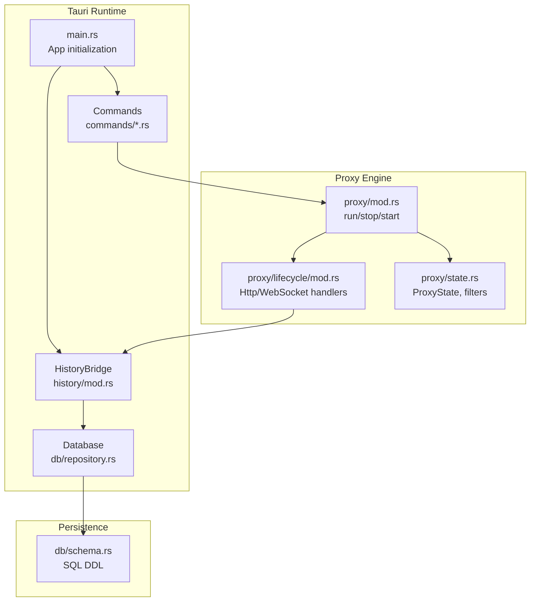
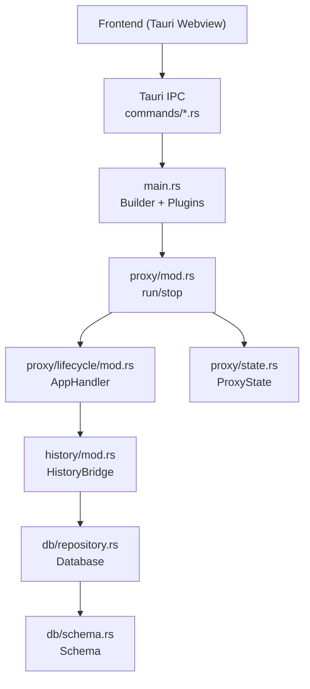
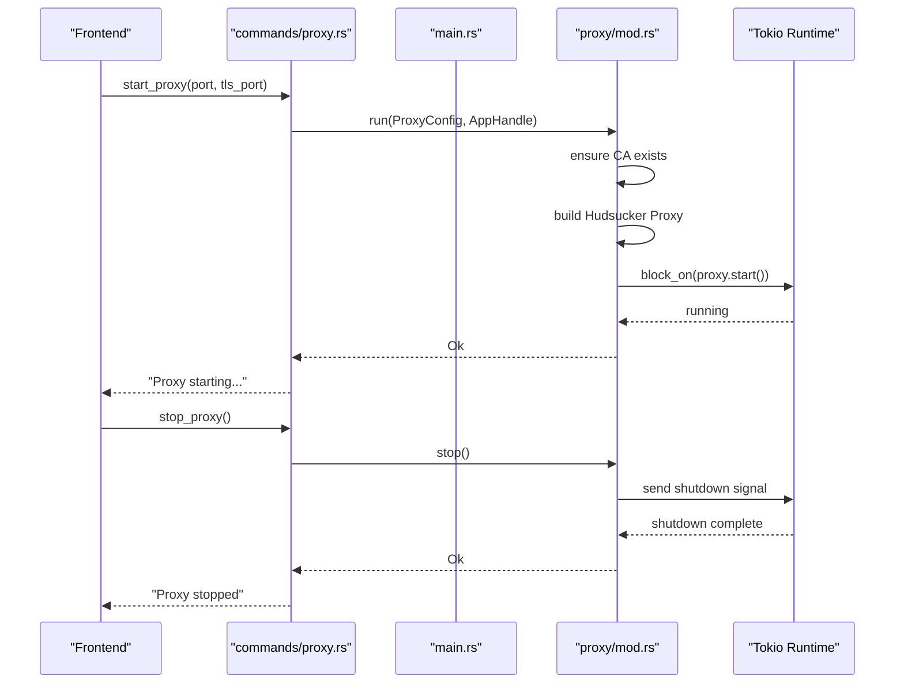
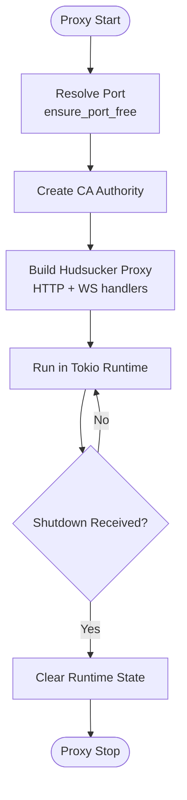
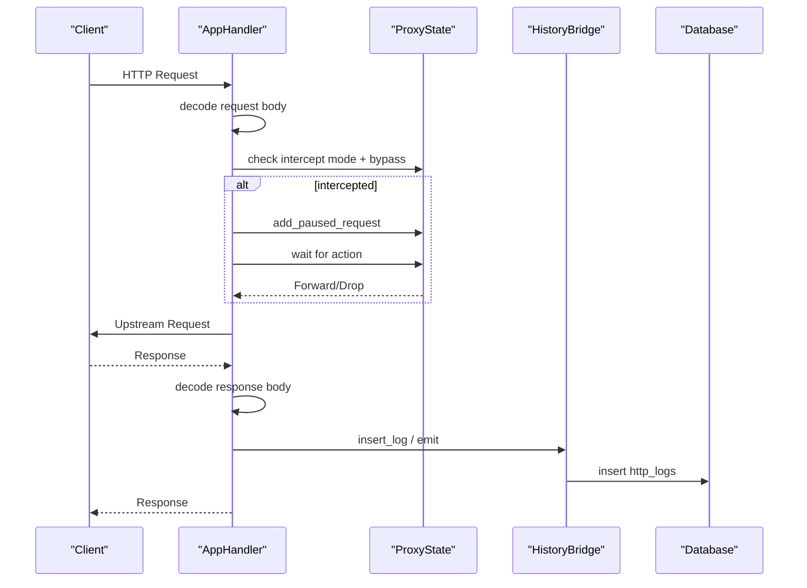
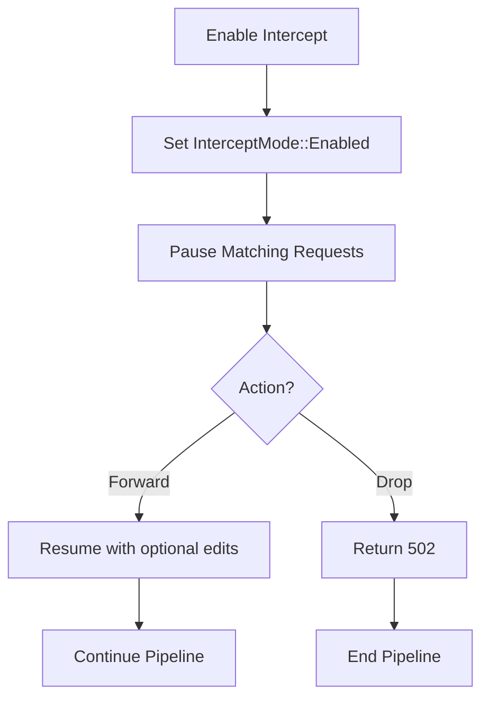
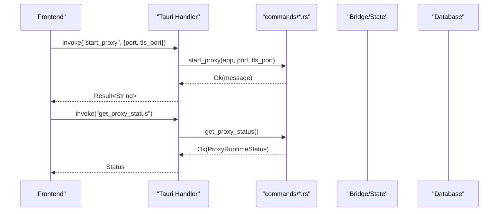
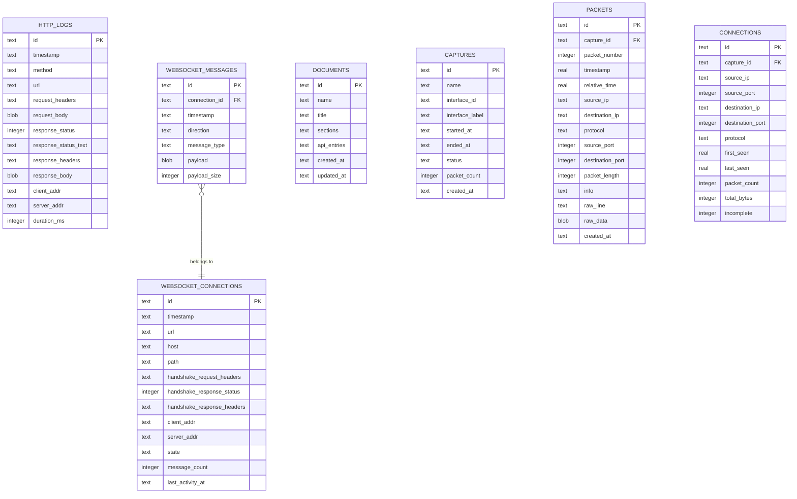

# Backend Architecture

<cite>
**Referenced Files in This Document**
- [Cargo.toml](file://src-tauri/Cargo.toml)
- [main.rs](file://src-tauri/src/main.rs)
- [lib.rs](file://src-tauri/src/lib.rs)
- [proxy/mod.rs](file://src-tauri/src/proxy/mod.rs)
- [proxy/lifecycle/mod.rs](file://src-tauri/src/proxy/lifecycle/mod.rs)
- [proxy/state.rs](file://src-tauri/src/proxy/state.rs)
- [commands/proxy.rs](file://src-tauri/src/commands/proxy.rs)
- [commands/intercept.rs](file://src-tauri/src/commands/intercept.rs)
- [history/mod.rs](file://src-tauri/src/history/mod.rs)
- [db/repository.rs](file://src-tauri/src/db/repository.rs)
- [db/schema.rs](file://src-tauri/src/db/schema.rs)
- [commands/history.rs](file://src-tauri/src/commands/history.rs)
- [packet_capture/mod.rs](file://src-tauri/src/packet_capture/mod.rs)
</cite>

## Table of Contents
1. [Introduction](#introduction)
2. [Project Structure](#project-structure)
3. [Core Components](#core-components)
4. [Architecture Overview](#architecture-overview)
5. [Detailed Component Analysis](#detailed-component-analysis)
6. [Dependency Analysis](#dependency-analysis)
7. [Performance Considerations](#performance-considerations)
8. [Troubleshooting Guide](#troubleshooting-guide)
9. [Conclusion](#conclusion)
10. [Appendices](#appendices)

## Introduction
This document describes the Rust backend architecture of AppRecon, focusing on the proxy engine, command system, and service architecture. It explains how the MITM proxy integrates with the database layer and external integrations, details the Tauri command handler system and IPC communication patterns, and outlines error handling, lifecycle management, traffic processing pipeline, and resource management. Practical examples demonstrate backend service implementation, command registration, and async programming patterns. Guidance is included for performance, memory management, concurrency, system services, file system access, external tool integration, development practices, testing, and deployment.

## Project Structure
The backend is implemented in the Tauri application under src-tauri. The module layout groups functionality by domain:
- Proxy engine: proxy/mod.rs orchestrates the Hudsucker-based MITM proxy, lifecycle handlers, state management, and WebSocket support.
- Commands: commands/* expose Tauri commands for frontend-to-backend IPC.
- History and persistence: history/mod.rs and db/repository.rs manage HTTP and WebSocket logs, documents, and packet capture data via SQLite.
- Packet capture: packet_capture/mod.rs exposes types and parser utilities.
- Entry point: main.rs initializes plugins, manages state, registers commands, and starts the Tauri runtime.

**Diagram sources**
- [main.rs:14-146](file://src-tauri/src/main.rs#L14-L146)
- [proxy/mod.rs:93-187](file://src-tauri/src/proxy/mod.rs#L93-L187)
- [proxy/lifecycle/mod.rs:88-360](file://src-tauri/src/proxy/lifecycle/mod.rs#L88-L360)
- [proxy/state.rs:191-441](file://src-tauri/src/proxy/state.rs#L191-L441)
- [history/mod.rs:61-294](file://src-tauri/src/history/mod.rs#L61-L294)
- [db/repository.rs:37-58](file://src-tauri/src/db/repository.rs#L37-L58)
- [db/schema.rs:1-176](file://src-tauri/src/db/schema.rs#L1-L176)

**Section sources**
- [main.rs:14-146](file://src-tauri/src/main.rs#L14-L146)
- [lib.rs:1-51](file://src-tauri/src/lib.rs#L1-L51)

## Core Components
- Proxy engine
  - Orchestrated by proxy/mod.rs, which builds and runs a Hudsucker proxy with TLS interception, graceful shutdown signaling, and port management.
  - Lifecycle handlers in proxy/lifecycle/mod.rs implement HTTP and WebSocket processing, body decoding, intercept logic, and event emission.
  - State management in proxy/state.rs maintains intercept mode, paused requests, and filtering logic.
- Command system
  - Tauri commands in commands/proxy.rs and commands/intercept.rs expose proxy control, intercept management, and browser integration.
  - Commands/history.rs provide history and WebSocket query APIs backed by HistoryBridge.
- Persistence and history
  - HistoryBridge in history/mod.rs wraps Database operations and normalizes filters and summaries.
  - Database in db/repository.rs initializes SQLite tables, inserts logs and WebSocket events, and supports paginated queries.
  - SQL schema is defined in db/schema.rs with indexes optimized for common queries.
- Packet capture
  - Types and parser utilities are exposed via packet_capture/mod.rs for network capture integration.

**Section sources**
- [proxy/mod.rs:26-91](file://src-tauri/src/proxy/mod.rs#L26-L91)
- [proxy/lifecycle/mod.rs:88-360](file://src-tauri/src/proxy/lifecycle/mod.rs#L88-L360)
- [proxy/state.rs:176-441](file://src-tauri/src/proxy/state.rs#L176-L441)
- [commands/proxy.rs:15-74](file://src-tauri/src/commands/proxy.rs#L15-L74)
- [commands/intercept.rs:20-434](file://src-tauri/src/commands/intercept.rs#L20-L434)
- [history/mod.rs:61-294](file://src-tauri/src/history/mod.rs#L61-L294)
- [db/repository.rs:37-58](file://src-tauri/src/db/repository.rs#L37-L58)
- [db/schema.rs:1-176](file://src-tauri/src/db/schema.rs#L1-L176)
- [packet_capture/mod.rs:1-6](file://src-tauri/src/packet_capture/mod.rs#L1-L6)

## Architecture Overview
The backend follows a layered architecture:
- Entry point initializes plugins, manages shared state, and registers IPC commands.
- Proxy engine handles HTTP and WebSocket traffic with MITM capabilities, emitting events and persisting logs.
- HistoryBridge coordinates database operations for HTTP logs, WebSocket sessions/messages, documents, and packet capture artifacts.
- External integrations include certificate management, browser automation, OS-specific tools, and optional AI services.

**Diagram sources**
- [main.rs:23-146](file://src-tauri/src/main.rs#L23-L146)
- [proxy/mod.rs:93-187](file://src-tauri/src/proxy/mod.rs#L93-L187)
- [proxy/lifecycle/mod.rs:78-360](file://src-tauri/src/proxy/lifecycle/mod.rs#L78-L360)
- [proxy/state.rs:191-441](file://src-tauri/src/proxy/state.rs#L191-L441)
- [history/mod.rs:61-294](file://src-tauri/src/history/mod.rs#L61-L294)
- [db/repository.rs:37-58](file://src-tauri/src/db/repository.rs#L37-L58)
- [db/schema.rs:1-176](file://src-tauri/src/db/schema.rs#L1-L176)

## Detailed Component Analysis

### Proxy Engine
The proxy engine is centered around proxy/mod.rs, which:
- Resolves ports, ensures availability, and creates a Hudsucker proxy with TLS CA and graceful shutdown.
- Spawns a blocking Tokio runtime to run the proxy server.
- Exposes run, stop, and status helpers for lifecycle control.

**Diagram sources**
- [commands/proxy.rs:15-74](file://src-tauri/src/commands/proxy.rs#L15-L74)
- [proxy/mod.rs:93-187](file://src-tauri/src/proxy/mod.rs#L93-L187)

Proxy lifecycle and state:
- Active and default ports are tracked globally.
- Graceful shutdown uses a oneshot channel to signal the proxy to stop.
- ProxyState holds intercept mode, paused requests, and bypass patterns.

**Diagram sources**
- [proxy/mod.rs:51-81](file://src-tauri/src/proxy/mod.rs#L51-L81)
- [proxy/mod.rs:144-186](file://src-tauri/src/proxy/mod.rs#L144-L186)

Traffic processing pipeline:
- AppHandler in proxy/lifecycle/mod.rs:
  - Extracts request metadata, decodes bodies, and optionally pauses requests for intercept.
  - Emits WebSocket connection and message events and persists them via HistoryBridge.
  - Saves HTTP transactions and emits events after response handling.

**Diagram sources**
- [proxy/lifecycle/mod.rs:88-360](file://src-tauri/src/proxy/lifecycle/mod.rs#L88-L360)
- [proxy/state.rs:240-295](file://src-tauri/src/proxy/state.rs#L240-L295)
- [history/mod.rs:72-74](file://src-tauri/src/history/mod.rs#L72-L74)
- [db/repository.rs:259-293](file://src-tauri/src/db/repository.rs#L259-L293)

Intercept and browser integration:
- commands/intercept.rs manages intercept mode, paused requests, and browser launch with proxy configuration.
- It writes CA certificates to profiles and uses OS-specific tools to import trust stores.

**Diagram sources**
- [commands/intercept.rs:28-109](file://src-tauri/src/commands/intercept.rs#L28-L109)
- [proxy/state.rs:186-295](file://src-tauri/src/proxy/state.rs#L186-L295)

**Section sources**
- [proxy/mod.rs:26-91](file://src-tauri/src/proxy/mod.rs#L26-L91)
- [proxy/mod.rs:93-187](file://src-tauri/src/proxy/mod.rs#L93-L187)
- [proxy/lifecycle/mod.rs:88-360](file://src-tauri/src/proxy/lifecycle/mod.rs#L88-L360)
- [proxy/state.rs:176-441](file://src-tauri/src/proxy/state.rs#L176-L441)
- [commands/intercept.rs:20-434](file://src-tauri/src/commands/intercept.rs#L20-L434)

### Command System and IPC
The Tauri command handler in main.rs registers commands for:
- Proxy control: start_proxy, stop_proxy, get_proxy_status.
- Intercept: get_intercept_status, set_intercept_enabled, get_paused_requests, forward_intercepted_request, drop_intercepted_request, and browser integration.
- History: clear_proxy_all, get_proxy_all, get_proxy_filtered, get_proxy_paginated, get_proxy_detail, get_proxy_tree, WebSocket queries, and document CRUD.
- Packet capture: list_capture_interfaces, configure_capture_network, prepare_packet_capture_permissions, start_packet_capture, stop_packet_capture, get_packet_capture_status, get_packets_paginated.
- AI and browser automation: AI settings and lifecycle, and browser automation commands.
- Storage and certificate utilities.

**Diagram sources**
- [main.rs:71-139](file://src-tauri/src/main.rs#L71-L139)
- [commands/proxy.rs:15-74](file://src-tauri/src/commands/proxy.rs#L15-L74)

Practical examples:
- Registering a new command: add a #[tauri::command] function in commands/mod.rs and include it in the generate_handler! invocation in main.rs.
- Async programming patterns: commands use async functions and spawn blocking tasks for long-running operations (e.g., proxy start) while keeping the UI responsive.
- Error handling: commands return Result types; errors are propagated to the frontend as strings.

**Section sources**
- [main.rs:71-139](file://src-tauri/src/main.rs#L71-L139)
- [commands/proxy.rs:15-74](file://src-tauri/src/commands/proxy.rs#L15-L74)
- [commands/intercept.rs:20-434](file://src-tauri/src/commands/intercept.rs#L20-L434)
- [commands/history.rs:1-117](file://src-tauri/src/commands/history.rs#L1-L117)

### Database Layer and Persistence
The database layer consists of:
- Database::new and init in db/repository.rs initialize SQLite with WAL mode and foreign keys, then apply schema from db/schema.rs.
- Insertion and retrieval methods for HTTP logs, WebSocket connections/messages, documents, and packet capture artifacts.
- Paginated queries with filtering and normalization in HistoryBridge.

**Diagram sources**
- [db/schema.rs:1-176](file://src-tauri/src/db/schema.rs#L1-L176)
- [db/repository.rs:37-58](file://src-tauri/src/db/repository.rs#L37-L58)

**Section sources**
- [db/repository.rs:37-58](file://src-tauri/src/db/repository.rs#L37-L58)
- [db/schema.rs:1-176](file://src-tauri/src/db/schema.rs#L1-L176)
- [history/mod.rs:61-294](file://src-tauri/src/history/mod.rs#L61-L294)

### External Integrations
- Certificate management: CA creation and PEM export are handled in the proxy HTTPS module and used by intercept commands to configure browsers.
- Browser automation: commands expose browser control APIs and launch browsers with proxy settings.
- OS tools: commands integrate with NSS certutil and macOS security tool to import and trust the CA.
- AI services: optional AI process lifecycle is integrated via main.rs and exported APIs.

**Section sources**
- [commands/intercept.rs:284-434](file://src-tauri/src/commands/intercept.rs#L284-L434)
- [main.rs:54-56](file://src-tauri/src/main.rs#L54-L56)

## Dependency Analysis
The backend relies on Tauri for IPC and platform integration, Hudsucker for the proxy, Tokio for async runtime, rusqlite for persistence, and various crates for cryptography, HTTP parsing, and networking.

```mermaid
graph TB
Tauri["tauri (IPC, plugins)"]
Hudsucker["hudsucker (proxy)"]
Tokio["tokio (async runtime)"]
Rusqlite["rusqlite (SQLite)"]
Hyper["hyper / hyper-util"]
Tower["tower"]
Serde["serde/json"]
UUID["uuid"]
Crypto["aws-lc-rs provider"]
Cert["rcgen"]
main_rs["main.rs"] --> Tauri
proxy_mod["proxy/mod.rs"] --> Hudsucker
proxy_mod --> Tokio
proxy_lifecycle["proxy/lifecycle/mod.rs"] --> Hyper
proxy_lifecycle --> Tower
history_mod["history/mod.rs"] --> Rusqlite
db_repo["db/repository.rs"] --> Rusqlite
db_repo --> Serde
proxy_mod --> Crypto
proxy_mod --> Cert
commands_proxy["commands/proxy.rs"] --> Tauri
commands_intercept["commands/intercept.rs"] --> Tauri
commands_history["commands/history.rs"] --> Tauri
```

**Diagram sources**
- [Cargo.toml:11-62](file://src-tauri/Cargo.toml#L11-L62)
- [main.rs:23-146](file://src-tauri/src/main.rs#L23-L146)
- [proxy/mod.rs:15-156](file://src-tauri/src/proxy/mod.rs#L15-L156)
- [proxy/lifecycle/mod.rs:8-11](file://src-tauri/src/proxy/lifecycle/mod.rs#L8-L11)
- [history/mod.rs:1-12](file://src-tauri/src/history/mod.rs#L1-L12)
- [db/repository.rs:9-14](file://src-tauri/src/db/repository.rs#L9-L14)
- [commands/proxy.rs:1-6](file://src-tauri/src/commands/proxy.rs#L1-L6)
- [commands/intercept.rs:1-8](file://src-tauri/src/commands/intercept.rs#L1-L8)
- [commands/history.rs:1-6](file://src-tauri/src/commands/history.rs#L1-L6)

**Section sources**
- [Cargo.toml:11-62](file://src-tauri/Cargo.toml#L11-L62)

## Performance Considerations
- Concurrency and async
  - Use Tokio runtime for proxy operations; avoid heavy CPU work on the main thread.
  - Offload blocking filesystem operations (e.g., writing logs) to blocking tasks or threads.
- Memory management
  - Decode and normalize bodies only when needed; avoid unnecessary copies.
  - Use streaming bodies where possible to reduce memory pressure.
- Database throughput
  - WAL mode and appropriate indexes improve read/write performance.
  - Batch operations (e.g., transaction for packet inserts) reduce overhead.
- Proxy efficiency
  - Minimize allocations during request/response handling; reuse buffers where safe.
  - Avoid expensive regex operations in hot paths; precompile patterns if reused frequently.
- Event emission
  - Emit events sparingly; batch WebSocket messages if feasible.

[No sources needed since this section provides general guidance]

## Troubleshooting Guide
Common areas to inspect:
- Proxy startup failures: port conflicts, CA creation errors, or Tokio runtime initialization issues.
- Interception issues: paused requests not cleared, bypass patterns not matching, or browser proxy configuration problems.
- Database errors: schema initialization failures, constraint violations, or query errors.
- IPC command errors: missing state, invalid arguments, or serialization issues.

Actions:
- Verify port availability and reuse policy before starting the proxy.
- Check CA certificate generation and PEM export paths.
- Inspect emitted events and persisted records to confirm pipeline correctness.
- Review logs written to temporary files for diagnostics.

**Section sources**
- [proxy/mod.rs:51-81](file://src-tauri/src/proxy/mod.rs#L51-L81)
- [proxy/mod.rs:135-142](file://src-tauri/src/proxy/mod.rs#L135-L142)
- [proxy/lifecycle/mod.rs:144-153](file://src-tauri/src/proxy/lifecycle/mod.rs#L144-L153)
- [commands/intercept.rs:284-434](file://src-tauri/src/commands/intercept.rs#L284-L434)
- [db/repository.rs:49-58](file://src-tauri/src/db/repository.rs#L49-L58)

## Conclusion
AppRecon’s backend leverages Tauri for IPC and platform integration, Hudsucker for a robust MITM proxy, and a SQLite-backed persistence layer for logs and artifacts. The command system cleanly exposes proxy control, intercept management, and history queries. The architecture balances performance with safety through careful async patterns, resource management, and structured error handling. Extending the backend involves adding commands, integrating external tools, and maintaining efficient database operations.

[No sources needed since this section summarizes without analyzing specific files]

## Appendices

### Practical Examples

- Backend service implementation
  - Define a new command in commands/mod.rs and register it in main.rs generate_handler!.
  - Use State to access shared services (e.g., HistoryBridge) and Mutex for internal state.
  - Example path: [commands/history.rs:1-117](file://src-tauri/src/commands/history.rs#L1-L117)

- Command registration
  - Add the function to the generate_handler! list in main.rs.
  - Example path: [main.rs:71-139](file://src-tauri/src/main.rs#L71-L139)

- Async programming patterns
  - Use async functions for commands; spawn blocking tasks for long-running operations.
  - Example path: [commands/proxy.rs:30-47](file://src-tauri/src/commands/proxy.rs#L30-L47)

- Proxy lifecycle management
  - Start/stop proxy with controlled port resolution and graceful shutdown.
  - Example path: [proxy/mod.rs:93-187](file://src-tauri/src/proxy/mod.rs#L93-L187)

- Traffic processing pipeline
  - Implement HTTP and WebSocket handlers with body decoding and event emission.
  - Example path: [proxy/lifecycle/mod.rs:88-360](file://src-tauri/src/proxy/lifecycle/mod.rs#L88-L360)

- Resource management
  - Initialize database, create indexes, and manage transactions.
  - Example path: [db/repository.rs:49-58](file://src-tauri/src/db/repository.rs#L49-L58)

- External tool integration
  - Import CA into browser profiles and OS keychains.
  - Example path: [commands/intercept.rs:284-434](file://src-tauri/src/commands/intercept.rs#L284-L434)

### Guidelines for Development, Testing, and Deployment
- Development
  - Use dev-dependencies for testing utilities; write unit tests for state transitions and filters.
  - Keep command handlers thin; delegate to services and bridges.
- Testing
  - Mock Tauri state and emit events for unit tests.
  - Validate database queries and paginated results.
- Deployment
  - Bundle CA and certificates appropriately for distribution.
  - Ensure updater plugin is configured for desktop platforms.
  - Package plugins and ensure permissions for packet capture and system services.

**Section sources**
- [Cargo.toml:56-59](file://src-tauri/Cargo.toml#L56-L59)
- [main.rs:23-69](file://src-tauri/src/main.rs#L23-L69)