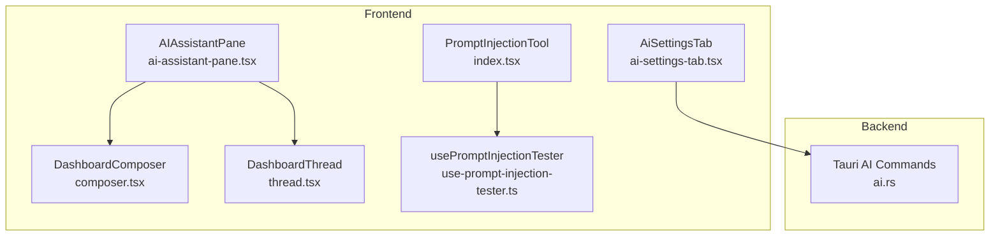
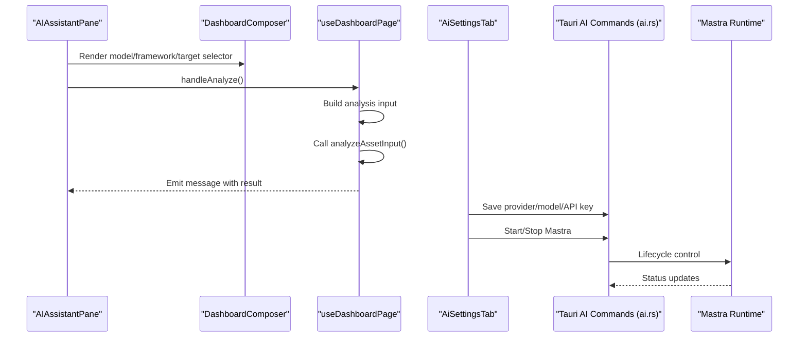
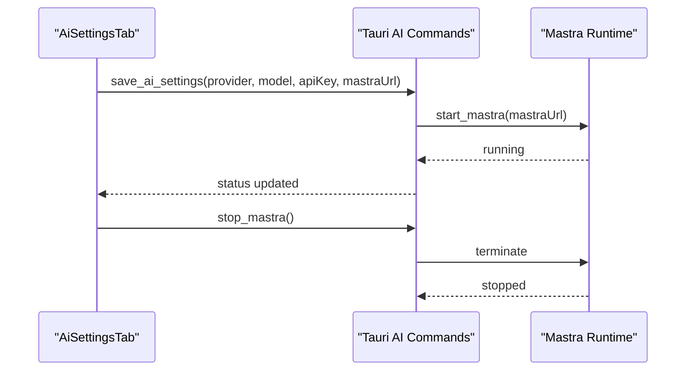
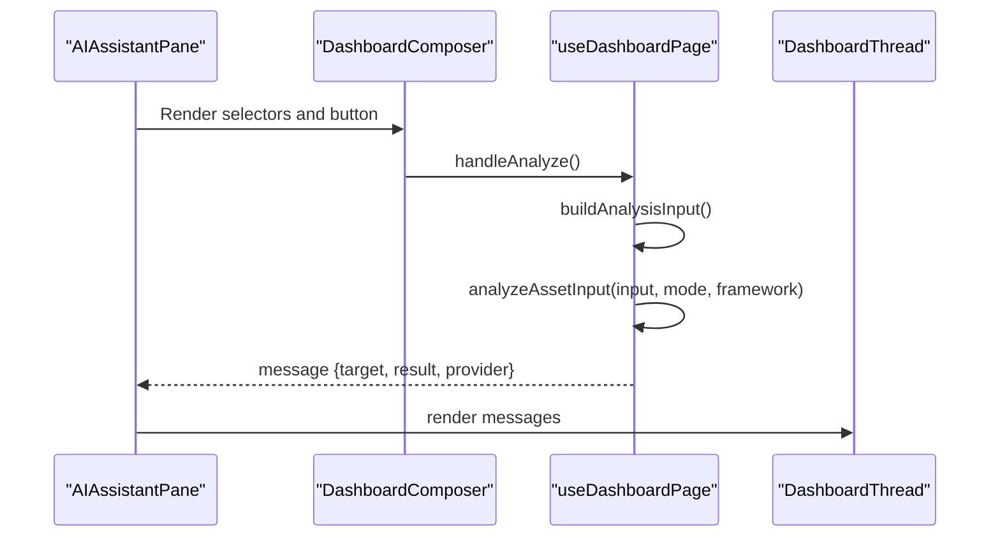
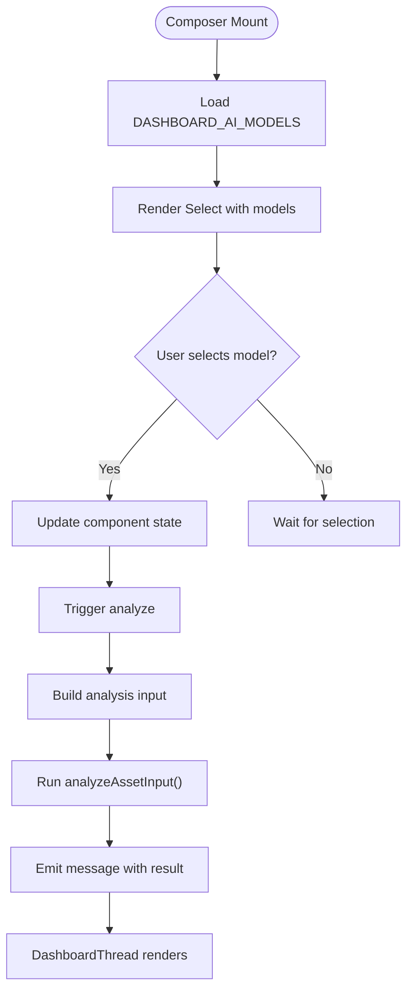
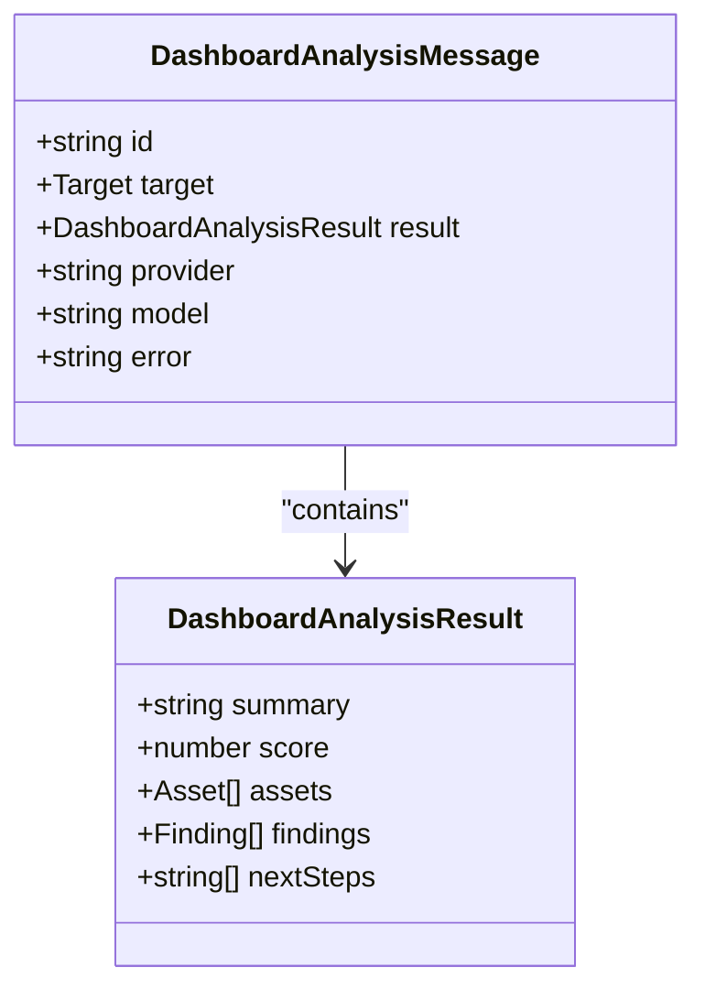
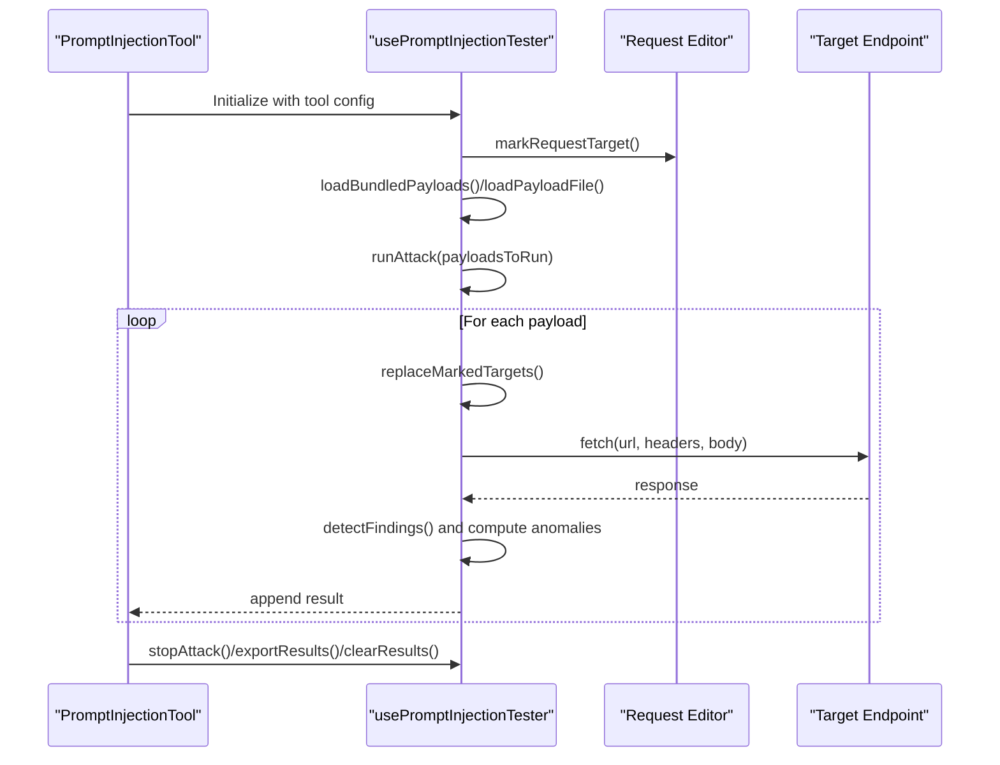
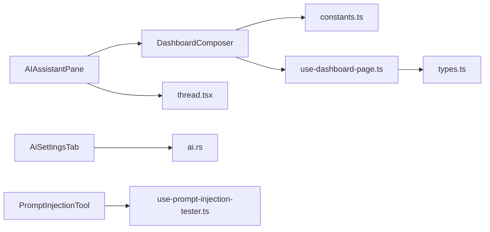

# AI Commands

<cite>
**Referenced Files in This Document**
- [ai.rs](file://src-tauri/src/commands/ai.rs)
- [ai-assistant-pane.tsx](file://src/components/layout/ai-assistant-pane.tsx)
- [composer.tsx](file://src/pages/ai-chat/components/composer.tsx)
- [thread.tsx](file://src/pages/ai-chat/components/thread.tsx)
- [use-dashboard-page.ts](file://src/pages/ai-chat/hooks/use-dashboard-page.ts)
- [constants.ts](file://src/pages/ai-chat/constants.ts)
- [types.ts](file://src/pages/ai-chat/types.ts)
- [index.tsx](file://src/pages/ai-tools/components/prompt-injection/index.tsx)
- [use-prompt-injection-tester.ts](file://src/pages/ai-tools/components/prompt-injection/components/use-prompt-injection-tester.ts)
- [ai-settings-tab.tsx](file://src/pages/settings/components/ai-settings-tab.tsx)
</cite>

## Table of Contents
1. [Introduction](#introduction)
2. [Project Structure](#project-structure)
3. [Core Components](#core-components)
4. [Architecture Overview](#architecture-overview)
5. [Detailed Component Analysis](#detailed-component-analysis)
6. [Dependency Analysis](#dependency-analysis)
7. [Performance Considerations](#performance-considerations)
8. [Troubleshooting Guide](#troubleshooting-guide)
9. [Conclusion](#conclusion)
10. [Appendices](#appendices)

## Introduction
This document explains AppRecon’s AI integration command handlers and related UI components. It covers:
- AI assistant commands exposed via Tauri commands for provider configuration and lifecycle management
- MCP server integration and Mastra runtime controls
- Model selection and conversation/session handling in the UI
- AI response processing, context management, and session handling
- AI tool integration for prompt injection testing and security assessments
- Security considerations, data privacy, and performance optimization for AI operations
- Examples and troubleshooting guidance

## Project Structure
AppRecon’s AI features span frontend UI components and backend Tauri command handlers. The frontend provides:
- An AI assistant pane with a composer and message thread
- A settings page for AI provider configuration and Mastra runtime controls
- A dedicated AI tools area for prompt injection testing

The backend exposes Tauri commands for AI settings and Mastra lifecycle management.

**Diagram sources**
- [ai-assistant-pane.tsx:1-48](file://src/components/layout/ai-assistant-pane.tsx#L1-L48)
- [composer.tsx:1-103](file://src/pages/ai-chat/components/composer.tsx#L1-L103)
- [thread.tsx:1-161](file://src/pages/ai-chat/components/thread.tsx#L1-L161)
- [ai-settings-tab.tsx:1-185](file://src/pages/settings/components/ai-settings-tab.tsx#L1-L185)
- [index.tsx:1-78](file://src/pages/ai-tools/components/prompt-injection/index.tsx#L1-L78)
- [use-prompt-injection-tester.ts:1-407](file://src/pages/ai-tools/components/prompt-injection/components/use-prompt-injection-tester.ts#L1-L407)
- [ai.rs:1-11](file://src-tauri/src/commands/ai.rs#L1-L11)

**Section sources**
- [ai-assistant-pane.tsx:1-48](file://src/components/layout/ai-assistant-pane.tsx#L1-L48)
- [ai-settings-tab.tsx:1-185](file://src/pages/settings/components/ai-settings-tab.tsx#L1-L185)
- [ai.rs:1-11](file://src-tauri/src/commands/ai.rs#L1-L11)

## Core Components
- AI Assistant Pane: Hosts the composer and thread UI for interactive AI analysis.
- Dashboard Composer: Provides model/framework/target selection and triggers analysis.
- Dashboard Thread: Renders AI-generated results, risks, assets, findings, and next steps.
- AI Settings Tab: Manages provider, model, API key, and Mastra runtime controls.
- Prompt Injection Tool: Runs targeted prompt injection attacks against configured endpoints.
- Tauri AI Commands: Expose provider configuration and Mastra lifecycle operations.

**Section sources**
- [ai-assistant-pane.tsx:1-48](file://src/components/layout/ai-assistant-pane.tsx#L1-L48)
- [composer.tsx:18-103](file://src/pages/ai-chat/components/composer.tsx#L18-L103)
- [thread.tsx:13-161](file://src/pages/ai-chat/components/thread.tsx#L13-L161)
- [ai-settings-tab.tsx:25-185](file://src/pages/settings/components/ai-settings-tab.tsx#L25-L185)
- [index.tsx:13-78](file://src/pages/ai-tools/components/prompt-injection/index.tsx#L13-L78)
- [ai.rs:1-11](file://src-tauri/src/commands/ai.rs#L1-L11)

## Architecture Overview
The AI workflow integrates frontend UI with backend Tauri commands and optional local Mastra runtime.

**Diagram sources**
- [ai-assistant-pane.tsx:5-47](file://src/components/layout/ai-assistant-pane.tsx#L5-L47)
- [composer.tsx:33-103](file://src/pages/ai-chat/components/composer.tsx#L33-L103)
- [use-dashboard-page.ts:47-70](file://src/pages/ai-chat/hooks/use-dashboard-page.ts#L47-L70)
- [ai-settings-tab.tsx:25-185](file://src/pages/settings/components/ai-settings-tab.tsx#L25-L185)
- [ai.rs:1-11](file://src-tauri/src/commands/ai.rs#L1-L11)

## Detailed Component Analysis

### AI Assistant Commands and MCP/Provider Configuration
- Provider configuration management is exposed via Tauri commands for saving settings, retrieving status, and controlling Mastra runtime.
- The settings UI allows selecting provider, model, and API key, and toggling auto-start of the Mastra runtime.

**Diagram sources**
- [ai-settings-tab.tsx:25-185](file://src/pages/settings/components/ai-settings-tab.tsx#L25-L185)
- [ai.rs:4-11](file://src-tauri/src/commands/ai.rs#L4-L11)

**Section sources**
- [ai-settings-tab.tsx:25-185](file://src/pages/settings/components/ai-settings-tab.tsx#L25-L185)
- [ai.rs:1-11](file://src-tauri/src/commands/ai.rs#L1-L11)

### Conversation Management and Session Handling
- The assistant pane composes a message thread and a composer. The composer collects target, framework, model, and prompt, then triggers analysis.
- The dashboard hook builds the analysis input from selected target and prompt, runs a local analysis function, and emits a message with results.

**Diagram sources**
- [ai-assistant-pane.tsx:5-47](file://src/components/layout/ai-assistant-pane.tsx#L5-L47)
- [composer.tsx:33-103](file://src/pages/ai-chat/components/composer.tsx#L33-L103)
- [use-dashboard-page.ts:47-70](file://src/pages/ai-chat/hooks/use-dashboard-page.ts#L47-L70)
- [thread.tsx:20-156](file://src/pages/ai-chat/components/thread.tsx#L20-L156)

**Section sources**
- [use-dashboard-page.ts:11-70](file://src/pages/ai-chat/hooks/use-dashboard-page.ts#L11-L70)
- [constants.ts:58-77](file://src/pages/ai-chat/constants.ts#L58-L77)
- [types.ts:4-12](file://src/pages/ai-chat/types.ts#L4-L12)

### Model Selection and Context Management
- The composer provides a model selector populated from constants. The default model and available models are defined centrally.
- The dashboard thread renders provider, model, risk score, assets, findings, and next steps per message.

**Diagram sources**
- [composer.tsx:79-90](file://src/pages/ai-chat/components/composer.tsx#L79-L90)
- [constants.ts:69-77](file://src/pages/ai-chat/constants.ts#L69-L77)
- [use-dashboard-page.ts:47-70](file://src/pages/ai-chat/hooks/use-dashboard-page.ts#L47-L70)
- [thread.tsx:63-154](file://src/pages/ai-chat/components/thread.tsx#L63-L154)

**Section sources**
- [composer.tsx:79-90](file://src/pages/ai-chat/components/composer.tsx#L79-L90)
- [constants.ts:69-77](file://src/pages/ai-chat/constants.ts#L69-L77)
- [thread.tsx:63-154](file://src/pages/ai-chat/components/thread.tsx#L63-L154)

### AI Response Processing and Results Presentation
- Messages include provider, model, and structured results. The thread displays summary, risk score, assets, findings, and next steps.
- The thread also handles fallback scenarios and presents severity badges.

**Diagram sources**
- [types.ts:4-12](file://src/pages/ai-chat/types.ts#L4-L12)

**Section sources**
- [thread.tsx:63-154](file://src/pages/ai-chat/components/thread.tsx#L63-L154)
- [types.ts:4-12](file://src/pages/ai-chat/types.ts#L4-L12)

### Prompt Injection Testing and Security Assessment Workflows
- The prompt injection tool orchestrates request editing, payload selection, and attack execution.
- It supports manual, imported, and predefined payload modes, marks targets in requests, and evaluates anomalies based on response characteristics.

**Diagram sources**
- [index.tsx:13-78](file://src/pages/ai-tools/components/prompt-injection/index.tsx#L13-L78)
- [use-prompt-injection-tester.ts:206-332](file://src/pages/ai-tools/components/prompt-injection/components/use-prompt-injection-tester.ts#L206-L332)

**Section sources**
- [index.tsx:13-78](file://src/pages/ai-tools/components/prompt-injection/index.tsx#L13-L78)
- [use-prompt-injection-tester.ts:206-332](file://src/pages/ai-tools/components/prompt-injection/components/use-prompt-injection-tester.ts#L206-L332)

### Example Usage Scenarios
- AI Assistant Usage
  - Select a target from the asset library, choose a framework and model, optionally add a prompt, then click Analyze to generate findings and next steps.
  - Reference: [composer.tsx:33-103](file://src/pages/ai-chat/components/composer.tsx#L33-L103), [use-dashboard-page.ts:47-70](file://src/pages/ai-chat/hooks/use-dashboard-page.ts#L47-L70)
- Model Configuration
  - Choose provider, model, and API key in the AI settings tab; save settings and optionally auto-start Mastra.
  - Reference: [ai-settings-tab.tsx:25-185](file://src/pages/settings/components/ai-settings-tab.tsx#L25-L185)
- Prompt Injection Testing
  - Mark a target in the request panel, configure payloads (manual/imported/predefined), then run the attack and review results.
  - Reference: [index.tsx:13-78](file://src/pages/ai-tools/components/prompt-injection/index.tsx#L13-L78), [use-prompt-injection-tester.ts:275-332](file://src/pages/ai-tools/components/prompt-injection/components/use-prompt-injection-tester.ts#L275-L332)

## Dependency Analysis
- Frontend dependencies:
  - AI assistant pane depends on the composer and thread components.
  - The composer depends on constants for models and frameworks.
  - The dashboard page hook constructs inputs and invokes analysis.
  - The settings tab depends on Tauri commands for provider configuration and Mastra control.
  - The prompt injection tool depends on a tester hook that manages payloads, requests, and results.
- Backend dependencies:
  - Tauri AI commands expose provider configuration and Mastra lifecycle functions.

**Diagram sources**
- [composer.tsx:6-16](file://src/pages/ai-chat/components/composer.tsx#L6-L16)
- [constants.ts:1-3](file://src/pages/ai-chat/constants.ts#L1-L3)
- [use-dashboard-page.ts:1-9](file://src/pages/ai-chat/hooks/use-dashboard-page.ts#L1-L9)
- [types.ts:1-2](file://src/pages/ai-chat/types.ts#L1-L2)
- [ai-assistant-pane.tsx:1-4](file://src/components/layout/ai-assistant-pane.tsx#L1-L4)
- [thread.tsx:1-11](file://src/pages/ai-chat/components/thread.tsx#L1-L11)
- [ai-settings-tab.tsx:25-39](file://src/pages/settings/components/ai-settings-tab.tsx#L25-L39)
- [ai.rs:1-11](file://src-tauri/src/commands/ai.rs#L1-L11)
- [index.tsx:3-6](file://src/pages/ai-tools/components/prompt-injection/index.tsx#L3-L6)
- [use-prompt-injection-tester.ts:1-19](file://src/pages/ai-tools/components/prompt-injection/components/use-prompt-injection-tester.ts#L1-L19)

**Section sources**
- [composer.tsx:6-16](file://src/pages/ai-chat/components/composer.tsx#L6-L16)
- [use-dashboard-page.ts:1-9](file://src/pages/ai-chat/hooks/use-dashboard-page.ts#L1-L9)
- [ai-settings-tab.tsx:25-39](file://src/pages/settings/components/ai-settings-tab.tsx#L25-L39)
- [ai.rs:1-11](file://src-tauri/src/commands/ai.rs#L1-L11)
- [index.tsx:3-6](file://src/pages/ai-tools/components/prompt-injection/index.tsx#L3-L6)
- [use-prompt-injection-tester.ts:1-19](file://src/pages/ai-tools/components/prompt-injection/components/use-prompt-injection-tester.ts#L1-L19)

## Performance Considerations
- Throttling and timeouts: The prompt injection tester applies throttle and timeout per request to avoid overwhelming endpoints and to bound latency.
- Baseline comparison: Anomaly detection compares response lengths against a baseline to highlight significant changes.
- Local vs remote: The assistant supports a local provider and an OpenAI fallback indicator in the thread; local analysis avoids external calls for basic tasks.
- Recommendations:
  - Tune throttle and timeout settings for prompt injection tests based on endpoint capacity.
  - Prefer local provider for routine tasks; enable remote provider only when necessary.
  - Limit concurrent runs and batch payloads to reduce resource contention.

[No sources needed since this section provides general guidance]

## Troubleshooting Guide
- Mastra runtime not starting
  - Verify Mastra URL and toggle auto-start in AI settings. Use explicit start/stop controls to check status.
  - References: [ai-settings-tab.tsx:131-181](file://src/pages/settings/components/ai-settings-tab.tsx#L131-L181)
- No API key stored
  - Enter a new key in the settings; existing keys are managed by the OS keychain. Clear and re-enter if needed.
  - References: [ai-settings-tab.tsx:97-112](file://src/pages/settings/components/ai-settings-tab.tsx#L97-L112)
- Prompt injection results show anomalies
  - Review detected findings and response length deltas; adjust payloads or endpoint configuration.
  - References: [use-prompt-injection-tester.ts:317-322](file://src/pages/ai-tools/components/prompt-injection/components/use-prompt-injection-tester.ts#L317-L322)
- AI assistant shows fallback
  - The thread indicates fallback when using OpenAI; confirm provider configuration and connectivity.
  - References: [thread.tsx:69-73](file://src/pages/ai-chat/components/thread.tsx#L69-L73)

**Section sources**
- [ai-settings-tab.tsx:131-181](file://src/pages/settings/components/ai-settings-tab.tsx#L131-L181)
- [ai-settings-tab.tsx:97-112](file://src/pages/settings/components/ai-settings-tab.tsx#L97-L112)
- [use-prompt-injection-tester.ts:317-322](file://src/pages/ai-tools/components/prompt-injection/components/use-prompt-injection-tester.ts#L317-L322)
- [thread.tsx:69-73](file://src/pages/ai-chat/components/thread.tsx#L69-L73)

## Conclusion
AppRecon’s AI integration combines a flexible assistant UI, configurable provider settings, and robust tooling for security assessments. The Tauri AI commands manage provider configuration and Mastra runtime, while the frontend ensures intuitive model selection, conversation rendering, and prompt injection workflows. By following the guidance here, teams can configure secure, efficient AI operations tailored to reconnaissance and security assessment needs.

[No sources needed since this section summarizes without analyzing specific files]

## Appendices
- Command Surface (backend)
  - Provider configuration and lifecycle: [ai.rs:1-11](file://src-tauri/src/commands/ai.rs#L1-L11)
- UI Surfaces
  - Assistant pane: [ai-assistant-pane.tsx:1-48](file://src/components/layout/ai-assistant-pane.tsx#L1-L48)
  - Composer: [composer.tsx:1-103](file://src/pages/ai-chat/components/composer.tsx#L1-L103)
  - Thread: [thread.tsx:1-161](file://src/pages/ai-chat/components/thread.tsx#L1-L161)
  - Settings: [ai-settings-tab.tsx:1-185](file://src/pages/settings/components/ai-settings-tab.tsx#L1-L185)
  - Prompt injection: [index.tsx:1-78](file://src/pages/ai-tools/components/prompt-injection/index.tsx#L1-L78), [use-prompt-injection-tester.ts:1-407](file://src/pages/ai-tools/components/prompt-injection/components/use-prompt-injection-tester.ts#L1-L407)