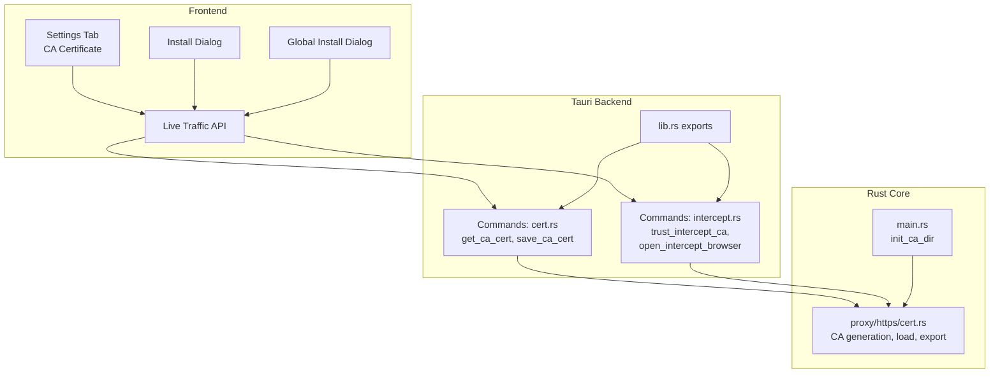
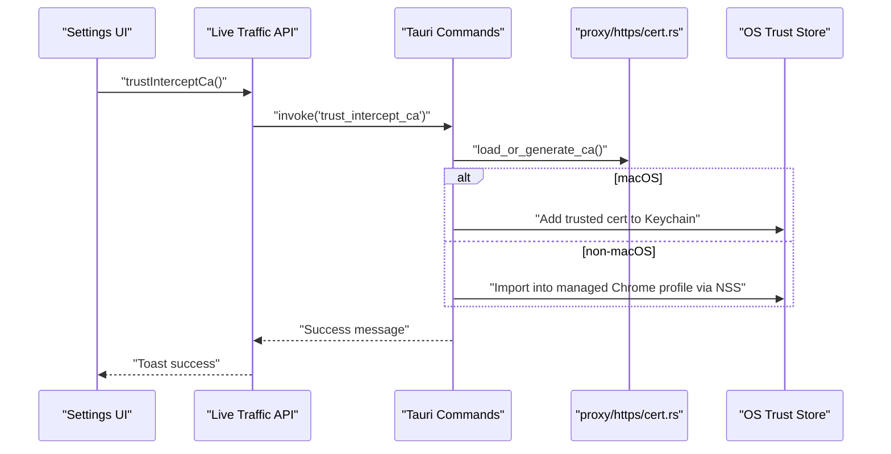
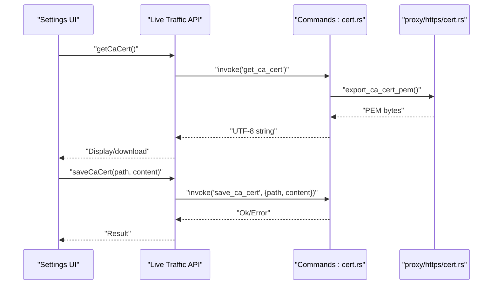
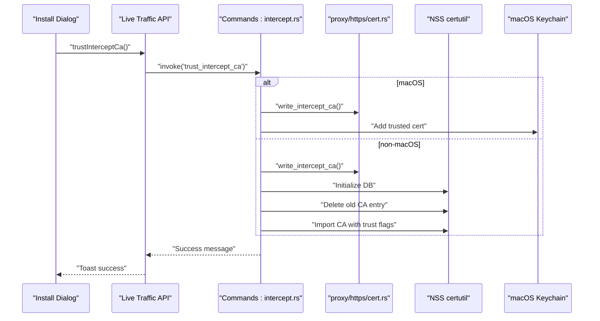
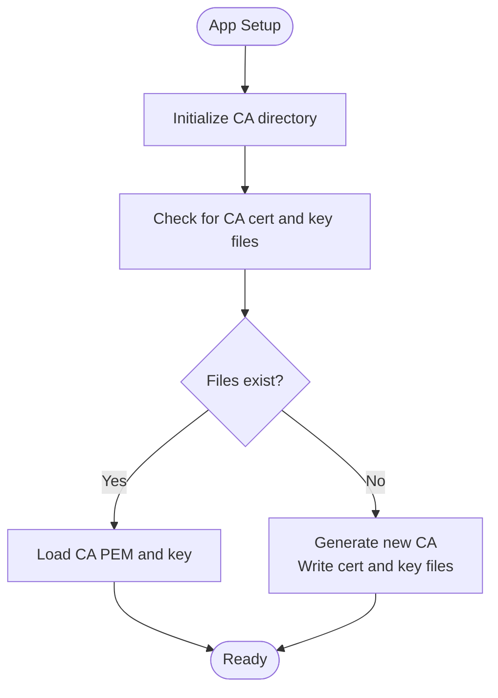
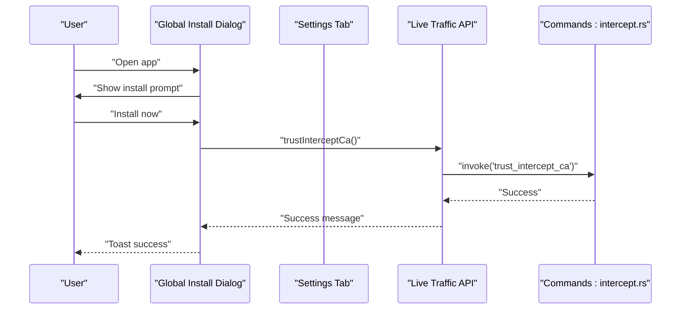
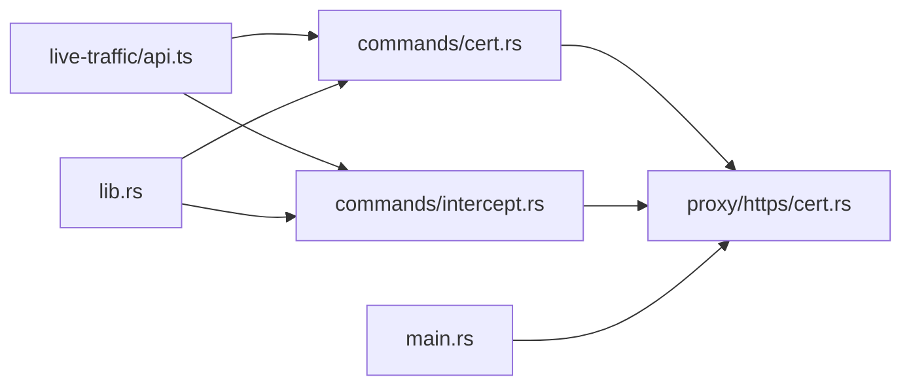

# Certificate Commands

<cite>
**Referenced Files in This Document**
- [src-tauri/src/commands/cert.rs](file://src-tauri/src/commands/cert.rs)
- [src-tauri/src/commands/intercept.rs](file://src-tauri/src/commands/intercept.rs)
- [src-tauri/src/proxy/https/cert.rs](file://src-tauri/src/proxy/https/cert.rs)
- [src-tauri/src/main.rs](file://src-tauri/src/main.rs)
- [src/pages/live-traffic/api.ts](file://src/pages/live-traffic/api.ts)
- [src/components/ca-install-dialog.tsx](file://src/components/ca-install-dialog.tsx)
- [src/components/global-ca-install-dialog.tsx](file://src/components/global-ca-install-dialog.tsx)
- [src/pages/settings/components/ca-certificate-settings-tab.tsx](file://src/pages/settings/components/ca-certificate-settings-tab.tsx)
- [src/pages/settings/constants.ts](file://src/pages/settings/constants.ts)
- [src-tauri/src/lib.rs](file://src-tauri/src/lib.rs)
</cite>

## Table of Contents
1. [Introduction](#introduction)
2. [Project Structure](#project-structure)
3. [Core Components](#core-components)
4. [Architecture Overview](#architecture-overview)
5. [Detailed Component Analysis](#detailed-component-analysis)
6. [Dependency Analysis](#dependency-analysis)
7. [Performance Considerations](#performance-considerations)
8. [Troubleshooting Guide](#troubleshooting-guide)
9. [Conclusion](#conclusion)
10. [Appendices](#appendices)

## Introduction
This document explains AppRecon’s certificate management command handlers and related workflows. It covers:
- CA certificate generation and persistence
- Retrieval and saving of the CA certificate
- Trust store integration across platforms (macOS Keychain and managed Chrome profiles via NSS certutil)
- Browser configuration and installation guidance
- Validation, expiration handling, and renewal workflows
- Security considerations, certificate chain management, and cross-platform compatibility
- Examples of installation procedures, troubleshooting, and automated management
- Best practices, revocation handling, and compliance considerations

## Project Structure
The certificate management system spans frontend UI, Tauri commands, and Rust backend logic:
- Frontend dialogs and settings guide users through installation and provide troubleshooting
- Tauri commands expose certificate operations to the frontend
- Rust modules generate and manage the local CA and integrate with OS trust stores

**Diagram sources**
- [src/pages/settings/components/ca-certificate-settings-tab.tsx:18-65](file://src/pages/settings/components/ca-certificate-settings-tab.tsx#L18-L65)
- [src/components/ca-install-dialog.tsx:23-71](file://src/components/ca-install-dialog.tsx#L23-L71)
- [src/components/global-ca-install-dialog.tsx:11-50](file://src/components/global-ca-install-dialog.tsx#L11-L50)
- [src/pages/live-traffic/api.ts:145-155](file://src/pages/live-traffic/api.ts#L145-L155)
- [src-tauri/src/commands/cert.rs:3-12](file://src-tauri/src/commands/cert.rs#L3-L12)
- [src-tauri/src/commands/intercept.rs:284-433](file://src-tauri/src/commands/intercept.rs#L284-L433)
- [src-tauri/src/proxy/https/cert.rs:11-144](file://src-tauri/src/proxy/https/cert.rs#L11-L144)
- [src-tauri/src/main.rs:36-36](file://src-tauri/src/main.rs#L36-L36)
- [src-tauri/src/lib.rs:38-38](file://src-tauri/src/lib.rs#L38-L38)

**Section sources**
- [src/pages/settings/components/ca-certificate-settings-tab.tsx:18-147](file://src/pages/settings/components/ca-certificate-settings-tab.tsx#L18-L147)
- [src/components/ca-install-dialog.tsx:23-71](file://src/components/ca-install-dialog.tsx#L23-L71)
- [src/components/global-ca-install-dialog.tsx:11-50](file://src/components/global-ca-install-dialog.tsx#L11-L50)
- [src/pages/live-traffic/api.ts:145-155](file://src/pages/live-traffic/api.ts#L145-L155)
- [src-tauri/src/commands/cert.rs:3-12](file://src-tauri/src/commands/cert.rs#L3-L12)
- [src-tauri/src/commands/intercept.rs:284-433](file://src-tauri/src/commands/intercept.rs#L284-L433)
- [src-tauri/src/proxy/https/cert.rs:11-144](file://src-tauri/src/proxy/https/cert.rs#L11-L144)
- [src-tauri/src/main.rs:36-36](file://src-tauri/src/main.rs#L36-L36)
- [src-tauri/src/lib.rs:38-38](file://src-tauri/src/lib.rs#L38-L38)

## Core Components
- Certificate retrieval and saving commands:
  - get_ca_cert: returns the current CA certificate PEM as a UTF-8 string
  - save_ca_cert: writes a given PEM content to a specified path
- Trust store integration commands:
  - trust_intercept_ca: installs the CA into the platform-specific trust store
  - open_intercept_browser: manages a dedicated browser profile and imports the CA into NSS certificate database
- CA generation and persistence:
  - Local CA directory initialization and certificate/key loading/generation
  - Export of CA PEM for distribution and installation

**Section sources**
- [src-tauri/src/commands/cert.rs:3-12](file://src-tauri/src/commands/cert.rs#L3-L12)
- [src-tauri/src/commands/intercept.rs:284-433](file://src-tauri/src/commands/intercept.rs#L284-L433)
- [src-tauri/src/proxy/https/cert.rs:11-144](file://src-tauri/src/proxy/https/cert.rs#L11-L144)

## Architecture Overview
The certificate workflow connects UI actions to Tauri commands and Rust logic. The frontend invokes commands to retrieve or install the CA, which are backed by Rust modules that generate or load the local CA and integrate with OS trust stores.

**Diagram sources**
- [src/pages/live-traffic/api.ts:153-155](file://src/pages/live-traffic/api.ts#L153-L155)
- [src-tauri/src/commands/intercept.rs:422-433](file://src-tauri/src/commands/intercept.rs#L422-L433)
- [src-tauri/src/proxy/https/cert.rs:42-94](file://src-tauri/src/proxy/https/cert.rs#L42-L94)

## Detailed Component Analysis

### Certificate Retrieval and Saving
- get_ca_cert:
  - Retrieves the current CA certificate PEM bytes from the Rust module and converts to a UTF-8 string for the frontend
- save_ca_cert:
  - Writes a provided PEM string to a user-specified filesystem path

**Diagram sources**
- [src/pages/live-traffic/api.ts:145-151](file://src/pages/live-traffic/api.ts#L145-L151)
- [src-tauri/src/commands/cert.rs:3-12](file://src-tauri/src/commands/cert.rs#L3-L12)
- [src-tauri/src/proxy/https/cert.rs:96-104](file://src-tauri/src/proxy/https/cert.rs#L96-L104)

**Section sources**
- [src/pages/live-traffic/api.ts:145-151](file://src/pages/live-traffic/api.ts#L145-L151)
- [src-tauri/src/commands/cert.rs:3-12](file://src-tauri/src/commands/cert.rs#L3-L12)
- [src-tauri/src/proxy/https/cert.rs:96-104](file://src-tauri/src/proxy/https/cert.rs#L96-L104)

### Trust Store Integration and Browser Configuration
- trust_intercept_ca:
  - On macOS: adds the CA to the user login keychain and marks it trusted for SSL
  - On non-macOS: imports the CA into a managed Chrome profile using NSS certutil
- open_intercept_browser:
  - Prepares a dedicated browser profile directory
  - Ensures NSS database initialization and removes any prior CA entry
  - Imports the current CA into the NSS database with appropriate trust attributes

**Diagram sources**
- [src/pages/live-traffic/api.ts:153-155](file://src/pages/live-traffic/api.ts#L153-L155)
- [src-tauri/src/commands/intercept.rs:284-433](file://src-tauri/src/commands/intercept.rs#L284-L433)
- [src-tauri/src/proxy/https/cert.rs:237-247](file://src-tauri/src/proxy/https/cert.rs#L237-L247)

**Section sources**
- [src-tauri/src/commands/intercept.rs:284-433](file://src-tauri/src/commands/intercept.rs#L284-L433)
- [src-tauri/src/proxy/https/cert.rs:237-247](file://src-tauri/src/proxy/https/cert.rs#L237-L247)

### Certificate Generation and Persistence
- Initialization:
  - The application initializes the CA directory during setup using the app data directory
- Load or generate:
  - If CA certificate and key files exist, they are loaded
  - Otherwise, a new CA is generated with appropriate parameters and written to disk
- Export and authority creation:
  - Exports the CA PEM for distribution
  - Creates an issuer for dynamic leaf certificate signing

**Diagram sources**
- [src-tauri/src/main.rs:36-36](file://src-tauri/src/main.rs#L36-L36)
- [src-tauri/src/proxy/https/cert.rs:11-94](file://src-tauri/src/proxy/https/cert.rs#L11-L94)

**Section sources**
- [src-tauri/src/main.rs:36-36](file://src-tauri/src/main.rs#L36-L36)
- [src-tauri/src/proxy/https/cert.rs:11-94](file://src-tauri/src/proxy/https/cert.rs#L11-L94)

### Frontend UI and Automated Installation
- Settings tab:
  - Provides buttons to install to macOS Keychain and to save the CA certificate
  - Includes installation guides and troubleshooting information
- Install dialog:
  - Prompts the user to install the CA immediately or open settings
- Global install dialog:
  - Automatically opens a modal on first run to guide installation and calls the trust command

**Diagram sources**
- [src/components/global-ca-install-dialog.tsx:11-50](file://src/components/global-ca-install-dialog.tsx#L11-L50)
- [src/pages/settings/components/ca-certificate-settings-tab.tsx:18-65](file://src/pages/settings/components/ca-certificate-settings-tab.tsx#L18-L65)
- [src/pages/live-traffic/api.ts:153-155](file://src/pages/live-traffic/api.ts#L153-L155)
- [src-tauri/src/commands/intercept.rs:422-433](file://src-tauri/src/commands/intercept.rs#L422-L433)

**Section sources**
- [src/components/global-ca-install-dialog.tsx:11-50](file://src/components/global-ca-install-dialog.tsx#L11-L50)
- [src/pages/settings/components/ca-certificate-settings-tab.tsx:18-147](file://src/pages/settings/components/ca-certificate-settings-tab.tsx#L18-L147)
- [src/pages/settings/constants.ts:3-178](file://src/pages/settings/constants.ts#L3-L178)
- [src/pages/live-traffic/api.ts:153-155](file://src/pages/live-traffic/api.ts#L153-L155)
- [src-tauri/src/commands/intercept.rs:422-433](file://src-tauri/src/commands/intercept.rs#L422-L433)

## Dependency Analysis
- The frontend invokes Tauri commands via the Live Traffic API
- Tauri commands depend on Rust modules for CA generation and trust store operations
- The main application initializes the CA directory early in startup

**Diagram sources**
- [src/pages/live-traffic/api.ts:145-155](file://src/pages/live-traffic/api.ts#L145-L155)
- [src-tauri/src/commands/cert.rs:3-12](file://src-tauri/src/commands/cert.rs#L3-L12)
- [src-tauri/src/commands/intercept.rs:284-433](file://src-tauri/src/commands/intercept.rs#L284-L433)
- [src-tauri/src/proxy/https/cert.rs:11-144](file://src-tauri/src/proxy/https/cert.rs#L11-L144)
- [src-tauri/src/main.rs:36-36](file://src-tauri/src/main.rs#L36-L36)
- [src-tauri/src/lib.rs:38-38](file://src-tauri/src/lib.rs#L38-L38)

**Section sources**
- [src/pages/live-traffic/api.ts:145-155](file://src/pages/live-traffic/api.ts#L145-L155)
- [src-tauri/src/commands/cert.rs:3-12](file://src-tauri/src/commands/cert.rs#L3-L12)
- [src-tauri/src/commands/intercept.rs:284-433](file://src-tauri/src/commands/intercept.rs#L284-L433)
- [src-tauri/src/proxy/https/cert.rs:11-144](file://src-tauri/src/proxy/https/cert.rs#L11-L144)
- [src-tauri/src/main.rs:36-36](file://src-tauri/src/main.rs#L36-L36)
- [src-tauri/src/lib.rs:38-38](file://src-tauri/src/lib.rs#L38-L38)

## Performance Considerations
- CA generation occurs only once and is reused across sessions; subsequent loads read from disk
- Trust store operations are lightweight but involve external tools (security on macOS, NSS certutil on non-macOS)
- Avoid repeated certificate imports by checking existing entries before importing
- Batch operations (e.g., importing into NSS) should minimize repeated invocations

[No sources needed since this section provides general guidance]

## Troubleshooting Guide
Common issues and resolutions:
- Certificate not trusted warnings:
  - Ensure the CA is installed and marked as trusted in the browser/device
  - Restart the browser after installation
  - On iOS, enable full trust in Certificate Trust Settings
- Some apps do not work with interception:
  - Apps may use certificate pinning; bypassing requires advanced measures (not recommended)
- Removing the CA:
  - Windows: Internet Options → Content → Certificates → Authorities → Remove
  - macOS: Keychain Access → System → Certificates → Delete
  - Firefox: Options → Privacy → Certificates → Authorities → Delete
  - iOS: Settings → General → Profiles → Delete profile
  - Android: Settings → Security → Encryption & credentials → Trusted certificates → Remove

**Section sources**
- [src/pages/settings/constants.ts:112-139](file://src/pages/settings/constants.ts#L112-L139)

## Conclusion
AppRecon’s certificate management integrates a local CA with platform-specific trust stores, enabling HTTPS interception. The frontend provides guided installation and troubleshooting, while Tauri commands and Rust modules handle secure generation, persistence, and trust integration. Following the best practices and troubleshooting steps ensures reliable operation across platforms.

[No sources needed since this section summarizes without analyzing specific files]

## Appendices

### Certificate Generation Parameters
- CA type: Unconstrained CA with key usages for certificate signing and CRL signing
- Distinguished name: Organization and Common Name set to the application identity
- Persistence: CA certificate and private key are stored in a dedicated directory under the application data folder

**Section sources**
- [src-tauri/src/proxy/https/cert.rs:74-86](file://src-tauri/src/proxy/https/cert.rs#L74-L86)

### Cross-Platform Compatibility Notes
- macOS:
  - Uses the user login keychain with explicit SSL trust policy
- Non-macOS:
  - Uses NSS certutil to manage a dedicated browser profile certificate database
  - Requires NSS tools to be installed on the system

**Section sources**
- [src-tauri/src/commands/intercept.rs:366-420](file://src-tauri/src/commands/intercept.rs#L366-L420)
- [src-tauri/src/commands/intercept.rs:259-282](file://src-tauri/src/commands/intercept.rs#L259-L282)

### Security Best Practices
- Limit CA usage to the intended proxy workflow
- Avoid distributing the CA beyond trusted environments
- Regularly review and rotate the CA in controlled environments
- Educate users on trusting only the official CA

[No sources needed since this section provides general guidance]

### Compliance and Revocation Considerations
- Maintain audit logs of CA installation and removal
- Implement policies for CA lifecycle management
- Support certificate revocation where applicable to your deployment model

[No sources needed since this section provides general guidance]