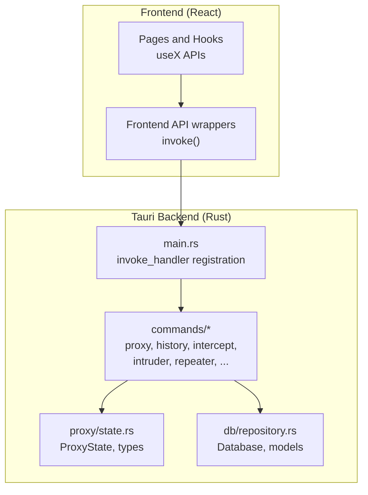
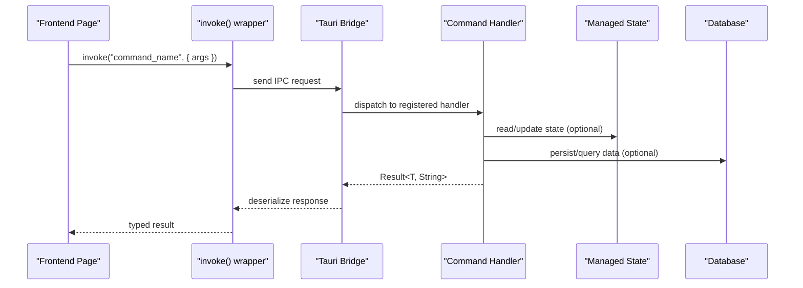
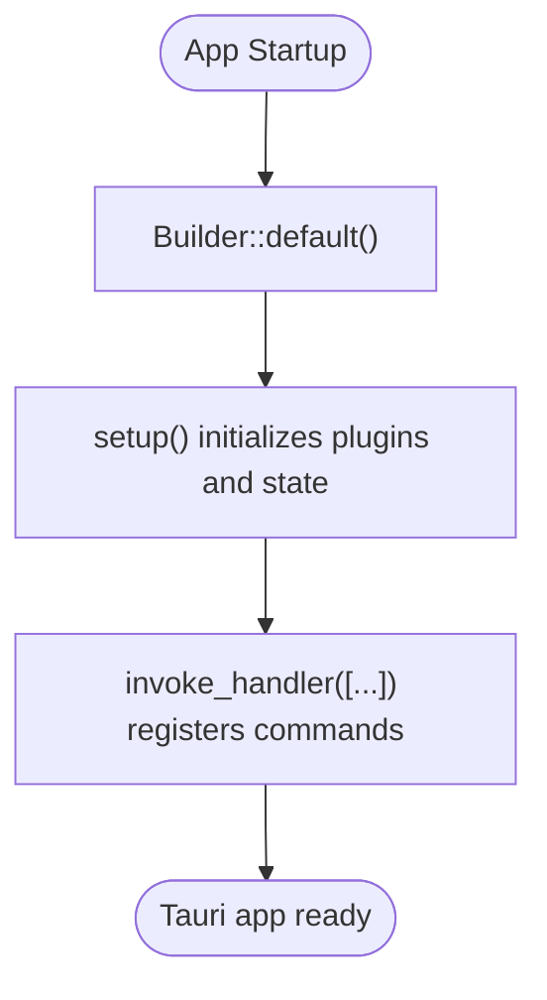
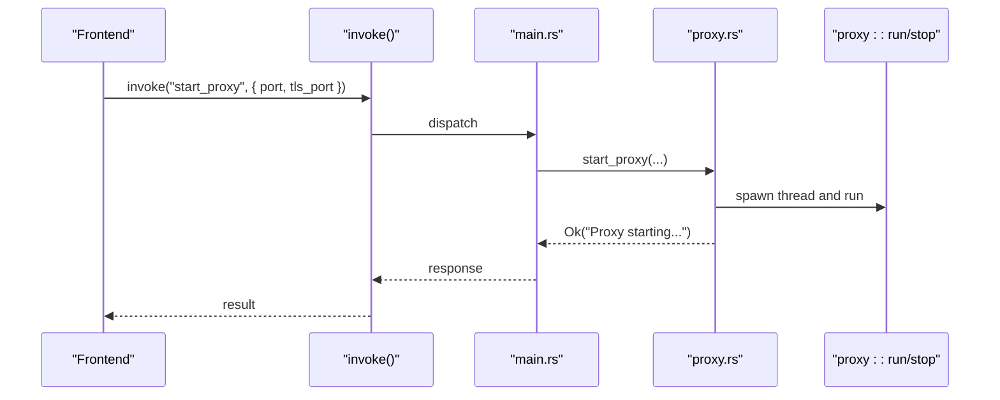
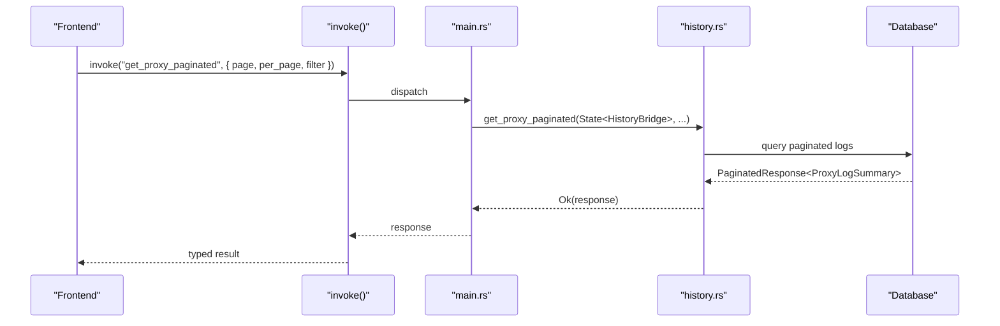
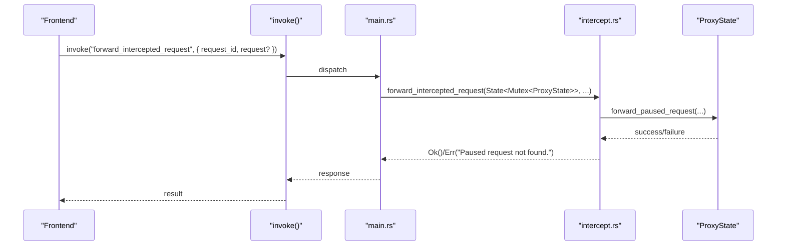
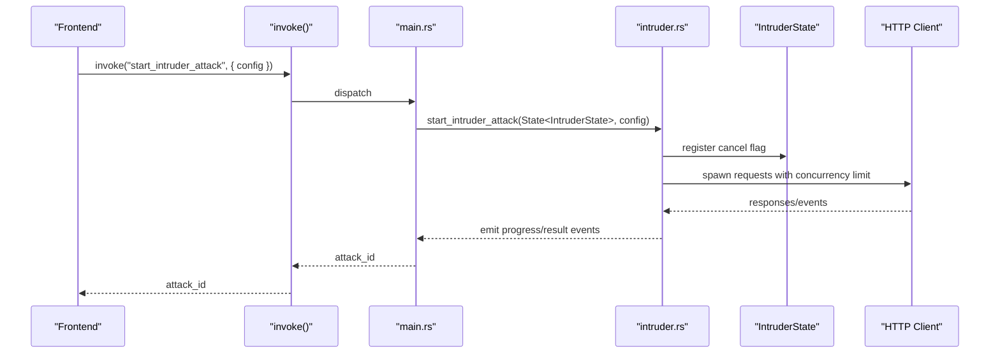
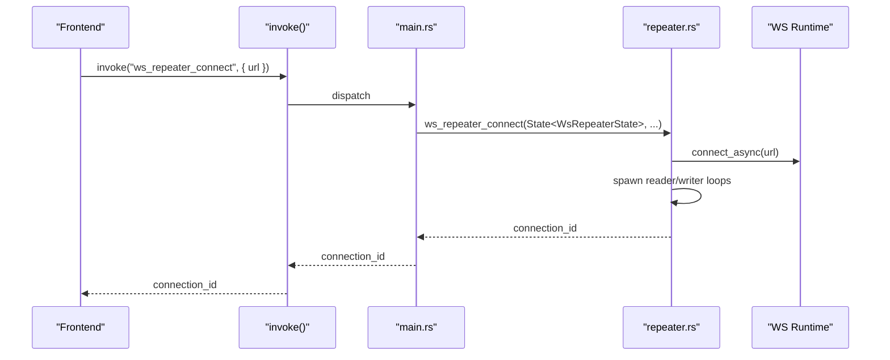
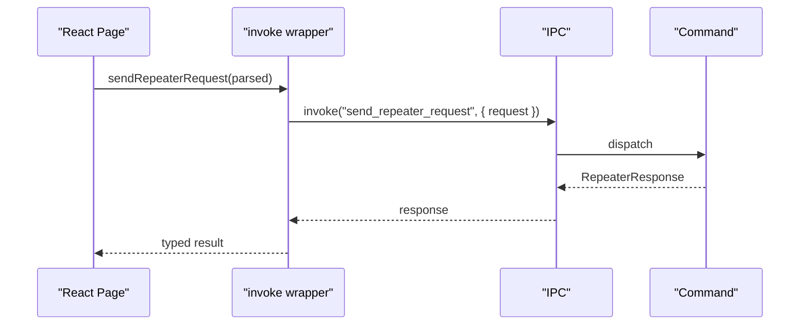
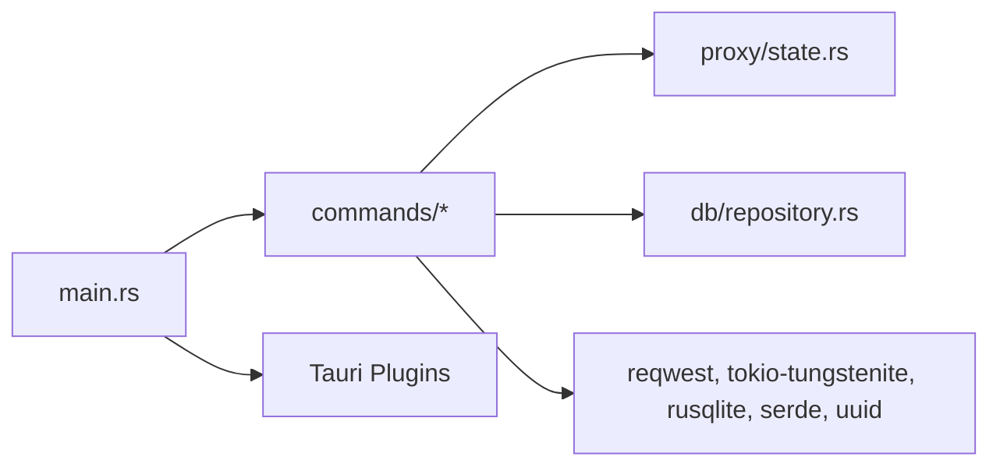

# Command System

<cite>
**Referenced Files in This Document**
- [src-tauri/src/main.rs](file://src-tauri/src/main.rs)
- [src-tauri/src/lib.rs](file://src-tauri/src/lib.rs)
- [src-tauri/src/commands/mod.rs](file://src-tauri/src/commands/mod.rs)
- [src-tauri/src/commands/proxy.rs](file://src-tauri/src/commands/proxy.rs)
- [src-tauri/src/commands/history.rs](file://src-tauri/src/commands/history.rs)
- [src-tauri/src/commands/intercept.rs](file://src-tauri/src/commands/intercept.rs)
- [src-tauri/src/commands/intruder.rs](file://src-tauri/src/commands/intruder.rs)
- [src-tauri/src/commands/repeater.rs](file://src-tauri/src/commands/repeater.rs)
- [src-tauri/src/proxy/state.rs](file://src-tauri/src/proxy/state.rs)
- [src-tauri/src/db/repository.rs](file://src-tauri/src/db/repository.rs)
- [src-tauri/Cargo.toml](file://src-tauri/Cargo.toml)
- [src-tauri/tauri.conf.json](file://src-tauri/tauri.conf.json)
- [src/pages/live-traffic/api.ts](file://src/pages/live-traffic/api.ts)
- [src/pages/repeater/api.ts](file://src/pages/repeater/api.ts)
- [src/pages/intercept/index.tsx](file://src/pages/intercept/index.tsx)
- [src/pages/repeater/index.tsx](file://src/pages/repeater/index.tsx)
</cite>

## Table of Contents
1. [Introduction](#introduction)
2. [Project Structure](#project-structure)
3. [Core Components](#core-components)
4. [Architecture Overview](#architecture-overview)
5. [Detailed Component Analysis](#detailed-component-analysis)
6. [Dependency Analysis](#dependency-analysis)
7. [Performance Considerations](#performance-considerations)
8. [Troubleshooting Guide](#troubleshooting-guide)
9. [Conclusion](#conclusion)
10. [Appendices](#appendices)

## Introduction
This document explains AppRecon’s Tauri command system architecture. It covers how commands are registered, how IPC communicates between frontend and backend, and how frontend components integrate with backend handlers. It also details command function signatures, parameter validation, response serialization, error handling strategies, asynchronous execution, resource management, command routing, permissions, and security considerations. Practical guidance is included for implementing new commands, handling complex data structures, optimizing performance, managing command lifecycles, synchronizing state, and debugging.

## Project Structure
The command system spans Rust backend modules under src-tauri and TypeScript frontend integration under src. The backend registers commands via Tauri’s invoke handler and exposes state and services through managed state. Frontend code invokes commands using @tauri-apps/api and consumes events emitted by the backend.

**Diagram sources**
- [src-tauri/src/main.rs:71-139](file://src-tauri/src/main.rs#L71-L139)
- [src-tauri/src/commands/mod.rs:1-9](file://src-tauri/src/commands/mod.rs#L1-L9)
- [src-tauri/src/proxy/state.rs:176-441](file://src-tauri/src/proxy/state.rs#L176-L441)
- [src-tauri/src/db/repository.rs:37-800](file://src-tauri/src/db/repository.rs#L37-L800)

**Section sources**
- [src-tauri/src/main.rs:14-147](file://src-tauri/src/main.rs#L14-L147)
- [src-tauri/src/lib.rs:1-51](file://src-tauri/src/lib.rs#L1-L51)

## Core Components
- Command registration: Commands are registered in main.rs using Tauri’s generate_handler macro. This centralizes all backend command entry points.
- Command modules: Feature-based modules under src-tauri/src/commands expose typed functions annotated with #[tauri::command].
- State management: Managed state (Mutex<ProxyState>, IntruderState, WsRepeaterState, HistoryBridge) is injected into commands via Tauri State or AppHandle.
- IPC integration: Frontend invokes commands via @tauri-apps/api invoke() and listens to events emitted by the backend.
- Persistence: Database module encapsulates SQLite operations for logs, documents, and packet captures.

**Section sources**
- [src-tauri/src/main.rs:71-139](file://src-tauri/src/main.rs#L71-L139)
- [src-tauri/src/commands/mod.rs:1-9](file://src-tauri/src/commands/mod.rs#L1-L9)
- [src-tauri/src/proxy/state.rs:176-441](file://src-tauri/src/proxy/state.rs#L176-L441)
- [src-tauri/src/db/repository.rs:37-800](file://src-tauri/src/db/repository.rs#L37-L800)

## Architecture Overview
The backend builds a Tauri app, manages shared state, and registers commands. The frontend calls invoke() with a command name and arguments, receives typed responses, and subscribes to events for long-running tasks.

**Diagram sources**
- [src-tauri/src/main.rs:71-139](file://src-tauri/src/main.rs#L71-L139)
- [src/pages/live-traffic/api.ts:35-45](file://src/pages/live-traffic/api.ts#L35-L45)
- [src/pages/repeater/api.ts:5-7](file://src/pages/repeater/api.ts#L5-L7)

## Detailed Component Analysis

### Command Registration and Routing
- Central registration: All commands are listed in main.rs under generate_handler. This ensures a single source of truth for command names and handlers.
- Routing: Tauri routes incoming invoke() calls to the matching #[tauri::command] function by name.

**Diagram sources**
- [src-tauri/src/main.rs:23-70](file://src-tauri/src/main.rs#L23-L70)

**Section sources**
- [src-tauri/src/main.rs:71-139](file://src-tauri/src/main.rs#L71-L139)

### Proxy Commands
- Purpose: Start/stop proxy, query runtime status, and manage proxy state.
- Signature patterns:
  - start_proxy(AppHandle, u16, u16) -> Result<String, String>
  - stop_proxy() -> Result<String, String>
  - get_proxy_status() -> Result<ProxyRuntimeStatus, String>
- Validation: Ports are passed directly; runtime checks determine connectivity.
- Serialization: ProxyRuntimeStatus is serializable for transport.
- Threading: start_proxy spawns a thread to run the proxy loop.

**Diagram sources**
- [src-tauri/src/commands/proxy.rs:15-74](file://src-tauri/src/commands/proxy.rs#L15-L74)
- [src-tauri/src/main.rs:71-139](file://src-tauri/src/main.rs#L71-L139)

**Section sources**
- [src-tauri/src/commands/proxy.rs:15-74](file://src-tauri/src/commands/proxy.rs#L15-L74)

### History Commands
- Purpose: CRUD and querying of HTTP logs, WebSocket logs, and documents.
- Patterns:
  - State injection via tauri::State<HistoryBridge>
  - Parameterized queries with filters and pagination
  - Typed responses (Vec<ProxyRecord>, PaginatedResponse, etc.)
- Validation: Errors propagated as String; NotFound errors constructed from optional lookups.

**Diagram sources**
- [src-tauri/src/commands/history.rs:56-65](file://src-tauri/src/commands/history.rs#L56-L65)
- [src-tauri/src/db/repository.rs:535-570](file://src-tauri/src/db/repository.rs#L535-L570)

**Section sources**
- [src-tauri/src/commands/history.rs:1-117](file://src-tauri/src/commands/history.rs#L1-L117)
- [src-tauri/src/db/repository.rs:37-800](file://src-tauri/src/db/repository.rs#L37-L800)

### Intercept Commands
- Purpose: Control interception mode, manage paused requests, and open a browser with proxy settings.
- State: Uses Mutex<ProxyState> to synchronize access to intercepted requests and bypass patterns.
- Validation: UUID parsing for request IDs; error messages for missing requests.
- Cross-platform: Browser discovery and certificate import handled with platform-specific logic.

**Diagram sources**
- [src-tauri/src/commands/intercept.rs:52-93](file://src-tauri/src/commands/intercept.rs#L52-L93)
- [src-tauri/src/proxy/state.rs:267-291](file://src-tauri/src/proxy/state.rs#L267-L291)

**Section sources**
- [src-tauri/src/commands/intercept.rs:1-434](file://src-tauri/src/commands/intercept.rs#L1-L434)
- [src-tauri/src/proxy/state.rs:176-441](file://src-tauri/src/proxy/state.rs#L176-L441)

### Intruder Commands
- Purpose: Run advanced HTTP brute-force attacks with multiple modes and payload sources.
- Async execution: Uses tokio::spawn for concurrent requests, tokio::sync::Semaphore for concurrency control, and AtomicBool for cancellation.
- Validation: Validates configuration (URL presence, payload positions, payload sources).
- Events: Emits progress and result events via AppHandle::emit for real-time updates.
- Payload processing: Supports encoding/decoding, hashing, and numeric formatting.

**Diagram sources**
- [src-tauri/src/commands/intruder.rs:164-207](file://src-tauri/src/commands/intruder.rs#L164-L207)
- [src-tauri/src/commands/intruder.rs:242-345](file://src-tauri/src/commands/intruder.rs#L242-L345)

**Section sources**
- [src-tauri/src/commands/intruder.rs:159-240](file://src-tauri/src/commands/intruder.rs#L159-L240)
- [src-tauri/src/commands/intruder.rs:242-345](file://src-tauri/src/commands/intruder.rs#L242-L345)

### Repeater Commands
- Purpose: Send HTTP requests and manage WebSocket connections.
- HTTP: Parses method, headers/body, applies content-encoding re-encoding, measures latency, and returns structured response.
- WebSocket: Establishes WS connection, streams inbound messages, and supports outbound sends and disconnects.
- State: WsRepeaterState tracks active connections and handles.

**Diagram sources**
- [src-tauri/src/commands/repeater.rs:117-222](file://src-tauri/src/commands/repeater.rs#L117-L222)

**Section sources**
- [src-tauri/src/commands/repeater.rs:1-259](file://src-tauri/src/commands/repeater.rs#L1-L259)

### Frontend Integration and IPC
- Frontend wrappers: Use @tauri-apps/api invoke() to call backend commands. Error normalization converts unknown errors to user-friendly messages.
- Pages: Pages consume typed results and drive UI state. Example pages include Live Traffic and Repeater.

**Diagram sources**
- [src/pages/repeater/api.ts:5-7](file://src/pages/repeater/api.ts#L5-L7)
- [src/pages/live-traffic/api.ts:35-45](file://src/pages/live-traffic/api.ts#L35-L45)

**Section sources**
- [src/pages/live-traffic/api.ts:1-58](file://src/pages/live-traffic/api.ts#L1-L58)
- [src/pages/repeater/api.ts:1-7](file://src/pages/repeater/api.ts#L1-L7)
- [src/pages/intercept/index.tsx:15-69](file://src/pages/intercept/index.tsx#L15-L69)
- [src/pages/repeater/index.tsx:14-75](file://src/pages/repeater/index.tsx#L14-L75)

## Dependency Analysis
- Internal dependencies:
  - main.rs depends on commands modules and managed state.
  - commands depend on proxy state, database repository, and shared types.
- External dependencies:
  - Tauri core and plugins for IPC, dialogs, filesystem, process, clipboard, and updater.
  - reqwest for HTTP, tokio-tungstenite for WebSocket, rusqlite for persistence.

**Diagram sources**
- [src-tauri/src/main.rs:71-139](file://src-tauri/src/main.rs#L71-L139)
- [src-tauri/Cargo.toml:11-62](file://src-tauri/Cargo.toml#L11-L62)

**Section sources**
- [src-tauri/Cargo.toml:11-62](file://src-tauri/Cargo.toml#L11-L62)
- [src-tauri/tauri.conf.json:39-46](file://src-tauri/tauri.conf.json#L39-L46)

## Performance Considerations
- Concurrency control:
  - Intruder uses tokio::sync::Semaphore to cap concurrent requests and reduce resource contention.
  - Repeater uses reqwest Client with redirect policy configured to avoid excessive hops.
- Event-driven updates:
  - Intruder emits progress and result events to keep UI responsive during long runs.
- State locking:
  - ProxyState wraps internal state in Mutex to prevent race conditions; keep critical sections minimal.
- Serialization overhead:
  - Prefer compact representations for large payloads; decode/encode only when necessary (e.g., content-encoding handling).
- Database pagination:
  - Use paginated queries to avoid loading large datasets into memory.

[No sources needed since this section provides general guidance]

## Troubleshooting Guide
- Command invocation failures:
  - Frontend normalize errors to user-friendly messages. Check that the backend is running with the desktop Tauri environment, not dev web server.
- Proxy and interception:
  - Verify ports are free and proxy is reachable before querying status.
  - For browser automation, ensure the correct browser binary is discovered and proxy settings applied.
- Intruder cancellation:
  - Confirm cancel flag is stored and removed on completion to avoid stale state.
- WebSocket:
  - Validate URL scheme conversion (http/https to ws/wss) and handle close events gracefully.

**Section sources**
- [src/pages/live-traffic/api.ts:35-45](file://src/pages/live-traffic/api.ts#L35-L45)
- [src-tauri/src/commands/intercept.rs:284-320](file://src-tauri/src/commands/intercept.rs#L284-L320)
- [src-tauri/src/commands/intruder.rs:192-207](file://src-tauri/src/commands/intruder.rs#L192-L207)
- [src-tauri/src/commands/repeater.rs:117-222](file://src-tauri/src/commands/repeater.rs#L117-L222)

## Conclusion
AppRecon’s Tauri command system provides a robust, modular backend with explicit command registration, typed IPC, and managed state. Commands leverage async execution, event emission, and careful validation to deliver responsive and reliable functionality. The frontend integrates seamlessly via invoke() wrappers, enabling clean separation of concerns and maintainable development practices.

[No sources needed since this section summarizes without analyzing specific files]

## Appendices

### Implementing a New Command
- Define the command function in a module under src-tauri/src/commands with #[tauri::command].
- Accept parameters with serde-compatible types; use State<AppHandle> when accessing managed state or emitting events.
- Return Result<T, String> where T is serde-serializable.
- Register the command in main.rs generate_handler list.
- Add frontend wrapper in src/pages/<feature>/api.ts and consume in pages/<feature>/index.tsx.

**Section sources**
- [src-tauri/src/main.rs:71-139](file://src-tauri/src/main.rs#L71-L139)
- [src/pages/live-traffic/api.ts:35-45](file://src/pages/live-traffic/api.ts#L35-L45)
- [src/pages/repeater/api.ts:5-7](file://src/pages/repeater/api.ts#L5-L7)

### Handling Complex Data Structures
- Use serde-compatible structs for request/response bodies.
- For large payloads, consider streaming or chunking; ensure content-encoding is respected when re-sending.
- For nested structures (e.g., IntruderAttackConfig), validate required fields and ranges early.

**Section sources**
- [src-tauri/src/commands/intruder.rs:92-109](file://src-tauri/src/commands/intruder.rs#L92-L109)
- [src-tauri/src/commands/repeater.rs:12-28](file://src-tauri/src/commands/repeater.rs#L12-L28)

### Optimizing Command Performance
- Limit concurrency with semaphores for CPU/network-bound tasks.
- Use pagination for large datasets.
- Minimize state lock scope; clone lightweight data when safe.
- Cache expensive computations (e.g., payload generation) when appropriate.

**Section sources**
- [src-tauri/src/commands/intruder.rs:267-288](file://src-tauri/src/commands/intruder.rs#L267-L288)
- [src-tauri/src/db/repository.rs:535-570](file://src-tauri/src/db/repository.rs#L535-L570)

### Command Lifecycle Management and State Synchronization
- Manage long-running tasks with cancellation flags and cleanup routines.
- Emit periodic progress events to keep UI synchronized.
- Persist transient state in managed state or database as appropriate.

**Section sources**
- [src-tauri/src/commands/intruder.rs:159-207](file://src-tauri/src/commands/intruder.rs#L159-L207)
- [src-tauri/src/commands/repeater.rs:103-151](file://src-tauri/src/commands/repeater.rs#L103-L151)

### Security and Permissions
- Respect platform-specific certificate and keychain handling for proxy CA installation.
- Validate and sanitize inputs (e.g., HTTP method, URL, headers) before sending requests.
- Avoid exposing sensitive data in logs or events.

**Section sources**
- [src-tauri/src/commands/intercept.rs:422-433](file://src-tauri/src/commands/intercept.rs#L422-L433)
- [src-tauri/src/commands/repeater.rs:30-96](file://src-tauri/src/commands/repeater.rs#L30-L96)