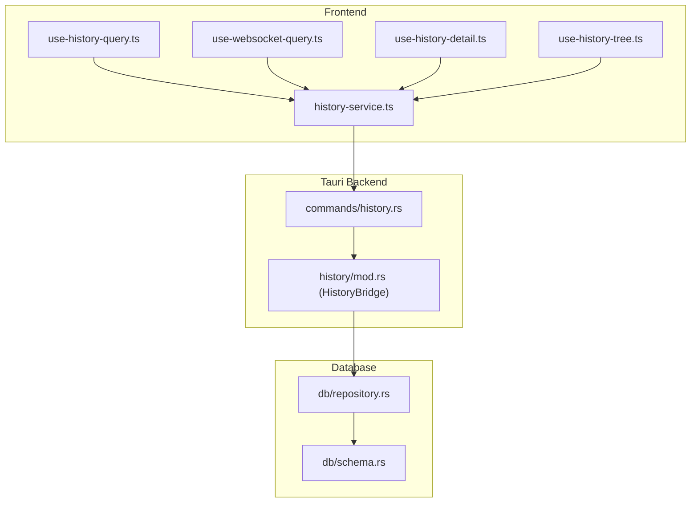
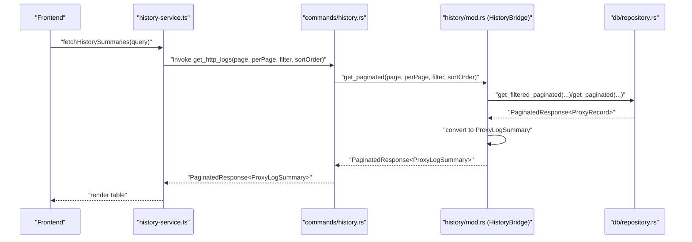
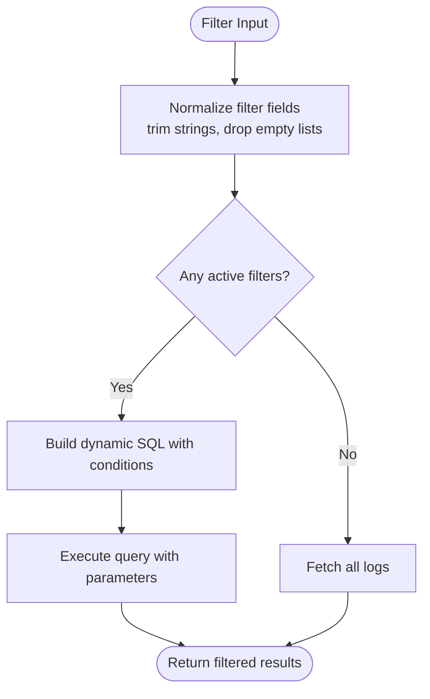
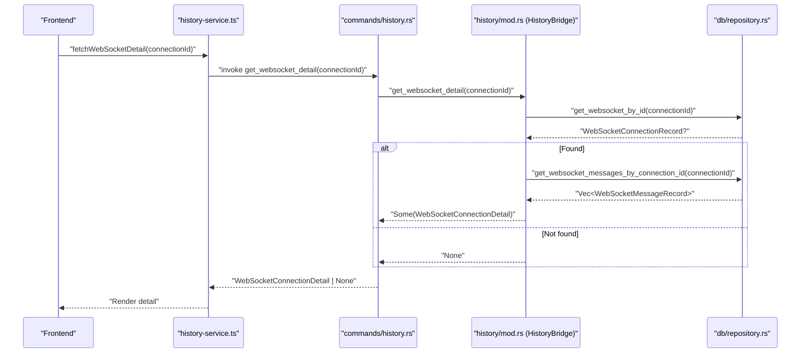
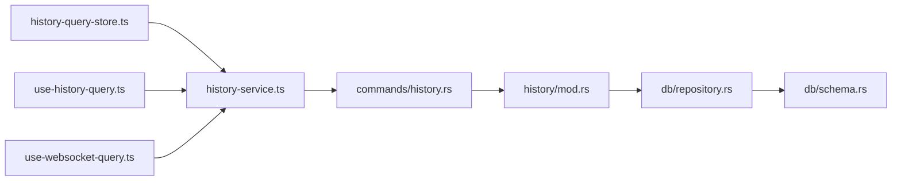

# History Commands

<cite>
**Referenced Files in This Document**
- [history.rs](file://src-tauri/src/commands/history.rs)
- [mod.rs (history bridge)](file://src-tauri/src/history/mod.rs)
- [repository.rs](file://src-tauri/src/db/repository.rs)
- [schema.rs](file://src-tauri/src/db/schema.rs)
- [history-service.ts](file://src/pages/live-traffic/services/history-service.ts)
- [history-query-store.ts](file://src/pages/live-traffic/state/history-query-store.ts)
- [use-history-query.ts](file://src/pages/live-traffic/hooks/use-history-query.ts)
- [use-websocket-query.ts](file://src/pages/live-traffic/hooks/use-websocket-query.ts)
- [use-history-detail.ts](file://src/pages/live-traffic/hooks/use-history-detail.ts)
- [use-history-tree.ts](file://src/pages/live-traffic/hooks/use-history-tree.ts)
</cite>

## Table of Contents
1. [Introduction](#introduction)
2. [Project Structure](#project-structure)
3. [Core Components](#core-components)
4. [Architecture Overview](#architecture-overview)
5. [Detailed Component Analysis](#detailed-component-analysis)
6. [Dependency Analysis](#dependency-analysis)
7. [Performance Considerations](#performance-considerations)
8. [Troubleshooting Guide](#troubleshooting-guide)
9. [Conclusion](#conclusion)

## Introduction
This document explains AppRecon’s history management command handlers for HTTP and WebSocket traffic. It covers the Tauri commands that expose backend history operations to the frontend, the filtering and pagination mechanisms, the database integration patterns, and the frontend orchestration. It also outlines performance characteristics, error handling strategies, and operational guidance for managing large histories.

## Project Structure
The history subsystem spans three layers:
- Frontend orchestration and state management for HTTP and WebSocket history queries
- Tauri command handlers that delegate to a history bridge
- Database layer implementing SQLite-backed persistence and query logic

**Diagram sources**
- [history-service.ts:1-57](file://src/pages/live-traffic/services/history-service.ts#L1-L57)
- [use-history-query.ts:1-117](file://src/pages/live-traffic/hooks/use-history-query.ts#L1-L117)
- [use-websocket-query.ts:1-38](file://src/pages/live-traffic/hooks/use-websocket-query.ts#L1-L38)
- [use-history-detail.ts:1-47](file://src/pages/live-traffic/hooks/use-history-detail.ts#L1-L47)
- [use-history-tree.ts:1-40](file://src/pages/live-traffic/hooks/use-history-tree.ts#L1-L40)
- [history.rs:1-117](file://src-tauri/src/commands/history.rs#L1-L117)
- [mod.rs (history bridge):1-396](file://src-tauri/src/history/mod.rs#L1-L396)
- [repository.rs:1-1329](file://src-tauri/src/db/repository.rs#L1-L1329)
- [schema.rs:1-176](file://src-tauri/src/db/schema.rs#L1-L176)

**Section sources**
- [history.rs:1-117](file://src-tauri/src/commands/history.rs#L1-L117)
- [mod.rs (history bridge):1-396](file://src-tauri/src/history/mod.rs#L1-L396)
- [repository.rs:1-1329](file://src-tauri/src/db/repository.rs#L1-L1329)
- [schema.rs:1-176](file://src-tauri/src/db/schema.rs#L1-L176)
- [history-service.ts:1-57](file://src/pages/live-traffic/services/history-service.ts#L1-L57)
- [history-query-store.ts:1-140](file://src/pages/live-traffic/state/history-query-store.ts#L1-L140)
- [use-history-query.ts:1-117](file://src/pages/live-traffic/hooks/use-history-query.ts#L1-L117)
- [use-websocket-query.ts:1-38](file://src/pages/live-traffic/hooks/use-websocket-query.ts#L1-L38)
- [use-history-detail.ts:1-47](file://src/pages/live-traffic/hooks/use-history-detail.ts#L1-L47)
- [use-history-tree.ts:1-40](file://src/pages/live-traffic/hooks/use-history-tree.ts#L1-L40)

## Core Components
- Tauri commands for HTTP history:
  - Clear all logs
  - List all logs
  - Filtered list
  - Paginated list with optional filter and sort order
  - Get single log by ID
  - Build tree view from filtered logs
- Tauri commands for WebSocket history:
  - Paginated list with optional filter
  - Get connection detail (connection + messages)
  - Clear all WebSocket logs
  - Delete a WebSocket connection by ID
- HistoryBridge orchestrates normalization, filtering, pagination, and conversion between internal and summary types.
- Database layer persists HTTP logs, WebSocket connections/messages, and documents; supports paginated queries and counts.

**Section sources**
- [history.rs:7-117](file://src-tauri/src/commands/history.rs#L7-L117)
- [mod.rs (history bridge):61-294](file://src-tauri/src/history/mod.rs#L61-L294)
- [repository.rs:295-918](file://src-tauri/src/db/repository.rs#L295-L918)
- [schema.rs:1-176](file://src-tauri/src/db/schema.rs#L1-L176)

## Architecture Overview
The frontend composes queries from local state and invokes Tauri commands. Commands route to the HistoryBridge, which applies normalization and delegates to the Database layer. The Database executes SQL with dynamic filters and pagination, returning typed summaries or full records.

**Diagram sources**
- [history-service.ts:20-28](file://src/pages/live-traffic/services/history-service.ts#L20-L28)
- [history.rs:56-65](file://src-tauri/src/commands/history.rs#L56-L65)
- [mod.rs (history bridge):162-186](file://src-tauri/src/history/mod.rs#L162-L186)
- [repository.rs:535-570](file://src-tauri/src/db/repository.rs#L535-L570)

## Detailed Component Analysis

### HTTP History Commands
- get_proxy_all: Returns all HTTP logs ordered by timestamp descending.
- get_proxy_filtered: Applies filters (search, path, methods, status codes, scope) and returns matching logs.
- get_proxy_paginated: Paginates results with optional filter and sort order ("ASC"|"DESC").
- get_proxy_detail: Retrieves a single log by ID; returns a not-found error if missing.
- get_proxy_tree: Builds a hierarchical tree of hosts and paths from filtered logs.
- delete_proxy_by_id: Removes a single HTTP log by ID.
- clear_proxy_all: Deletes all HTTP logs.

Filtering and normalization:
- Search and path filters are trimmed and ignored when empty.
- Methods and status codes are normalized to non-empty collections.
- Scope patterns support exact matches and wildcard prefixes for domains.
- Sort order defaults to descending; only "ASC" or anything else maps to "DESC".

Pagination:
- Uses LIMIT/OFFSET with explicit total count and has_more flag.
- Count queries mirror filter conditions for accurate totals.

Serialization:
- Records are serialized to JSON for transport; headers/body are stored as JSON/text/blob depending on type.

Error handling:
- Not-found errors for missing IDs are surfaced as explicit messages.
- Database errors are converted to string messages.

**Section sources**
- [history.rs:43-83](file://src-tauri/src/commands/history.rs#L43-L83)
- [mod.rs (history bridge):144-191](file://src-tauri/src/history/mod.rs#L144-L191)
- [mod.rs (history bridge):262-294](file://src-tauri/src/history/mod.rs#L262-L294)
- [repository.rs:295-301](file://src-tauri/src/db/repository.rs#L295-L301)
- [repository.rs:303-348](file://src-tauri/src/db/repository.rs#L303-L348)
- [repository.rs:535-570](file://src-tauri/src/db/repository.rs#L535-L570)
- [repository.rs:572-748](file://src-tauri/src/db/repository.rs#L572-L748)
- [repository.rs:758-918](file://src-tauri/src/db/repository.rs#L758-L918)

#### HTTP Filtering Flow

**Diagram sources**
- [mod.rs (history bridge):269-285](file://src-tauri/src/history/mod.rs#L269-L285)
- [repository.rs:572-748](file://src-tauri/src/db/repository.rs#L572-L748)

### WebSocket History Commands
- get_websocket_paginated: Paginates WebSocket connections with optional filter (search, scope, states).
- get_websocket_detail: Returns a connection plus all associated messages.
- delete_websocket_by_id: Removes a WebSocket connection by ID.
- clear_websocket_all: Clears both connections and messages.
- insert_websocket_connection/message: Internal helpers used by the proxy pipeline.

Filtering:
- Search matches URL/host/path.
- States filter accepts arbitrary state strings; normalized similarly to HTTP filters.
- Scope supports exact and wildcard patterns.

Pagination:
- Mirrors HTTP pagination with total and has_more.

Detail retrieval:
- Joins connection and messages by connection_id, preserving chronological order.

**Section sources**
- [history.rs:85-117](file://src-tauri/src/commands/history.rs#L85-L117)
- [mod.rs (history bridge):218-260](file://src-tauri/src/history/mod.rs#L218-L260)
- [repository.rs:450-533](file://src-tauri/src/db/repository.rs#L450-L533)
- [repository.rs:1229-1328](file://src-tauri/src/db/repository.rs#L1229-L1328)

#### WebSocket Detail Retrieval Sequence

**Diagram sources**
- [history-service.ts:42-44](file://src/pages/live-traffic/services/history-service.ts#L42-L44)
- [history.rs:96-103](file://src-tauri/src/commands/history.rs#L96-L103)
- [mod.rs (history bridge):243-260](file://src-tauri/src/history/mod.rs#L243-L260)
- [repository.rs:500-533](file://src-tauri/src/db/repository.rs#L500-L533)

### Frontend Orchestration
- history-service.ts: Maps UI queries to Tauri commands and exposes typed fetchers for summaries, details, and WebSocket data.
- use-history-query.ts: Composes a normalized query object from Zustand state, including filters, scope, sort order, page, and perPage.
- history-query-store.ts: Maintains filter state (search, methods, status codes, path), scope, sort order, pagination, selection, and refresh key.
- use-websocket-query.ts: Adapts HTTP query state to WebSocket-specific filters (search, scope, states).
- use-history-detail.ts and use-history-tree.ts: Drive detail loading and tree rendering via service functions.

**Section sources**
- [history-service.ts:1-57](file://src/pages/live-traffic/services/history-service.ts#L1-L57)
- [use-history-query.ts:1-117](file://src/pages/live-traffic/hooks/use-history-query.ts#L1-L117)
- [history-query-store.ts:1-140](file://src/pages/live-traffic/state/history-query-store.ts#L1-L140)
- [use-websocket-query.ts:1-38](file://src/pages/live-traffic/hooks/use-websocket-query.ts#L1-L38)
- [use-history-detail.ts:1-47](file://src/pages/live-traffic/hooks/use-history-detail.ts#L1-L47)
- [use-history-tree.ts:1-40](file://src/pages/live-traffic/hooks/use-history-tree.ts#L1-L40)

## Dependency Analysis
- Commands depend on HistoryBridge for business logic.
- HistoryBridge depends on Database for persistence and query execution.
- Database depends on rusqlite and schema definitions for table creation and indexes.
- Frontend depends on commands via Tauri invoke and on service modules for typed requests.

**Diagram sources**
- [history.rs:1-117](file://src-tauri/src/commands/history.rs#L1-L117)
- [mod.rs (history bridge):1-396](file://src-tauri/src/history/mod.rs#L1-L396)
- [repository.rs:1-1329](file://src-tauri/src/db/repository.rs#L1-L1329)
- [schema.rs:1-176](file://src-tauri/src/db/schema.rs#L1-L176)
- [history-service.ts:1-57](file://src/pages/live-traffic/services/history-service.ts#L1-L57)
- [history-query-store.ts:1-140](file://src/pages/live-traffic/state/history-query-store.ts#L1-L140)
- [use-history-query.ts:1-117](file://src/pages/live-traffic/hooks/use-history-query.ts#L1-L117)
- [use-websocket-query.ts:1-38](file://src/pages/live-traffic/hooks/use-websocket-query.ts#L1-L38)

**Section sources**
- [history.rs:1-117](file://src-tauri/src/commands/history.rs#L1-L117)
- [mod.rs (history bridge):1-396](file://src-tauri/src/history/mod.rs#L1-L396)
- [repository.rs:1-1329](file://src-tauri/src/db/repository.rs#L1-L1329)
- [schema.rs:1-176](file://src-tauri/src/db/schema.rs#L1-L176)
- [history-service.ts:1-57](file://src/pages/live-traffic/services/history-service.ts#L1-L57)
- [history-query-store.ts:1-140](file://src/pages/live-traffic/state/history-query-store.ts#L1-L140)
- [use-history-query.ts:1-117](file://src/pages/live-traffic/hooks/use-history-query.ts#L1-L117)
- [use-websocket-query.ts:1-38](file://src/pages/live-traffic/hooks/use-websocket-query.ts#L1-L38)

## Performance Considerations
- Indexes: Timestamp, method, URL for HTTP logs; timestamp, host, URL, connection_id, timestamp for WebSocket tables.
- Pagination: LIMIT/OFFSET with explicit total and has_more avoids loading entire datasets.
- Dynamic SQL: Filters are appended conditionally; avoid unnecessary LIKE wildcards at both ends.
- Normalization: Empty filters are ignored to prevent expensive scans.
- Serialization: Headers and bodies are stored as JSON/text/blob; consider compression or streaming for very large payloads.
- Transactions: Batched writes (e.g., packet capture) use transactions to reduce overhead.

Recommendations:
- Prefer indexed columns in filters (method, status, host).
- Limit perPage to reasonable values (e.g., hundreds) to keep UI responsive.
- Use scope patterns judiciously; wildcard domains increase scan cost.
- For very large histories, consider periodic pruning or archival strategies.

**Section sources**
- [schema.rs:18-56](file://src-tauri/src/db/schema.rs#L18-L56)
- [repository.rs:535-570](file://src-tauri/src/db/repository.rs#L535-L570)
- [repository.rs:572-748](file://src-tauri/src/db/repository.rs#L572-L748)
- [repository.rs:450-498](file://src-tauri/src/db/repository.rs#L450-L498)

## Troubleshooting Guide
Common issues and resolutions:
- Not found errors:
  - HTTP detail: When requesting a non-existent log ID, the backend returns a not-found message; handle gracefully in the frontend.
  - WebSocket detail: Missing connection returns None; ensure the connection exists before requesting messages.
- Empty results:
  - Verify filters are not overly restrictive; clear filters to confirm data availability.
  - Confirm scope patterns match actual hosts/URLs.
- Slow queries:
  - Add indexes on frequently filtered columns.
  - Reduce perPage and refine filters.
- Large payloads:
  - Consider disabling body previews or limiting perPage.
- Pagination anomalies:
  - Ensure has_more and total are used to manage UI state.

Operational tips:
- Periodic cleanup: Use clear commands to remove old logs or WebSocket data.
- Export: While direct export commands are not present in the history module, the summarized data returned by paginated queries can be exported by the frontend.

**Section sources**
- [history.rs:68-75](file://src-tauri/src/commands/history.rs#L68-L75)
- [history.rs:96-103](file://src-tauri/src/commands/history.rs#L96-L103)
- [mod.rs (history bridge):148-150](file://src-tauri/src/history/mod.rs#L148-L150)
- [mod.rs (history bridge):247-254](file://src-tauri/src/history/mod.rs#L247-L254)

## Conclusion
AppRecon’s history management provides robust HTTP and WebSocket history operations with flexible filtering, pagination, and normalization. The layered design cleanly separates frontend orchestration, Tauri commands, and database persistence. By leveraging indexes, pagination, and careful filter normalization, the system remains responsive even with large datasets. For production deployments, combine these built-in operations with periodic cleanup and consider external export flows for long-term retention.