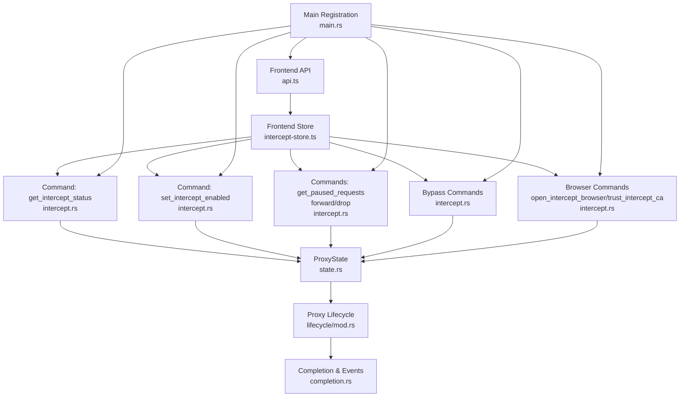
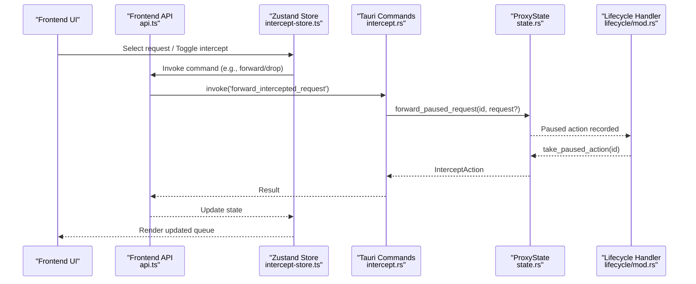
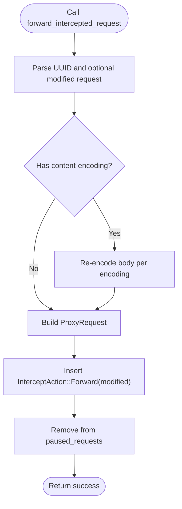
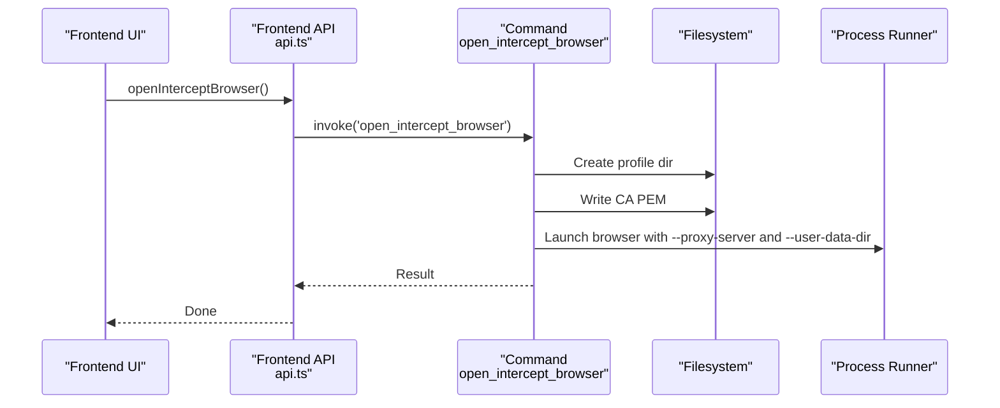
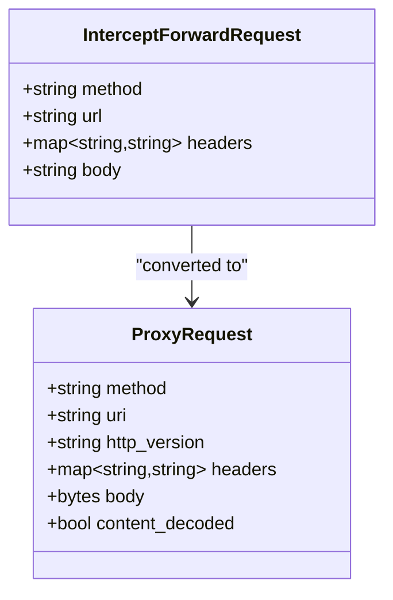
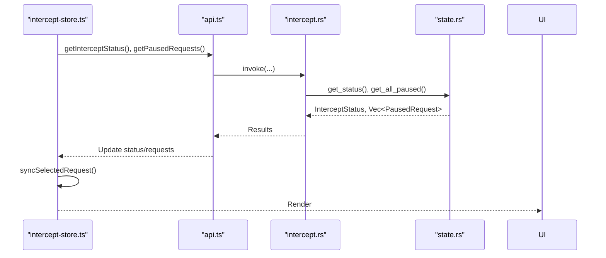
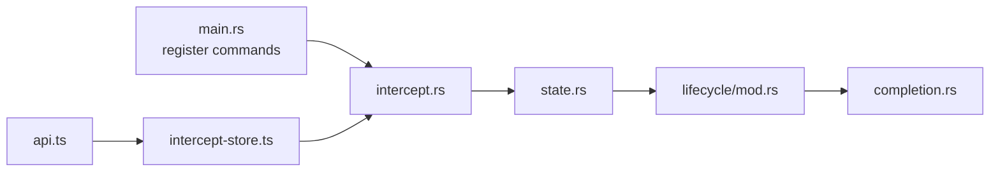

# Intercept Commands

<cite>
**Referenced Files in This Document**
- [intercept.rs](file://src-tauri/src/commands/intercept.rs)
- [intercept-store.ts](file://src/pages/intercept/state/intercept-store.ts)
- [api.ts](file://src/pages/intercept/api.ts)
- [types.ts](file://src/pages/intercept/types.ts)
- [lib.ts](file://src/pages/intercept/lib.ts)
- [state.rs](file://src-tauri/src/proxy/state.rs)
- [hooks.rs](file://src-tauri/src/proxy/intercept/hooks.rs)
- [mod.rs](file://src-tauri/src/proxy/lifecycle/mod.rs)
- [completion.rs](file://src-tauri/src/proxy/lifecycle/completion.rs)
- [main.rs](file://src-tauri/src/main.rs)
- [proxy/mod.rs](file://src-tauri/src/proxy/mod.rs)
</cite>

## Table of Contents
1. [Introduction](#introduction)
2. [Project Structure](#project-structure)
3. [Core Components](#core-components)
4. [Architecture Overview](#architecture-overview)
5. [Detailed Component Analysis](#detailed-component-analysis)
6. [Dependency Analysis](#dependency-analysis)
7. [Performance Considerations](#performance-considerations)
8. [Troubleshooting Guide](#troubleshooting-guide)
9. [Conclusion](#conclusion)
10. [Appendices](#appendices)

## Introduction
This document explains AppRecon’s traffic interception command handlers and related workflows. It covers:
- Interception queue commands: get_intercept_status, set_intercept_enabled, get_paused_requests, forward_intercepted_request, drop_intercepted_request
- Manual intervention commands: open_intercept_browser, trust_intercept_ca
- Request/response modification commands and interception patterns
- Bypass configuration APIs
- Hook system integration, interception lifecycle, and state management
- Real-time coordination, batch operations, and priority handling
- Practical workflows, debugging, performance optimization, and security/privacy/audit considerations

## Project Structure
Intercept-related logic spans Rust backend commands, frontend state and UI, and the proxy lifecycle:
- Backend commands: Tauri command handlers for intercept control and browser integration
- Frontend: Zustand store, API wrappers, and helpers for paused requests
- Proxy lifecycle: HTTP/HTTPS MITM pipeline with pause/forward/drop logic
- State: Shared ProxyState for mode, paused requests, and bypass patterns



**Diagram sources**
- [api.ts:1-51](file://src/pages/intercept/api.ts#L1-L51)
- [intercept-store.ts:1-202](file://src/pages/intercept/state/intercept-store.ts#L1-L202)
- [intercept.rs:20-434](file://src-tauri/src/commands/intercept.rs#L20-L434)
- [state.rs:176-441](file://src-tauri/src/proxy/state.rs#L176-L441)
- [mod.rs:88-360](file://src-tauri/src/proxy/lifecycle/mod.rs#L88-L360)
- [completion.rs:35-76](file://src-tauri/src/proxy/lifecycle/completion.rs#L35-L76)
- [main.rs:71-86](file://src-tauri/src/main.rs#L71-L86)

**Section sources**
- [intercept.rs:20-434](file://src-tauri/src/commands/intercept.rs#L20-L434)
- [intercept-store.ts:69-202](file://src/pages/intercept/state/intercept-store.ts#L69-L202)
- [api.ts:1-51](file://src/pages/intercept/api.ts#L1-L51)
- [state.rs:176-441](file://src-tauri/src/proxy/state.rs#L176-L441)
- [mod.rs:88-360](file://src-tauri/src/proxy/lifecycle/mod.rs#L88-L360)
- [completion.rs:35-76](file://src-tauri/src/proxy/lifecycle/completion.rs#L35-L76)
- [main.rs:71-86](file://src-tauri/src/main.rs#L71-L86)

## Core Components
- Backend intercept commands: expose Tauri commands for intercept status, enabling/disabling, paused queue retrieval, forwarding/dropping intercepted requests, and managing bypass patterns. They also provide browser launch and CA trust utilities.
- Frontend intercept store: orchestrates real-time polling, selection, and batch operations (e.g., bypass host and forward multiple matching requests).
- Proxy state: central in-memory state for mode, paused requests, and bypass patterns; integrates with lifecycle to pause/resume traffic.
- Lifecycle: HTTP handler that decodes bodies, evaluates bypass conditions, pauses requests when enabled, waits for user action, and resumes with optional modifications.

**Section sources**
- [intercept.rs:20-434](file://src-tauri/src/commands/intercept.rs#L20-L434)
- [intercept-store.ts:69-202](file://src/pages/intercept/state/intercept-store.ts#L69-L202)
- [state.rs:176-441](file://src-tauri/src/proxy/state.rs#L176-L441)
- [mod.rs:88-360](file://src-tauri/src/proxy/lifecycle/mod.rs#L88-L360)

## Architecture Overview
The interception architecture is a three-layer flow:
- UI layer (frontend) invokes commands via API wrappers
- Command layer (Rust) manipulates ProxyState and coordinates with lifecycle
- Lifecycle layer (HTTP handler) performs MITM, pause, and resume



**Diagram sources**
- [api.ts:17-26](file://src/pages/intercept/api.ts#L17-L26)
- [intercept-store.ts:129-155](file://src/pages/intercept/state/intercept-store.ts#L129-L155)
- [intercept.rs:53-93](file://src-tauri/src/commands/intercept.rs#L53-L93)
- [state.rs:267-295](file://src-tauri/src/proxy/state.rs#L267-L295)
- [mod.rs:227-265](file://src-tauri/src/proxy/lifecycle/mod.rs#L227-L265)

## Detailed Component Analysis

### Interception Queue Commands
- get_intercept_status: Returns current mode and paused count
- set_intercept_enabled: Switches InterceptMode and clears pending actions if disabling
- get_paused_requests: Lists all currently paused requests
- forward_intercepted_request: Resumes a paused request; optionally applies modified request (including content-encoding handling)
- drop_intercepted_request: Drops a paused request immediately



**Diagram sources**
- [intercept.rs:53-93](file://src-tauri/src/commands/intercept.rs#L53-L93)
- [state.rs:267-295](file://src-tauri/src/proxy/state.rs#L267-L295)

**Section sources**
- [intercept.rs:20-109](file://src-tauri/src/commands/intercept.rs#L20-L109)
- [state.rs:206-295](file://src-tauri/src/proxy/state.rs#L206-L295)

### Manual Intervention Commands
- open_intercept_browser: Launches a dedicated browser with a managed profile and proxy configured to the active proxy port; attempts to import CA into the profile
- trust_intercept_ca: Installs/import the CA into OS keychain (macOS) or Chrome profile (others)



**Diagram sources**
- [intercept.rs:284-320](file://src-tauri/src/commands/intercept.rs#L284-L320)
- [intercept.rs:322-364](file://src-tauri/src/commands/intercept.rs#L322-L364)

**Section sources**
- [intercept.rs:284-434](file://src-tauri/src/commands/intercept.rs#L284-L434)

### Request/Response Modification and Patterns
- Modified request handling: The forward command accepts an optional modified request; if content-encoding is present, the body is re-encoded accordingly before resuming
- Bypass patterns: Host/domain patterns supported; captive portal detection is built-in
- Captive portal bypass: Specific URIs are automatically bypassed



**Diagram sources**
- [intercept.rs:12-18](file://src-tauri/src/commands/intercept.rs#L12-L18)
- [state.rs:8-27](file://src-tauri/src/proxy/state.rs#L8-L27)

**Section sources**
- [intercept.rs:53-93](file://src-tauri/src/commands/intercept.rs#L53-L93)
- [hooks.rs:12-21](file://src-tauri/src/proxy/intercept/hooks.rs#L12-L21)

### Bypass Configuration Commands
- get_intercept_bypass_patterns, set_intercept_bypass_patterns, add_intercept_bypass_pattern, remove_intercept_bypass_pattern
- Frontend store integrates with brute force store to fetch and update bypass patterns

**Section sources**
- [intercept.rs:112-145](file://src-tauri/src/commands/intercept.rs#L112-L145)
- [intercept-store.ts:95-100](file://src/pages/intercept/state/intercept-store.ts#L95-L100)

### Hook System Integration and Interception Lifecycle
- Lifecycle handler decodes request/response bodies, checks bypass conditions, and pauses requests when InterceptMode is Enabled
- Pause loop waits until action is taken (forward or drop)
- Completion saves and emits events after response handling

```mermaid
flowchart TD
ReqStart["HTTP Request Received"] --> CheckWS{"WebSocket Upgrade?"}
CheckWS --> |Yes| SaveWS["Save WS connection record"] --> Continue["Continue"]
CheckWS --> |No| DecodeReq["Decode request body"]
DecodeReq --> ShouldBypass{"Should bypass URI?"}
ShouldBypass --> |Yes| Continue
ShouldBypass --> |No| ModeCheck{"InterceptMode Enabled?"}
ModeCheck --> |No| Continue
ModeCheck --> |Yes| Pause["Add to paused_requests<br/>wait for action"]
Pause --> Action{"Take InterceptAction"}
Action --> |Drop| Return502["Return 502 Dropped"]
Action --> |Forward(modified?)| Resume["Resume with modified or original"]
Continue --> Resp["Collect response body"]
Resp --> DecodeResp["Decode response body"]
DecodeResp --> SaveEmit["Save record and emit events"]
SaveEmit --> End["Done"]
```

**Diagram sources**
- [mod.rs:88-360](file://src-tauri/src/proxy/lifecycle/mod.rs#L88-L360)
- [completion.rs:35-76](file://src-tauri/src/proxy/lifecycle/completion.rs#L35-L76)
- [state.rs:409-433](file://src-tauri/src/proxy/state.rs#L409-L433)

**Section sources**
- [mod.rs:88-360](file://src-tauri/src/proxy/lifecycle/mod.rs#L88-L360)
- [completion.rs:35-76](file://src-tauri/src/proxy/lifecycle/completion.rs#L35-L76)
- [state.rs:409-433](file://src-tauri/src/proxy/state.rs#L409-L433)

### State Management and Real-time Coordination
- Frontend store polls status and paused queue periodically and synchronizes selection and raw request content
- Batch operations: bypass host and forward groups multiple matching requests atomically



**Diagram sources**
- [intercept-store.ts:91-117](file://src/pages/intercept/state/intercept-store.ts#L91-L117)
- [api.ts:5-15](file://src/pages/intercept/api.ts#L5-L15)
- [intercept.rs:21-50](file://src-tauri/src/commands/intercept.rs#L21-L50)
- [state.rs:232-265](file://src-tauri/src/proxy/state.rs#L232-L265)

**Section sources**
- [intercept-store.ts:69-117](file://src/pages/intercept/state/intercept-store.ts#L69-L117)
- [api.ts:5-15](file://src/pages/intercept/api.ts#L5-L15)
- [intercept.rs:21-50](file://src-tauri/src/commands/intercept.rs#L21-L50)
- [state.rs:232-265](file://src-tauri/src/proxy/state.rs#L232-L265)

### Priority Handling and Batch Operations
- Priority: Requests are processed FIFO-like; the pause loop iterates until action is taken
- Batch: The store supports “bypass host and forward” which finds all requests for a host and forwards them sequentially after adding a bypass pattern

**Section sources**
- [intercept-store.ts:172-200](file://src/pages/intercept/state/intercept-store.ts#L172-L200)
- [state.rs:267-295](file://src-tauri/src/proxy/state.rs#L267-L295)

## Dependency Analysis
- Command registration: main.rs registers intercept commands so the frontend can invoke them
- State dependency: All intercept commands depend on ProxyState behind a Mutex guard
- Lifecycle dependency: HTTP handler reads ProxyState to decide pause/forward/drop
- Frontend dependency: Store depends on API wrappers and types



**Diagram sources**
- [main.rs:71-86](file://src-tauri/src/main.rs#L71-L86)
- [intercept.rs:20-434](file://src-tauri/src/commands/intercept.rs#L20-L434)
- [state.rs:176-441](file://src-tauri/src/proxy/state.rs#L176-L441)
- [mod.rs:88-360](file://src-tauri/src/proxy/lifecycle/mod.rs#L88-L360)
- [completion.rs:35-76](file://src-tauri/src/proxy/lifecycle/completion.rs#L35-L76)
- [api.ts:1-51](file://src/pages/intercept/api.ts#L1-L51)
- [intercept-store.ts:69-202](file://src/pages/intercept/state/intercept-store.ts#L69-L202)

**Section sources**
- [main.rs:71-86](file://src-tauri/src/main.rs#L71-L86)
- [intercept.rs:20-434](file://src-tauri/src/commands/intercept.rs#L20-L434)
- [state.rs:176-441](file://src-tauri/src/proxy/state.rs#L176-L441)
- [mod.rs:88-360](file://src-tauri/src/proxy/lifecycle/mod.rs#L88-L360)
- [completion.rs:35-76](file://src-tauri/src/proxy/lifecycle/completion.rs#L35-L76)
- [api.ts:1-51](file://src/pages/intercept/api.ts#L1-L51)
- [intercept-store.ts:69-202](file://src/pages/intercept/state/intercept-store.ts#L69-L202)

## Performance Considerations
- Minimize UI polling frequency: The frontend refreshes every ~1 second; adjust interval based on workload
- Batch operations: Prefer host-level bypass and forward to reduce repeated parsing and emission
- Body decoding: Decoding occurs in lifecycle; avoid unnecessary re-decoding in commands
- Event emission: Completion emits events and writes to DB; ensure downstream consumers are efficient
- Browser launch: Creating profiles and importing CA adds overhead; reuse profiles when possible

[No sources needed since this section provides general guidance]

## Troubleshooting Guide
Common issues and remedies:
- Interception not working
  - Verify proxy is running and port is active
  - Confirm intercept mode is Enabled and paused_count increases
  - Check bypass patterns and captive portal detection
- Forward fails
  - Ensure UUID exists in paused queue
  - Validate modified request structure and content-encoding handling
- Drop does nothing
  - Confirm paused request exists; otherwise return indicates not found
- Browser CA trust
  - On macOS, use trust_intercept_ca to install into keychain
  - On other platforms, ensure Chrome profile import succeeded
- Events not appearing
  - Check completion.save_and_emit and event emission paths

**Section sources**
- [intercept.rs:96-109](file://src-tauri/src/commands/intercept.rs#L96-L109)
- [intercept.rs:53-93](file://src-tauri/src/commands/intercept.rs#L53-L93)
- [completion.rs:66-76](file://src-tauri/src/proxy/lifecycle/completion.rs#L66-L76)

## Conclusion
AppRecon’s interception system combines a robust backend command layer, a responsive frontend store, and a lifecycle-aware proxy to provide flexible traffic inspection and modification. With explicit bypass controls, batch operations, and real-time coordination, it supports both interactive and automated workflows while maintaining clear state and event semantics.

[No sources needed since this section summarizes without analyzing specific files]

## Appendices

### Practical Workflows
- Enable interception and inspect queue
  - Toggle intercept on
  - Poll paused requests and select one
  - Modify request if needed and forward
- Bypass host and forward multiple requests
  - Add host to bypass patterns
  - Trigger “bypass host and forward”
  - Observe forwarded count and refreshed queue
- Launch browser with CA trust
  - Call trust_intercept_ca
  - Open intercept browser with proxy configured

**Section sources**
- [intercept-store.ts:172-200](file://src/pages/intercept/state/intercept-store.ts#L172-L200)
- [intercept.rs:284-434](file://src-tauri/src/commands/intercept.rs#L284-L434)

### Security, Privacy, and Audit
- Security
  - CA installation is explicit; do not distribute CA outside controlled environments
  - Limit exposure of intercepted traffic to authorized users
- Privacy
  - Avoid intercepting sensitive endpoints unless necessary
  - Consider selective bypass patterns to minimize PII capture
- Audit
  - Proxy records and events are persisted and emitted; ensure downstream systems retain logs for compliance

[No sources needed since this section provides general guidance]