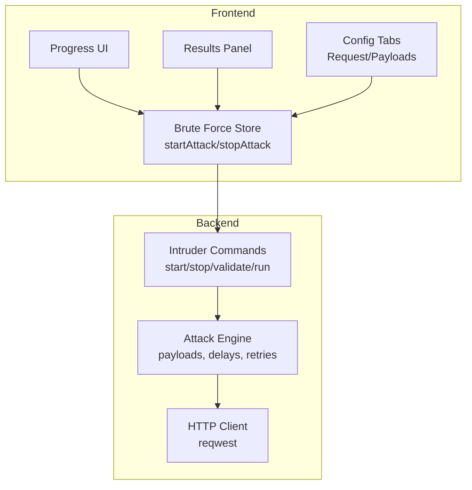
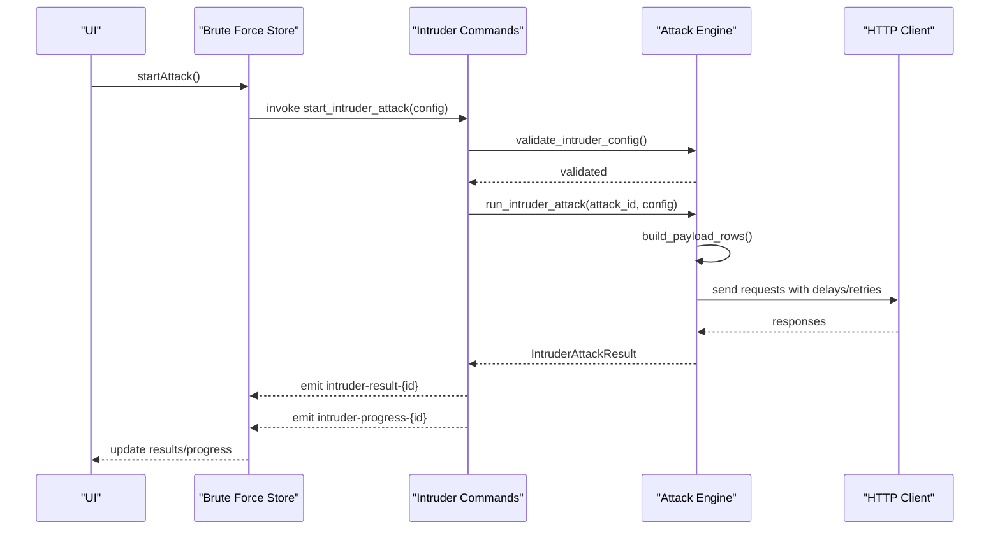
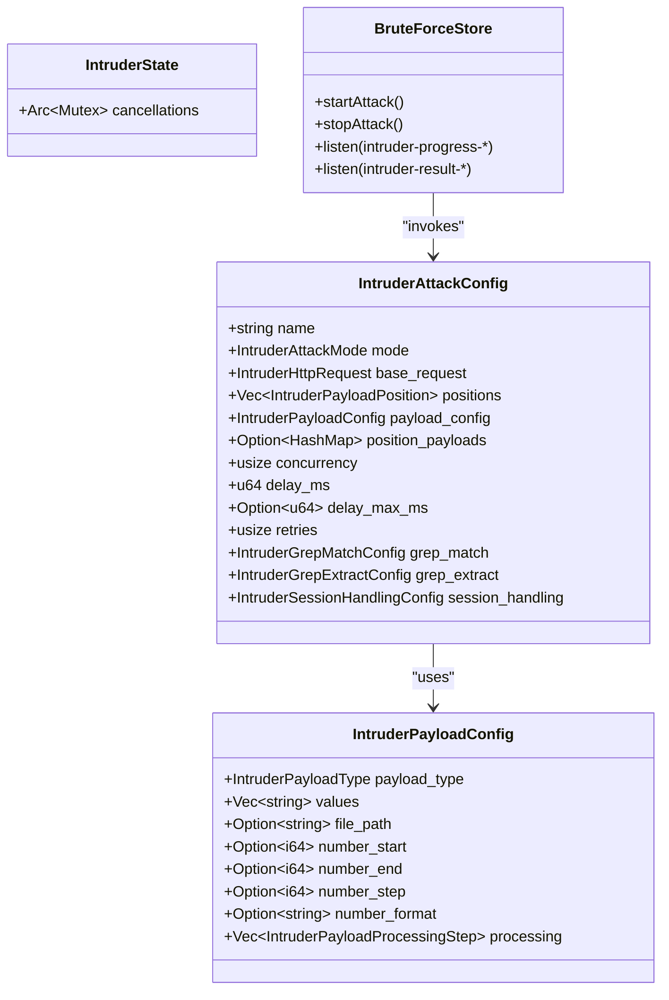

# Intruder Commands

<cite>
**Referenced Files in This Document**
- [intruder.rs](file://src-tauri/src/commands/intruder.rs)
- [bruto-force.ts](file://src/stores/bruto-force.ts)
- [types.ts](file://src/pages/brute-force/types.ts)
- [progress.tsx](file://src/pages/brute-force/components/progress.tsx)
- [results-panel.tsx](file://src/pages/brute-force/components/results-panel.tsx)
- [use-page.ts](file://src/pages/brute-force/hooks/use-page.ts)
- [payloads-tab.tsx](file://src/pages/brute-force/components/brute-force-config/config/payloads-tab.tsx)
- [request-tab.tsx](file://src/pages/brute-force/components/brute-force-config/config/request-tab.tsx)
- [payload-preset-dialog.tsx](file://src/pages/brute-force/components/payload-preset-dialog.tsx)
- [predefined-payloads.ts](file://src/pages/brute-force/data/predefined-payloads.ts)
- [utils.ts](file://src/pages/brute-force/lib/utils.ts)
</cite>

## Table of Contents
1. [Introduction](#introduction)
2. [Project Structure](#project-structure)
3. [Core Components](#core-components)
4. [Architecture Overview](#architecture-overview)
5. [Detailed Component Analysis](#detailed-component-analysis)
6. [Dependency Analysis](#dependency-analysis)
7. [Performance Considerations](#performance-considerations)
8. [Troubleshooting Guide](#troubleshooting-guide)
9. [Conclusion](#conclusion)
10. [Appendices](#appendices)

## Introduction
This document explains AppRecon’s Intruder command handlers that power brute force attacks. It covers the attack lifecycle, configuration management, payload handling, result retrieval, progress tracking, concurrency control, and resource allocation. It also includes practical examples, performance optimization tips, rate limiting guidance, and ethical considerations for responsible security testing.

## Project Structure
The Intruder feature spans Rust backend commands, frontend stores and UI components, and predefined payload datasets. The backend defines attack models, validates configurations, executes concurrent requests, and emits progress and results. The frontend manages UI state, listens to events, and renders results.

**Diagram sources**
- [bruto-force.ts:338-436](file://src/stores/bruto-force.ts#L338-L436)
- [intruder.rs:164-345](file://src-tauri/src/commands/intruder.rs#L164-L345)

**Section sources**
- [bruto-force.ts:142-470](file://src/stores/bruto-force.ts#L142-L470)
- [intruder.rs:159-190](file://src-tauri/src/commands/intruder.rs#L159-L190)

## Core Components
- Backend Intruder Commands: define attack configuration models, validate inputs, spawn asynchronous attacks, enforce cancellation, and emit progress/results.
- Frontend Store: orchestrates Tauri invocations, listens to events, tracks attack state, and updates UI.
- UI Components: configure attack modes, payload sources, request templates, and display results and progress.
- Payload Management: support lists, runtime files, number ranges, and processing steps (encoding, hashing).
- Result Analysis: grep-based matching/extraction and session token handling.

**Section sources**
- [intruder.rs:15-140](file://src-tauri/src/commands/intruder.rs#L15-L140)
- [types.ts:3-102](file://src/pages/brute-force/types.ts#L3-L102)
- [bruto-force.ts:338-436](file://src/stores/bruto-force.ts#L338-L436)

## Architecture Overview
The Intruder subsystem follows a publish-subscribe pattern:
- Frontend invokes backend commands via Tauri.
- Backend validates configuration, spawns a Tokio task, and runs the attack loop.
- Results and progress are emitted as events keyed by attack ID.
- Frontend listens to events and updates state.

**Diagram sources**
- [bruto-force.ts:338-400](file://src/stores/bruto-force.ts#L338-L400)
- [intruder.rs:164-345](file://src-tauri/src/commands/intruder.rs#L164-L345)

## Detailed Component Analysis

### Backend Intruder Commands
- Attack configuration models define modes, payload types, positions, concurrency, delays, retries, and grep/session handling.
- Validation ensures a base URL, payload markers, valid ranges, and populated payloads.
- Attack runner enforces concurrency limits, applies delays, retries on failure, and emits progress and results.
- Cancellation uses an atomic flag per attack ID stored in shared state.

Key backend APIs:
- start_intruder_attack: validates config, assigns attack ID, spawns async task, registers cancellation flag.
- stop_intruder_attack: triggers cancellation by setting atomic flag.
- validate_intruder_config: checks URL, markers, position ranges, and payload sources.
- run_intruder_attack: builds payload rows, sets up HTTP client, concurrency semaphore, and loops over payloads.
- send_intruder_request: retry loop with delay, request building, response parsing, grep matching/extraction, and session token extraction.
- Payload builders: generate rows for Sniper, BatteringRam, Pitchfork, and ClusterBomb modes.

Concurrency and resource control:
- Concurrency clamp: 1–200 threads.
- Per-request delay with optional jitter based on index.
- Retry attempts configurable per request.
- Redirect policy respects follow_redirects and max_hops.

Cancellation:
- Atomic flag per attack ID allows cooperative cancellation during iteration and request sending.

**Section sources**
- [intruder.rs:159-190](file://src-tauri/src/commands/intruder.rs#L159-L190)
- [intruder.rs:209-240](file://src-tauri/src/commands/intruder.rs#L209-L240)
- [intruder.rs:242-345](file://src-tauri/src/commands/intruder.rs#L242-L345)
- [intruder.rs:361-402](file://src-tauri/src/commands/intruder.rs#L361-L402)
- [intruder.rs:503-571](file://src-tauri/src/commands/intruder.rs#L503-L571)
- [intruder.rs:664-743](file://src-tauri/src/commands/intruder.rs#L664-L743)

### Frontend Store and UI Integration
- Store exposes startAttack/stopAttack, listens to intruder-progress and intruder-result events, and maintains per-tab state (results, progress, selected result).
- UI components render progress bars, results tables, and configuration panels.
- Page hook coordinates request parsing, payload position discovery, and start validation.

Key store behaviors:
- startAttack: invokes backend, sets attackId, clears previous results, registers listeners, and updates tab state.
- stopAttack: invokes backend stop command and cleans up listeners.
- Progress and results listeners update tab progress and results arrays.

UI components:
- Progress bar displays current/total and percentage.
- Results panel shows status badges, lengths, and response times; supports filtering and selection.
- Config tabs manage request editing and payload assignment per position.

**Section sources**
- [bruto-force.ts:338-436](file://src/stores/bruto-force.ts#L338-L436)
- [progress.tsx:5-33](file://src/pages/brute-force/components/progress.tsx#L5-L33)
- [results-panel.tsx:8-92](file://src/pages/brute-force/components/results-panel.tsx#L8-L92)
- [use-page.ts:11-126](file://src/pages/brute-force/hooks/use-page.ts#L11-L126)

### Attack Configuration Management
- AttackConfig includes name, mode, base_request, positions, payload_config, position_payloads, concurrency, delay_ms, delay_max_ms, retries, grep_match, grep_extract, and session_handling.
- PayloadConfig supports SimpleList, RuntimeFile, NumberRange, and processing steps (URL encode/decode, Base64 encode/decode, MD5, SHA1, SHA256).
- PositionPayloads enable per-position payload sources aligned by index.

Frontend helpers:
- createDefaultAttackConfig and createDefaultPayloadConfig provide sensible defaults.
- syncPositionPayloads ensures position_payloads keys align with positions.
- findRequestPayloadPositions discovers payload markers in request fields.

**Section sources**
- [types.ts:62-141](file://src/pages/brute-force/types.ts#L62-L141)
- [types.ts:32-41](file://src/pages/brute-force/types.ts#L32-L41)
- [types.ts:151-164](file://src/pages/brute-force/types.ts#L151-L164)
- [types.ts:196-246](file://src/pages/brute-force/types.ts#L196-L246)

### Payload Management
- SimpleList: newline-separated values.
- RuntimeFile: reads file contents into values.
- NumberRange: generates numeric sequences with step and optional padding/format.
- Processing steps transform payloads before injection.

Frontend payload UI:
- NumberRange editor validates ranges and previews values.
- Text editor for SimpleList with preset loading and file upload.
- Preset dialog enumerates categories and payloads bundled with the app.

**Section sources**
- [intruder.rs:503-550](file://src-tauri/src/commands/intruder.rs#L503-L550)
- [payloads-tab.tsx:138-312](file://src/pages/brute-force/components/brute-force-config/config/payloads-tab.tsx#L138-L312)
- [payloads-tab.tsx:314-452](file://src/pages/brute-force/components/brute-force-config/config/payloads-tab.tsx#L314-L452)
- [payload-preset-dialog.tsx:30-197](file://src/pages/brute-force/components/payload-preset-dialog.tsx#L30-L197)
- [predefined-payloads.ts:1-48](file://src/pages/brute-force/data/predefined-payloads.ts#L1-L48)

### Attack Result Retrieval and Progress Tracking
- Results include status, response length/time, error, response metadata, and grep match/extraction.
- Progress events carry Update with current/total counts and Complete when finished.
- Frontend aggregates results, updates progress, and renders status badges.

**Section sources**
- [types.ts:84-102](file://src/pages/brute-force/types.ts#L84-L102)
- [intruder.rs:111-116](file://src-tauri/src/commands/intruder.rs#L111-L116)
- [results-panel.tsx:38-86](file://src/pages/brute-force/components/results-panel.tsx#L38-L86)
- [utils.ts:13-34](file://src/pages/brute-force/lib/utils.ts#L13-L34)

### Attack Lifecycle Management
- Start: validate config, assign attack ID, spawn task, register cancellation.
- Run: build payload rows, iterate with concurrency control, apply delays, send requests, handle retries.
- Emit: progress updates and results per payload.
- Stop: set cancellation flag; task removes itself from cancellations on exit.
- Cleanup: listeners removed when stopping or closing tabs.

**Section sources**
- [intruder.rs:164-190](file://src-tauri/src/commands/intruder.rs#L164-L190)
- [intruder.rs:242-345](file://src-tauri/src/commands/intruder.rs#L242-L345)
- [bruto-force.ts:418-436](file://src/stores/bruto-force.ts#L418-L436)

### Concurrency Control and Resource Allocation
- Concurrency clamp: 1–200 workers.
- Semaphore controls concurrent request sends.
- Delay per request with optional jitter based on index.
- Redirect policy respects follow_redirects and max_hops.
- Retry loop with fixed backoff between attempts.

**Section sources**
- [intruder.rs:267](file://src-tauri/src/commands/intruder.rs#L267)
- [intruder.rs:347-359](file://src-tauri/src/commands/intruder.rs#L347-L359)
- [intruder.rs:371-388](file://src-tauri/src/commands/intruder.rs#L371-L388)

### Attack Result Analysis, Success/Failure Detection, and Reporting
- Grep matching: case-sensitive or insensitive keyword search in response body.
- Grep extraction: regex capture groups with optional replacement.
- Session handling: extract token from response and inject into subsequent requests.
- Reporting: results include status, response length/time, final URL, headers, and body.

**Section sources**
- [types.ts:43-60](file://src/pages/brute-force/types.ts#L43-L60)
- [intruder.rs:812-822](file://src-tauri/src/commands/intruder.rs#L812-L822)
- [intruder.rs:824-839](file://src-tauri/src/commands/intruder.rs#L824-L839)
- [intruder.rs:841-868](file://src-tauri/src/commands/intruder.rs#L841-L868)

### Examples

#### Attack Configuration Example
- Name: “Test Attack”
- Mode: Sniper
- Base request: GET https://example.test/login?u=§user§&p=§pass§ with headers and body placeholders.
- Positions: two markers for user and pass.
- Payloads: per-position lists or a single list applied to all positions.
- Concurrency: 10
- Delay: 100 ms base, optional jitter
- Retries: 0–2
- Grep match: enabled with keyword “success”
- Grep extract: regex to capture session token
- Session handling: enabled to extract token and inject into header

**Section sources**
- [types.ts:62-76](file://src/pages/brute-force/types.ts#L62-L76)
- [types.ts:104-141](file://src/pages/brute-force/types.ts#L104-L141)

#### Payload Setup Example
- SimpleList: admin, root, test
- RuntimeFile: load from a .txt file
- NumberRange: start 1, end 100, step 1, format “{:03}” for zero-padded values
- Processing: URL encode, Base64 encode, SHA256 hash

**Section sources**
- [payloads-tab.tsx:242-289](file://src/pages/brute-force/components/brute-force-config/config/payloads-tab.tsx#L242-L289)
- [payloads-tab.tsx:314-412](file://src/pages/brute-force/components/brute-force-config/config/payloads-tab.tsx#L314-L412)
- [intruder.rs:631-662](file://src-tauri/src/commands/intruder.rs#L631-L662)

#### Result Interpretation Example
- Status: 200 OK
- Response length: 1234 bytes
- Response time: 120 ms
- Final URL: https://example.test/login?u=admin&p=pass
- Grep match: true
- Grep extracted: session-token-value
- Error: null

**Section sources**
- [types.ts:84-102](file://src/pages/brute-force/types.ts#L84-L102)
- [results-panel.tsx:57-77](file://src/pages/brute-force/components/results-panel.tsx#L57-L77)

## Dependency Analysis

**Diagram sources**
- [intruder.rs:93-109](file://src-tauri/src/commands/intruder.rs#L93-L109)
- [intruder.rs:49-58](file://src-tauri/src/commands/intruder.rs#L49-L58)
- [intruder.rs:159-162](file://src-tauri/src/commands/intruder.rs#L159-L162)
- [bruto-force.ts:338-436](file://src/stores/bruto-force.ts#L338-L436)

**Section sources**
- [intruder.rs:93-109](file://src-tauri/src/commands/intruder.rs#L93-L109)
- [bruto-force.ts:338-436](file://src/stores/bruto-force.ts#L338-L436)

## Performance Considerations
- Concurrency: Tune concurrency to balance throughput and server impact. Start low (e.g., 10–20) and increase gradually.
- Delays: Use base delay plus optional jitter to avoid bursty traffic. Consider exponential backoff for retries.
- Payload size: Limit large number ranges and file payloads to manageable sizes.
- Redirects: Reduce max hops and disable redirects if not needed to cut overhead.
- Grep operations: Keep regex patterns efficient; avoid overly broad patterns.
- Memory: Monitor memory growth with large result sets; consider periodic clearing.

[No sources needed since this section provides general guidance]

## Troubleshooting Guide
Common issues and resolutions:
- Invalid configuration: Ensure base URL is present, payload markers exist, and payloads are assigned to each marked position.
- No results: Verify concurrency and delay settings; confirm network connectivity and target availability.
- Stuck progress: Check cancellation flag; ensure stop command is invoked and listeners cleaned up.
- Large payloads: Reduce concurrency or payload count; consider file-based payloads instead of large inline lists.
- Rate limiting: Increase delays or reduce concurrency; implement adaptive pacing based on server responses.

**Section sources**
- [bruto-force.ts:418-436](file://src/stores/bruto-force.ts#L418-L436)
- [intruder.rs:209-240](file://src-tauri/src/commands/intruder.rs#L209-L240)

## Conclusion
AppRecon’s Intruder subsystem provides a robust, event-driven framework for brute force attacks. The backend enforces validation, concurrency, and cancellation, while the frontend offers intuitive configuration and real-time feedback. By tuning concurrency, delays, and payload sources, teams can effectively test applications while respecting ethical guidelines and operational constraints.

[No sources needed since this section summarizes without analyzing specific files]

## Appendices

### Attack Modes and Payload Generation
- Sniper: Injects payloads into each marked position independently.
- BatteringRam: Applies the same payload to all positions.
- Pitchfork: Aligns payloads across positions by index.
- ClusterBomb: Generates cross-product combinations across positions.

**Section sources**
- [intruder.rs:664-743](file://src-tauri/src/commands/intruder.rs#L664-L743)

### Request Editing and Payload Positioning
- Use the Request tab to paste raw requests and mark payload positions with § markers.
- The system auto-detects positions and synchronizes per-position payload configs.

**Section sources**
- [request-tab.tsx:18-126](file://src/pages/brute-force/components/brute-force-config/config/request-tab.tsx#L18-L126)
- [types.ts:196-246](file://src/pages/brute-force/types.ts#L196-L246)

### Preset Payloads and Categories
- Predefined payloads are loaded from the payload directory and categorized for quick selection.
- Use the preset dialog to browse and apply payloads to positions.

**Section sources**
- [predefined-payloads.ts:9-48](file://src/pages/brute-force/data/predefined-payloads.ts#L9-L48)
- [payload-preset-dialog.tsx:30-197](file://src/pages/brute-force/components/payload-preset-dialog.tsx#L30-L197)