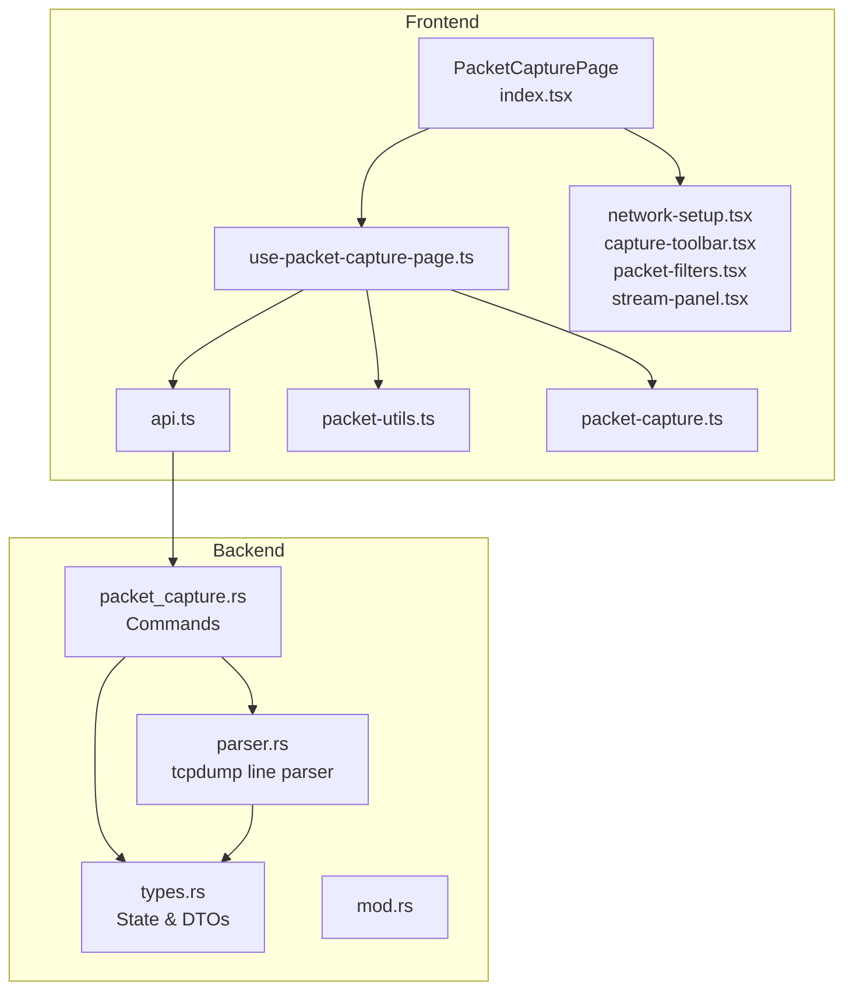
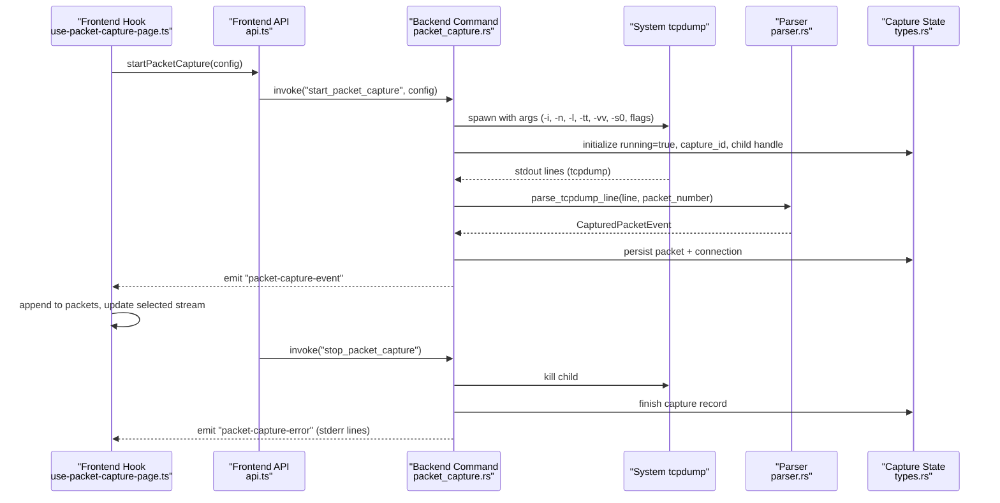
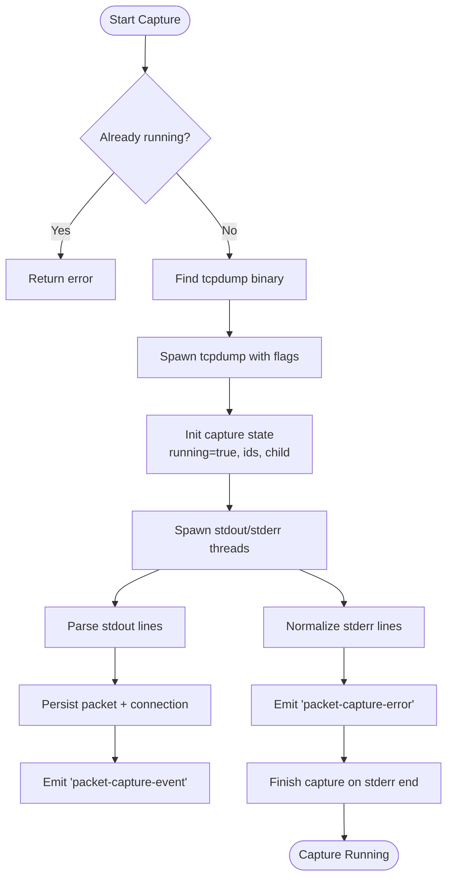
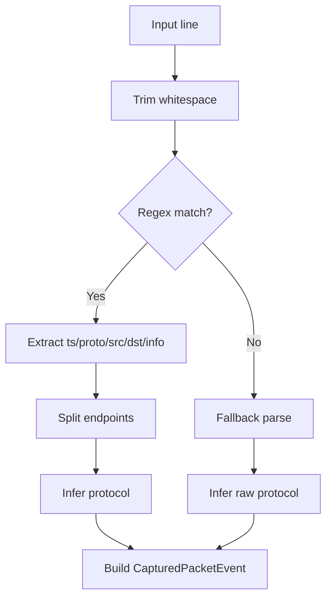
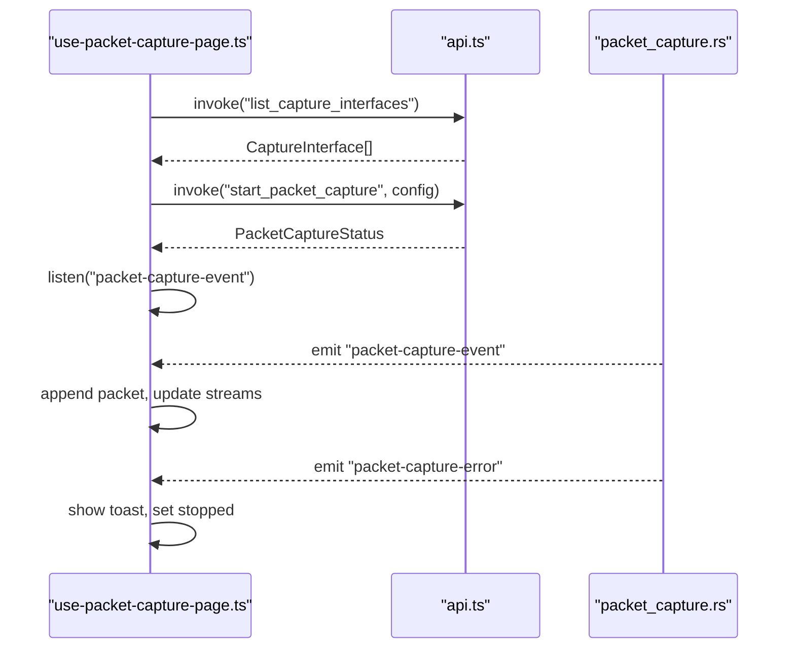
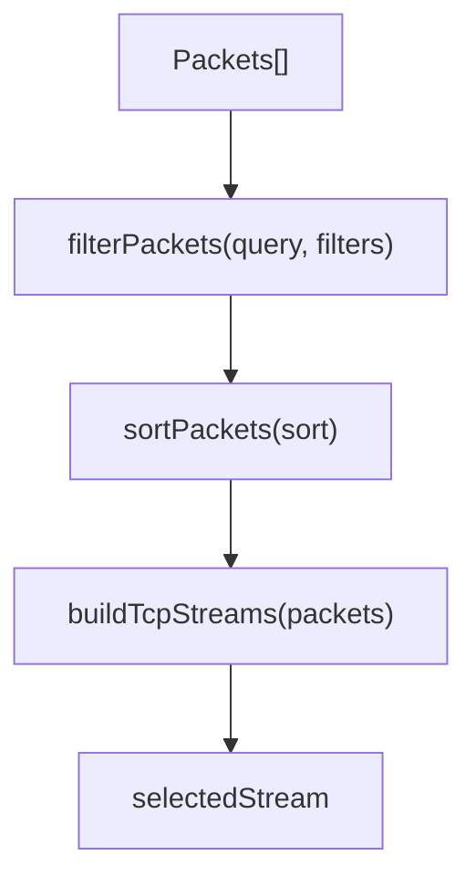
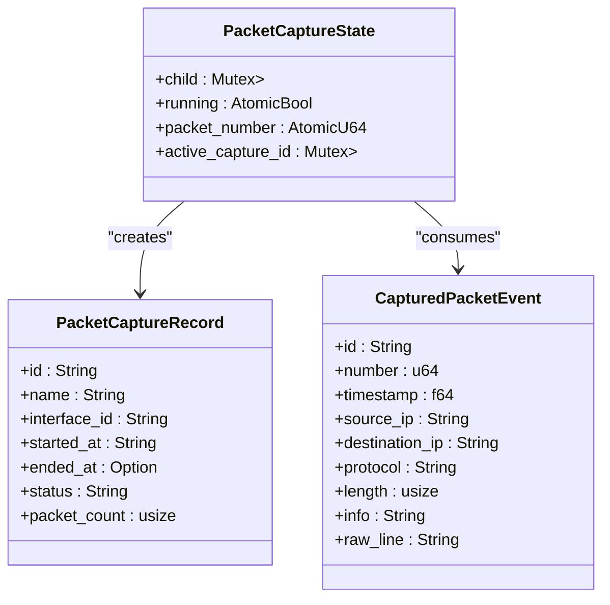
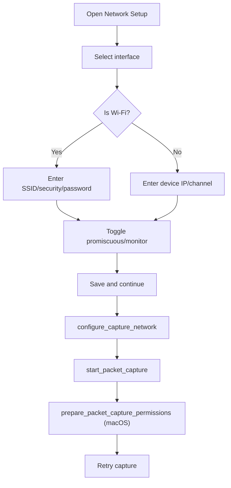
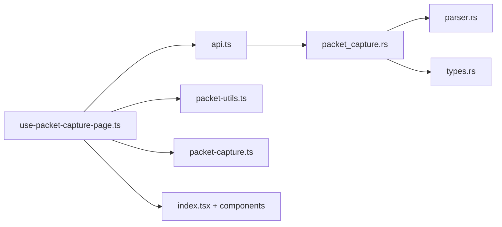

# Packet Capture Commands

<cite>
**Referenced Files in This Document**
- [packet_capture.rs](file://src-tauri/src/commands/packet_capture.rs)
- [types.rs](file://src-tauri/src/packet_capture/types.rs)
- [parser.rs](file://src-tauri/src/packet_capture/parser.rs)
- [mod.rs](file://src-tauri/src/packet_capture/mod.rs)
- [api.ts](file://src/pages/packet-capture/api.ts)
- [types.ts](file://src/pages/packet-capture/types.ts)
- [index.tsx](file://src/pages/packet-capture/index.tsx)
- [use-packet-capture-page.ts](file://src/pages/packet-capture/hooks/use-packet-capture-page.ts)
- [packet-utils.ts](file://src/pages/packet-capture/lib/packet-utils.ts)
- [constants.ts](file://src/pages/packet-capture/constants.ts)
- [network-setup.tsx](file://src/pages/packet-capture/components/network-setup.tsx)
- [capture-toolbar.tsx](file://src/pages/packet-capture/components/capture-toolbar.tsx)
- [packet-filters.tsx](file://src/pages/packet-capture/components/packet-filters.tsx)
- [stream-panel.tsx](file://src/pages/packet-capture/components/stream-panel.tsx)
- [packet-capture.ts](file://src/stores/packet-capture.ts)
- [fix-packet-capture-permissions.sh](file://scripts/fix-packet-capture-permissions.sh)
</cite>

## Table of Contents
1. [Introduction](#introduction)
2. [Project Structure](#project-structure)
3. [Core Components](#core-components)
4. [Architecture Overview](#architecture-overview)
5. [Detailed Component Analysis](#detailed-component-analysis)
6. [Dependency Analysis](#dependency-analysis)
7. [Performance Considerations](#performance-considerations)
8. [Troubleshooting Guide](#troubleshooting-guide)
9. [Conclusion](#conclusion)
10. [Appendices](#appendices)

## Introduction
This document explains AppRecon’s packet capture command handlers and the end-to-end capture pipeline. It covers network interface discovery and configuration, real-time capture control, packet parsing and filtering, stream reconstruction, and session export. It also addresses capture state management, buffer handling, performance optimization, protocol parsing integration, and practical troubleshooting for permissions and throughput.

## Project Structure
The packet capture feature spans Tauri backend commands, Rust parsers, and a React frontend with typed APIs and utilities.

**Diagram sources**
- [index.tsx:1-137](file://src/pages/packet-capture/index.tsx#L1-L137)
- [use-packet-capture-page.ts:1-539](file://src/pages/packet-capture/hooks/use-packet-capture-page.ts#L1-L539)
- [api.ts:1-108](file://src/pages/packet-capture/api.ts#L1-L108)
- [packet_utils.ts:1-161](file://src/pages/packet-capture/lib/packet-utils.ts#L1-L161)
- [packet-capture.ts:1-33](file://src/stores/packet-capture.ts#L1-L33)
- [packet_capture.rs:1-547](file://src-tauri/src/commands/packet_capture.rs#L1-L547)
- [types.rs:1-114](file://src-tauri/src/packet_capture/types.rs#L1-L114)
- [parser.rs:1-164](file://src-tauri/src/packet_capture/parser.rs#L1-L164)
- [mod.rs:1-6](file://src-tauri/src/packet_capture/mod.rs#L1-L6)

**Section sources**
- [index.tsx:1-137](file://src/pages/packet-capture/index.tsx#L1-L137)
- [packet_capture.rs:1-547](file://src-tauri/src/commands/packet_capture.rs#L1-L547)

## Core Components
- Backend commands: list interfaces, configure Wi-Fi, start/stop capture, get status, paginated packet retrieval, and permission preparation.
- Parser: converts tcpdump lines into structured events and infers protocols.
- Frontend API bindings: typed invocations for commands and event listeners.
- Utilities: filtering, sorting, stream reconstruction, hex/ASCII rendering, and session export.
- State: capture lifecycle, active capture ID, and counters.

**Section sources**
- [packet_capture.rs:30-333](file://src-tauri/src/commands/packet_capture.rs#L30-L333)
- [parser.rs:4-164](file://src-tauri/src/packet_capture/parser.rs#L4-L164)
- [api.ts:71-107](file://src/pages/packet-capture/api.ts#L71-L107)
- [packet-utils.ts:40-161](file://src/pages/packet-capture/lib/packet-utils.ts#L40-L161)
- [types.rs:3-9](file://src-tauri/src/packet_capture/types.rs#L3-L9)

## Architecture Overview
The capture pipeline runs tcpdump via a backend command, parses each line into a structured event, persists it, and emits it to the UI. The frontend listens for events, updates state, and renders filtered/sorted packets and reconstructed streams.

**Diagram sources**
- [packet_capture.rs:149-284](file://src-tauri/src/commands/packet_capture.rs#L149-L284)
- [parser.rs:4-73](file://src-tauri/src/packet_capture/parser.rs#L4-L73)
- [types.rs:3-9](file://src-tauri/src/packet_capture/types.rs#L3-L9)
- [use-packet-capture-page.ts:84-114](file://src/pages/packet-capture/hooks/use-packet-capture-page.ts#L84-L114)

## Detailed Component Analysis

### Backend Commands: Network Interfaces and Capture Control
- List capture interfaces: enumerates tcpdump devices, enriches with IP addresses and Wi-Fi/loopback detection.
- Configure capture network: sets Wi-Fi SSID/password on macOS via system tools.
- Start packet capture: spawns tcpdump with flags, reads stdout/stderr in threads, emits events, persists packets, and tracks state.
- Stop packet capture: signals stop, kills child process, finishes capture record.
- Get status: returns running flag and active capture ID.
- Paginated packets: fetches stored packet summaries for a capture.

**Diagram sources**
- [packet_capture.rs:149-284](file://src-tauri/src/commands/packet_capture.rs#L149-L284)
- [packet_capture.rs:345-410](file://src-tauri/src/commands/packet_capture.rs#L345-L410)

**Section sources**
- [packet_capture.rs:48-97](file://src-tauri/src/commands/packet_capture.rs#L48-L97)
- [packet_capture.rs:99-147](file://src-tauri/src/commands/packet_capture.rs#L99-L147)
- [packet_capture.rs:149-284](file://src-tauri/src/commands/packet_capture.rs#L149-L284)
- [packet_capture.rs:286-333](file://src-tauri/src/commands/packet_capture.rs#L286-L333)
- [packet_capture.rs:335-343](file://src-tauri/src/commands/packet_capture.rs#L335-L343)

### Parser: Protocol Inference and Event Construction
- Parses tcpdump lines into a normalized event with timestamp, endpoints, protocol, length, and raw line.
- Infers protocol from tcpdump base protocol, ports, and flags.
- Provides fallback inference for raw lines and length extraction.

**Diagram sources**
- [parser.rs:4-73](file://src-tauri/src/packet_capture/parser.rs#L4-L73)
- [parser.rs:87-149](file://src-tauri/src/packet_capture/parser.rs#L87-L149)

**Section sources**
- [parser.rs:4-164](file://src-tauri/src/packet_capture/parser.rs#L4-L164)

### Frontend API Bindings and Event Handling
- Typed wrappers for commands and paginated packet retrieval.
- Event listeners for live capture events and errors.
- Permission error detection and user feedback.

**Diagram sources**
- [api.ts:71-107](file://src/pages/packet-capture/api.ts#L71-L107)
- [use-packet-capture-page.ts:84-114](file://src/pages/packet-capture/hooks/use-packet-capture-page.ts#L84-L114)
- [packet_capture.rs:234-277](file://src-tauri/src/commands/packet_capture.rs#L234-L277)

**Section sources**
- [api.ts:1-108](file://src/pages/packet-capture/api.ts#L1-L108)
- [use-packet-capture-page.ts:84-114](file://src/pages/packet-capture/hooks/use-packet-capture-page.ts#L84-L114)

### Packet Filtering, Sorting, and Stream Reconstruction
- Filtering supports query and protocol/IP/port/method/host/url/status/content-type.
- Sorting by numeric or string keys.
- Stream reconstruction groups packets by bidirectional TCP tuple and concatenates payloads.

**Diagram sources**
- [packet-utils.ts:40-130](file://src/pages/packet-capture/lib/packet-utils.ts#L40-L130)

**Section sources**
- [packet-utils.ts:40-161](file://src/pages/packet-capture/lib/packet-utils.ts#L40-L161)

### Capture State Management and Buffer Handling
- Atomic counters and mutex-protected handles track running state, packet number, and child process.
- Events are appended to a capped list in memory for live viewing.
- Relative timestamps are computed from the first packet.

**Diagram sources**
- [types.rs:3-9](file://src-tauri/src/packet_capture/types.rs#L3-L9)
- [types.rs:46-107](file://src-tauri/src/packet_capture/types.rs#L46-L107)

**Section sources**
- [types.rs:3-9](file://src-tauri/src/packet_capture/types.rs#L3-L9)
- [use-packet-capture-page.ts:90-99](file://src/pages/packet-capture/hooks/use-packet-capture-page.ts#L90-L99)

### Network Setup and Permissions
- Network setup screen collects interface, Wi-Fi credentials, and capture options.
- On macOS, permission fixing invokes a helper to adjust BPF device permissions.
- Permission errors are detected and surfaced to the user.

**Diagram sources**
- [network-setup.tsx:26-242](file://src/pages/packet-capture/components/network-setup.tsx#L26-L242)
- [packet_capture.rs:30-46](file://src-tauri/src/commands/packet_capture.rs#L30-L46)
- [use-packet-capture-page.ts:173-181](file://src/pages/packet-capture/hooks/use-packet-capture-page.ts#L173-L181)

**Section sources**
- [network-setup.tsx:1-268](file://src/pages/packet-capture/components/network-setup.tsx#L1-L268)
- [packet_capture.rs:30-46](file://src-tauri/src/commands/packet_capture.rs#L30-L46)
- [use-packet-capture-page.ts:173-181](file://src/pages/packet-capture/hooks/use-packet-capture-page.ts#L173-L181)

### Packet Export and Session Management
- Live session export to a JSON format suitable for sharing.
- Future PCAP/PCAPNG export is noted as pending native serialization.
- Sample session loading is available for demonstration.

**Section sources**
- [packet-utils.ts:132-140](file://src/pages/packet-capture/lib/packet-utils.ts#L132-L140)
- [use-packet-capture-page.ts:324-334](file://src/pages/packet-capture/hooks/use-packet-capture-page.ts#L324-L334)
- [constants.ts:40-250](file://src/pages/packet-capture/constants.ts#L40-L250)

## Dependency Analysis
- Frontend depends on typed backend commands and event channels.
- Backend depends on tcpdump availability and OS-specific tools for Wi-Fi configuration and permissions.
- Parser depends on regex parsing and protocol heuristics.
- State is shared via Tauri state and atomic/mutex primitives.

**Diagram sources**
- [use-packet-capture-page.ts:1-539](file://src/pages/packet-capture/hooks/use-packet-capture-page.ts#L1-L539)
- [api.ts:1-108](file://src/pages/packet-capture/api.ts#L1-L108)
- [packet_capture.rs:1-547](file://src-tauri/src/commands/packet_capture.rs#L1-L547)
- [parser.rs:1-164](file://src-tauri/src/packet_capture/parser.rs#L1-L164)
- [types.rs:1-114](file://src-tauri/src/packet_capture/types.rs#L1-L114)
- [packet-utils.ts:1-161](file://src/pages/packet-capture/lib/packet-utils.ts#L1-L161)
- [packet-capture.ts:1-33](file://src/stores/packet-capture.ts#L1-L33)
- [index.tsx:1-137](file://src/pages/packet-capture/index.tsx#L1-L137)

**Section sources**
- [use-packet-capture-page.ts:1-539](file://src/pages/packet-capture/hooks/use-packet-capture-page.ts#L1-L539)
- [packet_capture.rs:1-547](file://src-tauri/src/commands/packet_capture.rs#L1-L547)

## Performance Considerations
- tcpdump flags: -n disables reverse DNS lookups, -l flushes per line, -tt prints epoch timestamps, -vv increases verbosity, -s0 captures full packets.
- Atomic counters and minimal allocations in parser reduce overhead.
- Frontend caps live packet list to a recent window to limit memory growth.
- Stream reconstruction aggregates TCP segments; consider limiting concurrent streams for very high-throughput scenarios.
- On macOS, ensure BPF permissions are set to avoid repeated failures and retries.

[No sources needed since this section provides general guidance]

## Troubleshooting Guide
Common issues and resolutions:
- Permission denied to capture: use the permission fix action to adjust BPF device permissions on macOS. The frontend detects permission-related errors and surfaces a “Fix Permissions” action.
- tcpdump not found: ensure tcpdump is installed and available on PATH; the backend checks for the binary before starting capture.
- Wi-Fi credential configuration: macOS-only; SSID and password are applied via system tools during network configuration.
- Capture already running: the backend prevents overlapping captures; stop the current capture before starting a new one.
- High CPU/memory usage: reduce verbosity, disable monitor mode if unnecessary, and consider filtering packets in the UI to limit live render volume.

**Section sources**
- [packet_capture.rs:30-46](file://src-tauri/src/commands/packet_capture.rs#L30-L46)
- [packet_capture.rs:159-162](file://src-tauri/src/commands/packet_capture.rs#L159-L162)
- [packet_capture.rs:155-157](file://src-tauri/src/commands/packet_capture.rs#L155-L157)
- [use-packet-capture-page.ts:380-383](file://src/pages/packet-capture/hooks/use-packet-capture-page.ts#L380-L383)

## Conclusion
AppRecon’s packet capture integrates a robust backend command pipeline with a flexible frontend UI. The system supports interface enumeration, Wi-Fi configuration, real-time capture, filtering, stream reconstruction, and session export. By tuning capture flags, managing permissions, and leveraging frontend filtering, users can achieve reliable and efficient packet inspection across diverse environments.

[No sources needed since this section summarizes without analyzing specific files]

## Appendices

### Example Workflows

- Configure Wi-Fi capture:
  - Select Wi-Fi interface, enter SSID and security mode, optionally provide password or enterprise credentials, then save and continue.
  - Start capture; if permission errors occur, use the “Fix Permissions” action.

- Start real-time capture:
  - Choose interface, apply promiscuous/monitor options, and start capture.
  - Observe live packets and streams; use filters to narrow focus.

- Export session:
  - Save a JSON session of the current capture for later analysis or sharing.

**Section sources**
- [network-setup.tsx:26-242](file://src/pages/packet-capture/components/network-setup.tsx#L26-L242)
- [capture-toolbar.tsx:1-95](file://src/pages/packet-capture/components/capture-toolbar.tsx#L1-L95)
- [packet-utils.ts:132-140](file://src/pages/packet-capture/lib/packet-utils.ts#L132-L140)

### Capture Configuration Reference
- Interface selection: choose from discovered interfaces; Wi-Fi interfaces support SSID and channel configuration.
- Capture options: promiscuous mode and monitor mode toggles; monitor mode is Wi-Fi-only.
- Wi-Fi credentials: SSID, security mode, username/password, and optional BSSID.

**Section sources**
- [types.ts:7-18](file://src/pages/packet-capture/types.ts#L7-L18)
- [network-setup.tsx:100-184](file://src/pages/packet-capture/components/network-setup.tsx#L100-L184)

### Filter Reference
- Query: free-text search across packet fields.
- Protocol: filter by HTTP, TLS, TCP, UDP, DNS, ARP, ICMP, 802.11, OTHER.
- IP and ports: filter by source/destination IP and port.
- HTTP fields: method, host, URL, status code, content type.

**Section sources**
- [packet-filters.tsx:14-52](file://src/pages/packet-capture/components/packet-filters.tsx#L14-L52)
- [packet-utils.ts:40-82](file://src/pages/packet-capture/lib/packet-utils.ts#L40-L82)

### Permissions and Limitations
- macOS: automatic BPF permission fix is supported; Wi-Fi credential configuration is macOS-only.
- Linux/BSD: ensure appropriate privileges and tcpdump availability; monitor/promiscuous modes depend on platform support.
- Throughput: adjust tcpdump flags and UI filters to balance fidelity and performance.

**Section sources**
- [packet_capture.rs:30-46](file://src-tauri/src/commands/packet_capture.rs#L30-L46)
- [packet_capture.rs:115-146](file://src-tauri/src/commands/packet_capture.rs#L115-L146)