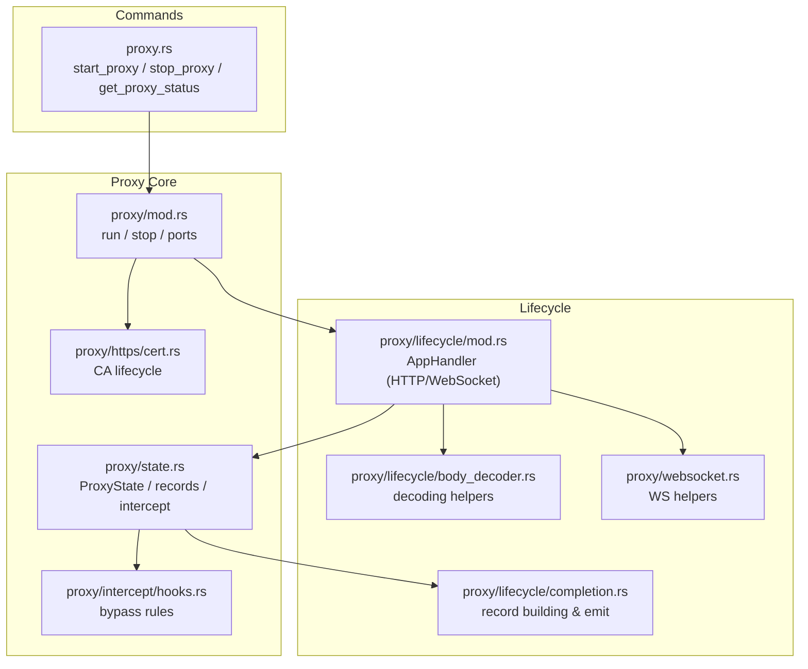
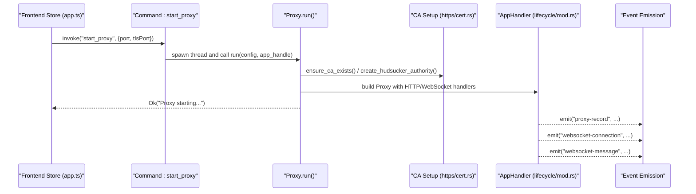
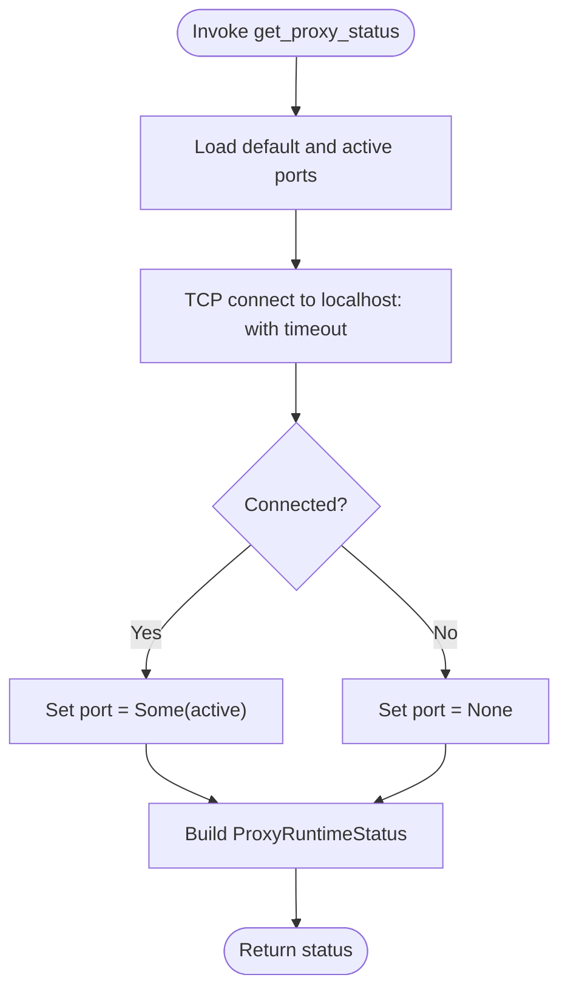
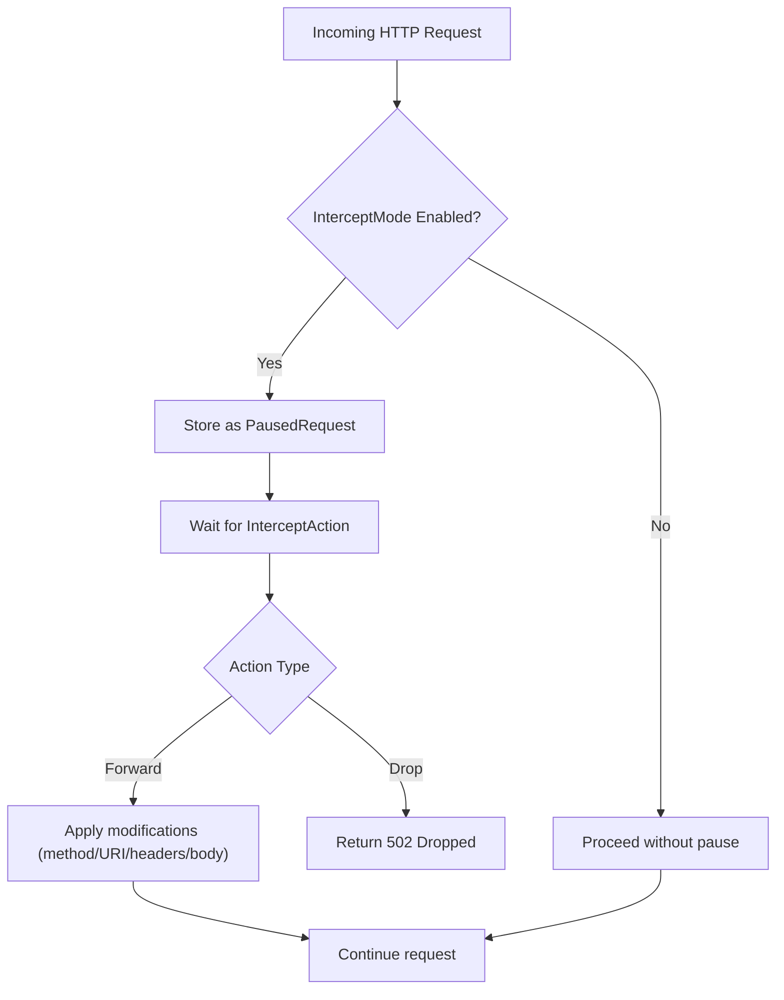
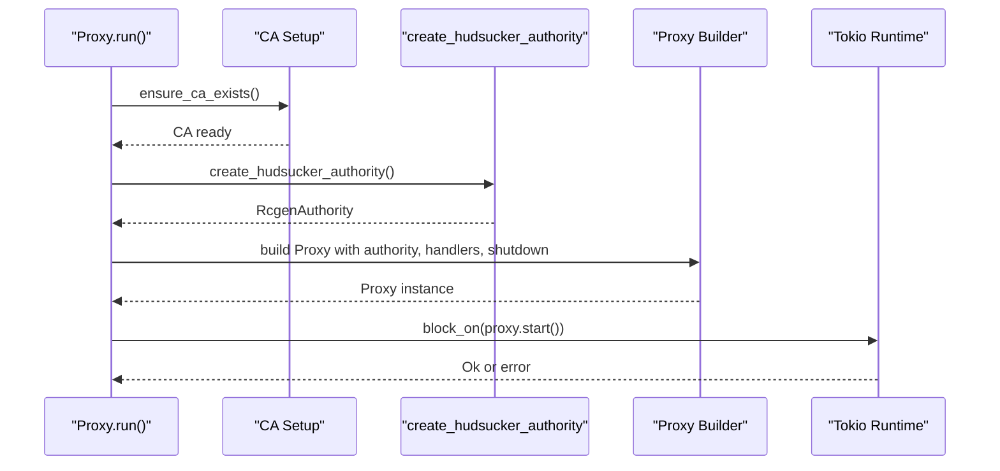
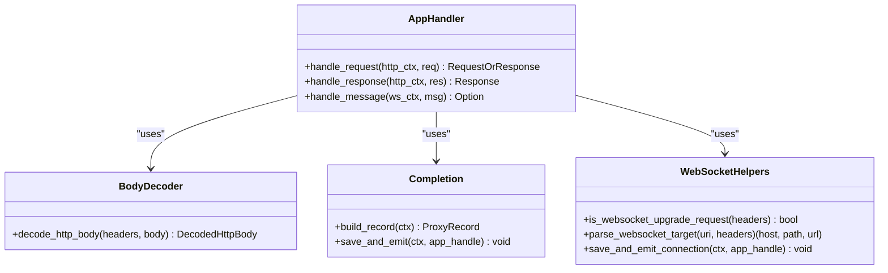
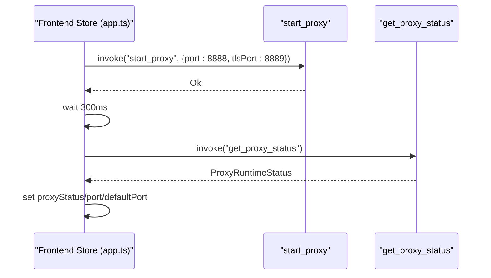
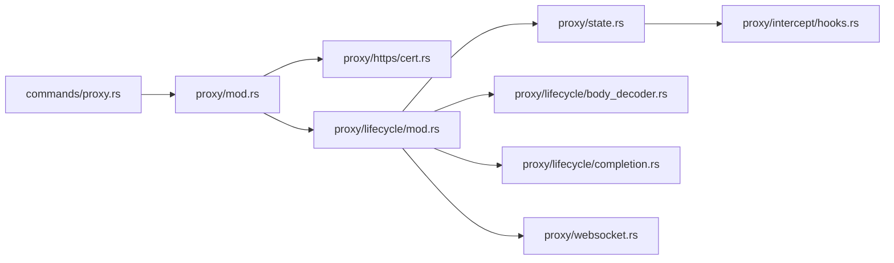

# Proxy Commands

<cite>
**Referenced Files in This Document**
- [proxy.rs](file://src-tauri/src/commands/proxy.rs)
- [mod.rs (proxy)](file://src-tauri/src/proxy/mod.rs)
- [state.rs](file://src-tauri/src/proxy/state.rs)
- [lifecycle/mod.rs](file://src-tauri/src/proxy/lifecycle/mod.rs)
- [lifecycle/body_decoder.rs](file://src-tauri/src/proxy/lifecycle/body_decoder.rs)
- [lifecycle/completion.rs](file://src-tauri/src/proxy/lifecycle/completion.rs)
- [websocket.rs](file://src-tauri/src/proxy/websocket.rs)
- [https/cert.rs](file://src-tauri/src/proxy/https/cert.rs)
- [intercept/hooks.rs](file://src-tauri/src/proxy/intercept/hooks.rs)
- [app.ts](file://src/stores/app.ts)
</cite>

## Table of Contents
1. [Introduction](#introduction)
2. [Project Structure](#project-structure)
3. [Core Components](#core-components)
4. [Architecture Overview](#architecture-overview)
5. [Detailed Component Analysis](#detailed-component-analysis)
6. [Dependency Analysis](#dependency-analysis)
7. [Performance Considerations](#performance-considerations)
8. [Troubleshooting Guide](#troubleshooting-guide)
9. [Conclusion](#conclusion)
10. [Appendices](#appendices)

## Introduction
This document describes the proxy command handlers in AppRecon, focusing on the control commands to start, stop, and query the proxy runtime, along with proxy configuration management, state management, and traffic interception. It explains how the proxy integrates with the MITM engine, manages certificates, and emits events for HTTP and WebSocket traffic. Practical usage examples, error handling patterns, and state synchronization between the frontend and backend are included.

## Project Structure
The proxy command handlers reside in the Tauri backend under the commands module and delegate to the proxy subsystem. The proxy subsystem orchestrates lifecycle handling, TLS/CA generation, body decoding, and event emission.

**Diagram sources**
- [proxy.rs:1-74](file://src-tauri/src/commands/proxy.rs#L1-L74)
- [mod.rs (proxy):1-188](file://src-tauri/src/proxy/mod.rs#L1-L188)
- [state.rs:1-441](file://src-tauri/src/proxy/state.rs#L1-L441)
- [lifecycle/mod.rs:1-453](file://src-tauri/src/proxy/lifecycle/mod.rs#L1-L453)
- [lifecycle/body_decoder.rs:1-418](file://src-tauri/src/proxy/lifecycle/body_decoder.rs#L1-L418)
- [lifecycle/completion.rs:1-118](file://src-tauri/src/proxy/lifecycle/completion.rs#L1-L118)
- [websocket.rs:1-187](file://src-tauri/src/proxy/websocket.rs#L1-L187)
- [https/cert.rs:1-144](file://src-tauri/src/proxy/https/cert.rs#L1-L144)
- [intercept/hooks.rs:1-21](file://src-tauri/src/proxy/intercept/hooks.rs#L1-L21)

**Section sources**
- [proxy.rs:1-74](file://src-tauri/src/commands/proxy.rs#L1-L74)
- [mod.rs (proxy):1-188](file://src-tauri/src/proxy/mod.rs#L1-L188)

## Core Components
- Proxy runtime control commands:
  - start_proxy(app, port, tls_port): Starts the proxy in a background thread, initializes CA, and builds the Hudsucker proxy with graceful shutdown support.
  - stop_proxy(): Signals the proxy to shut down gracefully and clears runtime state.
  - get_proxy_status(): Returns a runtime status object indicating whether the proxy is running, active port, default port, and connection count placeholder.
- Proxy configuration:
  - ProxyConfig: Holds port, reuse flag, and TLS port.
  - Default ports: HTTP default port and HTTPS MITM default port are stored atomically.
- State management:
  - ProxyState: Thread-safe in-memory store for intercepted transactions, pause queues, intercept mode, and bypass patterns.
  - InterceptMode: Enabled or Disabled.
  - PausedRequest and InterceptAction: Support for pausing requests and forwarding/dropping them later.
- Lifecycle and interception:
  - AppHandler implements HTTP and WebSocket handlers, captures request/response bodies, decodes content, and emits events.
  - BodyDecoder: Handles chunked transfer decoding and content-encoding decoding (gzip, br, deflate, zstd).
  - Completion: Builds ProxyRecord, persists to history bridge, emits events, logs request bodies.
  - WebSocket helpers: Detects upgrades, parses targets, tracks connections/messages, and emits events.
- Certificate management:
  - CA directory initialization and persistence.
  - Load or generate CA, export PEM, create Hudsucker authority, and ensure CA exists before starting the proxy.

**Section sources**
- [proxy.rs:7-74](file://src-tauri/src/commands/proxy.rs#L7-L74)
- [mod.rs (proxy):26-188](file://src-tauri/src/proxy/mod.rs#L26-L188)
- [state.rs:7-441](file://src-tauri/src/proxy/state.rs#L7-L441)
- [lifecycle/mod.rs:88-360](file://src-tauri/src/proxy/lifecycle/mod.rs#L88-L360)
- [lifecycle/body_decoder.rs:24-90](file://src-tauri/src/proxy/lifecycle/body_decoder.rs#L24-L90)
- [lifecycle/completion.rs:10-76](file://src-tauri/src/proxy/lifecycle/completion.rs#L10-L76)
- [websocket.rs:9-149](file://src-tauri/src/proxy/websocket.rs#L9-L149)
- [https/cert.rs:11-144](file://src-tauri/src/proxy/https/cert.rs#L11-L144)

## Architecture Overview
The proxy command handlers act as the entry points for proxy lifecycle control. They delegate to the proxy core, which sets up the MITM environment, registers handlers, and starts the Hudsucker proxy. The lifecycle module handles HTTP and WebSocket traffic, decodes bodies, and emits events. State is maintained in memory and synchronized via events to the frontend.

**Diagram sources**
- [proxy.rs:15-52](file://src-tauri/src/commands/proxy.rs#L15-L52)
- [mod.rs (proxy):93-187](file://src-tauri/src/proxy/mod.rs#L93-L187)
- [https/cert.rs:131-143](file://src-tauri/src/proxy/https/cert.rs#L131-L143)
- [lifecycle/mod.rs:131-156](file://src-tauri/src/proxy/lifecycle/mod.rs#L131-L156)
- [lifecycle/completion.rs:66-76](file://src-tauri/src/proxy/lifecycle/completion.rs#L66-L76)
- [websocket.rs:57-59](file://src-tauri/src/proxy/websocket.rs#L57-L59)

## Detailed Component Analysis

### Command Signatures and Behavior
- start_proxy(app, port, tls_port)
  - Parameters:
    - app: Tauri AppHandle
    - port: u16 (HTTP)
    - tls_port: u16 (HTTPS MITM)
  - Behavior:
    - Logs invocation to a temporary log file.
    - Spawns a background thread to call run with a ProxyConfig containing port, reuse=true, tls_port.
    - Returns a success message indicating ports.
  - Validation:
    - Port resolution enforces uniqueness via ensure_port_free and stores the active port atomically.
  - Response:
    - String success message.
- stop_proxy()
  - Behavior:
    - Calls proxy::stop which sends a shutdown signal via oneshot channel and clears runtime state.
  - Response:
    - String success message.
- get_proxy_status()
  - Behavior:
    - Reads default and active ports.
    - Attempts a local TCP connect to the active or default port to detect if the proxy is running.
    - Returns a ProxyRuntimeStatus object with running flag, active port (if running), default port, and a connections placeholder.
  - Response:
    - ProxyRuntimeStatus object.

**Diagram sources**
- [proxy.rs:61-73](file://src-tauri/src/commands/proxy.rs#L61-L73)

**Section sources**
- [proxy.rs:15-73](file://src-tauri/src/commands/proxy.rs#L15-L73)
- [mod.rs (proxy):40-81](file://src-tauri/src/proxy/mod.rs#L40-L81)

### Proxy State Management and Interception
- ProxyState maintains:
  - Records: vector of ProxyRecord entries.
  - InterceptMode: Enabled or Disabled.
  - PausedRequests: pending requests awaiting action.
  - PausedActions: mapping of paused request ID to InterceptAction (Forward or Drop).
  - InterceptBypassPatterns: URI patterns to bypass interception.
- Intercept flow:
  - When enabled, incoming HTTP requests are captured, paused, and stored as PausedRequest.
  - The handler waits until the frontend or controller resolves the pause by setting an InterceptAction.
  - Actions:
    - Drop: returns a 502 response with a drop message.
    - Forward(Some(modified)): updates method, URI, headers, and body from the modification.
  - Bypass logic:
    - Certain captive portal URIs are bypassed automatically.
    - Additional patterns can be configured via ProxyState bypass lists.

**Diagram sources**
- [lifecycle/mod.rs:182-266](file://src-tauri/src/proxy/lifecycle/mod.rs#L182-L266)
- [state.rs:193-295](file://src-tauri/src/proxy/state.rs#L193-L295)
- [intercept/hooks.rs:12-20](file://src-tauri/src/proxy/intercept/hooks.rs#L12-L20)

**Section sources**
- [state.rs:176-441](file://src-tauri/src/proxy/state.rs#L176-L441)
- [lifecycle/mod.rs:88-360](file://src-tauri/src/proxy/lifecycle/mod.rs#L88-L360)
- [intercept/hooks.rs:1-21](file://src-tauri/src/proxy/intercept/hooks.rs#L1-L21)

### MITM Proxy Integration and Certificate Management
- CA lifecycle:
  - CA directory initialized under app data.
  - On startup, ensure_ca_exists checks for CA files and regenerates if missing.
  - Export and load PEMs for the CA; create Hudsucker authority from the CA key pair.
- Proxy builder:
  - Uses Proxy::builder with address binding, CA authority, Rustls connector, HTTP/WebSocket handlers, and graceful shutdown.
- TLS handling:
  - HTTPS MITM uses the generated CA to sign certificates dynamically for upstream hosts.

**Diagram sources**
- [mod.rs (proxy):93-187](file://src-tauri/src/proxy/mod.rs#L93-L187)
- [https/cert.rs:131-143](file://src-tauri/src/proxy/https/cert.rs#L131-L143)
- [https/cert.rs:106-118](file://src-tauri/src/proxy/https/cert.rs#L106-L118)

**Section sources**
- [https/cert.rs:11-144](file://src-tauri/src/proxy/https/cert.rs#L11-L144)
- [mod.rs (proxy):93-187](file://src-tauri/src/proxy/mod.rs#L93-L187)

### Traffic Interception and Event Emission
- HTTP lifecycle:
  - AppHandler captures request headers and body, decodes content, optionally pauses for interception, and forwards to upstream.
  - On response, captures response headers and body, decodes content, and saves/emit a ProxyRecord.
- WebSocket lifecycle:
  - Detects upgrade requests, parses target (host/path/url), tracks connection state, and emits connection/message events.
  - Tracks message direction (inbound/outbound), type (text/binary/ping/pong/close), and payload.

**Diagram sources**
- [lifecycle/mod.rs:88-360](file://src-tauri/src/proxy/lifecycle/mod.rs#L88-L360)
- [lifecycle/body_decoder.rs:24-90](file://src-tauri/src/proxy/lifecycle/body_decoder.rs#L24-L90)
- [lifecycle/completion.rs:10-76](file://src-tauri/src/proxy/lifecycle/completion.rs#L10-L76)
- [websocket.rs:9-149](file://src-tauri/src/proxy/websocket.rs#L9-L149)

**Section sources**
- [lifecycle/mod.rs:88-360](file://src-tauri/src/proxy/lifecycle/mod.rs#L88-L360)
- [lifecycle/body_decoder.rs:24-90](file://src-tauri/src/proxy/lifecycle/body_decoder.rs#L24-L90)
- [lifecycle/completion.rs:35-76](file://src-tauri/src/proxy/lifecycle/completion.rs#L35-L76)
- [websocket.rs:27-94](file://src-tauri/src/proxy/websocket.rs#L27-L94)

### Frontend State Synchronization Example
- The frontend store invokes start_proxy with default ports, waits briefly, then queries get_proxy_status to update UI state (starting, connected, disconnected) and ports.

**Diagram sources**
- [app.ts:38-57](file://src/stores/app.ts#L38-L57)
- [proxy.rs:15-73](file://src-tauri/src/commands/proxy.rs#L15-L73)

**Section sources**
- [app.ts:38-57](file://src/stores/app.ts#L38-L57)
- [proxy.rs:15-73](file://src-tauri/src/commands/proxy.rs#L15-L73)

## Dependency Analysis
- Commands depend on proxy core for runtime control and status.
- Proxy core depends on:
  - HTTPS certificate module for CA setup.
  - Lifecycle handlers for HTTP/WebSocket processing.
  - State module for intercept and record management.
- Lifecycle handlers depend on:
  - BodyDecoder for content decoding.
  - WebSocket helpers for WS detection and parsing.
  - Completion for saving and emitting records.

**Diagram sources**
- [proxy.rs:1-74](file://src-tauri/src/commands/proxy.rs#L1-L74)
- [mod.rs (proxy):1-188](file://src-tauri/src/proxy/mod.rs#L1-L188)
- [https/cert.rs:1-144](file://src-tauri/src/proxy/https/cert.rs#L1-L144)
- [lifecycle/mod.rs:1-453](file://src-tauri/src/proxy/lifecycle/mod.rs#L1-L453)
- [state.rs:1-441](file://src-tauri/src/proxy/state.rs#L1-L441)
- [lifecycle/body_decoder.rs:1-418](file://src-tauri/src/proxy/lifecycle/body_decoder.rs#L1-L418)
- [lifecycle/completion.rs:1-118](file://src-tauri/src/proxy/lifecycle/completion.rs#L1-L118)
- [websocket.rs:1-187](file://src-tauri/src/proxy/websocket.rs#L1-L187)
- [intercept/hooks.rs:1-21](file://src-tauri/src/proxy/intercept/hooks.rs#L1-L21)

**Section sources**
- [proxy.rs:1-74](file://src-tauri/src/commands/proxy.rs#L1-L74)
- [mod.rs (proxy):1-188](file://src-tauri/src/proxy/mod.rs#L1-L188)

## Performance Considerations
- Port selection and reuse:
  - Ports are validated and enforced to avoid conflicts; reuse allows binding to the same port if permitted by the OS.
- Body decoding:
  - Chunked transfer decoding and content-encoding decoding occur per request/response; avoid unnecessary re-decoding by relying on metadata.
- Event emission:
  - Frequent events (proxy-record, websocket-connection, websocket-message) can impact UI responsiveness; throttle or batch if needed.
- Graceful shutdown:
  - One-shot channel ensures clean termination; avoid blocking operations during shutdown to minimize latency.

[No sources needed since this section provides general guidance]

## Troubleshooting Guide
- Proxy fails to start:
  - Verify ports are free and not in use; check ensure_port_free behavior and default_proxy_port storage.
  - Confirm CA files exist or regeneration succeeded; review ensure_ca_exists logs.
- Proxy appears not running:
  - Use get_proxy_status to confirm local TCP connectivity to the active or default port.
  - Check for early runtime errors during Proxy::builder or runtime creation.
- Interception not working:
  - Ensure InterceptMode is Enabled and no bypass patterns match the URI.
  - Confirm paused requests are resolved; unresolved pauses will block requests indefinitely.
- WebSocket issues:
  - Validate upgrade headers and handshake status; inspect WS connection and message events for mismatches.
- Logging:
  - Temporary log writes in start_proxy and lifecycle handlers provide visibility into execution flow.

**Section sources**
- [proxy.rs:15-73](file://src-tauri/src/commands/proxy.rs#L15-L73)
- [mod.rs (proxy):93-187](file://src-tauri/src/proxy/mod.rs#L93-L187)
- [https/cert.rs:131-143](file://src-tauri/src/proxy/https/cert.rs#L131-L143)
- [lifecycle/mod.rs:88-360](file://src-tauri/src/proxy/lifecycle/mod.rs#L88-L360)
- [websocket.rs:27-94](file://src-tauri/src/proxy/websocket.rs#L27-L94)

## Conclusion
The proxy command handlers provide a robust interface for controlling the proxy lifecycle, managing runtime configuration, and synchronizing state with the frontend. The MITM integration, certificate management, and traffic interception pipeline are tightly coupled with state and event-driven mechanisms to deliver a comprehensive proxy experience. Following the usage patterns and troubleshooting tips outlined here will help ensure reliable operation and effective debugging.

[No sources needed since this section summarizes without analyzing specific files]

## Appendices

### Command Reference Summary
- start_proxy(app, port, tls_port)
  - Purpose: Start the proxy with HTTP and HTTPS MITM.
  - Parameters: port (HTTP), tls_port (HTTPS), app handle.
  - Response: String success message.
- stop_proxy()
  - Purpose: Stop the proxy gracefully.
  - Response: String success message.
- get_proxy_status()
  - Purpose: Query runtime status.
  - Response: ProxyRuntimeStatus with running flag, active port, default port, and connections placeholder.

**Section sources**
- [proxy.rs:15-73](file://src-tauri/src/commands/proxy.rs#L15-L73)