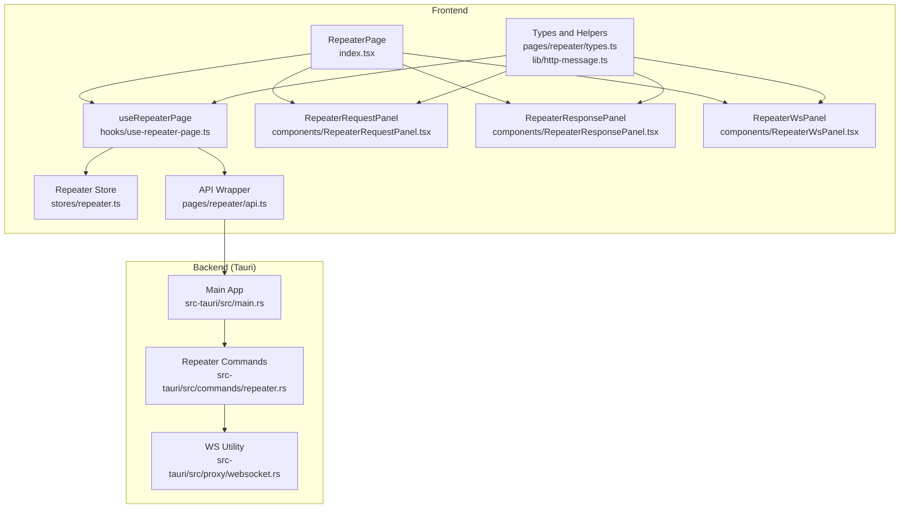
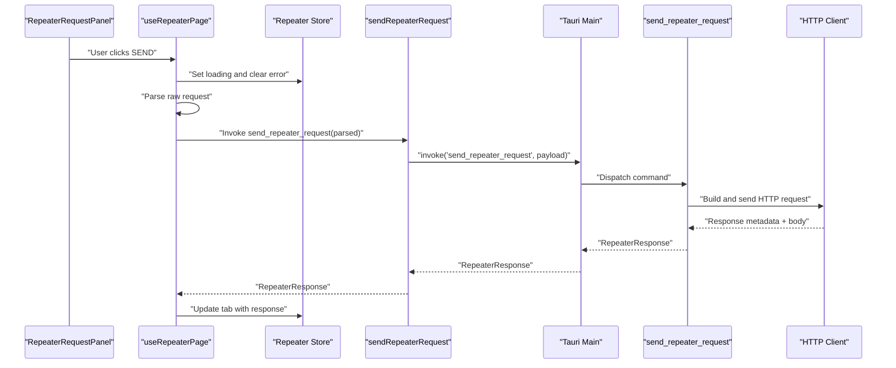
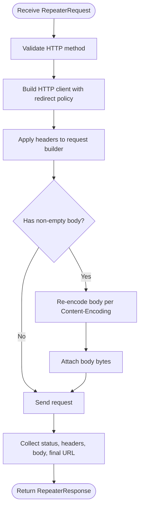
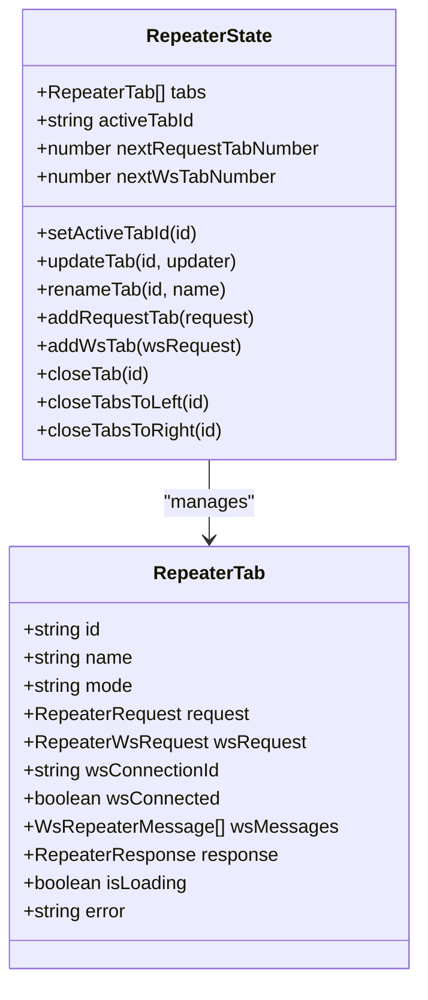
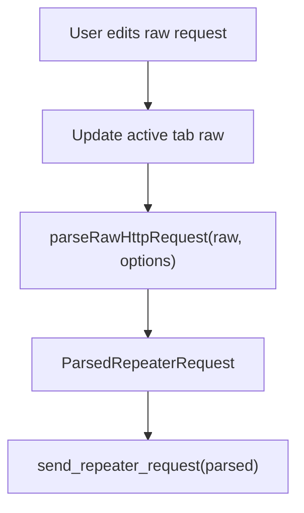
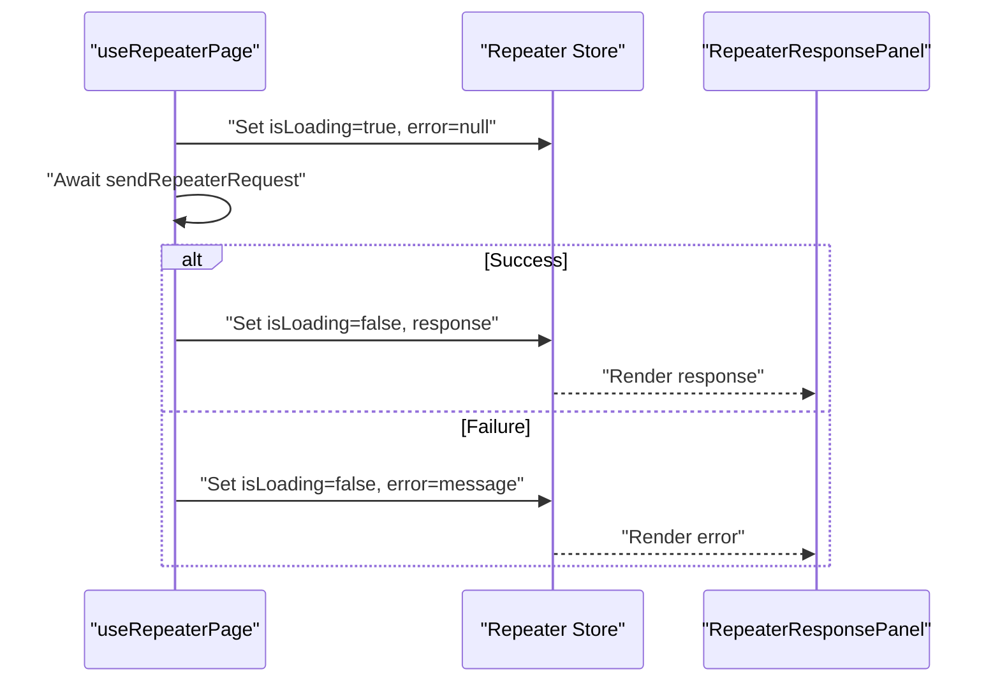
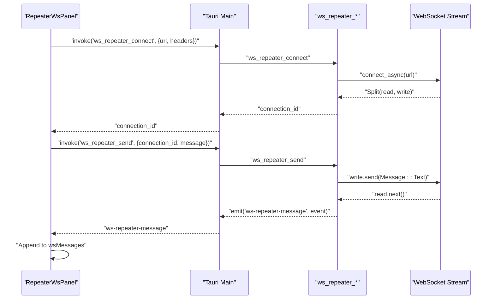
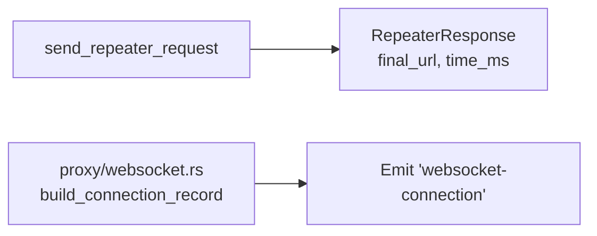
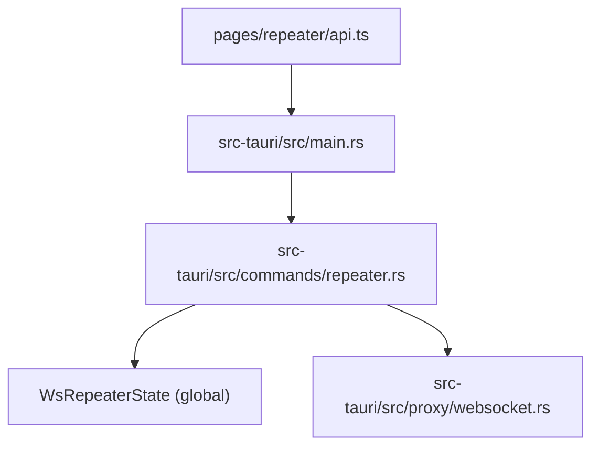

# Repeater Commands

<cite>
**Referenced Files in This Document**
- [src/pages/repeater/index.tsx](file://src/pages/repeater/index.tsx)
- [src/pages/repeater/hooks/use-repeater-page.ts](file://src/pages/repeater/hooks/use-repeater-page.ts)
- [src/pages/repeater/api.ts](file://src/pages/repeater/api.ts)
- [src/pages/repeater/types.ts](file://src/pages/repeater/types.ts)
- [src/pages/repeater/components/RepeaterRequestPanel.tsx](file://src/pages/repeater/components/RepeaterRequestPanel.tsx)
- [src/pages/repeater/components/RepeaterResponsePanel.tsx](file://src/pages/repeater/components/RepeaterResponsePanel.tsx)
- [src/pages/repeater/components/RepeaterWsPanel.tsx](file://src/pages/repeater/components/RepeaterWsPanel.tsx)
- [src/stores/repeater.ts](file://src/stores/repeater.ts)
- [src/lib/http-message.ts](file://src/lib/http-message.ts)
- [src-tauri/src/commands/repeater.rs](file://src-tauri/src/commands/repeater.rs)
- [src-tauri/src/proxy/websocket.rs](file://src-tauri/src/proxy/websocket.rs)
- [src-tauri/src/main.rs](file://src-tauri/src/main.rs)
</cite>

## Table of Contents
1. [Introduction](#introduction)
2. [Project Structure](#project-structure)
3. [Core Components](#core-components)
4. [Architecture Overview](#architecture-overview)
5. [Detailed Component Analysis](#detailed-component-analysis)
6. [Dependency Analysis](#dependency-analysis)
7. [Performance Considerations](#performance-considerations)
8. [Troubleshooting Guide](#troubleshooting-guide)
9. [Conclusion](#conclusion)

## Introduction
This document explains AppRecon’s Repeater command handlers and related UI flows. It covers:
- Request replay commands and templates
- Header editing and payload customization
- Repeater state management and sessions
- Response tracking and error handling
- WebSocket repeater functionality and real-time messaging
- Example workflows and best practices
- Performance and concurrency considerations

## Project Structure
The Repeater feature spans frontend React components and Zustand store, a thin API wrapper, and backend Tauri commands implemented in Rust. WebSocket handling integrates with both the repeater and the proxy pipeline.

**Diagram sources**
- [src/pages/repeater/index.tsx:14-74](file://src/pages/repeater/index.tsx#L14-L74)
- [src/pages/repeater/hooks/use-repeater-page.ts:7-102](file://src/pages/repeater/hooks/use-repeater-page.ts#L7-L102)
- [src/stores/repeater.ts:43-165](file://src/stores/repeater.ts#L43-L165)
- [src/pages/repeater/api.ts:1-8](file://src/pages/repeater/api.ts#L1-L8)
- [src/pages/repeater/types.ts:1-127](file://src/pages/repeater/types.ts#L1-L127)
- [src/pages/repeater/components/RepeaterRequestPanel.tsx:1-53](file://src/pages/repeater/components/RepeaterRequestPanel.tsx#L1-L53)
- [src/pages/repeater/components/RepeaterResponsePanel.tsx:1-115](file://src/pages/repeater/components/RepeaterResponsePanel.tsx#L1-L115)
- [src/pages/repeater/components/RepeaterWsPanel.tsx:1-267](file://src/pages/repeater/components/RepeaterWsPanel.tsx#L1-L267)
- [src-tauri/src/main.rs:71-139](file://src-tauri/src/main.rs#L71-L139)
- [src-tauri/src/commands/repeater.rs:30-259](file://src-tauri/src/commands/repeater.rs#L30-L259)
- [src-tauri/src/proxy/websocket.rs:1-187](file://src-tauri/src/proxy/websocket.rs#L1-L187)

**Section sources**
- [src/pages/repeater/index.tsx:14-74](file://src/pages/repeater/index.tsx#L14-L74)
- [src-tauri/src/main.rs:71-139](file://src-tauri/src/main.rs#L71-L139)

## Core Components
- Repeater store: Manages tabs, active tab, and persistence.
- Page hook: Orchestrates request parsing, sending, and response updates.
- API wrapper: Invokes backend commands via Tauri.
- UI panels: Request editor, response viewer, and WebSocket panel.
- Backend commands: HTTP request sender and WebSocket repeater controls.
- Utilities: HTTP message parsing/building helpers.

Key responsibilities:
- Frontend: Editable raw HTTP requests, send triggers, response rendering, and WebSocket messaging.
- Backend: HTTP request execution with redirects and timing, WebSocket connection lifecycle, and event emission.

**Section sources**
- [src/stores/repeater.ts:13-26](file://src/stores/repeater.ts#L13-L26)
- [src/pages/repeater/hooks/use-repeater-page.ts:7-102](file://src/pages/repeater/hooks/use-repeater-page.ts#L7-L102)
- [src/pages/repeater/api.ts:5-7](file://src/pages/repeater/api.ts#L5-L7)
- [src/pages/repeater/types.ts:3-53](file://src/pages/repeater/types.ts#L3-L53)
- [src-tauri/src/commands/repeater.rs:30-96](file://src-tauri/src/commands/repeater.rs#L30-L96)
- [src-tauri/src/commands/repeater.rs:117-259](file://src-tauri/src/commands/repeater.rs#L117-L259)

## Architecture Overview
The Repeater architecture separates concerns across UI, state, and backend command layers. Requests flow from the UI to the store and hook, then to the API wrapper and Tauri main process, where backend commands execute HTTP or WebSocket operations and emit events back to the UI.

**Diagram sources**
- [src/pages/repeater/components/RepeaterRequestPanel.tsx:25-32](file://src/pages/repeater/components/RepeaterRequestPanel.tsx#L25-L32)
- [src/pages/repeater/hooks/use-repeater-page.ts:51-86](file://src/pages/repeater/hooks/use-repeater-page.ts#L51-L86)
- [src/pages/repeater/api.ts:5-7](file://src/pages/repeater/api.ts#L5-L7)
- [src-tauri/src/commands/repeater.rs:30-96](file://src-tauri/src/commands/repeater.rs#L30-L96)

## Detailed Component Analysis

### HTTP Repeater Command Handlers
- Command: send_repeater_request
  - Parses method, URL, headers, and body from the frontend payload.
  - Builds a redirect-limited HTTP client.
  - Applies headers and optional body encoding based on Content-Encoding.
  - Sends the request and captures status, headers, final URL, and body.
  - Returns a structured response with timing metrics.

**Diagram sources**
- [src-tauri/src/commands/repeater.rs:30-96](file://src-tauri/src/commands/repeater.rs#L30-L96)

**Section sources**
- [src-tauri/src/commands/repeater.rs:30-96](file://src-tauri/src/commands/repeater.rs#L30-L96)

### Repeater State Management and Templates
- Tabs and persistence:
  - The store maintains an array of tabs, active tab ID, and next tab numbering.
  - Persistence merges previous state and ensures active tab validity after reload.
- Template creation:
  - Default tab starts with a GET request to an example URL.
  - Tabs can be created from a raw request or WebSocket request.
  - Naming supports numeric HTTP tabs and “WS N” for WebSocket tabs.

**Diagram sources**
- [src/pages/repeater/types.ts:41-53](file://src/pages/repeater/types.ts#L41-L53)
- [src/stores/repeater.ts:13-26](file://src/stores/repeater.ts#L13-L26)

**Section sources**
- [src/stores/repeater.ts:43-165](file://src/stores/repeater.ts#L43-L165)
- [src/pages/repeater/types.ts:61-126](file://src/pages/repeater/types.ts#L61-L126)

### Request Modification and Payload Customization
- Raw request editing:
  - The request panel exposes a text editor for raw HTTP requests.
  - Changes propagate to the active tab via the page hook.
- Parsing and building:
  - parseRawHttpRequest extracts method, URL, headers, and body with fallbacks.
  - buildRawHttpRequest composes a canonical raw request string.
- Header editing:
  - Headers are represented as a record keyed by header name.
  - The HTTP helper normalizes and formats headers consistently.

**Diagram sources**
- [src/pages/repeater/components/RepeaterRequestPanel.tsx:35-48](file://src/pages/repeater/components/RepeaterRequestPanel.tsx#L35-L48)
- [src/pages/repeater/hooks/use-repeater-page.ts:41-49](file://src/pages/repeater/hooks/use-repeater-page.ts#L41-L49)
- [src/lib/http-message.ts:176-228](file://src/lib/http-message.ts#L176-L228)
- [src/pages/repeater/api.ts:5-7](file://src/pages/repeater/api.ts#L5-L7)

**Section sources**
- [src/pages/repeater/components/RepeaterRequestPanel.tsx:15-52](file://src/pages/repeater/components/RepeaterRequestPanel.tsx#L15-L52)
- [src/pages/repeater/hooks/use-repeater-page.ts:31-49](file://src/pages/repeater/hooks/use-repeater-page.ts#L31-L49)
- [src/lib/http-message.ts:158-228](file://src/lib/http-message.ts#L158-L228)

### Response Tracking and Error Handling
- Loading and error states:
  - The hook toggles isLoading and clears previous errors before sending.
  - On success, the response replaces the tab’s response; on failure, an error message is stored.
- Response panel:
  - Renders status badges, timing, and formatted raw response.
  - Handles loading and error views.

**Diagram sources**
- [src/pages/repeater/hooks/use-repeater-page.ts:51-86](file://src/pages/repeater/hooks/use-repeater-page.ts#L51-L86)
- [src/pages/repeater/components/RepeaterResponsePanel.tsx:38-85](file://src/pages/repeater/components/RepeaterResponsePanel.tsx#L38-L85)

**Section sources**
- [src/pages/repeater/hooks/use-repeater-page.ts:51-86](file://src/pages/repeater/hooks/use-repeater-page.ts#L51-L86)
- [src/pages/repeater/components/RepeaterResponsePanel.tsx:16-114](file://src/pages/repeater/components/RepeaterResponsePanel.tsx#L16-L114)

### WebSocket Repeater Functionality
- Connection lifecycle:
  - ws_repeater_connect upgrades URLs to ws/wss, establishes a stream, and spawns a task to handle inbound/outbound messages and cancellation.
  - ws_repeater_send enqueues a message to the connection’s outbound channel.
  - ws_repeater_disconnect removes the connection and signals cancellation.
- Real-time events:
  - Backend emits ws-repeater-message events with direction, type, payload, and timestamp.
  - The WS panel listens for these events and appends messages to the tab’s message list.
- UI controls:
  - Toggle switch manages connect/disconnect.
  - Message input sends text frames and logs outbound messages locally.

**Diagram sources**
- [src/pages/repeater/components/RepeaterWsPanel.tsx:81-118](file://src/pages/repeater/components/RepeaterWsPanel.tsx#L81-L118)
- [src-tauri/src/commands/repeater.rs:117-259](file://src-tauri/src/commands/repeater.rs#L117-L259)

**Section sources**
- [src-tauri/src/commands/repeater.rs:117-259](file://src-tauri/src/commands/repeater.rs#L117-L259)
- [src/pages/repeater/components/RepeaterWsPanel.tsx:40-267](file://src/pages/repeater/components/RepeaterWsPanel.tsx#L40-L267)

### Session Handling and History
- HTTP history:
  - The backend command returns final_url and timing, enabling downstream history storage and retrieval via the main process.
- WebSocket history:
  - WebSocket handshake and connection records are built and emitted by the proxy WebSocket utility, supporting history queries and persistence.

**Diagram sources**
- [src-tauri/src/commands/repeater.rs:88-95](file://src-tauri/src/commands/repeater.rs#L88-L95)
- [src-tauri/src/proxy/websocket.rs:62-94](file://src-tauri/src/proxy/websocket.rs#L62-L94)

**Section sources**
- [src-tauri/src/commands/repeater.rs:88-95](file://src-tauri/src/commands/repeater.rs#L88-L95)
- [src-tauri/src/proxy/websocket.rs:27-60](file://src-tauri/src/proxy/websocket.rs#L27-L60)

## Dependency Analysis
- Frontend-to-backend:
  - The API wrapper invokes Tauri commands registered in main.
  - The repeater commands module exports the HTTP and WebSocket handlers.
- Backend internals:
  - The WebSocket repeater state is managed globally and shared across commands.
  - The proxy WebSocket utility builds connection records and emits events consumed by the UI.

**Diagram sources**
- [src/pages/repeater/api.ts:5-7](file://src/pages/repeater/api.ts#L5-L7)
- [src-tauri/src/main.rs:100-103](file://src-tauri/src/main.rs#L100-L103)
- [src-tauri/src/commands/repeater.rs:104-106](file://src-tauri/src/commands/repeater.rs#L104-L106)
- [src-tauri/src/proxy/websocket.rs:1-187](file://src-tauri/src/proxy/websocket.rs#L1-187)

**Section sources**
- [src-tauri/src/main.rs:71-139](file://src-tauri/src/main.rs#L71-L139)
- [src-tauri/src/commands/mod.rs:1-9](file://src-tauri/src/commands/mod.rs#L1-L9)

## Performance Considerations
- HTTP request handling:
  - Redirect policy is limited to reduce excessive hops.
  - Body re-encoding respects Content-Encoding to avoid unnecessary transformations.
- WebSocket:
  - Separate tasks handle inbound reads and outbound writes with channels.
  - Cancellation tokens ensure cleanup on disconnect.
- UI rendering:
  - Minimal re-renders via callbacks and memoization in the page hook.
  - Large message lists are appended incrementally; autoscroll keeps the latest visible.

[No sources needed since this section provides general guidance]

## Troubleshooting Guide
- Common issues:
  - Invalid HTTP method: The backend validates the method and returns a descriptive error.
  - Failed to send request: Network or client build failures surface as errors.
  - WebSocket connection failed: URL scheme conversion and connection errors are reported.
  - Connection not found: Sending or disconnecting from a non-existent connection ID fails predictably.
- UI feedback:
  - Loading indicators during request send.
  - Error banners with messages for failures.
  - Close tab actions preserve at least one default tab.

**Section sources**
- [src-tauri/src/commands/repeater.rs:32-38](file://src-tauri/src/commands/repeater.rs#L32-L38)
- [src-tauri/src/commands/repeater.rs:124-134](file://src-tauri/src/commands/repeater.rs#L124-L134)
- [src-tauri/src/commands/repeater.rs:231-233](file://src-tauri/src/commands/repeater.rs#L231-L233)
- [src/pages/repeater/hooks/use-repeater-page.ts:72-85](file://src/pages/repeater/hooks/use-repeater-page.ts#L72-L85)
- [src/pages/repeater/components/RepeaterWsPanel.tsx:109-117](file://src/pages/repeater/components/RepeaterWsPanel.tsx#L109-L117)

## Conclusion
AppRecon’s Repeater provides a robust, modular system for replaying HTTP requests and interacting with WebSockets. The frontend offers flexible request editing and real-time message inspection, while the backend executes requests and manages WebSocket lifecycles with clear error reporting. State persistence and responsive UI ensure efficient workflows for testing and analysis.