# Storage Commands

<cite>
**Referenced Files in This Document**
- [storage.rs](file://src-tauri/src/commands/storage.rs)
- [repository.rs](file://src-tauri/src/db/repository.rs)
- [schema.rs](file://src-tauri/src/db/schema.rs)
- [mod.rs](file://src-tauri/src/db/mod.rs)
- [lib.rs](file://src-tauri/src/lib.rs)
- [main.rs](file://src-tauri/src/main.rs)
- [body_decoder.rs](file://src-tauri/src/proxy/lifecycle/body_decoder.rs)
- [Cargo.lock](file://src-tauri/src/Cargo.lock)
</cite>

## Table of Contents
1. [Introduction](#introduction)
2. [Project Structure](#project-structure)
3. [Core Components](#core-components)
4. [Architecture Overview](#architecture-overview)
5. [Detailed Component Analysis](#detailed-component-analysis)
6. [Dependency Analysis](#dependency-analysis)
7. [Performance Considerations](#performance-considerations)
8. [Troubleshooting Guide](#troubleshooting-guide)
9. [Conclusion](#conclusion)

## Introduction
This document explains AppRecon’s storage command handlers and database operations. It covers:
- Database initialization and schema
- CRUD operations for HTTP logs, WebSocket logs, packet capture, and documents
- Pagination, filtering, and complex queries
- Transactions, error handling, and consistency guarantees
- Export/import and backup/restore concepts
- Compression integration (ZSTD) and related considerations
- Security considerations and best practices
- Maintenance, cleanup, and lifecycle management

## Project Structure
The storage subsystem is implemented in Rust under the Tauri backend:
- Command surface for storage metadata
- Database abstraction with initialization and migrations
- Schema definitions for all tables
- Row mapping helpers and pagination support

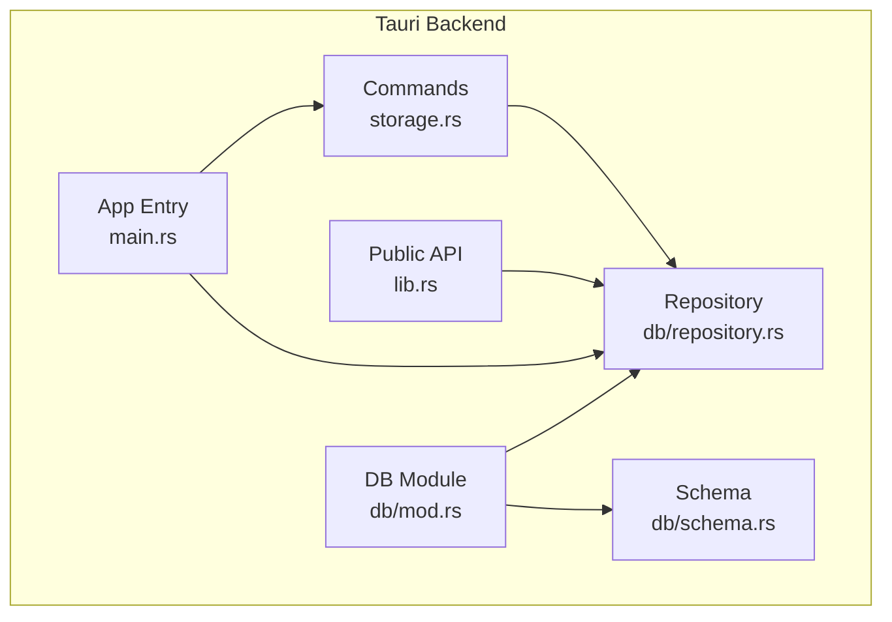

**Diagram sources**
- [storage.rs:1-24](file://src-tauri/src/commands/storage.rs#L1-L24)
- [repository.rs:1-1329](file://src-tauri/src/db/repository.rs#L1-L1329)
- [schema.rs:1-176](file://src-tauri/src/db/schema.rs#L1-L176)
- [mod.rs:1-3](file://src-tauri/src/db/mod.rs#L1-L3)
- [lib.rs:1-51](file://src-tauri/src/lib.rs#L1-L51)
- [main.rs:1-184](file://src-tauri/src/main.rs#L1-L184)

**Section sources**
- [storage.rs:1-24](file://src-tauri/src/commands/storage.rs#L1-L24)
- [repository.rs:1-1329](file://src-tauri/src/db/repository.rs#L1-L1329)
- [schema.rs:1-176](file://src-tauri/src/db/schema.rs#L1-L176)
- [mod.rs:1-3](file://src-tauri/src/db/mod.rs#L1-L3)
- [lib.rs:1-51](file://src-tauri/src/lib.rs#L1-L51)
- [main.rs:1-184](file://src-tauri/src/main.rs#L1-L184)

## Core Components
- Storage command: exposes storage metadata (application data directory and database path)
- Database: manages SQLite connection, initialization, and transactions
- Repository: provides typed operations for HTTP logs, WebSocket logs, packet capture, and documents
- Schema: defines tables and indexes
- Public API: re-exports types and functions for frontend consumption

Key responsibilities:
- Initialize database with foreign keys and WAL mode
- Provide paginated and filtered queries
- Enforce referential integrity via foreign keys and cascade deletes
- Support JSON fields for flexible document storage
- Offer cleanup operations for logs and WebSocket data

**Section sources**
- [storage.rs:1-24](file://src-tauri/src/commands/storage.rs#L1-L24)
- [repository.rs:37-58](file://src-tauri/src/db/repository.rs#L37-L58)
- [schema.rs:1-176](file://src-tauri/src/db/schema.rs#L1-L176)
- [lib.rs:27-27](file://src-tauri/src/lib.rs#L27-L27)

## Architecture Overview
The storage architecture centers around a single SQLite database with multiple logical domains:
- HTTP proxy logs
- WebSocket connections and messages
- Packet capture sessions, packets, and derived HTTP bodies
- Documents with JSON sections and API entries

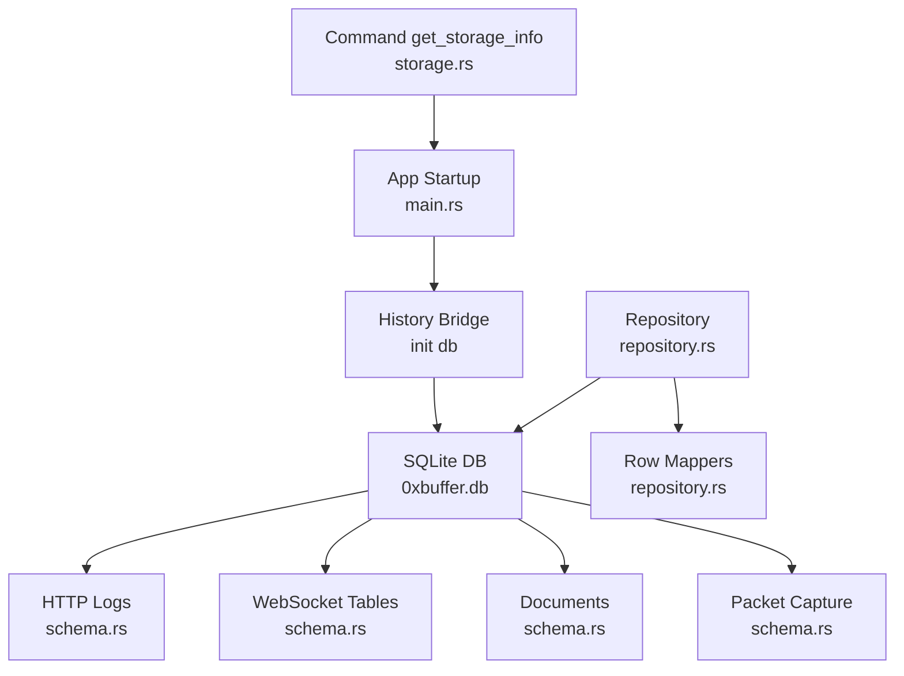

**Diagram sources**
- [main.rs:30-41](file://src-tauri/src/main.rs#L30-L41)
- [storage.rs:11-23](file://src-tauri/src/commands/storage.rs#L11-L23)
- [repository.rs:37-58](file://src-tauri/src/db/repository.rs#L37-L58)
- [schema.rs:1-176](file://src-tauri/src/db/schema.rs#L1-L176)

## Detailed Component Analysis

### Storage Command Handler
- Purpose: Returns the application data directory and the database file path
- Behavior: Resolves app data directory, constructs database path, serializes to camelCase

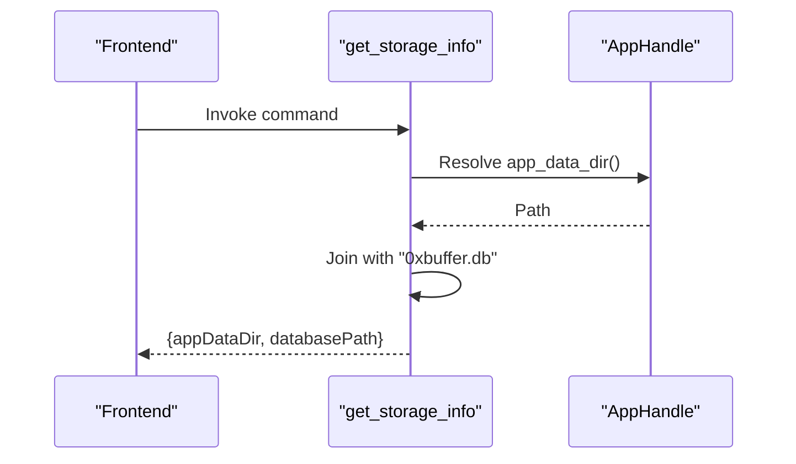

**Diagram sources**
- [storage.rs:11-23](file://src-tauri/src/commands/storage.rs#L11-L23)

**Section sources**
- [storage.rs:1-24](file://src-tauri/src/commands/storage.rs#L1-L24)

### Database Initialization and Transactions
- Initialization sets foreign keys and journal mode (WAL)
- Transactions are used for atomic packet insertion and updates

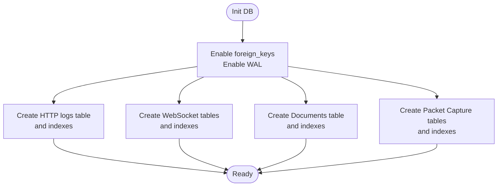

**Diagram sources**
- [repository.rs:49-58](file://src-tauri/src/db/repository.rs#L49-L58)
- [schema.rs:1-176](file://src-tauri/src/db/schema.rs#L1-L176)

**Section sources**
- [repository.rs:49-58](file://src-tauri/src/db/repository.rs#L49-L58)
- [schema.rs:1-176](file://src-tauri/src/db/schema.rs#L1-L176)

### HTTP Logs: CRUD and Queries
- Insertion: Stores request/response headers and bodies as JSON/text/BLOB
- Retrieval: Full list, paginated, filtered by multiple criteria
- Filtering supports search, path, methods, status codes, and scope patterns
- Cleanup: Clear all logs or delete by ID

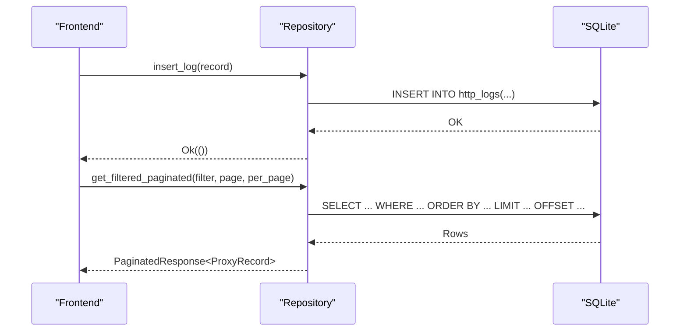

**Diagram sources**
- [repository.rs:259-371](file://src-tauri/src/db/repository.rs#L259-L371)
- [repository.rs:572-748](file://src-tauri/src/db/repository.rs#L572-L748)

**Section sources**
- [repository.rs:259-371](file://src-tauri/src/db/repository.rs#L259-L371)
- [repository.rs:572-748](file://src-tauri/src/db/repository.rs#L572-L748)

### WebSocket Logs: CRUD and Queries
- Insert connection and messages
- Paginated retrieval with dynamic filters (search, states, scope)
- Cleanup: Delete by ID or clear all

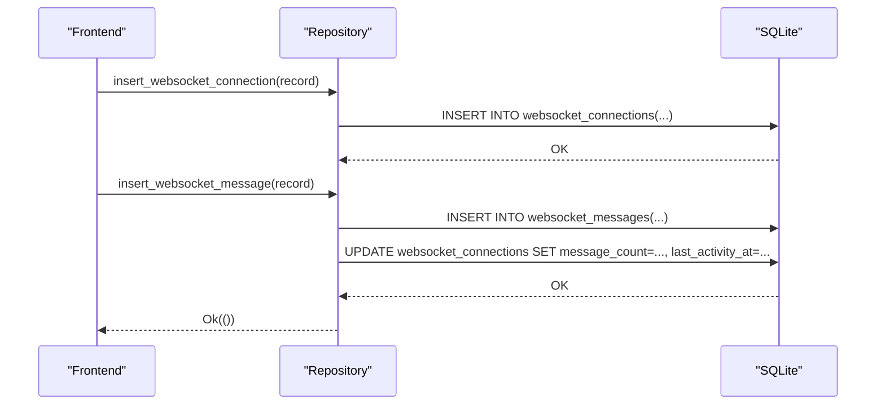

**Diagram sources**
- [repository.rs:373-432](file://src-tauri/src/db/repository.rs#L373-L432)
- [repository.rs:441-448](file://src-tauri/src/db/repository.rs#L441-L448)

**Section sources**
- [repository.rs:373-432](file://src-tauri/src/db/repository.rs#L373-L432)
- [repository.rs:441-448](file://src-tauri/src/db/repository.rs#L441-L448)

### Packet Capture: Bulk Operations and Transactions
- Atomic batch insert for packet and connection data
- Updates capture counters and connection aggregates
- Uses explicit transactions to ensure consistency

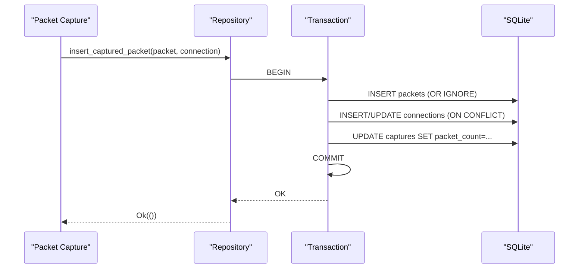

**Diagram sources**
- [repository.rs:96-163](file://src-tauri/src/db/repository.rs#L96-L163)

**Section sources**
- [repository.rs:96-163](file://src-tauri/src/db/repository.rs#L96-L163)

### Documents: Upsert and Deletion
- Upsert document with JSON serialization for sections and API entries
- List and delete by ID

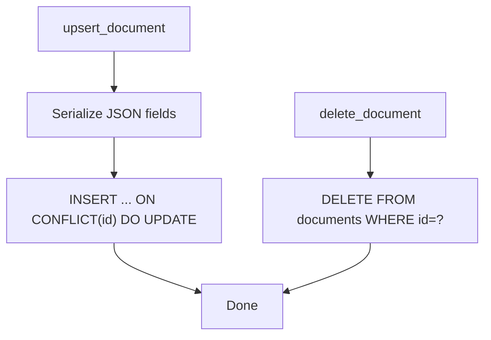

**Diagram sources**
- [repository.rs:223-257](file://src-tauri/src/db/repository.rs#L223-L257)
- [repository.rs:211-257](file://src-tauri/src/db/repository.rs#L211-L257)

**Section sources**
- [repository.rs:211-257](file://src-tauri/src/db/repository.rs#L211-L257)

### Pagination and Filtering Internals
- Paginated queries compute total and “has_more”
- Filters are dynamically built with parameterized queries to prevent SQL injection
- Scope filters support wildcard patterns

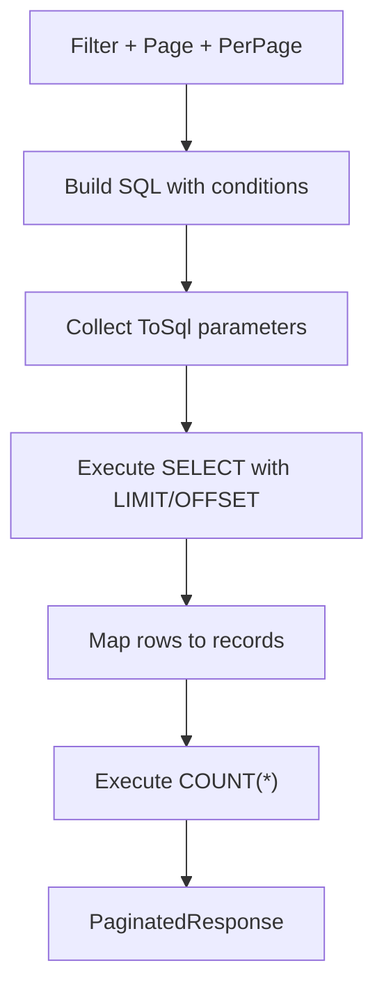

**Diagram sources**
- [repository.rs:572-748](file://src-tauri/src/db/repository.rs#L572-L748)
- [repository.rs:450-498](file://src-tauri/src/db/repository.rs#L450-L498)

**Section sources**
- [repository.rs:572-748](file://src-tauri/src/db/repository.rs#L572-L748)
- [repository.rs:450-498](file://src-tauri/src/db/repository.rs#L450-L498)

### Data Export/Import and Backup/Restore
- Export/import is not implemented in the current codebase
- Backup/restore can leverage SQLite’s native capabilities:
  - Hot backup APIs
  - File copy during closed state
  - WAL replay and checkpointing
- Recommended approach:
  - Stop writes, copy the database file, and restore
  - Use SQLite backup APIs for online backups

[No sources needed since this section provides general guidance]

### Data Migration Procedures
- Add new tables or indexes via schema constants and initialization
- Use ALTER TABLE statements for column changes
- Maintain backward compatibility by preserving existing columns and defaults
- Test migrations on staging data before rollout

[No sources needed since this section provides general guidance]

### Transaction Management, Error Handling, and Consistency
- Transactions:
  - Explicitly used for packet ingestion to maintain atomicity
  - Foreign keys enabled to enforce referential integrity
- Error handling:
  - Functions return Result or String errors
  - Row mapping functions skip malformed rows and log warnings
- Consistency:
  - WAL mode improves concurrency
  - ON CONFLICT clauses and INSERT/UPDATE ensure idempotent writes

**Section sources**
- [repository.rs:102-162](file://src-tauri/src/db/repository.rs#L102-L162)
- [repository.rs:49-58](file://src-tauri/src/db/repository.rs#L49-L58)
- [repository.rs:1115-1177](file://src-tauri/src/db/repository.rs#L1115-L1177)

### ZSTD Compression Integration
- ZSTD is available in the dependency graph and used for content re-encoding
- While not directly used in storage commands, it can be leveraged for compressing large BLOBs stored in the database (e.g., request/response bodies)
- Consider storing compressed payloads with metadata indicating compression algorithm

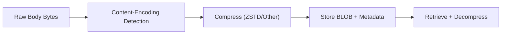

**Diagram sources**
- [body_decoder.rs:203-234](file://src-tauri/src/proxy/lifecycle/body_decoder.rs#L203-L234)
- [Cargo.lock:7231-7246](file://src-tauri/src/Cargo.lock#L7231-L7246)

**Section sources**
- [body_decoder.rs:203-234](file://src-tauri/src/proxy/lifecycle/body_decoder.rs#L203-L234)
- [Cargo.lock:7231-7246](file://src-tauri/src/Cargo.lock#L7231-L7246)

### Security Considerations
- Prefer parameterized queries to avoid SQL injection
- Validate and sanitize inputs before insertion
- Store sensitive data minimally; consider encryption at rest for highly sensitive logs
- Use WAL mode and foreign keys to reduce corruption risks
- Limit exposure of internal paths and filenames

[No sources needed since this section provides general guidance]

### Examples of Complex Queries and Transformations
- Tree aggregation by host/path/method from HTTP logs
- Dynamic filter composition with LIKE and IN clauses
- Scope-based filtering supporting wildcards

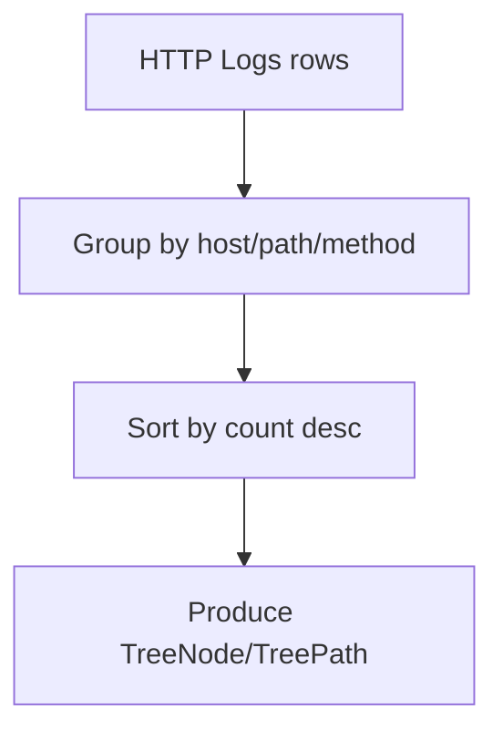

**Diagram sources**
- [repository.rs:758-918](file://src-tauri/src/db/repository.rs#L758-L918)

**Section sources**
- [repository.rs:758-918](file://src-tauri/src/db/repository.rs#L758-L918)

### Performance Optimization
- Indexes on frequently queried columns (timestamps, URLs, hosts)
- Pagination with LIMIT/OFFSET and precomputed counts
- Avoid N+1 queries; batch inserts where possible
- Use WAL mode for concurrent reads/writes
- Consider partitioning large datasets by time if growth continues to increase

**Section sources**
- [schema.rs:18-21](file://src-tauri/src/db/schema.rs#L18-L21)
- [schema.rs:51-56](file://src-tauri/src/db/schema.rs#L51-L56)
- [schema.rs:69-69](file://src-tauri/src/db/schema.rs#L69-L69)
- [schema.rs:166-175](file://src-tauri/src/db/schema.rs#L166-L175)

### Database Maintenance, Cleanup, and Lifecycle
- Clear logs and WebSocket data
- Delete individual records by ID
- Periodic vacuum and analyze for long-running instances
- Monitor disk usage and prune old data according to retention policies

**Section sources**
- [repository.rs:367-371](file://src-tauri/src/db/repository.rs#L367-L371)
- [repository.rs:434-439](file://src-tauri/src/db/repository.rs#L434-L439)
- [repository.rs:350-354](file://src-tauri/src/db/repository.rs#L350-L354)
- [repository.rs:441-448](file://src-tauri/src/db/repository.rs#L441-L448)

## Dependency Analysis
- The storage command depends on Tauri’s AppHandle to resolve paths
- The repository depends on rusqlite, serde, and UUID
- Compression codecs (including ZSTD) are available for optional use

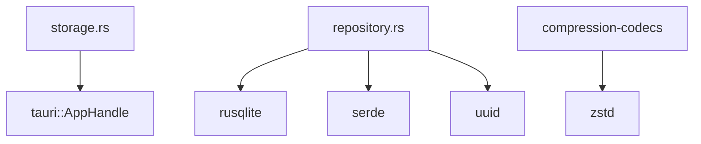

**Diagram sources**
- [storage.rs:1-2](file://src-tauri/src/commands/storage.rs#L1-L2)
- [repository.rs:1-14](file://src-tauri/src/db/repository.rs#L1-L14)
- [Cargo.lock:778-790](file://src-tauri/src/Cargo.lock#L778-L790)
- [Cargo.lock:7231-7246](file://src-tauri/src/Cargo.lock#L7231-L7246)

**Section sources**
- [storage.rs:1-2](file://src-tauri/src/commands/storage.rs#L1-L2)
- [repository.rs:1-14](file://src-tauri/src/db/repository.rs#L1-L14)
- [Cargo.lock:778-790](file://src-tauri/src/Cargo.lock#L778-L790)
- [Cargo.lock:7231-7246](file://src-tauri/src/Cargo.lock#L7231-L7246)

## Performance Considerations
- Use indexed columns for filtering and sorting
- Prefer paginated queries for large datasets
- Batch inserts for packet capture to reduce overhead
- Monitor WAL size and checkpoint periodically

[No sources needed since this section provides general guidance]

## Troubleshooting Guide
- Malformed rows: Row mappers skip and log errors; inspect logs for skipped entries
- Permission errors: Ensure app data directory exists and is writable
- Query errors: Verify filter parameters and SQL construction
- Corruption: Enable WAL and consider VACUUM after extended use

**Section sources**
- [repository.rs:1115-1177](file://src-tauri/src/db/repository.rs#L1115-L1177)
- [main.rs:30-41](file://src-tauri/src/main.rs#L30-L41)

## Conclusion
AppRecon’s storage subsystem provides robust, transactional persistence for HTTP and WebSocket traffic, packet capture data, and documents. It emphasizes safety through foreign keys, WAL mode, and explicit transactions, and offers flexible pagination and filtering. While export/import and backup/restore are not currently implemented, SQLite’s native capabilities and ZSTD compression present clear paths forward. Adopting retention policies, monitoring performance, and maintaining referential integrity will keep the system reliable and scalable.