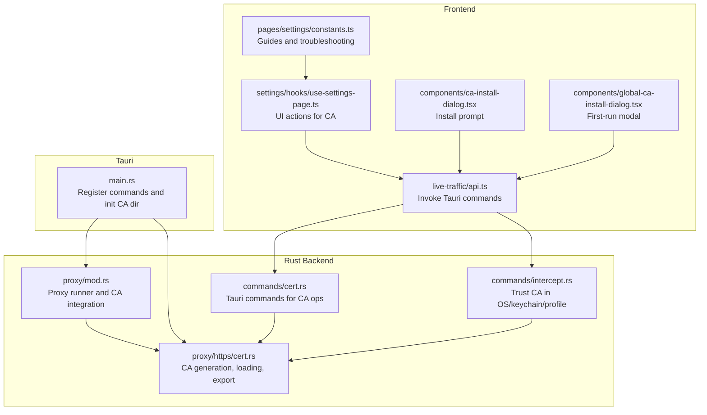
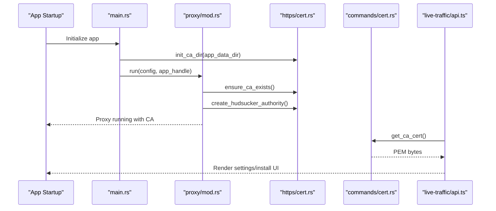
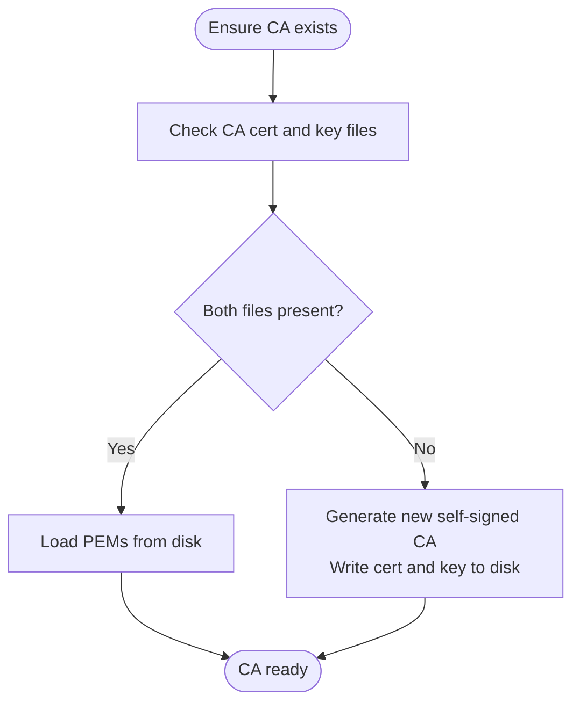
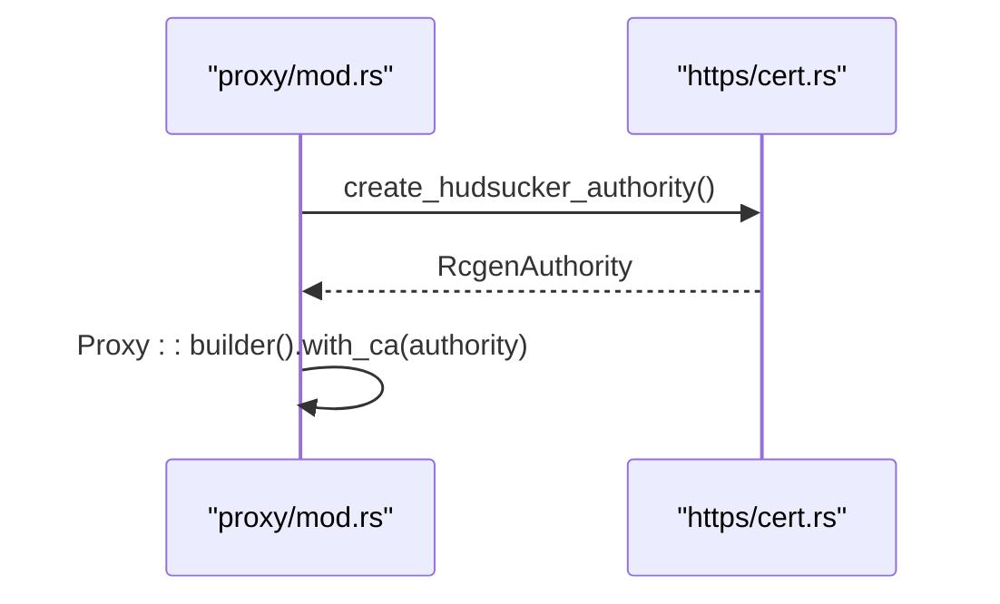
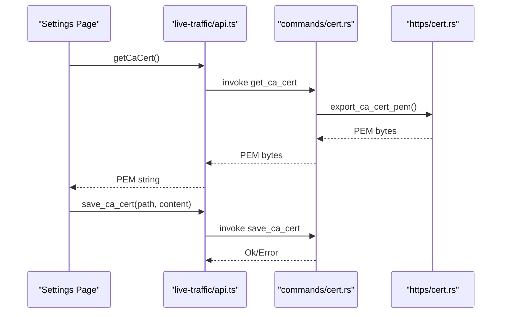
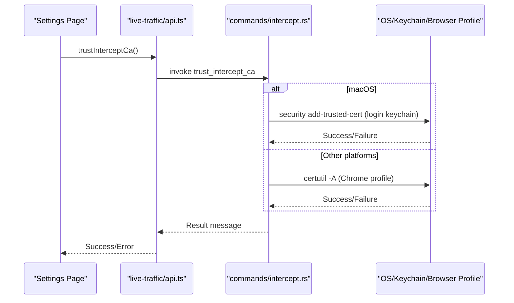
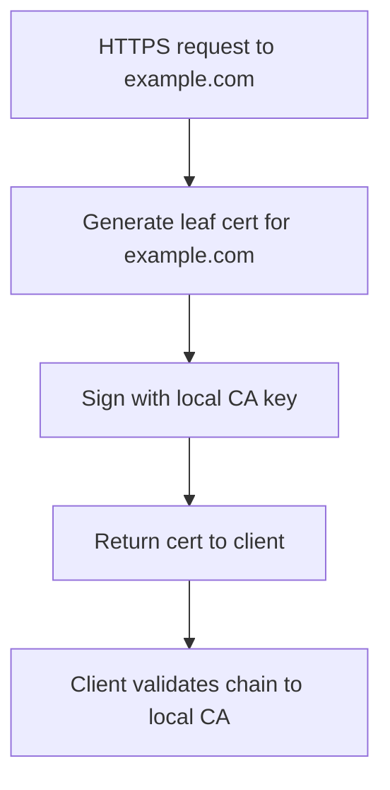
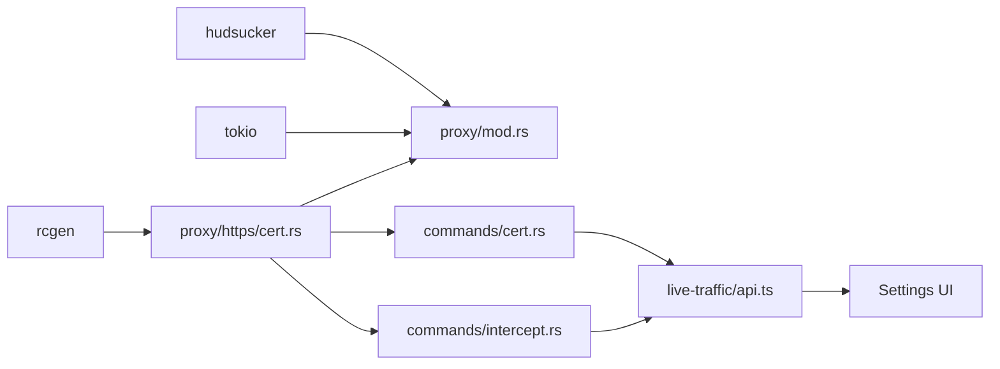

# HTTPS Handling and Certificate Management

<cite>
**Referenced Files in This Document**
- [mod.rs](file://src-tauri/src/proxy/mod.rs)
- [cert.rs](file://src-tauri/src/proxy/https/cert.rs)
- [main.rs](file://src-tauri/src/main.rs)
- [cert.rs](file://src-tauri/src/commands/cert.rs)
- [intercept.rs](file://src-tauri/src/commands/intercept.rs)
- [api.ts](file://src/pages/live-traffic/api.ts)
- [use-settings-page.ts](file://src/pages/settings/hooks/use-settings-page.ts)
- [ca-certificate-settings-tab.tsx](file://src/components/ca-install-dialog.tsx)
- [global-ca-install-dialog.tsx](file://src/components/global-ca-install-dialog.tsx)
- [constants.ts](file://src/pages/settings/constants.ts)
- [Cargo.toml](file://src-tauri/Cargo.toml)
</cite>

## Table of Contents
1. [Introduction](#introduction)
2. [Project Structure](#project-structure)
3. [Core Components](#core-components)
4. [Architecture Overview](#architecture-overview)
5. [Detailed Component Analysis](#detailed-component-analysis)
6. [Dependency Analysis](#dependency-analysis)
7. [Performance Considerations](#performance-considerations)
8. [Troubleshooting Guide](#troubleshooting-guide)
9. [Conclusion](#conclusion)
10. [Appendices](#appendices)

## Introduction
This document explains how the proxy engine handles HTTPS interception and manages certificates. It covers certificate authority (CA) generation, dynamic certificate signing for intercepted domains, trust store integration, and certificate export. It also documents the MITM injection mechanism, browser trust configuration, and provides practical examples and best practices for managing certificates in development environments.

## Project Structure
The HTTPS and certificate management system spans Rust backend (proxy and commands), Tauri frontend bindings, and React UI components:
- Rust proxy module initializes the CA and builds the Hudsucker proxy with a CA authority.
- Certificate utilities manage local CA persistence, generation, and export.
- Tauri commands expose certificate operations to the frontend.
- Frontend components provide UI for saving, installing, and trusting the CA.

**Diagram sources**
- [mod.rs:93-187](file://src-tauri/src/proxy/mod.rs#L93-L187)
- [cert.rs:11-143](file://src-tauri/src/proxy/https/cert.rs#L11-L143)
- [cert.rs:1-13](file://src-tauri/src/commands/cert.rs#L1-L13)
- [intercept.rs:237-433](file://src-tauri/src/commands/intercept.rs#L237-L433)
- [main.rs:36-36](file://src-tauri/src/main.rs#L36-L36)
- [api.ts:145-155](file://src/pages/live-traffic/api.ts#L145-L155)
- [use-settings-page.ts:98-139](file://src/pages/settings/hooks/use-settings-page.ts#L98-L139)
- [ca-certificate-settings-tab.tsx:1-73](file://src/components/ca-install-dialog.tsx#L1-L73)
- [global-ca-install-dialog.tsx:1-51](file://src/components/global-ca-install-dialog.tsx#L1-L51)
- [constants.ts:1-178](file://src/pages/settings/constants.ts#L1-L178)

**Section sources**
- [mod.rs:1-188](file://src-tauri/src/proxy/mod.rs#L1-L188)
- [cert.rs:1-144](file://src-tauri/src/proxy/https/cert.rs#L1-L144)
- [main.rs:36-36](file://src-tauri/src/main.rs#L36-L36)
- [cert.rs:1-13](file://src-tauri/src/commands/cert.rs#L1-L13)
- [intercept.rs:237-433](file://src-tauri/src/commands/intercept.rs#L237-L433)
- [api.ts:145-155](file://src/pages/live-traffic/api.ts#L145-L155)
- [use-settings-page.ts:98-139](file://src/pages/settings/hooks/use-settings-page.ts#L98-L139)
- [ca-certificate-settings-tab.tsx:1-73](file://src/components/ca-install-dialog.tsx#L1-L73)
- [global-ca-install-dialog.tsx:1-51](file://src/components/global-ca-install-dialog.tsx#L1-L51)
- [constants.ts:1-178](file://src/pages/settings/constants.ts#L1-L178)

## Core Components
- Certificate Authority (CA) management:
  - Initialization of CA directory and persistence.
  - Load existing CA or generate a new self-signed CA with constrained CA usage.
  - Export CA certificate in PEM format for distribution.
- Hudsucker proxy integration:
  - Build a CA authority from PEM and key, then attach to the proxy.
- Frontend certificate operations:
  - Save CA certificate to disk.
  - Install CA into OS keychain or browser-managed profiles.
  - Provide installation guides and troubleshooting.

**Section sources**
- [cert.rs:11-143](file://src-tauri/src/proxy/https/cert.rs#L11-L143)
- [mod.rs:96-142](file://src-tauri/src/proxy/mod.rs#L96-L142)
- [cert.rs:1-13](file://src-tauri/src/commands/cert.rs#L1-L13)
- [intercept.rs:237-433](file://src-tauri/src/commands/intercept.rs#L237-L433)
- [api.ts:145-155](file://src/pages/live-traffic/api.ts#L145-L155)
- [use-settings-page.ts:98-139](file://src/pages/settings/hooks/use-settings-page.ts#L98-L139)

## Architecture Overview
The HTTPS interception pipeline:
1. On app startup, the CA directory is initialized and the CA is ensured to exist.
2. The proxy is started with a Hudsucker CA authority built from the local CA.
3. When a client connects to an HTTPS endpoint via the proxy, the proxy dynamically generates a leaf certificate for the requested hostname, signed by the local CA.
4. The client receives a certificate that chains back to the trusted local CA, enabling inspection and modification of TLS traffic.
5. Users can export the CA PEM and install it into their OS/browser trust stores for seamless operation.

**Diagram sources**
- [main.rs:36-36](file://src-tauri/src/main.rs#L36-L36)
- [mod.rs:96-142](file://src-tauri/src/proxy/mod.rs#L96-L142)
- [cert.rs:106-118](file://src-tauri/src/proxy/https/cert.rs#L106-L118)
- [cert.rs:9-12](file://src-tauri/src/commands/cert.rs#L9-L12)
- [api.ts:145-147](file://src/pages/live-traffic/api.ts#L145-L147)

## Detailed Component Analysis

### Certificate Authority Generation and Persistence
- CA directory initialization:
  - The CA root is placed under the application data directory, ensuring isolation and persistence across runs.
- Loading or generating:
  - If both CA certificate and key files exist, they are loaded.
  - Otherwise, a new self-signed CA is generated with constrained CA usage and written to disk.
- Export and retrieval:
  - The CA PEM can be exported as bytes for UI operations.
  - The CA PEM string is retrievable for display or installation prompts.

**Diagram sources**
- [cert.rs:42-66](file://src-tauri/src/proxy/https/cert.rs#L42-L66)
- [cert.rs:68-94](file://src-tauri/src/proxy/https/cert.rs#L68-L94)

**Section sources**
- [cert.rs:11-143](file://src-tauri/src/proxy/https/cert.rs#L11-L143)
- [main.rs:36-36](file://src-tauri/src/main.rs#L36-L36)

### Hudsucker CA Authority Integration
- The proxy constructs an Hudsucker CA authority from the PEM and key files.
- The authority is attached to the proxy builder, enabling dynamic certificate signing during MITM.

**Diagram sources**
- [mod.rs:134-142](file://src-tauri/src/proxy/mod.rs#L134-L142)
- [cert.rs:106-118](file://src-tauri/src/proxy/https/cert.rs#L106-L118)

**Section sources**
- [mod.rs:134-142](file://src-tauri/src/proxy/mod.rs#L134-L142)
- [cert.rs:106-118](file://src-tauri/src/proxy/https/cert.rs#L106-L118)

### Certificate Export and Distribution
- Frontend invokes a Tauri command to fetch the CA PEM.
- The UI presents options to save the certificate to disk or install it into the OS/browser trust store.

**Diagram sources**
- [api.ts:145-151](file://src/pages/live-traffic/api.ts#L145-L151)
- [cert.rs:9-12](file://src-tauri/src/commands/cert.rs#L9-L12)
- [cert.rs:4-6](file://src-tauri/src/commands/cert.rs#L4-L6)
- [cert.rs:96-99](file://src-tauri/src/proxy/https/cert.rs#L96-L99)

**Section sources**
- [api.ts:145-151](file://src/pages/live-traffic/api.ts#L145-L151)
- [cert.rs:1-13](file://src-tauri/src/commands/cert.rs#L1-L13)
- [cert.rs:96-104](file://src-tauri/src/proxy/https/cert.rs#L96-L104)

### Trust Store Integration (macOS Keychain and Browser Profiles)
- macOS:
  - The certificate is added to the user login keychain with trustRoot for SSL.
  - Existing entries are removed before adding to avoid duplicates.
- Non-macOS (e.g., Linux):
  - The certificate is imported into a managed Chrome profile using NSS certutil.
  - The NSS tools must be installed; otherwise, a helpful error message is returned.

**Diagram sources**
- [api.ts:153-155](file://src/pages/live-traffic/api.ts#L153-L155)
- [intercept.rs:423-433](file://src-tauri/src/commands/intercept.rs#L423-L433)
- [intercept.rs:393-420](file://src-tauri/src/commands/intercept.rs#L393-L420)
- [intercept.rs:237-364](file://src-tauri/src/commands/intercept.rs#L237-L364)

**Section sources**
- [intercept.rs:393-420](file://src-tauri/src/commands/intercept.rs#L393-L420)
- [intercept.rs:423-433](file://src-tauri/src/commands/intercept.rs#L423-L433)
- [intercept.rs:237-364](file://src-tauri/src/commands/intercept.rs#L237-L364)

### Dynamic Certificate Generation for Interception
- During HTTPS interception, the proxy dynamically creates a leaf certificate for the requested hostname.
- This leaf certificate is signed by the local CA, ensuring it chains back to the trusted CA.
- This mechanism enables decryption, inspection, and re-encryption of TLS traffic without breaking the client’s trust.

[No sources needed since this diagram shows conceptual workflow, not actual code structure]

## Dependency Analysis
- External crates:
  - rcgen for certificate generation and management.
  - hudsucker for the HTTP/S proxy with CA support.
  - tokio for asynchronous runtime.
- Internal dependencies:
  - proxy/mod.rs depends on proxy/https/cert.rs for CA operations.
  - commands/cert.rs and commands/intercept.rs depend on proxy/https/cert.rs for CA PEMs and trust operations.
  - Frontend invokes Tauri commands via live-traffic/api.ts.

**Diagram sources**
- [Cargo.toml:24-27](file://src-tauri/Cargo.toml#L24-L27)
- [mod.rs:15-15](file://src-tauri/src/proxy/mod.rs#L15-L15)
- [cert.rs:1-1](file://src-tauri/src/proxy/https/cert.rs#L1-L1)
- [cert.rs:1-1](file://src-tauri/src/commands/cert.rs#L1-L1)
- [intercept.rs:237-237](file://src-tauri/src/commands/intercept.rs#L237-L237)
- [api.ts:145-155](file://src/pages/live-traffic/api.ts#L145-L155)

**Section sources**
- [Cargo.toml:24-27](file://src-tauri/Cargo.toml#L24-L27)
- [mod.rs:15-15](file://src-tauri/src/proxy/mod.rs#L15-L15)
- [cert.rs:1-1](file://src-tauri/src/proxy/https/cert.rs#L1-L1)
- [cert.rs:1-1](file://src-tauri/src/commands/cert.rs#L1-L1)
- [intercept.rs:237-237](file://src-tauri/src/commands/intercept.rs#L237-L237)
- [api.ts:145-155](file://src/pages/live-traffic/api.ts#L145-L155)

## Performance Considerations
- CA generation occurs once and is persisted to disk; subsequent runs load the existing CA to avoid overhead.
- Dynamic certificate signing is performed per domain and cached by the proxy to minimize repeated generation costs.
- Asynchronous runtime ensures non-blocking proxy operations.

[No sources needed since this section provides general guidance]

## Troubleshooting Guide
Common issues and resolutions:
- Browser shows “Certificate Not Trusted” warning:
  - Ensure the CA is installed and set to “trusted” in the browser’s certificate manager.
  - Restart the browser after installation.
  - On iOS, enable full trust in Certificate Trust Settings.
- Some apps do not work with interception:
  - Apps using certificate pinning will reject the proxy’s certificate. This is a security feature; bypassing typically requires root access or app modification.
- Removing the CA:
  - Windows: Internet Options → Content → Certificates → Authorities → Remove.
  - macOS: Keychain Access → System → Certificates → Delete.
  - Firefox: Options → Privacy → Certificates → Authorities → Delete.
  - iOS: Settings → General → Profiles → Delete 0xbuffer profile.
  - Android: Settings → Security → Advanced → Encryption → Trusted certificates → Remove.

**Section sources**
- [constants.ts:112-139](file://src/pages/settings/constants.ts#L112-L139)

## Conclusion
The proxy engine securely manages a local CA, integrates it with Hudsucker for HTTPS interception, and provides robust mechanisms for exporting and installing the CA across platforms. The frontend offers guided workflows for saving and trusting the certificate, while comprehensive troubleshooting resources help resolve common issues in development environments.

[No sources needed since this section summarizes without analyzing specific files]

## Appendices

### Practical Examples

- Certificate lifecycle management:
  - First run: CA directory is initialized; if no CA exists, a new self-signed CA is generated and stored.
  - Subsequent runs: The existing CA is loaded from disk.
  - Regenerate CA: Remove existing files and generate a new CA; the proxy will use the new authority after restart.
- Export and install:
  - Export the CA PEM via the frontend and save it to disk.
  - Install into macOS Keychain or a browser-managed profile using the provided commands.
- Security best practices:
  - Keep the CA private and restrict access to the key material.
  - Avoid installing the CA on production systems; use isolated environments.
  - Periodically rotate the CA and revoke old certificates when necessary.

**Section sources**
- [cert.rs:120-143](file://src-tauri/src/proxy/https/cert.rs#L120-L143)
- [cert.rs:11-13](file://src-tauri/src/proxy/https/cert.rs#L11-L13)
- [api.ts:145-155](file://src/pages/live-traffic/api.ts#L145-L155)
- [intercept.rs:393-420](file://src-tauri/src/commands/intercept.rs#L393-L420)
- [intercept.rs:237-364](file://src-tauri/src/commands/intercept.rs#L237-L364)