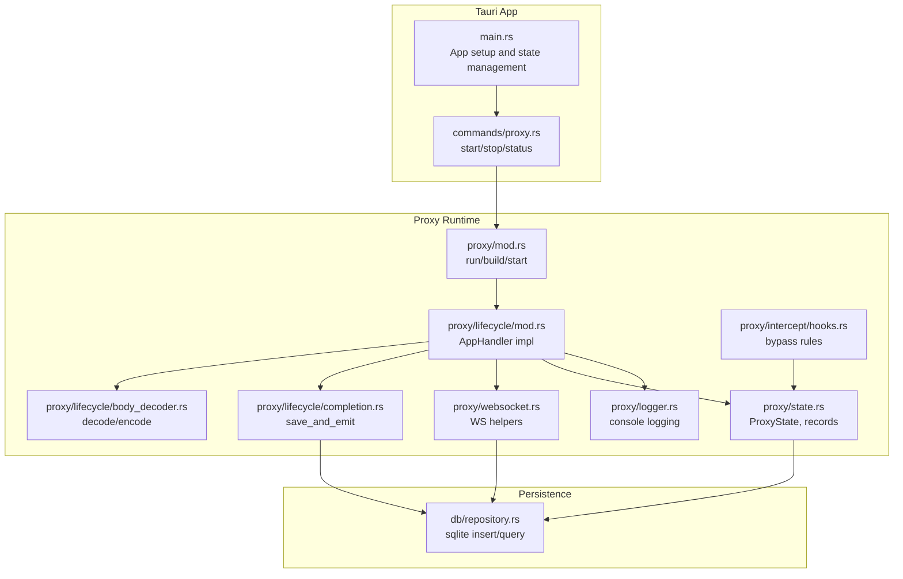
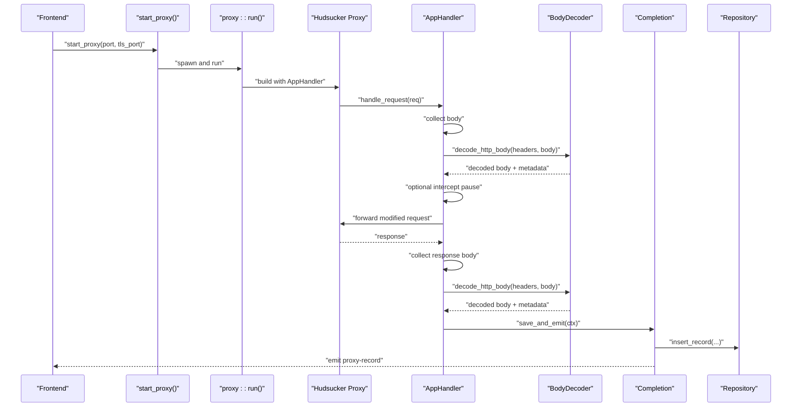
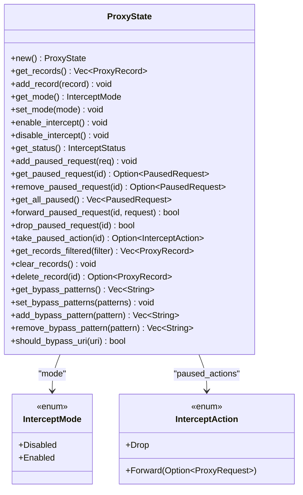
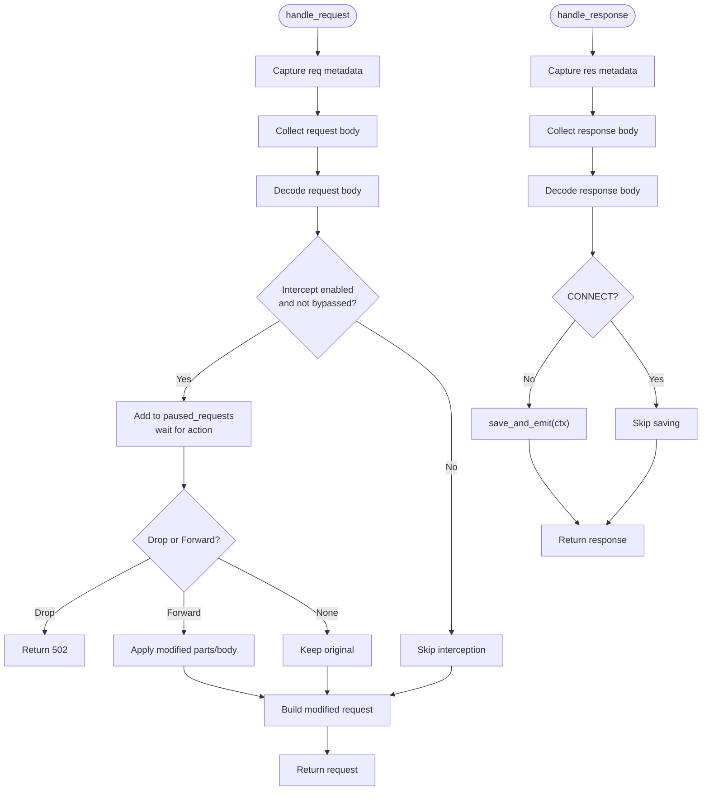
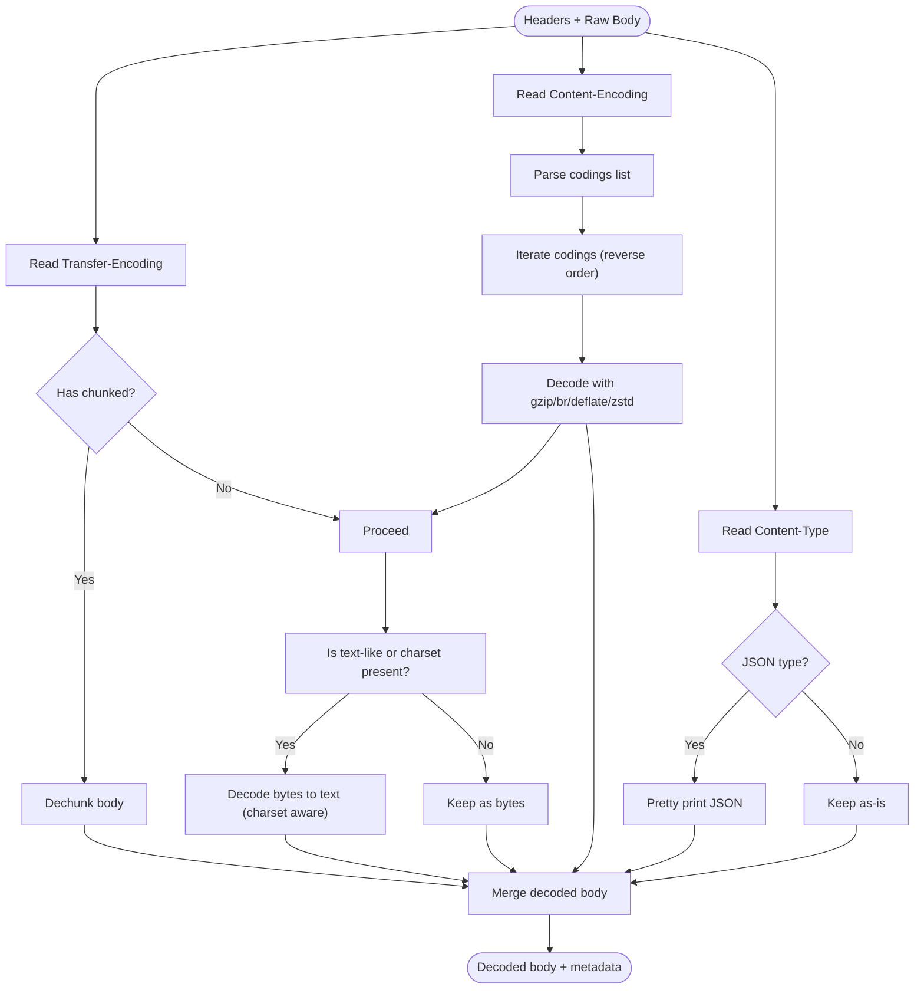
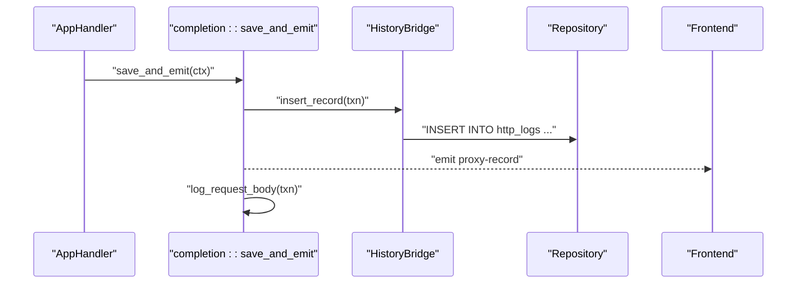
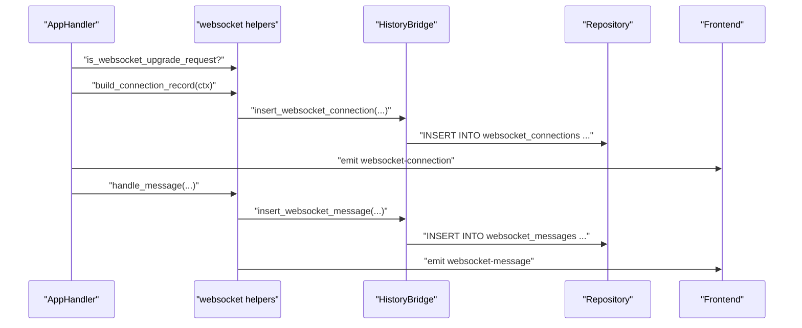
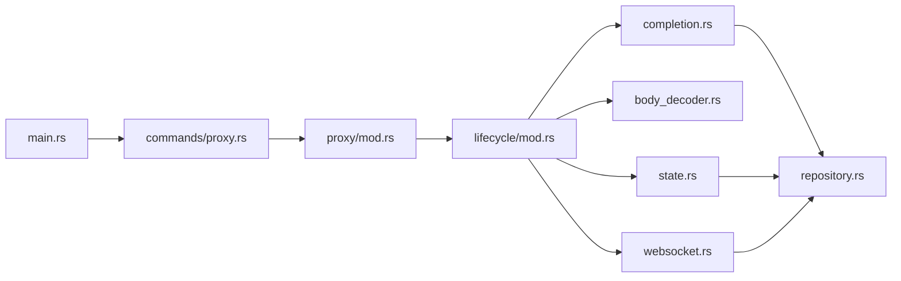

# Lifecycle Management and State

<cite>
**Referenced Files in This Document**
- [main.rs](file://src-tauri/src/main.rs)
- [proxy.rs](file://src-tauri/src/commands/proxy.rs)
- [mod.rs](file://src-tauri/src/proxy/mod.rs)
- [state.rs](file://src-tauri/src/proxy/state.rs)
- [lifecycle/mod.rs](file://src-tauri/src/proxy/lifecycle/mod.rs)
- [body_decoder.rs](file://src-tauri/src/proxy/lifecycle/body_decoder.rs)
- [completion.rs](file://src-tauri/src/proxy/lifecycle/completion.rs)
- [websocket.rs](file://src-tauri/src/proxy/websocket.rs)
- [logger.rs](file://src-tauri/src/proxy/logger.rs)
- [hooks.rs](file://src-tauri/src/proxy/intercept/hooks.rs)
- [repository.rs](file://src-tauri/src/db/repository.rs)
</cite>

## Table of Contents
1. [Introduction](#introduction)
2. [Project Structure](#project-structure)
3. [Core Components](#core-components)
4. [Architecture Overview](#architecture-overview)
5. [Detailed Component Analysis](#detailed-component-analysis)
6. [Dependency Analysis](#dependency-analysis)
7. [Performance Considerations](#performance-considerations)
8. [Troubleshooting Guide](#troubleshooting-guide)
9. [Conclusion](#conclusion)
10. [Appendices](#appendices)

## Introduction
This document explains the proxy lifecycle management and state handling in the application. It covers the request/response processing pipeline, completion handlers, and body decoding mechanisms. It documents the ProxyState structure, state transitions, and persistence, and describes the lifecycle stages from request reception through response delivery, including error handling and cleanup. It also details body decoder implementations for different content types, chunked transfer encoding, and compressed content handling. Practical examples show how to extend lifecycle handlers, implement custom state management, and optimize performance via efficient state handling.

## Project Structure
The proxy subsystem is implemented in Rust under the Tauri application. Key areas:
- Proxy orchestration and lifecycle: proxy/mod.rs, proxy/lifecycle/*
- State model and persistence: proxy/state.rs, db/repository.rs
- Websocket handling: proxy/websocket.rs
- Logging and UI events: proxy/logger.rs, proxy/lifecycle/completion.rs
- Interception and bypass logic: proxy/intercept/*

**Diagram sources**
- [main.rs:14-70](file://src-tauri/src/main.rs#L14-L70)
- [proxy.rs:15-73](file://src-tauri/src/commands/proxy.rs#L15-L73)
- [mod.rs:93-187](file://src-tauri/src/proxy/mod.rs#L93-L187)
- [lifecycle/mod.rs:88-360](file://src-tauri/src/proxy/lifecycle/mod.rs#L88-L360)
- [body_decoder.rs:24-90](file://src-tauri/src/proxy/lifecycle/body_decoder.rs#L24-L90)
- [completion.rs:35-76](file://src-tauri/src/proxy/lifecycle/completion.rs#L35-L76)
- [websocket.rs:27-60](file://src-tauri/src/proxy/websocket.rs#L27-L60)
- [logger.rs:37-67](file://src-tauri/src/proxy/logger.rs#L37-L67)
- [state.rs:191-440](file://src-tauri/src/proxy/state.rs#L191-L440)
- [hooks.rs:12-20](file://src-tauri/src/proxy/intercept/hooks.rs#L12-L20)
- [repository.rs:259-293](file://src-tauri/src/db/repository.rs#L259-L293)

**Section sources**
- [main.rs:14-70](file://src-tauri/src/main.rs#L14-L70)
- [proxy.rs:15-73](file://src-tauri/src/commands/proxy.rs#L15-L73)
- [mod.rs:93-187](file://src-tauri/src/proxy/mod.rs#L93-L187)

## Core Components
- Proxy runtime builder and lifecycle orchestrator
  - Starts/stops the proxy, manages ports, and wires Hudsucker handlers.
- AppHandler (HttpHandler/WebSocketHandler)
  - Implements request/response interception, body decoding, and event emission.
- ProxyState
  - Thread-safe in-memory state for intercepted requests, filtering, and bypass patterns.
- BodyDecoder
  - Decodes chunked transfer-encoding, content-encodings (gzip, br, deflate, zstd), and normalizes text-like bodies.
- Completion pipeline
  - Builds ProxyRecord, persists to sqlite, emits UI events, and logs previews.
- WebSocket helpers
  - Detects upgrades, builds connection records, and streams messages.
- Logger
  - Console logging for request/response previews.

**Section sources**
- [mod.rs:93-187](file://src-tauri/src/proxy/mod.rs#L93-L187)
- [lifecycle/mod.rs:78-360](file://src-tauri/src/proxy/lifecycle/mod.rs#L78-L360)
- [state.rs:191-440](file://src-tauri/src/proxy/state.rs#L191-L440)
- [body_decoder.rs:24-90](file://src-tauri/src/proxy/lifecycle/body_decoder.rs#L24-L90)
- [completion.rs:35-76](file://src-tauri/src/proxy/lifecycle/completion.rs#L35-L76)
- [websocket.rs:27-60](file://src-tauri/src/proxy/websocket.rs#L27-L60)
- [logger.rs:37-67](file://src-tauri/src/proxy/logger.rs#L37-L67)

## Architecture Overview
The proxy lifecycle is driven by Tauri commands that spawn the proxy runtime. Hudsucker’s HTTP and WebSocket handlers delegate to AppHandler, which:
- Collects request/response bodies
- Decodes content and transfer encodings
- Optionally pauses requests for interception
- Emits events and persists records to sqlite

**Diagram sources**
- [proxy.rs:15-52](file://src-tauri/src/commands/proxy.rs#L15-L52)
- [mod.rs:93-187](file://src-tauri/src/proxy/mod.rs#L93-L187)
- [lifecycle/mod.rs:88-360](file://src-tauri/src/proxy/lifecycle/mod.rs#L88-L360)
- [body_decoder.rs:24-90](file://src-tauri/src/proxy/lifecycle/body_decoder.rs#L24-L90)
- [completion.rs:35-76](file://src-tauri/src/proxy/lifecycle/completion.rs#L35-L76)
- [repository.rs:259-293](file://src-tauri/src/db/repository.rs#L259-L293)

## Detailed Component Analysis

### ProxyState and State Transitions
ProxyState encapsulates:
- Records: list of ProxyRecord entries
- InterceptMode: Enabled/Disabled
- PausedRequests: pending interception
- PausedActions: per-id actions (Forward or Drop)
- Bypass patterns: URI patterns to skip interception

Key transitions:
- Mode change from Enabled to Disabled flushes pending pauses and applies queued actions.
- Adding/removing paused requests updates internal queues and maps.
- Bypass evaluation considers captive portal patterns and wildcard/host suffixes.

**Diagram sources**
- [state.rs:191-440](file://src-tauri/src/proxy/state.rs#L191-L440)

**Section sources**
- [state.rs:191-440](file://src-tauri/src/proxy/state.rs#L191-L440)
- [hooks.rs:12-20](file://src-tauri/src/proxy/intercept/hooks.rs#L12-L20)

### Request/Response Processing Pipeline
AppHandler implements HttpHandler and WebSocketHandler:
- Request phase:
  - Captures client/server address, method, URI, headers.
  - Reads and decodes request body.
  - Optionally pauses for interception if enabled and not bypassed.
  - Applies forwarded modifications if any.
- Response phase:
  - Captures status, headers, reads body.
  - Decodes response body.
  - Saves and emits ProxyRecord unless CONNECT.
- WebSocket:
  - Detects upgrades and builds connection records.
  - Streams messages and tracks connection state.

**Diagram sources**
- [lifecycle/mod.rs:88-360](file://src-tauri/src/proxy/lifecycle/mod.rs#L88-L360)
- [completion.rs:35-76](file://src-tauri/src/proxy/lifecycle/completion.rs#L35-L76)

**Section sources**
- [lifecycle/mod.rs:88-360](file://src-tauri/src/proxy/lifecycle/mod.rs#L88-L360)
- [websocket.rs:27-60](file://src-tauri/src/proxy/websocket.rs#L27-L60)

### Body Decoder: Chunked, Compressed, and Text Handling
The decoder inspects headers:
- Transfer-Encoding: chunked detection and dechunking
- Content-Encoding: gzip, br, deflate, zstd decoding
- Content-Type: charset parsing and text-like detection
- JSON pretty-printing when applicable

**Diagram sources**
- [body_decoder.rs:24-90](file://src-tauri/src/proxy/lifecycle/body_decoder.rs#L24-L90)
- [body_decoder.rs:114-144](file://src-tauri/src/proxy/lifecycle/body_decoder.rs#L114-L144)
- [body_decoder.rs:178-192](file://src-tauri/src/proxy/lifecycle/body_decoder.rs#L178-L192)
- [body_decoder.rs:266-275](file://src-tauri/src/proxy/lifecycle/body_decoder.rs#L266-L275)
- [body_decoder.rs:294-306](file://src-tauri/src/proxy/lifecycle/body_decoder.rs#L294-L306)

**Section sources**
- [body_decoder.rs:24-90](file://src-tauri/src/proxy/lifecycle/body_decoder.rs#L24-L90)
- [body_decoder.rs:114-144](file://src-tauri/src/proxy/lifecycle/body_decoder.rs#L114-L144)
- [body_decoder.rs:178-192](file://src-tauri/src/proxy/lifecycle/body_decoder.rs#L178-L192)
- [body_decoder.rs:266-275](file://src-tauri/src/proxy/lifecycle/body_decoder.rs#L266-L275)
- [body_decoder.rs:294-306](file://src-tauri/src/proxy/lifecycle/body_decoder.rs#L294-L306)

### Completion Handlers and Persistence
Completion constructs a ProxyRecord and:
- Persists to sqlite via HistoryBridge/Repository
- Emits a “proxy-record” event for the UI
- Logs a console preview via logger

**Diagram sources**
- [completion.rs:35-76](file://src-tauri/src/proxy/lifecycle/completion.rs#L35-L76)
- [repository.rs:259-293](file://src-tauri/src/db/repository.rs#L259-L293)
- [logger.rs:37-67](file://src-tauri/src/proxy/logger.rs#L37-L67)

**Section sources**
- [completion.rs:35-76](file://src-tauri/src/proxy/lifecycle/completion.rs#L35-L76)
- [repository.rs:259-293](file://src-tauri/src/db/repository.rs#L259-L293)
- [logger.rs:37-67](file://src-tauri/src/proxy/logger.rs#L37-L67)

### WebSocket Lifecycle
- Upgrade detection and handshake recording
- Message streaming with direction and type
- Connection state tracking and close handling

**Diagram sources**
- [lifecycle/mod.rs:362-451](file://src-tauri/src/proxy/lifecycle/mod.rs#L362-L451)
- [websocket.rs:27-60](file://src-tauri/src/proxy/websocket.rs#L27-L60)
- [websocket.rs:62-94](file://src-tauri/src/proxy/websocket.rs#L62-L94)
- [repository.rs:373-403](file://src-tauri/src/db/repository.rs#L373-L403)
- [repository.rs:405-432](file://src-tauri/src/db/repository.rs#L405-L432)

**Section sources**
- [lifecycle/mod.rs:362-451](file://src-tauri/src/proxy/lifecycle/mod.rs#L362-L451)
- [websocket.rs:27-60](file://src-tauri/src/proxy/websocket.rs#L27-L60)
- [websocket.rs:62-94](file://src-tauri/src/proxy/websocket.rs#L62-L94)
- [repository.rs:373-403](file://src-tauri/src/db/repository.rs#L373-L403)
- [repository.rs:405-432](file://src-tauri/src/db/repository.rs#L405-L432)

### Practical Examples

#### Extending Lifecycle Handlers
- Add custom pre/post-processing in AppHandler:
  - Modify headers or body before forwarding
  - Enrich context with additional metadata
  - Integrate external services during request/response phases

References:
- [lifecycle/mod.rs:88-360](file://src-tauri/src/proxy/lifecycle/mod.rs#L88-L360)

#### Implementing Custom State Management
- Extend ProxyState with new filters or computed fields
- Add new intercept actions (e.g., rewrite, rate-limit)
- Persist additional fields via ProxyRecord extensions and Repository updates

References:
- [state.rs:191-440](file://src-tauri/src/proxy/state.rs#L191-L440)
- [repository.rs:259-293](file://src-tauri/src/db/repository.rs#L259-L293)

#### Optimizing Performance Through Efficient State Handling
- Minimize locking by batching operations
- Use lazy decoding only when needed
- Avoid unnecessary cloning of large bodies
- Prefer streaming where possible for large responses

References:
- [lifecycle/mod.rs:144-154](file://src-tauri/src/proxy/lifecycle/mod.rs#L144-L154)
- [lifecycle/mod.rs:329-335](file://src-tauri/src/proxy/lifecycle/mod.rs#L329-L335)
- [body_decoder.rs:24-90](file://src-tauri/src/proxy/lifecycle/body_decoder.rs#L24-L90)

## Dependency Analysis
- Tauri app initializes ProxyState, HistoryBridge, and registers commands.
- Commands start/stop the proxy and query status.
- Proxy runtime depends on Hudsucker for HTTP/WebSocket handling.
- AppHandler depends on BodyDecoder, Completion, WebSocket helpers, and ProxyState.
- Persistence relies on Repository and sqlite-backed tables.

**Diagram sources**
- [main.rs:14-70](file://src-tauri/src/main.rs#L14-L70)
- [proxy.rs:15-73](file://src-tauri/src/commands/proxy.rs#L15-L73)
- [mod.rs:93-187](file://src-tauri/src/proxy/mod.rs#L93-L187)
- [lifecycle/mod.rs:88-360](file://src-tauri/src/proxy/lifecycle/mod.rs#L88-L360)
- [state.rs:191-440](file://src-tauri/src/proxy/state.rs#L191-L440)
- [body_decoder.rs:24-90](file://src-tauri/src/proxy/lifecycle/body_decoder.rs#L24-L90)
- [completion.rs:35-76](file://src-tauri/src/proxy/lifecycle/completion.rs#L35-L76)
- [websocket.rs:27-60](file://src-tauri/src/proxy/websocket.rs#L27-L60)
- [repository.rs:259-293](file://src-tauri/src/db/repository.rs#L259-L293)

**Section sources**
- [main.rs:14-70](file://src-tauri/src/main.rs#L14-L70)
- [proxy.rs:15-73](file://src-tauri/src/commands/proxy.rs#L15-L73)
- [mod.rs:93-187](file://src-tauri/src/proxy/mod.rs#L93-L187)
- [lifecycle/mod.rs:88-360](file://src-tauri/src/proxy/lifecycle/mod.rs#L88-L360)
- [state.rs:191-440](file://src-tauri/src/proxy/state.rs#L191-L440)
- [body_decoder.rs:24-90](file://src-tauri/src/proxy/lifecycle/body_decoder.rs#L24-L90)
- [completion.rs:35-76](file://src-tauri/src/proxy/lifecycle/completion.rs#L35-L76)
- [websocket.rs:27-60](file://src-tauri/src/proxy/websocket.rs#L27-L60)
- [repository.rs:259-293](file://src-tauri/src/db/repository.rs#L259-L293)

## Performance Considerations
- Body decoding occurs synchronously; consider offloading heavy decompression to blocking threads or caching decoded results when appropriate.
- Avoid repeated header scans; cache header values in Ctx where feasible.
- Use streaming for very large bodies when possible to reduce memory pressure.
- Batch database writes for high-throughput scenarios.
- Limit event emissions to essential updates to avoid UI bottlenecks.

## Troubleshooting Guide
Common issues and remedies:
- Proxy fails to start due to port conflicts
  - Ensure port availability or enable reuse; verify active port tracking.
  - References: [mod.rs:51-56](file://src-tauri/src/proxy/mod.rs#L51-L56), [mod.rs:93-187](file://src-tauri/src/proxy/mod.rs#L93-L187)
- Interception not working
  - Verify InterceptMode and bypass patterns; confirm URI is not matched by captive portal or wildcard rules.
  - References: [state.rs:210-222](file://src-tauri/src/proxy/state.rs#L210-L222), [hooks.rs:12-20](file://src-tauri/src/proxy/intercept/hooks.rs#L12-L20)
- Body appears garbled
  - Check Content-Type charset and Content-Encoding; ensure decoder metadata is accurate.
  - References: [body_decoder.rs:24-90](file://src-tauri/src/proxy/lifecycle/body_decoder.rs#L24-L90), [body_decoder.rs:266-275](file://src-tauri/src/proxy/lifecycle/body_decoder.rs#L266-L275)
- Events not received
  - Confirm AppHandle is correctly passed and event listeners are registered.
  - References: [completion.rs:66-73](file://src-tauri/src/proxy/lifecycle/completion.rs#L66-L73)
- WebSocket messages missing
  - Ensure upgrade headers are present and connection mapping exists.
  - References: [websocket.rs:27-60](file://src-tauri/src/proxy/websocket.rs#L27-L60), [lifecycle/mod.rs:414-447](file://src-tauri/src/proxy/lifecycle/mod.rs#L414-L447)

**Section sources**
- [mod.rs:51-56](file://src-tauri/src/proxy/mod.rs#L51-L56)
- [mod.rs:93-187](file://src-tauri/src/proxy/mod.rs#L93-L187)
- [state.rs:210-222](file://src-tauri/src/proxy/state.rs#L210-L222)
- [hooks.rs:12-20](file://src-tauri/src/proxy/intercept/hooks.rs#L12-L20)
- [body_decoder.rs:24-90](file://src-tauri/src/proxy/lifecycle/body_decoder.rs#L24-L90)
- [body_decoder.rs:266-275](file://src-tauri/src/proxy/lifecycle/body_decoder.rs#L266-L275)
- [completion.rs:66-73](file://src-tauri/src/proxy/lifecycle/completion.rs#L66-L73)
- [websocket.rs:27-60](file://src-tauri/src/proxy/websocket.rs#L27-L60)
- [lifecycle/mod.rs:414-447](file://src-tauri/src/proxy/lifecycle/mod.rs#L414-L447)

## Conclusion
The proxy lifecycle is centered around AppHandler, which orchestrates request/response interception, body decoding, and persistence. ProxyState provides robust in-memory state management with interception and bypass controls. The completion pipeline ensures reliable persistence and UI integration. The body decoder handles real-world encodings and content types effectively. By following the patterns and recommendations here, developers can extend the system safely and efficiently.

## Appendices

### API Surface Summary
- Commands
  - start_proxy, stop_proxy, get_proxy_status
  - Interception commands (enable/disable, manage paused requests, bypass patterns)
  - History queries and management
- Proxy runtime
  - run with Hudsucker HTTP/WebSocket handlers
- State and persistence
  - ProxyState, ProxyRecord, Repository operations

**Section sources**
- [proxy.rs:15-73](file://src-tauri/src/commands/proxy.rs#L15-L73)
- [main.rs:71-139](file://src-tauri/src/main.rs#L71-L139)
- [mod.rs:93-187](file://src-tauri/src/proxy/mod.rs#L93-L187)
- [state.rs:191-440](file://src-tauri/src/proxy/state.rs#L191-L440)
- [repository.rs:259-293](file://src-tauri/src/db/repository.rs#L259-L293)