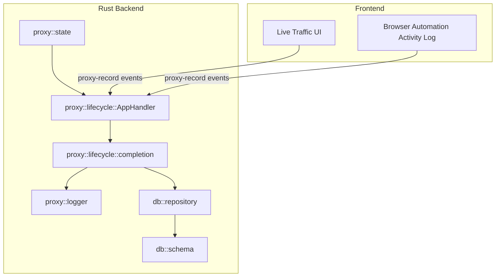
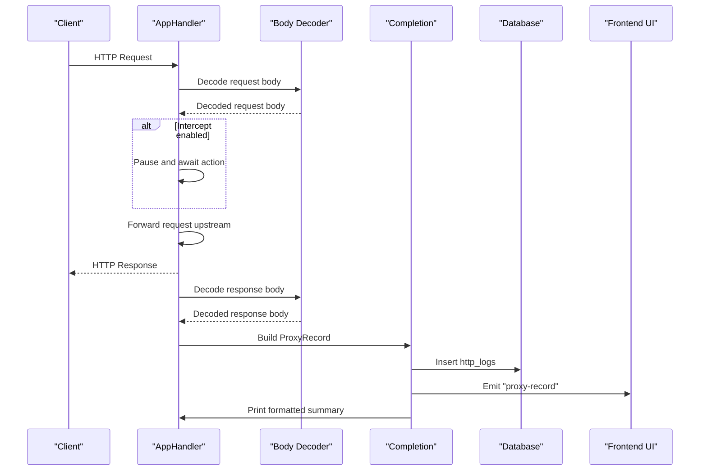
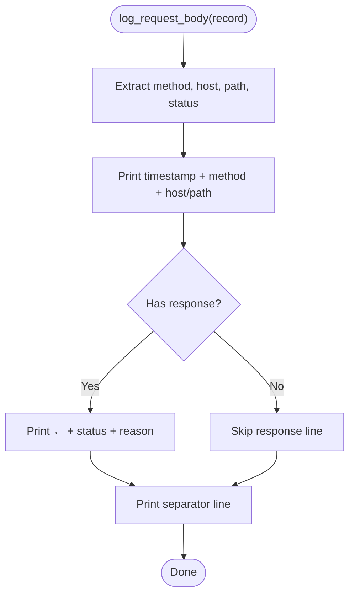
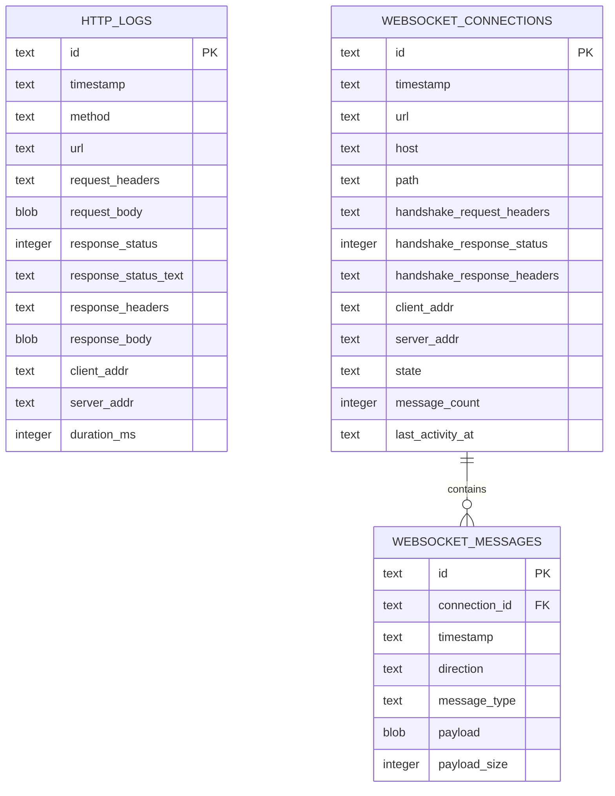
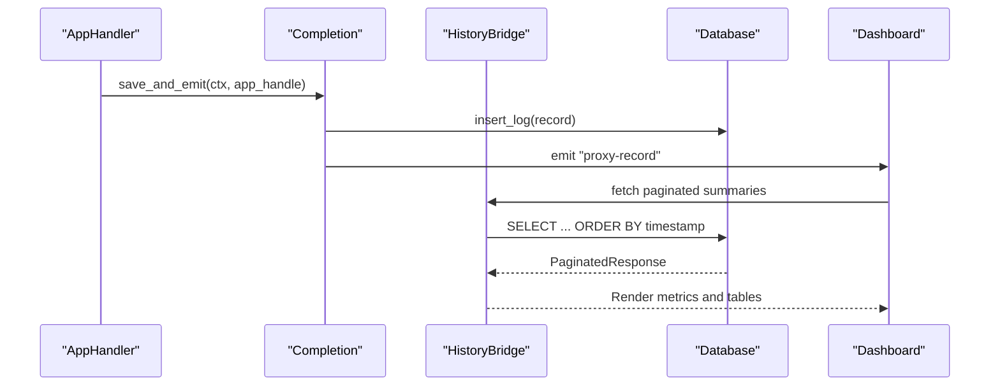
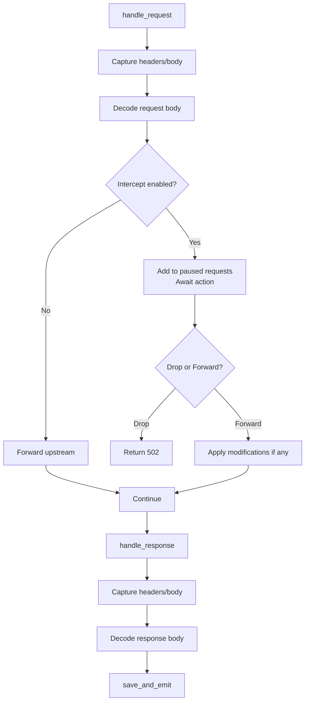
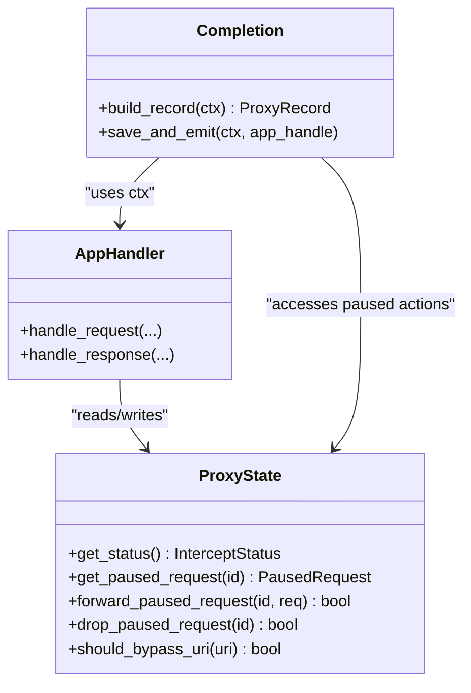
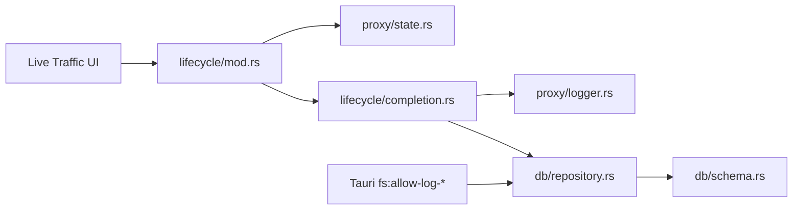

# Logging and Monitoring

<cite>
**Referenced Files in This Document**
- [logger.rs](file://src-tauri/src/proxy/logger.rs)
- [mod.rs](file://src-tauri/src/proxy/mod.rs)
- [state.rs](file://src-tauri/src/proxy/state.rs)
- [lifecycle/mod.rs](file://src-tauri/src/proxy/lifecycle/mod.rs)
- [lifecycle/completion.rs](file://src-tauri/src/proxy/lifecycle/completion.rs)
- [history/mod.rs](file://src-tauri/src/history/mod.rs)
- [repository.rs](file://src-tauri/src/db/repository.rs)
- [schema.rs](file://src-tauri/src/db/schema.rs)
- [lib.rs](file://src-tauri/src/lib.rs)
- [index.ts](file://src/types/index.ts)
- [desktop-schema.json](file://src-tauri/gen/schemas/desktop-schema.json)
- [macOS-schema.json](file://src-tauri/gen/schemas/macOS-schema.json)
</cite>

## Table of Contents
1. [Introduction](#introduction)
2. [Project Structure](#project-structure)
3. [Core Components](#core-components)
4. [Architecture Overview](#architecture-overview)
5. [Detailed Component Analysis](#detailed-component-analysis)
6. [Dependency Analysis](#dependency-analysis)
7. [Performance Considerations](#performance-considerations)
8. [Troubleshooting Guide](#troubleshooting-guide)
9. [Conclusion](#conclusion)
10. [Appendices](#appendices)

## Introduction
This document explains the proxy logging and monitoring capabilities of the application. It covers the logging infrastructure, log levels, structured logging formats, metrics collection, performance tracking, diagnostics, and operational utilities. It also describes how to set up custom logging handlers, implement monitoring dashboards, troubleshoot proxy issues via logs, and address performance, aggregation, and security concerns.

## Project Structure
The logging and monitoring system spans Rust backend modules and frontend TypeScript components:
- Rust proxy lifecycle captures requests and responses, decodes bodies, persists logs, emits events, and prints human-readable summaries.
- SQLite-backed persistence stores HTTP logs and WebSocket telemetry.
- Frontend components render logs, support filtering, and expose summaries for dashboards.
- Tauri capability schemas define filesystem permissions for log access.

**Diagram sources**
- [lifecycle/mod.rs:88-360](file://src-tauri/src/proxy/lifecycle/mod.rs#L88-L360)
- [lifecycle/completion.rs:35-76](file://src-tauri/src/proxy/lifecycle/completion.rs#L35-L76)
- [logger.rs:17-67](file://src-tauri/src/proxy/logger.rs#L17-L67)
- [state.rs:1-441](file://src-tauri/src/proxy/state.rs#L1-L441)
- [repository.rs:259-293](file://src-tauri/src/db/repository.rs#L259-L293)
- [schema.rs:1-176](file://src-tauri/src/db/schema.rs#L1-L176)

**Section sources**
- [lifecycle/mod.rs:88-360](file://src-tauri/src/proxy/lifecycle/mod.rs#L88-L360)
- [lifecycle/completion.rs:35-76](file://src-tauri/src/proxy/lifecycle/completion.rs#L35-L76)
- [logger.rs:17-67](file://src-tauri/src/proxy/logger.rs#L17-L67)
- [state.rs:1-441](file://src-tauri/src/proxy/state.rs#L1-L441)
- [repository.rs:259-293](file://src-tauri/src/db/repository.rs#L259-L293)
- [schema.rs:1-176](file://src-tauri/src/db/schema.rs#L1-L176)

## Core Components
- Proxy lifecycle handler: Captures request/response metadata, decodes bodies, optionally intercepts, and persists/emit records.
- Completion pipeline: Builds structured records, saves to database, emits events, and prints formatted summaries.
- Logger: Provides human-readable console output for request/response previews.
- State: Holds in-memory records and intercept controls; supports filtering and bypass patterns.
- Persistence: SQLite tables for HTTP logs and WebSocket telemetry with indices for efficient queries.
- History bridge: Aggregates summaries and paginates results for UI consumption.
- Types: Shared TypeScript interfaces define the shape of ProxyRecord and summaries.

**Section sources**
- [lifecycle/mod.rs:88-360](file://src-tauri/src/proxy/lifecycle/mod.rs#L88-L360)
- [lifecycle/completion.rs:10-76](file://src-tauri/src/proxy/lifecycle/completion.rs#L10-L76)
- [logger.rs:17-67](file://src-tauri/src/proxy/logger.rs#L17-L67)
- [state.rs:176-441](file://src-tauri/src/proxy/state.rs#L176-L441)
- [repository.rs:259-293](file://src-tauri/src/db/repository.rs#L259-L293)
- [history/mod.rs:136-191](file://src-tauri/src/history/mod.rs#L136-L191)
- [index.ts:66-112](file://src/types/index.ts#L66-L112)

## Architecture Overview
The proxy integrates with the Tauri runtime to capture, transform, persist, and visualize traffic. The flow below maps actual modules and their interactions.

**Diagram sources**
- [lifecycle/mod.rs:88-360](file://src-tauri/src/proxy/lifecycle/mod.rs#L88-L360)
- [lifecycle/completion.rs:35-76](file://src-tauri/src/proxy/lifecycle/completion.rs#L35-L76)
- [repository.rs:259-293](file://src-tauri/src/db/repository.rs#L259-L293)
- [logger.rs:37-67](file://src-tauri/src/proxy/logger.rs#L37-L67)

## Detailed Component Analysis

### Logging Infrastructure and Console Output
- Human-readable summaries: The logger prints request/response previews with timestamps, method, host/path, and response status. It truncates long bodies and prints separators for readability.
- Color-coded methods: Methods are color-coded for quick scanning.
- Body preview: Bodies are truncated to a safe length and printed dimmed for readability.

**Diagram sources**
- [logger.rs:37-67](file://src-tauri/src/proxy/logger.rs#L37-L67)

**Section sources**
- [logger.rs:17-67](file://src-tauri/src/proxy/logger.rs#L17-L67)

### Structured Logging Formats
- ProxyRecord: The canonical structured record includes identifiers, timestamps, client/server addresses, request/response metadata, and decoded content flags.
- HTTP logs schema: Persisted fields include method, URL, headers (JSON), request/response bodies (BLOB), client/server addresses, and optional duration placeholder.
- WebSocket telemetry: Connections and messages are stored with directional and type metadata, enabling timeline analysis.

**Diagram sources**
- [schema.rs:1-176](file://src-tauri/src/db/schema.rs#L1-L176)

**Section sources**
- [state.rs:29-37](file://src-tauri/src/proxy/state.rs#L29-L37)
- [repository.rs:259-293](file://src-tauri/src/db/repository.rs#L259-L293)
- [schema.rs:1-176](file://src-tauri/src/db/schema.rs#L1-L176)

### Metrics Collection and Diagnostics
- Event emission: On completion, the handler emits a "proxy-record" event carrying the ProxyRecord, enabling real-time UI updates and external subscribers.
- Summaries and pagination: The history service exposes paginated summaries and tree views for filtered queries, supporting dashboard metrics.
- WebSocket metrics: Connection counts, message counts, and last activity timestamps are tracked for WebSocket sessions.

**Diagram sources**
- [lifecycle/completion.rs:35-76](file://src-tauri/src/proxy/lifecycle/completion.rs#L35-L76)
- [repository.rs:535-570](file://src-tauri/src/db/repository.rs#L535-L570)
- [history/mod.rs:162-191](file://src-tauri/src/history/mod.rs#L162-L191)

**Section sources**
- [lifecycle/completion.rs:35-76](file://src-tauri/src/proxy/lifecycle/completion.rs#L35-L76)
- [history/mod.rs:136-191](file://src-tauri/src/history/mod.rs#L136-L191)
- [repository.rs:535-570](file://src-tauri/src/db/repository.rs#L535-L570)

### Proxy Lifecycle and Interception
- Request handling: Captures client/server addresses, headers, and body; decodes content if compressed; optionally pauses for interception.
- Response handling: Captures response metadata and body; decodes content; triggers completion pipeline.
- Interception: When enabled, requests are paused until explicit action (forward or drop) is taken.

**Diagram sources**
- [lifecycle/mod.rs:88-360](file://src-tauri/src/proxy/lifecycle/mod.rs#L88-L360)
- [lifecycle/completion.rs:35-76](file://src-tauri/src/proxy/lifecycle/completion.rs#L35-L76)

**Section sources**
- [lifecycle/mod.rs:88-360](file://src-tauri/src/proxy/lifecycle/mod.rs#L88-L360)

### Utility Functions for Debugging and Health Monitoring
- Proxy control: Start/stop proxy, resolve ports, and graceful shutdown signaling.
- State inspection: Retrieve intercept status, paused requests, and bypass patterns.
- Body decoding diagnostics: Errors and content encodings are logged during decode steps.

**Diagram sources**
- [state.rs:191-441](file://src-tauri/src/proxy/state.rs#L191-L441)
- [lifecycle/mod.rs:78-360](file://src-tauri/src/proxy/lifecycle/mod.rs#L78-L360)
- [lifecycle/completion.rs:10-76](file://src-tauri/src/proxy/lifecycle/completion.rs#L10-L76)

**Section sources**
- [mod.rs:66-187](file://src-tauri/src/proxy/mod.rs#L66-L187)
- [state.rs:191-441](file://src-tauri/src/proxy/state.rs#L191-L441)
- [lifecycle/mod.rs:88-360](file://src-tauri/src/proxy/lifecycle/mod.rs#L88-L360)

## Dependency Analysis
- Module dependencies: AppHandler depends on ProxyState for intercept controls and on completion for saving/emitting records. Completion depends on logger for console summaries and repository for persistence.
- Data dependencies: ProxyRecord is the central data model bridging lifecycle, completion, persistence, and UI.
- Capability permissions: Tauri schemas grant filesystem access to the log directory for read/write/metadata operations, enabling external log analysis and aggregation.

**Diagram sources**
- [lifecycle/mod.rs:88-360](file://src-tauri/src/proxy/lifecycle/mod.rs#L88-L360)
- [lifecycle/completion.rs:35-76](file://src-tauri/src/proxy/lifecycle/completion.rs#L35-L76)
- [logger.rs:17-67](file://src-tauri/src/proxy/logger.rs#L17-L67)
- [repository.rs:259-293](file://src-tauri/src/db/repository.rs#L259-L293)
- [schema.rs:1-176](file://src-tauri/src/db/schema.rs#L1-L176)
- [desktop-schema.json:780-4968](file://src-tauri/gen/schemas/desktop-schema.json#L780-L4968)
- [macOS-schema.json:780-4968](file://src-tauri/gen/schemas/macOS-schema.json#L780-L4968)

**Section sources**
- [lib.rs:38-50](file://src-tauri/src/lib.rs#L38-L50)
- [desktop-schema.json:780-4968](file://src-tauri/gen/schemas/desktop-schema.json#L780-L4968)
- [macOS-schema.json:780-4968](file://src-tauri/gen/schemas/macOS-schema.json#L780-L4968)

## Performance Considerations
- Logging overhead: Console printing and JSON serialization of headers add CPU and memory costs. Disable or reduce verbosity in production.
- Body handling: Large request/response bodies increase memory usage and IO. Consider streaming or truncation strategies for high-volume scenarios.
- Database writes: Batch inserts and WAL mode improve throughput; ensure appropriate indexing for frequent queries.
- Interception loops: Avoid enabling intercept for captive portal or internal loopback URIs to prevent unnecessary processing.

[No sources needed since this section provides general guidance]

## Troubleshooting Guide
- Proxy startup failures: Check port availability and CA creation errors; the proxy logs fatal errors and clears runtime state on failure.
- Missing logs in UI: Verify "proxy-record" events are emitted and the HistoryBridge is initialized; confirm database inserts succeed.
- Interception not working: Confirm intercept mode is enabled and paused requests are cleared after actions; check bypass patterns for matching URIs.
- WebSocket issues: Validate handshake detection and connection mapping keys; ensure message events are emitted and saved.
- Permission errors: Ensure Tauri capabilities include fs:allow-log-* permissions for read/write/metadata access to the log directory.

**Section sources**
- [mod.rs:93-187](file://src-tauri/src/proxy/mod.rs#L93-L187)
- [lifecycle/mod.rs:112-132](file://src-tauri/src/proxy/lifecycle/mod.rs#L112-L132)
- [lifecycle/mod.rs:320-327](file://src-tauri/src/proxy/lifecycle/mod.rs#L320-L327)
- [lifecycle/mod.rs:428-436](file://src-tauri/src/proxy/lifecycle/mod.rs#L428-L436)
- [desktop-schema.json:780-4968](file://src-tauri/gen/schemas/desktop-schema.json#L780-L4968)
- [macOS-schema.json:780-4968](file://src-tauri/gen/schemas/macOS-schema.json#L780-L4968)

## Conclusion
The proxy integrates a robust logging and monitoring stack: structured records, SQLite persistence, real-time event emission, and console summaries. With proper capability permissions and careful tuning of logging and interception, teams can observe traffic, diagnose issues, and build dashboards for operational insights.

[No sources needed since this section summarizes without analyzing specific files]

## Appendices

### Practical Examples

- Setting up custom logging handlers
  - Subscribe to "proxy-record" events in the frontend to feed analytics or external log collectors.
  - Example path: [lifecycle/completion.rs:66-76](file://src-tauri/src/proxy/lifecycle/completion.rs#L66-L76)

- Implementing monitoring dashboards
  - Use paginated summaries and tree views to power metrics panels and call tables.
  - Example path: [history/mod.rs:162-191](file://src-tauri/src/history/mod.rs#L162-L191)

- Troubleshooting proxy issues through log analysis
  - Inspect decoded body warnings and content encodings during request/response handling.
  - Example path: [lifecycle/mod.rs:159-171](file://src-tauri/src/proxy/lifecycle/mod.rs#L159-L171), [lifecycle/mod.rs:339-352](file://src-tauri/src/proxy/lifecycle/mod.rs#L339-L352)

- Performance impact of logging
  - Reduce console output in production; offload heavy logs to external systems.
  - Example path: [logger.rs:17-67](file://src-tauri/src/proxy/logger.rs#L17-L67)

- Log aggregation strategies
  - Use Tauri fs:allow-log-* capabilities to read/write/metadata log directory for centralized collection.
  - Example path: [desktop-schema.json:780-4968](file://src-tauri/gen/schemas/desktop-schema.json#L780-L4968), [macOS-schema.json:780-4968](file://src-tauri/gen/schemas/macOS-schema.json#L780-L4968)

- Security considerations for sensitive traffic data
  - Avoid logging sensitive headers/body; sanitize or redact where necessary.
  - Limit filesystem access to the log directory; review capability permissions regularly.
  - Example path: [desktop-schema.json:780-4968](file://src-tauri/gen/schemas/desktop-schema.json#L780-L4968), [macOS-schema.json:780-4968](file://src-tauri/gen/schemas/macOS-schema.json#L780-L4968)