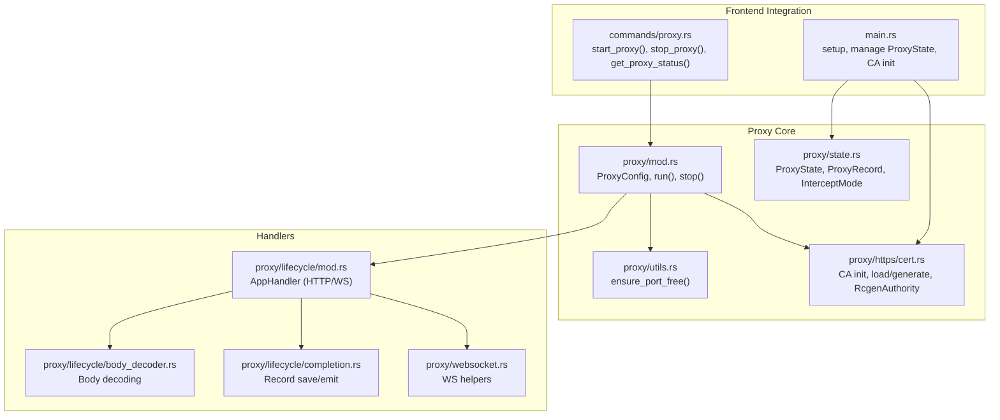
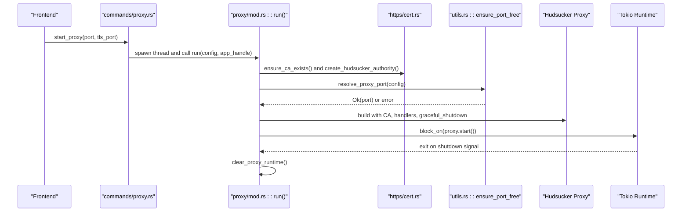
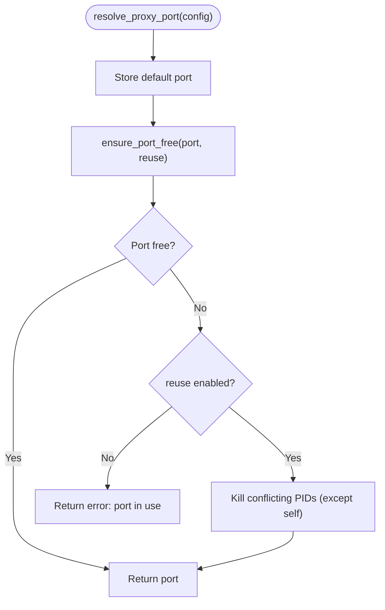
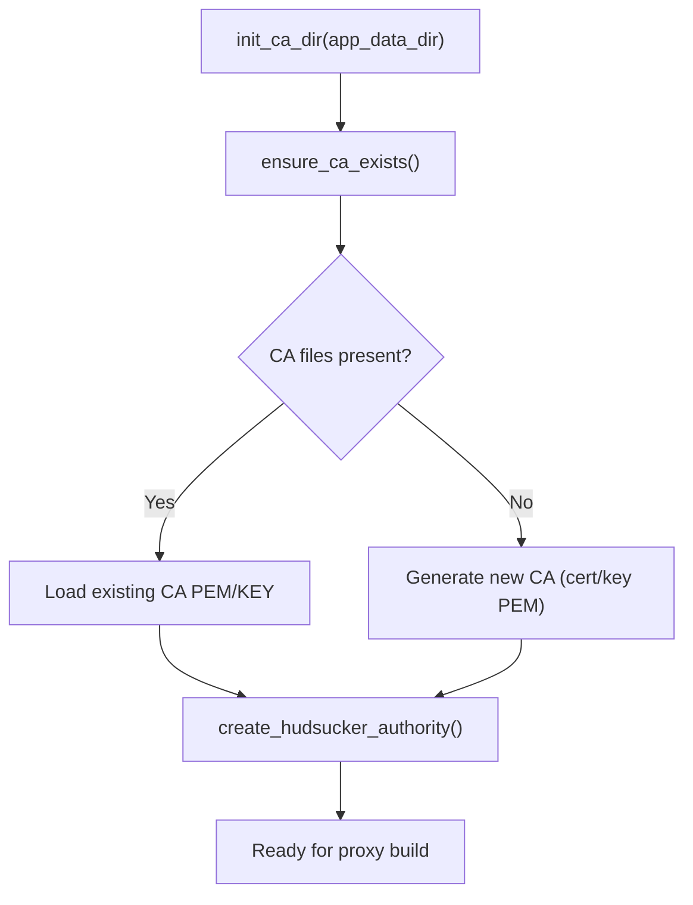
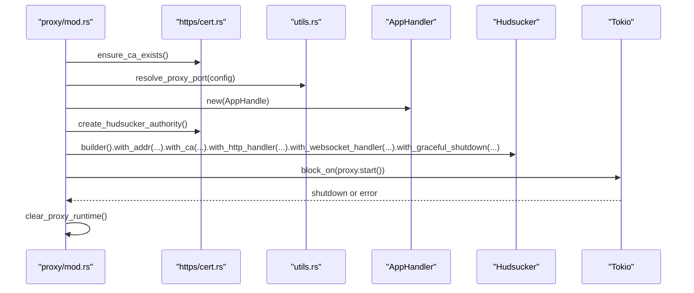
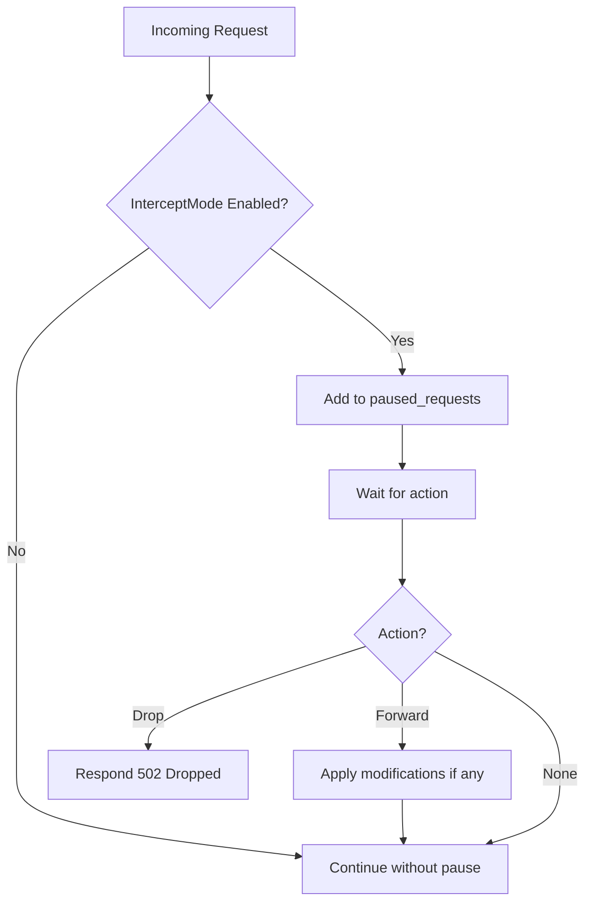
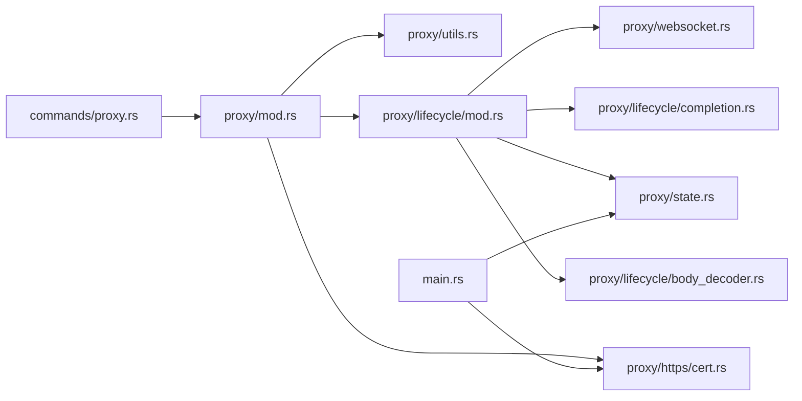

# Proxy Configuration

<cite>
**Referenced Files in This Document**
- [mod.rs](file://src-tauri/src/proxy/mod.rs)
- [state.rs](file://src-tauri/src/proxy/state.rs)
- [lifecycle/mod.rs](file://src-tauri/src/proxy/lifecycle/mod.rs)
- [lifecycle/completion.rs](file://src-tauri/src/proxy/lifecycle/completion.rs)
- [lifecycle/body_decoder.rs](file://src-tauri/src/proxy/lifecycle/body_decoder.rs)
- [websocket.rs](file://src-tauri/src/proxy/websocket.rs)
- [utils.rs](file://src-tauri/src/proxy/utils.rs)
- [https/cert.rs](file://src-tauri/src/proxy/https/cert.rs)
- [intercept/hooks.rs](file://src-tauri/src/proxy/intercept/hooks.rs)
- [commands/proxy.rs](file://src-tauri/src/commands/proxy.rs)
- [main.rs](file://src-tauri/src/main.rs)
- [Cargo.toml](file://src-tauri/Cargo.toml)
</cite>

## Table of Contents
1. [Introduction](#introduction)
2. [Project Structure](#project-structure)
3. [Core Components](#core-components)
4. [Architecture Overview](#architecture-overview)
5. [Detailed Component Analysis](#detailed-component-analysis)
6. [Dependency Analysis](#dependency-analysis)
7. [Performance Considerations](#performance-considerations)
8. [Troubleshooting Guide](#troubleshooting-guide)
9. [Conclusion](#conclusion)

## Introduction
This document explains the proxy configuration system used by the application. It covers the ProxyConfig structure, port resolution and reuse semantics, TLS configuration via a generated CA, and the proxy startup sequence. It also details runtime state management, graceful shutdown, and practical examples for configuring different proxy modes, handling port availability, and managing the proxy lifecycle. Configuration validation, error handling during startup, and recovery strategies are included to help operators reliably operate the proxy.

## Project Structure
The proxy subsystem is implemented in Rust under the Tauri application’s backend. Key areas:
- Proxy orchestration and configuration: proxy/mod.rs
- Runtime state and filtering: proxy/state.rs
- HTTP/WebSocket lifecycle handlers: proxy/lifecycle/*
- TLS certificate generation and CA integration: proxy/https/cert.rs
- Port allocation and conflict detection: proxy/utils.rs
- Frontend integration via Tauri commands: commands/proxy.rs
- Application bootstrap and CA initialization: main.rs

**Diagram sources**
- [mod.rs:26-187](file://src-tauri/src/proxy/mod.rs#L26-L187)
- [state.rs:176-440](file://src-tauri/src/proxy/state.rs#L176-L440)
- [utils.rs:3-40](file://src-tauri/src/proxy/utils.rs#L3-L40)
- [https/cert.rs:11-143](file://src-tauri/src/proxy/https/cert.rs#L11-L143)
- [lifecycle/mod.rs:71-360](file://src-tauri/src/proxy/lifecycle/mod.rs#L71-L360)
- [lifecycle/body_decoder.rs:24-90](file://src-tauri/src/proxy/lifecycle/body_decoder.rs#L24-L90)
- [lifecycle/completion.rs:35-76](file://src-tauri/src/proxy/lifecycle/completion.rs#L35-L76)
- [websocket.rs:9-136](file://src-tauri/src/proxy/websocket.rs#L9-L136)
- [commands/proxy.rs:15-73](file://src-tauri/src/commands/proxy.rs#L15-L73)
- [main.rs:36-51](file://src-tauri/src/main.rs#L36-L51)

**Section sources**
- [mod.rs:1-187](file://src-tauri/src/proxy/mod.rs#L1-L187)
- [state.rs:1-441](file://src-tauri/src/proxy/state.rs#L1-L441)
- [utils.rs:1-41](file://src-tauri/src/proxy/utils.rs#L1-L41)
- [https/cert.rs:1-144](file://src-tauri/src/proxy/https/cert.rs#L1-L144)
- [lifecycle/mod.rs:1-453](file://src-tauri/src/proxy/lifecycle/mod.rs#L1-L453)
- [lifecycle/completion.rs:1-118](file://src-tauri/src/proxy/lifecycle/completion.rs#L1-L118)
- [lifecycle/body_decoder.rs:1-418](file://src-tauri/src/proxy/lifecycle/body_decoder.rs#L1-L418)
- [websocket.rs:1-187](file://src-tauri/src/proxy/websocket.rs#L1-L187)
- [commands/proxy.rs:1-74](file://src-tauri/src/commands/proxy.rs#L1-L74)
- [main.rs:1-184](file://src-tauri/src/main.rs#L1-L184)

## Core Components
- ProxyConfig: Defines the HTTP port, TLS port, and reuse behavior. Defaults include HTTP port 8888 and TLS port 8889. Reuse controls whether to auto-kill conflicting processes.
- Port resolution: Validates port availability and optionally kills conflicting processes when reuse is enabled.
- TLS configuration: Generates or loads a CA and builds an authority for Hudsucker’s HTTPS MITM.
- Startup sequence: Initializes CA, resolves ports, sets up graceful shutdown, constructs Hudsucker proxy, and runs it on a blocking Tokio runtime.
- Runtime state: Tracks intercepted requests, filtering, and emits events to the frontend.
- Graceful shutdown: Uses a oneshot channel to signal shutdown and clears runtime state.

**Section sources**
- [mod.rs:26-91](file://src-tauri/src/proxy/mod.rs#L26-L91)
- [utils.rs:3-40](file://src-tauri/src/proxy/utils.rs#L3-L40)
- [https/cert.rs:106-118](file://src-tauri/src/proxy/https/cert.rs#L106-L118)
- [lifecycle/mod.rs:88-360](file://src-tauri/src/proxy/lifecycle/mod.rs#L88-L360)
- [state.rs:176-440](file://src-tauri/src/proxy/state.rs#L176-L440)

## Architecture Overview
The proxy integrates tightly with Tauri. The frontend invokes commands to start/stop the proxy. The backend spawns a thread to run the proxy with Hudsucker, which intercepts HTTP and WebSocket traffic. The lifecycle handler decodes request/response bodies, optionally pauses for interception, and persists/streams events to the frontend.

**Diagram sources**
- [commands/proxy.rs:15-52](file://src-tauri/src/commands/proxy.rs#L15-L52)
- [mod.rs:93-187](file://src-tauri/src/proxy/mod.rs#L93-L187)
- [https/cert.rs:131-118](file://src-tauri/src/proxy/https/cert.rs#L131-L118)
- [utils.rs:3-40](file://src-tauri/src/proxy/utils.rs#L3-L40)

## Detailed Component Analysis

### ProxyConfig and Port Allocation
- Fields:
  - port: HTTP proxy port
  - reuse: If true, auto-kill processes currently using the port
  - tls_port: HTTPS MITM port (not directly enforced by port resolution)
- Default values:
  - port defaults to 8888
  - tls_port defaults to 8889
- Port resolution:
  - Stores the default port in a global atomically-accessed variable
  - Calls ensure_port_free to validate availability
  - On reuse=true, kills conflicting processes; otherwise returns an error
- Active port tracking:
  - After successful start, the active port is stored globally
  - Stop clears the active port and sends a shutdown signal

**Diagram sources**
- [mod.rs:51-56](file://src-tauri/src/proxy/mod.rs#L51-L56)
- [utils.rs:3-40](file://src-tauri/src/proxy/utils.rs#L3-L40)

**Section sources**
- [mod.rs:26-91](file://src-tauri/src/proxy/mod.rs#L26-L91)
- [utils.rs:3-40](file://src-tauri/src/proxy/utils.rs#L3-L40)

### TLS Configuration and CA Management
- CA initialization:
  - The CA directory is initialized from the app data directory
  - If CA files are missing, they are regenerated
- Authority creation:
  - Loads CA cert/key and creates an RcgenAuthority for Hudsucker
- Export:
  - Provides PEM exports for distribution/trust

**Diagram sources**
- [https/cert.rs:11-143](file://src-tauri/src/proxy/https/cert.rs#L11-L143)
- [main.rs:36-36](file://src-tauri/src/main.rs#L36-L36)

**Section sources**
- [https/cert.rs:11-143](file://src-tauri/src/proxy/https/cert.rs#L11-L143)
- [main.rs:36-36](file://src-tauri/src/main.rs#L36-L36)

### Proxy Startup Sequence and Runtime State
- Startup:
  - Ensures CA exists
  - Resolves port and validates reuse
  - Sets up graceful shutdown channel
  - Builds Hudsucker proxy with HTTP and WebSocket handlers and CA
  - Starts on a blocking Tokio runtime
- Runtime state:
  - Maintains a global ProxyState with records, intercept mode, and paused requests
  - Emits events to the frontend and persists to history
- Lifecycle handler:
  - Reads and decodes request/response bodies
  - Optionally pauses requests for interception
  - Saves and emits records and WebSocket messages

**Diagram sources**
- [mod.rs:93-187](file://src-tauri/src/proxy/mod.rs#L93-L187)
- [https/cert.rs:131-118](file://src-tauri/src/proxy/https/cert.rs#L131-L118)
- [utils.rs:3-40](file://src-tauri/src/proxy/utils.rs#L3-L40)
- [lifecycle/mod.rs:78-86](file://src-tauri/src/proxy/lifecycle/mod.rs#L78-L86)

**Section sources**
- [mod.rs:93-187](file://src-tauri/src/proxy/mod.rs#L93-L187)
- [lifecycle/mod.rs:88-360](file://src-tauri/src/proxy/lifecycle/mod.rs#L88-L360)
- [state.rs:176-440](file://src-tauri/src/proxy/state.rs#L176-L440)

### Interception Modes and Bypass Patterns
- InterceptMode:
  - Disabled or Enabled
  - Controls whether requests are paused for inspection
- Paused requests:
  - When enabled, requests are added to a paused queue
  - Actions include forwarding (optionally modified) or dropping
- Bypass patterns:
  - Captive portal detection and custom patterns
  - Requests matching bypass patterns skip interception

**Diagram sources**
- [lifecycle/mod.rs:182-266](file://src-tauri/src/proxy/lifecycle/mod.rs#L182-L266)
- [state.rs:123-144](file://src-tauri/src/proxy/state.rs#L123-L144)
- [intercept/hooks.rs:12-20](file://src-tauri/src/proxy/intercept/hooks.rs#L12-L20)

**Section sources**
- [lifecycle/mod.rs:182-266](file://src-tauri/src/proxy/lifecycle/mod.rs#L182-L266)
- [state.rs:123-144](file://src-tauri/src/proxy/state.rs#L123-L144)
- [intercept/hooks.rs:1-21](file://src-tauri/src/proxy/intercept/hooks.rs#L1-L21)

### Practical Configuration Examples
- Start with defaults:
  - HTTP port 8888, HTTPS MITM port 8889
  - Reuse enabled by default in the command wrapper
- Change HTTP port:
  - Pass a custom port to start_proxy; ensure port is free or enable reuse
- Handle port conflicts:
  - reuse=true auto-kills other processes on the port (except the current process)
  - reuse=false returns an error listing conflicting PIDs
- Configure TLS:
  - Ensure CA exists; the system generates or reloads CA automatically
  - Use the exported CA PEM to trust the proxy in browsers or clients
- Manage lifecycle:
  - Start proxy via start_proxy
  - Check status via get_proxy_status
  - Stop proxy via stop_proxy

**Section sources**
- [mod.rs:83-91](file://src-tauri/src/proxy/mod.rs#L83-L91)
- [commands/proxy.rs:15-52](file://src-tauri/src/commands/proxy.rs#L15-L52)
- [utils.rs:3-40](file://src-tauri/src/proxy/utils.rs#L3-L40)
- [https/cert.rs:131-143](file://src-tauri/src/proxy/https/cert.rs#L131-L143)

## Dependency Analysis
- Internal dependencies:
  - proxy/mod.rs depends on utils.rs for port checks, https/cert.rs for CA, lifecycle/mod.rs for handlers, and tokio for runtime
  - lifecycle/mod.rs depends on lifecycle/body_decoder.rs for decoding and lifecycle/completion.rs for persistence/emission
  - websocket.rs supports WebSocket parsing and event emission
  - state.rs provides shared runtime state
- External dependencies:
  - Hudsucker for proxying and TLS MITM
  - Tokio for async runtime
  - rcgen for certificate authority
  - Hyper/Tokio-Tungstenite for HTTP/WS handling

**Diagram sources**
- [mod.rs:15-22](file://src-tauri/src/proxy/mod.rs#L15-L22)
- [Cargo.toml:27-49](file://src-tauri/Cargo.toml#L27-L49)

**Section sources**
- [Cargo.toml:11-62](file://src-tauri/Cargo.toml#L11-L62)

## Performance Considerations
- Body decoding:
  - Decoding gzip/br/zstd and chunked bodies adds CPU overhead; consider disabling interception for high-throughput scenarios
- Event emission:
  - Frequent proxy events can impact UI responsiveness; batch or throttle as needed
- TLS overhead:
  - HTTPS MITM introduces per-request overhead; ensure adequate CPU resources
- Port reuse:
  - Auto-killing other processes can interrupt long-running sessions; prefer explicit port selection and reuse only when safe

## Troubleshooting Guide
- Port already in use:
  - Enable reuse to auto-kill conflicting processes; otherwise change the port
  - Error messages include the conflicting PIDs
- CA issues:
  - If CA files are missing or corrupted, the system regenerates them automatically
  - Export the CA PEM and install it in your browser/client trust store
- Proxy fails to start:
  - Check logs for fatal errors during CA creation, proxy build, or runtime creation
  - Verify OS-level firewall and permissions
- Graceful shutdown:
  - stop_proxy sends a shutdown signal; ensure the proxy is running and the channel is available
  - After shutdown, active port is cleared and the shutdown handle is reset

**Section sources**
- [utils.rs:3-40](file://src-tauri/src/proxy/utils.rs#L3-L40)
- [https/cert.rs:131-143](file://src-tauri/src/proxy/https/cert.rs#L131-L143)
- [mod.rs:93-187](file://src-tauri/src/proxy/mod.rs#L93-L187)
- [commands/proxy.rs:54-73](file://src-tauri/src/commands/proxy.rs#L54-L73)

## Conclusion
The proxy configuration system centers on a clean separation of concerns: configuration and lifecycle orchestration in proxy/mod.rs, robust port handling in utils.rs, TLS CA management in https/cert.rs, and rich runtime state in state.rs. The Hudsucker-backed lifecycle handlers provide flexible interception and eventing, while Tauri commands offer a straightforward interface for controlling the proxy from the frontend. By leveraging reuse semantics, default ports, and automatic CA management, operators can reliably start, monitor, and stop the proxy with minimal friction.