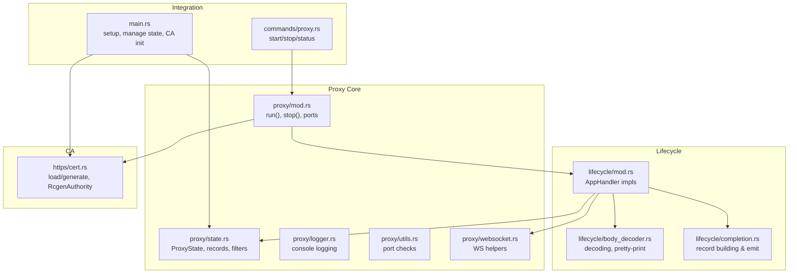
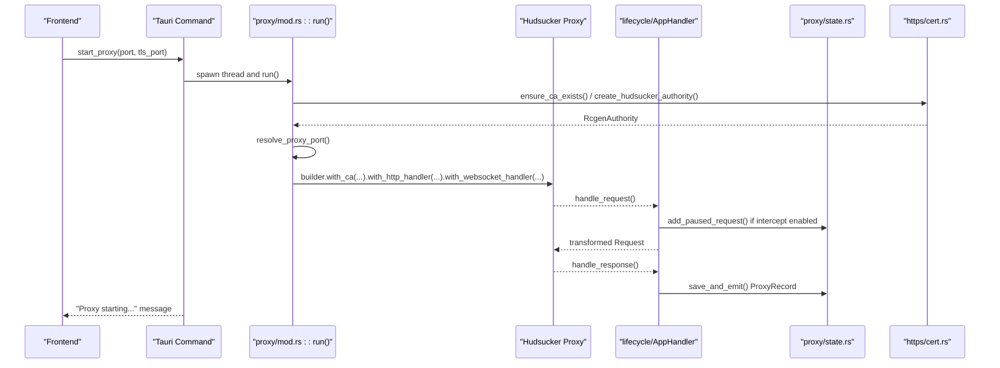
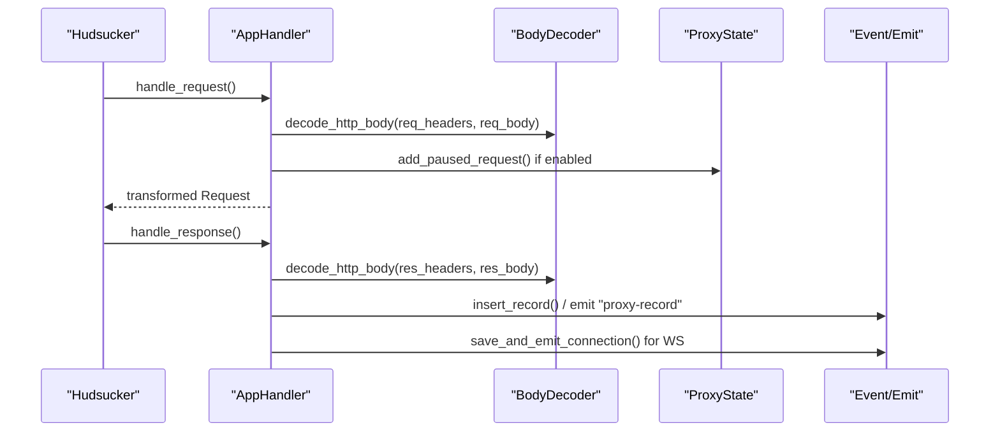
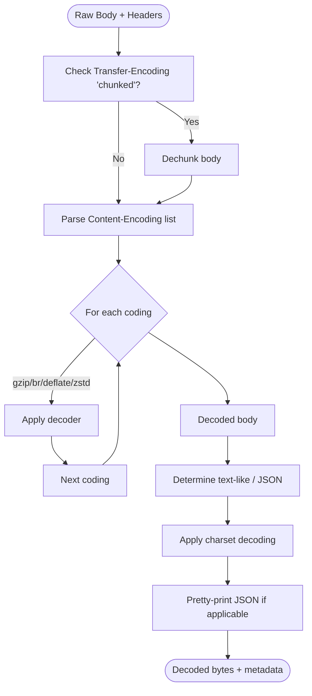
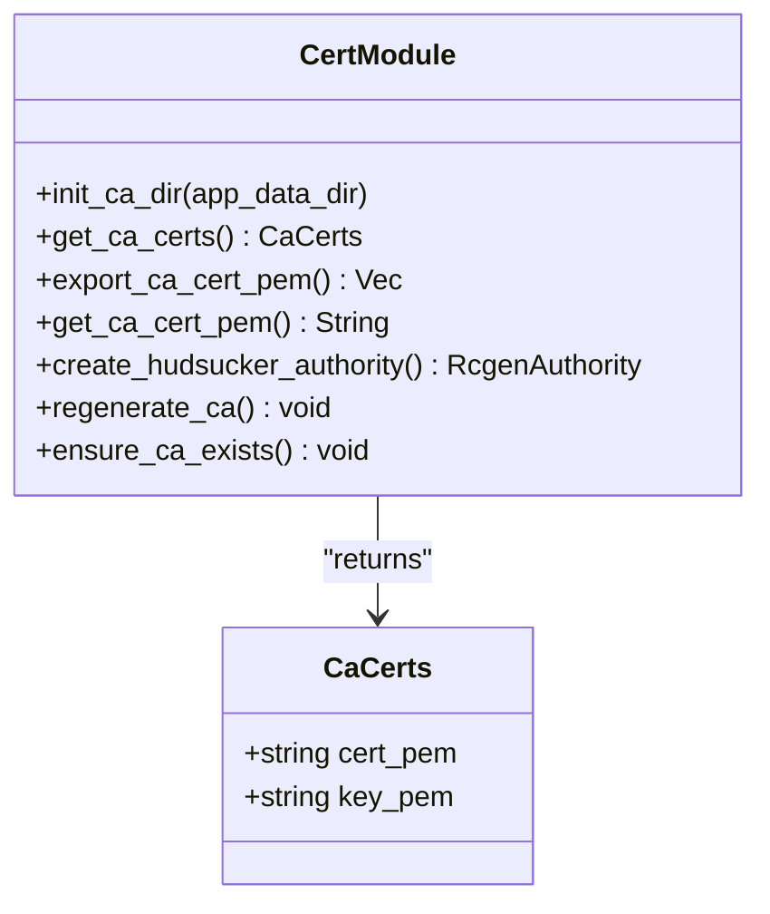
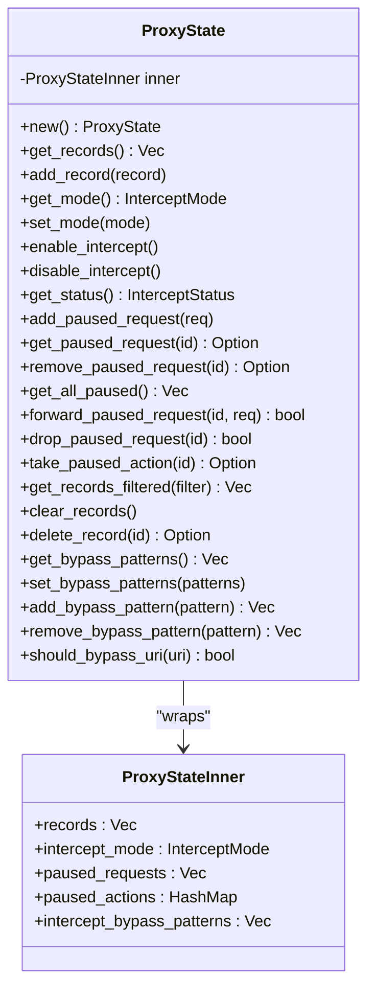
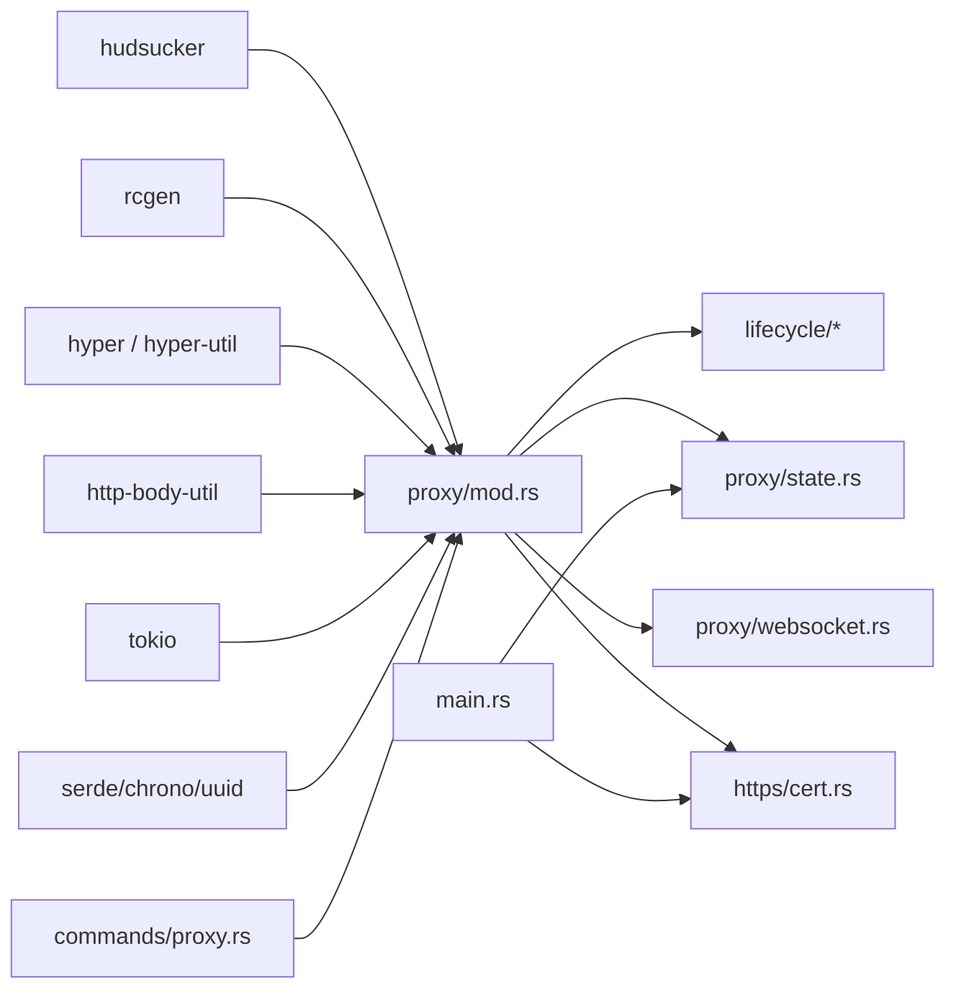

# Proxy Engine

<cite>
**Referenced Files in This Document**
- [mod.rs](file://src-tauri/src/proxy/mod.rs)
- [state.rs](file://src-tauri/src/proxy/state.rs)
- [logger.rs](file://src-tauri/src/proxy/logger.rs)
- [utils.rs](file://src-tauri/src/proxy/utils.rs)
- [websocket.rs](file://src-tauri/src/proxy/websocket.rs)
- [lifecycle/mod.rs](file://src-tauri/src/proxy/lifecycle/mod.rs)
- [lifecycle/body_decoder.rs](file://src-tauri/src/proxy/lifecycle/body_decoder.rs)
- [lifecycle/completion.rs](file://src-tauri/src/proxy/lifecycle/completion.rs)
- [intercept/mod.rs](file://src-tauri/src/proxy/intercept/mod.rs)
- [intercept/hooks.rs](file://src-tauri/src/proxy/intercept/hooks.rs)
- [https/cert.rs](file://src-tauri/src/proxy/https/cert.rs)
- [commands/proxy.rs](file://src-tauri/src/commands/proxy.rs)
- [main.rs](file://src-tauri/src/main.rs)
- [Cargo.toml](file://src-tauri/Cargo.toml)
</cite>

## Table of Contents
1. [Introduction](#introduction)
2. [Project Structure](#project-structure)
3. [Core Components](#core-components)
4. [Architecture Overview](#architecture-overview)
5. [Detailed Component Analysis](#detailed-component-analysis)
6. [Dependency Analysis](#dependency-analysis)
7. [Performance Considerations](#performance-considerations)
8. [Troubleshooting Guide](#troubleshooting-guide)
9. [Conclusion](#conclusion)
10. [Appendices](#appendices)

## Introduction
This document describes AppRecon’s proxy engine built on the Hudsucker framework. It covers the MITM proxy implementation, including configuration, lifecycle management, traffic interception, body decoding, certificate authority integration, logging, and graceful shutdown. It also provides guidance for extending the engine with custom middleware and optimizing performance.

## Project Structure
The proxy engine resides under the Tauri backend in the zeroxbuffer crate. Key areas:
- Proxy orchestration and configuration
- State management for intercepted requests and records
- Lifecycle handlers for HTTP and WebSocket traffic
- Body decoding utilities
- Certificate Authority generation and integration
- Tauri commands to start/stop the proxy and query status
- Application initialization wiring CA and state into the app



**Diagram sources**
- [mod.rs:93-187](file://src-tauri/src/proxy/mod.rs#L93-L187)
- [state.rs:191-440](file://src-tauri/src/proxy/state.rs#L191-L440)
- [logger.rs:1-68](file://src-tauri/src/proxy/logger.rs#L1-L68)
- [utils.rs:1-41](file://src-tauri/src/proxy/utils.rs#L1-L41)
- [websocket.rs:1-187](file://src-tauri/src/proxy/websocket.rs#L1-L187)
- [lifecycle/mod.rs:88-360](file://src-tauri/src/proxy/lifecycle/mod.rs#L88-L360)
- [lifecycle/body_decoder.rs:24-90](file://src-tauri/src/proxy/lifecycle/body_decoder.rs#L24-L90)
- [lifecycle/completion.rs:35-76](file://src-tauri/src/proxy/lifecycle/completion.rs#L35-L76)
- [https/cert.rs:106-118](file://src-tauri/src/proxy/https/cert.rs#L106-L118)
- [commands/proxy.rs:15-73](file://src-tauri/src/commands/proxy.rs#L15-L73)
- [main.rs:36-51](file://src-tauri/src/main.rs#L36-L51)

**Section sources**
- [mod.rs:1-188](file://src-tauri/src/proxy/mod.rs#L1-L188)
- [Cargo.toml:27-32](file://src-tauri/Cargo.toml#L27-L32)

## Core Components
- Proxy orchestration and lifecycle
  - Starts/stops the Hudsucker proxy, manages ports, and graceful shutdown via oneshot channel.
  - Exposes active/default ports and helper to ensure port availability.
- State management
  - Thread-safe in-memory store for HTTP transactions, intercept mode, paused requests, and bypass patterns.
  - Filtering support for URI scope, methods, status codes, and search terms.
- Traffic lifecycle
  - HTTP handler captures request/response bodies, decodes content encodings, and optionally modifies requests during intercept.
  - WebSocket handler tracks connections/messages and emits events.
- Body decoding
  - Handles chunked transfer, gzip, br, deflate, zstd, charset-aware text decoding, and JSON pretty-printing.
- Certificate Authority
  - Generates and loads a root CA PEM pair, integrates with Hudsucker’s RcgenAuthority.
- Logging
  - Console logs for request/response summaries and body previews.
- Tauri integration
  - Commands to start/stop proxy and query runtime status.
  - Application setup wires CA directory and state into the app.

**Section sources**
- [mod.rs:26-187](file://src-tauri/src/proxy/mod.rs#L26-L187)
- [state.rs:176-440](file://src-tauri/src/proxy/state.rs#L176-L440)
- [lifecycle/mod.rs:88-360](file://src-tauri/src/proxy/lifecycle/mod.rs#L88-L360)
- [lifecycle/body_decoder.rs:24-90](file://src-tauri/src/proxy/lifecycle/body_decoder.rs#L24-L90)
- [https/cert.rs:106-118](file://src-tauri/src/proxy/https/cert.rs#L106-L118)
- [logger.rs:17-67](file://src-tauri/src/proxy/logger.rs#L17-L67)
- [commands/proxy.rs:15-73](file://src-tauri/src/commands/proxy.rs#L15-L73)
- [main.rs:36-51](file://src-tauri/src/main.rs#L36-L51)

## Architecture Overview
The proxy engine is a layered system:
- Orchestration layer initializes the CA, resolves ports, builds the Hudsucker proxy, and runs it on a dedicated Tokio runtime.
- Lifecycle layer implements Hudsucker’s HttpHandler and WebSocketHandler to intercept and transform traffic.
- State layer persists records and controls intercept behavior.
- CA layer generates and supplies a root certificate authority for HTTPS MITM.
- Tauri layer exposes commands to control the proxy and integrates state and CA into the app.



**Diagram sources**
- [commands/proxy.rs:15-52](file://src-tauri/src/commands/proxy.rs#L15-L52)
- [mod.rs:93-187](file://src-tauri/src/proxy/mod.rs#L93-L187)
- [https/cert.rs:106-118](file://src-tauri/src/proxy/https/cert.rs#L106-L118)
- [lifecycle/mod.rs:88-360](file://src-tauri/src/proxy/lifecycle/mod.rs#L88-L360)
- [state.rs:191-440](file://src-tauri/src/proxy/state.rs#L191-L440)

## Detailed Component Analysis

### Proxy Orchestration and Lifecycle
- Startup sequence
  - Ensures CA exists, resolves port availability, sets up graceful shutdown channel, constructs Hudsucker builder with CA, handlers, and TLS connector, spawns a blocking Tokio runtime, and starts the proxy.
- Shutdown
  - Sends a oneshot signal to trigger graceful shutdown and clears runtime state.
- Port resolution
  - Stores default and active ports, validates port availability, and supports optional reuse by killing conflicting processes.

```mermaid
flowchart TD
Start([Start run(config)]) --> EnsureCA["ensure_ca_exists()"]
EnsureCA --> ResolvePort["resolve_proxy_port(config)"]
ResolvePort --> PortOK{"Port free?"}
PortOK --> |No| Fatal["Print fatal and clear runtime"]
PortOK --> |Yes| Build["Build Hudsucker Proxy"]
Build --> Runtime["Create Tokio Runtime"]
Runtime --> StartProxy["proxy.start() await"]
StartProxy --> Clear["clear_proxy_runtime()"]
Fatal --> End([Exit])
Clear --> End
```

**Diagram sources**
- [mod.rs:93-187](file://src-tauri/src/proxy/mod.rs#L93-L187)
- [utils.rs:3-40](file://src-tauri/src/proxy/utils.rs#L3-L40)
- [https/cert.rs:131-143](file://src-tauri/src/proxy/https/cert.rs#L131-L143)

**Section sources**
- [mod.rs:93-187](file://src-tauri/src/proxy/mod.rs#L93-L187)
- [utils.rs:3-40](file://src-tauri/src/proxy/utils.rs#L3-L40)

### Traffic Interception and Request/Response Pipeline
- Request handling
  - Captures client/server addresses, method, URI, headers, and body.
  - Detects WebSocket upgrades and records handshake metadata.
  - Decodes request body based on headers (transfer/content encodings).
  - Applies intercept logic: pause, forward with modifications, or drop.
- Response handling
  - Captures status, headers, and body.
  - Decodes response body similarly and optionally records the transaction.
- WebSocket handling
  - Tracks connection keys, emits messages, and cleans up on close.



**Diagram sources**
- [lifecycle/mod.rs:88-360](file://src-tauri/src/proxy/lifecycle/mod.rs#L88-L360)
- [lifecycle/body_decoder.rs:24-90](file://src-tauri/src/proxy/lifecycle/body_decoder.rs#L24-L90)
- [lifecycle/completion.rs:35-76](file://src-tauri/src/proxy/lifecycle/completion.rs#L35-L76)
- [websocket.rs:27-60](file://src-tauri/src/proxy/websocket.rs#L27-L60)
- [state.rs:191-440](file://src-tauri/src/proxy/state.rs#L191-L440)

**Section sources**
- [lifecycle/mod.rs:88-360](file://src-tauri/src/proxy/lifecycle/mod.rs#L88-L360)
- [lifecycle/body_decoder.rs:24-90](file://src-tauri/src/proxy/lifecycle/body_decoder.rs#L24-L90)
- [lifecycle/completion.rs:35-76](file://src-tauri/src/proxy/lifecycle/completion.rs#L35-L76)
- [websocket.rs:27-60](file://src-tauri/src/proxy/websocket.rs#L27-L60)

### Body Decoding Mechanisms
- Transfer-encoding
  - Detects chunked bodies and dechunks when applicable.
- Content-encodings
  - Supports gzip, br, deflate, zstd; logs decode errors and marks content_decoded.
- Content-type and charset
  - Determines text-like types, applies charset decoding, and pretty-prints JSON.
- Encoding round-trips
  - Provides encode_body for supported encodings.



**Diagram sources**
- [lifecycle/body_decoder.rs:24-90](file://src-tauri/src/proxy/lifecycle/body_decoder.rs#L24-L90)
- [lifecycle/body_decoder.rs:178-253](file://src-tauri/src/proxy/lifecycle/body_decoder.rs#L178-L253)
- [lifecycle/body_decoder.rs:255-306](file://src-tauri/src/proxy/lifecycle/body_decoder.rs#L255-L306)

**Section sources**
- [lifecycle/body_decoder.rs:24-90](file://src-tauri/src/proxy/lifecycle/body_decoder.rs#L24-L90)

### Certificate Authority Integration
- CA directory initialization
  - Initializes a persistent CA directory under the app data path.
- Load or generate
  - Loads existing PEM files or generates a new root CA with rcgen, writes to disk, and caches.
- Hudsucker authority
  - Reads PEM/key and constructs an RcgenAuthority compatible with Hudsucker and rustls provider.
- Export and regeneration
  - Exposes export and regenerate helpers for distribution and recovery.



**Diagram sources**
- [https/cert.rs:11-143](file://src-tauri/src/proxy/https/cert.rs#L11-L143)

**Section sources**
- [https/cert.rs:11-143](file://src-tauri/src/proxy/https/cert.rs#L11-L143)
- [main.rs:36-36](file://src-tauri/src/main.rs#L36-L36)

### Proxy State Management
- Records
  - Stores ProxyRecord with request/response bodies and metadata.
- Intercept
  - Toggle mode, paused requests, and per-request actions (forward/drop).
- Filters
  - Scope-based filtering for hosts, methods, status codes, and search terms.
- Bypass patterns
  - Configurable patterns to skip interception, including captive portal detection.



**Diagram sources**
- [state.rs:176-440](file://src-tauri/src/proxy/state.rs#L176-L440)

**Section sources**
- [state.rs:176-440](file://src-tauri/src/proxy/state.rs#L176-L440)
- [intercept/hooks.rs:1-21](file://src-tauri/src/proxy/intercept/hooks.rs#L1-L21)

### Logging and Observability
- Console logging
  - Colorized request summaries, response status, and body previews.
  - Emits structured logs around WS handshakes and message events.
- Event emission
  - Emits proxy records and WS events to the frontend for UI updates.

**Section sources**
- [logger.rs:17-67](file://src-tauri/src/proxy/logger.rs#L17-L67)
- [lifecycle/completion.rs:35-76](file://src-tauri/src/proxy/lifecycle/completion.rs#L35-L76)
- [websocket.rs:27-60](file://src-tauri/src/proxy/websocket.rs#L27-L60)

### Tauri Commands and Frontend Integration
- start_proxy
  - Spawns a background thread to run the proxy with provided ports.
- stop_proxy
  - Signals the proxy to shut down gracefully.
- get_proxy_status
  - Reports whether the proxy is running on the active port.

**Section sources**
- [commands/proxy.rs:15-73](file://src-tauri/src/commands/proxy.rs#L15-L73)
- [mod.rs:66-81](file://src-tauri/src/proxy/mod.rs#L66-L81)

## Dependency Analysis
- Hudsucker integration
  - Uses Hudsucker with rustls provider and rcgen CA feature.
  - Implements HttpHandler and WebSocketHandler.
- Core libraries
  - Hyper, hyper-util, http-body-util for body collection and streaming.
  - tokio for async runtime and graceful shutdown.
  - rcgen for CA generation and issuer construction.
  - serde/chrono/uuid for serialization and identity.
- Frontend integration
  - Tauri commands expose proxy control to the UI.
  - Application setup manages state and CA across sessions.



**Diagram sources**
- [Cargo.toml:27-49](file://src-tauri/Cargo.toml#L27-L49)
- [mod.rs:15-22](file://src-tauri/src/proxy/mod.rs#L15-L22)

**Section sources**
- [Cargo.toml:27-49](file://src-tauri/Cargo.toml#L27-L49)

## Performance Considerations
- Body decoding
  - Prefer streaming where possible; current implementation collects entire bodies before decoding. For very large payloads, consider incremental decoding and avoid unnecessary copies.
- Concurrency
  - The proxy runs on a single-threaded blocking Tokio runtime. For high concurrency, evaluate multi-threaded runtime configuration and ensure state operations remain lock-efficient.
- Memory management
  - Large request/response bodies are stored in memory. Consider implementing eviction policies or offloading to disk-backed storage for long sessions.
- Intercepts
  - Paused requests spin-wait until action is taken. Introduce channels or futures to wake blocked threads instead of polling.
- Logging
  - Excessive console logging can impact throughput. Consider rate-limiting or conditional logging in production builds.

[No sources needed since this section provides general guidance]

## Troubleshooting Guide
- Port conflicts
  - If the port is in use, either stop the conflicting process or enable reuse to auto-kill. The utility checks with lsof and kills non-self processes when reuse is enabled.
- CA issues
  - If HTTPS MITM fails, regenerate the CA or ensure the PEM/key files exist and are readable. The CA directory is initialized under the app data path.
- Graceful shutdown
  - If the proxy does not stop, ensure the oneshot signal is sent and the Tokio runtime exits cleanly.
- WebSocket events
  - If WS events are missing, verify handshake detection and connection mapping keys based on client address, host, and path.

**Section sources**
- [utils.rs:3-40](file://src-tauri/src/proxy/utils.rs#L3-L40)
- [https/cert.rs:131-143](file://src-tauri/src/proxy/https/cert.rs#L131-L143)
- [mod.rs:66-81](file://src-tauri/src/proxy/mod.rs#L66-L81)
- [websocket.rs:27-60](file://src-tauri/src/proxy/websocket.rs#L27-L60)

## Conclusion
AppRecon’s proxy engine leverages Hudsucker to provide a robust MITM proxy with comprehensive traffic interception, body decoding, and event-driven observability. The modular design enables straightforward extension for custom middleware and advanced processing logic while maintaining clear separation between orchestration, lifecycle handling, state management, and CA integration.

## Appendices

### Practical Examples

- Proxy configuration
  - Start the proxy on a specific HTTP and HTTPS MITM port via the start_proxy command. The engine ensures port availability and CA readiness before launching.
  - Reference: [commands/proxy.rs:15-52](file://src-tauri/src/commands/proxy.rs#L15-L52), [mod.rs:93-187](file://src-tauri/src/proxy/mod.rs#L93-L187)

- Custom middleware implementation
  - Extend the AppHandler to inject custom logic in handle_request or handle_response. For example, modify headers, rewrite URIs, or enforce additional filters before forwarding.
  - Reference: [lifecycle/mod.rs:88-360](file://src-tauri/src/proxy/lifecycle/mod.rs#L88-L360)

- Performance optimization techniques
  - Avoid collecting entire request/response bodies when unnecessary; leverage streaming where possible.
  - Replace polling loops for paused requests with asynchronous signaling.
  - Limit console logging volume in production.
  - Reference: [lifecycle/body_decoder.rs:24-90](file://src-tauri/src/proxy/lifecycle/body_decoder.rs#L24-L90), [lifecycle/mod.rs:210-220](file://src-tauri/src/proxy/lifecycle/mod.rs#L210-L220)

- Security considerations
  - Ensure the CA directory is protected and only trusted by intended clients.
  - Validate and sanitize intercepted request modifications to prevent injection.
  - Avoid exposing internal proxy ports publicly; restrict to localhost where possible.
  - Reference: [https/cert.rs:11-143](file://src-tauri/src/proxy/https/cert.rs#L11-L143)

- Extending the proxy engine
  - Add new intercept bypass patterns and integrate with ProxyState filters.
  - Emit additional events for custom UI panels or analytics.
  - Reference: [state.rs:386-433](file://src-tauri/src/proxy/state.rs#L386-L433), [lifecycle/completion.rs:64-76](file://src-tauri/src/proxy/lifecycle/completion.rs#L64-L76)