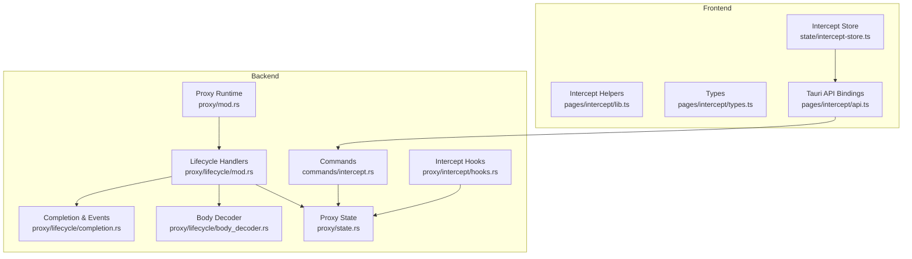
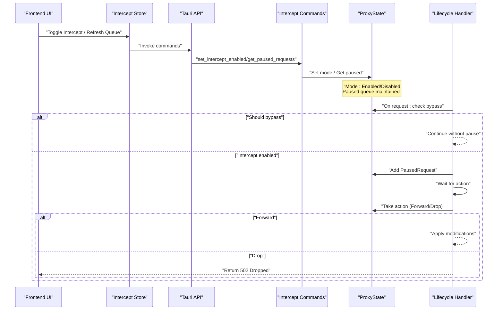
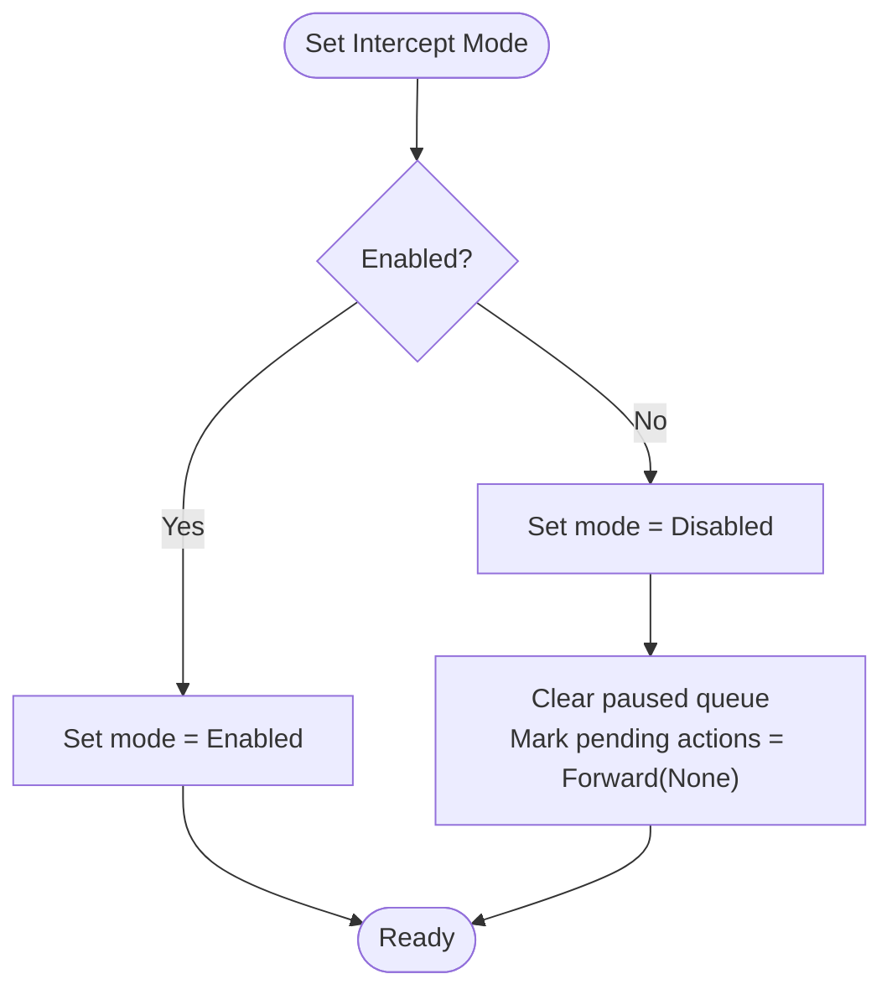
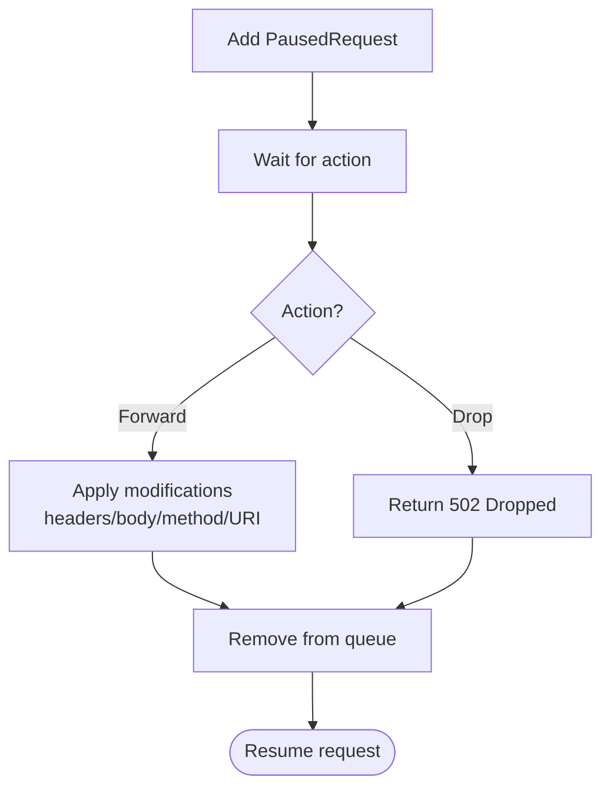
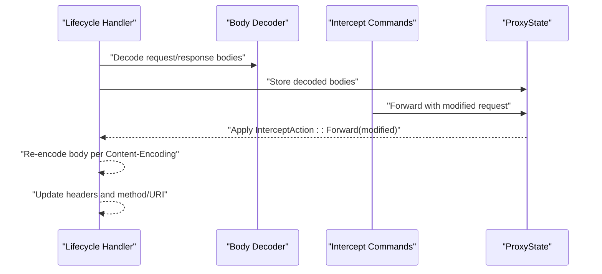
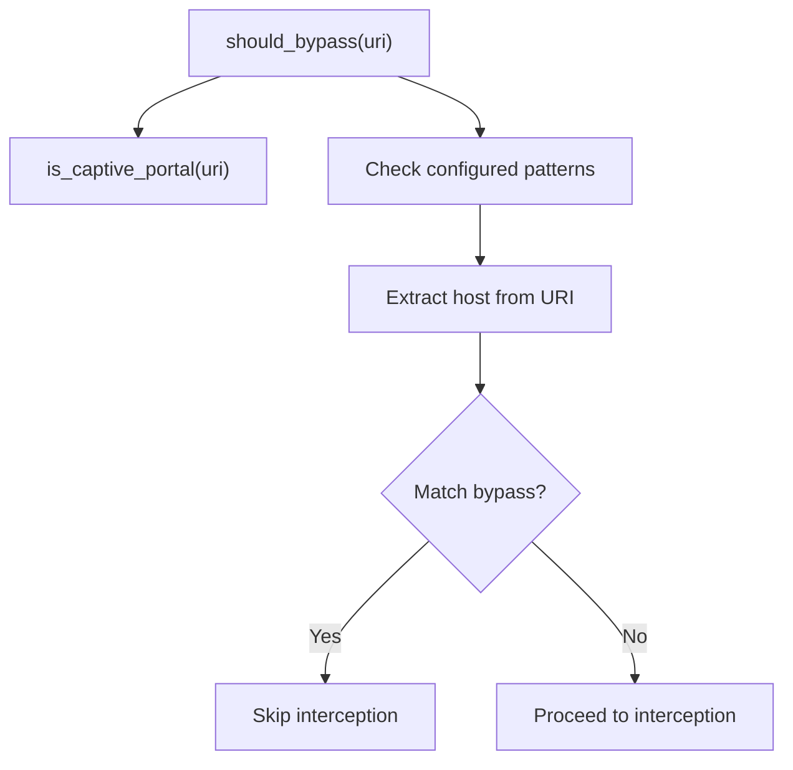
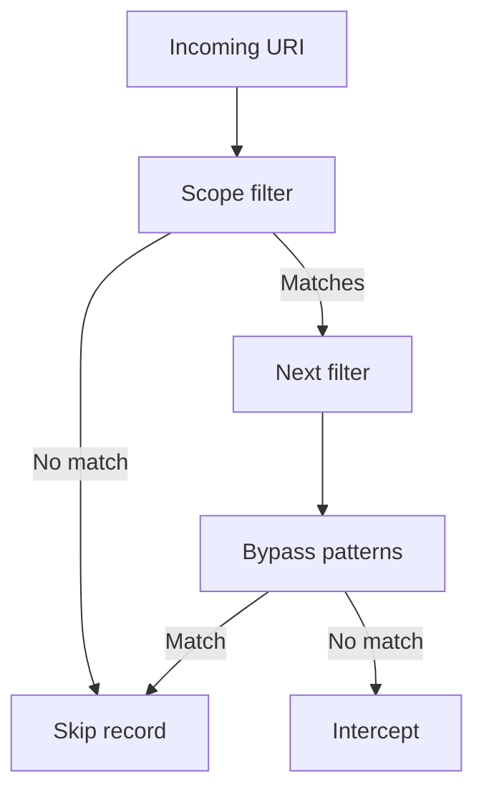
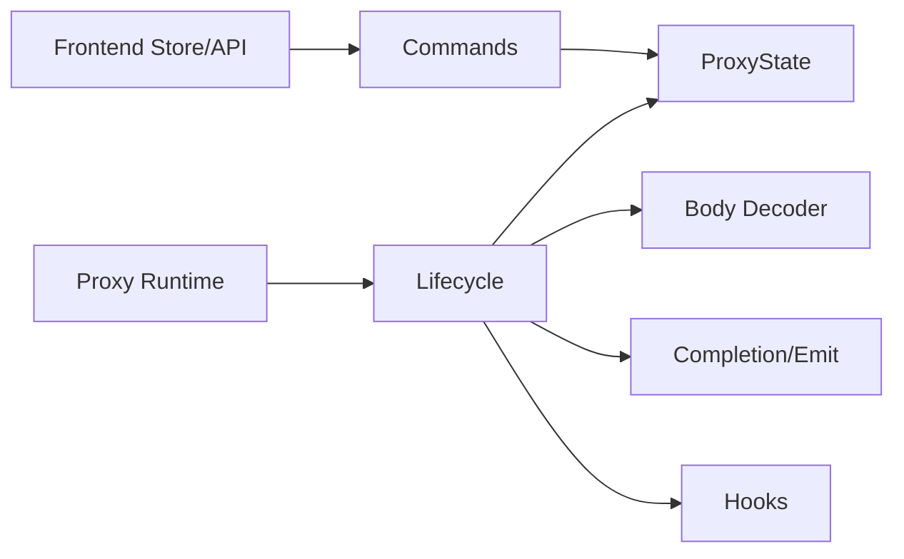

# Traffic Interception and Hooks

<cite>
**Referenced Files in This Document**
- [intercept-store.ts](file://src/pages/intercept/state/intercept-store.ts)
- [lib.ts](file://src/pages/intercept/lib.ts)
- [types.ts](file://src/pages/intercept/types.ts)
- [api.ts](file://src/pages/intercept/api.ts)
- [hooks.rs](file://src-tauri/src/proxy/intercept/hooks.rs)
- [intercept.rs](file://src-tauri/src/commands/intercept.rs)
- [state.rs](file://src-tauri/src/proxy/state.rs)
- [lifecycle/mod.rs](file://src-tauri/src/proxy/lifecycle/mod.rs)
- [completion.rs](file://src-tauri/src/proxy/lifecycle/completion.rs)
- [body_decoder.rs](file://src-tauri/src/proxy/lifecycle/body_decoder.rs)
- [proxy/mod.rs](file://src-tauri/src/proxy/mod.rs)
- [lib.rs](file://src-tauri/src/lib.rs)
</cite>

## Table of Contents
1. [Introduction](#introduction)
2. [Project Structure](#project-structure)
3. [Core Components](#core-components)
4. [Architecture Overview](#architecture-overview)
5. [Detailed Component Analysis](#detailed-component-analysis)
6. [Dependency Analysis](#dependency-analysis)
7. [Performance Considerations](#performance-considerations)
8. [Troubleshooting Guide](#troubleshooting-guide)
9. [Conclusion](#conclusion)

## Introduction
This document explains the traffic interception system and hook mechanisms used to pause, inspect, modify, and resume HTTP(S) requests and responses. It covers:
- Interception modes (disabled/enabled), request/response modification, and interception queue management
- Hook registration and interception callbacks
- Custom interception logic implementation
- Paused request handling, interception filtering, and selective traffic interception
- Practical examples and guidance for implementing custom interception logic
- Performance considerations, memory management, and concurrent interception handling

## Project Structure
The interception system spans frontend React components and a Tauri/Rust backend:
- Frontend state and UI: intercept store, APIs, and helpers
- Backend proxy and lifecycle: request/response handlers, body decoding, and persistence
- Commands bridge frontend actions to backend state

**Diagram sources**
- [intercept-store.ts:1-202](file://src/pages/intercept/state/intercept-store.ts#L1-L202)
- [lib.ts:1-50](file://src/pages/intercept/lib.ts#L1-L50)
- [types.ts:1-24](file://src/pages/intercept/types.ts#L1-L24)
- [api.ts:1-51](file://src/pages/intercept/api.ts#L1-L51)
- [intercept.rs:1-434](file://src-tauri/src/commands/intercept.rs#L1-L434)
- [state.rs:1-441](file://src-tauri/src/proxy/state.rs#L1-L441)
- [lifecycle/mod.rs:1-453](file://src-tauri/src/proxy/lifecycle/mod.rs#L1-L453)
- [body_decoder.rs:1-418](file://src-tauri/src/proxy/lifecycle/body_decoder.rs#L1-L418)
- [completion.rs:1-118](file://src-tauri/src/proxy/lifecycle/completion.rs#L1-L118)
- [hooks.rs:1-21](file://src-tauri/src/proxy/intercept/hooks.rs#L1-L21)
- [proxy/mod.rs:1-188](file://src-tauri/src/proxy/mod.rs#L1-L188)

**Section sources**
- [intercept-store.ts:1-202](file://src/pages/intercept/state/intercept-store.ts#L1-L202)
- [api.ts:1-51](file://src/pages/intercept/api.ts#L1-L51)
- [intercept.rs:1-434](file://src-tauri/src/commands/intercept.rs#L1-L434)
- [state.rs:1-441](file://src-tauri/src/proxy/state.rs#L1-L441)
- [lifecycle/mod.rs:1-453](file://src-tauri/src/proxy/lifecycle/mod.rs#L1-L453)
- [body_decoder.rs:1-418](file://src-tauri/src/proxy/lifecycle/body_decoder.rs#L1-L418)
- [completion.rs:1-118](file://src-tauri/src/proxy/lifecycle/completion.rs#L1-L118)
- [hooks.rs:1-21](file://src-tauri/src/proxy/intercept/hooks.rs#L1-L21)
- [proxy/mod.rs:1-188](file://src-tauri/src/proxy/mod.rs#L1-L188)

## Core Components
- Interception modes and status
  - Mode: Disabled or Enabled
  - Status: mode + paused_count
- Paused request queue
  - Stores intercepted requests with method, URI, headers, body, timestamps, and client/server addresses
- Frontend store and actions
  - Refresh status and paused requests
  - Toggle interception mode
  - Forward or drop selected paused requests
  - Bypass host and forward a batch of matching requests
- Backend proxy lifecycle
  - Detects interception conditions
  - Pauses requests and waits for actions
  - Applies modifications before forwarding
  - Emits events and persists records

**Section sources**
- [types.ts:1-24](file://src/pages/intercept/types.ts#L1-L24)
- [intercept-store.ts:16-31](file://src/pages/intercept/state/intercept-store.ts#L16-L31)
- [intercept-store.ts:69-202](file://src/pages/intercept/state/intercept-store.ts#L69-L202)
- [state.rs:123-144](file://src-tauri/src/proxy/state.rs#L123-L144)
- [state.rs:176-295](file://src-tauri/src/proxy/state.rs#L176-L295)
- [lifecycle/mod.rs:88-360](file://src-tauri/src/proxy/lifecycle/mod.rs#L88-L360)

## Architecture Overview
The interception pipeline integrates frontend and backend:
- Frontend invokes Tauri commands to manage interception mode and paused requests
- Backend’s HTTP handler inspects URIs, checks bypass rules, and conditionally pauses requests
- The paused request is stored in ProxyState; the handler waits until a decision is made
- The decision is applied (forward with optional modifications or drop), then the request continues

**Diagram sources**
- [intercept-store.ts:91-127](file://src/pages/intercept/state/intercept-store.ts#L91-L127)
- [api.ts:5-30](file://src/pages/intercept/api.ts#L5-L30)
- [intercept.rs:20-109](file://src-tauri/src/commands/intercept.rs#L20-L109)
- [state.rs:210-295](file://src-tauri/src/proxy/state.rs#L210-L295)
- [lifecycle/mod.rs:176-279](file://src-tauri/src/proxy/lifecycle/mod.rs#L176-L279)

## Detailed Component Analysis

### Interception Modes and Status
- Mode transitions
  - Enabling sets mode to Enabled; disabling clears pending actions and clears paused queue
- Status exposes current mode and paused_count

**Diagram sources**
- [state.rs:210-230](file://src-tauri/src/proxy/state.rs#L210-L230)
- [intercept-store.ts:119-127](file://src/pages/intercept/state/intercept-store.ts#L119-L127)

**Section sources**
- [state.rs:123-134](file://src-tauri/src/proxy/state.rs#L123-L134)
- [state.rs:210-230](file://src-tauri/src/proxy/state.rs#L210-L230)
- [intercept-store.ts:119-127](file://src/pages/intercept/state/intercept-store.ts#L119-L127)

### Paused Request Queue Management
- Adding paused requests
  - On interception, a PausedRequest is created and appended to the queue
- Taking actions
  - Forward with optional modified ProxyRequest or Drop
  - Actions are removed after application
- Batch bypass
  - Group matching hosts and forward all matching paused requests

**Diagram sources**
- [state.rs:240-295](file://src-tauri/src/proxy/state.rs#L240-L295)
- [intercept-store.ts:172-200](file://src/pages/intercept/state/intercept-store.ts#L172-L200)
- [lifecycle/mod.rs:227-265](file://src-tauri/src/proxy/lifecycle/mod.rs#L227-L265)

**Section sources**
- [state.rs:240-295](file://src-tauri/src/proxy/state.rs#L240-L295)
- [intercept-store.ts:172-200](file://src/pages/intercept/state/intercept-store.ts#L172-L200)
- [lifecycle/mod.rs:227-265](file://src-tauri/src/proxy/lifecycle/mod.rs#L227-L265)

### Request/Response Modification Capabilities
- Forward with modifications
  - Modified method, URI, headers, and body are applied before forwarding
- Content encoding handling
  - Re-encoding respects Content-Encoding when forwarding modified bodies
- Body decoding
  - Automatic decoding of Transfer-Encoding and Content-Encoding for inspection
  - Pretty-printing for JSON-like content types

**Diagram sources**
- [lifecycle/mod.rs:156-172](file://src-tauri/src/proxy/lifecycle/mod.rs#L156-L172)
- [intercept.rs:53-93](file://src-tauri/src/commands/intercept.rs#L53-L93)
- [body_decoder.rs:24-90](file://src-tauri/src/proxy/lifecycle/body_decoder.rs#L24-L90)
- [body_decoder.rs:194-234](file://src-tauri/src/proxy/lifecycle/body_decoder.rs#L194-L234)

**Section sources**
- [intercept.rs:53-93](file://src-tauri/src/commands/intercept.rs#L53-L93)
- [lifecycle/mod.rs:236-264](file://src-tauri/src/proxy/lifecycle/mod.rs#L236-L264)
- [body_decoder.rs:24-90](file://src-tauri/src/proxy/lifecycle/body_decoder.rs#L24-L90)
- [body_decoder.rs:194-234](file://src-tauri/src/proxy/lifecycle/body_decoder.rs#L194-L234)

### Hook Registration and Interception Callbacks
- Bypass hook
  - Built-in captive portal detection and custom patterns
- URI bypass evaluation
  - Checks captive portal patterns and configured bypass patterns
- Lifecycle callbacks
  - handle_request: pause, wait, apply action
  - handle_response: decode, persist, emit events

**Diagram sources**
- [hooks.rs:12-21](file://src-tauri/src/proxy/intercept/hooks.rs#L12-L21)
- [state.rs:409-433](file://src-tauri/src/proxy/state.rs#L409-L433)
- [lifecycle/mod.rs:176-182](file://src-tauri/src/proxy/lifecycle/mod.rs#L176-L182)

**Section sources**
- [hooks.rs:12-21](file://src-tauri/src/proxy/intercept/hooks.rs#L12-L21)
- [state.rs:409-433](file://src-tauri/src/proxy/state.rs#L409-L433)
- [lifecycle/mod.rs:176-182](file://src-tauri/src/proxy/lifecycle/mod.rs#L176-L182)

### Selective Traffic Interception and Filtering
- Scope-based filtering
  - Host matching supports wildcard patterns and substring matching
- Bypass patterns
  - Configure domain/host or wildcard patterns to skip interception
- Captive portal bypass
  - Predefined patterns for connectivity checks

**Diagram sources**
- [state.rs:155-174](file://src-tauri/src/proxy/state.rs#L155-L174)
- [state.rs:409-433](file://src-tauri/src/proxy/state.rs#L409-L433)
- [hooks.rs:16-20](file://src-tauri/src/proxy/intercept/hooks.rs#L16-L20)

**Section sources**
- [state.rs:155-174](file://src-tauri/src/proxy/state.rs#L155-L174)
- [state.rs:409-433](file://src-tauri/src/proxy/state.rs#L409-L433)
- [hooks.rs:16-20](file://src-tauri/src/proxy/intercept/hooks.rs#L16-L20)

### Practical Examples

- Example: Modify a request before forwarding
  - Parse raw paused request into structured format
  - Adjust method, URI, headers, and body
  - Forward via backend command; backend re-encodes per Content-Encoding

  **Section sources**
  - [intercept-store.ts:129-155](file://src/pages/intercept/state/intercept-store.ts#L129-L155)
  - [intercept.rs:53-93](file://src-tauri/src/commands/intercept.rs#L53-L93)
  - [body_decoder.rs:194-234](file://src-tauri/src/proxy/lifecycle/body_decoder.rs#L194-L234)

- Example: Bypass host and forward a batch
  - Extract host from paused request
  - Add host to bypass patterns
  - Iterate matching requests and forward them

  **Section sources**
  - [intercept-store.ts:172-200](file://src/pages/intercept/state/intercept-store.ts#L172-L200)
  - [lib.ts:26-32](file://src/pages/intercept/lib.ts#L26-L32)
  - [state.rs:394-407](file://src-tauri/src/proxy/state.rs#L394-L407)

- Example: Persist and emit records
  - After response decoding, build ProxyRecord and emit events

  **Section sources**
  - [completion.rs:10-76](file://src-tauri/src/proxy/lifecycle/completion.rs#L10-L76)
  - [lifecycle/mod.rs:354-359](file://src-tauri/src/proxy/lifecycle/mod.rs#L354-L359)

## Dependency Analysis
- Frontend depends on Tauri commands for interception control
- Backend commands manipulate ProxyState
- Lifecycle handlers depend on body decoder and emit events
- Proxy runtime initializes CA and handlers

**Diagram sources**
- [intercept-store.ts:1-202](file://src/pages/intercept/state/intercept-store.ts#L1-L202)
- [api.ts:1-51](file://src/pages/intercept/api.ts#L1-L51)
- [intercept.rs:1-434](file://src-tauri/src/commands/intercept.rs#L1-L434)
- [state.rs:1-441](file://src-tauri/src/proxy/state.rs#L1-L441)
- [lifecycle/mod.rs:1-453](file://src-tauri/src/proxy/lifecycle/mod.rs#L1-L453)
- [body_decoder.rs:1-418](file://src-tauri/src/proxy/lifecycle/body_decoder.rs#L1-L418)
- [completion.rs:1-118](file://src-tauri/src/proxy/lifecycle/completion.rs#L1-L118)
- [hooks.rs:1-21](file://src-tauri/src/proxy/intercept/hooks.rs#L1-L21)
- [proxy/mod.rs:1-188](file://src-tauri/src/proxy/mod.rs#L1-L188)

**Section sources**
- [lib.rs:39-45](file://src-tauri/src/lib.rs#L39-L45)
- [proxy/mod.rs:93-187](file://src-tauri/src/proxy/mod.rs#L93-L187)

## Performance Considerations
- Body decoding and re-encoding
  - Prefer streaming or chunked processing for large bodies; avoid unnecessary copies
  - Re-encode only when headers change; otherwise forward original encoded bytes
- Concurrency
  - ProxyState uses a mutex; keep critical sections small
  - Avoid long-running work in lifecycle handlers; delegate to background tasks if needed
- Memory management
  - Limit paused queue size; periodically prune stale entries
  - Use byte slices and minimal cloning during decoding/encoding
- Event emission
  - Emit only essential fields; defer heavy logging to disk I/O

[No sources needed since this section provides general guidance]

## Troubleshooting Guide
- Interception not triggering
  - Verify mode is Enabled and paused_count increases
  - Confirm URI is not matched by bypass patterns or captive portal detection
- Forward fails
  - Ensure request parsing succeeds; check fallback URL resolution
  - Validate Content-Encoding compatibility when re-encoding
- Drop returns 502
  - Expected behavior when InterceptAction::Drop is taken
- Browser certificate trust
  - Use provided commands to trust CA in OS keychain or import into Chromium profiles

**Section sources**
- [intercept-store.ts:129-155](file://src/pages/intercept/state/intercept-store.ts#L129-L155)
- [intercept.rs:95-109](file://src-tauri/src/commands/intercept.rs#L95-L109)
- [lifecycle/mod.rs:227-235](file://src-tauri/src/proxy/lifecycle/mod.rs#L227-L235)
- [intercept.rs:284-433](file://src-tauri/src/commands/intercept.rs#L284-L433)

## Conclusion
The interception system combines a frontend store and commands with a robust backend lifecycle and state machine. It supports enabling/disabling interception, selectively bypassing traffic, pausing requests, applying targeted modifications, and emitting events. By leveraging body decoding, scoped filtering, and efficient state management, it balances flexibility and performance for traffic inspection and manipulation.