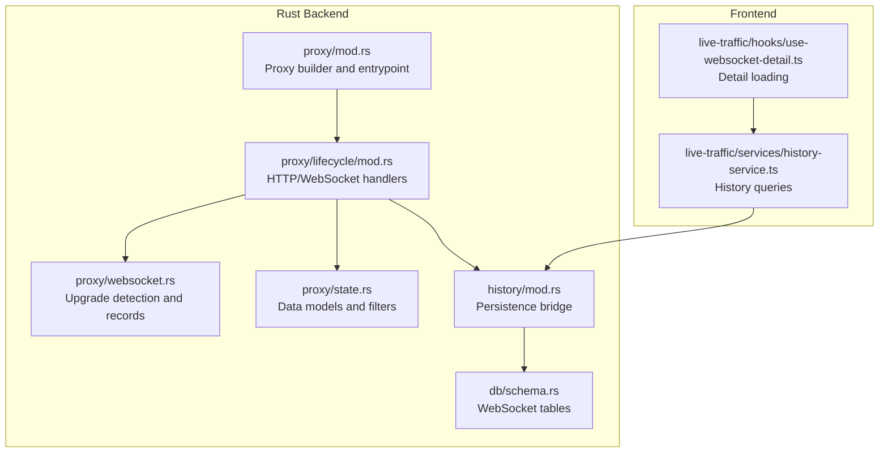
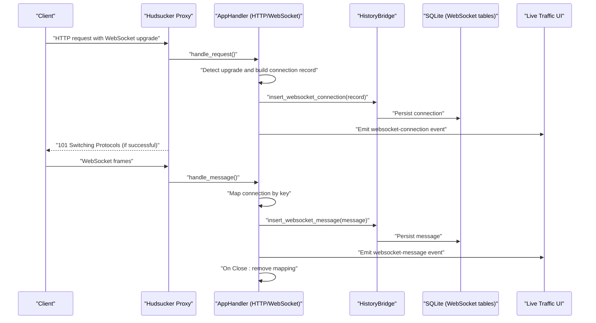
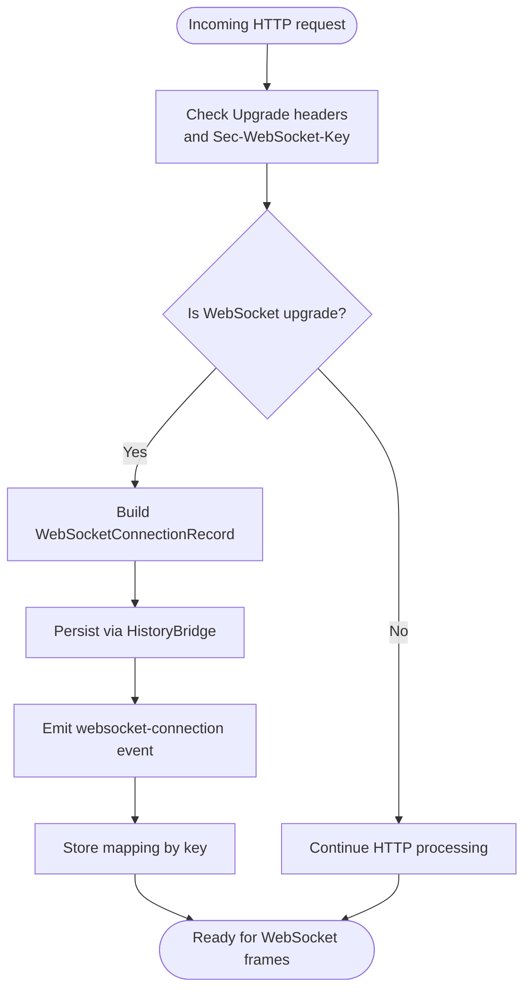
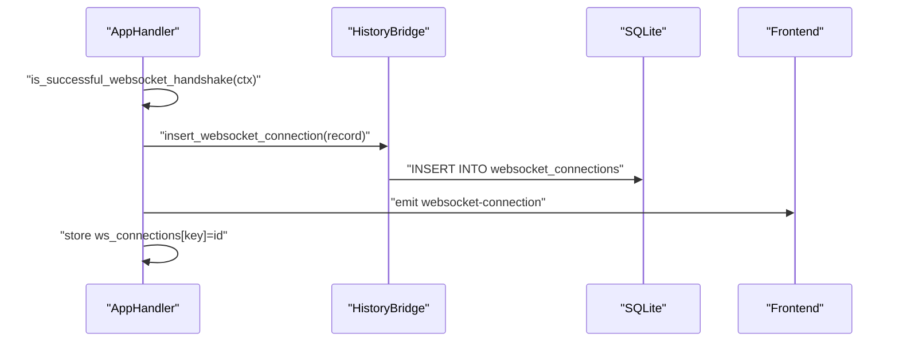
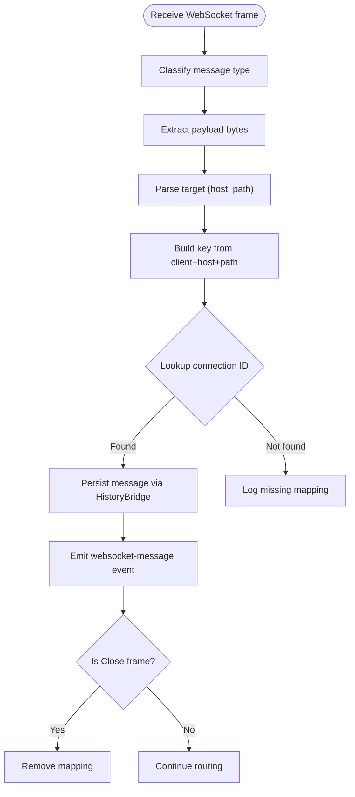
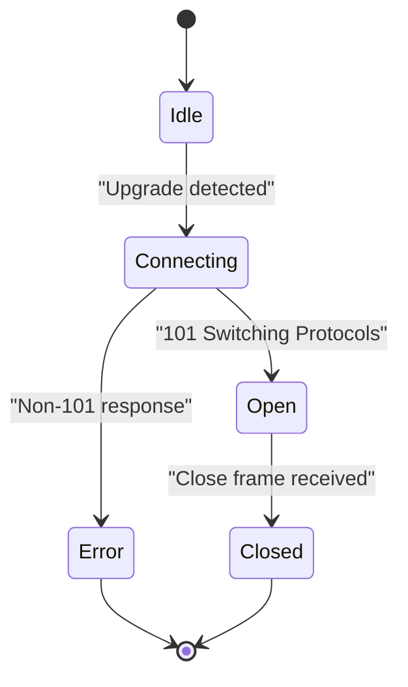
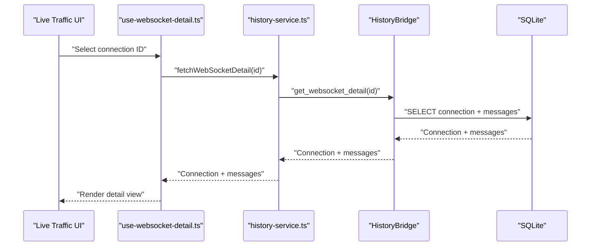
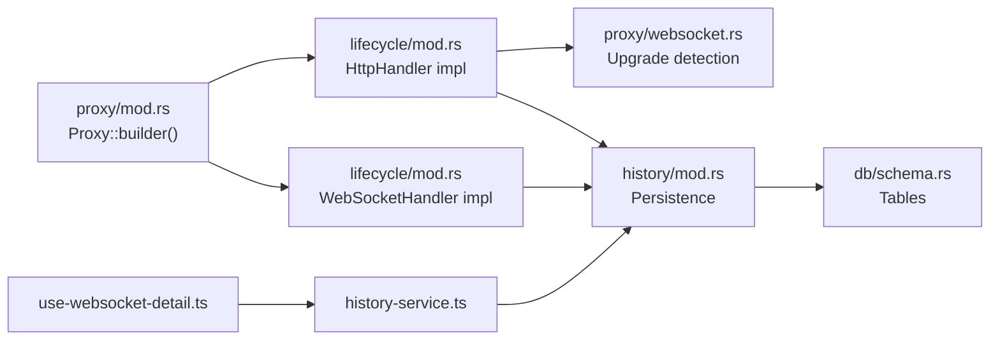
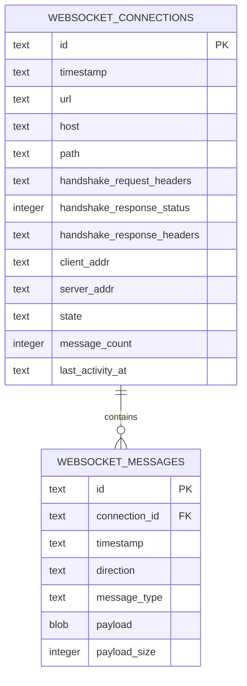

# WebSocket Support

<cite>
**Referenced Files in This Document**
- [websocket.rs](file://src-tauri/src/proxy/websocket.rs)
- [mod.rs (proxy)](file://src-tauri/src/proxy/mod.rs)
- [mod.rs (lifecycle)](file://src-tauri/src/proxy/lifecycle/mod.rs)
- [state.rs](file://src-tauri/src/proxy/state.rs)
- [history/mod.rs](file://src-tauri/src/history/mod.rs)
- [schema.rs](file://src-tauri/src/db/schema.rs)
- [use-websocket-detail.ts](file://src/pages/live-traffic/hooks/use-websocket-detail.ts)
- [history-service.ts](file://src/pages/live-traffic/services/history-service.ts)
- [history.rs](file://src-tauri/src/commands/history.rs)
- [repeater.rs](file://src-tauri/src/commands/repeater.rs)
</cite>

## Table of Contents
1. [Introduction](#introduction)
2. [Project Structure](#project-structure)
3. [Core Components](#core-components)
4. [Architecture Overview](#architecture-overview)
5. [Detailed Component Analysis](#detailed-component-analysis)
6. [Dependency Analysis](#dependency-analysis)
7. [Performance Considerations](#performance-considerations)
8. [Troubleshooting Guide](#troubleshooting-guide)
9. [Conclusion](#conclusion)
10. [Appendices](#appendices)

## Introduction
This document explains WebSocket proxy support and real-time communication handling in the application. It covers the WebSocket upgrade process, connection establishment, message routing, frame processing, bidirectional communication, connection lifecycle management, interception and inspection capabilities, and integration with the broader proxy architecture. Practical examples demonstrate traffic monitoring, message modification, and connection debugging, along with security considerations and performance optimization strategies.

## Project Structure
The WebSocket implementation spans Rust backend modules and TypeScript frontend components:
- Backend proxy and lifecycle handlers manage HTTP and WebSocket events, maintain connection state, and persist data.
- Frontend live traffic views render WebSocket connections and messages, enabling inspection and analysis.

**Diagram sources**
- [mod.rs (proxy):149-156](file://src-tauri/src/proxy/mod.rs#L149-L156)
- [mod.rs (lifecycle):362-452](file://src-tauri/src/proxy/lifecycle/mod.rs#L362-L452)
- [websocket.rs:1-187](file://src-tauri/src/proxy/websocket.rs#L1-L187)
- [state.rs:68-93](file://src-tauri/src/proxy/state.rs#L68-L93)
- [history/mod.rs:193-260](file://src-tauri/src/history/mod.rs#L193-L260)
- [schema.rs:23-56](file://src-tauri/src/db/schema.rs#L23-L56)
- [use-websocket-detail.ts:55-103](file://src/pages/live-traffic/hooks/use-websocket-detail.ts#L55-L103)
- [history-service.ts](file://src/pages/live-traffic/services/history-service.ts)

**Section sources**
- [mod.rs (proxy):93-187](file://src-tauri/src/proxy/mod.rs#L93-L187)
- [mod.rs (lifecycle):88-360](file://src-tauri/src/proxy/lifecycle/mod.rs#L88-L360)
- [websocket.rs:9-136](file://src-tauri/src/proxy/websocket.rs#L9-L136)
- [state.rs:68-121](file://src-tauri/src/proxy/state.rs#L68-L121)
- [history/mod.rs:193-260](file://src-tauri/src/history/mod.rs#L193-L260)
- [schema.rs:23-56](file://src-tauri/src/db/schema.rs#L23-L56)
- [use-websocket-detail.ts:55-103](file://src/pages/live-traffic/hooks/use-websocket-detail.ts#L55-L103)

## Core Components
- WebSocket upgrade detection and handshake validation
- Connection record creation and emission
- WebSocket message routing and persistence
- Bidirectional message handling and close frame processing
- Connection lifecycle mapping keyed by client address, host, and path
- Frontend detail loading and paginated history retrieval

Key responsibilities:
- Detect WebSocket upgrade requests using headers and tokens.
- Build connection records with parsed target (scheme, host, path) and state.
- Persist connections and messages via the history bridge.
- Emit real-time events for UI updates.
- Map active WebSocket connections for message routing.

**Section sources**
- [websocket.rs:9-25](file://src-tauri/src/proxy/websocket.rs#L9-L25)
- [websocket.rs:62-94](file://src-tauri/src/proxy/websocket.rs#L62-L94)
- [websocket.rs:96-136](file://src-tauri/src/proxy/websocket.rs#L96-L136)
- [mod.rs (lifecycle):111-141](file://src-tauri/src/proxy/lifecycle/mod.rs#L111-L141)
- [mod.rs (lifecycle):362-452](file://src-tauri/src/proxy/lifecycle/mod.rs#L362-L452)
- [state.rs:68-93](file://src-tauri/src/proxy/state.rs#L68-L93)

## Architecture Overview
The proxy integrates a WebSocket handler alongside HTTP handlers. On upgrade, the system builds a connection record, persists it, emits an event, and maintains an in-memory mapping keyed by client address, host, and path. Subsequent messages are routed to the correct connection, persisted, and emitted for UI consumption. Responses that confirm a successful upgrade trigger finalization of the connection record.

**Diagram sources**
- [mod.rs (proxy):149-156](file://src-tauri/src/proxy/mod.rs#L149-L156)
- [mod.rs (lifecycle):88-141](file://src-tauri/src/proxy/lifecycle/mod.rs#L88-L141)
- [mod.rs (lifecycle):362-452](file://src-tauri/src/proxy/lifecycle/mod.rs#L362-L452)
- [websocket.rs:27-60](file://src-tauri/src/proxy/websocket.rs#L27-L60)
- [history/mod.rs:193-206](file://src-tauri/src/history/mod.rs#L193-L206)
- [schema.rs:23-56](file://src-tauri/src/db/schema.rs#L23-L56)

## Detailed Component Analysis

### WebSocket Upgrade Detection and Handshake Validation
- Upgrade detection considers the Upgrade header, Connection header tokens, and presence of Sec-WebSocket-Key.
- Successful handshake validation requires status code 101 and an upgrade request.
- Connection records are built with parsed target (scheme, host, path) and initial state.

**Diagram sources**
- [websocket.rs:9-25](file://src-tauri/src/proxy/websocket.rs#L9-L25)
- [websocket.rs:62-94](file://src-tauri/src/proxy/websocket.rs#L62-L94)
- [mod.rs (lifecycle):111-141](file://src-tauri/src/proxy/lifecycle/mod.rs#L111-L141)

**Section sources**
- [websocket.rs:9-25](file://src-tauri/src/proxy/websocket.rs#L9-L25)
- [websocket.rs:62-94](file://src-tauri/src/proxy/websocket.rs#L62-L94)
- [mod.rs (lifecycle):111-141](file://src-tauri/src/proxy/lifecycle/mod.rs#L111-L141)

### Connection Establishment and Record Persistence
- On successful upgrade, the connection record is inserted into the database and emitted to the UI.
- The record includes handshake headers, response status, client/server addresses, and state.
- The mapping stores the connection ID keyed by client address, host, and path.

**Diagram sources**
- [mod.rs (lifecycle):311-327](file://src-tauri/src/proxy/lifecycle/mod.rs#L311-L327)
- [websocket.rs:27-60](file://src-tauri/src/proxy/websocket.rs#L27-L60)
- [history/mod.rs:193-200](file://src-tauri/src/history/mod.rs#L193-L200)
- [schema.rs:24-38](file://src-tauri/src/db/schema.rs#L24-L38)

**Section sources**
- [mod.rs (lifecycle):311-327](file://src-tauri/src/proxy/lifecycle/mod.rs#L311-L327)
- [websocket.rs:27-60](file://src-tauri/src/proxy/websocket.rs#L27-L60)
- [history/mod.rs:193-200](file://src-tauri/src/history/mod.rs#L193-L200)
- [schema.rs:24-38](file://src-tauri/src/db/schema.rs#L24-L38)

### WebSocket Frame Processing and Bidirectional Communication
- Messages are categorized by type (text, binary, ping, pong, close, frame).
- Payload extraction handles various frame types, including assembling close frame payload.
- Messages are persisted with direction (inbound/outbound) and connection ID.
- Close frames trigger removal of the connection mapping.

**Diagram sources**
- [mod.rs (lifecycle):362-452](file://src-tauri/src/proxy/lifecycle/mod.rs#L362-L452)
- [websocket.rs:96-136](file://src-tauri/src/proxy/websocket.rs#L96-L136)
- [history/mod.rs:202-206](file://src-tauri/src/history/mod.rs#L202-L206)
- [schema.rs:40-49](file://src-tauri/src/db/schema.rs#L40-L49)

**Section sources**
- [mod.rs (lifecycle):362-452](file://src-tauri/src/proxy/lifecycle/mod.rs#L362-L452)
- [websocket.rs:96-136](file://src-tauri/src/proxy/websocket.rs#L96-L136)
- [history/mod.rs:202-206](file://src-tauri/src/history/mod.rs#L202-L206)
- [schema.rs:40-49](file://src-tauri/src/db/schema.rs#L40-L49)

### Connection Lifecycle Management
- Mapping: Active connections are tracked by a composite key derived from client address, host, and path.
- State transitions: Connections start as open; errors recorded when handshake fails.
- Cleanup: Close frames remove the mapping, ensuring memory safety and preventing stale references.

**Diagram sources**
- [websocket.rs:70-73](file://src-tauri/src/proxy/websocket.rs#L70-L73)
- [mod.rs (lifecycle):438-441](file://src-tauri/src/proxy/lifecycle/mod.rs#L438-L441)

**Section sources**
- [websocket.rs:70-73](file://src-tauri/src/proxy/websocket.rs#L70-L73)
- [mod.rs (lifecycle):438-441](file://src-tauri/src/proxy/lifecycle/mod.rs#L438-L441)

### WebSocket Interception, Inspection, and Real-Time Traffic Analysis
- Interception: The proxy supports HTTP interception modes; WebSocket frames are handled separately but can be combined with HTTP interception.
- Inspection: Frontend hooks load connection details and messages, enabling real-time inspection.
- Filtering: WebSocket filters support search, scope, and state filtering for efficient browsing.

**Diagram sources**
- [use-websocket-detail.ts:55-103](file://src/pages/live-traffic/hooks/use-websocket-detail.ts#L55-L103)
- [history/mod.rs:243-260](file://src-tauri/src/history/mod.rs#L243-L260)

**Section sources**
- [use-websocket-detail.ts:55-103](file://src/pages/live-traffic/hooks/use-websocket-detail.ts#L55-L103)
- [history/mod.rs:243-260](file://src-tauri/src/history/mod.rs#L243-L260)
- [state.rs:96-121](file://src-tauri/src/proxy/state.rs#L96-L121)

### Practical Examples

- Monitoring WebSocket traffic
  - Observe emitted events for new connections and messages.
  - Use the live traffic UI to browse paginated connections and inspect messages.

- Message modification
  - Modify HTTP requests/responses during interception; WebSocket frames are processed independently.
  - Use repeater commands to send custom frames and observe responses.

- Connection debugging
  - Inspect handshake headers and response status in the connection record.
  - Verify mapping keys and connection state to troubleshoot routing issues.

**Section sources**
- [mod.rs (lifecycle):182-266](file://src-tauri/src/proxy/lifecycle/mod.rs#L182-L266)
- [repeater.rs:173-181](file://src-tauri/src/commands/repeater.rs#L173-L181)
- [websocket.rs:27-60](file://src-tauri/src/proxy/websocket.rs#L27-L60)

## Dependency Analysis
- The proxy builder registers both HTTP and WebSocket handlers.
- The lifecycle module depends on WebSocket utilities for upgrade detection and record building.
- The history bridge persists WebSocket data and exposes paginated queries.
- The frontend hooks depend on history service and the bridge for data retrieval.

**Diagram sources**
- [mod.rs (proxy):149-156](file://src-tauri/src/proxy/mod.rs#L149-L156)
- [mod.rs (lifecycle):88-360](file://src-tauri/src/proxy/lifecycle/mod.rs#L88-L360)
- [websocket.rs:9-25](file://src-tauri/src/proxy/websocket.rs#L9-L25)
- [history/mod.rs:193-260](file://src-tauri/src/history/mod.rs#L193-L260)
- [schema.rs:23-56](file://src-tauri/src/db/schema.rs#L23-L56)
- [use-websocket-detail.ts:55-103](file://src/pages/live-traffic/hooks/use-websocket-detail.ts#L55-L103)

**Section sources**
- [mod.rs (proxy):149-156](file://src-tauri/src/proxy/mod.rs#L149-L156)
- [mod.rs (lifecycle):88-360](file://src-tauri/src/proxy/lifecycle/mod.rs#L88-L360)
- [websocket.rs:9-25](file://src-tauri/src/proxy/websocket.rs#L9-L25)
- [history/mod.rs:193-260](file://src-tauri/src/history/mod.rs#L193-L260)
- [schema.rs:23-56](file://src-tauri/src/db/schema.rs#L23-L56)
- [use-websocket-detail.ts:55-103](file://src/pages/live-traffic/hooks/use-websocket-detail.ts#L55-L103)

## Performance Considerations
- Minimize overhead by avoiding unnecessary decoding for WebSocket frames; only extract payload bytes and persist as-is.
- Use indexing on connection and message tables to accelerate queries in the live traffic UI.
- Batch emissions for high-frequency message streams to reduce UI update pressure.
- Limit message retention by applying filters and scopes to reduce database growth.
- Consider rate-limiting or sampling for extremely chatty connections to preserve performance.

[No sources needed since this section provides general guidance]

## Troubleshooting Guide
Common issues and remedies:
- Missing connection mapping
  - Cause: Client address/host/path mismatch or late mapping.
  - Action: Verify the composite key construction and ensure mapping occurs after handshake confirmation.

- Duplicate or stale mappings
  - Cause: Failure to remove mapping on close frames.
  - Action: Confirm close frame handling removes the mapping.

- Handshake failures
  - Cause: Non-101 responses or missing upgrade headers.
  - Action: Inspect handshake response status and headers in the connection record.

- Event emission failures
  - Cause: UI disconnected or event bus issues.
  - Action: Check logs for emission errors and reinitialize UI listeners.

- Database persistence errors
  - Cause: SQLite write failures or schema mismatches.
  - Action: Validate schema initialization and retry persistence operations.

**Section sources**
- [mod.rs (lifecycle):438-447](file://src-tauri/src/proxy/lifecycle/mod.rs#L438-L447)
- [websocket.rs:43-59](file://src-tauri/src/proxy/websocket.rs#L43-L59)
- [history/mod.rs:193-206](file://src-tauri/src/history/mod.rs#L193-L206)

## Conclusion
The WebSocket support integrates seamlessly with the proxy’s HTTP interception pipeline. It detects upgrades, manages connection lifecycles, routes and persists messages, and exposes real-time events for UI consumption. With proper indexing, filtering, and careful handling of close frames, the system delivers robust real-time traffic analysis suitable for development and debugging workflows.

[No sources needed since this section summarizes without analyzing specific files]

## Appendices

### Data Model Overview

**Diagram sources**
- [schema.rs:24-49](file://src-tauri/src/db/schema.rs#L24-L49)