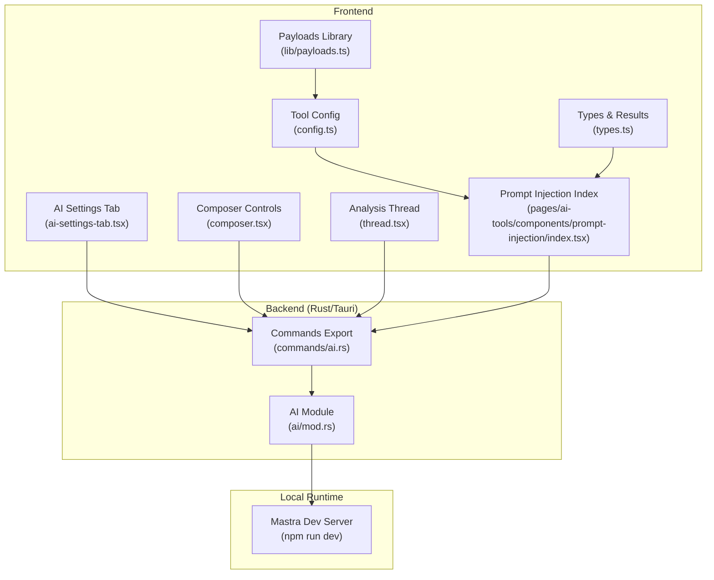
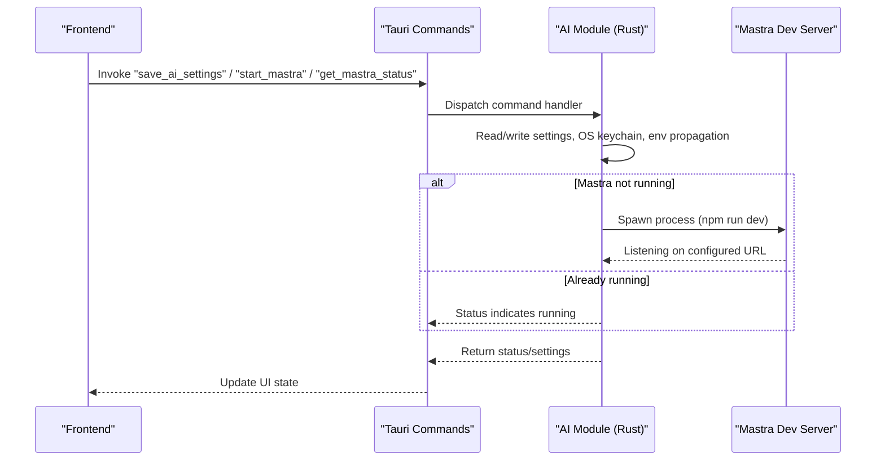
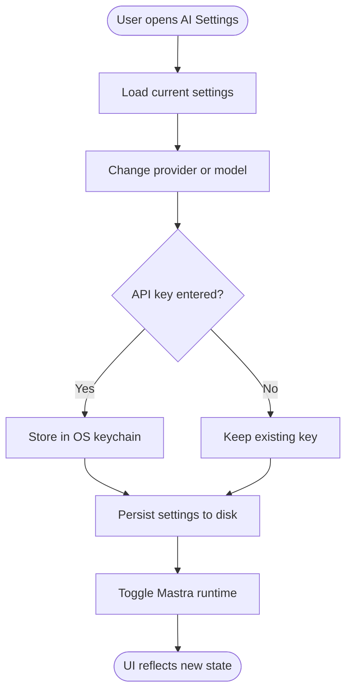
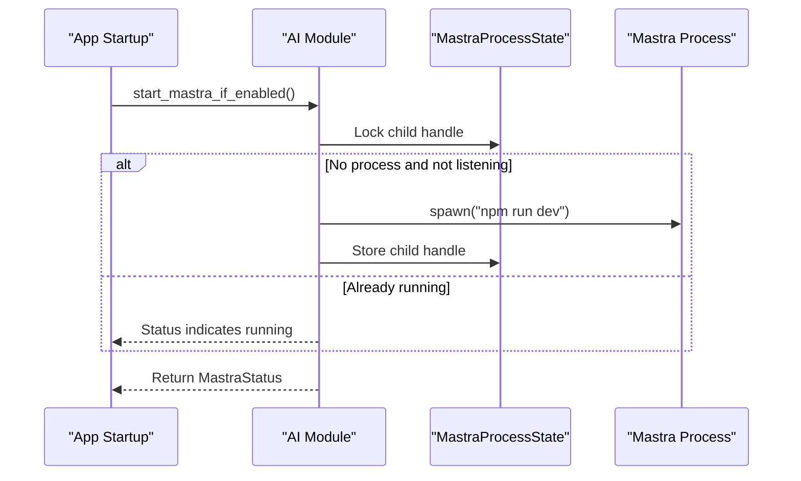
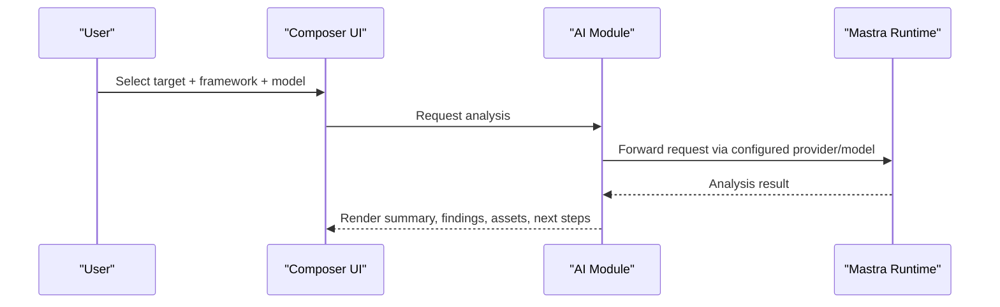
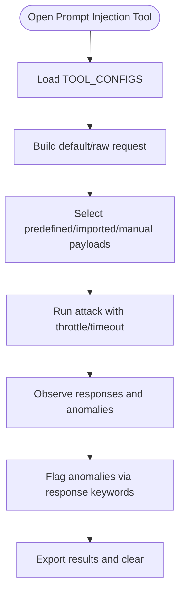
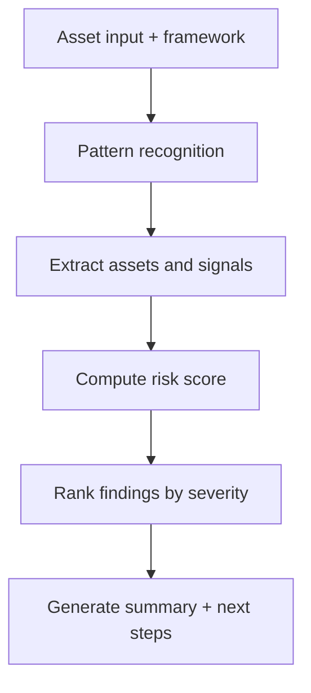
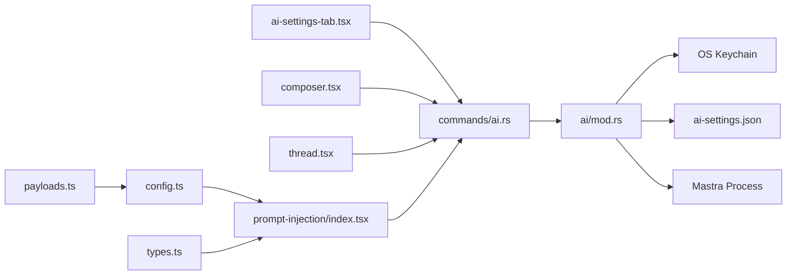

# AI Integration Services

<cite>
**Referenced Files in This Document**
- [mod.rs](file://src-tauri/src/ai/mod.rs)
- [ai.rs](file://src-tauri/src/commands/ai.rs)
- [use-settings-page.ts](file://src/pages/settings/hooks/use-settings-page.ts)
- [ai-settings-tab.tsx](file://src/pages/settings/components/ai-settings-tab.tsx)
- [index.tsx](file://src/pages/ai-tools/index.tsx)
- [prompt-injection/index.tsx](file://src/pages/ai-tools/components/prompt-injection/index.tsx)
- [use-prompt-injection-tester.ts](file://src/pages/ai-tools/components/prompt-injection/components/use-prompt-injection-tester.ts)
- [config.ts](file://src/pages/ai-tools/components/prompt-injection/components/config.ts)
- [types.ts](file://src/pages/ai-tools/components/prompt-injection/components/types.ts)
- [payloads.ts](file://src/pages/ai-tools/lib/payloads.ts)
- [thread.tsx](file://src/pages/ai-chat/components/thread.tsx)
- [analyze-asset-input.ts](file://src/pages/ai-chat/lib/analyze-asset-input.ts)
- [composer.tsx](file://src/pages/ai-chat/components/composer.tsx)
- [constants.ts](file://src/pages/ai-chat/constants.ts)
- [types.ts](file://src/pages/ai-chat/types.ts)
</cite>

## Table of Contents
1. [Introduction](#introduction)
2. [Project Structure](#project-structure)
3. [Core Components](#core-components)
4. [Architecture Overview](#architecture-overview)
5. [Detailed Component Analysis](#detailed-component-analysis)
6. [Dependency Analysis](#dependency-analysis)
7. [Performance Considerations](#performance-considerations)
8. [Troubleshooting Guide](#troubleshooting-guide)
9. [Conclusion](#conclusion)
10. [Appendices](#appendices)

## Introduction
This document describes AppRecon’s AI integration service layer, focusing on:
- The MCP-like AI orchestration via a local Mastra runtime and Tauri-backed provider/model configuration
- The AI assistant dashboard for automated asset analysis and multi-turn presentation
- The prompt injection testing tool for security assessment workflows
- Practical guidance for configuration, custom model integration, prompt engineering, performance optimization, memory management, ethical AI, and extensibility

## Project Structure
The AI integration spans Rust backend (Tauri commands), frontend settings and tools, and a local Mastra development server orchestrated by the backend.

**Diagram sources**
- [ai-settings-tab.tsx:1-185](file://src/pages/settings/components/ai-settings-tab.tsx#L1-L185)
- [composer.tsx:66-102](file://src/pages/ai-chat/components/composer.tsx#L66-L102)
- [thread.tsx:1-161](file://src/pages/ai-chat/components/thread.tsx#L1-L161)
- [prompt-injection/index.tsx:1-77](file://src/pages/ai-tools/components/prompt-injection/index.tsx#L1-L77)
- [config.ts:1-35](file://src/pages/ai-tools/components/prompt-injection/components/config.ts#L1-L35)
- [types.ts:1-43](file://src/pages/ai-tools/components/prompt-injection/components/types.ts#L1-L43)
- [payloads.ts:1-78](file://src/pages/ai-tools/lib/payloads.ts#L1-L78)
- [ai.rs:1-10](file://src-tauri/src/commands/ai.rs#L1-L10)
- [mod.rs:52-132](file://src-tauri/src/ai/mod.rs#L52-L132)

**Section sources**
- [ai-settings-tab.tsx:1-185](file://src/pages/settings/components/ai-settings-tab.tsx#L1-L185)
- [ai.rs:1-10](file://src-tauri/src/commands/ai.rs#L1-L10)
- [mod.rs:52-132](file://src-tauri/src/ai/mod.rs#L52-L132)

## Core Components
- AI settings and provider configuration: provider selection, model selection, API key storage in OS keychain, and Mastra runtime controls
- Local Mastra runtime: auto-start, status polling, process lifecycle, and environment propagation
- AI assistant dashboard: target selection, analysis framework selection, model selection, and result rendering
- Prompt injection testing tool: payload selection, request configuration, attack orchestration, and result analysis

**Section sources**
- [mod.rs:13-45](file://src-tauri/src/ai/mod.rs#L13-L45)
- [mod.rs:52-132](file://src-tauri/src/ai/mod.rs#L52-L132)
- [ai-settings-tab.tsx:25-185](file://src/pages/settings/components/ai-settings-tab.tsx#L25-L185)
- [thread.tsx:20-161](file://src/pages/ai-chat/components/thread.tsx#L20-L161)
- [prompt-injection/index.tsx:1-77](file://src/pages/ai-tools/components/prompt-injection/index.tsx#L1-L77)

## Architecture Overview
The AI integration uses a Tauri command layer to manage AI settings and the Mastra runtime, while the frontend provides configuration UI and analysis tooling. The backend persists settings and API keys securely and launches/monitors the local Mastra server.

**Diagram sources**
- [ai.rs:1-10](file://src-tauri/src/commands/ai.rs#L1-L10)
- [mod.rs:52-132](file://src-tauri/src/ai/mod.rs#L52-L132)
- [mod.rs:196-262](file://src-tauri/src/ai/mod.rs#L196-L262)

## Detailed Component Analysis

### AI Settings and Provider Configuration
- Provider and model selection are persisted locally; API keys are stored in the OS keychain for security
- Frontend exposes controls to change provider, model, and API key, and to start/stop the Mastra runtime
- Backend validates provider support, writes settings, and manages keyring entries

**Diagram sources**
- [ai-settings-tab.tsx:25-185](file://src/pages/settings/components/ai-settings-tab.tsx#L25-L185)
- [use-settings-page.ts:38-234](file://src/pages/settings/hooks/use-settings-page.ts#L38-L234)
- [mod.rs:52-85](file://src-tauri/src/ai/mod.rs#L52-L85)
- [mod.rs:379-397](file://src-tauri/src/ai/mod.rs#L379-L397)

**Section sources**
- [ai-settings-tab.tsx:25-185](file://src/pages/settings/components/ai-settings-tab.tsx#L25-L185)
- [use-settings-page.ts:38-234](file://src/pages/settings/hooks/use-settings-page.ts#L38-L234)
- [mod.rs:13-45](file://src-tauri/src/ai/mod.rs#L13-L45)
- [mod.rs:52-85](file://src-tauri/src/ai/mod.rs#L52-L85)
- [mod.rs:379-397](file://src-tauri/src/ai/mod.rs#L379-L397)

### Local Mastra Runtime Management
- Auto-start controlled by settings; backend checks process and listening URL
- Environment variables propagate provider/model/API key to the runtime
- Process state is tracked via a mutex-guarded child handle

**Diagram sources**
- [mod.rs:123-132](file://src-tauri/src/ai/mod.rs#L123-L132)
- [mod.rs:196-262](file://src-tauri/src/ai/mod.rs#L196-L262)
- [mod.rs:47-50](file://src-tauri/src/ai/mod.rs#L47-L50)

**Section sources**
- [mod.rs:47-50](file://src-tauri/src/ai/mod.rs#L47-L50)
- [mod.rs:123-132](file://src-tauri/src/ai/mod.rs#L123-L132)
- [mod.rs:196-262](file://src-tauri/src/ai/mod.rs#L196-L262)

### AI Assistant Dashboard and Conversation State
- Users select a target and analysis framework, choose a model, and trigger analysis
- Results include a summary, risk score, findings with severity, extracted assets, and next steps
- Presentation layer renders assistant responses and fallback warnings

**Diagram sources**
- [composer.tsx:66-102](file://src/pages/ai-chat/components/composer.tsx#L66-L102)
- [thread.tsx:20-161](file://src/pages/ai-chat/components/thread.tsx#L20-L161)
- [analyze-asset-input.ts:1-215](file://src/pages/ai-chat/lib/analyze-asset-input.ts#L1-L215)
- [constants.ts:58-77](file://src/pages/ai-chat/constants.ts#L58-L77)
- [types.ts:4-12](file://src/pages/ai-chat/types.ts#L4-L12)

**Section sources**
- [composer.tsx:66-102](file://src/pages/ai-chat/components/composer.tsx#L66-L102)
- [thread.tsx:20-161](file://src/pages/ai-chat/components/thread.tsx#L20-L161)
- [analyze-asset-input.ts:1-215](file://src/pages/ai-chat/lib/analyze-asset-input.ts#L1-L215)
- [constants.ts:58-77](file://src/pages/ai-chat/constants.ts#L58-L77)
- [types.ts:4-12](file://src/pages/ai-chat/types.ts#L4-L12)

### Prompt Injection Testing Service
- Predefined and imported payload sets tailored for prompt injection/jailbreaking/prompt leak scenarios
- Tool configuration defines default requests, payload lists, and response keywords for anomaly detection
- Frontend orchestrates payload selection, request editing, throttling, timeouts, and result visualization

**Diagram sources**
- [prompt-injection/index.tsx:1-77](file://src/pages/ai-tools/components/prompt-injection/index.tsx#L1-L77)
- [use-prompt-injection-tester.ts:21-38](file://src/pages/ai-tools/components/prompt-injection/components/use-prompt-injection-tester.ts#L21-L38)
- [config.ts:1-35](file://src/pages/ai-tools/components/prompt-injection/components/config.ts#L1-L35)
- [types.ts:1-43](file://src/pages/ai-tools/components/prompt-injection/components/types.ts#L1-L43)
- [payloads.ts:1-78](file://src/pages/ai-tools/lib/payloads.ts#L1-L78)

**Section sources**
- [prompt-injection/index.tsx:1-77](file://src/pages/ai-tools/components/prompt-injection/index.tsx#L1-L77)
- [use-prompt-injection-tester.ts:21-38](file://src/pages/ai-tools/components/prompt-injection/components/use-prompt-injection-tester.ts#L21-L38)
- [config.ts:1-35](file://src/pages/ai-tools/components/prompt-injection/components/config.ts#L1-L35)
- [types.ts:1-43](file://src/pages/ai-tools/components/prompt-injection/components/types.ts#L1-L43)
- [payloads.ts:1-78](file://src/pages/ai-tools/lib/payloads.ts#L1-L78)

### AI-Powered Analysis Service
- Automated threat detection and pattern recognition are embedded in the analysis pipeline
- Findings are categorized by severity and presented alongside actionable next steps
- The assistant can fall back to a remote provider when local conditions fail

**Diagram sources**
- [analyze-asset-input.ts:1-215](file://src/pages/ai-chat/lib/analyze-asset-input.ts#L1-L215)
- [thread.tsx:82-154](file://src/pages/ai-chat/components/thread.tsx#L82-L154)

**Section sources**
- [analyze-asset-input.ts:1-215](file://src/pages/ai-chat/lib/analyze-asset-input.ts#L1-L215)
- [thread.tsx:82-154](file://src/pages/ai-chat/components/thread.tsx#L82-L154)

## Dependency Analysis
- Frontend settings and tools depend on Tauri commands exported from the backend module
- The AI module encapsulates OS keychain access, file persistence, and process management
- The prompt injection tool depends on a centralized payloads library and tool configuration

**Diagram sources**
- [ai-settings-tab.tsx:25-185](file://src/pages/settings/components/ai-settings-tab.tsx#L25-L185)
- [composer.tsx:66-102](file://src/pages/ai-chat/components/composer.tsx#L66-L102)
- [thread.tsx:20-161](file://src/pages/ai-chat/components/thread.tsx#L20-L161)
- [prompt-injection/index.tsx:1-77](file://src/pages/ai-tools/components/prompt-injection/index.tsx#L1-L77)
- [ai.rs:1-10](file://src-tauri/src/commands/ai.rs#L1-L10)
- [mod.rs:134-159](file://src-tauri/src/ai/mod.rs#L134-L159)
- [mod.rs:379-397](file://src-tauri/src/ai/mod.rs#L379-L397)
- [config.ts:1-35](file://src/pages/ai-tools/components/prompt-injection/components/config.ts#L1-L35)
- [payloads.ts:1-78](file://src/pages/ai-tools/lib/payloads.ts#L1-L78)

**Section sources**
- [ai.rs:1-10](file://src-tauri/src/commands/ai.rs#L1-L10)
- [mod.rs:134-159](file://src-tauri/src/ai/mod.rs#L134-L159)
- [mod.rs:379-397](file://src-tauri/src/ai/mod.rs#L379-L397)

## Performance Considerations
- Throttle and timeout controls in the prompt injection tool prevent resource exhaustion and improve stability during bulk runs
- Minimizing payload set sizes and enabling follow redirects judiciously reduces unnecessary network overhead
- Persisted settings and cached keyring access reduce repeated IO and authentication overhead
- Consider batching requests and deferring heavy analysis to background tasks to keep the UI responsive

[No sources needed since this section provides general guidance]

## Troubleshooting Guide
- API key issues: Verify OS keychain entries and ensure the correct provider is selected; clear and re-enter keys if necessary
- Mastra runtime: Confirm the Mastra URL is reachable; start/stop the runtime from the settings UI; check logs if the process fails to spawn
- Settings persistence: Ensure the settings file is readable/writable in the application data directory

**Section sources**
- [use-settings-page.ts:141-203](file://src/pages/settings/hooks/use-settings-page.ts#L141-L203)
- [mod.rs:52-85](file://src-tauri/src/ai/mod.rs#L52-L85)
- [mod.rs:196-262](file://src-tauri/src/ai/mod.rs#L196-L262)

## Conclusion
AppRecon’s AI integration combines secure provider configuration, a local Mastra runtime, and practical AI-powered features for analysis and security testing. The modular design allows straightforward extension to new providers and custom AI workflows.

[No sources needed since this section summarizes without analyzing specific files]

## Appendices

### Practical Examples

- AI service configuration
  - Select provider and model in the AI settings tab
  - Enter or clear API key; the key is stored securely in the OS keychain
  - Toggle auto-start for the Mastra runtime and manage its lifecycle

  **Section sources**
  - [ai-settings-tab.tsx:25-185](file://src/pages/settings/components/ai-settings-tab.tsx#L25-L185)
  - [use-settings-page.ts:141-203](file://src/pages/settings/hooks/use-settings-page.ts#L141-L203)
  - [mod.rs:52-85](file://src-tauri/src/ai/mod.rs#L52-L85)

- Custom model integration
  - Add model identifiers to the model options and ensure the provider supports the chosen model
  - Persist settings and confirm the runtime picks up the new model via environment variables

  **Section sources**
  - [constants.ts:69-77](file://src/pages/ai-chat/constants.ts#L69-L77)
  - [mod.rs:246-247](file://src-tauri/src/ai/mod.rs#L246-L247)

- Prompt engineering workflows
  - Use predefined and imported payload sets to evaluate system prompts and detect jailbreak attempts
  - Adjust attack settings (throttle, timeout, redirects) to balance speed and reliability

  **Section sources**
  - [config.ts:8-12](file://src/pages/ai-tools/components/prompt-injection/components/config.ts#L8-L12)
  - [payloads.ts:1-78](file://src/pages/ai-tools/lib/payloads.ts#L1-L78)

### Guidelines for Extending AI Capabilities
- Integrate new AI providers
  - Extend provider support in the backend and map to appropriate keyring accounts and environment variables
  - Update frontend provider options and model lists accordingly

  **Section sources**
  - [mod.rs:358-372](file://src-tauri/src/ai/mod.rs#L358-L372)
  - [ai-settings-tab.tsx:67-72](file://src/pages/settings/components/ai-settings-tab.tsx#L67-L72)

- Implement custom AI-powered features
  - Define tool configurations and payload sets for new testing modes
  - Wire UI components to Tauri commands and maintain consistent result types

  **Section sources**
  - [config.ts:24-34](file://src/pages/ai-tools/components/prompt-injection/components/config.ts#L24-L34)
  - [types.ts:28-36](file://src/pages/ai-tools/components/prompt-injection/components/types.ts#L28-L36)

### Ethical AI Considerations
- Limit prompt injection testing to authorized environments and clearly mark test traffic
- Use anonymized or synthetic data where possible
- Document and review findings to avoid unintended disclosure of sensitive information

[No sources needed since this section provides general guidance]