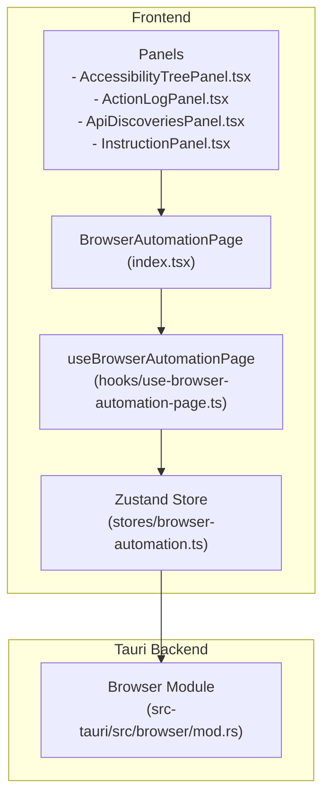
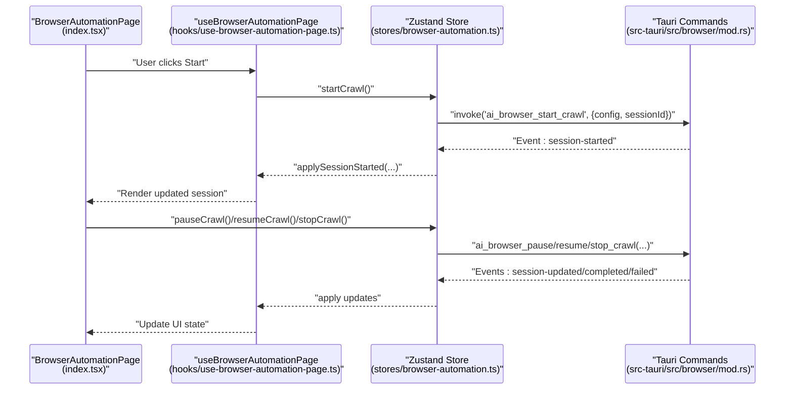
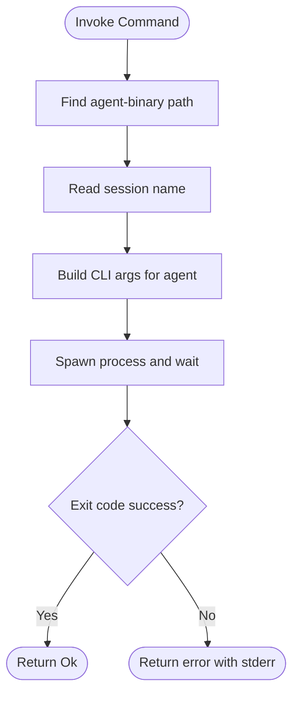
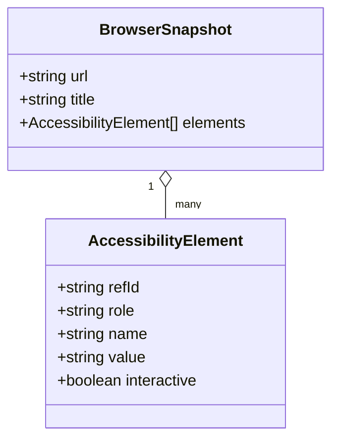
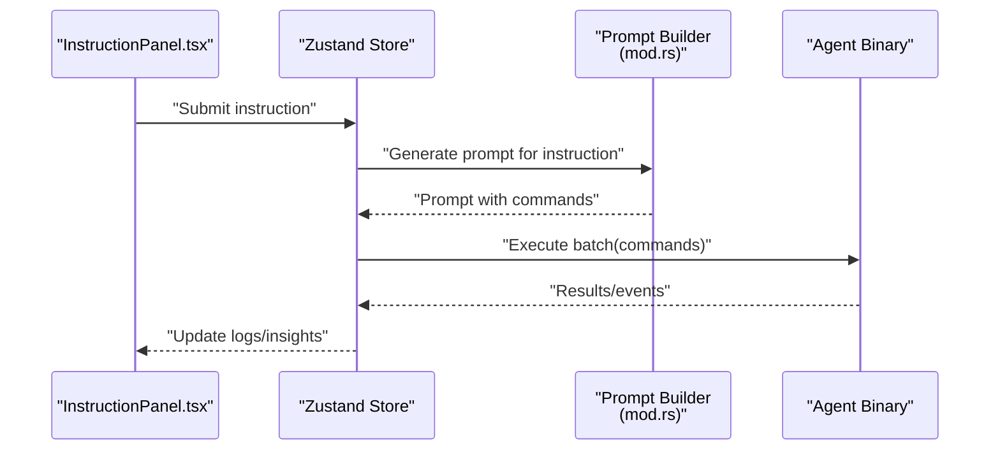
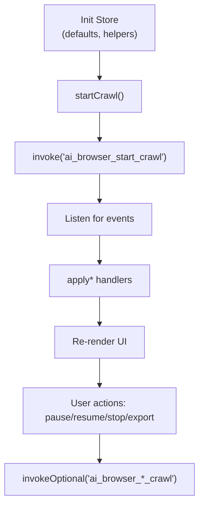
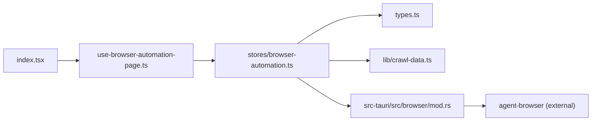

# Browser Automation Services

<cite>
**Referenced Files in This Document**
- [index.tsx](file://src/pages/browser-automation/index.tsx)
- [use-browser-automation-page.ts](file://src/pages/browser-automation/hooks/use-browser-automation-page.ts)
- [browser-automation.ts](file://src/stores/browser-automation.ts)
- [types.ts](file://src/pages/browser-automation/types.ts)
- [constants.ts](file://src/pages/browser-automation/constants.ts)
- [crawl-data.ts](file://src/pages/browser-automation/lib/crawl-data.ts)
- [AccessibilityTreePanel.tsx](file://src/pages/browser-automation/components/AccessibilityTreePanel.tsx)
- [ActionLogPanel.tsx](file://src/pages/browser-automation/components/ActionLogPanel.tsx)
- [ApiDiscoveriesPanel.tsx](file://src/pages/browser-automation/components/ApiDiscoveriesPanel.tsx)
- [InstructionPanel.tsx](file://src/pages/browser-automation/components/InstructionPanel.tsx)
- [mod.rs](file://src-tauri/src/browser/mod.rs)
</cite>

## Table of Contents
1. [Introduction](#introduction)
2. [Project Structure](#project-structure)
3. [Core Components](#core-components)
4. [Architecture Overview](#architecture-overview)
5. [Detailed Component Analysis](#detailed-component-analysis)
6. [Dependency Analysis](#dependency-analysis)
7. [Performance Considerations](#performance-considerations)
8. [Security and Sandboxing](#security-and-sandboxing)
9. [Practical Examples](#practical-examples)
10. [Extensibility Guidelines](#extensibility-guidelines)
11. [Troubleshooting Guide](#troubleshooting-guide)
12. [Conclusion](#conclusion)

## Introduction
This document describes AppRecon’s browser automation service layer. It covers:
- The browser control service backed by an external agent process and Tauri commands for navigation and element interaction
- The accessibility tree analysis service for DOM traversal and semantic element discovery
- The instruction-based automation service that generates and executes scripted actions
- Practical automation scenarios, cross-browser compatibility considerations, security and sandboxing, performance optimization, and extension guidelines

## Project Structure
The browser automation feature is organized around a React page container, a Zustand store for state and orchestration, Tauri-backed browser commands, and supporting UI panels for inspection, logs, and insights.

**Diagram sources**
- [index.tsx:24-167](file://src/pages/browser-automation/index.tsx#L24-L167)
- [use-browser-automation-page.ts:23-236](file://src/pages/browser-automation/hooks/use-browser-automation-page.ts#L23-L236)
- [browser-automation.ts:101-259](file://src/stores/browser-automation.ts#L101-L259)
- [mod.rs:198-384](file://src-tauri/src/browser/mod.rs#L198-L384)

**Section sources**
- [index.tsx:24-167](file://src/pages/browser-automation/index.tsx#L24-L167)
- [browser-automation.ts:101-259](file://src/stores/browser-automation.ts#L101-L259)

## Core Components
- Browser control service: Tauri commands for navigation, clicking, filling, typing, pressing keys, taking screenshots, and running batches of commands against a managed browser session.
- Accessibility tree analysis service: Captures a snapshot of the current page with interactive elements and roles, enabling semantic-aware automation.
- Instruction-based automation service: Generates prompts for an AI assistant to produce a sequence of commands given the current page and a natural-language instruction.
- State and orchestration: Frontend store manages crawl sessions, pages, insights, logs, and exports; UI hooks subscribe to backend events and drive filtering and selection.

**Section sources**
- [mod.rs:198-384](file://src-tauri/src/browser/mod.rs#L198-L384)
- [browser-automation.ts:46-75](file://src/stores/browser-automation.ts#L46-L75)
- [types.ts:16-98](file://src/pages/browser-automation/types.ts#L16-L98)

## Architecture Overview
The frontend initiates automation via Tauri commands and listens for real-time events emitted by the backend. The backend coordinates an external browser agent process and translates high-level actions into low-level browser commands.

**Diagram sources**
- [index.tsx:88-109](file://src/pages/browser-automation/index.tsx#L88-L109)
- [browser-automation.ts:118-176](file://src/stores/browser-automation.ts#L118-L176)
- [use-browser-automation-page.ts:60-98](file://src/pages/browser-automation/hooks/use-browser-automation-page.ts#L60-L98)
- [mod.rs:198-384](file://src-tauri/src/browser/mod.rs#L198-L384)

## Detailed Component Analysis

### Browser Control Service (WebDriver-less Agent)
- Purpose: Drive a managed browser session via discrete commands for navigation, interaction, and capture.
- Implemented commands:
  - Navigation: goto(url)
  - Interaction: click(ref), fill(ref, text), type(ref, text), press(key)
  - Capture: screenshot(path)
  - Batch: batch(commands[])
- Session management: The backend maintains a session name and delegates commands to the agent binary.

**Diagram sources**
- [mod.rs:198-384](file://src-tauri/src/browser/mod.rs#L198-L384)

**Section sources**
- [mod.rs:198-384](file://src-tauri/src/browser/mod.rs#L198-L384)

### Accessibility Tree Analysis Service
- Purpose: Provide a semantic view of the current page for safe, role-aware automation.
- Data model:
  - Snapshot: url, title, elements[]
  - Element: refId, role, name, value, interactive
- UI panel displays interactive elements with roles and identifiers for targeted actions.

**Diagram sources**
- [browser-automation.ts:28-32](file://src/stores/browser-automation.ts#L28-L32)
- [browser-automation.ts:20-26](file://src/stores/browser-automation.ts#L20-L26)

**Section sources**
- [browser-automation.ts:20-32](file://src/stores/browser-automation.ts#L20-L32)
- [AccessibilityTreePanel.tsx:12-61](file://src/pages/browser-automation/components/AccessibilityTreePanel.tsx#L12-L61)

### Instruction-Based Automation Service
- Purpose: Convert natural-language instructions into executable command sequences.
- Workflow:
  - Capture a snapshot of the current page
  - Build a prompt containing URL, title, interactive elements, and instruction
  - Return a JSON array of commands (click, fill, type, navigate, press)
- The frontend renders an instruction panel and triggers AI-driven runs.

**Diagram sources**
- [InstructionPanel.tsx:15-46](file://src/pages/browser-automation/components/InstructionPanel.tsx#L15-L46)
- [browser-automation.ts:118-154](file://src/stores/browser-automation.ts#L118-L154)
- [mod.rs:499-505](file://src-tauri/src/browser/mod.rs#L499-L505)

**Section sources**
- [InstructionPanel.tsx:15-46](file://src/pages/browser-automation/components/InstructionPanel.tsx#L15-L46)
- [mod.rs:499-505](file://src-tauri/src/browser/mod.rs#L499-L505)

### State Orchestration and Event Flow
- Store responsibilities:
  - Manage setup, session, pages, insights, logs
  - Start/pause/resume/stop crawl lifecycle
  - Apply backend events to state
  - Export data to JSON
- UI hooks:
  - Subscribe to Tauri events
  - Filter pages, insights, and logs
  - Provide actions for copying URLs, opening pages, exporting

**Diagram sources**
- [browser-automation.ts:101-259](file://src/stores/browser-automation.ts#L101-L259)
- [use-browser-automation-page.ts:60-119](file://src/pages/browser-automation/hooks/use-browser-automation-page.ts#L60-L119)

**Section sources**
- [browser-automation.ts:101-259](file://src/stores/browser-automation.ts#L101-L259)
- [use-browser-automation-page.ts:23-236](file://src/pages/browser-automation/hooks/use-browser-automation-page.ts#L23-L236)

## Dependency Analysis
- Frontend depends on:
  - Tauri core for command invocation and event listening
  - Zustand store for centralized state
  - Local libraries for mock data and UI filtering
- Backend depends on:
  - An external agent binary to control the browser
  - A session name to coordinate commands

**Diagram sources**
- [index.tsx:24-167](file://src/pages/browser-automation/index.tsx#L24-L167)
- [use-browser-automation-page.ts:23-51](file://src/pages/browser-automation/hooks/use-browser-automation-page.ts#L23-L51)
- [browser-automation.ts:101-259](file://src/stores/browser-automation.ts#L101-L259)
- [types.ts:16-98](file://src/pages/browser-automation/types.ts#L16-L98)
- [crawl-data.ts:11-38](file://src/pages/browser-automation/lib/crawl-data.ts#L11-L38)
- [mod.rs:39-50](file://src-tauri/src/browser/mod.rs#L39-L50)

**Section sources**
- [constants.ts:8-20](file://src/pages/browser-automation/constants.ts#L8-L20)
- [crawl-data.ts:11-38](file://src/pages/browser-automation/lib/crawl-data.ts#L11-L38)

## Performance Considerations
- Minimize unnecessary snapshots and interactions by targeting specific elements via refId.
- Batch related commands to reduce process spawn overhead.
- Tune request delay and timeouts per target site to balance speed and reliability.
- Limit concurrent operations and avoid redundant navigation.
- Use selective filtering and search to reduce UI rendering work on large datasets.

## Security and Sandboxing
- Isolation: The browser agent runs as a separate process, isolating automation from the main application.
- Permissions: Restrict agent-binary locations and ensure only trusted binaries are executed.
- Input sanitization: Validate and constrain instructions and URLs before invoking commands.
- Network interception: Combine automation with proxy/intercept services to monitor and control traffic safely.
- Principle of least privilege: Run the agent with minimal permissions required for the target site.

## Practical Examples
- Automated login flow:
  - Navigate to the login page
  - Fill username and password fields by refId
  - Click the submit button
  - Capture screenshot for verification
- API endpoint discovery:
  - Crawl with configured depth and path filters
  - Inspect insights and logs for suspicious endpoints
  - Export crawl data for downstream analysis
- Cross-browser compatibility:
  - Use semantic roles and accessible names to generalize interactions
  - Prefer element references (refId) over brittle selectors
  - Validate snapshots before issuing commands

## Extensibility Guidelines
- Adding new interaction patterns:
  - Extend the backend command surface in the browser module
  - Add corresponding UI panels and handlers in the store and hooks
  - Define types and constants for new log types or insight categories
- Integrating with external testing frameworks:
  - Export crawl data and logs in standardized formats
  - Emit structured events consumable by CI/CD pipelines
  - Provide programmatic controls for orchestration scripts

## Troubleshooting Guide
- Commands fail:
  - Verify agent-binary availability and path resolution
  - Check stderr messages returned by commands
  - Confirm session name is active and correct
- No events received:
  - Ensure event listeners are registered and not disposed prematurely
  - Validate event channel names match frontend expectations
- UI not updating:
  - Confirm apply handlers are invoked and state is updated
  - Check filters and search queries that might hide items

**Section sources**
- [mod.rs:39-50](file://src-tauri/src/browser/mod.rs#L39-L50)
- [use-browser-automation-page.ts:60-119](file://src/pages/browser-automation/hooks/use-browser-automation-page.ts#L60-L119)
- [browser-automation.ts:93-99](file://src/stores/browser-automation.ts#L93-L99)

## Conclusion
AppRecon’s browser automation service combines a robust Tauri-backed control plane with semantic-aware accessibility analysis and instruction-driven scripting. The modular architecture enables safe, extensible automation with strong observability through logs and insights. By following the performance, security, and extensibility guidelines, teams can build reliable, scalable automation workflows across diverse targets.