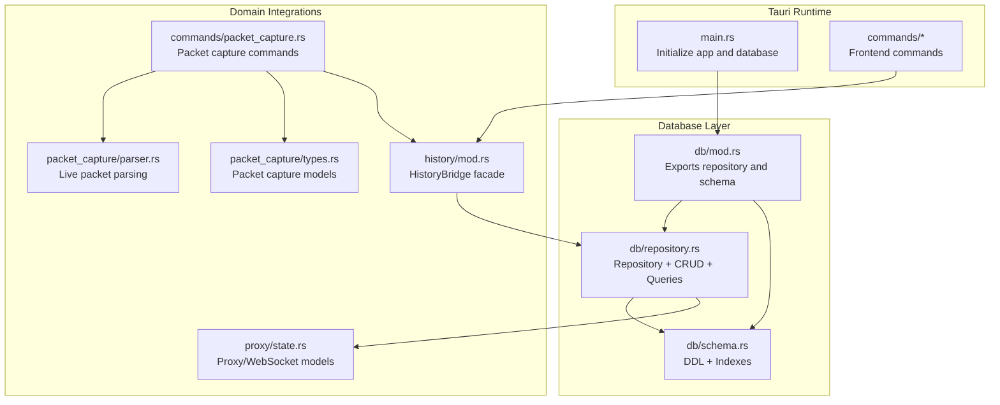
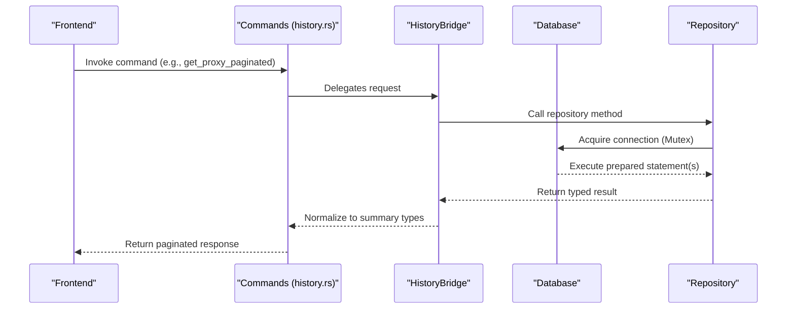
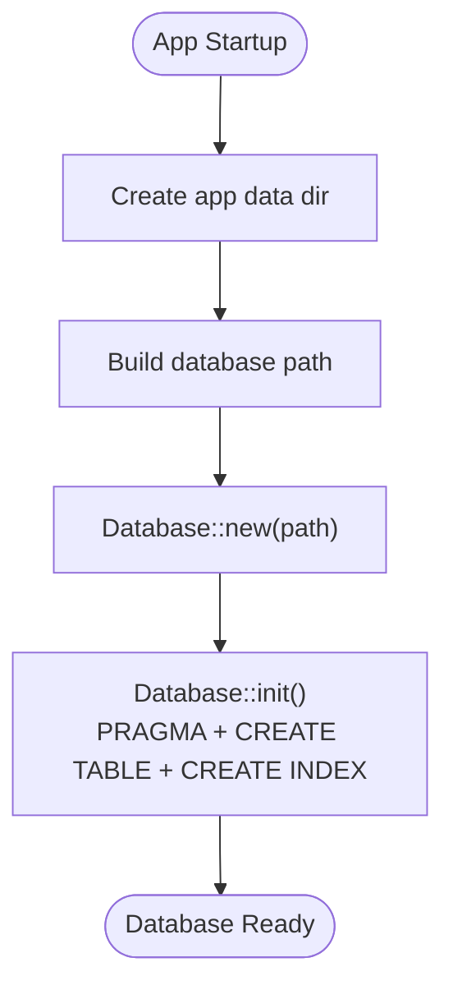
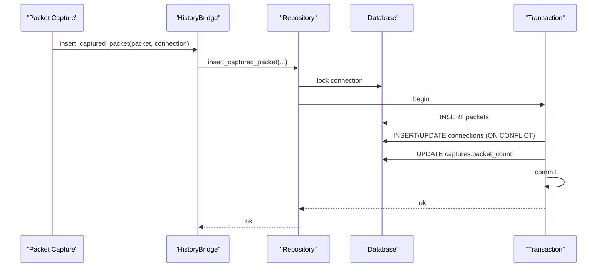
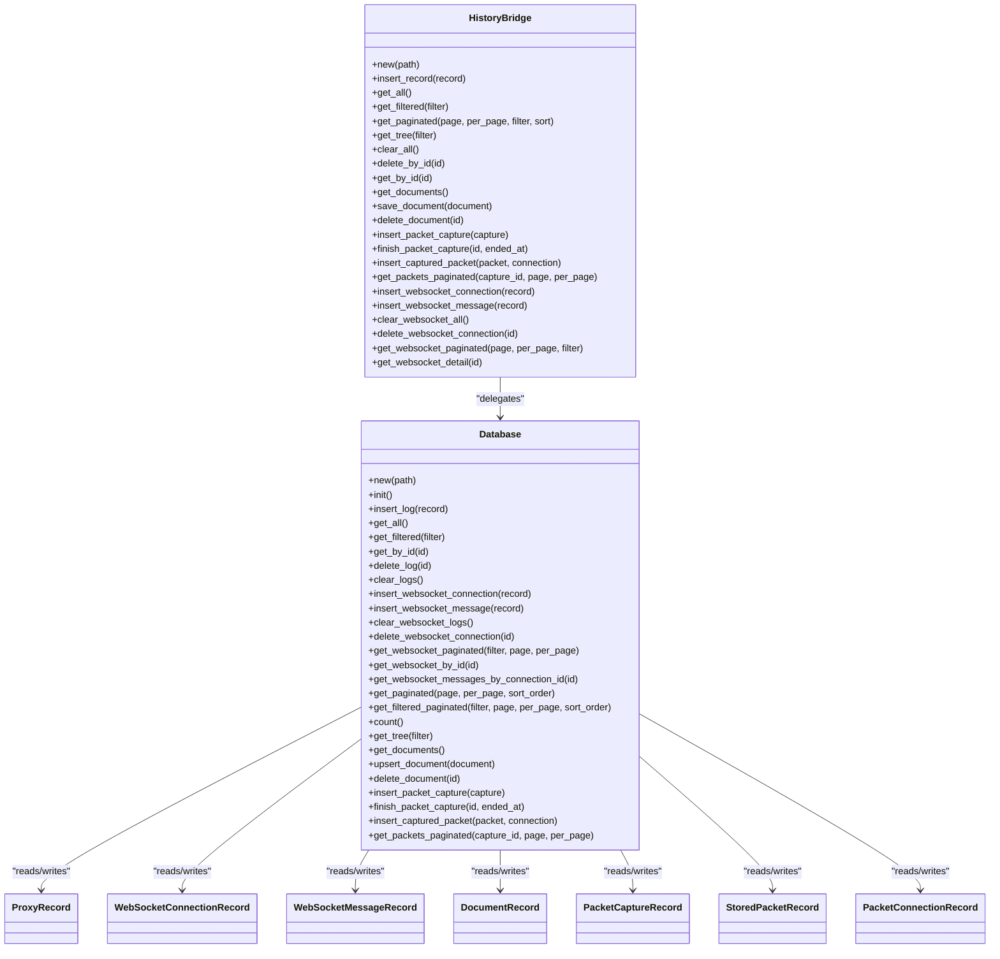
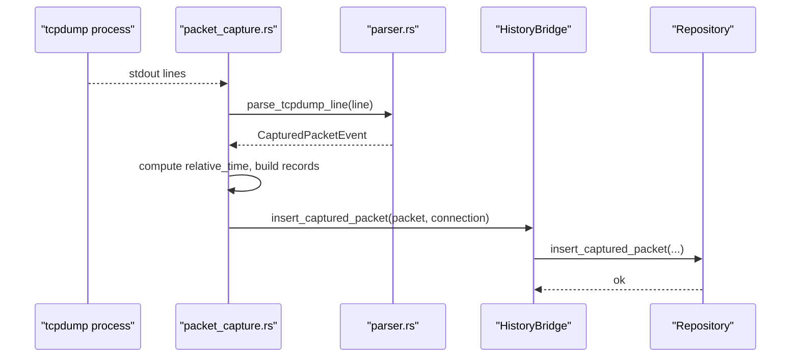
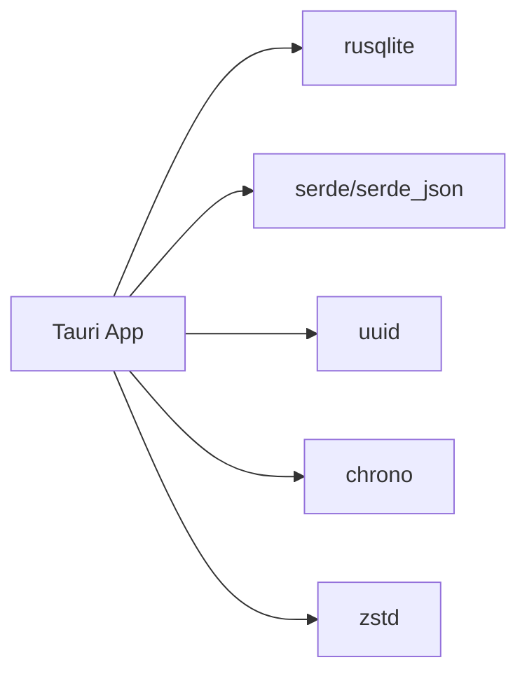

# Database Services

<cite>
**Referenced Files in This Document**
- [repository.rs](file://src-tauri/src/db/repository.rs)
- [schema.rs](file://src-tauri/src/db/schema.rs)
- [mod.rs](file://src-tauri/src/db/mod.rs)
- [history.rs](file://src-tauri/src/history/mod.rs)
- [main.rs](file://src-tauri/src/main.rs)
- [Cargo.toml](file://src-tauri/Cargo.toml)
- [packet_capture.rs](file://src-tauri/src/commands/packet_capture.rs)
- [parser.rs](file://src-tauri/src/packet_capture/parser.rs)
- [types.rs](file://src-tauri/src/packet_capture/types.rs)
- [state.rs](file://src-tauri/src/proxy/state.rs)
- [history.rs (commands)](file://src-tauri/src/commands/history.rs)
</cite>

## Table of Contents
1. [Introduction](#introduction)
2. [Project Structure](#project-structure)
3. [Core Components](#core-components)
4. [Architecture Overview](#architecture-overview)
5. [Detailed Component Analysis](#detailed-component-analysis)
6. [Dependency Analysis](#dependency-analysis)
7. [Performance Considerations](#performance-considerations)
8. [Troubleshooting Guide](#troubleshooting-guide)
9. [Conclusion](#conclusion)
10. [Appendices](#appendices)

## Introduction
This document describes AppRecon’s database service layer built with SQLite via the rusqlite crate. It explains the repository pattern implementation, schema management, transaction handling, and integration with the application runtime. It covers repository abstractions for HTTP logs, WebSocket connections, documents, and packet captures, along with initialization, connection handling, and migration strategies. Practical examples outline CRUD operations, complex queries, and bulk data operations. Guidance is included for performance optimization, indexing strategies, backup/restore, extending the layer, adding new entities, and maintaining data integrity.

## Project Structure
The database service resides under src-tauri/src/db and integrates with higher-level modules for history, packet capture, and proxy state. The main application initializes the database and exposes commands to the frontend.

**Diagram sources**
- [main.rs:30-51](file://src-tauri/src/main.rs#L30-L51)
- [mod.rs:1-3](file://src-tauri/src/db/mod.rs#L1-L3)
- [repository.rs:37-58](file://src-tauri/src/db/repository.rs#L37-L58)
- [schema.rs:1-176](file://src-tauri/src/db/schema.rs#L1-L176)
- [history.rs:61-70](file://src-tauri/src/history/mod.rs#L61-L70)
- [packet_capture.rs:150-284](file://src-tauri/src/commands/packet_capture.rs#L150-L284)
- [parser.rs:4-73](file://src-tauri/src/packet_capture/parser.rs#L4-L73)
- [types.rs:47-91](file://src-tauri/src/packet_capture/types.rs#L47-L91)
- [state.rs:29-93](file://src-tauri/src/proxy/state.rs#L29-L93)

**Section sources**
- [main.rs:30-51](file://src-tauri/src/main.rs#L30-L51)
- [mod.rs:1-3](file://src-tauri/src/db/mod.rs#L1-L3)

## Core Components
- Database: Wraps a single SQLite connection behind a mutex for thread-safe access. Initializes PRAGMA settings and creates all tables and indexes.
- HistoryBridge: A facade around Database that normalizes filters and summaries, and exposes a stable API to commands.
- Repository: Implements CRUD and complex queries for HTTP logs, WebSocket connections/messages, documents, and packet captures. Uses transactions for atomicity and prepared statements for performance.
- Schema: Declares DDL and indexes for all entities.
- Packet capture pipeline: Streams live tcpdump output, parses events, and persists them via the repository.

Key responsibilities:
- Initialization and migrations: PRAGMA foreign_keys, journal_mode, and CREATE TABLE with indexes.
- Transactions: Atomic batch inserts for packet captures and upserts for documents.
- Pagination: Offset/LIMIT queries with total counts.
- Filtering: Dynamic SQL composition with parameter binding for HTTP logs and WebSocket connections.
- JSON/BLOB handling: Efficient serialization/deserialization for headers and bodies.

**Section sources**
- [repository.rs:37-58](file://src-tauri/src/db/repository.rs#L37-L58)
- [repository.rs:211-257](file://src-tauri/src/db/repository.rs#L211-L257)
- [repository.rs:259-371](file://src-tauri/src/db/repository.rs#L259-L371)
- [repository.rs:373-448](file://src-tauri/src/db/repository.rs#L373-L448)
- [repository.rs:450-533](file://src-tauri/src/db/repository.rs#L450-L533)
- [repository.rs:60-163](file://src-tauri/src/db/repository.rs#L60-L163)
- [schema.rs:1-176](file://src-tauri/src/db/schema.rs#L1-L176)
- [history.rs:61-294](file://src-tauri/src/history/mod.rs#L61-L294)

## Architecture Overview
The runtime initializes the database at startup, manages a single connection guarded by a mutex, and exposes commands that route through HistoryBridge to the repository.

**Diagram sources**
- [main.rs:30-51](file://src-tauri/src/main.rs#L30-L51)
- [history.rs:61-294](file://src-tauri/src/history/mod.rs#L61-L294)
- [repository.rs:535-570](file://src-tauri/src/db/repository.rs#L535-L570)
- [history.rs (commands):56-65](file://src-tauri/src/commands/history.rs#L56-L65)

## Detailed Component Analysis

### Database Initialization and Connection Handling
- Initialization sets foreign_keys ON and journal_mode WAL for concurrency and durability.
- Creates all tables and indexes via schema constants.
- Single connection managed by a Mutex to serialize access in a single-threaded Tauri context.

**Diagram sources**
- [main.rs:30-51](file://src-tauri/src/main.rs#L30-L51)
- [repository.rs:49-58](file://src-tauri/src/db/repository.rs#L49-L58)
- [schema.rs:1-176](file://src-tauri/src/db/schema.rs#L1-L176)

**Section sources**
- [repository.rs:49-58](file://src-tauri/src/db/repository.rs#L49-L58)
- [main.rs:30-51](file://src-tauri/src/main.rs#L30-L51)

### Repository Pattern Implementation
- Database struct encapsulates a Mutex<Connection>.
- Methods expose typed operations for each entity:
  - HTTP logs: insert, get_all, get_by_id, get_filtered, delete, clear, paginated queries, tree aggregation.
  - WebSocket: insert connection/message, paginated connections, detail retrieval, filtering, clearing.
  - Documents: upsert, delete, list.
  - Packets: insert capture, finish capture, insert packet/connection, paginated retrieval.

Transactions:
- Packet insertion uses a transaction to ensure atomic updates to packets, connections, and capture counters.

Prepared statements and parameter binding:
- All queries use prepared statements with parameter arrays to prevent SQL injection and improve performance.

JSON/BLOB handling:
- Headers and bodies are serialized to/from JSON and stored as TEXT/BLOB where appropriate.

Pagination:
- Offset/LIMIT with explicit total counting for has_more calculation.

Complex queries:
- Dynamic SQL composition with parameter lists for flexible filtering on HTTP logs and WebSocket connections.

**Section sources**
- [repository.rs:37-58](file://src-tauri/src/db/repository.rs#L37-L58)
- [repository.rs:60-163](file://src-tauri/src/db/repository.rs#L60-L163)
- [repository.rs:165-209](file://src-tauri/src/db/repository.rs#L165-L209)
- [repository.rs:211-257](file://src-tauri/src/db/repository.rs#L211-L257)
- [repository.rs:259-371](file://src-tauri/src/db/repository.rs#L259-L371)
- [repository.rs:373-448](file://src-tauri/src/db/repository.rs#L373-L448)
- [repository.rs:450-533](file://src-tauri/src/db/repository.rs#L450-L533)
- [repository.rs:535-748](file://src-tauri/src/db/repository.rs#L535-L748)
- [repository.rs:758-918](file://src-tauri/src/db/repository.rs#L758-L918)

### Database Schema Management
Tables and indexes:
- http_logs: primary key id, timestamps, method, URL, headers/body (BLOB), client/server addresses, duration.
- websocket_connections: handshake metadata, state, message_count, last_activity_at.
- websocket_messages: connection_id FK, direction, type, payload (BLOB), payload_size.
- documents: id, name, title, sections (JSON), api_entries (JSON), timestamps.
- captures, packets, connections, packet_http_requests, packet_http_responses, packet_bodies: hierarchical packet capture model with foreign keys and indexes.

Indexes:
- Timestamp, method, URL for http_logs.
- Timestamp, host, URL for websocket_connections.
- Connection_id, timestamp for websocket_messages.
- Started_at for captures.
- Composite indexes for packet and connection lookups.

Foreign keys:
- Cascading deletes for related packet capture entities.

**Section sources**
- [schema.rs:1-176](file://src-tauri/src/db/schema.rs#L1-L176)

### Transaction Handling Mechanisms
- Packet capture insertion wraps multiple writes in a single transaction to maintain consistency.
- Updates to capture counters and connection aggregates are atomic.

**Diagram sources**
- [repository.rs:96-163](file://src-tauri/src/db/repository.rs#L96-L163)

**Section sources**
- [repository.rs:96-163](file://src-tauri/src/db/repository.rs#L96-L163)

### Repository Abstractions for Data Models
- HTTP Logs: ProxyRecord with request/response headers/body, timestamps, and addresses. CRUD plus filtered pagination and tree aggregation.
- WebSocket: WebSocketConnectionRecord and WebSocketMessageRecord with direction/type enums, JSON headers, and BLOB payloads.
- Documents: DocumentRecord with JSON sections and API entries.
- Packet Captures: PacketCaptureRecord, StoredPacketRecord, PacketConnectionRecord, and hierarchical HTTP request/response/body tables.

**Diagram sources**
- [repository.rs:37-919](file://src-tauri/src/db/repository.rs#L37-L919)
- [history.rs:61-294](file://src-tauri/src/history/mod.rs#L61-L294)
- [state.rs:29-93](file://src-tauri/src/proxy/state.rs#L29-L93)
- [types.rs:47-91](file://src-tauri/src/packet_capture/types.rs#L47-L91)

**Section sources**
- [repository.rs:37-919](file://src-tauri/src/db/repository.rs#L37-L919)
- [history.rs:61-294](file://src-tauri/src/history/mod.rs#L61-L294)
- [state.rs:29-93](file://src-tauri/src/proxy/state.rs#L29-L93)
- [types.rs:47-91](file://src-tauri/src/packet_capture/types.rs#L47-L91)

### Practical Examples

#### CRUD Operations
- Insert HTTP log: [repository.rs:259-293](file://src-tauri/src/db/repository.rs#L259-L293)
- Upsert document: [repository.rs:223-251](file://src-tauri/src/db/repository.rs#L223-L251)
- Delete document: [repository.rs:253-257](file://src-tauri/src/db/repository.rs#L253-L257)
- Clear logs: [repository.rs:367-371](file://src-tauri/src/db/repository.rs#L367-L371)

#### Complex Queries
- Filtered HTTP logs: [repository.rs:303-348](file://src-tauri/src/db/repository.rs#L303-L348)
- Paginated filtered HTTP logs: [repository.rs:578-748](file://src-tauri/src/db/repository.rs#L578-L748)
- WebSocket paginated with dynamic filters: [repository.rs:450-498](file://src-tauri/src/db/repository.rs#L450-L498)

#### Bulk Data Operations
- Packet capture batch insert with transaction: [repository.rs:96-163](file://src-tauri/src/db/repository.rs#L96-L163)
- Packet pagination: [repository.rs:165-209](file://src-tauri/src/db/repository.rs#L165-L209)

**Section sources**
- [repository.rs:259-293](file://src-tauri/src/db/repository.rs#L259-L293)
- [repository.rs:223-251](file://src-tauri/src/db/repository.rs#L223-L251)
- [repository.rs:253-257](file://src-tauri/src/db/repository.rs#L253-L257)
- [repository.rs:367-371](file://src-tauri/src/db/repository.rs#L367-L371)
- [repository.rs:303-348](file://src-tauri/src/db/repository.rs#L303-L348)
- [repository.rs:578-748](file://src-tauri/src/db/repository.rs#L578-L748)
- [repository.rs:450-498](file://src-tauri/src/db/repository.rs#L450-L498)
- [repository.rs:96-163](file://src-tauri/src/db/repository.rs#L96-L163)
- [repository.rs:165-209](file://src-tauri/src/db/repository.rs#L165-L209)

### Packet Capture Pipeline
- Live capture via tcpdump, parsing lines into CapturedPacketEvent, constructing StoredPacketRecord and PacketConnectionRecord, and persisting atomically.

**Diagram sources**
- [packet_capture.rs:150-284](file://src-tauri/src/commands/packet_capture.rs#L150-L284)
- [parser.rs:4-73](file://src-tauri/src/packet_capture/parser.rs#L4-L73)
- [types.rs:95-107](file://src-tauri/src/packet_capture/types.rs#L95-L107)
- [repository.rs:96-163](file://src-tauri/src/db/repository.rs#L96-L163)

**Section sources**
- [packet_capture.rs:150-284](file://src-tauri/src/commands/packet_capture.rs#L150-L284)
- [parser.rs:4-73](file://src-tauri/src/packet_capture/parser.rs#L4-L73)
- [types.rs:95-107](file://src-tauri/src/packet_capture/types.rs#L95-L107)
- [repository.rs:96-163](file://src-tauri/src/db/repository.rs#L96-L163)

## Dependency Analysis
- rusqlite: SQLite driver with bundled feature for portability.
- serde/serde_json: JSON serialization for headers and structured fields.
- uuid: Unique identifiers for records.
- chrono: RFC3339 timestamps for persistence and sorting.
- zstd: Available in dependencies; not used in database layer.

**Diagram sources**
- [Cargo.toml:11-62](file://src-tauri/Cargo.toml#L11-L62)

**Section sources**
- [Cargo.toml:11-62](file://src-tauri/Cargo.toml#L11-L62)

## Performance Considerations
- Connection model: Single connection guarded by Mutex. This is suitable for Tauri’s single-threaded runtime model and avoids contention. For multi-threaded workloads, consider a pool or separate threads with their own connections.
- Prepared statements: Used consistently to reduce parsing overhead and improve throughput.
- Transactions: Batch packet inserts minimize WAL writes and ensure atomicity.
- Indexes: Strategic indexes on timestamp, method, URL, host, and composite packet fields optimize common queries.
- JSON/BLOB sizing: Large headers/body stored as BLOB/TEXT; consider compression if needed, noting zstd is present but not used in the database layer.
- Pagination: Offset/LIMIT with total count; for very large datasets, consider cursor-based pagination to avoid expensive COUNT queries.

[No sources needed since this section provides general guidance]

## Troubleshooting Guide
Common issues and remedies:
- Foreign key constraint failures: Ensure parent records exist before inserting children (e.g., packets require captures).
- Missing indexes: Slow queries on large datasets; add indexes for frequently filtered columns.
- JSON parsing errors: Malformed headers/body; repository skips malformed rows with warnings.
- Permission errors on macOS packet capture: Use provided permission helper command.
- Transaction failures: Packet capture transaction rollback indicates partial failure; re-run capture after fixing underlying issues.

**Section sources**
- [repository.rs:1124-1126](file://src-tauri/src/db/repository.rs#L1124-L1126)
- [packet_capture.rs:31-46](file://src-tauri/src/commands/packet_capture.rs#L31-L46)

## Conclusion
AppRecon’s database service layer follows a clean repository pattern with SQLite, providing robust initialization, transactions, and typed repositories for HTTP logs, WebSocket data, documents, and packet captures. The design emphasizes safety (transactions, prepared statements), performance (indexes, batching), and usability (pagination, filtering). Extending the layer requires adding schema DDL, indexes, repository methods, and a facade method in HistoryBridge.

[No sources needed since this section summarizes without analyzing specific files]

## Appendices

### SQLite Configuration Notes
- Journal mode: WAL improves concurrent reads and write performance.
- Foreign keys: Enabled to maintain referential integrity for packet capture hierarchy.
- No ZSTD compression: While zstd is available, the database layer stores JSON and BLOB without compression.

**Section sources**
- [repository.rs:49-52](file://src-tauri/src/db/repository.rs#L49-L52)
- [Cargo.toml:49](file://src-tauri/Cargo.toml#L49)

### Adding a New Entity
Steps to add a new entity:
1. Define a struct in the appropriate module (e.g., proxy/state.rs or packet_capture/types.rs).
2. Add CREATE TABLE and indexes to schema.rs.
3. Implement repository methods in repository.rs (insert/upsert/select/update/delete).
4. Expose a facade method in history/mod.rs and a command in commands/history.rs.
5. Update mod.rs exports if needed.

**Section sources**
- [schema.rs:1-176](file://src-tauri/src/db/schema.rs#L1-L176)
- [repository.rs:37-919](file://src-tauri/src/db/repository.rs#L37-L919)
- [history.rs:61-294](file://src-tauri/src/history/mod.rs#L61-L294)
- [history.rs (commands):56-65](file://src-tauri/src/commands/history.rs#L56-L65)