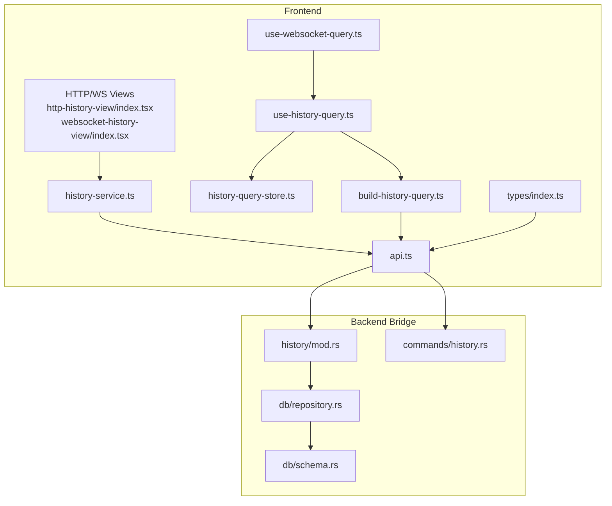
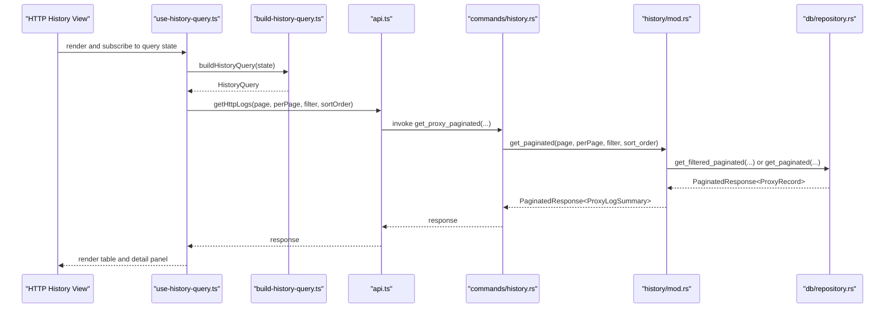
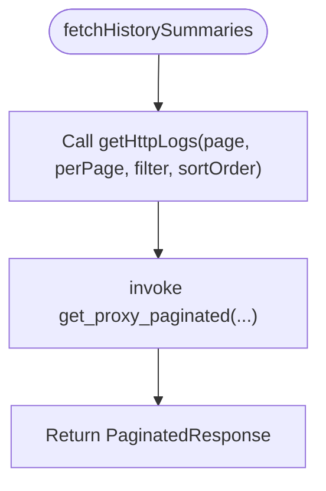
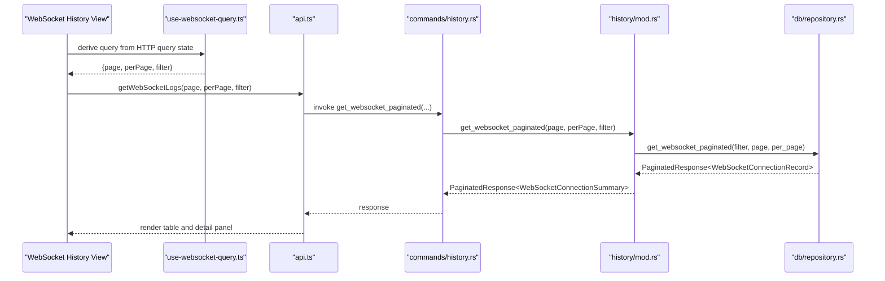
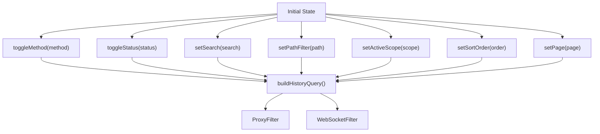
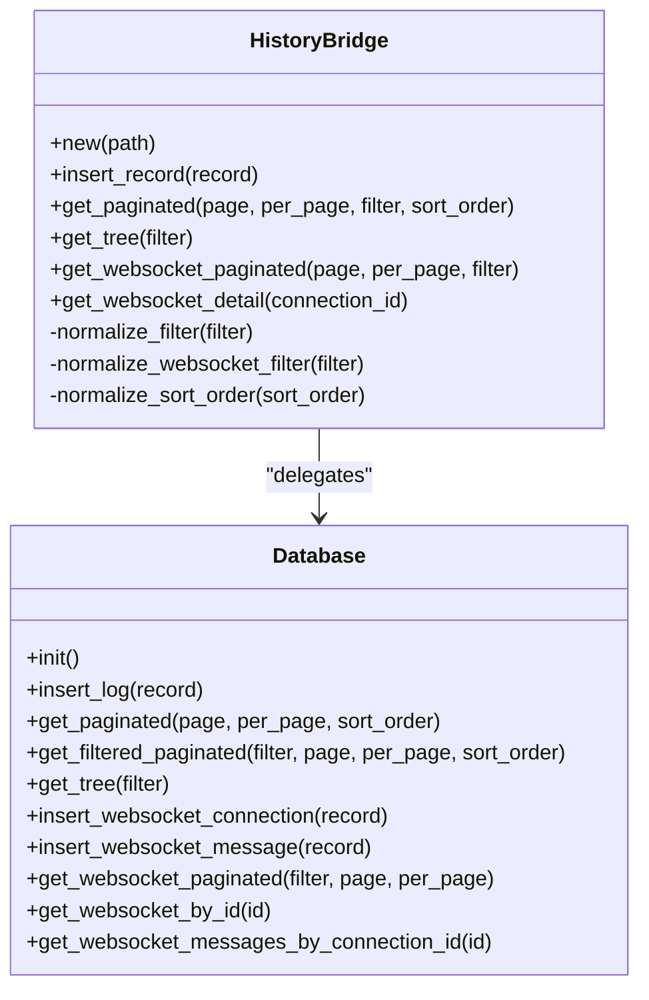
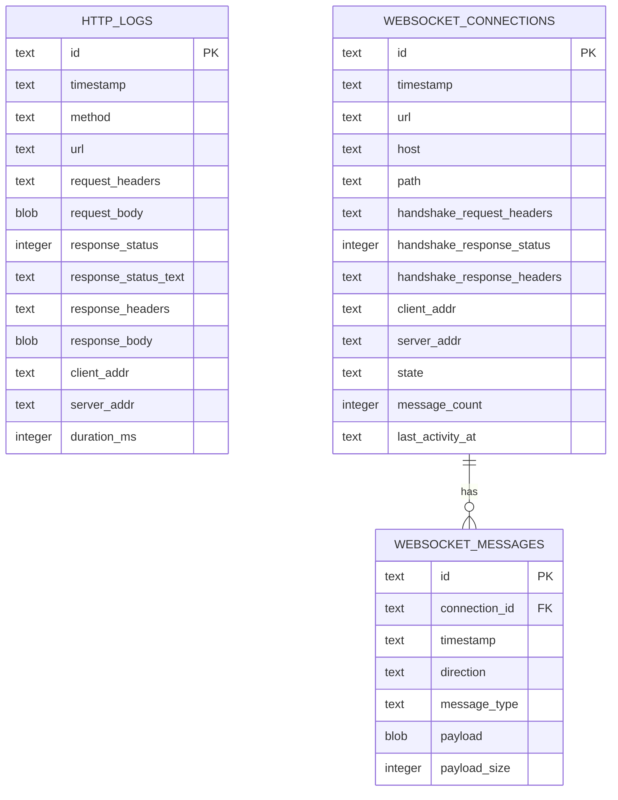
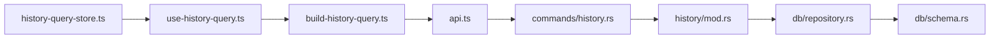

# History Management Services

<cite>
**Referenced Files in This Document**
- [history-service.ts](file://src/pages/live-traffic/services/history-service.ts)
- [api.ts](file://src/pages/live-traffic/api.ts)
- [history-query-store.ts](file://src/pages/live-traffic/state/history-query-store.ts)
- [build-history-query.ts](file://src/pages/live-traffic/state/build-history-query.ts)
- [use-history-query.ts](file://src/pages/live-traffic/hooks/use-history-query.ts)
- [use-websocket-query.ts](file://src/pages/live-traffic/hooks/use-websocket-query.ts)
- [history.rs](file://src-tauri/src/history/mod.rs)
- [history.rs (commands)](file://src-tauri/src/commands/history.rs)
- [repository.rs](file://src-tauri/src/db/repository.rs)
- [schema.rs](file://src-tauri/src/db/schema.rs)
- [index.ts (types)](file://src/types/index.ts)
- [index.tsx (HTTP History View)](file://src/pages/live-traffic/components/http-history-view/index.tsx)
- [index.tsx (WebSocket History View)](file://src/pages/live-traffic/components/websocket-history-view/index.tsx)
- [history-loading-state.tsx](file://src/pages/live-traffic/components/history-loading-state.tsx)
</cite>

## Table of Contents
1. [Introduction](#introduction)
2. [Project Structure](#project-structure)
3. [Core Components](#core-components)
4. [Architecture Overview](#architecture-overview)
5. [Detailed Component Analysis](#detailed-component-analysis)
6. [Dependency Analysis](#dependency-analysis)
7. [Performance Considerations](#performance-considerations)
8. [Troubleshooting Guide](#troubleshooting-guide)
9. [Conclusion](#conclusion)
10. [Appendices](#appendices)

## Introduction
This document describes AppRecon’s history management service layer responsible for capturing, storing, querying, and presenting HTTP and WebSocket traffic logs. It covers:
- Real-time traffic logging and storage
- Filtering mechanisms for HTTP and WebSocket histories
- Pagination and sorting for efficient browsing
- Query building and normalization
- Export-ready data models
- Memory and storage optimization strategies
- Practical usage examples for retrieving and filtering history
- Guidelines for extending services, adding new filters, and implementing custom analytics

## Project Structure
The history management spans three layers:
- Frontend service layer: orchestrates queries and invokes backend commands
- API layer: wraps Tauri invocations and exposes typed functions
- Backend bridge and persistence: normalizes filters, executes SQL queries, and manages database state

**Diagram sources**
- [history-service.ts:1-57](file://src/pages/live-traffic/services/history-service.ts#L1-L57)
- [api.ts:125-189](file://src/pages/live-traffic/api.ts#L125-L189)
- [history-query-store.ts:1-140](file://src/pages/live-traffic/state/history-query-store.ts#L1-L140)
- [build-history-query.ts:12-67](file://src/pages/live-traffic/state/build-history-query.ts#L12-L67)
- [use-history-query.ts:7-116](file://src/pages/live-traffic/hooks/use-history-query.ts#L7-L116)
- [use-websocket-query.ts:14-37](file://src/pages/live-traffic/hooks/use-websocket-query.ts#L14-L37)
- [history.rs:61-294](file://src-tauri/src/history/mod.rs#L61-L294)
- [history.rs (commands):7-117](file://src-tauri/src/commands/history.rs#L7-L117)
- [repository.rs:49-84](file://src-tauri/src/db/repository.rs#L49-L84)
- [schema.rs:1-176](file://src-tauri/src/db/schema.rs#L1-L176)
- [index.tsx (HTTP History View):7-19](file://src/pages/live-traffic/components/http-history-view/index.tsx#L7-L19)
- [index.tsx (WebSocket History View):9-26](file://src/pages/live-traffic/components/websocket-history-view/index.tsx#L9-L26)

**Section sources**
- [history-service.ts:1-57](file://src/pages/live-traffic/services/history-service.ts#L1-L57)
- [api.ts:125-189](file://src/pages/live-traffic/api.ts#L125-L189)
- [history-query-store.ts:1-140](file://src/pages/live-traffic/state/history-query-store.ts#L1-L140)
- [build-history-query.ts:12-67](file://src/pages/live-traffic/state/build-history-query.ts#L12-L67)
- [use-history-query.ts:7-116](file://src/pages/live-traffic/hooks/use-history-query.ts#L7-L116)
- [use-websocket-query.ts:14-37](file://src/pages/live-traffic/hooks/use-websocket-query.ts#L14-L37)
- [history.rs:61-294](file://src-tauri/src/history/mod.rs#L61-L294)
- [history.rs (commands):7-117](file://src-tauri/src/commands/history.rs#L7-L117)
- [repository.rs:49-84](file://src-tauri/src/db/repository.rs#L49-L84)
- [schema.rs:1-176](file://src-tauri/src/db/schema.rs#L1-L176)
- [index.tsx (HTTP History View):7-19](file://src/pages/live-traffic/components/http-history-view/index.tsx#L7-L19)
- [index.tsx (WebSocket History View):9-26](file://src/pages/live-traffic/components/websocket-history-view/index.tsx#L9-L26)

## Core Components
- Frontend service layer: thin wrappers around Tauri commands for fetching summaries, details, tree views, and deletion/clear operations.
- API layer: typed functions that invoke Tauri commands with robust error handling and normalization.
- Query builder and store: manage filter state, pagination, sorting, and scope selection; transform state into backend-filter objects.
- Backend bridge: normalizes filters, selects optimized query paths, and delegates to the repository.
- Repository and schema: define tables, indexes, and SQL logic for paginated queries, filtering, and counts.

Key responsibilities:
- HTTP history: paginated logs, tree aggregation, and detail retrieval
- WebSocket history: paginated connections, message retrieval, and detail retrieval
- Deletion and clearing: per-record and bulk operations

**Section sources**
- [history-service.ts:20-57](file://src/pages/live-traffic/services/history-service.ts#L20-L57)
- [api.ts:125-189](file://src/pages/live-traffic/api.ts#L125-L189)
- [history-query-store.ts:3-31](file://src/pages/live-traffic/state/history-query-store.ts#L3-L31)
- [build-history-query.ts:12-67](file://src/pages/live-traffic/state/build-history-query.ts#L12-L67)
- [history.rs:136-191](file://src-tauri/src/history/mod.rs#L136-L191)
- [repository.rs:535-748](file://src-tauri/src/db/repository.rs#L535-L748)
- [schema.rs:1-56](file://src-tauri/src/db/schema.rs#L1-L56)

## Architecture Overview
End-to-end flow for HTTP history retrieval:

**Diagram sources**
- [use-history-query.ts:7-116](file://src/pages/live-traffic/hooks/use-history-query.ts#L7-L116)
- [build-history-query.ts:12-67](file://src/pages/live-traffic/state/build-history-query.ts#L12-L67)
- [api.ts:125-137](file://src/pages/live-traffic/api.ts#L125-L137)
- [history.rs (commands):57-65](file://src-tauri/src/commands/history.rs#L57-L65)
- [history.rs:162-186](file://src-tauri/src/history/mod.rs#L162-L186)
- [repository.rs:535-570](file://src-tauri/src/db/repository.rs#L535-L570)

## Detailed Component Analysis

### HTTP History Service Layer
- Responsibilities:
  - Fetch paginated HTTP summaries
  - Build tree view of hosts/paths/methods
  - Retrieve detailed records
  - Clear and delete operations
- Implementation highlights:
  - Uses typed filters and paginated responses
  - Delegates to Tauri commands via API layer
  - Exposes convenience functions for callers

**Diagram sources**
- [history-service.ts:20-24](file://src/pages/live-traffic/services/history-service.ts#L20-L24)
- [api.ts:125-137](file://src/pages/live-traffic/api.ts#L125-L137)
- [history.rs (commands):57-65](file://src-tauri/src/commands/history.rs#L57-L65)

**Section sources**
- [history-service.ts:20-32](file://src/pages/live-traffic/services/history-service.ts#L20-L32)
- [api.ts:125-143](file://src/pages/live-traffic/api.ts#L125-L143)

### WebSocket History Service Layer
- Responsibilities:
  - Fetch paginated WebSocket connection summaries
  - Retrieve detailed connection with messages
  - Clear and delete operations
- Implementation highlights:
  - Uses WebSocket-specific filters and DTOs
  - Aggregates connection metadata and message lists

**Diagram sources**
- [use-websocket-query.ts:14-37](file://src/pages/live-traffic/hooks/use-websocket-query.ts#L14-L37)
- [api.ts:173-189](file://src/pages/live-traffic/api.ts#L173-L189)
- [history.rs (commands):86-93](file://src-tauri/src/commands/history.rs#L86-L93)
- [history.rs:218-241](file://src-tauri/src/history/mod.rs#L218-L241)
- [repository.rs:450-498](file://src-tauri/src/db/repository.rs#L450-L498)

**Section sources**
- [history-service.ts:34-44](file://src/pages/live-traffic/services/history-service.ts#L34-L44)
- [api.ts:173-189](file://src/pages/live-traffic/api.ts#L173-L189)
- [use-websocket-query.ts:14-37](file://src/pages/live-traffic/hooks/use-websocket-query.ts#L14-L37)

### Query Building and Filtering
- Filter state management:
  - Search, methods, status codes, path filter
  - Active scope, sort order, pagination, selection, refresh key
- Normalization:
  - Converts sets to arrays, trims strings, expands status code ranges (e.g., 2xx)
  - Builds ProxyFilter and WebSocketFilter objects for backend consumption
- Scope filtering:
  - Supports wildcard domains (*.example.com) and exact matches

**Diagram sources**
- [history-query-store.ts:40-139](file://src/pages/live-traffic/state/history-query-store.ts#L40-L139)
- [build-history-query.ts:12-67](file://src/pages/live-traffic/state/build-history-query.ts#L12-L67)

**Section sources**
- [history-query-store.ts:3-31](file://src/pages/live-traffic/state/history-query-store.ts#L3-L31)
- [build-history-query.ts:12-67](file://src/pages/live-traffic/state/build-history-query.ts#L12-L67)
- [use-history-query.ts:7-116](file://src/pages/live-traffic/hooks/use-history-query.ts#L7-L116)

### Backend Bridge and Repository
- Normalization:
  - Trims and filters optional strings and vectors
  - Expands status code ranges into explicit lists
- Query paths:
  - If active filters exist, uses filtered paginated queries
  - Otherwise falls back to full paginated queries
- Sorting:
  - Accepts ASC/DESC; defaults to DESC
- Indexes:
  - Timestamp, method, URL for HTTP logs
  - Timestamp, host, URL, message connection_id for WebSocket

**Diagram sources**
- [history.rs:61-294](file://src-tauri/src/history/mod.rs#L61-L294)
- [repository.rs:535-748](file://src-tauri/src/db/repository.rs#L535-L748)

**Section sources**
- [history.rs:162-191](file://src-tauri/src/history/mod.rs#L162-L191)
- [repository.rs:535-748](file://src-tauri/src/db/repository.rs#L535-L748)
- [schema.rs:18-56](file://src-tauri/src/db/schema.rs#L18-L56)

### Data Models and Types
- HTTP summary and record types
- WebSocket connection and message types
- Paginated response envelope
- Filters for HTTP and WebSocket

**Diagram sources**
- [schema.rs:1-56](file://src-tauri/src/db/schema.rs#L1-L56)
- [index.ts:84-112](file://src/types/index.ts#L84-L112)

**Section sources**
- [index.ts:84-112](file://src/types/index.ts#L84-L112)
- [schema.rs:1-56](file://src-tauri/src/db/schema.rs#L1-L56)

## Dependency Analysis
- Frontend depends on:
  - Zustand store for state
  - React hooks for memoization and derived queries
  - API layer for Tauri invocations
- Backend depends on:
  - rusqlite for SQLite operations
  - serde for serialization/deserialization
  - Tauri commands for frontend-backend boundary

**Diagram sources**
- [history-query-store.ts:1-140](file://src/pages/live-traffic/state/history-query-store.ts#L1-L140)
- [use-history-query.ts:7-116](file://src/pages/live-traffic/hooks/use-history-query.ts#L7-L116)
- [build-history-query.ts:12-67](file://src/pages/live-traffic/state/build-history-query.ts#L12-L67)
- [api.ts:125-189](file://src/pages/live-traffic/api.ts#L125-L189)
- [history.rs (commands):7-117](file://src-tauri/src/commands/history.rs#L7-L117)
- [history.rs:61-294](file://src-tauri/src/history/mod.rs#L61-L294)
- [repository.rs:49-84](file://src-tauri/src/db/repository.rs#L49-L84)
- [schema.rs:1-176](file://src-tauri/src/db/schema.rs#L1-L176)

**Section sources**
- [history.rs (commands):7-117](file://src-tauri/src/commands/history.rs#L7-L117)
- [repository.rs:49-84](file://src-tauri/src/db/repository.rs#L49-L84)

## Performance Considerations
- Database initialization and indexing:
  - Foreign keys enabled and WAL journal mode for concurrency and durability
  - Dedicated indexes on timestamp, method, URL for HTTP logs; on timestamp, host, URL, message connection_id for WebSocket
- Query optimization:
  - Paginated queries with LIMIT/OFFSET and computed total
  - Conditional SQL composition based on active filters
  - Separate filtered and unfiltered paths to avoid unnecessary scans
- Payload handling:
  - Headers and bodies stored as text/blob; consider compression or streaming for very large payloads
- UI responsiveness:
  - Memoized selectors and derived queries prevent redundant re-computation
  - Loading skeletons improve perceived performance during fetches

Recommendations:
- Add composite indexes for frequent filter combinations (e.g., method+timestamp, host+timestamp)
- Consider partitioning or retention policies for long-running sessions
- For export-heavy workloads, pre-aggregate summaries or materialized views

**Section sources**
- [repository.rs:49-84](file://src-tauri/src/db/repository.rs#L49-L84)
- [schema.rs:18-56](file://src-tauri/src/db/schema.rs#L18-L56)
- [history.rs:162-191](file://src-tauri/src/history/mod.rs#L162-L191)
- [history-loading-state.tsx:11-47](file://src/pages/live-traffic/components/history-loading-state.tsx#L11-L47)

## Troubleshooting Guide
Common issues and resolutions:
- Tauri backend unavailable:
  - Ensure the desktop app is started with the Tauri runner, not the web dev server
- Query errors:
  - Inspect normalized filters and ensure non-empty values are passed
- Large datasets:
  - Increase perPage gradually and rely on pagination
- WebSocket detail missing:
  - Verify connection ID exists and messages are present in the database

Operational checks:
- Confirm database initialization ran successfully
- Validate indexes exist for targeted queries
- Monitor query execution paths (filtered vs unfiltered)

**Section sources**
- [api.ts:35-45](file://src/pages/live-traffic/api.ts#L35-L45)
- [history.rs:66-70](file://src-tauri/src/history/mod.rs#L66-L70)
- [repository.rs:535-570](file://src-tauri/src/db/repository.rs#L535-L570)

## Conclusion
AppRecon’s history management service layer provides a robust, indexed, and paginated foundation for HTTP and WebSocket traffic inspection. Its layered design cleanly separates concerns between UI, query construction, backend bridging, and persistence. With proper indexing, pagination, and normalization, it scales to large datasets while remaining responsive and extensible.

## Appendices

### Practical Examples

- Retrieve HTTP history with pagination and sorting:
  - Use the hook to derive a query, then call the service to fetch summaries
  - Example invocation path: [use-history-query.ts:54-64](file://src/pages/live-traffic/hooks/use-history-query.ts#L54-L64) → [history-service.ts:20-24](file://src/pages/live-traffic/services/history-service.ts#L20-L24)

- Filter by method and status range:
  - Toggle methods and status codes in the store; ranges are expanded automatically
  - Example path: [history-query-store.ts:86-114](file://src/pages/live-traffic/state/history-query-store.ts#L86-L114) → [build-history-query.ts:24-53](file://src/pages/live-traffic/state/build-history-query.ts#L24-L53)

- Filter by scope (wildcard and exact):
  - Provide scope patterns; wildcard domains are normalized
  - Example path: [build-history-query.ts:20](file://src/pages/live-traffic/state/build-history-query.ts#L20) and [repository.rs:629-654](file://src-tauri/src/db/repository.rs#L629-L654)

- Retrieve WebSocket history and messages:
  - Use the WebSocket hook to derive a query, then fetch details
  - Example path: [use-websocket-query.ts:17-28](file://src/pages/live-traffic/hooks/use-websocket-query.ts#L17-L28) → [history-service.ts:34-44](file://src/pages/live-traffic/services/history-service.ts#L34-L44)

- Export historical data:
  - Use filtered or paginated APIs to export subsets
  - Example path: [api.ts:125-137](file://src/pages/live-traffic/api.ts#L125-L137) and [history.rs (commands):57-65](file://src-tauri/src/commands/history.rs#L57-L65)

### Extending History Services

- Adding a new HTTP filter:
  - Extend the filter interface and builder logic
  - Add corresponding SQL conditions in the repository
  - Example paths: [api.ts:68-74](file://src/pages/live-traffic/api.ts#L68-L74) → [build-history-query.ts:55-66](file://src/pages/live-traffic/state/build-history-query.ts#L55-L66) → [repository.rs:572-748](file://src-tauri/src/db/repository.rs#L572-L748)

- Adding a new WebSocket filter:
  - Extend the WebSocket filter interface and builder logic
  - Add SQL conditions in the repository
  - Example paths: [api.ts:76-80](file://src/pages/live-traffic/api.ts#L76-L80) → [history.rs:287-293](file://src-tauri/src/history/mod.rs#L287-L293) → [repository.rs:450-498](file://src-tauri/src/db/repository.rs#L450-L498)

- Implementing custom analytics:
  - Use filtered paginated queries to compute metrics (e.g., top hosts, error rates)
  - Example path: [repository.rs:572-748](file://src-tauri/src/db/repository.rs#L572-L748)

- Memory management for large datasets:
  - Prefer paginated queries and avoid loading entire tables
  - Use appropriate perPage sizes and leverage indexes
  - Example path: [repository.rs:535-570](file://src-tauri/src/db/repository.rs#L535-L570)

- Caching strategies:
  - Cache recent pages and invalidated on refresh triggers
  - Example path: [history-query-store.ts:135-138](file://src/pages/live-traffic/state/history-query-store.ts#L135-L138)

- Query optimization techniques:
  - Normalize filters early to reduce SQL complexity
  - Use conditional SQL composition and LIMIT/OFFSET
  - Example path: [history.rs:162-191](file://src-tauri/src/history/mod.rs#L162-L191)