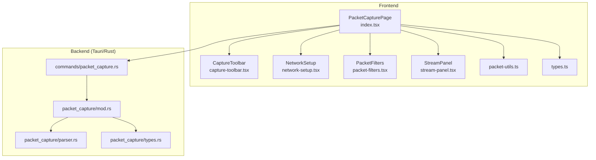
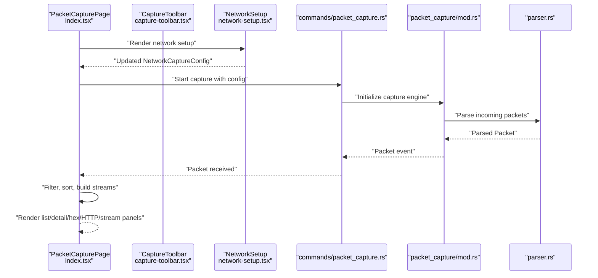
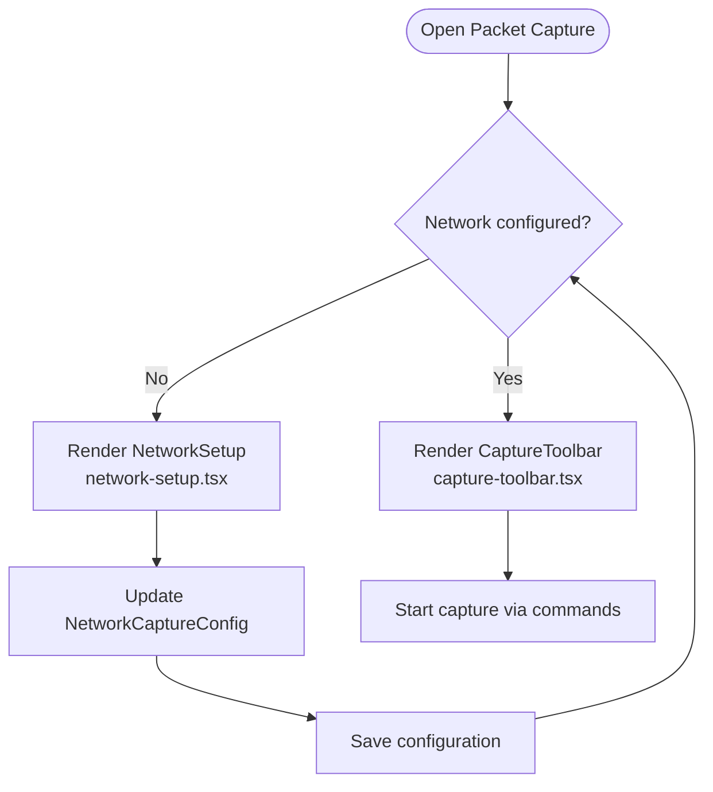
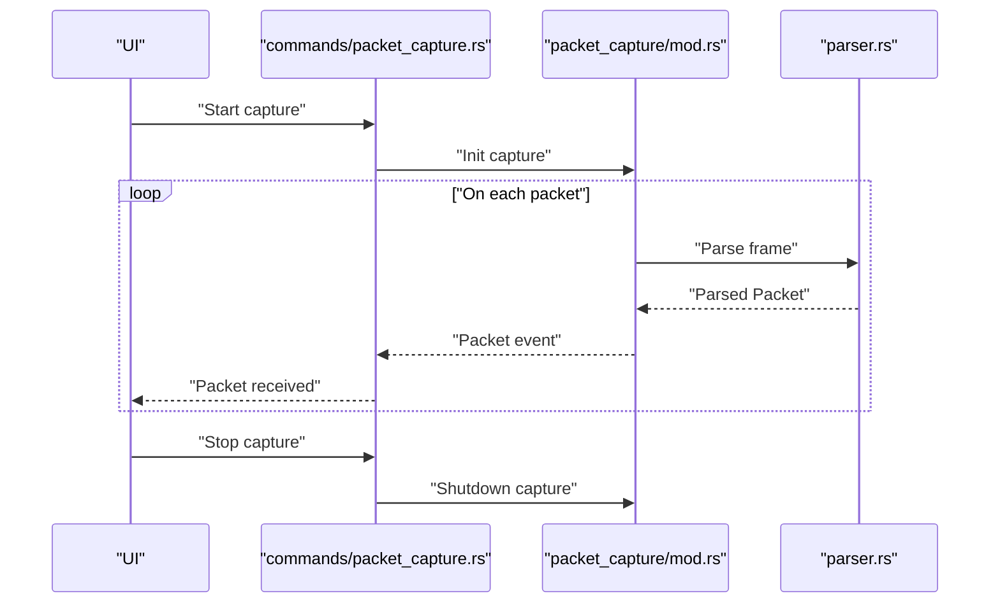
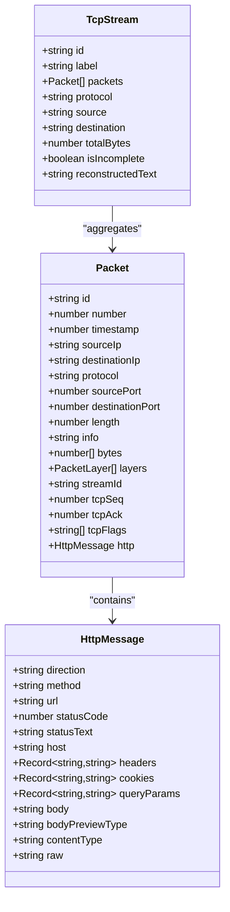
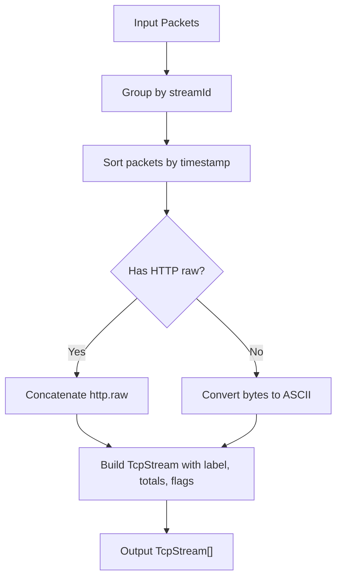
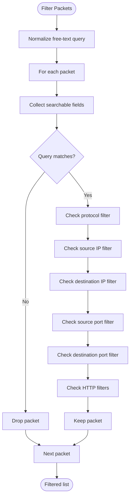
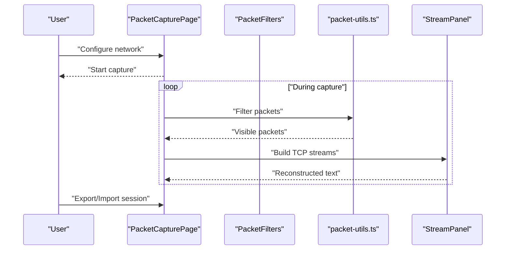
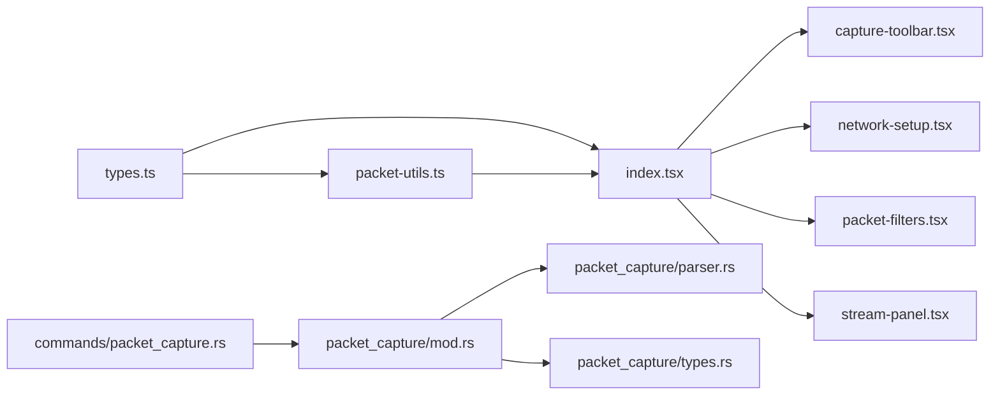

# Packet Capture Services

<cite>
**Referenced Files in This Document**
- [index.tsx](file://src/pages/packet-capture/index.tsx)
- [types.ts](file://src/pages/packet-capture/types.ts)
- [packet-utils.ts](file://src/pages/packet-capture/lib/packet-utils.ts)
- [capture-toolbar.tsx](file://src/pages/packet-capture/components/capture-toolbar.tsx)
- [network-setup.tsx](file://src/pages/packet-capture/components/network-setup.tsx)
- [packet-filters.tsx](file://src/pages/packet-capture/components/packet-filters.tsx)
- [stream-panel.tsx](file://src/pages/packet-capture/components/stream-panel.tsx)
- [constants.ts](file://src/pages/packet-capture/constants.ts)
- [packet-capture.rs](file://src-tauri/src/packet_capture/mod.rs)
- [parser.rs](file://src-tauri/src/packet_capture/parser.rs)
- [types.rs](file://src-tauri/src/packet_capture/types.rs)
- [commands/packet_capture.rs](file://src-tauri/src/commands/packet_capture.rs)
- [Cargo.toml](file://src-tauri/Cargo.toml)
</cite>

## Table of Contents
1. [Introduction](#introduction)
2. [Project Structure](#project-structure)
3. [Core Components](#core-components)
4. [Architecture Overview](#architecture-overview)
5. [Detailed Component Analysis](#detailed-component-analysis)
6. [Dependency Analysis](#dependency-analysis)
7. [Performance Considerations](#performance-considerations)
8. [Troubleshooting Guide](#troubleshooting-guide)
9. [Conclusion](#conclusion)
10. [Appendices](#appendices)

## Introduction
This document describes AppRecon’s packet capture service layer, covering the frontend UI and state orchestration for capturing, filtering, and reconstructing packet streams, as well as the backend Rust implementation responsible for low-level packet capture, protocol parsing, and stream reconstruction. It explains how network interfaces are enumerated and configured, how raw packets are captured and filtered, and how TCP/UDP sessions are tracked and reassembled into readable streams. Practical examples demonstrate capture configuration, packet analysis workflows, and extending protocol parsing capabilities.

## Project Structure
The packet capture feature spans a React/TypeScript frontend and a Tauri/Rust backend:
- Frontend (React):
  - Page container orchestrating capture lifecycle and UI panels
  - Components for toolbar, network setup, filters, packet list/detail, hex view, HTTP parser panel, and stream panel
  - Utilities for filtering, sorting, stream building, and export
  - Types defining packets, streams, filters, and capture configuration
- Backend (Tauri/Rust):
  - Packet capture module and parser module
  - Command bridge exposing capture controls to the frontend
  - Cargo dependencies for packet capture and parsing

**Diagram sources**
- [index.tsx:1-137](file://src/pages/packet-capture/index.tsx#L1-L137)
- [capture-toolbar.tsx:1-95](file://src/pages/packet-capture/components/capture-toolbar.tsx#L1-L95)
- [network-setup.tsx:1-268](file://src/pages/packet-capture/components/network-setup.tsx#L1-L268)
- [packet-filters.tsx:1-53](file://src/pages/packet-capture/components/packet-filters.tsx#L1-L53)
- [stream-panel.tsx:1-42](file://src/pages/packet-capture/components/stream-panel.tsx#L1-L42)
- [packet-utils.ts:1-161](file://src/pages/packet-capture/lib/packet-utils.ts#L1-L161)
- [types.ts:1-115](file://src/pages/packet-capture/types.ts#L1-L115)
- [commands/packet_capture.rs](file://src-tauri/src/commands/packet_capture.rs)
- [packet-capture.rs](file://src-tauri/src/packet_capture/mod.rs)
- [parser.rs](file://src-tauri/src/packet_capture/parser.rs)
- [types.rs](file://src-tauri/src/packet_capture/types.rs)

**Section sources**
- [index.tsx:1-137](file://src/pages/packet-capture/index.tsx#L1-L137)
- [types.ts:1-115](file://src/pages/packet-capture/types.ts#L1-L115)
- [packet-utils.ts:1-161](file://src/pages/packet-capture/lib/packet-utils.ts#L1-L161)
- [capture-toolbar.tsx:1-95](file://src/pages/packet-capture/components/capture-toolbar.tsx#L1-L95)
- [network-setup.tsx:1-268](file://src/pages/packet-capture/components/network-setup.tsx#L1-L268)
- [packet-filters.tsx:1-53](file://src/pages/packet-capture/components/packet-filters.tsx#L1-L53)
- [stream-panel.tsx:1-42](file://src/pages/packet-capture/components/stream-panel.tsx#L1-L42)
- [commands/packet_capture.rs](file://src-tauri/src/commands/packet_capture.rs)
- [packet-capture.rs](file://src-tauri/src/packet_capture/mod.rs)
- [parser.rs](file://src-tauri/src/packet_capture/parser.rs)
- [types.rs](file://src-tauri/src/packet_capture/types.rs)

## Core Components
- Packet model and stream model define the shape of captured data and reconstructed sessions.
- Filtering and sorting utilities enable real-time packet inspection and analysis.
- Stream builder aggregates TCP packets into ordered sessions for human-readable reconstruction.
- Frontend components coordinate capture lifecycle, network configuration, and UI panels.

Key responsibilities:
- Packet representation and metadata (IP, ports, protocol, layers, TLS, HTTP)
- TCP stream grouping and ordering by timestamp
- Real-time filtering across protocol, IP, ports, HTTP fields
- Export of capture sessions and PCAP exports

**Section sources**
- [types.ts:58-93](file://src/pages/packet-capture/types.ts#L58-L93)
- [packet-utils.ts:40-96](file://src/pages/packet-capture/lib/packet-utils.ts#L40-L96)
- [packet-utils.ts:98-130](file://src/pages/packet-capture/lib/packet-utils.ts#L98-L130)
- [packet-utils.ts:132-140](file://src/pages/packet-capture/lib/packet-utils.ts#L132-L140)

## Architecture Overview
The frontend renders the capture UI and manages state for packets, filters, and streams. It invokes backend commands to enumerate interfaces, configure capture, start/stop capture, and import/export sessions. The backend performs low-level capture and parsing, emitting parsed packets back to the frontend.

**Diagram sources**
- [index.tsx:20-123](file://src/pages/packet-capture/index.tsx#L20-L123)
- [capture-toolbar.tsx:22-94](file://src/pages/packet-capture/components/capture-toolbar.tsx#L22-L94)
- [network-setup.tsx:26-242](file://src/pages/packet-capture/components/network-setup.tsx#L26-L242)
- [commands/packet_capture.rs](file://src-tauri/src/commands/packet_capture.rs)
- [packet-capture.rs](file://src-tauri/src/packet_capture/mod.rs)
- [parser.rs](file://src-tauri/src/packet_capture/parser.rs)

## Detailed Component Analysis

### Network Interface Enumeration and Capture Configuration
- The network setup component presents available capture interfaces and supports Wi-Fi-specific options (SSID, security mode, credentials, BSSID, channel) and general options (device IP).
- Capture options include promiscuous mode and Wi-Fi monitor mode (when applicable).
- The page conditionally renders the setup screen until configuration is saved, after which the capture toolbar becomes active.

**Diagram sources**
- [index.tsx:23-34](file://src/pages/packet-capture/index.tsx#L23-L34)
- [network-setup.tsx:26-242](file://src/pages/packet-capture/components/network-setup.tsx#L26-L242)
- [capture-toolbar.tsx:22-94](file://src/pages/packet-capture/components/capture-toolbar.tsx#L22-L94)

**Section sources**
- [network-setup.tsx:26-242](file://src/pages/packet-capture/components/network-setup.tsx#L26-L242)
- [capture-toolbar.tsx:22-94](file://src/pages/packet-capture/components/capture-toolbar.tsx#L22-L94)
- [index.tsx:23-52](file://src/pages/packet-capture/index.tsx#L23-L52)

### Raw Packet Capture Mechanisms
- The frontend exposes capture lifecycle controls (start, pause, stop, clear) and integrates with backend commands to manage capture sessions.
- The backend module initializes the capture engine and parses packets, returning structured data to the UI.

**Diagram sources**
- [capture-toolbar.tsx:52-65](file://src/pages/packet-capture/components/capture-toolbar.tsx#L52-L65)
- [commands/packet_capture.rs](file://src-tauri/src/commands/packet_capture.rs)
- [packet-capture.rs](file://src-tauri/src/packet_capture/mod.rs)
- [parser.rs](file://src-tauri/src/packet_capture/parser.rs)

**Section sources**
- [capture-toolbar.tsx:52-65](file://src/pages/packet-capture/components/capture-toolbar.tsx#L52-L65)
- [commands/packet_capture.rs](file://src-tauri/src/commands/packet_capture.rs)
- [packet-capture.rs](file://src-tauri/src/packet_capture/mod.rs)
- [parser.rs](file://src-tauri/src/packet_capture/parser.rs)

### Protocol Parsing Algorithms
- The packet model includes protocol classification and layered fields. The HTTP message structure supports request/response direction, method, URL, status, headers, cookies, query parameters, body, and content type.
- The stream panel displays reconstructed text derived from either HTTP raw messages or ASCII interpretation of packet bytes.

**Diagram sources**
- [types.ts:58-93](file://src/pages/packet-capture/types.ts#L58-L93)

**Section sources**
- [types.ts:42-56](file://src/pages/packet-capture/types.ts#L42-L56)
- [types.ts:58-81](file://src/pages/packet-capture/types.ts#L58-L81)
- [types.ts:83-93](file://src/pages/packet-capture/types.ts#L83-L93)
- [stream-panel.tsx:8-41](file://src/pages/packet-capture/components/stream-panel.tsx#L8-L41)

### Packet Stream Reconstruction Service
- TCP streams are grouped by a deterministic stream ID combining endpoints and ports. Packets are sorted by timestamp and concatenated into a single reconstructed text.
- The stream builder marks incomplete streams when the final packet lacks FIN or RST flags.

**Diagram sources**
- [packet-utils.ts:98-130](file://src/pages/packet-capture/lib/packet-utils.ts#L98-L130)

**Section sources**
- [packet-utils.ts:3-7](file://src/pages/packet-capture/lib/packet-utils.ts#L3-L7)
- [packet-utils.ts:98-130](file://src/pages/packet-capture/lib/packet-utils.ts#L98-L130)

### Packet Filtering Service
- The filter model supports protocol, IP addresses, ports, HTTP method/host/URL/status/content-type, and a free-text query.
- Filtering is applied across multiple fields and supports case-insensitive substring matching.

**Diagram sources**
- [packet-utils.ts:40-82](file://src/pages/packet-capture/lib/packet-utils.ts#L40-L82)
- [packet-filters.tsx:14-52](file://src/pages/packet-capture/components/packet-filters.tsx#L14-L52)
- [types.ts:95-107](file://src/pages/packet-capture/types.ts#L95-L107)

**Section sources**
- [packet-utils.ts:40-82](file://src/pages/packet-capture/lib/packet-utils.ts#L40-L82)
- [packet-filters.tsx:14-52](file://src/pages/packet-capture/components/packet-filters.tsx#L14-L52)
- [types.ts:95-107](file://src/pages/packet-capture/types.ts#L95-L107)

### Packet Analysis Workflows
- Capture configuration: Select interface, optionally set Wi-Fi SSID/security/password/BSSID/channel, enable promiscuous/monitor modes, and continue to sniffing.
- Start capture: Use the toolbar to start, pause, stop, and clear captures.
- Inspect packets: Use the packet list, packet detail, hex view, HTTP parser panel, and stream panel to analyze traffic.
- Apply filters: Use the filter bar to narrow down packets by protocol, IP, ports, and HTTP attributes.
- Export/import: Save capture sessions and import/export PCAP/PCAPNG formats.

**Diagram sources**
- [index.tsx:36-123](file://src/pages/packet-capture/index.tsx#L36-L123)
- [packet-filters.tsx:14-52](file://src/pages/packet-capture/components/packet-filters.tsx#L14-L52)
- [packet-utils.ts:40-96](file://src/pages/packet-capture/lib/packet-utils.ts#L40-L96)
- [packet-utils.ts:98-130](file://src/pages/packet-capture/lib/packet-utils.ts#L98-L130)
- [stream-panel.tsx:8-41](file://src/pages/packet-capture/components/stream-panel.tsx#L8-L41)

**Section sources**
- [index.tsx:36-123](file://src/pages/packet-capture/index.tsx#L36-L123)
- [packet-filters.tsx:14-52](file://src/pages/packet-capture/components/packet-filters.tsx#L14-L52)
- [packet-utils.ts:40-96](file://src/pages/packet-capture/lib/packet-utils.ts#L40-L96)
- [packet-utils.ts:98-130](file://src/pages/packet-capture/lib/packet-utils.ts#L98-L130)
- [stream-panel.tsx:8-41](file://src/pages/packet-capture/components/stream-panel.tsx#L8-L41)

### Practical Examples
- Capture configuration:
  - Select interface, set Wi-Fi SSID and security mode, optionally enter username/password for enterprise networks, and enable monitor mode for Wi-Fi.
  - Save configuration and continue to sniffing.
- Packet analysis workflow:
  - Start capture, apply filters (e.g., protocol=HTTP, host contains example), inspect packet detail and hex view, view reconstructed TCP stream.
- Custom protocol parsing:
  - Extend the parser module to recognize new protocols and populate the packet model with appropriate layers and HTTP/TLS metadata.

Note: The frontend currently supports BPF-like filtering via the filter bar; backend BPF syntax support would require extending the capture engine in the Rust module.

**Section sources**
- [network-setup.tsx:102-163](file://src/pages/packet-capture/components/network-setup.tsx#L102-L163)
- [capture-toolbar.tsx:52-65](file://src/pages/packet-capture/components/capture-toolbar.tsx#L52-L65)
- [packet-filters.tsx:14-52](file://src/pages/packet-capture/components/packet-filters.tsx#L14-L52)
- [packet-utils.ts:40-82](file://src/pages/packet-capture/lib/packet-utils.ts#L40-L82)

## Dependency Analysis
- Frontend dependencies:
  - Packet types and utilities are used across UI components for rendering and analysis.
  - The page depends on toolbar, network setup, filters, and stream panel components.
- Backend dependencies:
  - The packet capture module depends on the parser module for protocol decoding.
  - The command bridge connects frontend actions to backend capture routines.

**Diagram sources**
- [types.ts:1-115](file://src/pages/packet-capture/types.ts#L1-L115)
- [packet-utils.ts:1-161](file://src/pages/packet-capture/lib/packet-utils.ts#L1-L161)
- [index.tsx:10-17](file://src/pages/packet-capture/index.tsx#L10-L17)
- [capture-toolbar.tsx:1-95](file://src/pages/packet-capture/components/capture-toolbar.tsx#L1-L95)
- [network-setup.tsx:1-268](file://src/pages/packet-capture/components/network-setup.tsx#L1-L268)
- [packet-filters.tsx:1-53](file://src/pages/packet-capture/components/packet-filters.tsx#L1-L53)
- [stream-panel.tsx:1-42](file://src/pages/packet-capture/components/stream-panel.tsx#L1-L42)
- [commands/packet_capture.rs](file://src-tauri/src/commands/packet_capture.rs)
- [packet-capture.rs](file://src-tauri/src/packet_capture/mod.rs)
- [parser.rs](file://src-tauri/src/packet_capture/parser.rs)
- [types.rs](file://src-tauri/src/packet_capture/types.rs)

**Section sources**
- [Cargo.toml](file://src-tauri/Cargo.toml)
- [commands/packet_capture.rs](file://src-tauri/src/commands/packet_capture.rs)
- [packet-capture.rs](file://src-tauri/src/packet_capture/mod.rs)
- [parser.rs](file://src-tauri/src/packet_capture/parser.rs)
- [types.rs](file://src-tauri/src/packet_capture/types.rs)

## Performance Considerations
- Filtering and sorting:
  - Filtering is O(N) per packet with string concatenation and substring checks; keep queries concise.
  - Sorting is in-memory and leverages numeric comparisons for number fields.
- Stream reconstruction:
  - Grouping by streamId is O(N); concatenation of reconstructed text is proportional to total bytes.
- Buffer management:
  - The hex view and ASCII conversion operate on byte arrays; avoid excessive copying by slicing and mapping efficiently.
- Throughput:
  - For high-volume captures, prefer enabling backend-side filtering (e.g., BPF) and minimize UI updates per packet.
  - Batch updates to the packet list and streams to reduce re-renders.

[No sources needed since this section provides general guidance]

## Troubleshooting Guide
- Permission errors:
  - The UI surfaces a permission error banner and provides a “Fix Permissions” action to guide remediation.
- Capture status controls:
  - Start is disabled when already capturing; stop is disabled when idle; use pause appropriately during capture.
- Network configuration:
  - Ensure correct interface selection and Wi-Fi credentials; for Wi-Fi monitor mode, confirm adapter support.

**Section sources**
- [index.tsx:63-74](file://src/pages/packet-capture/index.tsx#L63-L74)
- [capture-toolbar.tsx:52-65](file://src/pages/packet-capture/components/capture-toolbar.tsx#L52-L65)
- [network-setup.tsx:230-237](file://src/pages/packet-capture/components/network-setup.tsx#L230-L237)

## Conclusion
AppRecon’s packet capture service combines a robust frontend for capture configuration, filtering, and stream visualization with a backend designed for low-level packet capture and parsing. The current implementation emphasizes usability and extensibility, enabling straightforward protocol parsing extensions and stream reconstruction. For high-throughput environments, consider backend filtering and batched UI updates to maintain responsiveness.

[No sources needed since this section summarizes without analyzing specific files]

## Appendices

### Extending Packet Capture Capabilities
- Add new protocol parsers:
  - Extend the parser module to decode protocol-specific headers and populate packet layers and HTTP/TLS metadata.
- Enhance filtering:
  - Add new filter fields to the filter model and update the filtering logic to include additional packet attributes.
- Optimize performance:
  - Introduce backend BPF-style filters to reduce packet volume.
  - Use efficient data structures for stream grouping and caching frequently accessed computed values.

[No sources needed since this section provides general guidance]