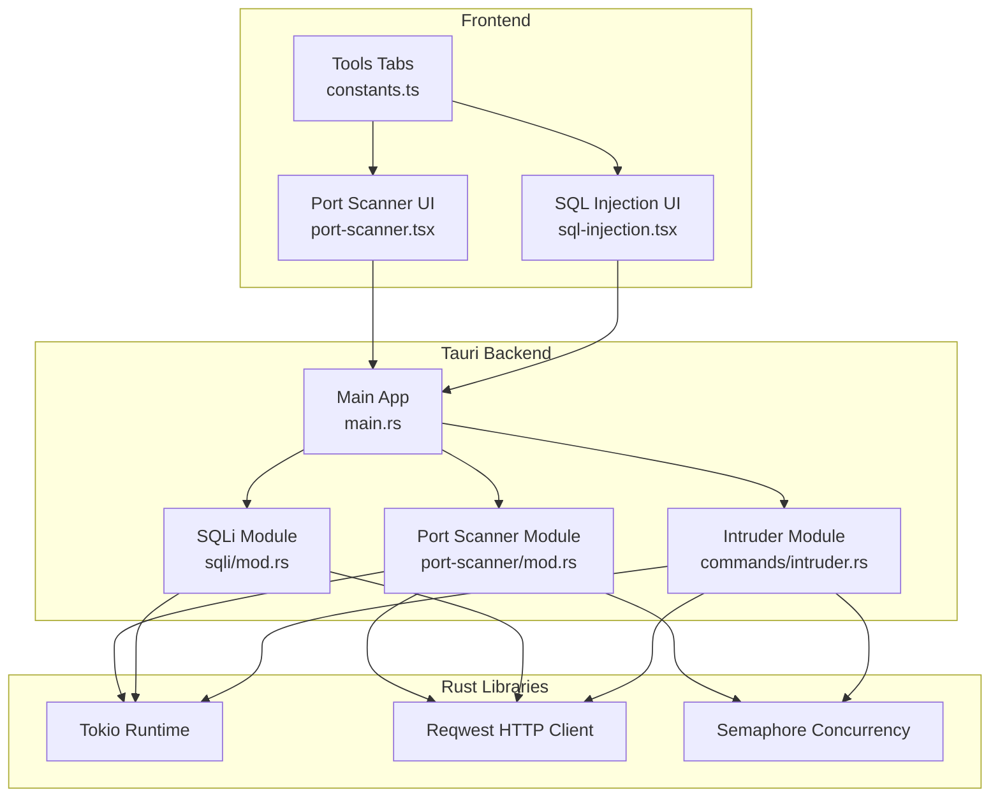
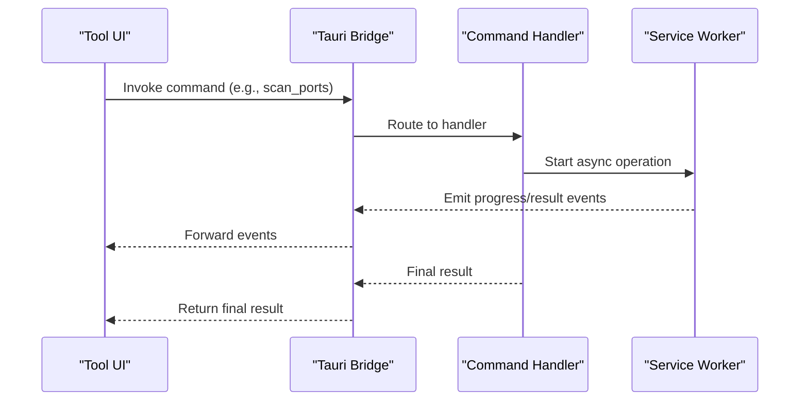
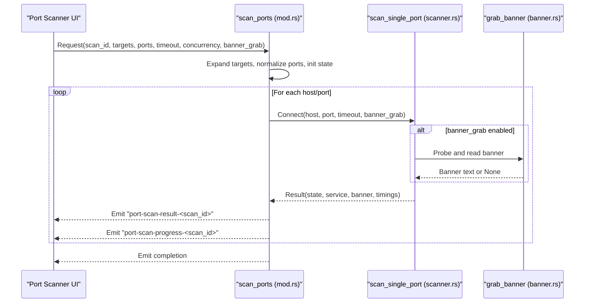
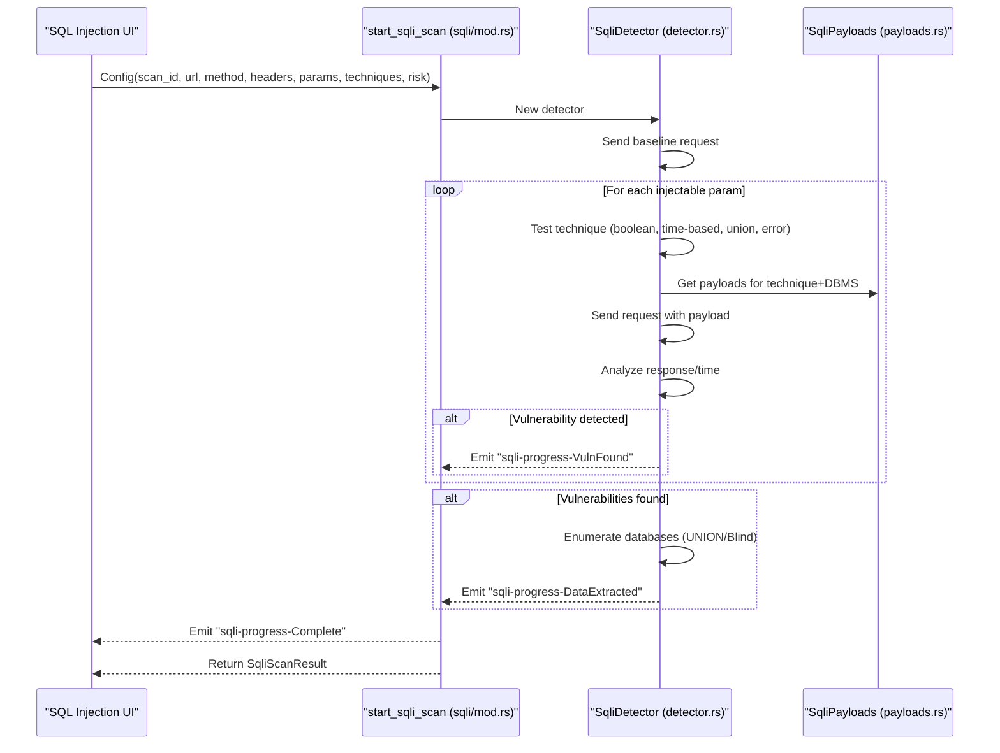
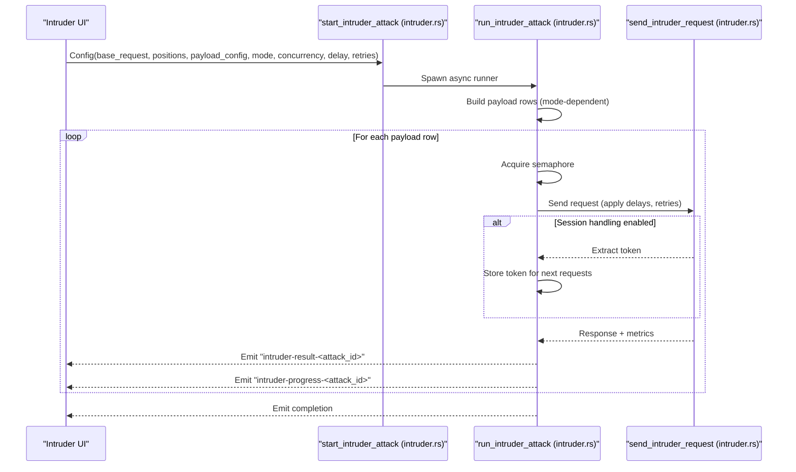
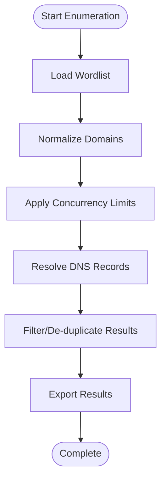
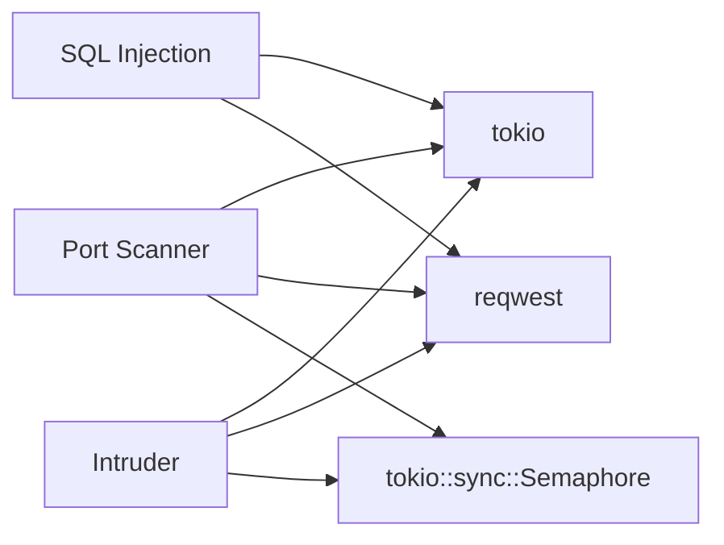

# Security Testing Services

<cite>
**Referenced Files in This Document**
- [src-tauri/src/main.rs](file://src-tauri/src/main.rs)
- [src-tauri/Cargo.toml](file://src-tauri/Cargo.toml)
- [src-tauri/src/port-scanner/mod.rs](file://src-tauri/src/port-scanner/mod.rs)
- [src-tauri/src/port-scanner/scanner.rs](file://src-tauri/src/port-scanner/scanner.rs)
- [src-tauri/src/port-scanner/banner.rs](file://src-tauri/src/port-scanner/banner.rs)
- [src-tauri/src/port-scanner/state.rs](file://src-tauri/src/port-scanner/state.rs)
- [src-tauri/src/port-scanner/types.rs](file://src-tauri/src/port-scanner/types.rs)
- [src-tauri/src/sqli/mod.rs](file://src-tauri/src/sqli/mod.rs)
- [src-tauri/src/sqli/detector.rs](file://src-tauri/src/sqli/detector.rs)
- [src-tauri/src/sqli/payloads.rs](file://src-tauri/src/sqli/payloads.rs)
- [src-tauri/src/sqli/types.rs](file://src-tauri/src/sqli/types.rs)
- [src-tauri/src/commands/intruder.rs](file://src-tauri/src/commands/intruder.rs)
- [src/pages/tools/components/port-scanner.tsx](file://src/pages/tools/components/port-scanner.tsx)
- [src/pages/tools/components/sql-injection.tsx](file://src/pages/tools/components/sql-injection.tsx)
- [src/pages/tools/constants.ts](file://src/pages/tools/constants.ts)
</cite>

## Table of Contents
1. [Introduction](#introduction)
2. [Project Structure](#project-structure)
3. [Core Components](#core-components)
4. [Architecture Overview](#architecture-overview)
5. [Detailed Component Analysis](#detailed-component-analysis)
6. [Dependency Analysis](#dependency-analysis)
7. [Performance Considerations](#performance-considerations)
8. [Troubleshooting Guide](#troubleshooting-guide)
9. [Conclusion](#conclusion)
10. [Appendices](#appendices)

## Introduction
This document describes AppRecon’s security testing service layer, focusing on:
- Port scanning with concurrent socket connections, service detection, and banner grabbing
- SQL injection detection with vulnerability assessment, payload generation, and database fingerprinting
- Brute force testing via Intruder-style attack simulation, credential validation, and result analysis
- Subdomain enumeration pipeline (conceptual overview)

It also provides practical examples of security assessment workflows, guidance for custom payload development, automated testing configurations, performance optimization for large-scale scans, rate limiting strategies, ethical hacking considerations, and extension guidelines for integrating new vulnerability assessment tools.

## Project Structure
AppRecon is a Tauri-based desktop application with a Rust backend providing security services and a TypeScript/React frontend for user interaction. The security services are exposed as Tauri commands and consumed by dedicated tool pages.

**Diagram sources**
- [src-tauri/src/main.rs:71-139](file://src-tauri/src/main.rs#L71-L139)
- [src/pages/tools/constants.ts:3-12](file://src/pages/tools/constants.ts#L3-L12)
- [src/pages/tools/components/port-scanner.tsx:1-337](file://src/pages/tools/components/port-scanner.tsx#L1-L337)
- [src/pages/tools/components/sql-injection.tsx:1-561](file://src/pages/tools/components/sql-injection.tsx#L1-L561)

**Section sources**
- [src-tauri/src/main.rs:14-147](file://src-tauri/src/main.rs#L14-L147)
- [src/pages/tools/constants.ts:3-12](file://src/pages/tools/constants.ts#L3-L12)

## Core Components
- Port Scanner: Asynchronous TCP scanning with concurrency control, optional banner grabbing, and service detection.
- SQL Injection Detector: Multi-technique assessment (Boolean blind, Time-based, UNION, Error-based) with payload orchestration and database fingerprinting.
- Intruder/Brute Force: Attack simulation with configurable modes, payload sources, concurrency, delays, retries, and result filtering/extraction.
- Subdomain Enumeration: Conceptual coverage of wordlist processing, concurrency control, and result aggregation (see Appendix).

**Section sources**
- [src-tauri/src/port-scanner/mod.rs:20-125](file://src-tauri/src/port-scanner/mod.rs#L20-L125)
- [src-tauri/src/sqli/mod.rs:16-48](file://src-tauri/src/sqli/mod.rs#L16-L48)
- [src-tauri/src/commands/intruder.rs:164-207](file://src-tauri/src/commands/intruder.rs#L164-L207)

## Architecture Overview
The backend exposes commands for each service. The frontend invokes these commands and listens to progress/result events emitted by the backend.

**Diagram sources**
- [src-tauri/src/main.rs:71-139](file://src-tauri/src/main.rs#L71-L139)
- [src/pages/tools/components/port-scanner.tsx:64-103](file://src/pages/tools/components/port-scanner.tsx#L64-L103)
- [src/pages/tools/components/sql-injection.tsx:110-169](file://src/pages/tools/components/sql-injection.tsx#L110-L169)

## Detailed Component Analysis

### Port Scanning Service
The port scanner performs asynchronous TCP connects against target hosts and ports, with concurrency limits and optional banner grabbing. It emits per-result and progress events and supports cancellation.

Key behaviors:
- Target expansion and port normalization
- Concurrency via tokio::sync::Semaphore
- Per-host/per-port connection attempts with timeouts
- Optional banner grabbing for common ports and HTTPS
- Service detection heuristics
- Cancellation via atomic flags stored in state

**Diagram sources**
- [src-tauri/src/port-scanner/mod.rs:20-125](file://src-tauri/src/port-scanner/mod.rs#L20-L125)
- [src-tauri/src/port-scanner/scanner.rs:11-61](file://src-tauri/src/port-scanner/scanner.rs#L11-L61)
- [src-tauri/src/port-scanner/banner.rs:5-41](file://src-tauri/src/port-scanner/banner.rs#L5-L41)

Implementation highlights:
- Concurrency control and progress tracking
- Timeout enforcement and cancellation signaling
- Banner probing with HTTP HEAD probes and HTTPS HEAD requests
- Service detection using port-to-service mapping and banner parsing

Practical example:
- Start a scan with a CIDR target, preset ports, and banner grabbing enabled; monitor progress and collect open ports.

**Section sources**
- [src-tauri/src/port-scanner/mod.rs:20-125](file://src-tauri/src/port-scanner/mod.rs#L20-L125)
- [src-tauri/src/port-scanner/scanner.rs:11-61](file://src-tauri/src/port-scanner/scanner.rs#L11-L61)
- [src-tauri/src/port-scanner/banner.rs:5-41](file://src-tauri/src/port-scanner/banner.rs#L5-L41)
- [src-tauri/src/port-scanner/state.rs:4-7](file://src-tauri/src/port-scanner/state.rs#L4-L7)
- [src-tauri/src/port-scanner/types.rs:3-35](file://src-tauri/src/port-scanner/types.rs#L3-L35)
- [src/pages/tools/components/port-scanner.tsx:53-103](file://src/pages/tools/components/port-scanner.tsx#L53-L103)

### SQL Injection Detection Service
The SQLi detector orchestrates vulnerability assessment across multiple techniques, generates and applies payloads, fingerprints the backend DBMS, and optionally extracts metadata.

Key behaviors:
- Baseline request to establish expected response/time
- Iterative testing per parameter and technique
- Payload selection by technique and DBMS family
- Response analysis for signatures and timing differences
- DBMS fingerprinting via error/body patterns
- Optional database enumeration via UNION or blind queries

**Diagram sources**
- [src-tauri/src/sqli/mod.rs:16-48](file://src-tauri/src/sqli/mod.rs#L16-L48)
- [src-tauri/src/sqli/detector.rs:34-113](file://src-tauri/src/sqli/detector.rs#L34-L113)
- [src-tauri/src/sqli/payloads.rs:215-246](file://src-tauri/src/sqli/payloads.rs#L215-L246)

Implementation highlights:
- Technique-specific payload sets for MySQL, PostgreSQL, MSSQL, Oracle, SQLite
- Signature-based checks for UNION, error messages, and timing anomalies
- DBMS detection from error responses and payload-specific patterns
- Structured progress events and cancellation support

Practical example:
- Configure GET/POST parameters, select techniques, and risk level; review vulnerabilities and extracted database metadata.

**Section sources**
- [src-tauri/src/sqli/mod.rs:16-48](file://src-tauri/src/sqli/mod.rs#L16-L48)
- [src-tauri/src/sqli/detector.rs:197-455](file://src-tauri/src/sqli/detector.rs#L197-L455)
- [src-tauri/src/sqli/payloads.rs:18-314](file://src-tauri/src/sqli/payloads.rs#L18-L314)
- [src-tauri/src/sqli/types.rs:6-195](file://src-tauri/src/sqli/types.rs#L6-L195)
- [src/pages/tools/components/sql-injection.tsx:98-175](file://src/pages/tools/components/sql-injection.tsx#L98-L175)

### Brute Force Testing Service (Intruder)
The Intruder module simulates brute force attacks across multiple positions and payloads, supporting Sniper, Battering Ram, Pitchfork, and Cluster Bomb modes. It includes payload processing, delays, retries, and result filtering.

Key behaviors:
- Validate configuration and build payload rows
- Apply concurrency limits and per-request delays
- Retry failed requests with jitter
- Extract session tokens and apply to subsequent requests
- Grep-match and extract patterns from responses

**Diagram sources**
- [src-tauri/src/commands/intruder.rs:164-345](file://src-tauri/src/commands/intruder.rs#L164-L345)
- [src-tauri/src/commands/intruder.rs:404-501](file://src-tauri/src/commands/intruder.rs#L404-L501)

Implementation highlights:
- Payload sources: simple lists, runtime files, number ranges with formatting
- Processing steps: URL encode/decode, base64 encode/decode, hashing (MD5, SHA1, SHA256)
- Grep match/extract for filtering and data extraction
- Cancellation via atomic flags

Practical example:
- Define payload positions with § markers, choose a mode, configure concurrency and delays, and analyze filtered results.

**Section sources**
- [src-tauri/src/commands/intruder.rs:159-207](file://src-tauri/src/commands/intruder.rs#L159-L207)
- [src-tauri/src/commands/intruder.rs:242-345](file://src-tauri/src/commands/intruder.rs#L242-L345)
- [src-tauri/src/commands/intruder.rs:404-501](file://src-tauri/src/commands/intruder.rs#L404-L501)

### Subdomain Enumeration Service (Conceptual)
The subdomain enumeration service would process wordlists, issue concurrent DNS queries, and aggregate results. While the Rust backend module is not present in the current repository snapshot, the frontend includes a “Subdomain” tool tab and payload directories indicating intent.

Conceptual flow:
- Load wordlist(s) from bundled resources
- Issue concurrent DNS A/AAAA queries
- Filter/respect rate limits and timeouts
- Aggregate and deduplicate results
- Export findings

[No sources needed since this diagram shows conceptual workflow, not actual code structure]

[No sources needed since this section doesn't analyze specific source files]

## Dependency Analysis
External dependencies relevant to security services:
- Tokio for async runtime and concurrency primitives
- Reqwest for HTTP requests (port scanner banner, SQLi requests)
- Semaphore for controlled concurrency
- Serialization (Serde) for cross-language data exchange

**Diagram sources**
- [src-tauri/Cargo.toml:32-41](file://src-tauri/Cargo.toml#L32-L41)
- [src-tauri/src/port-scanner/mod.rs:53-56](file://src-tauri/src/port-scanner/mod.rs#L53-L56)
- [src-tauri/src/commands/intruder.rs:267-288](file://src-tauri/src/commands/intruder.rs#L267-L288)

**Section sources**
- [src-tauri/Cargo.toml:11-61](file://src-tauri/Cargo.toml#L11-L61)

## Performance Considerations
- Concurrency tuning
  - Port scanner: clamp concurrency to avoid overwhelming targets; adjust per-target capacity.
  - Intruder: cap concurrent requests to prevent server overload and respect rate limits.
- Timeouts and delays
  - Set appropriate connection/read timeouts; introduce randomized delays between requests.
- Resource limits
  - Cap total host/port combinations to stay under 65,535 checks.
  - Limit payload rows for Cluster Bomb mode to avoid combinatorial explosion.
- Event-driven UI updates
  - Batch UI updates and throttle progress rendering to maintain responsiveness.
- Network stack
  - Reuse HTTP clients and redirects policies to reduce overhead.

[No sources needed since this section provides general guidance]

## Troubleshooting Guide
Common issues and remedies:
- SYN scan unavailable
  - The port scanner reports that SYN scanning requires raw sockets and a privileged helper; use TCP connect scan for now.
- Scan limits exceeded
  - Total host/port checks must not exceed 65,535; reduce targets or ports.
- Cancellation not taking effect
  - Ensure cancellation flag is checked promptly in loops; verify scan_id matches registered state.
- Intruder payload errors
  - Validate payload positions and sources; ensure at least one payload is configured.
- Rate limiting and blocking
  - Introduce delays and retries; consider rotating user agents or proxies if supported by the target.
- Banner grabbing failures
  - Some services may not respond to probes; fallback to service-by-port heuristics.

**Section sources**
- [src-tauri/src/port-scanner/mod.rs:26-31](file://src-tauri/src/port-scanner/mod.rs#L26-L31)
- [src-tauri/src/port-scanner/mod.rs:36-38](file://src-tauri/src/port-scanner/mod.rs#L36-L38)
- [src-tauri/src/commands/intruder.rs:209-240](file://src-tauri/src/commands/intruder.rs#L209-L240)

## Conclusion
AppRecon’s security testing services combine robust asynchronous execution, structured event emission, and practical UI integrations. The port scanner, SQLi detector, and Intruder module provide comprehensive coverage for reconnaissance, vulnerability assessment, and brute force testing. By tuning concurrency, timeouts, and delays—and by leveraging cancellation and progress events—teams can perform reliable, scalable assessments while remaining respectful of target systems.

[No sources needed since this section summarizes without analyzing specific files]

## Appendices

### Practical Examples and Workflows
- Port scanning workflow
  - Configure target (hostname or CIDR), ports (preset or custom), timeout, and concurrency.
  - Enable banner grabbing to enrich results.
  - Monitor progress and export open ports.
- SQL injection workflow
  - Define target URL/method and parameters; mark injectable parameters.
  - Choose techniques and risk level; start scan and review vulnerabilities.
  - Inspect PoC and severity; optionally extract database metadata.
- Intruder workflow
  - Mark payload positions with § markers; define payload sources and processing steps.
  - Choose attack mode; set concurrency, delay, and retries.
  - Apply grep match/extract to filter meaningful results.

**Section sources**
- [src/pages/tools/components/port-scanner.tsx:53-103](file://src/pages/tools/components/port-scanner.tsx#L53-L103)
- [src/pages/tools/components/sql-injection.tsx:98-175](file://src/pages/tools/components/sql-injection.tsx#L98-L175)
- [src-tauri/src/commands/intruder.rs:503-550](file://src-tauri/src/commands/intruder.rs#L503-L550)

### Custom Payload Development
- SQL injection
  - Extend payload sets in the payloads module for new DBMS families or techniques.
  - Add signature detection logic to improve fingerprinting accuracy.
- Intruder
  - Add new payload processing steps (e.g., encoding variants).
  - Support additional payload sources (e.g., cloud APIs) via runtime files.

**Section sources**
- [src-tauri/src/sqli/payloads.rs:18-314](file://src-tauri/src/sqli/payloads.rs#L18-L314)
- [src-tauri/src/commands/intruder.rs:631-662](file://src-tauri/src/commands/intruder.rs#L631-L662)

### Automated Testing Configurations
- Predefined presets for ports and techniques
- Persistent scan state and cancellation registration
- Event-driven progress reporting for dashboards and CI pipelines

**Section sources**
- [src/pages/tools/components/port-scanner.tsx:16-21](file://src/pages/tools/components/port-scanner.tsx#L16-L21)
- [src-tauri/src/sqli/types.rs:161-195](file://src-tauri/src/sqli/types.rs#L161-L195)
- [src-tauri/src/port-scanner/state.rs:4-7](file://src-tauri/src/port-scanner/state.rs#L4-L7)

### Ethical Hacking Considerations
- Obtain explicit authorization before scanning or testing.
- Respect rate limits and legal constraints; avoid causing service disruption.
- Use cancellation and conservative concurrency to minimize impact.
- Handle sensitive data responsibly and securely.

[No sources needed since this section provides general guidance]

### Extending Security Testing Capabilities
- Add new Tauri commands and handlers for additional scanners.
- Integrate external tools via subprocesses or libraries, ensuring safe argument handling.
- Enhance event schemas to support richer progress reporting and artifact capture.
- Provide modular payload engines for extensibility.

[No sources needed since this section provides general guidance]