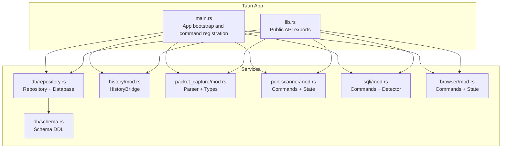
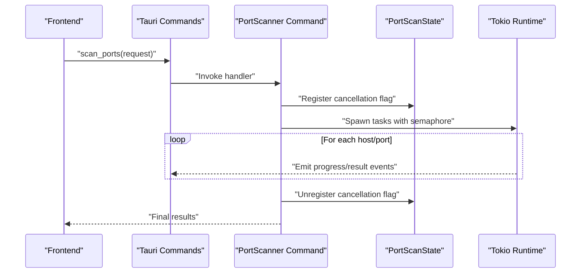
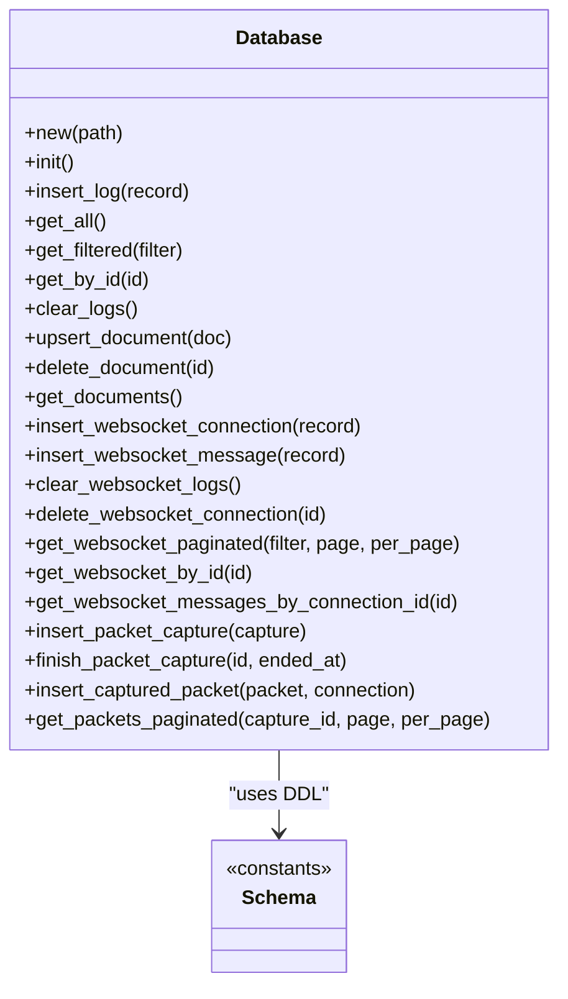
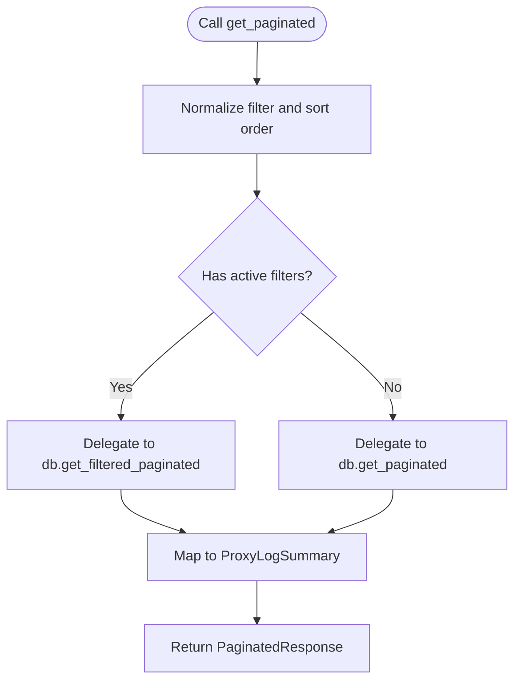
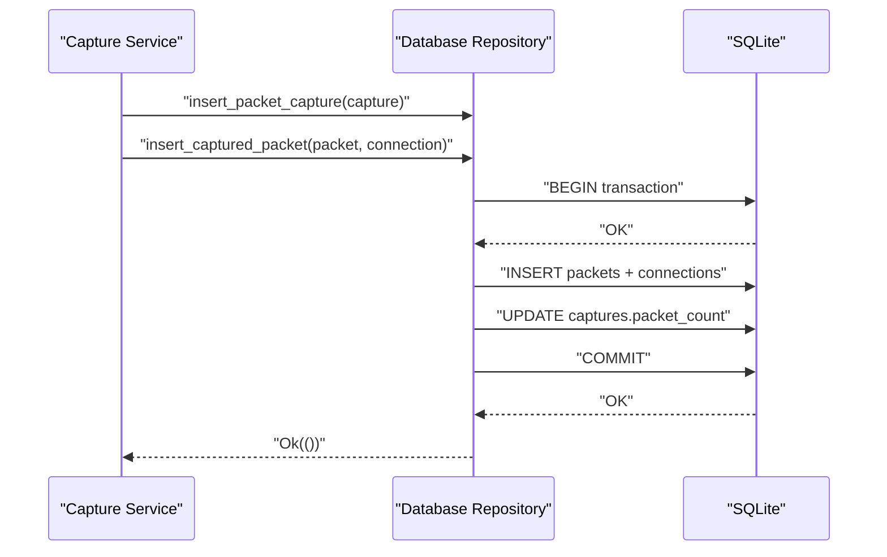
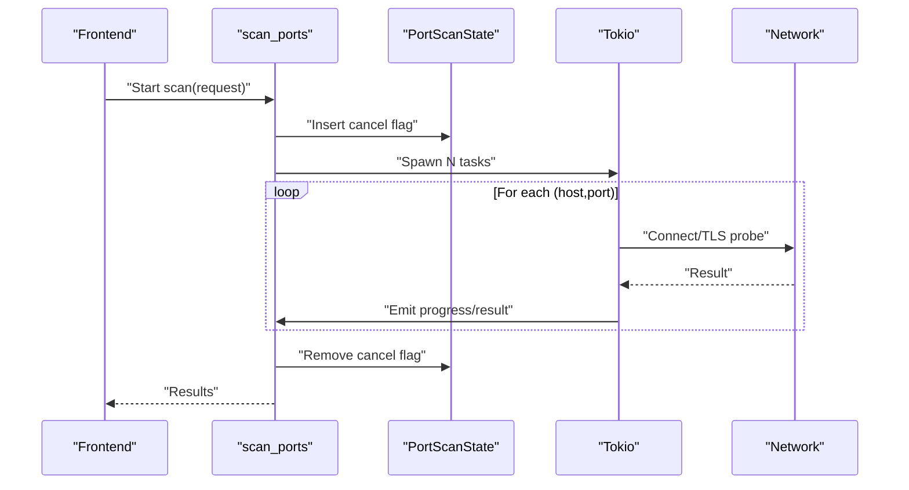
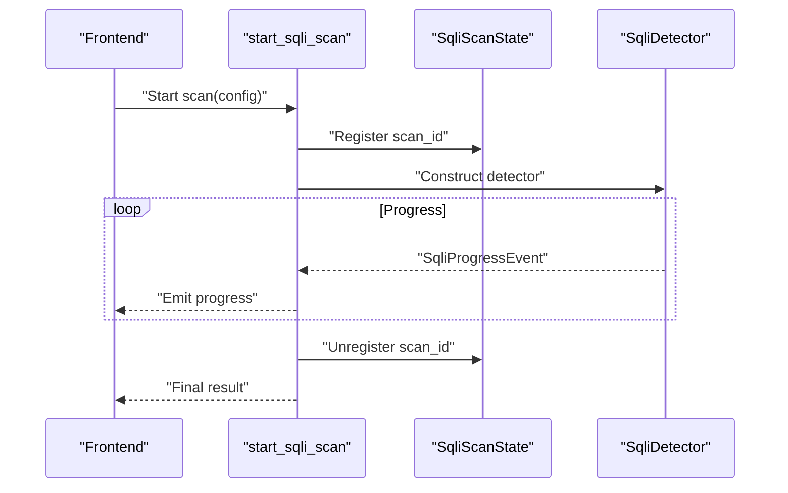
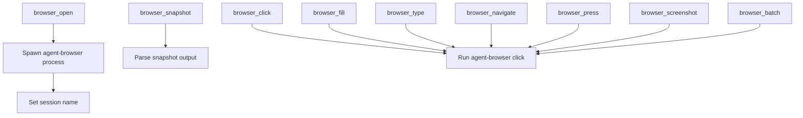
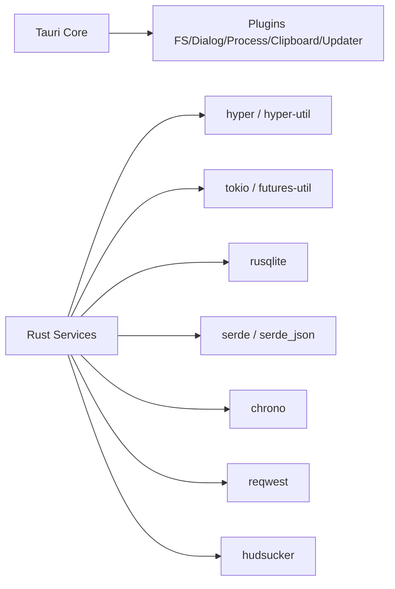

# Service Layer

<cite>
**Referenced Files in This Document**
- [Cargo.toml](file://src-tauri/Cargo.toml)
- [lib.rs](file://src-tauri/src/lib.rs)
- [main.rs](file://src-tauri/src/main.rs)
- [db/mod.rs](file://src-tauri/src/db/mod.rs)
- [db/repository.rs](file://src-tauri/src/db/repository.rs)
- [db/schema.rs](file://src-tauri/src/db/schema.rs)
- [history/mod.rs](file://src-tauri/src/history/mod.rs)
- [packet_capture/mod.rs](file://src-tauri/src/packet_capture/mod.rs)
- [port-scanner/mod.rs](file://src-tauri/src/port-scanner/mod.rs)
- [sqli/mod.rs](file://src-tauri/src/sqli/mod.rs)
- [browser/mod.rs](file://src-tauri/src/browser/mod.rs)
</cite>

## Table of Contents
1. [Introduction](#introduction)
2. [Project Structure](#project-structure)
3. [Core Components](#core-components)
4. [Architecture Overview](#architecture-overview)
5. [Detailed Component Analysis](#detailed-component-analysis)
6. [Dependency Analysis](#dependency-analysis)
7. [Performance Considerations](#performance-considerations)
8. [Troubleshooting Guide](#troubleshooting-guide)
9. [Conclusion](#conclusion)
10. [Appendices](#appendices)

## Introduction
This document describes the backend service layer architecture for AppRecon’s Tauri-based Rust backend. It focuses on service abstractions, dependency injection via Tauri’s managed state, cross-cutting concerns, and the database service layer implementing the repository pattern. It also covers specialized services for history management, packet capture, port scanning, SQL injection detection, and browser automation, along with lifecycle management, inter-service communication, error propagation, performance optimization, testing strategies, and development best practices.

## Project Structure
The backend is organized into cohesive modules under src-tauri/src, each encapsulating a service domain:
- db: database access via a typed repository and schema definitions
- history: a facade bridging proxy/websocket/packet capture logs to the database
- packet_capture: packet capture orchestration and parsing
- port-scanner: asynchronous port scanning with concurrency control and cancellation
- sqli: SQL injection detection workflow and progress events
- browser: external browser automation orchestration and state management
- commands: Tauri command handlers wired in main.rs
- lib.rs: public API exports for consumers

**Diagram sources**
- [main.rs:23-146](file://src-tauri/src/main.rs#L23-L146)
- [lib.rs:1-51](file://src-tauri/src/lib.rs#L1-L51)
- [db/repository.rs:37-58](file://src-tauri/src/db/repository.rs#L37-L58)
- [db/schema.rs:1-176](file://src-tauri/src/db/schema.rs#L1-L176)
- [history/mod.rs:61-70](file://src-tauri/src/history/mod.rs#L61-L70)
- [packet_capture/mod.rs:1-6](file://src-tauri/src/packet_capture/mod.rs#L1-L6)
- [port-scanner/mod.rs:18-139](file://src-tauri/src/port-scanner/mod.rs#L18-L139)
- [sqli/mod.rs:16-48](file://src-tauri/src/sqli/mod.rs#L16-L48)
- [browser/mod.rs:33-37](file://src-tauri/src/browser/mod.rs#L33-L37)

**Section sources**
- [main.rs:14-70](file://src-tauri/src/main.rs#L14-L70)
- [lib.rs:1-51](file://src-tauri/src/lib.rs#L1-L51)

## Core Components
- Database service layer
  - Database: connection wrapper with mutex protection and initialization routines
  - Repository: CRUD and paginated queries for HTTP logs, WebSocket logs, documents, and packet capture artifacts
  - Schema: DDL statements and indexes for all tables
- HistoryBridge: a facade exposing a concise API for logging and querying proxy, WebSocket, and packet capture data
- Specialized services
  - Port scanner: async scanning with concurrency limits, progress, and cancellation
  - SQL injection detector: command-driven scanning with progress events
  - Browser automation: external process orchestration with state and snapshot parsing
  - Packet capture: parser and types (integration points for capture pipeline)

Key implementation patterns:
- Repository pattern with a single Database struct holding a mutex-wrapped connection
- Facade-style HistoryBridge for domain-specific convenience and normalization
- Tauri managed state for service lifecycles and inter-service event emission
- Asynchronous commands with structured error propagation as strings

**Section sources**
- [db/repository.rs:37-58](file://src-tauri/src/db/repository.rs#L37-L58)
- [db/schema.rs:1-176](file://src-tauri/src/db/schema.rs#L1-L176)
- [history/mod.rs:61-70](file://src-tauri/src/history/mod.rs#L61-L70)
- [port-scanner/mod.rs:18-139](file://src-tauri/src/port-scanner/mod.rs#L18-L139)
- [sqli/mod.rs:16-48](file://src-tauri/src/sqli/mod.rs#L16-L48)
- [browser/mod.rs:33-37](file://src-tauri/src/browser/mod.rs#L33-L37)

## Architecture Overview
The backend initializes managed state in main.rs, wires Tauri commands, and exposes a unified API surface via lib.rs. Services communicate primarily through:
- Tauri managed state (mutex-protected structs)
- Event emission for long-running tasks (progress, results)
- Shared database repository for persistence

**Diagram sources**
- [main.rs:71-139](file://src-tauri/src/main.rs#L71-L139)
- [port-scanner/mod.rs:18-139](file://src-tauri/src/port-scanner/mod.rs#L18-L139)

**Section sources**
- [main.rs:23-146](file://src-tauri/src/main.rs#L23-L146)
- [lib.rs:1-51](file://src-tauri/src/lib.rs#L1-L51)

## Detailed Component Analysis

### Database Service Layer (Repository Pattern)
- Database struct encapsulates a mutex-wrapped SQLite connection and provides init() to apply pragmas and create tables
- Repository methods cover:
  - HTTP logs: insert, fetch all, filtered, paginated, by id, tree aggregation, counts
  - Documents: upsert, delete, list
  - WebSocket logs: insert connection/message, paginated, detail retrieval
  - Packet capture: insert capture metadata, captured packet plus connection, paginated packets
- Transactions are used for atomic inserts of packet capture records
- Pagination model uses a generic PaginatedResponse with total, page, per_page, and has_more

**Diagram sources**
- [db/repository.rs:37-756](file://src-tauri/src/db/repository.rs#L37-L756)
- [db/schema.rs:1-176](file://src-tauri/src/db/schema.rs#L1-L176)

**Section sources**
- [db/repository.rs:37-756](file://src-tauri/src/db/repository.rs#L37-L756)
- [db/schema.rs:1-176](file://src-tauri/src/db/schema.rs#L1-L176)

### History Management (HistoryBridge)
- Wraps Database to provide domain-specific summaries and normalized filters
- Normalizes filters for proxy and WebSocket queries
- Converts raw records to summary DTOs for UI consumption
- Exposes paginated proxies, filtered proxies, tree view, and WebSocket details

**Diagram sources**
- [history/mod.rs:162-186](file://src-tauri/src/history/mod.rs#L162-L186)

**Section sources**
- [history/mod.rs:61-294](file://src-tauri/src/history/mod.rs#L61-L294)

### Packet Capture
- Module re-exports parser and types for capture orchestration
- Repository supports inserting capture metadata, finishing a capture, and storing packets with associated connections
- Paginated packet retrieval with totals and cursor-like has_more

**Diagram sources**
- [db/repository.rs:96-163](file://src-tauri/src/db/repository.rs#L96-L163)
- [packet_capture/mod.rs:1-6](file://src-tauri/src/packet_capture/mod.rs#L1-L6)

**Section sources**
- [db/repository.rs:96-163](file://src-tauri/src/db/repository.rs#L96-L163)
- [packet_capture/mod.rs:1-6](file://src-tauri/src/packet_capture/mod.rs#L1-L6)

### Port Scanning
- Command scan_ports validates request, expands targets, normalizes ports, enforces limits, and spawns async tasks
- Uses a semaphore for concurrency control and an atomic cancel flag per scan
- Emits progress and result events via Tauri app emit
- stop_port_scan sets the cancel flag for the given scan_id

**Diagram sources**
- [port-scanner/mod.rs:18-139](file://src-tauri/src/port-scanner/mod.rs#L18-L139)

**Section sources**
- [port-scanner/mod.rs:18-139](file://src-tauri/src/port-scanner/mod.rs#L18-L139)

### SQL Injection Detection
- Command start_sqli_scan registers a scan in state, constructs a detector, and streams progress events
- stop_sqli_scan cancels a scan by toggling a cancellation flag
- get_sqli_scan_state reports cancellation status

**Diagram sources**
- [sqli/mod.rs:16-48](file://src-tauri/src/sqli/mod.rs#L16-L48)

**Section sources**
- [sqli/mod.rs:16-54](file://src-tauri/src/sqli/mod.rs#L16-L54)

### Browser Automation
- Manages an external agent-browser process and session
- Provides commands to open/close, snapshot, click, fill, type, press keys, navigate, take screenshots, and batch commands
- Parses accessibility snapshots and exposes a prompt generator for AI-driven automation

**Diagram sources**
- [browser/mod.rs:102-418](file://src-tauri/src/browser/mod.rs#L102-L418)

**Section sources**
- [browser/mod.rs:33-510](file://src-tauri/src/browser/mod.rs#L33-L510)

## Dependency Analysis
External dependencies relevant to the service layer:
- Tauri plugins for filesystem, dialogs, process, clipboard, and optional updater
- Hyper, hyper-util, tokio, futures-util for HTTP and async runtime
- rusqlite with WAL mode and foreign keys enabled for persistence
- reqwest for HTTP clients
- serde/json for serialization
- chrono for timestamps
- hudsucker for TLS interception and certificate generation

**Diagram sources**
- [Cargo.toml:11-54](file://src-tauri/Cargo.toml#L11-L54)

**Section sources**
- [Cargo.toml:11-62](file://src-tauri/Cargo.toml#L11-L62)

## Performance Considerations
- Database
  - WAL mode and foreign keys enabled at init improve concurrency and referential integrity
  - Indexes on frequently queried columns (timestamps, URLs, hosts) reduce query cost
  - Transactions for packet capture inserts minimize write amplification
- Pagination
  - Explicit LIMIT/OFFSET with COUNT queries and has_more flag prevents loading entire datasets
- Concurrency
  - Semaphore-based throttling in port scanning controls resource usage
  - Async tasks avoid blocking the main thread
- Serialization
  - JSON serialization for headers/bodies is straightforward; consider binary or streaming for very large payloads if needed
- Cancellation
  - Atomic flags enable cooperative cancellation for long-running scans

[No sources needed since this section provides general guidance]

## Troubleshooting Guide
- Panic handling
  - Global panic hook writes panic info to a temporary file for diagnostics
- Error propagation
  - Commands and repository methods return Result<T, String>; callers should propagate errors to the UI
- State locking
  - Mutex-protected state requires careful error handling around lock acquisition failures
- External process orchestration
  - Browser automation relies on an external agent; ensure executable availability and session cleanup
- Updater
  - Optional updater plugin is initialized conditionally on desktop builds

**Section sources**
- [main.rs:17-21](file://src-tauri/src/main.rs#L17-L21)
- [browser/mod.rs:39-60](file://src-tauri/src/browser/mod.rs#L39-L60)
- [main.rs:58-66](file://src-tauri/src/main.rs#L58-L66)

## Conclusion
AppRecon’s backend employs a clean separation of concerns:
- A repository-backed database service layer with explicit schema and transactions
- Domain facades (HistoryBridge) for cohesive APIs
- Specialized services with managed state, async workflows, and event-driven progress reporting
- Tauri-managed state and command wiring for lifecycle and inter-service communication
Adhering to these patterns ensures maintainable, testable, and scalable backend services.

[No sources needed since this section summarizes without analyzing specific files]

## Appendices

### Service Initialization and Lifecycle
- main.rs initializes the CA directory, opens the database, constructs HistoryBridge, and manages state for proxy, AI, intruder, port scan, packet capture, browser, SQLi, and WebSocket repeater
- Commands are registered once during setup; state is injected via Tauri State

**Section sources**
- [main.rs:30-51](file://src-tauri/src/main.rs#L30-L51)
- [main.rs:71-139](file://src-tauri/src/main.rs#L71-L139)

### Inter-Service Communication Patterns
- Managed state: services share state via Tauri State guards
- Event emission: long-running tasks emit progress/results to the frontend
- Facade pattern: HistoryBridge coordinates database reads/writes for multiple domains

**Section sources**
- [port-scanner/mod.rs:94-98](file://src-tauri/src/port-scanner/mod.rs#L94-L98)
- [sqli/mod.rs:30-32](file://src-tauri/src/sqli/mod.rs#L30-L32)
- [history/mod.rs:152-160](file://src-tauri/src/history/mod.rs#L152-L160)

### Practical Examples and Patterns
- Example: Inserting a proxy log
  - Call HistoryBridge.insert_record with a ProxyRecord; repository persists headers and bodies as JSON/text/blob
- Example: Paginated proxy logs
  - Use HistoryBridge.get_paginated with optional filter and sort order; repository applies SQL filters and pagination
- Example: Packet capture ingestion
  - Insert capture metadata, then atomically insert packet and connection rows; update capture counters

**Section sources**
- [history/mod.rs:72-74](file://src-tauri/src/history/mod.rs#L72-L74)
- [db/repository.rs:259-293](file://src-tauri/src/db/repository.rs#L259-L293)
- [db/repository.rs:165-209](file://src-tauri/src/db/repository.rs#L165-L209)
- [db/repository.rs:96-163](file://src-tauri/src/db/repository.rs#L96-L163)

### Error Propagation and Testing Strategies
- Error propagation
  - Convert rust errors to String for Tauri command responses; propagate upstream to UI
- Testing strategies
  - Unit tests for repository methods: mock rusqlite Connection, assert SQL correctness and pagination bounds
  - Integration tests: spin up a temporary database, exercise HistoryBridge methods, verify normalization and filters
  - Mock external processes: stub agent-browser invocations; verify command parsing and error handling
  - Concurrency tests: validate semaphore behavior and cancellation flags in port scanner
  - Event tests: subscribe to emitted events and assert progress/result sequences

[No sources needed since this section provides general guidance]

### Guidelines for Service Development and Best Practices
- Cohesion
  - Keep each module focused on a single responsibility (e.g., db, history, port-scanner)
- Coupling
  - Prefer passing minimal DTOs between services; avoid tight coupling to internal state
- State management
  - Use Tauri managed state for long-lived resources; guard with Mutex and handle lock errors
- Asynchrony
  - Use async commands and semaphores for I/O-bound work; avoid blocking the main thread
- Persistence
  - Use transactions for multi-row inserts; keep schema definitions centralized
- Events
  - Emit structured progress events for long-running tasks; allow cancellation via atomic flags
- Testing
  - Favor repository-level unit tests; integrate tests for end-to-end flows

[No sources needed since this section provides general guidance]