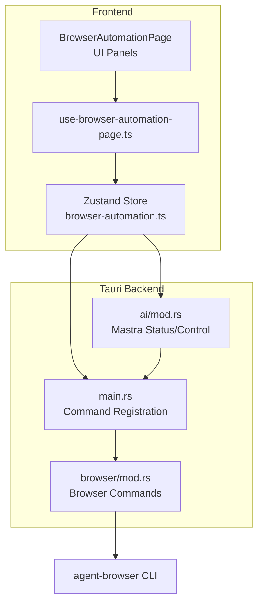
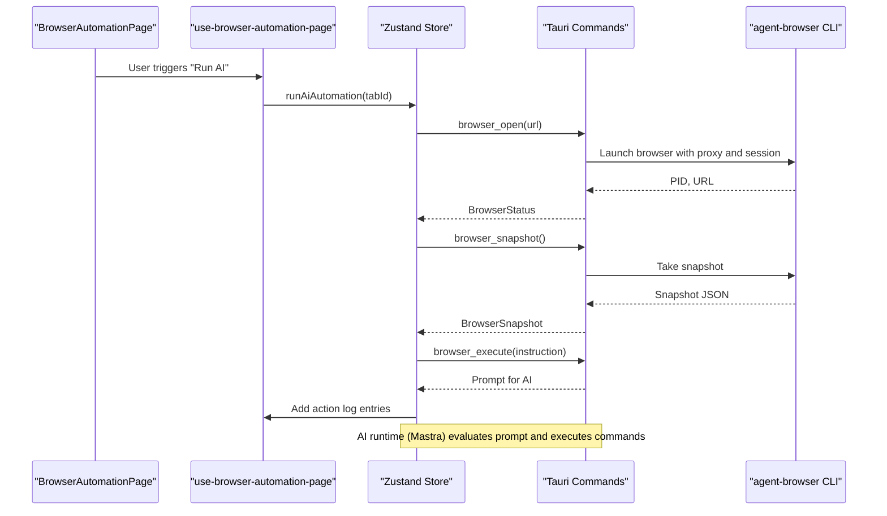
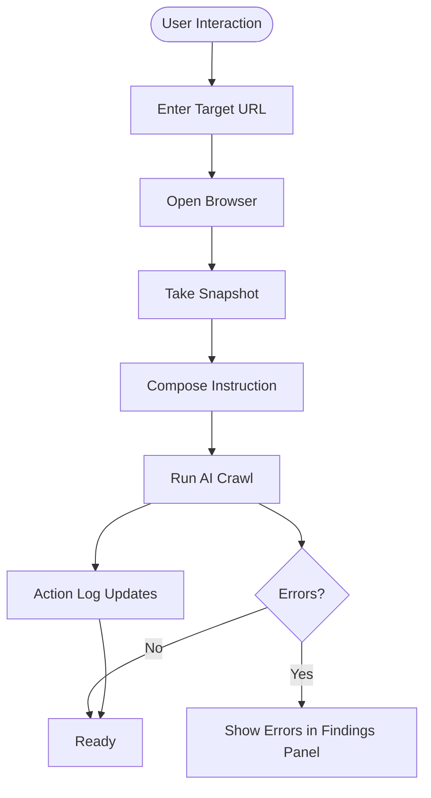
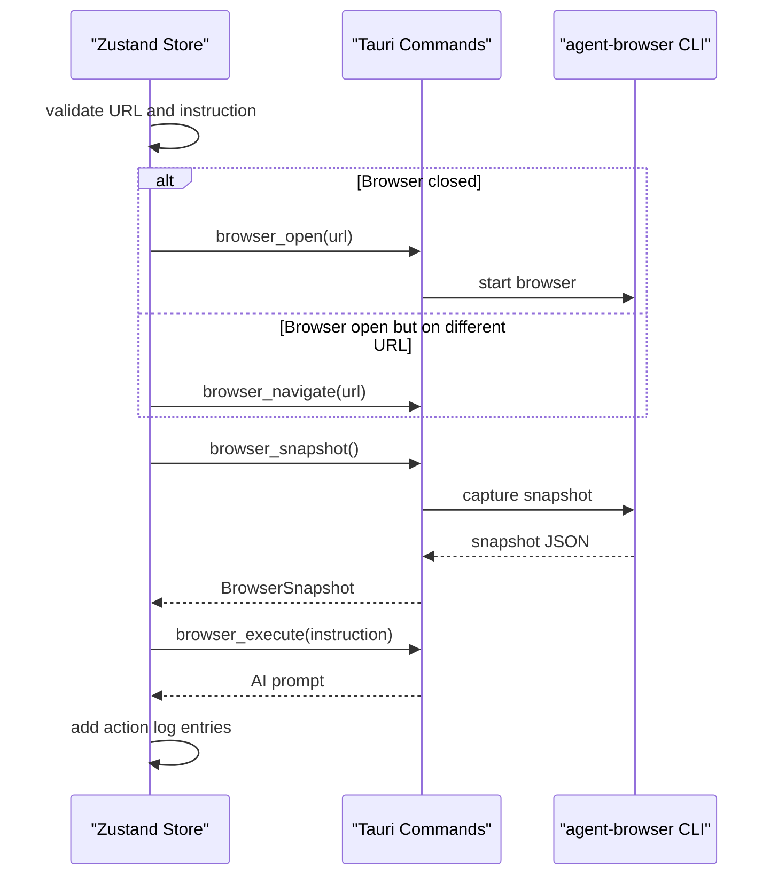
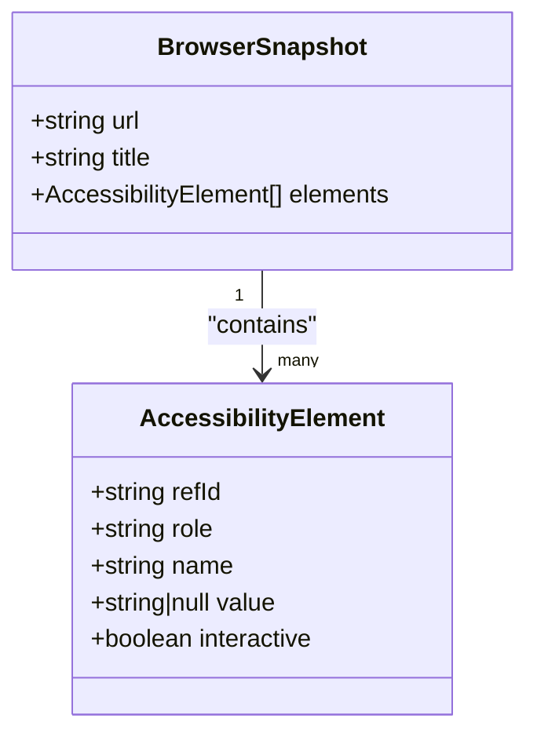
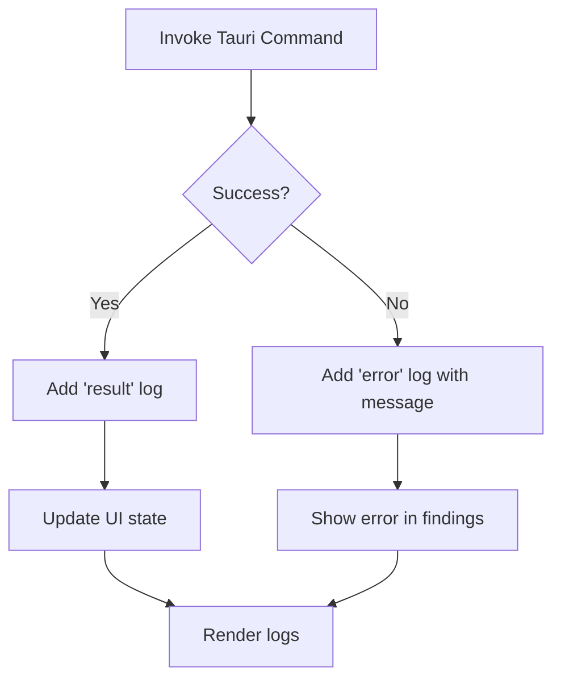
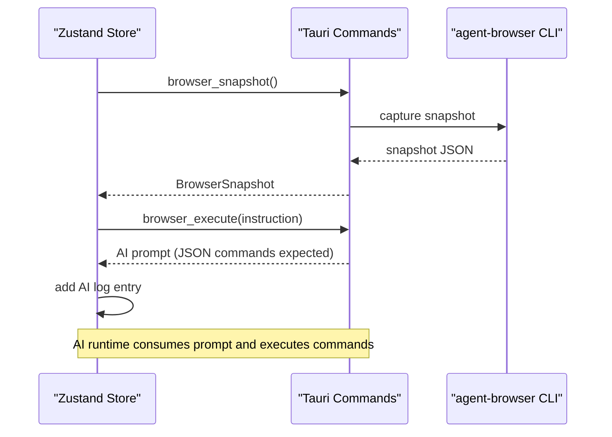
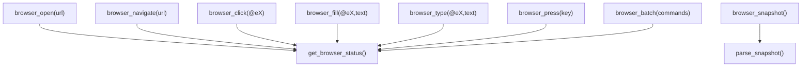
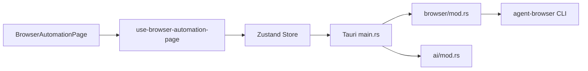

# Browser Automation

<cite>
**Referenced Files in This Document**
- [index.tsx](file://src/pages/browser-automation/index.tsx)
- [browser-automation.ts](file://src/stores/browser-automation.ts)
- [use-browser-automation-page.ts](file://src/pages/browser-automation/hooks/use-browser-automation-page.ts)
- [InstructionPanel.tsx](file://src/pages/browser-automation/components/InstructionPanel.tsx)
- [AccessibilityTreePanel.tsx](file://src/pages/browser-automation/components/AccessibilityTreePanel.tsx)
- [ActionLogPanel.tsx](file://src/pages/browser-automation/components/ActionLogPanel.tsx)
- [BrowserToolbar.tsx](file://src/pages/browser-automation/components/BrowserToolbar.tsx)
- [mod.rs](file://src-tauri/src/browser/mod.rs)
- [main.rs](file://src-tauri/src/main.rs)
- [ai/mod.rs](file://src-tauri/src/ai/mod.rs)
</cite>

## Table of Contents
1. [Introduction](#introduction)
2. [Project Structure](#project-structure)
3. [Core Components](#core-components)
4. [Architecture Overview](#architecture-overview)
5. [Detailed Component Analysis](#detailed-component-analysis)
6. [Dependency Analysis](#dependency-analysis)
7. [Performance Considerations](#performance-considerations)
8. [Troubleshooting Guide](#troubleshooting-guide)
9. [Conclusion](#conclusion)
10. [Appendices](#appendices)

## Introduction
This document explains AppRecon’s Browser Automation functionality: an instruction-based automation framework that orchestrates a headless browser via a CLI agent, captures an accessibility tree for analysis, and integrates with an AI runtime (Mastra) to generate and execute browser actions. It covers instruction composition, execution workflow, action logging, accessibility tree analysis, script-like automation creation, execution control, result processing, and practical examples for testing and security assessment. It also addresses performance, error handling, debugging, and integration with traffic analysis and dynamic content testing.

## Project Structure
The Browser Automation feature spans the frontend React/Tauri application and the Tauri backend:
- Frontend pages and UI components manage user input, snapshots, logs, and execution control.
- The Zustand store encapsulates automation state, actions, and Tauri invocations.
- The Tauri backend exposes commands to control the external browser agent and to introspect the page.

**Diagram sources**
- [index.tsx:41-252](file://src/pages/browser-automation/index.tsx#L41-L252)
- [browser-automation.ts:101-362](file://src/stores/browser-automation.ts#L101-L362)
- [use-browser-automation-page.ts:13-132](file://src/pages/browser-automation/hooks/use-browser-automation-page.ts#L13-L132)
- [mod.rs:102-505](file://src-tauri/src/browser/mod.rs#L102-L505)
- [main.rs:125-139](file://src-tauri/src/main.rs#L125-L139)
- [ai/mod.rs:87-121](file://src-tauri/src/ai/mod.rs#L87-L121)

**Section sources**
- [index.tsx:41-252](file://src/pages/browser-automation/index.tsx#L41-L252)
- [browser-automation.ts:101-362](file://src/stores/browser-automation.ts#L101-L362)
- [use-browser-automation-page.ts:13-132](file://src/pages/browser-automation/hooks/use-browser-automation-page.ts#L13-L132)
- [mod.rs:102-505](file://src-tauri/src/browser/mod.rs#L102-L505)
- [main.rs:125-139](file://src-tauri/src/main.rs#L125-L139)
- [ai/mod.rs:87-121](file://src-tauri/src/ai/mod.rs#L87-L121)

## Core Components
- UI orchestration and status display:
  - Top toolbar for URL input, browser open/close, snapshot, run AI, stop, and tab management.
  - Instruction panel for composing crawl instructions.
  - Accessibility tree panel for inspecting interactive elements and triggering clicks.
  - Action log panel for verbose event logging.
- State and execution engine:
  - Zustand store manages tabs, URLs, instructions, snapshots, action logs, discovered APIs, and browser status.
  - Store functions invoke Tauri commands for browser control and AI prompts.
- Backend browser control:
  - Tauri commands spawn and control an external browser agent, capture snapshots, and execute actions.
- AI runtime integration:
  - Mastra status and lifecycle are exposed via Tauri commands and polled by the UI.

**Section sources**
- [index.tsx:41-252](file://src/pages/browser-automation/index.tsx#L41-L252)
- [InstructionPanel.tsx:15-46](file://src/pages/browser-automation/components/InstructionPanel.tsx#L15-L46)
- [AccessibilityTreePanel.tsx:12-61](file://src/pages/browser-automation/components/AccessibilityTreePanel.tsx#L12-L61)
- [ActionLogPanel.tsx:13-61](file://src/pages/browser-automation/components/ActionLogPanel.tsx#L13-L61)
- [BrowserToolbar.tsx:23-102](file://src/pages/browser-automation/components/BrowserToolbar.tsx#L23-L102)
- [browser-automation.ts:47-77](file://src/stores/browser-automation.ts#L47-L77)
- [mod.rs:102-505](file://src-tauri/src/browser/mod.rs#L102-L505)
- [ai/mod.rs:87-121](file://src-tauri/src/ai/mod.rs#L87-L121)

## Architecture Overview
The system follows a React frontend with a Tauri backend. The frontend composes instructions and orchestrates browser actions; the backend runs an external browser agent and returns structured snapshots. An AI runtime (Mastra) is integrated to evaluate prompts and drive automation.

**Diagram sources**
- [index.tsx:87-91](file://src/pages/browser-automation/index.tsx#L87-L91)
- [use-browser-automation-page.ts:87-91](file://src/pages/browser-automation/hooks/use-browser-automation-page.ts#L87-L91)
- [browser-automation.ts:218-298](file://src/stores/browser-automation.ts#L218-L298)
- [mod.rs:102-196](file://src-tauri/src/browser/mod.rs#L102-L196)
- [ai/mod.rs:87-121](file://src-tauri/src/ai/mod.rs#L87-L121)

## Detailed Component Analysis

### UI Orchestration and Panels
- BrowserAutomationPage renders:
  - Toolbar with URL input, open/close browser, snapshot, run AI, stop, and clear log.
  - Snapshot summary and interactive count.
  - Action log panel with timestamps and categorized entries.
  - Findings area for errors and crawl outcomes.
- InstructionPanel allows editing an instruction string and starting/stopping automation.
- AccessibilityTreePanel displays the current snapshot with clickable elements and ref IDs.
- ActionLogPanel shows categorized logs (command, result, error, AI).
- BrowserToolbar provides compact controls and status badges.

**Diagram sources**
- [index.tsx:71-252](file://src/pages/browser-automation/index.tsx#L71-L252)
- [InstructionPanel.tsx:15-46](file://src/pages/browser-automation/components/InstructionPanel.tsx#L15-L46)
- [AccessibilityTreePanel.tsx:12-61](file://src/pages/browser-automation/components/AccessibilityTreePanel.tsx#L12-L61)
- [ActionLogPanel.tsx:13-61](file://src/pages/browser-automation/components/ActionLogPanel.tsx#L13-L61)
- [BrowserToolbar.tsx:23-102](file://src/pages/browser-automation/components/BrowserToolbar.tsx#L23-L102)

**Section sources**
- [index.tsx:41-252](file://src/pages/browser-automation/index.tsx#L41-L252)
- [InstructionPanel.tsx:15-46](file://src/pages/browser-automation/components/InstructionPanel.tsx#L15-L46)
- [AccessibilityTreePanel.tsx:12-61](file://src/pages/browser-automation/components/AccessibilityTreePanel.tsx#L12-L61)
- [ActionLogPanel.tsx:13-61](file://src/pages/browser-automation/components/ActionLogPanel.tsx#L13-L61)
- [BrowserToolbar.tsx:23-102](file://src/pages/browser-automation/components/BrowserToolbar.tsx#L23-L102)

### State Management and Execution Workflow
- Tabs represent independent automation sessions with URL, instruction, snapshot, action logs, and discovered APIs.
- The store exposes:
  - Browser lifecycle: open, close, navigate, snapshot.
  - Element actions: click, fill, type, press.
  - AI orchestration: run AI automation and prepare prompt.
  - Logging: add and clear action logs.
  - Status polling: refresh browser and Mastra status.
- Execution flow:
  - Validate URL and instruction.
  - Ensure browser is open and navigated to the target.
  - Capture snapshot and prepare AI prompt.
  - Emit action log entries for each step.

**Diagram sources**
- [browser-automation.ts:218-298](file://src/stores/browser-automation.ts#L218-L298)
- [mod.rs:102-196](file://src-tauri/src/browser/mod.rs#L102-L196)
- [mod.rs:481-505](file://src-tauri/src/browser/mod.rs#L481-L505)

**Section sources**
- [browser-automation.ts:47-77](file://src/stores/browser-automation.ts#L47-L77)
- [browser-automation.ts:218-298](file://src/stores/browser-automation.ts#L218-L298)

### Accessibility Tree Analysis
- The snapshot captures:
  - Page URL and title.
  - Interactive elements with ref IDs, roles, names, and values.
- The frontend renders a scrollable tree of elements, enabling:
  - Clicking elements by ref ID.
  - Inspecting roles and values for dynamic content.
- Parsing supports multiple output formats from the agent and marks interactive elements based on roles.

**Diagram sources**
- [mod.rs:7-31](file://src-tauri/src/browser/mod.rs#L7-L31)
- [mod.rs:420-478](file://src-tauri/src/browser/mod.rs#L420-L478)
- [AccessibilityTreePanel.tsx:12-61](file://src/pages/browser-automation/components/AccessibilityTreePanel.tsx#L12-L61)

**Section sources**
- [mod.rs:7-31](file://src-tauri/src/browser/mod.rs#L7-L31)
- [mod.rs:420-478](file://src-tauri/src/browser/mod.rs#L420-L478)
- [AccessibilityTreePanel.tsx:12-61](file://src/pages/browser-automation/components/AccessibilityTreePanel.tsx#L12-L61)

### Action Logging and Result Processing
- Logs are categorized:
  - command: user/system intent.
  - result: successful outcome.
  - error: failure with message.
  - ai: AI prompt preparation and evaluation.
- The UI displays logs with timestamps and color-coded badges.
- Results include:
  - Snapshot metadata and element counts.
  - Browser status updates (PID, URL).
  - Errors surfaced in the findings panel.

**Diagram sources**
- [browser-automation.ts:161-186](file://src/stores/browser-automation.ts#L161-L186)
- [browser-automation.ts:188-197](file://src/stores/browser-automation.ts#L188-L197)
- [browser-automation.ts:200-216](file://src/stores/browser-automation.ts#L200-L216)
- [ActionLogPanel.tsx:13-61](file://src/pages/browser-automation/components/ActionLogPanel.tsx#L13-L61)

**Section sources**
- [browser-automation.ts:24-28](file://src/stores/browser-automation.ts#L24-L28)
- [browser-automation.ts:161-186](file://src/stores/browser-automation.ts#L161-L186)
- [browser-automation.ts:188-197](file://src/stores/browser-automation.ts#L188-L197)
- [browser-automation.ts:200-216](file://src/stores/browser-automation.ts#L200-L216)
- [ActionLogPanel.tsx:13-61](file://src/pages/browser-automation/components/ActionLogPanel.tsx#L13-L61)

### AI Integration and Script Generation
- The backend constructs an instruction-driven prompt embedding:
  - Current page URL and title.
  - Interactive elements with ref IDs and attributes.
  - The user instruction.
- The prompt instructs the AI to return a JSON array of commands (click, fill, type, navigate, press).
- The frontend adds an AI log entry indicating prompt preparation and a status message indicating pending AI execution.

**Diagram sources**
- [browser-automation.ts:278-289](file://src/stores/browser-automation.ts#L278-L289)
- [mod.rs:481-505](file://src-tauri/src/browser/mod.rs#L481-L505)

**Section sources**
- [browser-automation.ts:278-289](file://src/stores/browser-automation.ts#L278-L289)
- [mod.rs:481-505](file://src-tauri/src/browser/mod.rs#L481-L505)

### Execution Control and Browser Lifecycle
- Lifecycle commands:
  - Open browser with a URL and proxy configuration.
  - Close browser and clean up process state.
  - Navigate to a URL.
  - Take a snapshot and parse the accessibility tree.
  - Click/fill/type/press keys on elements.
  - Batch commands support.
- Status polling keeps the UI informed about browser PID and URL.

**Diagram sources**
- [mod.rs:102-196](file://src-tauri/src/browser/mod.rs#L102-L196)
- [mod.rs:198-355](file://src-tauri/src/browser/mod.rs#L198-L355)
- [mod.rs:387-418](file://src-tauri/src/browser/mod.rs#L387-L418)

**Section sources**
- [mod.rs:102-196](file://src-tauri/src/browser/mod.rs#L102-L196)
- [mod.rs:198-355](file://src-tauri/src/browser/mod.rs#L198-L355)
- [mod.rs:387-418](file://src-tauri/src/browser/mod.rs#L387-L418)

### Practical Workflows and Examples
- Basic crawl:
  - Enter target URL, open browser, take snapshot, compose instruction, run AI, observe logs and findings.
- Form submission automation:
  - Use the accessibility tree to locate input fields by ref ID, fill and type values, then click submit.
- Dynamic content testing:
  - Inspect element values after interactions; leverage snapshot diffs to detect changes.
- Security testing scenarios:
  - Compose instructions to discover API endpoints, authentication surfaces, and potential XSS sinks.
  - Use “press” commands to trigger Enter or Tab navigation.

[No sources needed since this section provides practical guidance without analyzing specific files]

## Dependency Analysis
- Frontend depends on:
  - Zustand store for state and Tauri invocations.
  - UI components for rendering panels and logs.
- Backend depends on:
  - External agent-browser CLI for browser control and snapshotting.
  - Mastra runtime for AI orchestration.
- Commands registration ties frontend invocations to backend implementations.

**Diagram sources**
- [index.tsx:41-252](file://src/pages/browser-automation/index.tsx#L41-L252)
- [use-browser-automation-page.ts:13-132](file://src/pages/browser-automation/hooks/use-browser-automation-page.ts#L13-L132)
- [browser-automation.ts:101-362](file://src/stores/browser-automation.ts#L101-L362)
- [main.rs:125-139](file://src-tauri/src/main.rs#L125-L139)
- [mod.rs:102-505](file://src-tauri/src/browser/mod.rs#L102-L505)
- [ai/mod.rs:87-121](file://src-tauri/src/ai/mod.rs#L87-L121)

**Section sources**
- [main.rs:125-139](file://src-tauri/src/main.rs#L125-L139)
- [mod.rs:102-505](file://src-tauri/src/browser/mod.rs#L102-L505)
- [ai/mod.rs:87-121](file://src-tauri/src/ai/mod.rs#L87-L121)

## Performance Considerations
- Snapshot parsing:
  - The backend parses textual output from the agent; ensure minimal re-parsing by caching snapshots until navigation occurs.
- Command batching:
  - Use batch commands to reduce IPC overhead when chaining multiple actions.
- Polling intervals:
  - Status polling is performed periodically; keep intervals reasonable to avoid excessive CPU usage.
- Proxy and session:
  - Running the browser under a proxy and session reduces repeated setup costs across commands.

[No sources needed since this section provides general guidance]

## Troubleshooting Guide
Common issues and resolutions:
- Agent not found:
  - The backend searches for the agent-browser executable; ensure it is installed and discoverable in PATH or common locations.
- Snapshot failures:
  - Verify the browser is open and the current page is loaded; re-run snapshot capture.
- Navigation errors:
  - Confirm the URL is valid and reachable; check proxy configuration.
- AI prompt failures:
  - Ensure Mastra is running and reachable; verify AI settings and API keys.
- Action failures:
  - Review action logs for error messages; confirm element ref IDs exist in the current snapshot.

**Section sources**
- [mod.rs:39-60](file://src-tauri/src/browser/mod.rs#L39-L60)
- [browser-automation.ts:161-186](file://src/stores/browser-automation.ts#L161-L186)
- [browser-automation.ts:188-197](file://src/stores/browser-automation.ts#L188-L197)
- [browser-automation.ts:200-216](file://src/stores/browser-automation.ts#L200-L216)
- [ai/mod.rs:87-121](file://src-tauri/src/ai/mod.rs#L87-L121)

## Conclusion
AppRecon’s Browser Automation provides a robust instruction-based framework for automated testing and security assessment. By combining an accessibility tree snapshot, explicit element actions, and AI-driven command generation, it enables repeatable, observable workflows. The modular architecture separates UI concerns from backend browser control and AI orchestration, facilitating maintainability and extensibility.

[No sources needed since this section summarizes without analyzing specific files]

## Appendices

### API and Command Reference
- Frontend invokes Tauri commands via the store; backend registers them in main.
- Key commands:
  - get_browser_status, browser_open, browser_close, browser_navigate, browser_snapshot, browser_click, browser_fill, browser_type, browser_press, browser_batch, browser_execute.

**Section sources**
- [main.rs:125-139](file://src-tauri/src/main.rs#L125-L139)
- [mod.rs:102-505](file://src-tauri/src/browser/mod.rs#L102-L505)