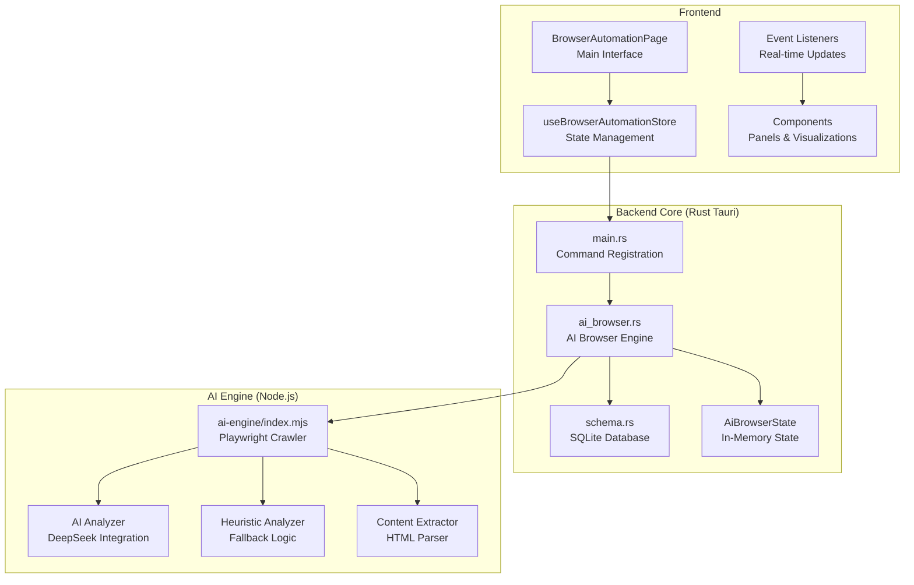
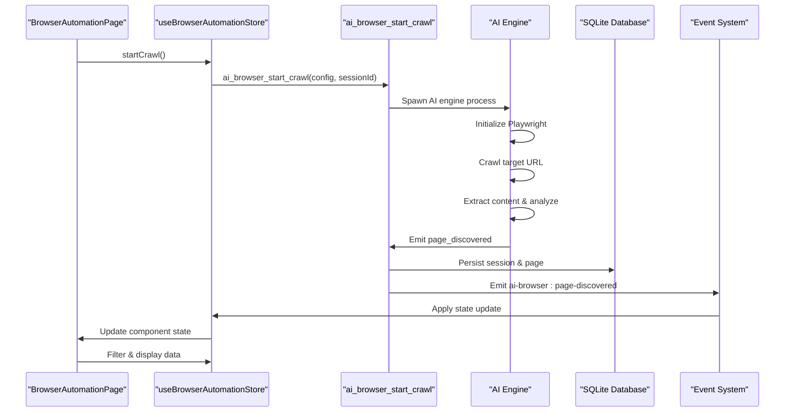
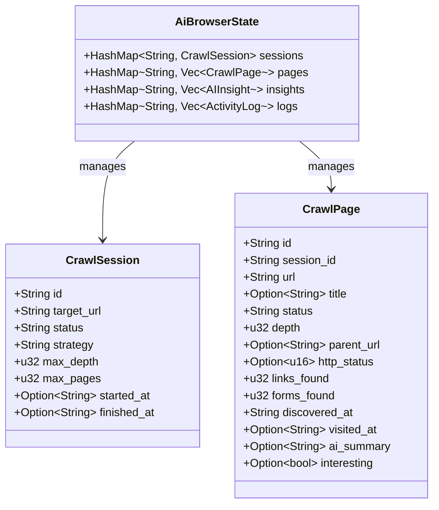
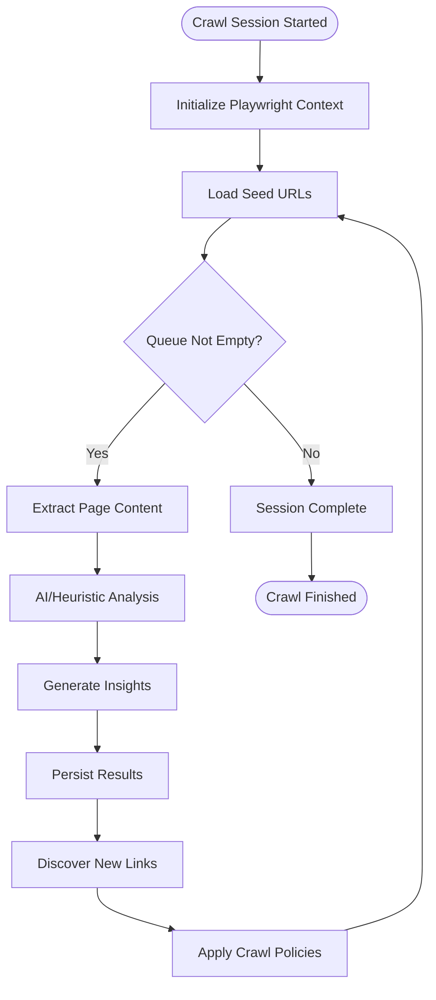

# Browser Automation

<cite>
**Referenced Files in This Document**
- [index.tsx](file://src/pages/browser-automation/index.tsx)
- [browser-automation.ts](file://src/stores/browser-automation.ts)
- [use-browser-automation-page.ts](file://src/pages/browser-automation/hooks/use-browser-automation-page.ts)
- [crawl-setup-screen.tsx](file://src/pages/browser-automation/components/crawl-setup-screen.tsx)
- [ai-insights-panel.tsx](file://src/pages/browser-automation/components/ai-insights-panel.tsx)
- [activity-log-panel.tsx](file://src/pages/browser-automation/components/activity-log-panel.tsx)
- [crawl-overview-panel.tsx](file://src/pages/browser-automation/components/crawl-overview-panel.tsx)
- [crawl-tree-panel.tsx](file://src/pages/browser-automation/components/crawl-tree-panel.tsx)
- [page-detail-drawer.tsx](file://src/pages/browser-automation/components/page-detail-drawer.tsx)
- [ai-engine/index.mjs](file://scripts/ai-engine/index.mjs)
- [ai_browser.rs](file://src-tauri/src/ai_browser.rs)
- [browser/mod.rs](file://src-tauri/src/browser/mod.rs)
- [main.rs](file://src-tauri/src/main.rs)
- [schema.rs](file://src-tauri/src/db/schema.rs)
- [types.ts](file://src/pages/browser-automation/types.ts)
- [constants.ts](file://src/pages/browser-automation/constants.ts)
</cite>

## Update Summary
**Changes Made**
- Updated architecture to reflect AI-powered browser automation system with JavaScript sidecar architecture
- Enhanced crawling capabilities with Playwright integration for dynamic content extraction
- Removed screenshot capture functionality in favor of AI-powered page analysis
- Added comprehensive AI analysis with DeepSeek integration and heuristic fallback
- Updated database schema to support AI browser sessions, pages, insights, and logs
- Enhanced frontend components with real-time monitoring and AI insights visualization

## Table of Contents
1. [Introduction](#introduction)
2. [Project Structure](#project-structure)
3. [Core Components](#core-components)
4. [Architecture Overview](#architecture-overview)
5. [Detailed Component Analysis](#detailed-component-analysis)
6. [AI-Powered Crawl System](#ai-powered-crawl-system)
7. [Database Schema and Persistence](#database-schema-and-persistence)
8. [Real-Time Monitoring and Events](#real-time-monitoring-and-events)
9. [Frontend Components and UI](#frontend-components-and-ui)
10. [Performance Considerations](#performance-considerations)
11. [Troubleshooting Guide](#troubleshooting-guide)
12. [Conclusion](#conclusion)
13. [Appendices](#appendices)

## Introduction
AppRecon's Browser Automation has been transformed into a comprehensive AI-powered system featuring a sophisticated three-tier architecture. The system now combines a Rust Tauri backend with a Node.js AI engine powered by Playwright for intelligent web crawling, real-time monitoring through event streaming, and persistent storage of crawl sessions, pages, insights, and logs. This enhancement enables automated testing, security assessment, and reconnaissance with AI-driven insights and comprehensive observability, replacing traditional screenshot-based analysis with advanced AI-powered page understanding.

## Project Structure
The enhanced Browser Automation system spans multiple layers with clear separation of concerns:

- **Backend Core**: Rust Tauri application managing state, commands, and database persistence
- **AI Engine**: Node.js sidecar powered by Playwright for dynamic content extraction and AI analysis
- **Frontend Interface**: React components with real-time event streaming and comprehensive monitoring
- **Database Layer**: SQLite persistence for crawl sessions, pages, insights, and logs
- **Event System**: Real-time communication between backend, AI engine, and frontend

**Diagram sources**
- [ai_browser.rs:1-798](file://src-tauri/src/ai_browser.rs#L1-L798)
- [schema.rs:177-255](file://src-tauri/src/db/schema.rs#L177-L255)
- [main.rs:72-149](file://src-tauri/src/main.rs#L72-L149)
- [ai-engine/index.mjs:1-687](file://scripts/ai-engine/index.mjs#L1-L687)
- [index.tsx:14-215](file://src/pages/browser-automation/index.tsx#L14-L215)

**Section sources**
- [ai_browser.rs:1-798](file://src-tauri/src/ai_browser.rs#L1-L798)
- [schema.rs:177-255](file://src-tauri/src/db/schema.rs#L177-L255)
- [main.rs:72-149](file://src-tauri/src/main.rs#L72-L149)
- [ai-engine/index.mjs:1-687](file://scripts/ai-engine/index.mjs#L1-L687)
- [index.tsx:14-215](file://src/pages/browser-automation/index.tsx#L14-L215)

## Core Components
The AI-powered Browser Automation system consists of several interconnected components:

- **AI Browser Engine**: Rust backend managing crawl sessions, state coordination, and event emission
- **AI Engine**: Intelligent crawler using Playwright for dynamic content extraction and AI analysis
- **Real-time Event System**: WebSocket-based communication for live updates across UI components
- **Comprehensive State Management**: Zustand store with filtering, searching, and real-time updates
- **Enhanced Frontend Components**: Multiple panels for crawl overview, tree visualization, AI insights, and activity monitoring
- **Persistent Storage**: SQLite database with dedicated tables for sessions, pages, insights, and logs

**Section sources**
- [ai_browser.rs:85-91](file://src-tauri/src/ai_browser.rs#L85-L91)
- [browser-automation.ts:46-75](file://src/stores/browser-automation.ts#L46-L75)
- [index.tsx:14-215](file://src/pages/browser-automation/index.tsx#L14-L215)

## Architecture Overview
The system follows a distributed architecture pattern with clear separation between intelligence (AI), execution (Playwright), and presentation (React):

**Diagram sources**
- [browser-automation.ts:118-162](file://src/stores/browser-automation.ts#L118-L162)
- [ai_browser.rs:489-595](file://src-tauri/src/ai_browser.rs#L489-L595)
- [ai-engine/index.mjs:545-670](file://scripts/ai-engine/index.mjs#L545-L670)

## Detailed Component Analysis

### AI Browser Engine (Rust Backend)
The core AI browser engine manages crawl sessions, coordinates with the AI engine, and maintains real-time state synchronization:

- **State Management**: Thread-safe HashMap-based storage for sessions, pages, insights, and logs
- **Command Processing**: Comprehensive command set for crawl control, querying, and state management
- **Event Emission**: Real-time event broadcasting for UI updates across all components
- **Persistence Layer**: Integration with HistoryBridge for SQLite database operations
- **Process Coordination**: Process management and environment variable configuration

**Diagram sources**
- [ai_browser.rs:85-91](file://src-tauri/src/ai_browser.rs#L85-L91)
- [ai_browser.rs:28-56](file://src-tauri/src/ai_browser.rs#L28-L56)

**Section sources**
- [ai_browser.rs:85-91](file://src-tauri/src/ai_browser.rs#L85-L91)
- [ai_browser.rs:28-56](file://src-tauri/src/ai_browser.rs#L28-L56)

### AI Engine with Playwright
The intelligent crawler leverages Playwright for dynamic content extraction and AI analysis:

- **Content Extraction**: HTML parsing with comprehensive element discovery
- **Dynamic Rendering**: Playwright-based page rendering for JavaScript-heavy sites
- **AI Integration**: DeepSeek API integration for intelligent page analysis
- **Heuristic Analysis**: Fallback analysis when AI services are unavailable
- **Restricted Workflow Detection**: Safety mechanisms for authentication, uploads, and payment flows
- **Queue Management**: BFS-based crawling with configurable policies
- **Error Handling**: Robust error recovery and reporting

**Diagram sources**
- [ai-engine/index.mjs:545-670](file://scripts/ai-engine/index.mjs#L545-L670)
- [ai-engine/index.mjs:159-210](file://scripts/ai-engine/index.mjs#L159-L210)

**Section sources**
- [ai-engine/index.mjs:159-210](file://scripts/ai-engine/index.mjs#L159-L210)
- [ai-engine/index.mjs:269-336](file://scripts/ai-engine/index.mjs#L269-L336)

### Real-Time Event System
The event-driven architecture enables seamless communication between all system components:

- **Event Types**: Comprehensive event spectrum covering sessions, pages, insights, and logs
- **State Synchronization**: Automatic UI updates through reactive state management
- **Filtering & Search**: Advanced filtering capabilities for insights and logs
- **Export Functionality**: JSON export for crawl data, insights, and logs
- **Status Tracking**: Real-time monitoring of crawl progress and health

**Section sources**
- [use-browser-automation-page.ts:59-118](file://src/pages/browser-automation/hooks/use-browser-automation-page.ts#L59-L118)
- [browser-automation.ts:186-203](file://src/stores/browser-automation.ts#L186-L203)

## AI-Powered Crawl System
The enhanced crawl system provides intelligent web reconnaissance with multiple analysis modes:

### Heuristic Analysis
Basic pattern-based detection for authentication, admin routes, uploads, and error pages:

- **Authentication Detection**: Password fields, login indicators, sign-in text
- **Admin Route Discovery**: Admin-specific URL patterns and routing
- **Upload Form Identification**: File input detection and handling
- **Error Page Recognition**: HTTP status-based error detection

### AI Analysis with DeepSeek
Advanced analysis using Large Language Models for comprehensive page understanding:

- **Intelligent Summaries**: Context-aware page summaries and categorization
- **Priority Scoring**: Automated prioritization of interesting pages
- **Insight Generation**: Structured insights with severity levels
- **Schema Validation**: Type-safe AI responses with Zod validation

**Section sources**
- [ai-engine/index.mjs:212-267](file://scripts/ai-engine/index.mjs#L212-L267)
- [ai-engine/index.mjs:269-336](file://scripts/ai-engine/index.mjs#L269-L336)

## Database Schema and Persistence
The system implements a comprehensive SQLite schema for persistent storage:

### AI Browser Tables
- **ai_browser_sessions**: Crawl session metadata and status
- **ai_browser_pages**: Discovered pages with analysis results
- **ai_browser_edges**: URL relationship tracking
- **ai_browser_insights**: AI-generated insights with review status
- **ai_browser_logs**: Comprehensive activity logging

### Index Optimization
Strategic indexing for optimal query performance:
- Session status and timestamp indexes
- Page URL and session foreign key indexes
- Insight session and page foreign key indexes
- Log session and creation time indexes

**Section sources**
- [schema.rs:177-255](file://src-tauri/src/db/schema.rs#L177-L255)

## Real-Time Monitoring and Events
The event-driven architecture provides comprehensive monitoring capabilities:

### Event Types
- **Session Events**: Start, update, finish, and failure notifications
- **Page Events**: Discovery, visit, and status updates
- **Insight Events**: AI-generated insights with severity classification
- **Log Events**: Comprehensive activity logging with filtering

### State Management
- **Reactive Updates**: Automatic UI updates through event listeners
- **Filtering System**: Multi-dimensional filtering for insights and logs
- **Search Capabilities**: Full-text search across pages and logs
- **Export Functionality**: JSON export for all crawl data categories

**Section sources**
- [use-browser-automation-page.ts:59-118](file://src/pages/browser-automation/hooks/use-browser-automation-page.ts#L59-L118)
- [browser-automation.ts:186-203](file://src/stores/browser-automation.ts#L186-L203)

## Frontend Components and UI
The enhanced frontend provides comprehensive monitoring and control:

### Main Interface Layout
- **Header Controls**: Crawl configuration, start/pause/stop, and export functionality
- **Activity Log Panel**: Real-time activity monitoring with filtering
- **Crawl Overview Panel**: Live metrics and statistics
- **Crawl Tree Panel**: Hierarchical page structure visualization
- **AI Insights Panel**: Structured insights with severity and type filtering
- **Page Detail Drawer**: Detailed page information and actions

### Component Features
- **Responsive Design**: Flexible layout with resizable panels
- **Real-time Updates**: Live data synchronization through events
- **Advanced Filtering**: Multi-dimensional filtering for insights and logs
- **Export Capabilities**: JSON export for all data categories
- **Status Indicators**: Visual indicators for crawl progress and health

**Section sources**
- [index.tsx:58-215](file://src/pages/browser-automation/index.tsx#L58-L215)
- [crawl-setup-screen.tsx:31-180](file://src/pages/browser-automation/components/crawl-setup-screen.tsx#L31-L180)
- [ai-insights-panel.tsx:35-143](file://src/pages/browser-automation/components/ai-insights-panel.tsx#L35-L143)

## Performance Considerations
The AI-powered system incorporates several performance optimizations:

### Concurrency Management
- **Async Processing**: Non-blocking operations for crawl coordination
- **Thread Safety**: Proper synchronization for shared state access
- **Memory Management**: Efficient state cleanup and garbage collection
- **Resource Limits**: Configurable limits for depth, pages, and timeouts

### Network Optimization
- **Proxy Integration**: Integrated proxy support for traffic interception
- **Connection Pooling**: Efficient resource utilization across crawls
- **Timeout Management**: Configurable timeouts for responsive operation
- **Error Recovery**: Graceful degradation when AI services are unavailable

### Storage Efficiency
- **Incremental Updates**: Efficient state updates without full reloads
- **Index Utilization**: Strategic indexing for optimal query performance
- **Data Compression**: Efficient storage of crawl artifacts
- **Cleanup Policies**: Automatic cleanup of old sessions and data

## Troubleshooting Guide
Common issues and resolutions for the AI-powered system:

### AI Integration Issues
- **API Key Configuration**: Ensure DeepSeek API key is configured in AI settings
- **Model Availability**: Verify selected AI model is supported and accessible
- **Rate Limiting**: Monitor API rate limits and implement appropriate delays
- **Fallback Mechanisms**: System automatically falls back to heuristic analysis

### Crawl Configuration Problems
- **Target URL Validation**: Ensure target URL is accessible and properly formatted
- **Scope Configuration**: Verify domain restrictions and path filters are appropriate
- **Timeout Settings**: Adjust timeout values for slow-loading pages
- **Delay Configuration**: Balance crawl speed with server load considerations

### Performance Issues
- **Memory Usage**: Monitor memory consumption during long crawls
- **CPU Utilization**: Optimize Playwright configuration for resource efficiency
- **Network Latency**: Consider proxy configuration for improved performance
- **Database Performance**: Regular maintenance of SQLite database

**Section sources**
- [ai-engine/index.mjs:270-287](file://scripts/ai-engine/index.mjs#L270-L287)
- [ai-engine/index.mjs:43-59](file://scripts/ai-engine/index.mjs#L43-L59)

## Conclusion
AppRecon's enhanced Browser Automation system represents a significant advancement in automated web reconnaissance and testing. The AI-powered architecture combines intelligent crawling with real-time monitoring, comprehensive analysis, and persistent storage to deliver a robust platform for security assessment and automated testing. The modular design ensures maintainability while the event-driven architecture provides excellent user experience through real-time updates and comprehensive observability. The system's focus on AI-powered page analysis eliminates the need for screenshot capture while providing more meaningful insights through intelligent content understanding.

## Appendices

### API and Command Reference
- **Crawl Control**: ai_browser_start_crawl, ai_browser_pause_crawl, ai_browser_resume_crawl, ai_browser_stop_crawl
- **Data Retrieval**: get_ai_browser_session, list_ai_browser_pages, list_ai_browser_insights, list_ai_browser_logs
- **Configuration**: CrawlSetupConfig with target URL, depth limits, scope rules, and AI analysis options
- **Event Types**: Comprehensive event spectrum for real-time monitoring and UI updates

**Section sources**
- [main.rs:139-146](file://src-tauri/src/main.rs#L139-L146)
- [types.ts:15-37](file://src/pages/browser-automation/types.ts#L15-L37)

### Data Model Reference
- **CrawlSession**: Session metadata, status tracking, and configuration
- **CrawlPage**: Page discovery, analysis results, and status information
- **AIInsight**: Structured insights with severity, type, and review status
- **ActivityLog**: Comprehensive logging with filtering and categorization

**Section sources**
- [types.ts:28-67](file://src/pages/browser-automation/types.ts#L28-L67)