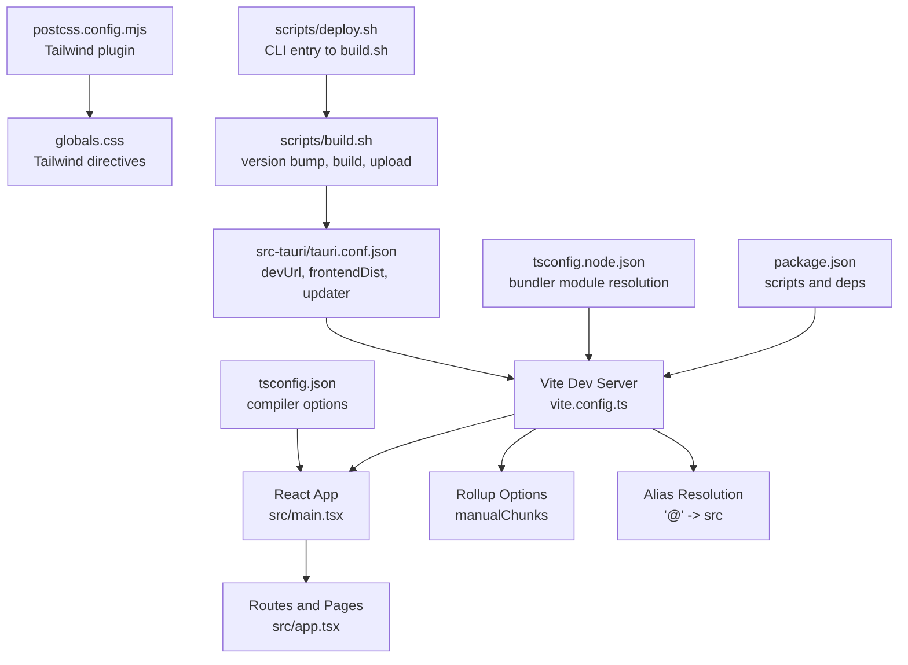
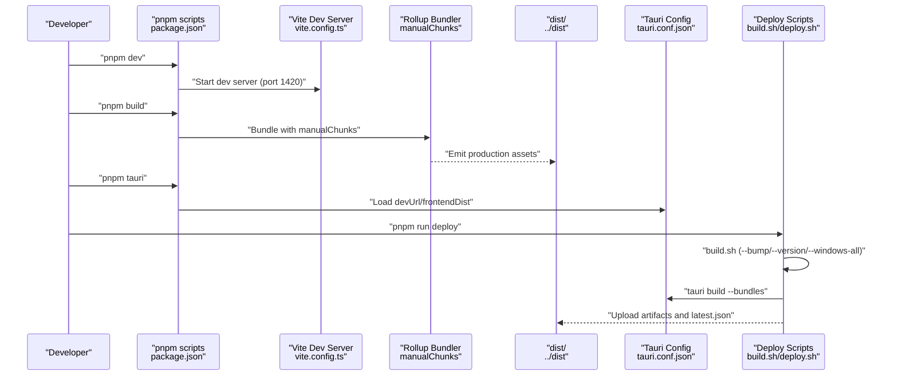
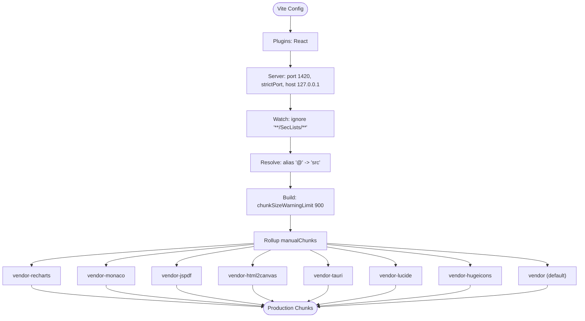
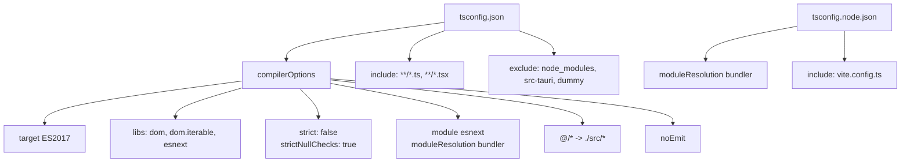
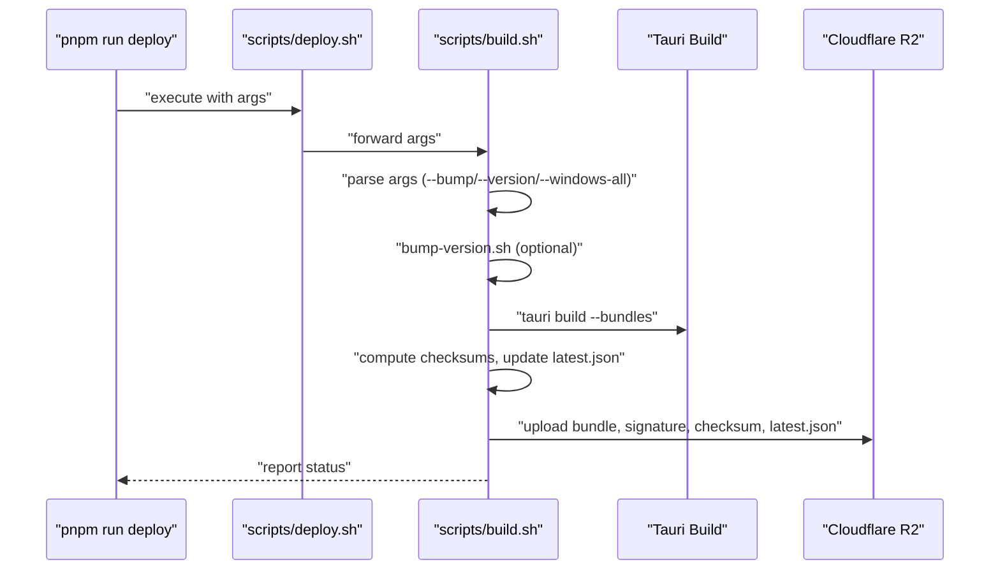
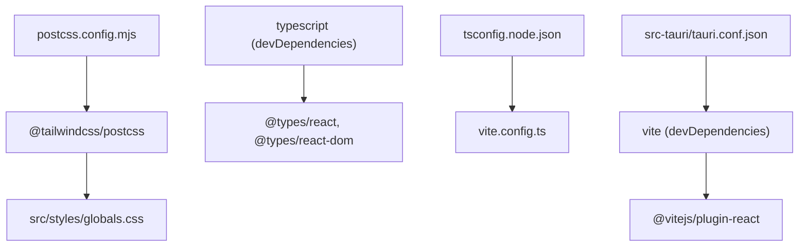

# Build Configuration

<cite>
**Referenced Files in This Document**
- [vite.config.ts](file://vite.config.ts)
- [package.json](file://package.json)
- [tsconfig.json](file://tsconfig.json)
- [tsconfig.node.json](file://tsconfig.node.json)
- [postcss.config.mjs](file://postcss.config.mjs)
- [index.html](file://index.html)
- [src/main.tsx](file://src/main.tsx)
- [src/app.tsx](file://src/app.tsx)
- [src/styles/globals.css](file://src/styles/globals.css)
- [src-tauri/tauri.conf.json](file://src-tauri/tauri.conf.json)
- [scripts/build.sh](file://scripts/build.sh)
- [scripts/deploy.sh](file://scripts/deploy.sh)
- [scripts/bump-version.sh](file://scripts/bump-version.sh)
- [README.md](file://README.md)
</cite>

## Table of Contents
1. [Introduction](#introduction)
2. [Project Structure](#project-structure)
3. [Core Components](#core-components)
4. [Architecture Overview](#architecture-overview)
5. [Detailed Component Analysis](#detailed-component-analysis)
6. [Dependency Analysis](#dependency-analysis)
7. [Performance Considerations](#performance-considerations)
8. [Troubleshooting Guide](#troubleshooting-guide)
9. [Conclusion](#conclusion)
10. [Appendices](#appendices)

## Introduction
This document explains AppRecon’s build configuration system with a focus on Vite, TypeScript, Rollup optimization, and Tauri packaging. It covers plugin setup, server configuration, alias resolution, build optimization strategies, TypeScript compiler options, path mapping, type checking settings, package scripts, and production deployment automation. Practical examples demonstrate customization, environment-specific behavior, and performance tuning. Guidance is also provided for resolving common build issues and maintaining consistency across development environments.

## Project Structure
The build pipeline spans the frontend (Vite + React + TypeScript), CSS tooling (Tailwind via PostCSS), and Tauri packaging for desktop distribution. Key configuration files and their roles:
- Vite configuration defines plugins, dev server, alias resolution, and Rollup chunking.
- TypeScript configurations define compiler options, path mapping, and include/exclude rules.
- PostCSS configuration integrates Tailwind for CSS generation.
- Tauri configuration connects the dev/preview URLs, frontend build output, and updater endpoints.
- Deployment scripts orchestrate version bumps, frontend builds, Tauri bundling, and artifact uploads.

**Diagram sources**
- [vite.config.ts:1-41](file://vite.config.ts#L1-L41)
- [package.json:1-90](file://package.json#L1-L90)
- [tsconfig.json:1-37](file://tsconfig.json#L1-L37)
- [tsconfig.node.json:1-11](file://tsconfig.node.json#L1-L11)
- [postcss.config.mjs:1-7](file://postcss.config.mjs#L1-L7)
- [src/styles/globals.css:1-361](file://src/styles/globals.css#L1-L361)
- [src-tauri/tauri.conf.json:1-48](file://src-tauri/tauri.conf.json#L1-L48)
- [scripts/build.sh:1-411](file://scripts/build.sh#L1-L411)
- [scripts/deploy.sh:1-38](file://scripts/deploy.sh#L1-L38)

**Section sources**
- [README.md:24-38](file://README.md#L24-L38)
- [package.json:6-12](file://package.json#L6-L12)
- [vite.config.ts:5-40](file://vite.config.ts#L5-L40)
- [tsconfig.json:20-24](file://tsconfig.json#L20-L24)
- [tsconfig.node.json:2-9](file://tsconfig.node.json#L2-L9)
- [postcss.config.mjs:1-7](file://postcss.config.mjs#L1-L7)
- [src-tauri/tauri.conf.json:6-11](file://src-tauri/tauri.conf.json#L6-L11)
- [scripts/build.sh:1-411](file://scripts/build.sh#L1-L411)
- [scripts/deploy.sh:1-38](file://scripts/deploy.sh#L1-L38)

## Core Components
- Vite configuration
  - Plugin: React Fast Refresh via @vitejs/plugin-react.
  - Dev server: port 1420, strictPort, host restricted to loopback, ignores large SecLists directory during watch.
  - Alias: "@" resolves to the src directory for ergonomic imports.
  - Build: chunkSizeWarningLimit tuned for large bundles; Rollup manualChunks for vendor separation.
- TypeScript configuration
  - Compiler options: ES2017 target, DOM/ESNext libs, allowJs, skipLibCheck, strict mode toggled off except strictNullChecks, noEmit, esModuleInterop, esnext modules, bundler module resolution, isolatedModules, JSX transform, incremental builds, and path mapping "@/*" to "./src/*".
  - Includes TS/TSX files, excludes node_modules, src-tauri, and dummy.
  - Node config: bundler module resolution for vite.config.ts.
- CSS tooling
  - Tailwind integrated via PostCSS plugin; CSS uses Tailwind v4 directives and theme tokens.
- Tauri configuration
  - Dev URL points to Vite dev server on port 1420.
  - FrontendDist set to ../dist so Tauri consumes Vite’s production output.
  - Updater configured with public key and endpoint.

**Section sources**
- [vite.config.ts:5-40](file://vite.config.ts#L5-L40)
- [tsconfig.json:2-26](file://tsconfig.json#L2-L26)
- [tsconfig.json:27-36](file://tsconfig.json#L27-L36)
- [tsconfig.node.json:2-9](file://tsconfig.node.json#L2-L9)
- [postcss.config.mjs:1-7](file://postcss.config.mjs#L1-L7)
- [src-tauri/tauri.conf.json:6-11](file://src-tauri/tauri.conf.json#L6-L11)

## Architecture Overview
The build system orchestrates development and production workflows across Vite, TypeScript, CSS, and Tauri packaging. The sequence below illustrates how the frontend build feeds into Tauri and how deployment scripts automate versioning, bundling, and artifact publishing.

**Diagram sources**
- [package.json:6-12](file://package.json#L6-L12)
- [vite.config.ts:8-15](file://vite.config.ts#L8-L15)
- [vite.config.ts:21-39](file://vite.config.ts#L21-L39)
- [src-tauri/tauri.conf.json:6-11](file://src-tauri/tauri.conf.json#L6-L11)
- [scripts/build.sh:1-411](file://scripts/build.sh#L1-L411)
- [scripts/deploy.sh:1-38](file://scripts/deploy.sh#L1-L38)

## Detailed Component Analysis

### Vite Configuration
Key aspects:
- Plugins: React Fast Refresh enabled.
- Dev server: port 1420, strictPort, host loopback, watch ignores large external lists.
- Alias: "@" mapped to src for concise imports.
- Build: chunkSizeWarningLimit raised; Rollup manualChunks groups major vendor libraries into dedicated chunks.

**Diagram sources**
- [vite.config.ts:5-40](file://vite.config.ts#L5-L40)

**Section sources**
- [vite.config.ts:5-40](file://vite.config.ts#L5-L40)

### TypeScript Configuration
Compiler options and path mapping:
- Target and libs tailored for modern browsers.
- Strictness: disabled strict mode globally except strictNullChecks.
- Module resolution: bundler for Vite and Node configs.
- Path mapping: "@/*" resolves to "./src/*" for clean imports.
- Include/exclude: TS/TSX files, excluding node_modules and Rust backend.

**Diagram sources**
- [tsconfig.json:2-26](file://tsconfig.json#L2-L26)
- [tsconfig.json:27-36](file://tsconfig.json#L27-L36)
- [tsconfig.node.json:2-9](file://tsconfig.node.json#L2-L9)

**Section sources**
- [tsconfig.json:2-26](file://tsconfig.json#L2-L26)
- [tsconfig.json:27-36](file://tsconfig.json#L27-L36)
- [tsconfig.node.json:2-9](file://tsconfig.node.json#L2-L9)

### CSS Tooling and Tailwind Integration
- PostCSS loads the Tailwind plugin.
- globals.css imports Tailwind v4 and defines theme tokens mapped to CSS variables.
- Fonts and animations are defined centrally for consistent styling across the app.

**Section sources**
- [postcss.config.mjs:1-7](file://postcss.config.mjs#L1-L7)
- [src/styles/globals.css:1-361](file://src/styles/globals.css#L1-L361)

### Tauri Integration
- Dev URL points to Vite dev server on port 1420.
- FrontendDist set to ../dist so Tauri consumes Vite’s production output.
- Updater configured with public key and endpoint for self-updates.

**Section sources**
- [src-tauri/tauri.conf.json:6-11](file://src-tauri/tauri.conf.json#L6-L11)
- [src-tauri/tauri.conf.json:39-46](file://src-tauri/tauri.conf.json#L39-L46)

### Build Scripts and Deployment Automation
- scripts/deploy.sh delegates to scripts/build.sh with optional arguments for version bumping and Windows multi-target builds.
- scripts/build.sh:
  - Supports auto-bumping or explicit version setting.
  - Detects platform and selects appropriate bundle/installer artifacts.
  - Builds Tauri bundles, computes checksums, updates latest.json, and uploads artifacts to Cloudflare R2.
  - Honors .env for environment variables and supports Windows cross-targets.

**Diagram sources**
- [scripts/deploy.sh:1-38](file://scripts/deploy.sh#L1-L38)
- [scripts/build.sh:1-411](file://scripts/build.sh#L1-L411)
- [scripts/bump-version.sh:1-40](file://scripts/bump-version.sh#L1-L40)

**Section sources**
- [scripts/deploy.sh:1-38](file://scripts/deploy.sh#L1-L38)
- [scripts/build.sh:1-411](file://scripts/build.sh#L1-L411)
- [scripts/bump-version.sh:1-40](file://scripts/bump-version.sh#L1-L40)

## Dependency Analysis
- Vite and React plugin: Vite 7.x with React Fast Refresh.
- TypeScript and TS types: TypeScript ~5.8.3 with React types.
- Node configuration: bundler module resolution for Vite config typing.
- Tailwind CSS: Tailwind v4 via PostCSS plugin.
- Tauri: CLI and APIs for desktop packaging and updater.

**Diagram sources**
- [package.json:81-87](file://package.json#L81-L87)
- [tsconfig.node.json:2-9](file://tsconfig.node.json#L2-L9)
- [postcss.config.mjs:1-7](file://postcss.config.mjs#L1-L7)
- [src-tauri/tauri.conf.json:6-11](file://src-tauri/tauri.conf.json#L6-L11)

**Section sources**
- [package.json:81-87](file://package.json#L81-L87)
- [tsconfig.node.json:2-9](file://tsconfig.node.json#L2-L9)
- [postcss.config.mjs:1-7](file://postcss.config.mjs#L1-L7)
- [src-tauri/tauri.conf.json:6-11](file://src-tauri/tauri.conf.json#L6-L11)

## Performance Considerations
- Vendor chunking: Rollup manualChunks separates heavy libraries into named vendor chunks to improve caching and reduce main bundle size.
- Chunk size warning limit: Increased to accommodate large third-party libraries.
- Watch exclusions: Ignoring large directories reduces file watching overhead during development.
- CSS tooling: Tailwind directives and CSS variables minimize runtime style computation and enable efficient dark mode switching.
- Incremental builds: TypeScript incremental compilation speeds up rebuilds in development.

Practical tips:
- Monitor chunk sizes and adjust manualChunks grouping for frequently updated vs. stable vendor libraries.
- Keep alias usage consistent to avoid duplicated module instantiations.
- Use lazy loading for large routes or components to reduce initial bundle weight.

**Section sources**
- [vite.config.ts:21-39](file://vite.config.ts#L21-L39)
- [tsconfig.json:18-19](file://tsconfig.json#L18-L19)
- [src/styles/globals.css:1-361](file://src/styles/globals.css#L1-L361)

## Troubleshooting Guide
Common issues and resolutions:
- Port conflicts during development
  - Use the “dev:clean” script to free port 1420 before restarting the dev server.
  - Verify devUrl in Tauri configuration matches Vite’s dev server port.
- Alias resolution errors
  - Ensure "@/*" path mapping aligns with actual file locations under src/.
- Large bundle warnings
  - Review manualChunks grouping and consider lazy loading for large features.
- CSS not applying
  - Confirm Tailwind plugin is loaded and globals.css is imported in main entry.
- Tauri build failures
  - Verify frontendDist points to dist and devUrl matches Vite’s dev server.
- Deployment failures
  - Ensure R2 credentials and bucket are set; check latest.json updates and signatures.

**Section sources**
- [package.json:7-12](file://package.json#L7-L12)
- [vite.config.ts:8-15](file://vite.config.ts#L8-L15)
- [vite.config.ts:16-20](file://vite.config.ts#L16-L20)
- [vite.config.ts:21-39](file://vite.config.ts#L21-L39)
- [postcss.config.mjs:1-7](file://postcss.config.mjs#L1-L7)
- [src-tauri/tauri.conf.json:6-11](file://src-tauri/tauri.conf.json#L6-L11)
- [scripts/build.sh:254-271](file://scripts/build.sh#L254-L271)

## Conclusion
AppRecon’s build configuration leverages Vite for fast development and optimized production bundling, TypeScript for type safety, Tailwind for styling, and Tauri for desktop packaging. The Rollup manualChunks strategy and path mapping streamline development and improve cacheability. The deployment scripts automate versioning, bundling, and artifact publishing. Following the troubleshooting and performance recommendations ensures reliable builds and smooth developer experiences across environments.

## Appendices

### Package Scripts and Dependencies
- Scripts
  - dev: starts Vite dev server.
  - dev:clean: frees port 1420 and restarts dev server.
  - build: produces production bundles.
  - preview: serves built assets locally.
  - deploy: orchestrates version bump and build/upload.
- Dependencies
  - React 19, React Router, Radix UI, Tailwind CSS, Tauri APIs, and numerous UI and utility packages.

**Section sources**
- [package.json:6-12](file://package.json#L6-L12)
- [package.json:14-80](file://package.json#L14-L80)

### Environment-Specific Configuration Examples
- Development
  - Use devUrl in Tauri pointing to Vite dev server (port 1420).
  - Keep watch exclusions to avoid unnecessary rebuilds.
- Production
  - Ensure manualChunks group large vendor libraries.
  - Validate chunkSizeWarningLimit and monitor bundle sizes.
- CI/CD
  - Set R2_ENDPOINT and R2_BUCKET for automated uploads.
  - Use scripts/deploy.sh with --bump or --version to manage releases.

**Section sources**
- [src-tauri/tauri.conf.json:6-11](file://src-tauri/tauri.conf.json#L6-L11)
- [vite.config.ts:21-39](file://vite.config.ts#L21-L39)
- [scripts/build.sh:254-271](file://scripts/build.sh#L254-L271)
- [scripts/deploy.sh:6-22](file://scripts/deploy.sh#L6-L22)