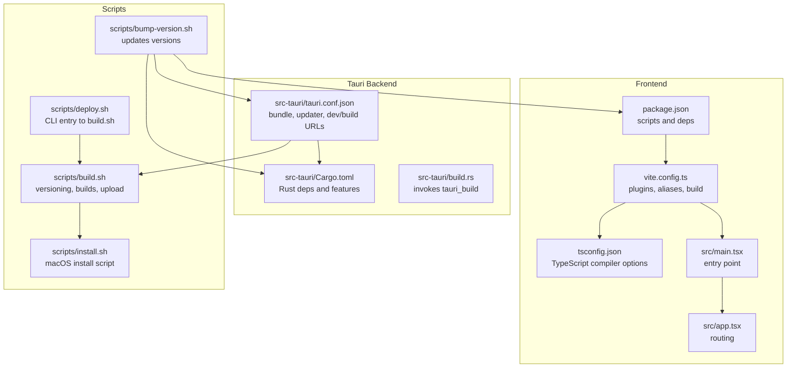
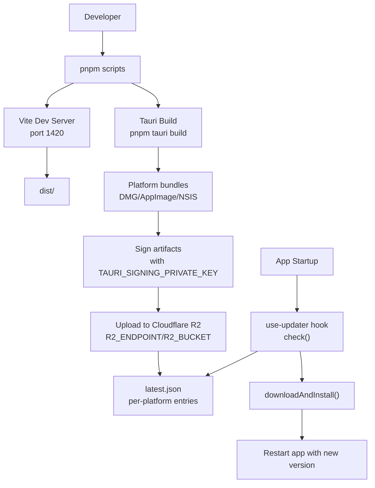
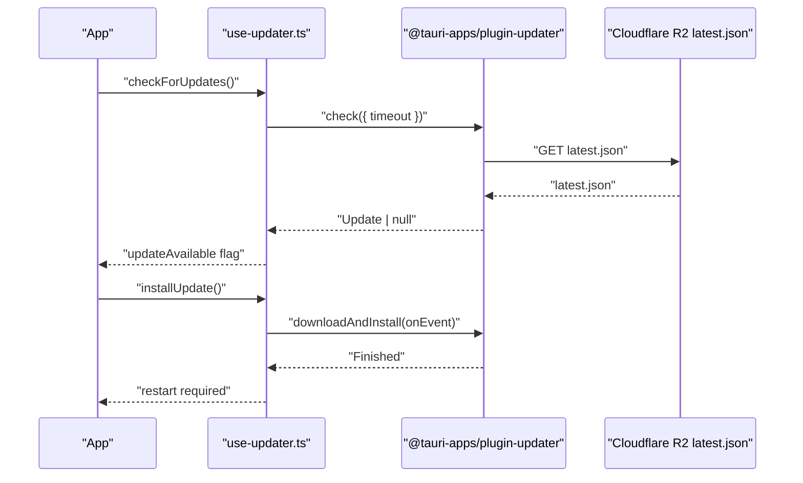
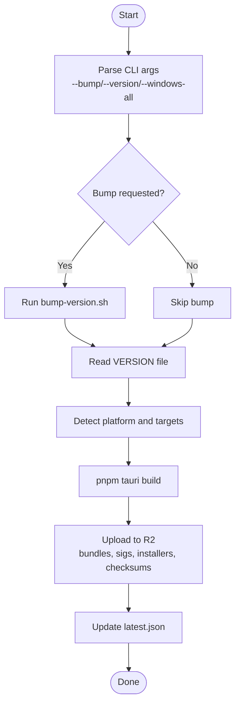
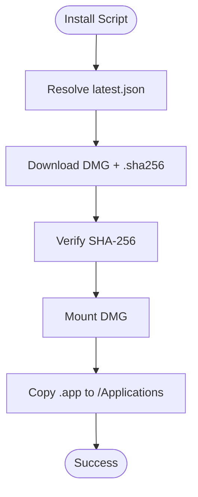
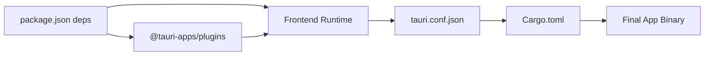

# Build and Deployment

<cite>
**Referenced Files in This Document**
- [package.json](file://package.json)
- [vite.config.ts](file://vite.config.ts)
- [tsconfig.json](file://tsconfig.json)
- [tsconfig.node.json](file://tsconfig.node.json)
- [src/main.tsx](file://src/main.tsx)
- [src/app.tsx](file://src/app.tsx)
- [src-tauri/tauri.conf.json](file://src-tauri/tauri.conf.json)
- [src-tauri/Cargo.toml](file://src-tauri/Cargo.toml)
- [src-tauri/build.rs](file://src-tauri/build.rs)
- [scripts/build.sh](file://scripts/build.sh)
- [scripts/deploy.sh](file://scripts/deploy.sh)
- [scripts/bump-version.sh](file://scripts/bump-version.sh)
- [scripts/install.sh](file://scripts/install.sh)
- [docs/updater-setup.md](file://docs/updater-setup.md)
- [src/hooks/use-updater.ts](file://src/hooks/use-updater.ts)
</cite>

## Table of Contents
1. [Introduction](#introduction)
2. [Project Structure](#project-structure)
3. [Core Components](#core-components)
4. [Architecture Overview](#architecture-overview)
5. [Detailed Component Analysis](#detailed-component-analysis)
6. [Dependency Analysis](#dependency-analysis)
7. [Performance Considerations](#performance-considerations)
8. [Troubleshooting Guide](#troubleshooting-guide)
9. [Conclusion](#conclusion)
10. [Appendices](#appendices)

## Introduction
This document explains AppRecon’s build and deployment processes end-to-end. It covers frontend build configuration (Vite, TypeScript), Tauri packaging and auto-updater setup, platform-specific builds, and the release pipeline including continuous integration, release management, and distribution via Cloudflare R2. Practical examples demonstrate local builds, development deployments, and production releases. It also includes guidance on optimization, bundle size reduction, performance profiling, platform-specific considerations, troubleshooting, and best practices for versioning and release automation.

## Project Structure
AppRecon is a Tauri 2 desktop application with a React + TypeScript frontend and a Rust backend. The build pipeline integrates Vite for frontend bundling, Tauri CLI for packaging, and a set of Bash scripts for versioning, cross-platform builds, and uploading artifacts to Cloudflare R2.

**Diagram sources**
- [package.json:1-90](file://package.json#L1-L90)
- [vite.config.ts:1-41](file://vite.config.ts#L1-L41)
- [tsconfig.json:1-37](file://tsconfig.json#L1-L37)
- [src/main.tsx:1-72](file://src/main.tsx#L1-L72)
- [src/app.tsx:1-35](file://src/app.tsx#L1-L35)
- [src-tauri/tauri.conf.json:1-48](file://src-tauri/tauri.conf.json#L1-L48)
- [src-tauri/Cargo.toml:1-62](file://src-tauri/Cargo.toml#L1-L62)
- [src-tauri/build.rs:1-4](file://src-tauri/build.rs#L1-L4)
- [scripts/build.sh:1-411](file://scripts/build.sh#L1-L411)
- [scripts/deploy.sh:1-38](file://scripts/deploy.sh#L1-L38)
- [scripts/bump-version.sh:1-40](file://scripts/bump-version.sh#L1-L40)
- [scripts/install.sh:1-99](file://scripts/install.sh#L1-L99)

**Section sources**
- [package.json:1-90](file://package.json#L1-L90)
- [vite.config.ts:1-41](file://vite.config.ts#L1-L41)
- [tsconfig.json:1-37](file://tsconfig.json#L1-L37)
- [src/main.tsx:1-72](file://src/main.tsx#L1-L72)
- [src/app.tsx:1-35](file://src/app.tsx#L1-L35)
- [src-tauri/tauri.conf.json:1-48](file://src-tauri/tauri.conf.json#L1-L48)
- [src-tauri/Cargo.toml:1-62](file://src-tauri/Cargo.toml#L1-L62)
- [src-tauri/build.rs:1-4](file://src-tauri/build.rs#L1-L4)
- [scripts/build.sh:1-411](file://scripts/build.sh#L1-L411)
- [scripts/deploy.sh:1-38](file://scripts/deploy.sh#L1-L38)
- [scripts/bump-version.sh:1-40](file://scripts/bump-version.sh#L1-L40)
- [scripts/install.sh:1-99](file://scripts/install.sh#L1-L99)

## Core Components
- Frontend build and dev server powered by Vite with React plugin and TypeScript support.
- TypeScript configuration optimized for bundler resolution and incremental builds.
- Tauri configuration orchestrating dev/build URLs, bundling targets, and the updater plugin.
- Rust backend with Tauri 2 crates and platform-specific dependencies.
- Build scripts for versioning, cross-platform packaging, and uploading artifacts to Cloudflare R2.
- Installer script for macOS distribution.

Key responsibilities:
- package.json: defines scripts (dev, build, preview, deploy), runtime and dev dependencies.
- vite.config.ts: sets up React plugin, server, path aliases, and Rollup chunk splitting.
- tsconfig.json/tsconfig.node.json: configure TypeScript for frontend and Vite config.
- src/main.tsx/src/app.tsx: React entry and routing.
- src-tauri/tauri.conf.json: Tauri app metadata, dev/build URLs, bundling, updater endpoints, and icon assets.
- src-tauri/Cargo.toml: Rust crate dependencies and features.
- scripts/build.sh: orchestrates version bump, platform detection, Tauri builds, and uploads.
- scripts/deploy.sh: CLI entrypoint to build.sh.
- scripts/bump-version.sh: updates versions across package.json, Cargo.toml, and tauri.conf.json.
- scripts/install.sh: macOS installer that fetches latest.json, validates checksums, and installs the app.
- docs/updater-setup.md: Cloudflare R2 setup and updater configuration guide.
- src/hooks/use-updater.ts: frontend updater integration using @tauri-apps/plugin-updater.

**Section sources**
- [package.json:6-12](file://package.json#L6-L12)
- [vite.config.ts:5-40](file://vite.config.ts#L5-L40)
- [tsconfig.json:2-26](file://tsconfig.json#L2-L26)
- [tsconfig.node.json:1-11](file://tsconfig.node.json#L1-L11)
- [src/main.tsx:1-72](file://src/main.tsx#L1-L72)
- [src/app.tsx:1-35](file://src/app.tsx#L1-L35)
- [src-tauri/tauri.conf.json:1-48](file://src-tauri/tauri.conf.json#L1-L48)
- [src-tauri/Cargo.toml:1-62](file://src-tauri/Cargo.toml#L1-L62)
- [scripts/build.sh:1-411](file://scripts/build.sh#L1-L411)
- [scripts/deploy.sh:1-38](file://scripts/deploy.sh#L1-L38)
- [scripts/bump-version.sh:1-40](file://scripts/bump-version.sh#L1-L40)
- [scripts/install.sh:1-99](file://scripts/install.sh#L1-L99)
- [docs/updater-setup.md:1-152](file://docs/updater-setup.md#L1-L152)
- [src/hooks/use-updater.ts:1-119](file://src/hooks/use-updater.ts#L1-L119)

## Architecture Overview
The build and deployment pipeline connects the frontend and backend, then packages and distributes the app across platforms with an auto-updater.

**Diagram sources**
- [package.json:7-12](file://package.json#L7-L12)
- [vite.config.ts:8-15](file://vite.config.ts#L8-L15)
- [scripts/build.sh:245-250](file://scripts/build.sh#L245-L250)
- [scripts/build.sh:374-410](file://scripts/build.sh#L374-L410)
- [src-tauri/tauri.conf.json:6-11](file://src-tauri/tauri.conf.json#L6-L11)
- [src/hooks/use-updater.ts:24-92](file://src/hooks/use-updater.ts#L24-L92)
- [docs/updater-setup.md:42-63](file://docs/updater-setup.md#L42-L63)

## Detailed Component Analysis

### Frontend Build and Asset Management (Vite + TypeScript)
- Vite setup:
  - React plugin enabled.
  - Server configured to listen on 127.0.0.1:1420 with strict port and ignored watch patterns.
  - Path alias @ resolves to src.
  - Chunk splitting groups large vendor libraries into dedicated chunks (e.g., recharts, monaco-editor, jspdf, html2canvas, tauri, lucide-react, hugeicons).
  - Warning threshold increased to accommodate larger bundles.
- TypeScript:
  - Bundler module resolution for Vite.
  - JSX transform set to react-jsx.
  - Strict null checks enabled.
  - Paths mapped to @/* for clean imports.

Practical implications:
- Faster rebuilds via chunk splitting.
- Predictable imports with path aliases.
- Incremental builds improve developer experience.

**Section sources**
- [vite.config.ts:5-40](file://vite.config.ts#L5-L40)
- [tsconfig.json:2-26](file://tsconfig.json#L2-L26)
- [tsconfig.node.json:1-11](file://tsconfig.node.json#L1-L11)
- [package.json:81-88](file://package.json#L81-L88)

### Tauri Packaging and Auto-Updater
- Tauri configuration:
  - Dev URL points to Vite dev server.
  - Before build command runs the frontend build.
  - Frontend dist path configured for Vite output.
  - Bundling targets set to all supported platforms.
  - Updater plugin configured with public key and endpoint(s).
  - Icons included for multiple formats.
- Rust dependencies:
  - Tauri 2 with macOS private API enabled.
  - Platform-specific updater plugin enabled.
  - Additional crates for networking, crypto, and SQLite.
- Updater integration:
  - Frontend hook checks for updates and downloads/installation events.
  - Uses @tauri-apps/plugin-updater APIs.

**Diagram sources**
- [src/hooks/use-updater.ts:24-92](file://src/hooks/use-updater.ts#L24-L92)
- [src-tauri/tauri.conf.json:40-46](file://src-tauri/tauri.conf.json#L40-L46)
- [docs/updater-setup.md:87-98](file://docs/updater-setup.md#L87-L98)

**Section sources**
- [src-tauri/tauri.conf.json:1-48](file://src-tauri/tauri.conf.json#L1-L48)
- [src-tauri/Cargo.toml:11-62](file://src-tauri/Cargo.toml#L11-L62)
- [src/hooks/use-updater.ts:1-119](file://src/hooks/use-updater.ts#L1-L119)
- [docs/updater-setup.md:1-152](file://docs/updater-setup.md#L1-L152)

### Versioning and Release Automation
- Version sources:
  - Frontend version in package.json.
  - Tauri version in tauri.conf.json.
  - Rust crate version in Cargo.toml.
- Version bump script:
  - Supports auto-incrementing patch or explicit version.
  - Updates all three version files consistently.
- Build script:
  - Accepts flags to bump version, force build, or build all Windows targets.
  - Detects platform and selects appropriate bundle/installer artifacts.
  - Uploads bundles, signatures, installers, and checksums to Cloudflare R2.
  - Updates latest.json per platform.

**Diagram sources**
- [scripts/build.sh:17-65](file://scripts/build.sh#L17-L65)
- [scripts/build.sh:89-95](file://scripts/build.sh#L89-L95)
- [scripts/build.sh:128-156](file://scripts/build.sh#L128-L156)
- [scripts/build.sh:245-250](file://scripts/build.sh#L245-L250)
- [scripts/build.sh:374-410](file://scripts/build.sh#L374-L410)

**Section sources**
- [scripts/bump-version.sh:1-40](file://scripts/bump-version.sh#L1-L40)
- [scripts/build.sh:1-411](file://scripts/build.sh#L1-L411)

### Distribution and Installer (macOS)
- macOS installer script:
  - Resolves latest.json from base URL.
  - Downloads DMG and checksum, verifies SHA-256.
  - Mounts DMG and copies .app to /Applications (with sudo if needed).
  - Provides feedback and exit status.

**Diagram sources**
- [scripts/install.sh:46-99](file://scripts/install.sh#L46-L99)

**Section sources**
- [scripts/install.sh:1-99](file://scripts/install.sh#L1-L99)

### Platform-Specific Builds and Considerations
- Windows:
  - Cross-compilation targets supported via build.sh for x86_64, i686, and aarch64 PC MSVC.
  - NSIS installer bundles generated per target.
- macOS:
  - DMG bundles and .app archives produced; install script handles mounting and copying.
- Linux:
  - AppImage bundles produced; installers are AppImage files.

Build script logic:
- Detects platform and sets bundle/installer directories and extensions.
- Skips rebuild if artifacts exist and inputs are not newer.
- Supports forced rebuilds and Windows-all builds.

**Section sources**
- [scripts/build.sh:104-156](file://scripts/build.sh#L104-L156)
- [scripts/build.sh:173-191](file://scripts/build.sh#L173-L191)
- [scripts/build.sh:198-212](file://scripts/build.sh#L198-L212)

## Dependency Analysis
- Frontend dependencies include React 19, Tauri React APIs, Radix UI, shadcn/ui components, and charting/editing libraries. These influence bundle size and chunking strategy.
- Tauri plugins enable filesystem, dialogs, process execution, clipboard, and updater functionality.
- Rust dependencies cover HTTP stack, TLS, cryptography, databases, and async runtime.

**Diagram sources**
- [package.json:14-80](file://package.json#L14-L80)
- [src-tauri/tauri.conf.json:39-46](file://src-tauri/tauri.conf.json#L39-L46)
- [src-tauri/Cargo.toml:11-62](file://src-tauri/Cargo.toml#L11-L62)

**Section sources**
- [package.json:14-80](file://package.json#L14-L80)
- [src-tauri/Cargo.toml:11-62](file://src-tauri/Cargo.toml#L11-L62)

## Performance Considerations
- Bundle size and chunking:
  - Manual chunking groups heavy vendor libraries to reduce initial load and improve caching.
  - Consider lazy loading routes and components to further split bundles.
- TypeScript configuration:
  - Bundler module resolution and incremental builds speed up development.
  - Strict null checks improve reliability but can increase compile time slightly.
- Network and updater:
  - Updater timeouts and event callbacks provide responsive UX during downloads.
  - Keep endpoints secure (HTTPS) and ensure valid certificates for production.

[No sources needed since this section provides general guidance]

## Troubleshooting Guide
Common issues and resolutions:
- Missing environment variables for upload:
  - Ensure R2_ENDPOINT, R2_BUCKET, AWS credentials, UPDATER_BASE_URL, and TAURI_SIGNING_PRIVATE_KEY are set before running the build script.
- Signature verification failures:
  - Confirm the private key path is correct and matches the public key configured in tauri.conf.json.
- Platform mismatch or unsupported architecture:
  - On macOS, ensure the DMG architecture matches uname -m (aarch64/x86_64).
- Updater endpoint errors:
  - Verify the endpoint URL and that latest.json is publicly accessible.
  - For local testing, consider the insecure transport note in the updater setup guide.
- Dependency conflicts:
  - Clear node_modules and reinstall dependencies if builds fail unexpectedly.
  - Ensure Rust toolchains and targets are installed for cross-compilation.

**Section sources**
- [scripts/build.sh:254-257](file://scripts/build.sh#L254-L257)
- [docs/updater-setup.md:42-63](file://docs/updater-setup.md#L42-L63)
- [scripts/install.sh:17-21](file://scripts/install.sh#L17-L21)
- [src/hooks/use-updater.ts:39-50](file://src/hooks/use-updater.ts#L39-L50)

## Conclusion
AppRecon’s build and deployment pipeline integrates Vite, Tauri, and Cloudflare R2 to deliver a robust, cross-platform desktop application with automated updates. The scripts streamline versioning, packaging, and distribution, while the updater ensures seamless upgrades. Following the best practices and troubleshooting steps outlined here will help maintain reliable builds and smooth releases across Windows, macOS, and Linux.

[No sources needed since this section summarizes without analyzing specific files]

## Appendices

### Practical Examples

- Local development build:
  - Start the dev server and frontend build:
    - Run the dev script to launch Vite on port 1420.
    - Tauri will use the dev URL for the frontend during development.
  - Example paths:
    - [package.json:7](file://package.json#L7)
    - [vite.config.ts:8-15](file://vite.config.ts#L8-L15)
    - [src-tauri/tauri.conf.json:7-10](file://src-tauri/tauri.conf.json#L7-L10)

- Development deployment (preview):
  - Build the frontend and preview locally:
    - Run the build script to produce dist assets.
    - Use the preview script to test the production build locally.
  - Example paths:
    - [package.json:9](file://package.json#L9)
    - [scripts/build.sh:245-249](file://scripts/build.sh#L245-L249)

- Production release:
  - Auto-bump version and build/upload:
    - Use the deploy script with no arguments to auto-increment patch version and build/upload.
  - Example paths:
    - [scripts/deploy.sh:33-37](file://scripts/deploy.sh#L33-L37)
    - [scripts/build.sh:334-344](file://scripts/build.sh#L334-L344)

- Platform-specific builds:
  - Windows all targets:
    - Run the build script with the --windows-all flag on a Windows release machine.
  - Example paths:
    - [scripts/build.sh:73-85](file://scripts/build.sh#L73-L85)
    - [scripts/build.sh:198-212](file://scripts/build.sh#L198-L212)

- Updater configuration:
  - Configure endpoints and public key in tauri.conf.json and ensure Cloudflare R2 is set up.
  - Example paths:
    - [src-tauri/tauri.conf.json:40-46](file://src-tauri/tauri.conf.json#L40-L46)
    - [docs/updater-setup.md:66-84](file://docs/updater-setup.md#L66-L84)

### Best Practices
- Version management:
  - Use the bump-version script to keep versions synchronized across package.json, Cargo.toml, and tauri.conf.json.
- Changelog generation:
  - Export UPDATER_NOTES to include release notes in the latest.json update.
- Release automation:
  - Integrate the build script into CI to automate builds and uploads per platform.
- Security:
  - Always use HTTPS endpoints for the updater and valid SSL certificates.
  - Store secrets securely and avoid committing sensitive keys.

**Section sources**
- [scripts/bump-version.sh:19-39](file://scripts/bump-version.sh#L19-L39)
- [scripts/build.sh:291-321](file://scripts/build.sh#L291-L321)
- [docs/updater-setup.md:147-152](file://docs/updater-setup.md#L147-L152)