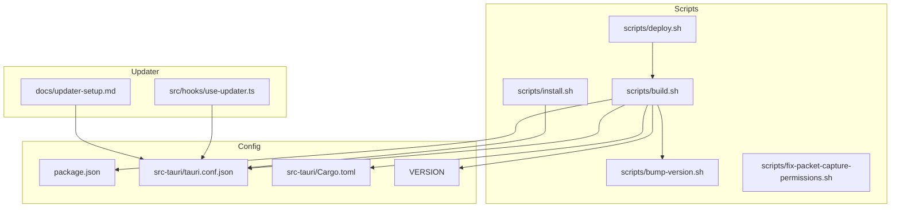
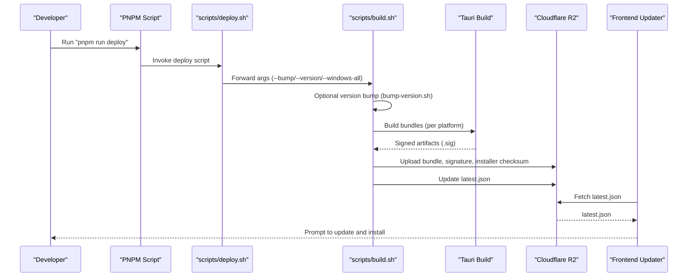
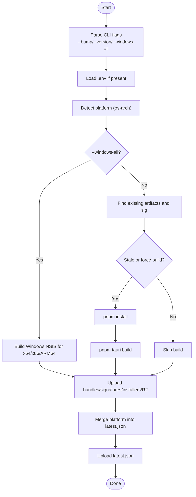
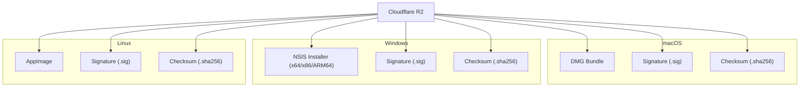
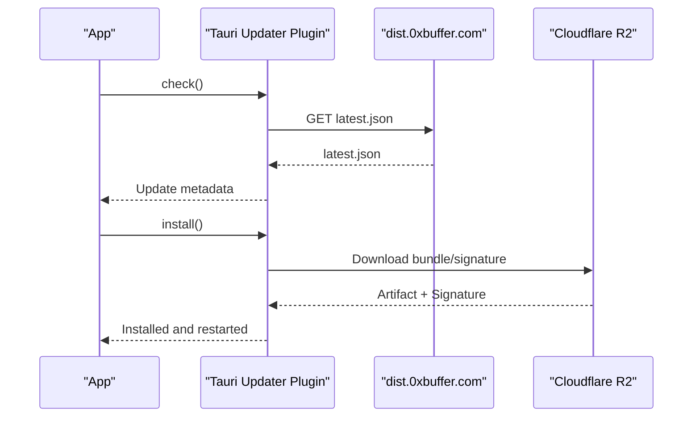
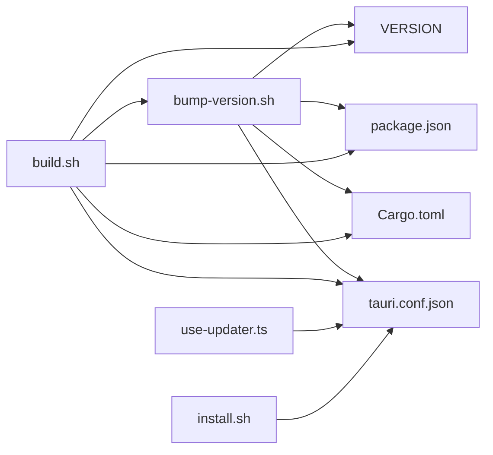

# Deployment Pipeline

<cite>
**Referenced Files in This Document**
- [build.sh](file://scripts/build.sh)
- [deploy.sh](file://scripts/deploy.sh)
- [bump-version.sh](file://scripts/bump-version.sh)
- [install.sh](file://scripts/install.sh)
- [fix-packet-capture-permissions.sh](file://scripts/fix-packet-capture-permissions.sh)
- [package.json](file://package.json)
- [tauri.conf.json](file://src-tauri/tauri.conf.json)
- [Cargo.toml](file://src-tauri/Cargo.toml)
- [VERSION](file://VERSION)
- [use-updater.ts](file://src/hooks/use-updater.ts)
- [updater-setup.md](file://docs/updater-setup.md)
</cite>

## Table of Contents
1. [Introduction](#introduction)
2. [Project Structure](#project-structure)
3. [Core Components](#core-components)
4. [Architecture Overview](#architecture-overview)
5. [Detailed Component Analysis](#detailed-component-analysis)
6. [Dependency Analysis](#dependency-analysis)
7. [Performance Considerations](#performance-considerations)
8. [Troubleshooting Guide](#troubleshooting-guide)
9. [Conclusion](#conclusion)
10. [Appendices](#appendices)

## Introduction
This document explains AppRecon’s deployment pipeline and release management. It covers automated build and distribution scripts, version management, artifact preparation, platform-specific deployment strategies, updater integration, and operational procedures for manual deployments, rollbacks, and emergency fixes. It also addresses distribution channels, update mechanisms, and troubleshooting for common deployment issues.

## Project Structure
The deployment pipeline centers around a small set of scripts and configuration files:
- scripts/build.sh: Orchestrates version bumping, platform detection, Tauri builds, signing, and uploads to Cloudflare R2.
- scripts/deploy.sh: CLI entry point for releases via PNPM, forwarding arguments to build.sh.
- scripts/bump-version.sh: Updates VERSION, package.json, Cargo.toml, and tauri.conf.json.
- scripts/install.sh: macOS installer script that fetches latest.json, validates checksums, mounts DMG, and installs the app.
- scripts/fix-packet-capture-permissions.sh: Helper to grant packet capture device permissions on macOS.
- src-tauri/tauri.conf.json: Tauri configuration including updater endpoint and public key.
- src-tauri/Cargo.toml: Rust crate version and updater plugin declaration.
- VERSION: Current semantic version.
- src/hooks/use-updater.ts: Frontend hook integrating Tauri updater plugin.
- docs/updater-setup.md: Cloudflare R2 setup and verification steps.

**Diagram sources**
- [build.sh](file://scripts/build.sh)
- [deploy.sh](file://scripts/deploy.sh)
- [bump-version.sh](file://scripts/bump-version.sh)
- [install.sh](file://scripts/install.sh)
- [package.json](file://package.json)
- [tauri.conf.json](file://src-tauri/tauri.conf.json)
- [Cargo.toml](file://src-tauri/Cargo.toml)
- [VERSION](file://VERSION)
- [use-updater.ts](file://src/hooks/use-updater.ts)
- [updater-setup.md](file://docs/updater-setup.md)

**Section sources**
- [build.sh](file://scripts/build.sh)
- [deploy.sh](file://scripts/deploy.sh)
- [bump-version.sh](file://scripts/bump-version.sh)
- [install.sh](file://scripts/install.sh)
- [package.json](file://package.json)
- [tauri.conf.json](file://src-tauri/tauri.conf.json)
- [Cargo.toml](file://src-tauri/Cargo.toml)
- [VERSION](file://VERSION)
- [use-updater.ts](file://src/hooks/use-updater.ts)
- [updater-setup.md](file://docs/updater-setup.md)

## Core Components
- Version Management
  - VERSION file holds the current semantic version.
  - bump-version.sh updates VERSION, package.json, Cargo.toml, and tauri.conf.json.
  - build.sh reads VERSION and sets pub_date for artifacts.
- Build and Distribution
  - build.sh detects platform, builds Tauri bundles, signs artifacts, and uploads to Cloudflare R2.
  - deploy.sh is the PNPM entry point for releases.
- Updater Integration
  - tauri.conf.json configures the updater plugin with endpoint and public key.
  - use-updater.ts integrates update checks and installation in the frontend.
  - install.sh performs user-facing macOS installation and checksum verification.
- Platform-Specific Helpers
  - fix-packet-capture-permissions.sh assists with macOS BPF device permissions.

**Section sources**
- [bump-version.sh](file://scripts/bump-version.sh)
- [build.sh](file://scripts/build.sh)
- [deploy.sh](file://scripts/deploy.sh)
- [tauri.conf.json](file://src-tauri/tauri.conf.json)
- [use-updater.ts](file://src/hooks/use-updater.ts)
- [install.sh](file://scripts/install.sh)
- [fix-packet-capture-permissions.sh](file://scripts/fix-packet-capture-permissions.sh)

## Architecture Overview
The release pipeline follows a deterministic flow:
- Version bump (optional) -> Build per platform -> Sign artifacts -> Upload to Cloudflare R2 -> Update latest.json -> Distribute via updater.

**Diagram sources**
- [deploy.sh](file://scripts/deploy.sh)
- [build.sh](file://scripts/build.sh)
- [tauri.conf.json](file://src-tauri/tauri.conf.json)
- [use-updater.ts](file://src/hooks/use-updater.ts)

## Detailed Component Analysis

### Automated Build Script: build.sh
Responsibilities:
- Parse CLI flags for version bumping, explicit version, and Windows multi-target builds.
- Load environment variables from .env if present.
- Detect platform and configure bundle/installer paths.
- Optionally build Windows for x64, x86, and ARM64 on a Windows host.
- Determine whether to rebuild based on existing artifacts and freshness of inputs.
- Install dependencies, run Tauri build, and upload artifacts to Cloudflare R2.
- Generate and upload checksums, update latest.json, and publish artifacts.

Key behaviors:
- Platform detection supports macOS, Linux, and Windows.
- Upload uses aws s3 cp against R2_ENDPOINT with R2_BUCKET.
- latest.json is downloaded, merged per platform, and re-uploaded.
- Installer checksums are generated and uploaded alongside installers.

**Diagram sources**
- [build.sh](file://scripts/build.sh)

**Section sources**
- [build.sh](file://scripts/build.sh)

### Release Process: Version Management and Changelog Preparation
- Version Management
  - VERSION file is the single source of truth.
  - bump-version.sh increments patch by default or accepts an explicit version.
  - Updates package.json, Cargo.toml, and tauri.conf.json to keep versions synchronized.
- Changelog Generation
  - The repository does not include an automated changelog generator script.
  - To prepare a changelog, maintain a separate CHANGELOG.md and update it during release preparation.
  - Export UPDATER_NOTES in the environment before running the build to include release notes in latest.json.
- Artifact Preparation
  - build.sh generates signed artifacts (.sig) and uploads bundles, signatures, and installer checksums.
  - latest.json is updated per platform and re-uploaded.

Practical example:
- To release a patch: run the deploy script; it bumps patch automatically and builds/uploaded artifacts.
- To release a specific version: pass --version <semver> to the deploy script; it forwards to build.sh.

**Section sources**
- [bump-version.sh](file://scripts/bump-version.sh)
- [VERSION](file://VERSION)
- [build.sh](file://scripts/build.sh)

### Deployment Strategies by Platform
- macOS
  - Tauri builds DMG installers; build.sh uploads DMG, signature, and optional checksum.
  - install.sh downloads latest.json, verifies checksum, mounts DMG, and copies .app to /Applications.
  - Updater endpoint configured in tauri.conf.json points to dist.0xbuffer.com.
- Windows
  - build.sh supports multi-target builds for x64, x86, and ARM64 via NSIS bundles.
  - Windows artifacts are uploaded to R2 with per-platform entries in latest.json.
- Linux
  - Tauri builds AppImage; build.sh uploads AppImage, signature, and checksum.
  - Updater configuration remains consistent with tauri.conf.json.

**Diagram sources**
- [build.sh](file://scripts/build.sh)
- [tauri.conf.json](file://src-tauri/tauri.conf.json)

**Section sources**
- [build.sh](file://scripts/build.sh)
- [install.sh](file://scripts/install.sh)
- [tauri.conf.json](file://src-tauri/tauri.conf.json)

### Continuous Integration and Quality Gates
- CI Setup
  - The repository does not include CI configuration files (e.g., GitHub Actions YAML).
  - Recommended: Add CI jobs to run dependency installation, builds per platform, signing, and uploader publication.
- Automated Testing
  - No dedicated test runner is invoked by the build scripts.
  - Recommended: Integrate unit/integration tests in CI before build and upload stages.
- Quality Gates
  - Enforce checksum verification and signature presence before publishing artifacts.
  - Gate deployment on successful build and upload to R2.

[No sources needed since this section provides general guidance]

### Manual Deployment Procedures
- Full Release
  - Run: pnpm run deploy
  - Behavior: auto-bumps patch, builds, signs, uploads, updates latest.json.
- Specific Version
  - Run: pnpm run deploy -- --version 2026.1.1
  - Behavior: bumps to exact version, then proceeds as above.
- Windows Multi-Arch
  - Run: pnpm run deploy -- --windows-all
  - Behavior: builds NSIS installers for x64, x86, and ARM64 on a Windows host.

Rollback Procedure:
- If a release is problematic, publish a new version that supersedes the faulty one.
- Users’ updater will fetch the latest version from latest.json; there is no in-app downgrade mechanism.
- Emergency Fix:
  - Prepare a hotfix version, build, sign, and upload to R2.
  - Ensure latest.json reflects the corrected version and push release notes via UPDATER_NOTES.

**Section sources**
- [deploy.sh](file://scripts/deploy.sh)
- [build.sh](file://scripts/build.sh)

### Distribution Channels and Update Mechanisms
- Distribution Channel
  - Cloudflare R2 bucket receives bundles, signatures, checksums, and latest.json.
- Update Mechanism
  - Frontend updater checks the configured endpoint and compares versions.
  - On update, the app downloads and installs the new version automatically.
- User Notification
  - use-updater.ts surfaces messages and errors during update checks and installations.

**Diagram sources**
- [use-updater.ts](file://src/hooks/use-updater.ts)
- [tauri.conf.json](file://src-tauri/tauri.conf.json)

**Section sources**
- [use-updater.ts](file://src/hooks/use-updater.ts)
- [tauri.conf.json](file://src-tauri/tauri.conf.json)
- [updater-setup.md](file://docs/updater-setup.md)

### Practical Examples
- Manual Deployment Example
  - Build and upload a specific version: scripts/deploy.sh -- --version 2026.1.1
- Rollback Example
  - Publish a new version superseding the faulty one; users receive the newer version automatically.
- Emergency Fix Example
  - Export UPDATER_NOTES with release notes, then run the deploy script to republish latest.json.

**Section sources**
- [deploy.sh](file://scripts/deploy.sh)
- [build.sh](file://scripts/build.sh)

## Dependency Analysis
- Scripts depend on:
  - Node.js ecosystem for version updates and JSON manipulation.
  - PNPM for installing dependencies and invoking Tauri build.
  - Tauri CLI for bundling and generating updater artifacts.
  - Cloudflare R2 via aws s3 cp with configured credentials.
- Frontend Updater depends on:
  - Tauri updater plugin configuration in tauri.conf.json.
  - Network accessibility to the configured endpoint.

**Diagram sources**
- [bump-version.sh](file://scripts/bump-version.sh)
- [build.sh](file://scripts/build.sh)
- [package.json](file://package.json)
- [Cargo.toml](file://src-tauri/Cargo.toml)
- [tauri.conf.json](file://src-tauri/tauri.conf.json)
- [VERSION](file://VERSION)
- [use-updater.ts](file://src/hooks/use-updater.ts)
- [install.sh](file://scripts/install.sh)

**Section sources**
- [bump-version.sh](file://scripts/bump-version.sh)
- [build.sh](file://scripts/build.sh)
- [package.json](file://package.json)
- [Cargo.toml](file://src-tauri/Cargo.toml)
- [tauri.conf.json](file://src-tauri/tauri.conf.json)
- [VERSION](file://VERSION)
- [use-updater.ts](file://src/hooks/use-updater.ts)
- [install.sh](file://scripts/install.sh)

## Performance Considerations
- Minimize redundant builds by leveraging stale-input detection and existing artifact checks.
- Parallelize multi-architecture Windows builds on separate hosts to reduce total release time.
- Keep dependency caches warm in CI to avoid repeated pnpm installs.

[No sources needed since this section provides general guidance]

## Troubleshooting Guide
Common issues and resolutions:
- Missing Cloudflare R2 Credentials
  - Symptom: Upload skipped due to missing R2_ENDPOINT or R2_BUCKET.
  - Resolution: Export R2_ENDPOINT, R2_BUCKET, AWS_ACCESS_KEY_ID, AWS_SECRET_ACCESS_KEY, and optionally UPDATER_BASE_URL.
- Missing aws CLI
  - Symptom: Upload fails because aws is not available.
  - Resolution: Install awscli and ensure it is on PATH.
- Missing Signing Key
  - Symptom: Build fails due to missing TAURI_SIGNING_PRIVATE_KEY.
  - Resolution: Provide the signing key path in the environment variable.
- Unsupported Platform
  - Symptom: Platform detection fails or unsupported OS/Arch reported.
  - Resolution: Run builds on supported platforms (macOS, Linux, Windows).
- macOS Permissions for Packet Capture
  - Symptom: Cannot capture packets on macOS.
  - Resolution: Run scripts/fix-packet-capture-permissions.sh to set device permissions.
- Updater Fails to Fetch latest.json
  - Symptom: Update check fails or shows errors.
  - Resolution: Verify UPDATER_BASE_URL and endpoint accessibility; confirm tauri.conf.json endpoints configuration.

**Section sources**
- [build.sh](file://scripts/build.sh)
- [install.sh](file://scripts/install.sh)
- [fix-packet-capture-permissions.sh](file://scripts/fix-packet-capture-permissions.sh)
- [tauri.conf.json](file://src-tauri/tauri.conf.json)
- [updater-setup.md](file://docs/updater-setup.md)

## Conclusion
AppRecon’s deployment pipeline is centered on scripts that manage versioning, build, sign, and distribute platform-specific artifacts to Cloudflare R2, while the Tauri updater plugin ensures seamless user updates. By following the documented procedures and using the included scripts, teams can reliably release updates across macOS, Windows, and Linux with verifiable integrity and minimal friction.

[No sources needed since this section summarizes without analyzing specific files]

## Appendices

### Appendix A: Environment Variables Reference
- R2_ENDPOINT: Cloudflare R2 S3-compatible endpoint.
- R2_BUCKET: Target bucket name.
- AWS_ACCESS_KEY_ID / AWS_SECRET_ACCESS_KEY: R2 API credentials.
- UPDATER_BASE_URL: Public base URL for distribution (e.g., custom domain or r2.dev).
- TAURI_SIGNING_PRIVATE_KEY: Path to private key for signing updater artifacts.
- UPDATER_NOTES: Optional release notes injected into latest.json.

**Section sources**
- [updater-setup.md](file://docs/updater-setup.md)
- [build.sh](file://scripts/build.sh)