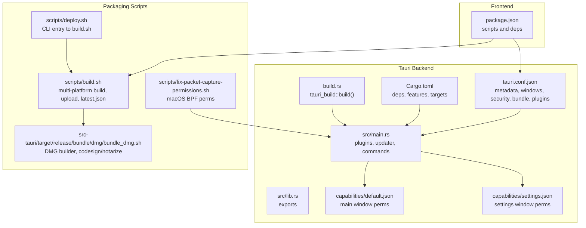
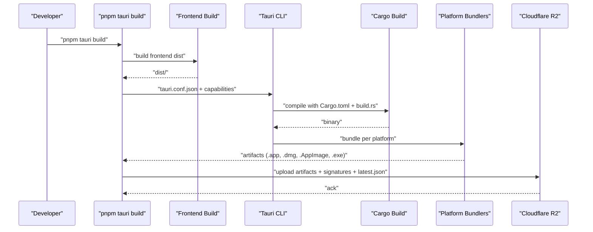
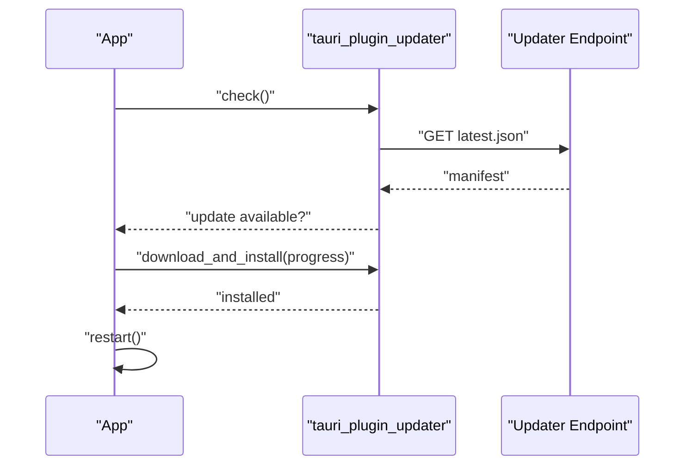
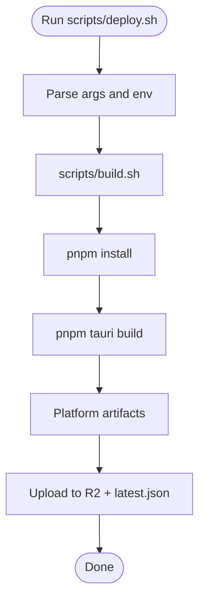
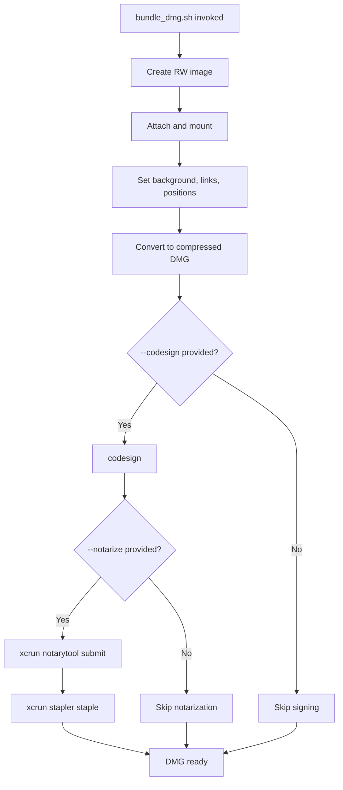
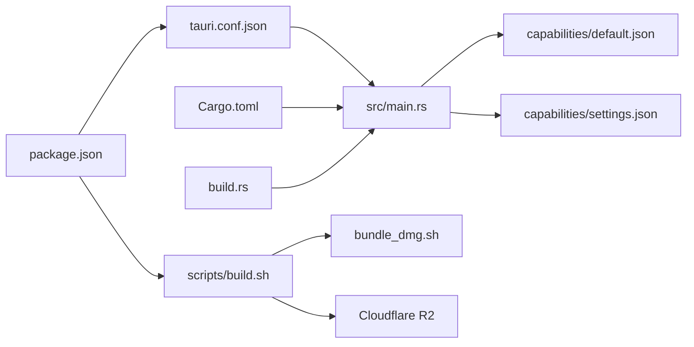

# Tauri Packaging

<cite>
**Referenced Files in This Document**
- [tauri.conf.json](file://src-tauri/tauri.conf.json)
- [Cargo.toml](file://src-tauri/Cargo.toml)
- [build.rs](file://src-tauri/build.rs)
- [default.json](file://src-tauri/capabilities/default.json)
- [settings.json](file://src-tauri/capabilities/settings.json)
- [main.rs](file://src-tauri/src/main.rs)
- [lib.rs](file://src-tauri/src/lib.rs)
- [package.json](file://package.json)
- [build.sh](file://scripts/build.sh)
- [deploy.sh](file://scripts/deploy.sh)
- [fix-packet-capture-permissions.sh](file://scripts/fix-packet-capture-permissions.sh)
- [bundle_dmg.sh](file://src-tauri/target/release/bundle/dmg/bundle_dmg.sh)
</cite>

## Table of Contents
1. [Introduction](#introduction)
2. [Project Structure](#project-structure)
3. [Core Components](#core-components)
4. [Architecture Overview](#architecture-overview)
5. [Detailed Component Analysis](#detailed-component-analysis)
6. [Dependency Analysis](#dependency-analysis)
7. [Performance Considerations](#performance-considerations)
8. [Troubleshooting Guide](#troubleshooting-guide)
9. [Conclusion](#conclusion)
10. [Appendices](#appendices)

## Introduction
This document explains AppRecon’s Tauri packaging process end-to-end. It covers configuration of tauri.conf.json (product metadata, window settings, security policies, and capability definitions), Cargo.toml setup (dependencies, features, and platform-specific toggles), the build.rs script for custom build logic, capability management for Tauri plugins and system access permissions, and practical examples for platform-specific packaging, icon configuration, and metadata setup. It also addresses signing and notarization for macOS, distribution preparation via Cloudflare R2, and troubleshooting packaging errors, permission issues, and platform compatibility problems.

## Project Structure
The packaging pipeline spans frontend and backend configuration, Tauri runtime initialization, capability definitions, and automated build and upload scripts.

**Diagram sources**
- [tauri.conf.json](file://src-tauri/tauri.conf.json)
- [Cargo.toml](file://src-tauri/Cargo.toml)
- [build.rs](file://src-tauri/build.rs)
- [main.rs](file://src-tauri/src/main.rs)
- [lib.rs](file://src-tauri/src/lib.rs)
- [default.json](file://src-tauri/capabilities/default.json)
- [settings.json](file://src-tauri/capabilities/settings.json)
- [build.sh](file://scripts/build.sh)
- [deploy.sh](file://scripts/deploy.sh)
- [fix-packet-capture-permissions.sh](file://scripts/fix-packet-capture-permissions.sh)
- [bundle_dmg.sh](file://src-tauri/target/release/bundle/dmg/bundle_dmg.sh)

**Section sources**
- [tauri.conf.json](file://src-tauri/tauri.conf.json)
- [Cargo.toml](file://src-tauri/Cargo.toml)
- [build.rs](file://src-tauri/build.rs)
- [main.rs](file://src-tauri/src/main.rs)
- [lib.rs](file://src-tauri/src/lib.rs)
- [default.json](file://src-tauri/capabilities/default.json)
- [settings.json](file://src-tauri/capabilities/settings.json)
- [build.sh](file://scripts/build.sh)
- [deploy.sh](file://scripts/deploy.sh)
- [fix-packet-capture-permissions.sh](file://scripts/fix-packet-capture-permissions.sh)
- [bundle_dmg.sh](file://src-tauri/target/release/bundle/dmg/bundle_dmg.sh)

## Core Components
- tauri.conf.json: Defines product metadata, development URLs, bundling targets, icons, and plugin configuration (including the updater).
- Cargo.toml: Declares Rust dependencies, platform-specific feature toggles, and target-specific dependencies.
- build.rs: Minimal build script delegating to tauri_build.
- Capability files: Define permissions for main and settings windows, enabling safe plugin access.
- Updater plugin: Configured in tauri.conf.json and initialized conditionally in main.rs.
- Packaging scripts: Multi-platform build orchestration, upload to Cloudflare R2, and DMG signing/notarization.

**Section sources**
- [tauri.conf.json](file://src-tauri/tauri.conf.json)
- [Cargo.toml](file://src-tauri/Cargo.toml)
- [build.rs](file://src-tauri/build.rs)
- [default.json](file://src-tauri/capabilities/default.json)
- [settings.json](file://src-tauri/capabilities/settings.json)
- [main.rs](file://src-tauri/src/main.rs)

## Architecture Overview
The packaging architecture integrates frontend build outputs with Tauri’s native bundling and distribution automation.

**Diagram sources**
- [tauri.conf.json](file://src-tauri/tauri.conf.json)
- [Cargo.toml](file://src-tauri/Cargo.toml)
- [build.rs](file://src-tauri/build.rs)
- [build.sh](file://scripts/build.sh)

## Detailed Component Analysis

### tauri.conf.json Configuration
Key areas:
- Product metadata: productName, version, identifier.
- Development and build: beforeDevCommand, devUrl, beforeBuildCommand, frontendDist.
- Windows: title, decorations, transparency, width, height.
- Security: CSP policy disabled (set to null).
- Bundling: active, targets all, updater artifacts enabled, icon list.
- Plugins: updater pubkey and endpoint.

Practical examples:
- Window customization: transparent, decoration-less main window tailored for modern UI.
- Icon configuration: multi-resolution PNGs and platform-native formats included.
- Updater configuration: public key and endpoint for signed updates.

**Section sources**
- [tauri.conf.json](file://src-tauri/tauri.conf.json)

### Cargo.toml Setup
Highlights:
- Package metadata and edition.
- Build dependencies: tauri-build.
- Runtime dependencies: tauri with macos-private-api feature, plus plugins (opener, dialog, fs, process, clipboard-manager, updater).
- Platform-specific dependencies: updater and rusqlite with bundled feature for macOS, Windows, and Linux.
- Additional crates for networking, crypto, async, and utilities.

Feature and platform notes:
- macOS private API enabled via tauri feature.
- Updater plugin included for desktop targets and excluded on mobile platforms.

**Section sources**
- [Cargo.toml](file://src-tauri/Cargo.toml)

### build.rs Script
Purpose:
- Delegates to tauri_build::build() during compilation to integrate Tauri’s generated assets and schema into the binary.

Implications:
- Ensures capabilities and schema are embedded at build time.
- Keeps the build script minimal and maintainable.

**Section sources**
- [build.rs](file://src-tauri/build.rs)

### Capability Management
Capabilities define which Tauri APIs and plugins a window can access. Two capability sets are defined:

- default.json:
  - Applies to the main window.
  - Permissions include core window controls, webview creation, opener, dialog, fs recursive read/write/meta for home, downloads, desktop, and documents, updater, clipboard manager read/write, and process restart.

- settings.json:
  - Applies to the settings window.
  - Similar fs permissions scoped to user directories and updater/process restart.

These capabilities ensure least-privilege access and explicit plugin usage.

**Section sources**
- [default.json](file://src-tauri/capabilities/default.json)
- [settings.json](file://src-tauri/capabilities/settings.json)

### Updater Plugin Initialization
- tauri.conf.json configures the updater with a public key and endpoint.
- In main.rs, the updater plugin is conditionally initialized for desktop targets and used to check for updates at startup, download, and install updates, then restart the app.

**Diagram sources**
- [tauri.conf.json](file://src-tauri/tauri.conf.json)
- [main.rs](file://src-tauri/src/main.rs)

**Section sources**
- [tauri.conf.json](file://src-tauri/tauri.conf.json)
- [main.rs](file://src-tauri/src/main.rs)

### Frontend Integration and Scripts
- package.json defines frontend build scripts and Tauri CLI dependency.
- scripts/deploy.sh is the CLI entrypoint for packaging and distribution.
- scripts/build.sh orchestrates multi-platform builds, uploads artifacts to Cloudflare R2, maintains latest.json, and handles Windows cross-targets.

**Diagram sources**
- [deploy.sh](file://scripts/deploy.sh)
- [build.sh](file://scripts/build.sh)

**Section sources**
- [package.json](file://package.json)
- [deploy.sh](file://scripts/deploy.sh)
- [build.sh](file://scripts/build.sh)

### macOS DMG Packaging, Signing, and Notarization
- The DMG builder script supports:
  - Volume name/icon/background/window sizing.
  - Optional encryption.
  - Codesign (--codesign) and notarize (--notarize) with keychain profile.
  - Stapling after successful notarization.
- The packaging pipeline uploads DMG bundles, signatures, and latest.json to Cloudflare R2.

**Diagram sources**
- [bundle_dmg.sh](file://src-tauri/target/release/bundle/dmg/bundle_dmg.sh)

**Section sources**
- [bundle_dmg.sh](file://src-tauri/target/release/bundle/dmg/bundle_dmg.sh)

### Platform-Specific Packaging Examples
- Windows:
  - Cross-targets configured for x86_64, i686, and aarch64 MSVC toolchains.
  - NSIS installer bundles produced and uploaded.
- macOS:
  - DMG builder supports codesign and notarization; artifacts uploaded with signatures and latest.json.
- Linux:
  - AppImage bundling and upload handled; bundle and installer artifacts managed similarly.

**Section sources**
- [build.sh](file://scripts/build.sh)

### Icon Configuration and Metadata
- tauri.conf.json includes a multi-format icon list covering 32x32, 128x128, Retina 128x128, ICNS, and ICO.
- Android/iOS launcher assets exist under src-tauri/icons/android and src-tauri/icons/ios for mobile builds.

**Section sources**
- [tauri.conf.json](file://src-tauri/tauri.conf.json)

### Permission Management for Packet Capture (macOS)
- A helper script adjusts permissions for /dev/bpf* devices to allow packet capture.
- The app exposes a command to prepare packet capture permissions, complemented by the helper script.

**Section sources**
- [fix-packet-capture-permissions.sh](file://scripts/fix-packet-capture-permissions.sh)
- [main.rs](file://src-tauri/src/main.rs)

## Dependency Analysis
High-level dependency relationships among packaging components:

**Diagram sources**
- [package.json](file://package.json)
- [tauri.conf.json](file://src-tauri/tauri.conf.json)
- [Cargo.toml](file://src-tauri/Cargo.toml)
- [build.rs](file://src-tauri/build.rs)
- [main.rs](file://src-tauri/src/main.rs)
- [default.json](file://src-tauri/capabilities/default.json)
- [settings.json](file://src-tauri/capabilities/settings.json)
- [build.sh](file://scripts/build.sh)
- [bundle_dmg.sh](file://src-tauri/target/release/bundle/dmg/bundle_dmg.sh)

**Section sources**
- [package.json](file://package.json)
- [tauri.conf.json](file://src-tauri/tauri.conf.json)
- [Cargo.toml](file://src-tauri/Cargo.toml)
- [build.rs](file://src-tauri/build.rs)
- [main.rs](file://src-tauri/src/main.rs)
- [default.json](file://src-tauri/capabilities/default.json)
- [settings.json](file://src-tauri/capabilities/settings.json)
- [build.sh](file://scripts/build.sh)
- [bundle_dmg.sh](file://src-tauri/target/release/bundle/dmg/bundle_dmg.sh)

## Performance Considerations
- Keep frontendDist aligned with the actual build output to avoid rebuild loops.
- Limit bundling targets to necessary platforms to reduce CI time.
- Use compressed DMG formats and avoid oversized backgrounds/icons to minimize upload sizes.
- Cache dependencies and leverage incremental builds where possible.

## Troubleshooting Guide
Common packaging issues and resolutions:

- Missing Rust targets for Windows builds:
  - Symptom: Failure when using --windows-all.
  - Resolution: Install required targets and run on a Windows host.

- Unsupported platform detection:
  - Symptom: Early exit with unsupported platform message.
  - Resolution: Ensure running on Darwin, Linux, or Windows with proper toolchain.

- Missing Cloudflare R2 credentials:
  - Symptom: Upload skipped with a warning.
  - Resolution: Set R2_ENDPOINT and R2_BUCKET; optionally UPDATER_BASE_URL.

- DMG codesign/notarization failures:
  - Symptom: Signature verification or notarization submission errors.
  - Resolution: Verify signing identity and keychain profile; ensure stapling succeeds.

- Stale artifacts preventing rebuild:
  - Symptom: Skipping build despite changes.
  - Resolution: Force rebuild or touch inputs to trigger staleness.

- Packet capture permissions on macOS:
  - Symptom: No /dev/bpf* devices or insufficient permissions.
  - Resolution: Run the helper script to adjust device permissions.

**Section sources**
- [build.sh](file://scripts/build.sh)
- [bundle_dmg.sh](file://src-tauri/target/release/bundle/dmg/bundle_dmg.sh)
- [fix-packet-capture-permissions.sh](file://scripts/fix-packet-capture-permissions.sh)

## Conclusion
AppRecon’s Tauri packaging combines a clean tauri.conf.json configuration, targeted Cargo.toml dependencies, capability-driven permissions, and robust build/upload scripts. The pipeline supports multi-platform distribution, secure updates, and macOS signing/notarization, while offering practical helpers for platform-specific tasks like packet capture permissions.

## Appendices

### Appendix A: Updater Workflow Details
- Updater endpoint and public key are defined in tauri.conf.json.
- At startup, the app checks for updates, downloads, installs, and restarts if an update is available.

**Section sources**
- [tauri.conf.json](file://src-tauri/tauri.conf.json)
- [main.rs](file://src-tauri/src/main.rs)

### Appendix B: Capability Reference
- default.json: Enables core window controls, opener, dialog, fs recursive access to user directories, updater, clipboard manager, and process restart.
- settings.json: Similar fs permissions scoped to user directories and updater/process restart.

**Section sources**
- [default.json](file://src-tauri/capabilities/default.json)
- [settings.json](file://src-tauri/capabilities/settings.json)