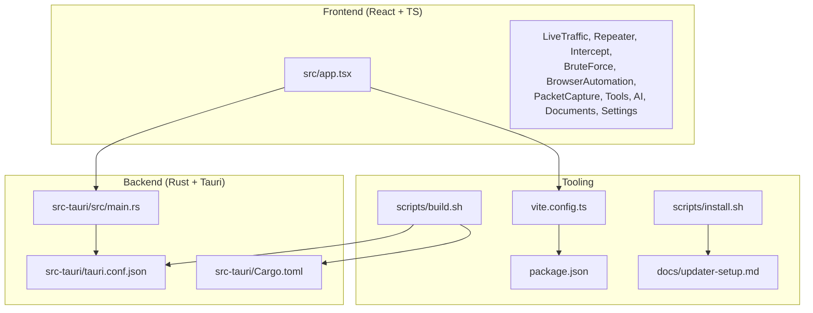
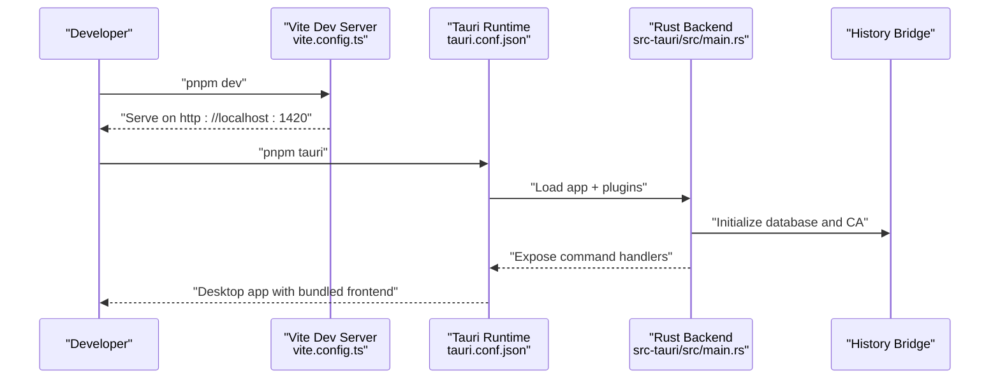

# Contributing and Development

<cite>
**Referenced Files in This Document**
- [README.md](file://README.md)
- [package.json](file://package.json)
- [vite.config.ts](file://vite.config.ts)
- [src-tauri/Cargo.toml](file://src-tauri/Cargo.toml)
- [src-tauri/tauri.conf.json](file://src-tauri/tauri.conf.json)
- [AGENTS.md](file://AGENTS.md)
- [src-tauri/tests/README.md](file://src-tauri/tests/README.md)
- [scripts/build.sh](file://scripts/build.sh)
- [scripts/install.sh](file://scripts/install.sh)
- [docs/updater-setup.md](file://docs/updater-setup.md)
- [src/app.tsx](file://src/app.tsx)
- [src-tauri/src/main.rs](file://src-tauri/src/main.rs)
</cite>

## Table of Contents
1. [Introduction](#introduction)
2. [Project Structure](#project-structure)
3. [Core Components](#core-components)
4. [Architecture Overview](#architecture-overview)
5. [Development Environment Setup](#development-environment-setup)
6. [Code Standards and Conventions](#code-sts-and-conventions)
7. [Testing Strategy and Quality Assurance](#testing-strategy-and-quality-assurance)
8. [Contribution Workflow](#contribution-workflow)
9. [Debugging Techniques](#debugging-techniques)
10. [Practical Development Examples](#practical-development-examples)
11. [Continuous Integration and Release](#continuous-integration-and-release)
12. [Documentation Contributions](#documentation-contributions)
13. [Community Engagement and Maintainer Responsibilities](#community-engagement-and-maintainer-responsibilities)
14. [Onboarding and Mentorship](#onboarding-and-mentorship)
15. [Troubleshooting Guide](#troubleshooting-guide)
16. [Conclusion](#conclusion)

## Introduction
AppRecon is a desktop proxy and traffic inspection tool built with Tauri, React, and TypeScript. It provides features such as traffic interception with MITM proxy support, certificate management, filtering and tagging, session management, breakpoints, scripting, MCP server integration, and multi-format viewers. This document consolidates development setup, standards, testing, contribution workflow, debugging, and release practices to help contributors build, iterate, and ship reliably.

## Project Structure
The repository is organized into:
- Frontend (React + TypeScript): src/
- Backend (Rust + Tauri): src-tauri/
- Scripts and automation: scripts/
- Documentation: docs/

**Diagram sources**
- [src/app.tsx:1-35](file://src/app.tsx#L1-L35)
- [src-tauri/src/main.rs:14-147](file://src-tauri/src/main.rs#L14-L147)
- [src-tauri/tauri.conf.json:1-48](file://src-tauri/tauri.conf.json#L1-L48)
- [src-tauri/Cargo.toml:1-62](file://src-tauri/Cargo.toml#L1-L62)
- [vite.config.ts:1-41](file://vite.config.ts#L1-L41)
- [package.json:1-90](file://package.json#L1-L90)
- [scripts/build.sh:1-411](file://scripts/build.sh#L1-L411)
- [scripts/install.sh:1-99](file://scripts/install.sh#L1-L99)
- [docs/updater-setup.md:1-152](file://docs/updater-setup.md#L1-L152)

**Section sources**
- [README.md:40-61](file://README.md#L40-L61)
- [src/app.tsx:1-35](file://src/app.tsx#L1-L35)

## Core Components
- Frontend routing and page composition are defined in the React app entry.
- Tauri initializes plugins, manages state, and exposes commands to the frontend.
- Build and bundling are orchestrated via Vite and Tauri configuration.
- Updater integration is configured via Tauri and documented for Cloudflare R2.

Key responsibilities:
- Frontend: Pages, UI components, state orchestration, and IPC calls to backend.
- Backend: Proxy lifecycle, database bridge, command handlers, and platform plugins.

**Section sources**
- [src/app.tsx:14-32](file://src/app.tsx#L14-L32)
- [src-tauri/src/main.rs:23-146](file://src-tauri/src/main.rs#L23-L146)
- [src-tauri/tauri.conf.json:6-11](file://src-tauri/tauri.conf.json#L6-L11)
- [vite.config.ts:5-20](file://vite.config.ts#L5-L20)

## Architecture Overview
High-level flow:
- Frontend runs on Vite dev server (port 1420) during development.
- Tauri bundles the frontend dist and launches the Rust backend.
- Backend exposes commands for proxy, history, repeater, intruder, packet capture, AI, and browser automation.
- Updater plugin checks for updates and installs new bundles.

**Diagram sources**
- [vite.config.ts:8-15](file://vite.config.ts#L8-L15)
- [src-tauri/tauri.conf.json:7-10](file://src-tauri/tauri.conf.json#L7-L10)
- [src-tauri/src/main.rs:23-70](file://src-tauri/src/main.rs#L23-L70)

## Development Environment Setup
System requirements:
- Node.js and pnpm for frontend dependencies and scripts.
- Rust toolchain and Cargo for the backend.
- Platform-specific prerequisites for Tauri bundling and plugins.

Installation and setup:
- Install dependencies: pnpm install
- Run development server: pnpm dev (Vite on port 1420)
- Build for production: pnpm build
- Run Tauri app: pnpm tauri
- Run Rust backend directly: cd src-tauri && cargo run
- Run proxy tests: cd src-tauri && cargo test --lib -- --test-threads=1

Environment specifics:
- Vite server configuration sets port 1420, host binding, and ignores large wordlists.
- Tauri configuration defines devUrl, frontendDist, and updater endpoints.
- Cargo.toml lists Tauri plugins and backend dependencies.

**Section sources**
- [README.md:24-38](file://README.md#L24-L38)
- [package.json:6-12](file://package.json#L6-L12)
- [vite.config.ts:8-15](file://vite.config.ts#L8-L15)
- [src-tauri/tauri.conf.json:7-10](file://src-tauri/tauri.conf.json#L7-L10)
- [src-tauri/Cargo.toml:11-51](file://src-tauri/Cargo.toml#L11-L51)

## Code Standards and Conventions
Frontend conventions:
- Use TypeScript with React function components.
- Indentation: 2 spaces; semicolons permitted.
- Path aliases: @/components, @/pages, @/stores, @/hooks, @/lib.
- Page folder naming: kebab-case (e.g., brute-force).
- Components: PascalCase (e.g., RepeaterPage).
- Hooks: camelCase prefixed with use (e.g., useTargets).
- Stores: short, domain-based names (e.g., target.ts, filter.ts).
- Prefer thin page-entry + page hook + presentational sections.

Rust conventions:
- Follow rustfmt defaults.
- Tests should be named by behavior (e.g., test_connect_tunnel_tls_upgrade_example_com).

Documentation and comments:
- Match existing code style; keep imports organized.
- For UI behavior changes, document manual verification steps in PRs.

**Section sources**
- [AGENTS.md:20-25](file://AGENTS.md#L20-L25)
- [AGENTS.md:26-58](file://AGENTS.md#L26-L58)
- [src-tauri/tests/README.md:59-61](file://src-tauri/tests/README.md#L59-L61)

## Testing Strategy and Quality Assurance
Frontend:
- No automated frontend test configuration is present in package.json.
- When adding UI behavior, document manual verification steps in the pull request.

Backend:
- Proxy tests require a running proxy instance and must be executed sequentially (--test-threads=1).
- Tests validate TLS upgrade behavior and proxy connectivity.

Quality assurance:
- Use manual verification for UI changes.
- For backend proxy tests, ensure the proxy is running on port 8888 before executing tests.

**Section sources**
- [AGENTS.md:59-61](file://AGENTS.md#L59-L61)
- [src-tauri/tests/README.md:21-31](file://src-tauri/tests/README.md#L21-L31)
- [src-tauri/tests/README.md:32-53](file://src-tauri/tests/README.md#L32-L53)

## Contribution Workflow
Issue reporting:
- Describe the problem, expected vs. actual behavior, and steps to reproduce.
- Include environment details (OS, Node/Rust versions).

Pull requests:
- Provide a concise description, affected areas (frontend, proxy, db, etc.).
- Link related issues when applicable.
- Include test commands or manual verification notes.
- Add screenshots for visible UI changes.

Review process:
- Reviewers will assess correctness, adherence to conventions, and test coverage.
- Ensure CI passes and no secrets or local artifacts are committed.

Security and configuration:
- Treat certificate material, database files, HAR captures, and proxy logs as sensitive.
- Avoid committing secrets or local runtime artifacts.

**Section sources**
- [AGENTS.md:63-68](file://AGENTS.md#L63-L68)
- [AGENTS.md:69-72](file://AGENTS.md#L69-L72)

## Debugging Techniques
Frontend debugging:
- Use Vite dev server on port 1420; inspect network requests and console logs.
- Leverage React DevTools and browser developer tools.

Backend and Tauri IPC:
- Use Tauri’s invoke_handler to expose commands from Rust to the frontend.
- Inspect logs printed to stderr/stdout; a panic hook writes panics to /tmp/0xbuffer_panic.log.
- For updater-related issues, verify endpoint URLs and signatures.

Rust async debugging:
- Use tokio runtime; enable tracing/logging to observe async task execution.
- For proxy and network operations, validate TLS handshake and connection lifecycle.

Tauri IPC debugging:
- Confirm command registration in invoke_handler.
- Verify frontend IPC calls align with backend command names.

**Section sources**
- [src-tauri/src/main.rs:14-22](file://src-tauri/src/main.rs#L14-L22)
- [src-tauri/src/main.rs:71-139](file://src-tauri/src/main.rs#L71-L139)
- [src-tauri/tauri.conf.json:40-45](file://src-tauri/tauri.conf.json#L40-L45)

## Practical Development Examples
Feature development (frontend):
- Add a new page under src/pages/<feature-name>/ with index.tsx, hooks/, components/, constants.ts, and lib/.
- Use thin page-entry pattern: compose layout and wire sections; orchestrate in page-specific hooks.

Bug fix (backend):
- Identify failing proxy test scenario and adjust proxy TLS upgrade logic.
- Re-run tests sequentially to confirm fix: cargo test --lib -- --test-threads=1.

Performance improvement (frontend):
- Analyze bundle sizes and optimize chunking via vite.config.ts manualChunks.
- Split large vendor groups (e.g., monaco-editor, recharts) to improve caching.

**Section sources**
- [AGENTS.md:43-57](file://AGENTS.md#L43-L57)
- [src-tauri/tests/README.md:54-73](file://src-tauri/tests/README.md#L54-L73)
- [vite.config.ts:21-39](file://vite.config.ts#L21-L39)

## Continuous Integration and Release
Build and upload:
- The build script detects platform, builds Tauri bundles, uploads artifacts to Cloudflare R2, and updates latest.json.
- Supports multi-platform builds and optional Windows cross-targets.

Updater configuration:
- Configure R2 credentials and base URL; set public key and endpoints in tauri.conf.json.
- Use scripts/install.sh to verify checksums and install the app on macOS.

Release notes and signing:
- Export TAURI_SIGNING_PRIVATE_KEY for signing bundles.
- Optionally set UPDATER_NOTES for release notes.

**Section sources**
- [scripts/build.sh:110-160](file://scripts/build.sh#L110-L160)
- [scripts/build.sh:214-250](file://scripts/build.sh#L214-L250)
- [scripts/build.sh:323-400](file://scripts/build.sh#L323-L400)
- [docs/updater-setup.md:42-63](file://docs/updater-setup.md#L42-L63)
- [src-tauri/tauri.conf.json:40-45](file://src-tauri/tauri.conf.json#L40-L45)
- [scripts/install.sh:46-76](file://scripts/install.sh#L46-L76)

## Documentation Contributions
Guidelines:
- Keep documentation aligned with code changes.
- For feature pages and backend modules, update docs/ and inline comments as needed.
- Use clear headings and concise descriptions; link to relevant source files.

Community:
- Encourage contributors to propose doc improvements alongside feature work.
- Review documentation PRs with the same rigor as code changes.

**Section sources**
- [README.md:75-79](file://README.md#L75-L79)

## Community Engagement and Maintainer Responsibilities
Community:
- Respond to issues and PRs in a timely manner.
- Provide feedback on proposed changes and suggest improvements.

Maintainer responsibilities:
- Gate releases by ensuring tests pass, documentation is updated, and no secrets are included.
- Oversee updater configuration and release artifacts.
- Enforce code standards and conventions consistently.

**Section sources**
- [AGENTS.md:63-68](file://AGENTS.md#L63-L68)

## Onboarding and Mentorship
New contributor onboarding:
- Start with README.md to understand features and tech stack.
- Follow setup steps in README.md and AGENTS.md.
- Explore src/app.tsx for frontend structure and src-tauri/src/main.rs for backend initialization.

Mentorship resources:
- Refer to AGENTS.md for coding style and page composition patterns.
- Use src-tauri/tests/README.md as a guide for proxy test expectations.
- Consult scripts/build.sh and docs/updater-setup.md for release and updater workflows.

**Section sources**
- [README.md:24-38](file://README.md#L24-L38)
- [AGENTS.md:9-18](file://AGENTS.md#L9-L18)
- [src-tauri/tests/README.md:11-28](file://src-tauri/tests/README.md#L11-L28)

## Troubleshooting Guide
Common issues and resolutions:
- Port 1420 in use: Use pnpm dev:clean to free the port and restart the dev server.
- Proxy not reachable: Ensure the proxy is running on port 8888; check for port conflicts.
- TLS handshake failures: Validate proxy migration to Hudsucker and re-run tests.
- Updater errors: Verify R2 credentials, endpoint URLs, and signatures; check latest.json availability.
- Installer checksum mismatch: Confirm checksum verification in scripts/install.sh.

**Section sources**
- [package.json:8](file://package.json#L8)
- [src-tauri/tests/README.md:74-90](file://src-tauri/tests/README.md#L74-L90)
- [docs/updater-setup.md:147-152](file://docs/updater-setup.md#L147-L152)
- [scripts/install.sh:63-75](file://scripts/install.sh#L63-L75)

## Conclusion
This guide consolidates environment setup, standards, testing, contribution workflow, debugging, and release practices for AppRecon. By following these conventions and leveraging the provided scripts and configurations, contributors can develop features, fix bugs, and improve performance efficiently while maintaining high-quality releases.