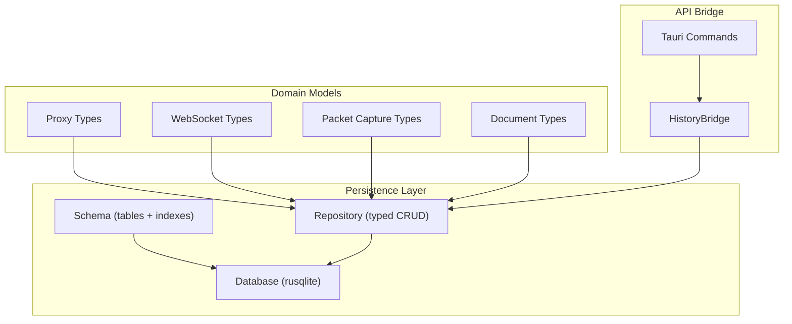
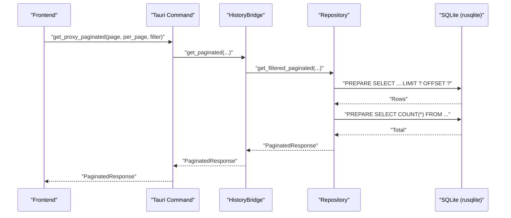
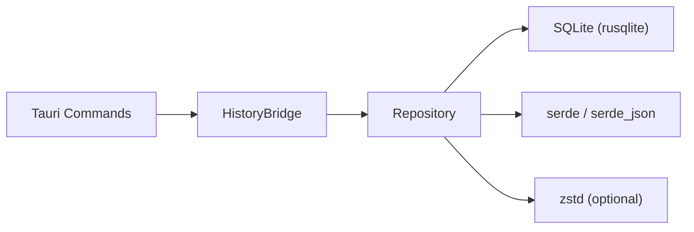

# Data Persistence

<cite>
**Referenced Files in This Document**
- [repository.rs](file://src-tauri/src/db/repository.rs)
- [schema.rs](file://src-tauri/src/db/schema.rs)
- [mod.rs](file://src-tauri/src/db/mod.rs)
- [history/mod.rs](file://src-tauri/src/history/mod.rs)
- [commands/history.rs](file://src-tauri/src/commands/history.rs)
- [commands/storage.rs](file://src-tauri/src/commands/storage.rs)
- [commands/packet_capture.rs](file://src-tauri/src/commands/packet_capture.rs)
- [packet_capture/types.rs](file://src-tauri/src/packet_capture/types.rs)
- [proxy/state.rs](file://src-tauri/src/proxy/state.rs)
- [Cargo.toml](file://src-tauri/Cargo.toml)
- [lib.rs](file://src-tauri/src/lib.rs)
</cite>

## Table of Contents
1. [Introduction](#introduction)
2. [Project Structure](#project-structure)
3. [Core Components](#core-components)
4. [Architecture Overview](#architecture-overview)
5. [Detailed Component Analysis](#detailed-component-analysis)
6. [Dependency Analysis](#dependency-analysis)
7. [Performance Considerations](#performance-considerations)
8. [Troubleshooting Guide](#troubleshooting-guide)
9. [Conclusion](#conclusion)

## Introduction
This document explains AppRecon’s data persistence layer, focusing on the repository pattern, database connection management, transactions, and CRUD operations across HTTP logs, WebSocket data, documents, and packet captures. It also covers indexing strategies, query optimization, compression for large blobs, caching and memory management, error handling, and practical operation patterns.

## Project Structure
The persistence layer is implemented in the Tauri backend under src-tauri. The key modules are:
- Database schema and initialization
- Repository with typed CRUD operations
- History bridge exposing a stable API to frontend commands
- Commands wiring frontend requests to the bridge
- Types for proxy, WebSocket, and packet capture records

**Diagram sources**
- [repository.rs:37-58](file://src-tauri/src/db/repository.rs#L37-L58)
- [schema.rs:1-176](file://src-tauri/src/db/schema.rs#L1-L176)
- [history/mod.rs:61-70](file://src-tauri/src/history/mod.rs#L61-L70)
- [commands/history.rs:1-117](file://src-tauri/src/commands/history.rs#L1-L117)

**Section sources**
- [mod.rs:1-3](file://src-tauri/src/db/mod.rs#L1-L3)
- [lib.rs:27-31](file://src-tauri/src/lib.rs#L27-L31)

## Core Components
- Database: Wraps a SQLite connection with a mutex guard and initializes tables and indexes.
- Repository: Provides typed CRUD and query methods for HTTP logs, WebSocket logs, documents, and packet captures.
- HistoryBridge: Thin facade around the repository, normalizing filters and converting to summary DTOs.
- Commands: Expose Tauri commands for frontend consumption.

Key responsibilities:
- Connection lifecycle and initialization
- Transaction boundaries for atomic writes
- Pagination and filtering for large datasets
- JSON serialization/deserialization for structured fields
- Index-backed queries for performance

**Section sources**
- [repository.rs:37-58](file://src-tauri/src/db/repository.rs#L37-L58)
- [history/mod.rs:61-70](file://src-tauri/src/history/mod.rs#L61-L70)
- [commands/history.rs:1-117](file://src-tauri/src/commands/history.rs#L1-L117)

## Architecture Overview
The system follows a repository pattern with a typed Database wrapper and a higher-level HistoryBridge. Commands call into the bridge, which delegates to the repository. The repository executes SQL statements against SQLite with rusqlite, leveraging prepared statements and transactions.

**Diagram sources**
- [commands/history.rs:56-65](file://src-tauri/src/commands/history.rs#L56-L65)
- [history/mod.rs:162-186](file://src-tauri/src/history/mod.rs#L162-L186)
- [repository.rs:572-748](file://src-tauri/src/db/repository.rs#L572-L748)

## Detailed Component Analysis

### Database Initialization and Connection Management
- Initializes foreign keys, WAL mode, and creates tables/indexes via schema constants.
- Uses a Mutex-guarded Connection to serialize access in a single-threaded Tauri context.
- Provides a constructor that opens the database file at the given path.

Operational notes:
- WAL mode improves concurrency and durability.
- Foreign keys enabled for referential integrity.

**Section sources**
- [repository.rs:41-58](file://src-tauri/src/db/repository.rs#L41-L58)
- [schema.rs:1-176](file://src-tauri/src/db/schema.rs#L1-L176)

### HTTP Logs: CRUD and Queries
Entities:
- ProxyRecord: request/response bodies and headers stored as JSON/text or BLOB depending on schema.

CRUD operations:
- Insert log: serializes headers to JSON and inserts into http_logs.
- Get all: ordered by timestamp descending.
- Get filtered: dynamic SQL with LIKE and IN clauses; supports search, path, methods, status codes, and scope patterns.
- Get paginated: applies LIMIT/OFFSET with COUNT(*) for total.
- Get by ID: single-row lookup.
- Clear logs: DELETE FROM http_logs.
- Delete by ID: DELETE FROM http_logs WHERE id = ?.

Query optimization:
- Indexes on timestamp, method, url.
- Parameterized queries prevent SQL injection.
- COUNT(*) executed separately to avoid expensive subqueries.

Error handling:
- Row mapping catches malformed rows and logs warnings; continues processing.

**Section sources**
- [repository.rs:259-371](file://src-tauri/src/db/repository.rs#L259-L371)
- [repository.rs:295-301](file://src-tauri/src/db/repository.rs#L295-L301)
- [repository.rs:303-348](file://src-tauri/src/db/repository.rs#L303-L348)
- [repository.rs:535-570](file://src-tauri/src/db/repository.rs#L535-L570)
- [repository.rs:572-748](file://src-tauri/src/db/repository.rs#L572-L748)
- [repository.rs:935-1009](file://src-tauri/src/db/repository.rs#L935-L1009)
- [schema.rs:1-21](file://src-tauri/src/db/schema.rs#L1-L21)

### WebSocket Logs: CRUD and Queries
Entities:
- WebSocketConnectionRecord and WebSocketMessageRecord with foreign key relationship.

CRUD operations:
- Insert connection: handshake headers serialized to JSON.
- Insert message: updates parent connection’s message_count and last activity.
- Clear all: cascading deletes via foreign keys.
- Delete connection: DELETE with cascade.
- Paginated connections: dynamic WHERE clauses with LIKE and IN; separate COUNT query.
- Get by ID: single-row lookup.
- Get messages by connection: ordered by timestamp ascending.

Query optimization:
- Indexes on timestamps and connection_id.
- Separate COUNT query avoids correlated subqueries.

**Section sources**
- [repository.rs:373-432](file://src-tauri/src/db/repository.rs#L373-L432)
- [repository.rs:434-448](file://src-tauri/src/db/repository.rs#L434-L448)
- [repository.rs:450-533](file://src-tauri/src/db/repository.rs#L450-L533)
- [repository.rs:1046-1113](file://src-tauri/src/db/repository.rs#L1046-L1113)
- [schema.rs:23-56](file://src-tauri/src/db/schema.rs#L23-L56)

### Documents: CRUD Operations
Entity:
- DocumentRecord with sections and API entries as JSON.

CRUD operations:
- Upsert document: INSERT OR REPLACE with ON CONFLICT update.
- Delete document: DELETE by id.
- List documents: ORDER BY created_at ASC.

Notes:
- JSON fields stored as TEXT; serialized before insert and deserialized on read.

**Section sources**
- [repository.rs:211-257](file://src-tauri/src/db/repository.rs#L211-L257)
- [repository.rs:1011-1024](file://src-tauri/src/db/repository.rs#L1011-L1024)
- [schema.rs:58-70](file://src-tauri/src/db/schema.rs#L58-L70)

### Packet Captures: Transactions and Bulk Writes
Entities:
- PacketCaptureRecord, StoredPacketRecord, PacketConnectionRecord, and auxiliary tables for HTTP extraction and bodies.

CRUD operations:
- Insert capture metadata.
- Finish capture: UPDATE status and ended_at.
- Insert captured packet and connection atomically: transaction ensures consistency.
- Insert HTTP request/response linkage and bodies (auxiliary tables).
- Paginated packets: LIMIT/OFFSET with COUNT(*).

Transactions:
- insert_captured_packet wraps packet and connection writes in a transaction to maintain consistency.

Indexes:
- Composite and single-column indexes on captures, packets, connections, and auxiliary tables.

**Section sources**
- [repository.rs:60-94](file://src-tauri/src/db/repository.rs#L60-L94)
- [repository.rs:96-163](file://src-tauri/src/db/repository.rs#L96-L163)
- [repository.rs:165-209](file://src-tauri/src/db/repository.rs#L165-L209)
- [schema.rs:72-175](file://src-tauri/src/db/schema.rs#L72-L175)
- [packet_capture/types.rs:47-91](file://src-tauri/src/packet_capture/types.rs#L47-L91)

### ZSTD Compression for Large Data Blobs
While the repository schema defines BLOB columns for large payloads (e.g., HTTP bodies and packet raw data), the repository does not apply ZSTD compression directly. Compression is handled elsewhere in the stack:
- Body decoder/encoder uses zstd for content-encoding handling during request replay and decoding.
- For storage-level compression of BLOBs, consider adding a compression step before insert and decompression on read.

Recommendation:
- Add optional compression flag in insert methods and transparently compress/decompress BLOBs using zstd to reduce disk usage and improve IO throughput.

**Section sources**
- [schema.rs](file://src-tauri/src/db/schema.rs#L8, #L46, #L99, #L159)
- [Cargo.toml](file://src-tauri/Cargo.toml#L49)
- [commands/packet_capture.rs:345-395](file://src-tauri/src/commands/packet_capture.rs#L345-L395)

### Pagination and Filtering Patterns
Common patterns:
- Dynamic SQL construction with parameterized IN clauses and LIKE patterns.
- Separate COUNT query to compute has_more efficiently.
- Scope filtering with wildcard patterns (*.domain) and exact matches.

Examples:
- HTTP logs filtered paginated query with multiple optional filters.
- WebSocket connections filtered by search, states, and scope.

**Section sources**
- [repository.rs:572-748](file://src-tauri/src/db/repository.rs#L572-L748)
- [repository.rs:1229-1327](file://src-tauri/src/db/repository.rs#L1229-L1327)

### Data Access Patterns and Caching
- No explicit in-memory cache is present in the repository. Data is read directly from SQLite on each request.
- Memory management relies on:
  - Prepared statements to reuse query plans.
  - Row-by-row streaming via query_map to avoid loading entire result sets.
  - JSON parsing on demand for headers and structured fields.

Recommendations:
- Introduce lightweight LRU caches for frequently accessed summaries (e.g., recent logs, websocket connection counts).
- Batch reads for paginated lists to reduce round trips.

**Section sources**
- [repository.rs:174-190](file://src-tauri/src/db/repository.rs#L174-L190)
- [repository.rs:544-553](file://src-tauri/src/db/repository.rs#L544-L553)

### Error Handling and Retry Logic
- Row mapping errors are logged and skipped to keep the pipeline resilient.
- Command wrappers convert rusqlite errors to String for Tauri.
- No automatic retry is implemented in the repository; callers should decide on retry policy per operation.

**Section sources**
- [repository.rs:1115-1177](file://src-tauri/src/db/repository.rs#L1115-L1177)
- [history/mod.rs:122-134](file://src-tauri/src/history/mod.rs#L122-L134)

### Data Consistency Guarantees
- Transactions ensure atomicity for packet insertions (packet + connection).
- Foreign keys and cascading deletes maintain referential integrity for WebSocket and packet capture data.
- WAL mode improves durability and reduces write contention.

**Section sources**
- [repository.rs:102-102](file://src-tauri/src/db/repository.rs#L102-L102)
- [schema.rs](file://src-tauri/src/db/schema.rs#L48, #L101, #L133, #L162)

### Example Operation Patterns
- Insert HTTP log:
  - Prepare headers JSON, insert into http_logs with parameters.
  - See [repository.rs:259-293](file://src-tauri/src/db/repository.rs#L259-L293).
- Paginated HTTP logs:
  - Build dynamic WHERE, prepare LIMIT/OFFSET, execute COUNT, map rows.
  - See [repository.rs:572-748](file://src-tauri/src/db/repository.rs#L572-L748).
- Insert WebSocket message:
  - Insert message, then UPDATE connection counters.
  - See [repository.rs:405-431](file://src-tauri/src/db/repository.rs#L405-L431).
- Insert packet capture:
  - Transactionally insert packet and connection, increment capture count.
  - See [repository.rs:96-163](file://src-tauri/src/db/repository.rs#L96-L163).
- Get storage info:
  - Resolve app data dir and database path.
  - See [commands/storage.rs:12-23](file://src-tauri/src/commands/storage.rs#L12-L23).

**Section sources**
- [repository.rs:259-293](file://src-tauri/src/db/repository.rs#L259-L293)
- [repository.rs:572-748](file://src-tauri/src/db/repository.rs#L572-L748)
- [repository.rs:405-431](file://src-tauri/src/db/repository.rs#L405-L431)
- [repository.rs:96-163](file://src-tauri/src/db/repository.rs#L96-L163)
- [commands/storage.rs:12-23](file://src-tauri/src/commands/storage.rs#L12-L23)

## Dependency Analysis
- rusqlite provides SQLite bindings and transactions.
- serde/serde_json handles JSON serialization for headers and structured fields.
- zstd is available for potential compression of large BLOBs.
- Tauri commands depend on HistoryBridge, which depends on the repository.

**Diagram sources**
- [Cargo.toml](file://src-tauri/Cargo.toml#L21, #L37, #L38, #L49)
- [commands/history.rs:1-117](file://src-tauri/src/commands/history.rs#L1-L117)
- [history/mod.rs:61-70](file://src-tauri/src/history/mod.rs#L61-L70)
- [repository.rs](file://src-tauri/src/db/repository.rs#L9, #L10)

**Section sources**
- [Cargo.toml](file://src-tauri/Cargo.toml#L21, #L37, #L38, #L49)

## Performance Considerations
- Indexes: Ensure appropriate indexes exist for frequent filters (timestamp, method, url, host, connection_id).
- Prepared statements: Reuse compiled query plans to reduce overhead.
- Streaming: Use query_map to process rows incrementally.
- Batching: Group related writes (e.g., packet insertions) in transactions.
- Compression: Consider ZSTD for large BLOBs to reduce IO and disk usage.
- Query normalization: Normalize filters to avoid empty clauses and redundant conditions.

[No sources needed since this section provides general guidance]

## Troubleshooting Guide
Common issues and remedies:
- Malformed rows: Repository logs and skips invalid rows; verify JSON serialization and date formats.
  - See [repository.rs:1115-1177](file://src-tauri/src/db/repository.rs#L1115-L1177)
- Permission errors on packet capture: On macOS, ensure BPF permissions; command returns actionable errors.
  - See [commands/packet_capture.rs:11-28](file://src-tauri/src/commands/packet_capture.rs#L11-L28)
- Missing tcpdump: start_packet_capture validates presence and returns descriptive errors.
  - See [commands/packet_capture.rs:159-162](file://src-tauri/src/commands/packet_capture.rs#L159-L162)
- Storage path resolution: get_storage_info resolves app data dir and database path.
  - See [commands/storage.rs:12-23](file://src-tauri/src/commands/storage.rs#L12-L23)

**Section sources**
- [repository.rs:1115-1177](file://src-tauri/src/db/repository.rs#L1115-L1177)
- [commands/packet_capture.rs:11-28](file://src-tauri/src/commands/packet_capture.rs#L11-L28)
- [commands/packet_capture.rs:159-162](file://src-tauri/src/commands/packet_capture.rs#L159-L162)
- [commands/storage.rs:12-23](file://src-tauri/src/commands/storage.rs#L12-L23)

## Conclusion
AppRecon’s persistence layer uses a clean repository pattern with rusqlite, providing robust CRUD operations, transactions, and index-backed queries. While JSON is used for structured fields and BLOBs accommodate large payloads, integrating ZSTD compression would further optimize storage and IO. The HistoryBridge offers a stable API surface for frontend commands, and the schema enforces referential integrity and performance through indexes.