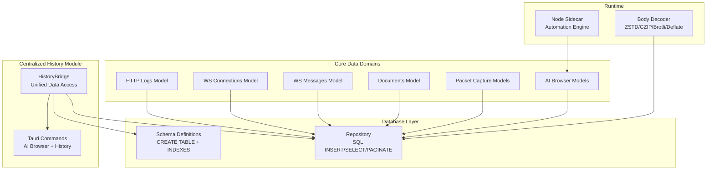
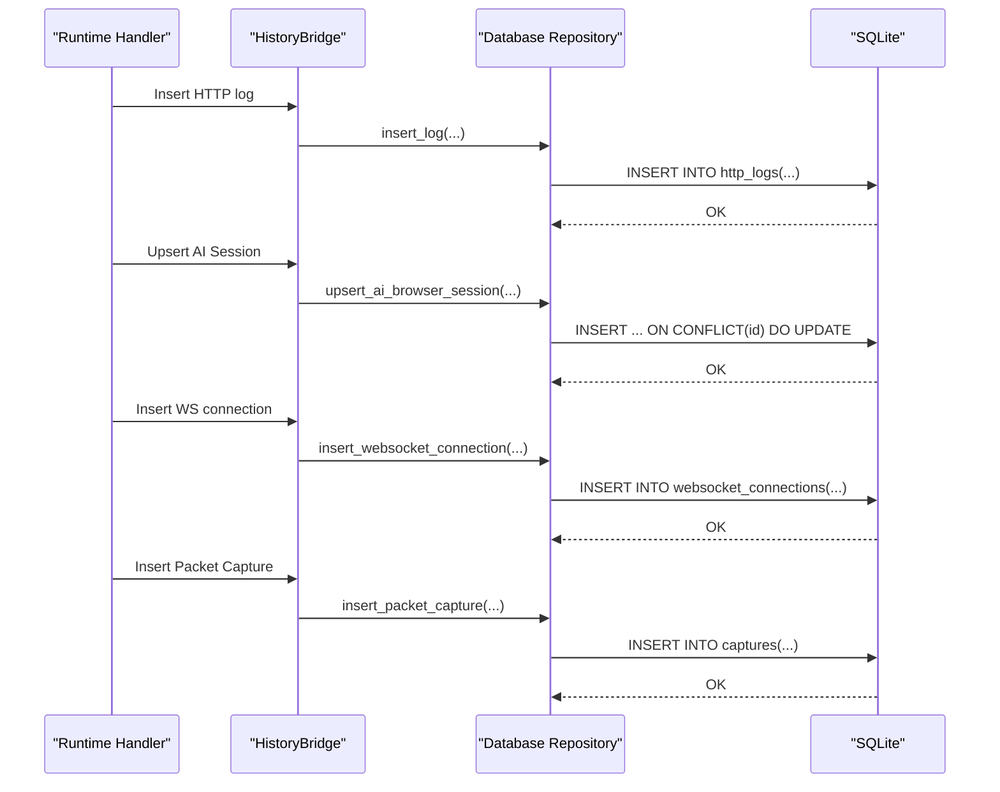
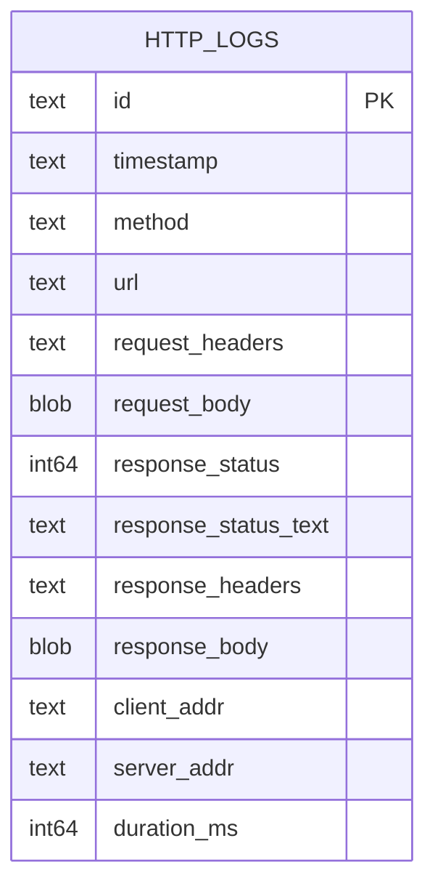
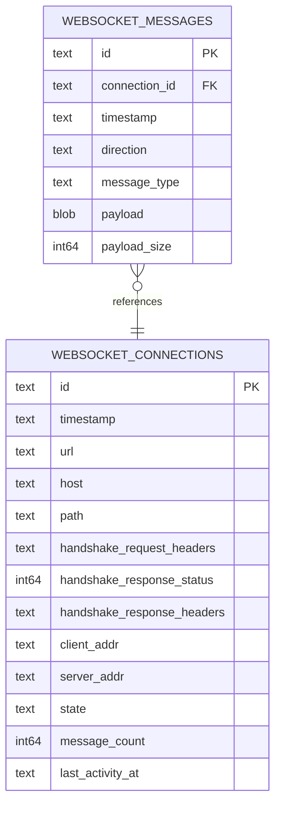
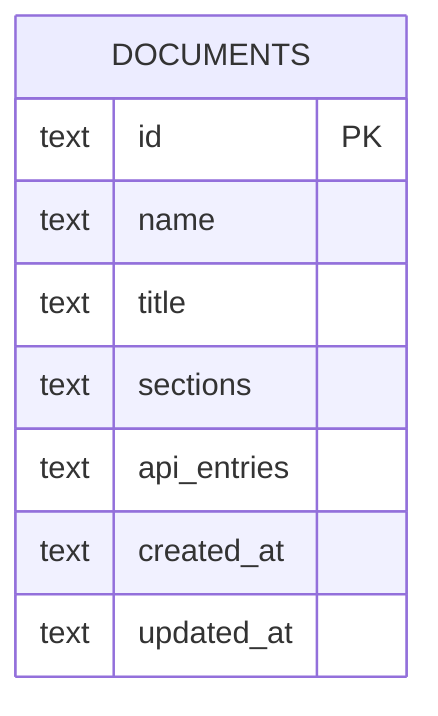
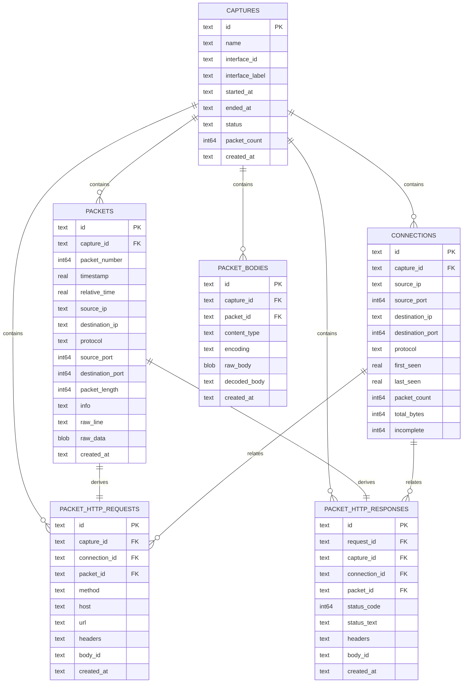
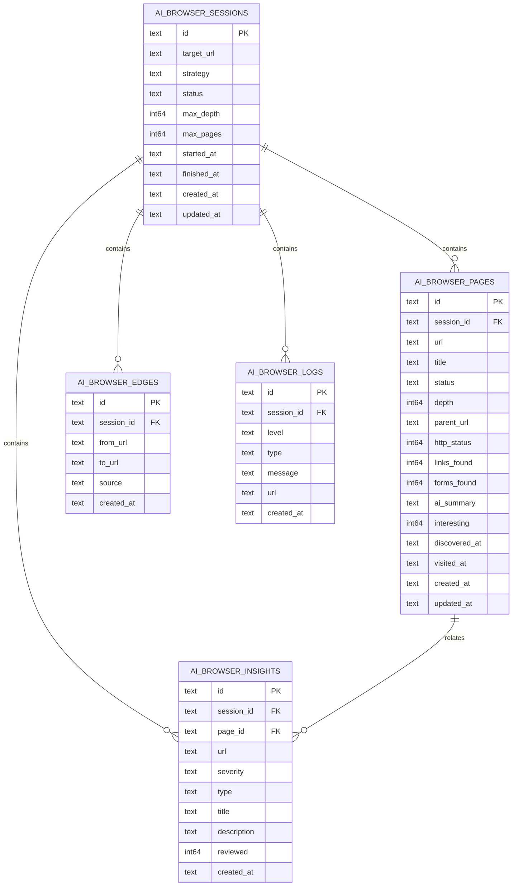
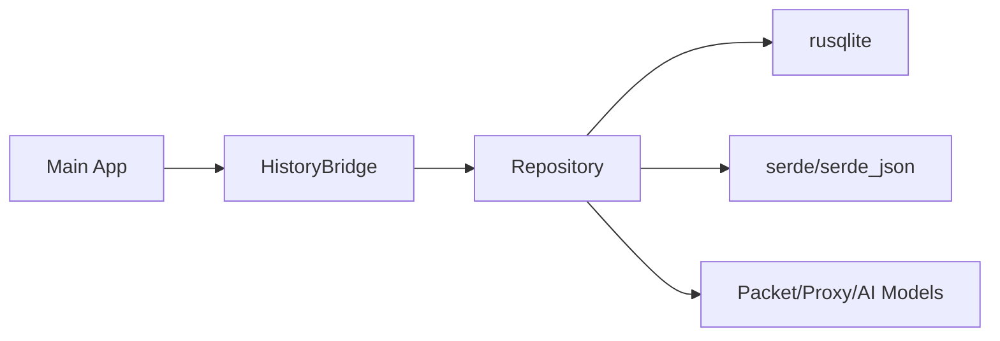

# Database Design

<cite>
**Referenced Files in This Document**
- [schema.rs](file://src-tauri/src/db/schema.rs)
- [repository.rs](file://src-tauri/src/db/repository.rs)
- [ai_browser.rs](file://src-tauri/src/ai_browser.rs)
- [history/mod.rs](file://src-tauri/src/history/mod.rs)
- [types.rs](file://src-tauri/src/packet_capture/types.rs)
- [state.rs](file://src-tauri/src/proxy/state.rs)
- [body_decoder.rs](file://src-tauri/src/proxy/lifecycle/body_decoder.rs)
- [main.rs](file://src-tauri/src/main.rs)
- [Cargo.toml](file://src-tauri/Cargo.toml)
</cite>

## Update Summary
**Changes Made**
- Added comprehensive AI browser session, page, and insight data models
- Expanded schema definitions with new table structures for crawl configurations and AI analysis results
- Introduced centralized HistoryBridge module for unified data persistence across all domains
- Added edge table for crawl graph relationships
- Enhanced CRUD operations for AI browser entities with comprehensive indexing
- Integrated AI browser functionality into the main application architecture

## Table of Contents
1. [Introduction](#introduction)
2. [Project Structure](#project-structure)
3. [Core Components](#core-components)
4. [Architecture Overview](#architecture-overview)
5. [Detailed Component Analysis](#detailed-component-analysis)
6. [Dependency Analysis](#dependency-analysis)
7. [Performance Considerations](#performance-considerations)
8. [Troubleshooting Guide](#troubleshooting-guide)
9. [Conclusion](#conclusion)
10. [Appendices](#appendices)

## Introduction
This document describes the database schema and data model used by AppRecon's backend (Tauri/Rust). It focuses on five primary data domains:
- HTTP logs: captured request/response pairs
- WebSocket connections and messages: handshake and message streams
- Documents: structured markdown-like content with sections and API entries
- Packet capture records: network packets, connections, and HTTP requests/responses derived from captures
- AI browser sessions: automated web crawling, page analysis, and AI-generated insights

It covers entity relationships, field definitions, data types, primary/foreign keys, indexes, constraints, validation and integrity rules, data access patterns, caching strategies, performance considerations, lifecycle and retention, compression, migrations, and security and backup/disaster recovery.

## Project Structure
The database schema and repository logic are implemented in the Tauri Rust backend with a centralized HistoryBridge module managing data persistence across all domains:
- Schema definitions are declared as SQL constants and executed during initialization
- Repository module encapsulates SQLite operations, transactions, and paginated queries
- Centralized HistoryBridge provides unified access to all data domains
- Data models for packet capture, proxy records, and AI browser entities define typed structures
- Content decoding logic handles HTTP body compression including ZSTD

**Diagram sources**
- [history/mod.rs:62-129](file://src-tauri/src/history/mod.rs#L62-L129)
- [schema.rs:177-255](file://src-tauri/src/db/schema.rs#L177-L255)
- [repository.rs:50-60](file://src-tauri/src/db/repository.rs#L50-L60)
- [ai_browser.rs:130-178](file://src-tauri/src/ai_browser.rs#L130-L178)
- [main.rs:139-146](file://src-tauri/src/main.rs#L139-L146)

**Section sources**
- [schema.rs:1-256](file://src-tauri/src/db/schema.rs#L1-L256)
- [repository.rs:38-60](file://src-tauri/src/db/repository.rs#L38-L60)
- [history/mod.rs:62-129](file://src-tauri/src/history/mod.rs#L62-L129)

## Core Components
- HTTP logs table stores request/response metadata and bodies as JSON-serialized headers and binary blobs. Indexes support timestamp, method, and URL filtering.
- WebSocket connections table tracks handshake metadata and state; messages table references connections with cascade deletion.
- Documents table stores structured content (sections and API entries) as JSON, with an index on updated_at for sorting.
- Packet capture schema includes captures, packets, connections, packet-derived HTTP requests/responses, and packet bodies. Foreign keys enforce referential integrity and cascading deletes.
- AI browser schema encompasses sessions, pages, insights, logs, and edges tables with comprehensive foreign key relationships and indexing for crawl analysis.

Constraints and indexes:
- Primary keys: id on all tables except packet_bodies
- Foreign keys: packets.capture_id → captures.id; connections.capture_id → captures.id; packet_http_requests.capture_id → captures.id; packet_http_responses.request_id → packet_http_requests.id; packet_bodies.capture_id → captures.id; websocket_messages.connection_id → websocket_connections.id; ai_browser_pages.session_id → ai_browser_sessions.id; ai_browser_insights.session_id → ai_browser_sessions.id; ai_browser_insights.page_id → ai_browser_pages.id; ai_browser_logs.session_id → ai_browser_sessions.id; ai_browser_edges.session_id → ai_browser_sessions.id
- Unique constraints: none explicit; captures.name is unique conceptually via application logic
- Indexes: timestamp, method, url on http_logs; timestamps and host/url on websocket_connections; timestamps and connection_id on websocket_messages; started_at on captures; composite indexes on packets(capture_id, packet_number), packets(protocol), packets(source_ip, source_port), packets(destination_ip, destination_port); indexes on connections(capture_id), packet_http_requests(capture_id), packet_http_responses(capture_id), packet_bodies(capture_id); indexes on ai_browser_sessions(status, started_at), ai_browser_pages(session_id, url), ai_browser_edges(session_id), ai_browser_insights(session_id), ai_browser_logs(session_id, created_at)

Validation and integrity:
- Foreign keys enabled via PRAGMA foreign_keys = ON
- Transactions used for atomic packet insertion
- ON CONFLICT handling for deduplication/upserts (e.g., connections upsert, AI browser upserts)
- JSON serialization/deserialization for headers and structured fields
- Cascade deletes maintain referential integrity across AI browser relationships

**Section sources**
- [schema.rs:1-256](file://src-tauri/src/db/schema.rs#L1-L256)
- [repository.rs:50-60](file://src-tauri/src/db/repository.rs#L50-L60)
- [repository.rs:62-96](file://src-tauri/src/db/repository.rs#L62-L96)
- [repository.rs:148-198](file://src-tauri/src/db/repository.rs#L148-L198)
- [repository.rs:232-281](file://src-tauri/src/db/repository.rs#L232-L281)
- [repository.rs:283-326](file://src-tauri/src/db/repository.rs#L283-L326)

## Architecture Overview
The database layer is initialized at startup through the HistoryBridge and exposes typed repositories for each domain. Data flows from runtime handlers into the repository, which executes SQL statements and returns strongly-typed records. The centralized HistoryBridge manages unified access across HTTP logs, WebSocket data, documents, packet captures, and AI browser sessions.

**Diagram sources**
- [history/mod.rs:73-129](file://src-tauri/src/history/mod.rs#L73-L129)
- [repository.rs:527-561](file://src-tauri/src/db/repository.rs#L527-L561)
- [repository.rs:62-96](file://src-tauri/src/db/repository.rs#L62-L96)
- [repository.rs:641-671](file://src-tauri/src/db/repository.rs#L641-L671)
- [repository.rs:328-349](file://src-tauri/src/db/repository.rs#L328-L349)

## Detailed Component Analysis

### HTTP Logs Data Model
- Purpose: Persist intercepted HTTP traffic for inspection and analysis
- Fields:
  - id: TEXT (PK)
  - timestamp: TEXT (RFC 3339 string)
  - method: TEXT
  - url: TEXT
  - request_headers: TEXT (JSON)
  - request_body: BLOB
  - response_status: INTEGER
  - response_status_text: TEXT
  - response_headers: TEXT (JSON)
  - response_body: BLOB
  - client_addr: TEXT
  - server_addr: TEXT
  - duration_ms: INTEGER
- Indexes: timestamp, method, url
- Access patterns:
  - Insert single log
  - Paginated retrieval ordered by timestamp desc
  - Filtered queries by search, path, methods, status codes, and scope
  - Tree aggregation by host/path/method
  - Clear/delete by id
- Validation:
  - JSON serialization for headers
  - Timestamp stored as RFC 3339 string
  - Optional response fields
- Integrity:
  - No foreign keys
  - JSON parsing with fallbacks

**Diagram sources**
- [schema.rs:1-21](file://src-tauri/src/db/schema.rs#L1-L21)
- [repository.rs:527-561](file://src-tauri/src/db/repository.rs#L527-L561)

**Section sources**
- [schema.rs:1-21](file://src-tauri/src/db/schema.rs#L1-L21)
- [repository.rs:527-561](file://src-tauri/src/db/repository.rs#L527-L561)
- [repository.rs:803-838](file://src-tauri/src/db/repository.rs#L803-L838)
- [repository.rs:840-1016](file://src-tauri/src/db/repository.rs#L840-L1016)

### WebSocket Connections and Messages Data Model
- Purpose: Track WebSocket handshakes and bidirectional message streams
- Connections:
  - id: TEXT (PK)
  - timestamp: TEXT (RFC 3339)
  - url: TEXT
  - host: TEXT
  - path: TEXT
  - handshake_request_headers: TEXT (JSON)
  - handshake_response_status: INTEGER
  - handshake_response_headers: TEXT (JSON)
  - client_addr: TEXT
  - server_addr: TEXT
  - state: TEXT enum (open/closed/error)
  - message_count: INTEGER (default 0)
  - last_activity_at: TEXT (RFC 3339)
- Messages:
  - id: TEXT (PK)
  - connection_id: TEXT (FK to connections.id, ON DELETE CASCADE)
  - timestamp: TEXT (RFC 3339)
  - direction: TEXT enum (inbound/outbound)
  - message_type: TEXT enum (text/binary/ping/pong/close)
  - payload: BLOB
  - payload_size: INTEGER
- Indexes: timestamp on connections; url/host on connections; connection_id and timestamp on messages
- Access patterns:
  - Insert connection and message
  - Paginated connections with optional search, scope, and state filters
  - Retrieve messages by connection id
  - Clear connections and messages
- Validation:
  - Enum values mapped to strings
  - JSON headers serialized/deserialized
- Integrity:
  - Foreign key with cascade delete ensures orphan cleanup

**Diagram sources**
- [schema.rs:23-56](file://src-tauri/src/db/schema.rs#L23-L56)
- [repository.rs:641-700](file://src-tauri/src/db/repository.rs#L641-L700)

**Section sources**
- [schema.rs:23-56](file://src-tauri/src/db/schema.rs#L23-L56)
- [repository.rs:641-700](file://src-tauri/src/db/repository.rs#L641-L700)

### Documents Data Model
- Purpose: Store structured documents with sections and API entries
- Fields:
  - id: TEXT (PK)
  - name: TEXT
  - title: TEXT
  - sections: TEXT (JSON)
  - api_entries: TEXT (JSON)
  - created_at: TEXT (RFC 3339)
  - updated_at: TEXT (RFC 3339)
- Indexes: updated_at
- Access patterns:
  - Upsert by id (ON CONFLICT DO UPDATE)
  - List all ordered by created_at
  - Delete by id
- Validation:
  - JSON serialization with defaults for missing/invalid values
- Integrity:
  - No foreign keys

**Diagram sources**
- [schema.rs:58-70](file://src-tauri/src/db/schema.rs#L58-L70)
- [repository.rs:491-525](file://src-tauri/src/db/repository.rs#L491-L525)

**Section sources**
- [schema.rs:58-70](file://src-tauri/src/db/schema.rs#L58-L70)
- [repository.rs:491-525](file://src-tauri/src/db/repository.rs#L491-L525)

### Packet Capture Data Model
- Purpose: Persist low-level packet captures, derived HTTP requests/responses, and connection summaries
- Captures:
  - id: TEXT (PK)
  - name: TEXT
  - interface_id: TEXT
  - interface_label: TEXT
  - started_at: TEXT (RFC 3339)
  - ended_at: TEXT (optional)
  - status: TEXT
  - packet_count: INTEGER (default 0)
  - created_at: TEXT (RFC 3339)
- Packets:
  - id: TEXT (PK)
  - capture_id: TEXT (FK to captures.id, ON DELETE CASCADE)
  - packet_number: INTEGER
  - timestamp: REAL
  - relative_time: REAL
  - source_ip: TEXT
  - destination_ip: TEXT
  - protocol: TEXT
  - source_port: INTEGER (nullable)
  - destination_port: INTEGER (nullable)
  - packet_length: INTEGER
  - info: TEXT
  - raw_line: TEXT
  - raw_data: BLOB
  - created_at: TEXT (RFC 3339)
- Connections:
  - id: TEXT (PK)
  - capture_id: TEXT (FK to captures.id, ON DELETE CASCADE)
  - source_ip: TEXT
  - source_port: INTEGER (nullable)
  - destination_ip: TEXT
  - destination_port: INTEGER (nullable)
  - protocol: TEXT
  - first_seen: REAL
  - last_seen: REAL
  - packet_count: INTEGER (default 0)
  - total_bytes: INTEGER (default 0)
  - incomplete: INTEGER (default 1)
- Packet HTTP Requests:
  - id: TEXT (PK)
  - capture_id: TEXT (FK to captures.id, ON DELETE CASCADE)
  - connection_id: TEXT (nullable FK to connections.id, ON DELETE SET NULL)
  - packet_id: TEXT (nullable FK to packets.id, ON DELETE SET NULL)
  - method: TEXT
  - host: TEXT
  - url: TEXT
  - headers: TEXT (JSON)
  - body_id: TEXT (nullable)
  - created_at: TEXT (RFC 3339)
- Packet HTTP Responses:
  - id: TEXT (PK)
  - request_id: TEXT (nullable FK to packet_http_requests.id, ON DELETE SET NULL)
  - capture_id: TEXT (FK to captures.id, ON DELETE CASCADE)
  - connection_id: TEXT (nullable FK to connections.id, ON DELETE SET NULL)
  - packet_id: TEXT (nullable FK to packets.id, ON DELETE SET NULL)
  - status_code: INTEGER
  - status_text: TEXT
  - headers: TEXT (JSON)
  - body_id: TEXT (nullable)
  - created_at: TEXT (RFC 3339)
- Packet Bodies:
  - id: TEXT (PK)
  - capture_id: TEXT (FK to captures.id, ON DELETE CASCADE)
  - packet_id: TEXT (nullable FK to packets.id, ON DELETE SET NULL)
  - content_type: TEXT
  - encoding: TEXT
  - raw_body: BLOB
  - decoded_body: TEXT
  - created_at: TEXT (RFC 3339)
- Indexes:
  - captures(started_at)
  - packets(capture_id, packet_number), protocol, source_ip/source_port, destination_ip/destination_port
  - connections(capture_id)
  - packet_http_requests(capture_id)
  - packet_http_responses(capture_id)
  - packet_bodies(capture_id)
- Access patterns:
  - Insert capture and finish capture
  - Insert packet and upsert connection atomically
  - Paginated packet listing
  - Derived HTTP request/response lookup
- Validation:
  - JSON headers
  - Nullable ports and optional references
- Integrity:
  - Cascading deletes from captures to dependent tables
  - SET NULL on derived references when base rows removed

**Diagram sources**
- [schema.rs:72-175](file://src-tauri/src/db/schema.rs#L72-L175)
- [repository.rs:328-431](file://src-tauri/src/db/repository.rs#L328-L431)
- [types.rs:46-91](file://src-tauri/src/packet_capture/types.rs#L46-L91)

**Section sources**
- [schema.rs:72-175](file://src-tauri/src/db/schema.rs#L72-L175)
- [repository.rs:328-431](file://src-tauri/src/db/repository.rs#L328-L431)
- [types.rs:46-91](file://src-tauri/src/packet_capture/types.rs#L46-L91)

### AI Browser Sessions Data Model
- Purpose: Store automated web crawling sessions, pages, insights, logs, and crawl relationships
- Sessions:
  - id: TEXT (PK)
  - target_url: TEXT
  - strategy: TEXT
  - status: TEXT
  - max_depth: INTEGER
  - max_pages: INTEGER
  - started_at: TEXT (RFC 3339)
  - finished_at: TEXT (RFC 3339)
  - created_at: TEXT (RFC 3339)
  - updated_at: TEXT (RFC 3339)
- Pages:
  - id: TEXT (PK)
  - session_id: TEXT (FK to sessions.id, ON DELETE CASCADE)
  - url: TEXT
  - title: TEXT
  - status: TEXT
  - depth: INTEGER
  - parent_url: TEXT
  - http_status: INTEGER
  - links_found: INTEGER (default 0)
  - forms_found: INTEGER (default 0)
  - ai_summary: TEXT
  - interesting: INTEGER (default 0)
  - discovered_at: TEXT (RFC 3339)
  - visited_at: TEXT (RFC 3339)
  - created_at: TEXT (RFC 3339)
  - updated_at: TEXT (RFC 3339)
- Edges:
  - id: TEXT (PK)
  - session_id: TEXT (FK to sessions.id, ON DELETE CASCADE)
  - from_url: TEXT
  - to_url: TEXT
  - source: TEXT
  - created_at: TEXT (RFC 3339)
- Insights:
  - id: TEXT (PK)
  - session_id: TEXT (FK to sessions.id, ON DELETE CASCADE)
  - page_id: TEXT (FK to pages.id, ON DELETE SET NULL)
  - url: TEXT
  - severity: TEXT
  - type: TEXT
  - title: TEXT
  - description: TEXT
  - reviewed: INTEGER (default 0)
  - created_at: TEXT (RFC 3339)
- Logs:
  - id: TEXT (PK)
  - session_id: TEXT (FK to sessions.id, ON DELETE CASCADE)
  - level: TEXT
  - type: TEXT
  - message: TEXT
  - url: TEXT
  - created_at: TEXT (RFC 3339)
- Indexes:
  - sessions(status, started_at)
  - pages(session_id, url)
  - edges(session_id)
  - insights(session_id)
  - logs(session_id, created_at)
- Access patterns:
  - Upsert sessions with ON CONFLICT handling
  - Paginated page listing with depth and timestamp ordering
  - Insight creation with review tracking
  - Log insertion with deduplication
  - Edge creation for crawl graph relationships
- Validation:
  - JSON headers for structured data
  - Boolean values stored as integers (0/1)
  - Timestamps stored as RFC 3339 strings
- Integrity:
  - Cascade deletes maintain referential integrity
  - SET NULL on page references when pages are removed
  - Foreign key constraints enforce data consistency

**Diagram sources**
- [schema.rs:177-255](file://src-tauri/src/db/schema.rs#L177-L255)
- [repository.rs:62-96](file://src-tauri/src/db/repository.rs#L62-L96)
- [repository.rs:148-198](file://src-tauri/src/db/repository.rs#L148-L198)
- [repository.rs:232-281](file://src-tauri/src/db/repository.rs#L232-L281)
- [repository.rs:283-326](file://src-tauri/src/db/repository.rs#L283-L326)

**Section sources**
- [schema.rs:177-255](file://src-tauri/src/db/schema.rs#L177-L255)
- [repository.rs:62-96](file://src-tauri/src/db/repository.rs#L62-L96)
- [repository.rs:148-198](file://src-tauri/src/db/repository.rs#L148-L198)
- [repository.rs:232-281](file://src-tauri/src/db/repository.rs#L232-L281)
- [repository.rs:283-326](file://src-tauri/src/db/repository.rs#L283-L326)

### Data Validation and Business Rules
- HTTP logs:
  - JSON headers validated via serde; invalid JSON falls back to empty/default
  - Optional response fields supported
- WebSocket:
  - Enums mapped to canonical strings
  - Message count and last activity updated on insert
- Documents:
  - Upsert semantics preserve created_at while updating modified timestamps
- Packet capture:
  - Atomic transaction inserts packet and upserts connection
  - ON CONFLICT updates counters and timestamps
  - Cascading deletes maintain referential integrity
- AI Browser:
  - Session upsert uses ON CONFLICT DO UPDATE for idempotent operations
  - Page upsert preserves discovery timestamps while updating visit data
  - Insight review tracking stored as integer booleans
  - Log insertion uses OR IGNORE to prevent duplicates
  - Edge creation maintains crawl graph relationships

**Section sources**
- [repository.rs:62-96](file://src-tauri/src/db/repository.rs#L62-L96)
- [repository.rs:148-198](file://src-tauri/src/db/repository.rs#L148-L198)
- [repository.rs:232-281](file://src-tauri/src/db/repository.rs#L232-L281)
- [repository.rs:283-326](file://src-tauri/src/db/repository.rs#L283-L326)
- [repository.rs:100-163](file://src-tauri/src/db/repository.rs#L100-L163)

### Data Access Patterns and Pagination
- HTTP logs:
  - Paginated retrieval with configurable page size and sort order
  - Filtered queries with LIKE and IN clauses; scope filtering supports wildcard patterns
  - Tree aggregation by host/path/method for UI navigation
- WebSocket:
  - Paginated connections with optional search, scope, and state filters
  - Messages retrieved by connection id
- Packets:
  - Paginated listing by capture id and packet number
  - Composite indexes optimize protocol and IP/port scans
- AI Browser:
  - Paginated page listing ordered by depth and discovery time
  - Insight listing ordered by creation time
  - Log listing ordered chronologically
  - Recent session retrieval with configurable limits

**Section sources**
- [repository.rs:803-1016](file://src-tauri/src/db/repository.rs#L803-L1016)
- [repository.rs:641-700](file://src-tauri/src/db/repository.rs#L641-L700)
- [repository.rs:328-431](file://src-tauri/src/db/repository.rs#L328-L431)
- [repository.rs:200-230](file://src-tauri/src/db/repository.rs#L200-L230)
- [repository.rs:256-281](file://src-tauri/src/db/repository.rs#L256-L281)
- [repository.rs:304-326](file://src-tauri/src/db/repository.rs#L304-L326)
- [repository.rs:121-146](file://src-tauri/src/db/repository.rs#L121-L146)

### Caching Strategies and Performance Considerations
- SQLite configuration:
  - Foreign keys enabled for integrity
  - Journal mode set to WAL for concurrency and durability
- Indexes:
  - Timestamp-based ordering for recent-first queries
  - Multi-column indexes for packet and connection lookups
  - Specialized indexes for AI browser session filtering and page querying
- Transactions:
  - Single transaction for packet insert plus connection upsert reduces overhead
  - Centralized HistoryBridge manages transaction boundaries across domains
- JSON vs BLOB:
  - Headers stored as JSON strings; bodies as BLOBs to avoid unnecessary conversions
  - AI browser data stored as JSON for flexibility
- Query patterns:
  - Use indexed columns (timestamp, method, url, host, connection_id) for filters
  - Prefer composite indexes for multi-column predicates
  - AI browser queries optimized for session-based filtering and chronological ordering

**Section sources**
- [repository.rs:50-60](file://src-tauri/src/db/repository.rs#L50-L60)
- [schema.rs:18-21](file://src-tauri/src/db/schema.rs#L18-L21)
- [schema.rs:51-56](file://src-tauri/src/db/schema.rs#L51-L56)
- [schema.rs:166-175](file://src-tauri/src/db/schema.rs#L166-L175)
- [schema.rs:247-255](file://src-tauri/src/db/schema.rs#L247-L255)
- [repository.rs:100-163](file://src-tauri/src/db/repository.rs#L100-L163)

### Data Lifecycle Management, Retention, and Archival
- Current schema does not define explicit retention policies or archival procedures
- Suggested practices (conceptual):
  - Partition captures by date ranges
  - Archive older captures to external storage and prune raw_data where appropriate
  - Implement periodic cleanup jobs for very old records
  - Consider retention policies for AI browser sessions based on business requirements
  - Compress historical packet bodies using ZSTD at ingestion time (see Compression section)

[No sources needed since this section provides general guidance]

### ZSTD Compression Implementation
- Ingestion-time compression:
  - Packet bodies can be compressed using ZSTD before storage
  - Application-level encoding supports zstd with configurable level
- Runtime decompression:
  - HTTP body decoder supports zstd decoding for request/response bodies
  - Encoders/decoders available for gzip, br, deflate, and zstd
- AI Browser integration:
  - AI browser data stored as JSON for flexibility and easy querying
  - Consider compression for large AI summaries and insights
- Recommendations:
  - Compress large packet bodies and HTTP bodies exceeding thresholds
  - Store content-type and encoding metadata alongside raw bodies for accurate decoding

**Section sources**
- [body_decoder.rs:188-189](file://src-tauri/src/proxy/lifecycle/body_decoder.rs#L188-L189)
- [body_decoder.rs:228-228](file://src-tauri/src/proxy/lifecycle/body_decoder.rs#L228-L228)
- [Cargo.toml:49-49](file://src-tauri/Cargo.toml#L49-L49)

### Data Migration Paths and Version Management
- Schema evolution:
  - New tables and indexes can be added via additional CREATE statements
  - Use ALTER TABLE for column additions; ensure default values and NOT NULL constraints are compatible
  - AI browser schema additions represent backward-compatible extensions
- Versioning:
  - Application version is tracked in Cargo.toml; schema version can be managed separately
  - Consider adding a schema_version table to coordinate migrations
  - Centralized HistoryBridge initialization ensures all schemas are created consistently
- Migration strategy:
  - Backward-compatible changes: additive schema changes for AI browser tables
  - Breaking changes: create new tables, copy data, swap references, drop old tables
  - AI browser data migration should preserve session continuity and relationships

**Section sources**
- [schema.rs:1-256](file://src-tauri/src/db/schema.rs#L1-L256)
- [repository.rs:50-60](file://src-tauri/src/db/repository.rs#L50-L60)
- [Cargo.toml:3-6](file://src-tauri/Cargo.toml#L3-L6)

### Data Security Measures, Backup, and Disaster Recovery
- Transport/security:
  - TLS-enabled clients and servers in proxy stack
  - Certificate generation and management via rcgen
- Storage:
  - SQLite WAL mode improves durability
  - Consider encrypting the database file at rest (external to current schema)
  - Centralized HistoryBridge provides single point of database access
- Backup:
  - WAL checkpointing and file copying for hot backups
  - Logical dumps for cross-platform compatibility
  - AI browser data can be exported independently for compliance
- Disaster recovery:
  - Regular offsite backups
  - Point-in-time recovery via WAL archives
  - Session continuity maintained through ID-based relationships

[No sources needed since this section provides general guidance]

## Dependency Analysis
The repository depends on rusqlite for SQLite operations and serde for JSON serialization. Packet capture, proxy, and AI browser models define the data contracts used by the repository. The centralized HistoryBridge manages unified access across all domains.

**Diagram sources**
- [repository.rs:9-15](file://src-tauri/src/db/repository.rs#L9-L15)
- [ai_browser.rs:1-11](file://src-tauri/src/ai_browser.rs#L1-L11)
- [history/mod.rs:62-71](file://src-tauri/src/history/mod.rs#L62-L71)
- [main.rs:40-52](file://src-tauri/src/main.rs#L40-L52)

**Section sources**
- [repository.rs:9-15](file://src-tauri/src/db/repository.rs#L9-L15)
- [ai_browser.rs:1-11](file://src-tauri/src/ai_browser.rs#L1-L11)
- [history/mod.rs:62-71](file://src-tauri/src/history/mod.rs#L62-L71)
- [main.rs:40-52](file://src-tauri/src/main.rs#L40-L52)

## Performance Considerations
- Use indexed columns for filtering (timestamp, method, url, host, connection_id)
- Prefer composite indexes for multi-column predicates (packets: capture_id + packet_number; packets: ip/port)
- Batch reads/writes; leverage transactions for atomicity
- Avoid SELECT *; fetch only required columns
- Consider partitioning large captures by date ranges
- AI browser queries optimized for session-based filtering and chronological ordering
- Centralized HistoryBridge reduces connection overhead across domains

[No sources needed since this section provides general guidance]

## Troubleshooting Guide
- Malformed rows:
  - Rows with invalid JSON or timestamps are skipped with warnings during deserialization
- Foreign key violations:
  - Ensure parent rows exist before inserting children
  - Verify cascading deletes are intended for cleanup
  - AI browser relationships require valid session IDs for page and insight creation
- Large payloads:
  - Consider compressing bodies with ZSTD to reduce storage and improve I/O
  - AI browser summaries can be large; consider compression strategies
- Pagination issues:
  - Confirm sort order and page boundaries align with query expectations
  - AI browser queries may require session ID filtering for accurate results
- Session continuity:
  - AI browser sessions maintain continuity through ID-based relationships
  - Ensure session IDs are preserved when migrating or exporting data

**Section sources**
- [repository.rs:1392-1397](file://src-tauri/src/db/repository.rs#L1392-L1397)
- [repository.rs:1421-1428](file://src-tauri/src/db/repository.rs#L1421-L1428)
- [repository.rs:1437-1444](file://src-tauri/src/db/repository.rs#L1437-L1444)
- [repository.rs:1392-1397](file://src-tauri/src/db/repository.rs#L1392-L1397)

## Conclusion
AppRecon's database schema is designed around five core domains with clear relationships and indexes optimized for common queries. The addition of AI browser functionality extends the schema with comprehensive crawl session management, page analysis, and AI-generated insights. The centralized HistoryBridge provides unified access across all domains while maintaining data integrity through foreign keys and transactions. JSON and BLOB fields accommodate flexible and large payloads, and the repository provides robust CRUD and pagination APIs. The runtime includes ZSTD support for efficient compression. Future enhancements could include retention policies for AI browser data, encryption, and formalized migration/versioning strategies.

## Appendices

### Sample Data Structures
- HTTP log record fields and JSON header serialization
- WebSocket connection and message enums mapped to strings
- Document record with JSON sections and API entries
- Packet capture record, stored packet record, and connection record
- AI browser session, page, insight, log, and edge records with JSON serialization

**Section sources**
- [repository.rs:1203-1277](file://src-tauri/src/db/repository.rs#L1203-L1277)
- [repository.rs:1314-1381](file://src-tauri/src/db/repository.rs#L1314-1381)
- [repository.rs:1279-1292](file://src-tauri/src/db/repository.rs#L1279-L1292)
- [types.rs:46-91](file://src-tauri/src/packet_capture/types.rs#L46-L91)
- [repository.rs:1294-1312](file://src-tauri/src/db/repository.rs#L1294-L1312)
- [repository.rs:149-198](file://src-tauri/src/db/repository.rs#L149-L198)
- [repository.rs:232-281](file://src-tauri/src/db/repository.rs#L232-L281)
- [repository.rs:283-326](file://src-tauri/src/db/repository.rs#L283-L326)
- [repository.rs:62-96](file://src-tauri/src/db/repository.rs#L62-L96)