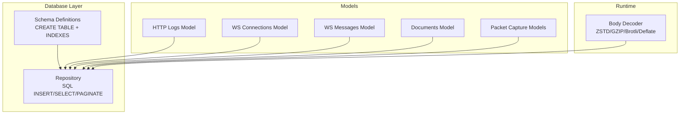
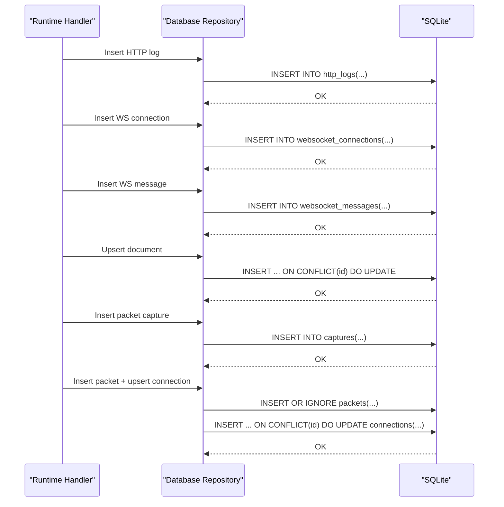
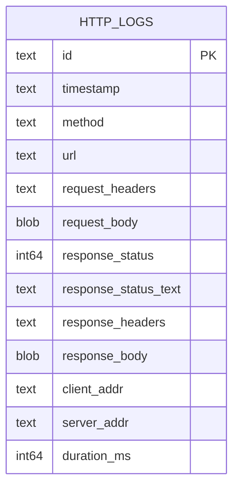
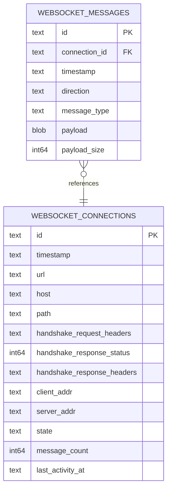
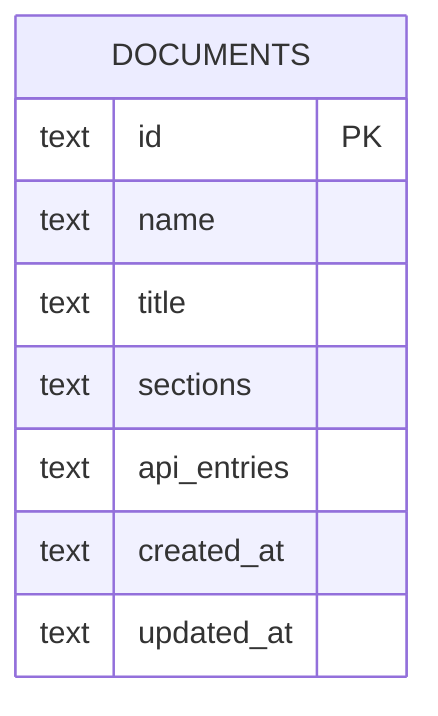
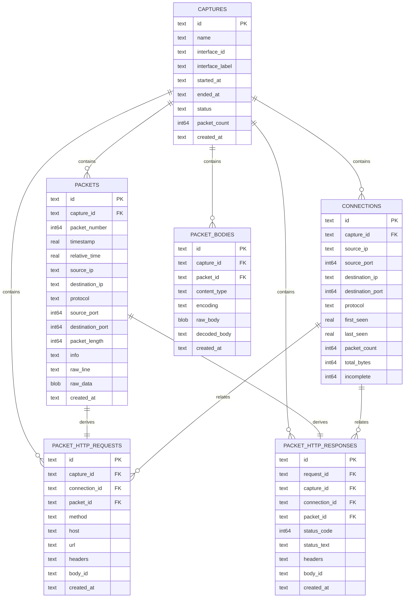
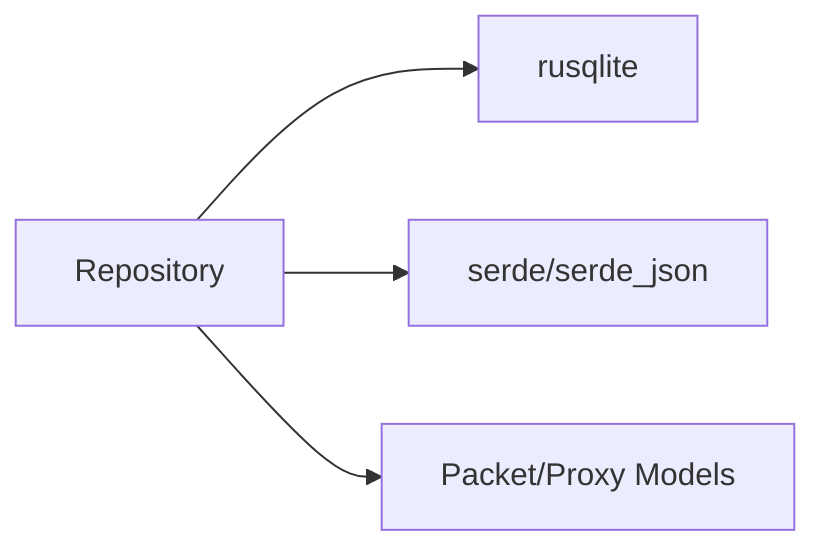

# Database Design

<cite>
**Referenced Files in This Document**
- [schema.rs](file://src-tauri/src/db/schema.rs)
- [repository.rs](file://src-tauri/src/db/repository.rs)
- [types.rs](file://src-tauri/src/packet_capture/types.rs)
- [state.rs](file://src-tauri/src/proxy/state.rs)
- [body_decoder.rs](file://src-tauri/src/proxy/lifecycle/body_decoder.rs)
- [Cargo.toml](file://src-tauri/Cargo.toml)
</cite>

## Table of Contents
1. [Introduction](#introduction)
2. [Project Structure](#project-structure)
3. [Core Components](#core-components)
4. [Architecture Overview](#architecture-overview)
5. [Detailed Component Analysis](#detailed-component-analysis)
6. [Dependency Analysis](#dependency-analysis)
7. [Performance Considerations](#performance-considerations)
8. [Troubleshooting Guide](#troubleshooting-guide)
9. [Conclusion](#conclusion)
10. [Appendices](#appendices)

## Introduction
This document describes the database schema and data model used by AppRecon’s backend (Tauri/Rust). It focuses on four primary data domains:
- HTTP logs: captured request/response pairs
- WebSocket connections and messages: handshake and message streams
- Documents: structured markdown-like content with sections and API entries
- Packet capture records: network packets, connections, and HTTP requests/responses derived from captures

It covers entity relationships, field definitions, data types, primary/foreign keys, indexes, constraints, validation and integrity rules, data access patterns, caching strategies, performance considerations, lifecycle and retention, compression, migrations, and security and backup/disaster recovery.

## Project Structure
The database schema and repository logic are implemented in the Tauri Rust backend:
- Schema definitions are declared as SQL constants and executed during initialization
- Repository module encapsulates SQLite operations, transactions, and paginated queries
- Data models for packet capture and proxy records define typed structures used by the repository
- Content decoding logic handles HTTP body compression including ZSTD

**Diagram sources**
- [schema.rs:1-176](file://src-tauri/src/db/schema.rs#L1-L176)
- [repository.rs:37-58](file://src-tauri/src/db/repository.rs#L37-L58)
- [types.rs:46-91](file://src-tauri/src/packet_capture/types.rs#L46-L91)
- [state.rs:7-93](file://src-tauri/src/proxy/state.rs#L7-L93)
- [body_decoder.rs:178-234](file://src-tauri/src/proxy/lifecycle/body_decoder.rs#L178-L234)

**Section sources**
- [schema.rs:1-176](file://src-tauri/src/db/schema.rs#L1-L176)
- [repository.rs:37-58](file://src-tauri/src/db/repository.rs#L37-L58)

## Core Components
- HTTP logs table stores request/response metadata and bodies as JSON-serialized headers and binary blobs. Indexes support timestamp, method, and URL filtering.
- WebSocket connections table tracks handshake metadata and state; messages table references connections with cascade deletion.
- Documents table stores structured content (sections and API entries) as JSON, with an index on updated_at for sorting.
- Packet capture schema includes captures, packets, connections, packet-derived HTTP requests/responses, and packet bodies. Foreign keys enforce referential integrity and cascading deletes.

Constraints and indexes:
- Primary keys: id on all tables except packet_bodies
- Foreign keys: packets.capture_id → captures.id; connections.capture_id → captures.id; packet_http_requests.capture_id → captures.id; packet_http_responses.request_id → packet_http_requests.id; packet_bodies.capture_id → captures.id; websocket_messages.connection_id → websocket_connections.id
- Unique constraints: none explicit; captures.name is unique conceptually via application logic
- Indexes: timestamp, method, url on http_logs; timestamps and host/url on websocket_connections; timestamps and connection_id on websocket_messages; started_at on captures; composite indexes on packets(capture_id, packet_number), packets(protocol), packets(source_ip, source_port), packets(destination_ip, destination_port); indexes on connections(capture_id), packet_http_requests(capture_id), packet_http_responses(capture_id), packet_bodies(capture_id)

Validation and integrity:
- Foreign keys enabled via PRAGMA foreign_keys = ON
- Transactions used for atomic packet insertion
- ON CONFLICT handling for deduplication/upserts (e.g., connections upsert)
- JSON serialization/deserialization for headers and structured fields

**Section sources**
- [schema.rs:1-176](file://src-tauri/src/db/schema.rs#L1-L176)
- [repository.rs:49-58](file://src-tauri/src/db/repository.rs#L49-L58)
- [repository.rs:100-163](file://src-tauri/src/db/repository.rs#L100-L163)
- [repository.rs:134-151](file://src-tauri/src/db/repository.rs#L134-L151)

## Architecture Overview
The database layer is initialized at startup and exposes typed repositories for each domain. Data flows from runtime handlers into the repository, which executes SQL statements and returns strongly-typed records.

**Diagram sources**
- [repository.rs:59-81](file://src-tauri/src/db/repository.rs#L59-L81)
- [repository.rs:373-403](file://src-tauri/src/db/repository.rs#L373-L403)
- [repository.rs:405-432](file://src-tauri/src/db/repository.rs#L405-L432)
- [repository.rs:223-251](file://src-tauri/src/db/repository.rs#L223-L251)
- [repository.rs:60-81](file://src-tauri/src/db/repository.rs#L60-L81)
- [repository.rs:96-163](file://src-tauri/src/db/repository.rs#L96-L163)

## Detailed Component Analysis

### HTTP Logs Data Model
- Purpose: Persist intercepted HTTP traffic for inspection and analysis
- Fields:
  - id: TEXT (PK)
  - timestamp: TEXT (RFC 3339 string)
  - method: TEXT
  - url: TEXT
  - request_headers: TEXT (JSON)
  - request_body: BLOB
  - response_status: INTEGER
  - response_status_text: TEXT
  - response_headers: TEXT (JSON)
  - response_body: BLOB
  - client_addr: TEXT
  - server_addr: TEXT
  - duration_ms: INTEGER
- Indexes: timestamp, method, url
- Access patterns:
  - Insert single log
  - Paginated retrieval ordered by timestamp desc
  - Filtered queries by search, path, methods, status codes, and scope
  - Tree aggregation by host/path/method
  - Clear/delete by id
- Validation:
  - JSON serialization for headers
  - Timestamp stored as RFC 3339 string
  - Optional response fields
- Integrity:
  - No foreign keys
  - JSON parsing with fallbacks

**Diagram sources**
- [schema.rs:1-21](file://src-tauri/src/db/schema.rs#L1-L21)
- [repository.rs:259-293](file://src-tauri/src/db/repository.rs#L259-L293)

**Section sources**
- [schema.rs:1-21](file://src-tauri/src/db/schema.rs#L1-L21)
- [repository.rs:259-293](file://src-tauri/src/db/repository.rs#L259-L293)
- [repository.rs:535-570](file://src-tauri/src/db/repository.rs#L535-L570)
- [repository.rs:572-748](file://src-tauri/src/db/repository.rs#L572-L748)
- [repository.rs:758-918](file://src-tauri/src/db/repository.rs#L758-L918)

### WebSocket Connections and Messages Data Model
- Purpose: Track WebSocket handshakes and bidirectional message streams
- Connections:
  - id: TEXT (PK)
  - timestamp: TEXT (RFC 3339)
  - url: TEXT
  - host: TEXT
  - path: TEXT
  - handshake_request_headers: TEXT (JSON)
  - handshake_response_status: INTEGER
  - handshake_response_headers: TEXT (JSON)
  - client_addr: TEXT
  - server_addr: TEXT
  - state: TEXT enum (open/closed/error)
  - message_count: INTEGER (default 0)
  - last_activity_at: TEXT (RFC 3339)
- Messages:
  - id: TEXT (PK)
  - connection_id: TEXT (FK to connections.id, ON DELETE CASCADE)
  - timestamp: TEXT (RFC 3339)
  - direction: TEXT enum (inbound/outbound)
  - message_type: TEXT enum (text/binary/ping/pong/close)
  - payload: BLOB
  - payload_size: INTEGER
- Indexes: timestamp on connections; url/host on connections; connection_id and timestamp on messages
- Access patterns:
  - Insert connection and message
  - Paginated connections with optional search, scope, and state filters
  - Retrieve messages by connection id
  - Clear connections and messages
- Validation:
  - Enum values mapped to strings
  - JSON headers serialized/deserialized
- Integrity:
  - Foreign key with cascade delete ensures orphan cleanup

**Diagram sources**
- [schema.rs:23-56](file://src-tauri/src/db/schema.rs#L23-L56)
- [repository.rs:373-432](file://src-tauri/src/db/repository.rs#L373-L432)
- [repository.rs:450-533](file://src-tauri/src/db/repository.rs#L450-L533)

**Section sources**
- [schema.rs:23-56](file://src-tauri/src/db/schema.rs#L23-L56)
- [repository.rs:373-432](file://src-tauri/src/db/repository.rs#L373-L432)
- [repository.rs:450-533](file://src-tauri/src/db/repository.rs#L450-L533)

### Documents Data Model
- Purpose: Store structured documents with sections and API entries
- Fields:
  - id: TEXT (PK)
  - name: TEXT
  - title: TEXT
  - sections: TEXT (JSON)
  - api_entries: TEXT (JSON)
  - created_at: TEXT (RFC 3339)
  - updated_at: TEXT (RFC 3339)
- Indexes: updated_at
- Access patterns:
  - Upsert by id (ON CONFLICT DO UPDATE)
  - List all ordered by created_at
  - Delete by id
- Validation:
  - JSON serialization with defaults for missing/invalid values
- Integrity:
  - No foreign keys

**Diagram sources**
- [schema.rs:58-70](file://src-tauri/src/db/schema.rs#L58-L70)
- [repository.rs:223-251](file://src-tauri/src/db/repository.rs#L223-L251)
- [repository.rs:211-221](file://src-tauri/src/db/repository.rs#L211-L221)

**Section sources**
- [schema.rs:58-70](file://src-tauri/src/db/schema.rs#L58-L70)
- [repository.rs:211-251](file://src-tauri/src/db/repository.rs#L211-L251)

### Packet Capture Data Model
- Purpose: Persist low-level packet captures, derived HTTP requests/responses, and connection summaries
- Captures:
  - id: TEXT (PK)
  - name: TEXT
  - interface_id: TEXT
  - interface_label: TEXT
  - started_at: TEXT (RFC 3339)
  - ended_at: TEXT (optional)
  - status: TEXT
  - packet_count: INTEGER (default 0)
  - created_at: TEXT (RFC 3339)
- Packets:
  - id: TEXT (PK)
  - capture_id: TEXT (FK to captures.id, ON DELETE CASCADE)
  - packet_number: INTEGER
  - timestamp: REAL
  - relative_time: REAL
  - source_ip: TEXT
  - destination_ip: TEXT
  - protocol: TEXT
  - source_port: INTEGER (nullable)
  - destination_port: INTEGER (nullable)
  - packet_length: INTEGER
  - info: TEXT
  - raw_line: TEXT
  - raw_data: BLOB
  - created_at: TEXT (RFC 3339)
- Connections:
  - id: TEXT (PK)
  - capture_id: TEXT (FK to captures.id, ON DELETE CASCADE)
  - source_ip: TEXT
  - source_port: INTEGER (nullable)
  - destination_ip: TEXT
  - destination_port: INTEGER (nullable)
  - protocol: TEXT
  - first_seen: REAL
  - last_seen: REAL
  - packet_count: INTEGER (default 0)
  - total_bytes: INTEGER (default 0)
  - incomplete: INTEGER (default 1)
- Packet HTTP Requests:
  - id: TEXT (PK)
  - capture_id: TEXT (FK to captures.id, ON DELETE CASCADE)
  - connection_id: TEXT (nullable FK to connections.id, ON DELETE SET NULL)
  - packet_id: TEXT (nullable FK to packets.id, ON DELETE SET NULL)
  - method: TEXT
  - host: TEXT
  - url: TEXT
  - headers: TEXT (JSON)
  - body_id: TEXT (nullable)
  - created_at: TEXT (RFC 3339)
- Packet HTTP Responses:
  - id: TEXT (PK)
  - request_id: TEXT (nullable FK to packet_http_requests.id, ON DELETE SET NULL)
  - capture_id: TEXT (FK to captures.id, ON DELETE CASCADE)
  - connection_id: TEXT (nullable FK to connections.id, ON DELETE SET NULL)
  - packet_id: TEXT (nullable FK to packets.id, ON DELETE SET NULL)
  - status_code: INTEGER
  - status_text: TEXT
  - headers: TEXT (JSON)
  - body_id: TEXT (nullable)
  - created_at: TEXT (RFC 3339)
- Packet Bodies:
  - id: TEXT (PK)
  - capture_id: TEXT (FK to captures.id, ON DELETE CASCADE)
  - packet_id: TEXT (nullable FK to packets.id, ON DELETE SET NULL)
  - content_type: TEXT
  - encoding: TEXT
  - raw_body: BLOB
  - decoded_body: TEXT
  - created_at: TEXT (RFC 3339)
- Indexes:
  - captures(started_at)
  - packets(capture_id, packet_number), protocol, source_ip/source_port, destination_ip/destination_port
  - connections(capture_id)
  - packet_http_requests(capture_id)
  - packet_http_responses(capture_id)
  - packet_bodies(capture_id)
- Access patterns:
  - Insert capture and finish capture
  - Insert packet and upsert connection atomically
  - Paginated packet listing
  - Derived HTTP request/response lookup
- Validation:
  - JSON headers
  - Nullable ports and optional references
- Integrity:
  - Cascading deletes from captures to dependent tables
  - SET NULL on derived references when base rows removed

**Diagram sources**
- [schema.rs:72-175](file://src-tauri/src/db/schema.rs#L72-L175)
- [repository.rs:60-81](file://src-tauri/src/db/repository.rs#L60-L81)
- [repository.rs:96-163](file://src-tauri/src/db/repository.rs#L96-L163)
- [types.rs:46-91](file://src-tauri/src/packet_capture/types.rs#L46-L91)

**Section sources**
- [schema.rs:72-175](file://src-tauri/src/db/schema.rs#L72-L175)
- [repository.rs:60-81](file://src-tauri/src/db/repository.rs#L60-L81)
- [repository.rs:96-163](file://src-tauri/src/db/repository.rs#L96-L163)
- [types.rs:46-91](file://src-tauri/src/packet_capture/types.rs#L46-L91)

### Data Validation and Business Rules
- HTTP logs:
  - JSON headers validated via serde; invalid JSON falls back to empty/default
  - Optional response fields supported
- WebSocket:
  - Enums mapped to canonical strings
  - Message count and last activity updated on insert
- Documents:
  - Upsert semantics preserve created_at while updating modified timestamps
- Packet capture:
  - Atomic transaction inserts packet and upserts connection
  - ON CONFLICT updates counters and timestamps
  - Cascading deletes maintain referential integrity

**Section sources**
- [repository.rs:259-293](file://src-tauri/src/db/repository.rs#L259-L293)
- [repository.rs:373-432](file://src-tauri/src/db/repository.rs#L373-L432)
- [repository.rs:223-251](file://src-tauri/src/db/repository.rs#L223-L251)
- [repository.rs:100-163](file://src-tauri/src/db/repository.rs#L100-L163)

### Data Access Patterns and Pagination
- HTTP logs:
  - Paginated retrieval with configurable page size and sort order
  - Filtered queries with LIKE and IN clauses; scope filtering supports wildcard patterns
  - Tree aggregation by host/path/method for UI navigation
- WebSocket:
  - Paginated connections with optional search, scope, and state filters
  - Messages retrieved by connection id
- Packets:
  - Paginated listing by capture id and packet number
  - Composite indexes optimize protocol and IP/port scans

**Section sources**
- [repository.rs:165-209](file://src-tauri/src/db/repository.rs#L165-L209)
- [repository.rs:535-570](file://src-tauri/src/db/repository.rs#L535-L570)
- [repository.rs:572-748](file://src-tauri/src/db/repository.rs#L572-L748)
- [repository.rs:450-533](file://src-tauri/src/db/repository.rs#L450-L533)

### Caching Strategies and Performance Considerations
- SQLite configuration:
  - Foreign keys enabled for integrity
  - Journal mode set to WAL for concurrency and durability
- Indexes:
  - Timestamp-based ordering for recent-first queries
  - Multi-column indexes for packet and connection lookups
- Transactions:
  - Single transaction for packet insert plus connection upsert reduces overhead
- JSON vs BLOB:
  - Headers stored as JSON strings; bodies as BLOBs to avoid unnecessary conversions
- Query patterns:
  - Use indexed columns (timestamp, method, url, host, connection_id) for filters
  - Prefer composite indexes for multi-column predicates

**Section sources**
- [repository.rs:49-58](file://src-tauri/src/db/repository.rs#L49-L58)
- [schema.rs:18-21](file://src-tauri/src/db/schema.rs#L18-L21)
- [schema.rs:51-56](file://src-tauri/src/db/schema.rs#L51-L56)
- [schema.rs:166-175](file://src-tauri/src/db/schema.rs#L166-L175)
- [repository.rs:100-163](file://src-tauri/src/db/repository.rs#L100-L163)

### Data Lifecycle Management, Retention, and Archival
- Current schema does not define explicit retention policies or archival procedures
- Suggested practices (conceptual):
  - Partition captures by date ranges
  - Archive older captures to external storage and prune raw_data where appropriate
  - Implement periodic cleanup jobs for very old records
  - Compress historical packet bodies using ZSTD at ingestion time (see Compression section)

[No sources needed since this section provides general guidance]

### ZSTD Compression Implementation
- Ingestion-time compression:
  - Packet bodies can be compressed using ZSTD before storage
  - Application-level encoding supports zstd with configurable level
- Runtime decompression:
  - HTTP body decoder supports zstd decoding for request/response bodies
  - Encoders/decoders available for gzip, br, deflate, and zstd
- Recommendations:
  - Compress large packet bodies and HTTP bodies exceeding thresholds
  - Store content-type and encoding metadata alongside raw bodies for accurate decoding

**Section sources**
- [body_decoder.rs:188-189](file://src-tauri/src/proxy/lifecycle/body_decoder.rs#L188-L189)
- [body_decoder.rs:228-228](file://src-tauri/src/proxy/lifecycle/body_decoder.rs#L228-L228)
- [Cargo.toml:49-49](file://src-tauri/Cargo.toml#L49-L49)

### Data Migration Paths and Version Management
- Schema evolution:
  - New tables and indexes can be added via additional CREATE statements
  - Use ALTER TABLE for column additions; ensure default values and NOT NULL constraints are compatible
- Versioning:
  - Application version is tracked in Cargo.toml; schema version can be managed separately
  - Consider adding a schema_version table to coordinate migrations
- Migration strategy:
  - Backward-compatible changes: additive schema changes
  - Breaking changes: create new tables, copy data, swap references, drop old tables

**Section sources**
- [schema.rs:1-176](file://src-tauri/src/db/schema.rs#L1-L176)
- [Cargo.toml:3-6](file://src-tauri/Cargo.toml#L3-L6)

### Data Security Measures, Backup, and Disaster Recovery
- Transport/security:
  - TLS-enabled clients and servers in proxy stack
  - Certificate generation and management via rcgen
- Storage:
  - SQLite WAL mode improves durability
  - Consider encrypting the database file at rest (external to current schema)
- Backup:
  - WAL checkpointing and file copying for hot backups
  - Logical dumps for cross-platform compatibility
- Disaster recovery:
  - Regular offsite backups
  - Point-in-time recovery via WAL archives

[No sources needed since this section provides general guidance]

## Dependency Analysis
The repository depends on rusqlite for SQLite operations and serde for JSON serialization. Packet capture and proxy models define the data contracts used by the repository.

**Diagram sources**
- [repository.rs:9-14](file://src-tauri/src/db/repository.rs#L9-L14)
- [types.rs:1-114](file://src-tauri/src/packet_capture/types.rs#L1-L114)
- [state.rs:1-441](file://src-tauri/src/proxy/state.rs#L1-L441)

**Section sources**
- [repository.rs:9-14](file://src-tauri/src/db/repository.rs#L9-L14)
- [types.rs:1-114](file://src-tauri/src/packet_capture/types.rs#L1-L114)
- [state.rs:1-441](file://src-tauri/src/proxy/state.rs#L1-L441)

## Performance Considerations
- Use indexed columns for filtering (timestamp, method, url, host, connection_id)
- Prefer composite indexes for multi-column predicates (packets: capture_id + packet_number; packets: ip/port)
- Batch reads/writes; leverage transactions for atomicity
- Avoid SELECT *; fetch only required columns
- Consider partitioning large captures by date ranges

[No sources needed since this section provides general guidance]

## Troubleshooting Guide
- Malformed rows:
  - Rows with invalid JSON or timestamps are skipped with warnings during deserialization
- Foreign key violations:
  - Ensure parent rows exist before inserting children
  - Verify cascading deletes are intended for cleanup
- Large payloads:
  - Consider compressing bodies with ZSTD to reduce storage and improve I/O
- Pagination issues:
  - Confirm sort order and page boundaries align with query expectations

**Section sources**
- [repository.rs:1124-1126](file://src-tauri/src/db/repository.rs#L1124-L1126)
- [repository.rs:1154-1158](file://src-tauri/src/db/repository.rs#L1154-L1158)
- [repository.rs:1170-1174](file://src-tauri/src/db/repository.rs#L1170-L1174)

## Conclusion
AppRecon’s database schema is designed around four core domains with clear relationships and indexes optimized for common queries. Integrity is enforced via foreign keys and transactions, while JSON and BLOB fields accommodate flexible and large payloads. The repository provides robust CRUD and pagination APIs, and the runtime includes ZSTD support for efficient compression. Future enhancements could include retention policies, encryption, and formalized migration/versioning.

## Appendices

### Sample Data Structures
- HTTP log record fields and JSON header serialization
- WebSocket connection and message enums mapped to strings
- Document record with JSON sections and API entries
- Packet capture record, stored packet record, and connection record

**Section sources**
- [repository.rs:935-1009](file://src-tauri/src/db/repository.rs#L935-L1009)
- [repository.rs:1046-1113](file://src-tauri/src/db/repository.rs#L1046-L1113)
- [repository.rs:1011-1024](file://src-tauri/src/db/repository.rs#L1011-L1024)
- [types.rs:46-91](file://src-tauri/src/packet_capture/types.rs#L46-L91)