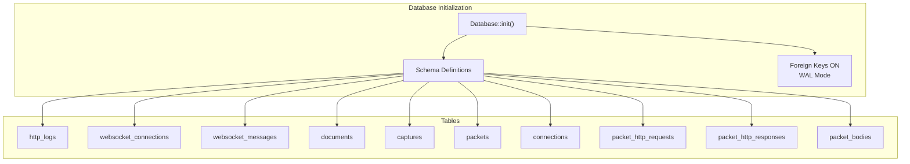
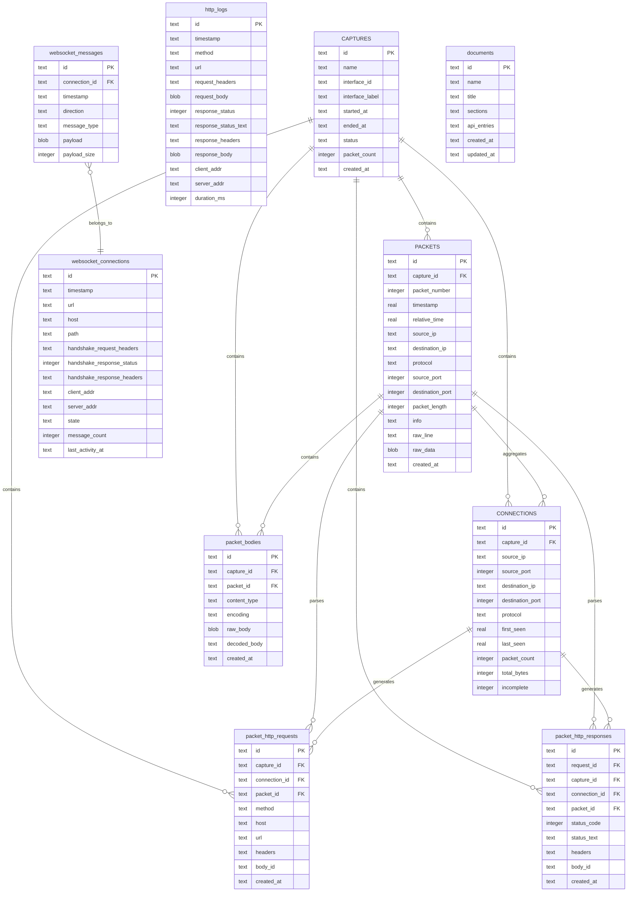
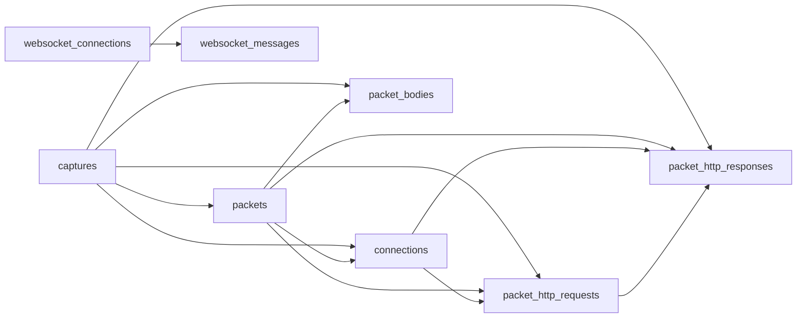

# Database Schema

<cite>
**Referenced Files in This Document**
- [schema.rs](file://src-tauri/src/db/schema.rs)
- [repository.rs](file://src-tauri/src/db/repository.rs)
- [types.rs](file://src-tauri/src/packet_capture/types.rs)
- [state.rs](file://src-tauri/src/proxy/state.rs)
- [websocket.rs](file://src-tauri/src/proxy/websocket.rs)
- [mod.rs](file://src-tauri/src/history/mod.rs)
- [Cargo.toml](file://src-tauri/Cargo.toml)
</cite>

## Table of Contents
1. [Introduction](#introduction)
2. [Project Structure](#project-structure)
3. [Core Components](#core-components)
4. [Architecture Overview](#architecture-overview)
5. [Detailed Component Analysis](#detailed-component-analysis)
6. [Dependency Analysis](#dependency-analysis)
7. [Performance Considerations](#performance-considerations)
8. [Troubleshooting Guide](#troubleshooting-guide)
9. [Conclusion](#conclusion)

## Introduction
This document describes the complete database schema used by AppRecon (formerly known as 0xbuffer). It covers all tables involved in HTTP traffic logging, WebSocket monitoring, packet capture, and document storage. For each table, we define fields, data types, primary keys, foreign keys, constraints, and indexes. We also explain entity relationships, referential integrity rules, indexing strategies, and performance considerations. Business rules enforced by the schema are highlighted to help developers and operators understand how data is stored and queried.

## Project Structure
The database schema is defined and initialized in the Rust backend under the Tauri application. The schema is split into logical groups:
- HTTP logs and filtering
- WebSocket connections and messages
- Documents (for API documentation)
- Packet capture, connections, and HTTP request/response parsing
- Packet bodies for decoded content

Initialization and migrations are handled by a dedicated module that creates tables and indexes on application startup.

**Diagram sources**
- [schema.rs:1-176](file://src-tauri/src/db/schema.rs#L1-L176)
- [repository.rs:49-58](file://src-tauri/src/db/repository.rs#L49-L58)

**Section sources**
- [schema.rs:1-176](file://src-tauri/src/db/schema.rs#L1-L176)
- [repository.rs:49-58](file://src-tauri/src/db/repository.rs#L49-L58)

## Core Components
This section summarizes the purpose and key characteristics of each table group.

- http_logs: Stores HTTP request/response pairs captured by the proxy, including headers, bodies, timestamps, and client/server addresses.
- websocket_connections and websocket_messages: Track WebSocket handshakes and message exchanges with direction and payload metadata.
- documents: Stores structured API documentation entries with JSON sections and API entries.
- captures, packets, connections: Packet capture lifecycle, packet-level details, and connection aggregation.
- packet_http_requests, packet_http_responses, packet_bodies: HTTP parsing results linked to packets and captures, with optional body decoding.

**Section sources**
- [schema.rs:1-176](file://src-tauri/src/db/schema.rs#L1-L176)

## Architecture Overview
The schema enforces referential integrity using foreign keys. The packet capture tables form a hierarchy: captures -> packets -> connections, with optional links to HTTP parsing tables. WebSocket tables link messages to connections. HTTP logs are standalone but support filtering and pagination.

**Diagram sources**
- [schema.rs:1-176](file://src-tauri/src/db/schema.rs#L1-L176)

## Detailed Component Analysis

### http_logs
Purpose: Persist HTTP requests and responses captured by the proxy, enabling filtering, pagination, and inspection.

Fields and types:
- id: text (primary key)
- timestamp: text (RFC 3339 string)
- method: text
- url: text
- request_headers: text (JSON serialized)
- request_body: blob
- response_status: integer
- response_status_text: text
- response_headers: text (JSON serialized)
- response_body: blob
- client_addr: text
- server_addr: text
- duration_ms: integer

Constraints and indexes:
- Primary key: id
- Indexes: timestamp, method, url

Business rules:
- request_headers and response_headers are stored as JSON strings.
- duration_ms is currently unused in inserts; applications can populate it later.
- Filtering supports search, path substring, methods, and status codes.

Typical operations:
- Insert a new log entry
- Paginate and filter logs
- Clear or delete specific entries

**Section sources**
- [schema.rs:1-21](file://src-tauri/src/db/schema.rs#L1-L21)
- [repository.rs:259-293](file://src-tauri/src/db/repository.rs#L259-L293)
- [repository.rs:303-348](file://src-tauri/src/db/repository.rs#L303-L348)
- [repository.rs:535-570](file://src-tauri/src/db/repository.rs#L535-L570)
- [repository.rs:572-748](file://src-tauri/src/db/repository.rs#L572-L748)

### websocket_connections
Purpose: Track WebSocket handshake events and connection state.

Fields and types:
- id: text (primary key)
- timestamp: text (RFC 3339 string)
- url: text
- host: text
- path: text
- handshake_request_headers: text (JSON serialized)
- handshake_response_status: integer
- handshake_response_headers: text (JSON serialized)
- client_addr: text
- server_addr: text
- state: text ("open", "closed", "error")
- message_count: integer (default 0)
- last_activity_at: text (RFC 3339 string)

Constraints and indexes:
- Primary key: id
- Indexes: timestamp, host, url

Typical operations:
- Insert a new connection record
- Paginate and filter by search, scope, and state
- Clear or delete specific connections

**Section sources**
- [schema.rs:23-56](file://src-tauri/src/db/schema.rs#L23-L56)
- [repository.rs:373-403](file://src-tauri/src/db/repository.rs#L373-L403)
- [repository.rs:450-498](file://src-tauri/src/db/repository.rs#L450-L498)
- [websocket.rs:62-94](file://src-tauri/src/proxy/websocket.rs#L62-L94)

### websocket_messages
Purpose: Store individual WebSocket frames with direction and payload metadata.

Fields and types:
- id: text (primary key)
- connection_id: text (foreign key to websocket_connections)
- timestamp: text (RFC 3339 string)
- direction: text ("inbound", "outbound")
- message_type: text ("text", "binary", "ping", "pong", "close")
- payload: blob
- payload_size: integer

Constraints and indexes:
- Primary key: id
- Foreign key: connection_id -> websocket_connections(id) ON DELETE CASCADE
- Indexes: connection_id, timestamp

Typical operations:
- Insert a message and increment message_count on the parent connection
- Retrieve messages for a given connection
- Clear messages and connections

**Section sources**
- [schema.rs:40-49](file://src-tauri/src/db/schema.rs#L40-L49)
- [repository.rs:405-432](file://src-tauri/src/db/repository.rs#L405-L432)
- [repository.rs:518-533](file://src-tauri/src/db/repository.rs#L518-L533)

### documents
Purpose: Persist structured API documentation with sections and API entries.

Fields and types:
- id: text (primary key)
- name: text
- title: text
- sections: text (JSON serialized)
- api_entries: text (JSON serialized)
- created_at: text (RFC 3339 string)
- updated_at: text (RFC 3339 string)

Constraints and indexes:
- Primary key: id
- Indexes: updated_at

Typical operations:
- Upsert a document (ON CONFLICT id UPDATE)
- List all documents ordered by creation date
- Delete a document

**Section sources**
- [schema.rs:58-70](file://src-tauri/src/db/schema.rs#L58-L70)
- [repository.rs:223-251](file://src-tauri/src/db/repository.rs#L223-L251)
- [repository.rs:211-221](file://src-tauri/src/db/repository.rs#L211-L221)

### captures
Purpose: Lifecycle and metadata for packet capture sessions.

Fields and types:
- id: text (primary key)
- name: text
- interface_id: text
- interface_label: text
- started_at: text (RFC 3339 string)
- ended_at: text
- status: text ("running", "stopped")
- packet_count: integer (default 0)
- created_at: text (RFC 3339 string)

Constraints and indexes:
- Primary key: id
- Indexes: started_at

Typical operations:
- Insert a new capture session
- Finish a capture session by setting ended_at and status

**Section sources**
- [schema.rs:72-83](file://src-tauri/src/db/schema.rs#L72-L83)
- [repository.rs:60-81](file://src-tauri/src/db/repository.rs#L60-L81)
- [repository.rs:83-94](file://src-tauri/src/db/repository.rs#L83-L94)

### packets
Purpose: Per-packet details and raw data.

Fields and types:
- id: text (primary key)
- capture_id: text (foreign key to captures)
- packet_number: integer
- timestamp: real (seconds)
- relative_time: real (seconds)
- source_ip: text
- destination_ip: text
- protocol: text
- source_port: integer
- destination_port: integer
- packet_length: integer
- info: text
- raw_line: text
- raw_data: blob
- created_at: text (RFC 3339 string)

Constraints and indexes:
- Primary key: id
- Foreign key: capture_id -> captures(id) ON DELETE CASCADE
- Indexes: capture_id+packet_number, protocol, source_ip+source_port, destination_ip+destination_port

Typical operations:
- Insert a packet (INSERT OR IGNORE)
- Paginate packets for a capture
- Update capture packet_count

**Section sources**
- [schema.rs:85-102](file://src-tauri/src/db/schema.rs#L85-L102)
- [repository.rs:96-163](file://src-tauri/src/db/repository.rs#L96-L163)
- [repository.rs:165-209](file://src-tauri/src/db/repository.rs#L165-L209)

### connections
Purpose: Aggregated connection state derived from packets.

Fields and types:
- id: text (primary key)
- capture_id: text (foreign key to captures)
- source_ip: text
- source_port: integer
- destination_ip: text
- destination_port: integer
- protocol: text
- first_seen: real (seconds)
- last_seen: real (seconds)
- packet_count: integer (default 0)
- total_bytes: integer (default 0)
- incomplete: integer (default 1)

Constraints and indexes:
- Primary key: id
- Foreign key: capture_id -> captures(id) ON DELETE CASCADE
- Indexes: capture_id

Typical operations:
- Insert or update connection with ON CONFLICT (increment counters)
- Update capture packet_count

**Section sources**
- [schema.rs:104-118](file://src-tauri/src/db/schema.rs#L104-L118)
- [repository.rs:129-163](file://src-tauri/src/db/repository.rs#L129-L163)

### packet_http_requests
Purpose: HTTP request extracted from a packet.

Fields and types:
- id: text (primary key)
- capture_id: text (foreign key to captures)
- connection_id: text (foreign key to connections)
- packet_id: text (foreign key to packets)
- method: text
- host: text
- url: text
- headers: text (JSON serialized)
- body_id: text
- created_at: text (RFC 3339 string)

Constraints and indexes:
- Primary key: id
- Foreign keys: capture_id -> captures(id) ON DELETE CASCADE
- Foreign keys: connection_id -> connections(id) ON DELETE SET NULL
- Foreign keys: packet_id -> packets(id) ON DELETE SET NULL
- Indexes: capture_id

Typical operations:
- Insert a parsed HTTP request
- Link to packets and connections

**Section sources**
- [schema.rs:120-134](file://src-tauri/src/db/schema.rs#L120-L134)
- [types.rs:60-76](file://src-tauri/src/packet_capture/types.rs#L60-L76)

### packet_http_responses
Purpose: HTTP response extracted from a packet.

Fields and types:
- id: text (primary key)
- request_id: text (foreign key to packet_http_requests)
- capture_id: text (foreign key to captures)
- connection_id: text (foreign key to connections)
- packet_id: text (foreign key to packets)
- status_code: integer
- status_text: text
- headers: text (JSON serialized)
- body_id: text
- created_at: text (RFC 3339 string)

Constraints and indexes:
- Primary key: id
- Foreign keys: request_id -> packet_http_requests(id) ON DELETE SET NULL
- Foreign keys: capture_id -> captures(id) ON DELETE CASCADE
- Foreign keys: connection_id -> connections(id) ON DELETE SET NULL
- Foreign keys: packet_id -> packets(id) ON DELETE SET NULL
- Indexes: capture_id

Typical operations:
- Insert a parsed HTTP response
- Link to the corresponding request and packet

**Section sources**
- [schema.rs:136-151](file://src-tauri/src/db/schema.rs#L136-L151)
- [types.rs:60-76](file://src-tauri/src/packet_capture/types.rs#L60-L76)

### packet_bodies
Purpose: Body content for HTTP requests/responses.

Fields and types:
- id: text (primary key)
- capture_id: text (foreign key to captures)
- packet_id: text (foreign key to packets)
- content_type: text
- encoding: text
- raw_body: blob
- decoded_body: text
- created_at: text (RFC 3339 string)

Constraints and indexes:
- Primary key: id
- Foreign keys: capture_id -> captures(id) ON DELETE CASCADE
- Foreign keys: packet_id -> packets(id) ON DELETE SET NULL
- Indexes: capture_id

Typical operations:
- Insert a body record
- Optionally decode and store decoded_body

**Section sources**
- [schema.rs:153-164](file://src-tauri/src/db/schema.rs#L153-L164)
- [types.rs:60-76](file://src-tauri/src/packet_capture/types.rs#L60-L76)

## Dependency Analysis
The schema defines clear foreign key relationships that enforce referential integrity:
- packets belongs to captures (ON DELETE CASCADE)
- connections belongs to captures (ON DELETE CASCADE)
- packet_http_requests belongs to captures, connections, and packets (ON DELETE SET NULL where applicable)
- packet_http_responses belongs to captures, connections, packets, and packet_http_requests (ON DELETE SET NULL)
- packet_bodies belongs to captures and packets (ON DELETE SET NULL)
- websocket_messages belongs to websocket_connections (ON DELETE CASCADE)

**Diagram sources**
- [schema.rs:1-176](file://src-tauri/src/db/schema.rs#L1-L176)

**Section sources**
- [schema.rs:1-176](file://src-tauri/src/db/schema.rs#L1-L176)

## Performance Considerations
Indexing strategy:
- http_logs: timestamp, method, url
- websocket_connections: timestamp, host, url
- websocket_messages: connection_id, timestamp
- documents: updated_at
- captures: started_at
- packets: capture_id+packet_number, protocol, source_ip+source_port, destination_ip+destination_port
- connections: capture_id
- packet_http_requests: capture_id
- packet_http_responses: capture_id
- packet_bodies: capture_id

WAL mode and foreign keys:
- The database initializes with WAL mode and foreign keys enabled, improving concurrency and enforcing referential integrity.

Pagination and filtering:
- Pagination is implemented with LIMIT/OFFSET for HTTP logs and WebSocket connections.
- Filtering uses dynamic SQL with parameterized conditions to avoid injection and leverage indexes.

Body storage:
- Large binary bodies are stored as blobs; consider compression or external storage for very large payloads.

**Section sources**
- [repository.rs:49-58](file://src-tauri/src/db/repository.rs#L49-L58)
- [schema.rs:18-175](file://src-tauri/src/db/schema.rs#L18-L175)
- [repository.rs:165-209](file://src-tauri/src/db/repository.rs#L165-L209)
- [repository.rs:450-498](file://src-tauri/src/db/repository.rs#L450-L498)

## Troubleshooting Guide
Common issues and resolutions:
- Foreign key constraint failures: Ensure parent records (captures, connections) exist before inserting children (packets, requests, responses, messages).
- Missing indexes: Queries on url, host, or timestamps may be slow without proper indexes; verify index existence.
- Large body storage: Blobs can grow quickly; consider pruning old entries or compressing content.
- Transaction errors: Packet insertion uses transactions; failures roll back safely.

Operational tips:
- Use paginated queries to avoid loading large datasets.
- Apply filters early to reduce result sets.
- Monitor WAL mode behavior for concurrent writes.

**Section sources**
- [repository.rs:96-163](file://src-tauri/src/db/repository.rs#L96-L163)
- [repository.rs:405-432](file://src-tauri/src/db/repository.rs#L405-L432)

## Conclusion
The AppRecon database schema is designed to support efficient HTTP and WebSocket traffic inspection, packet capture analysis, and document management. Foreign keys and indexes ensure data integrity and performance. The schema’s modular design allows incremental parsing and storage of HTTP messages from captured packets, while maintaining clean separation between transport-level data and application-level artifacts like documents and WebSocket message streams.