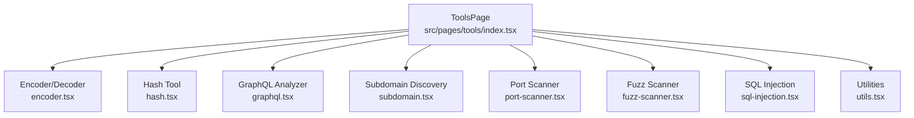
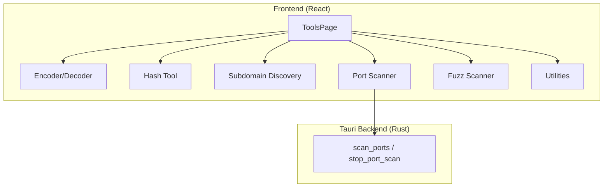
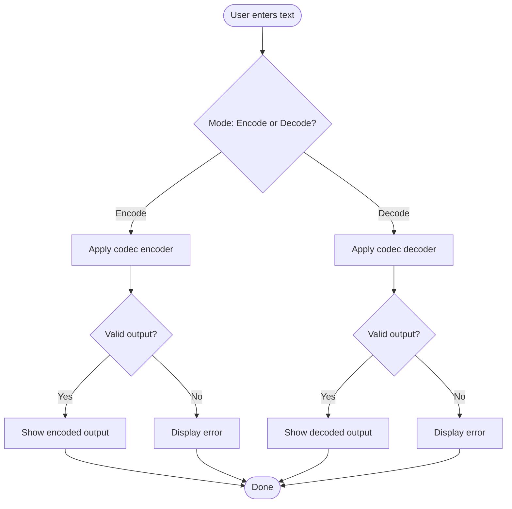
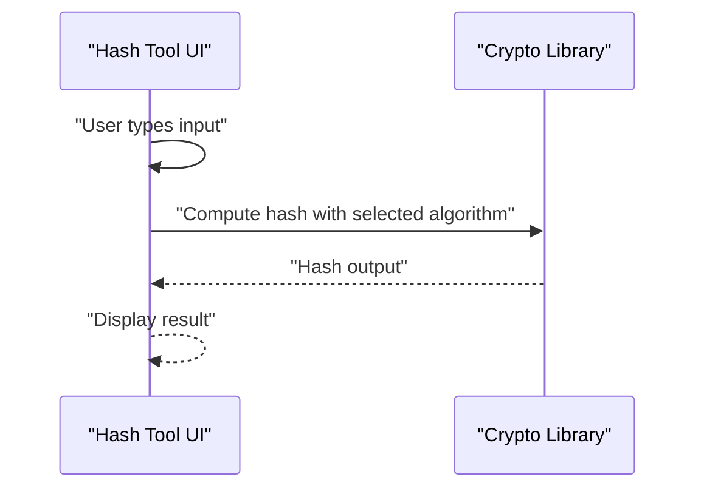
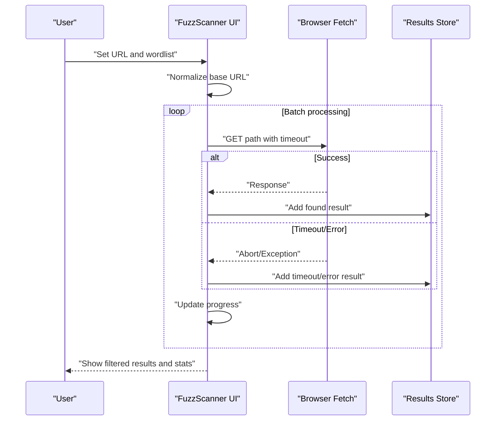
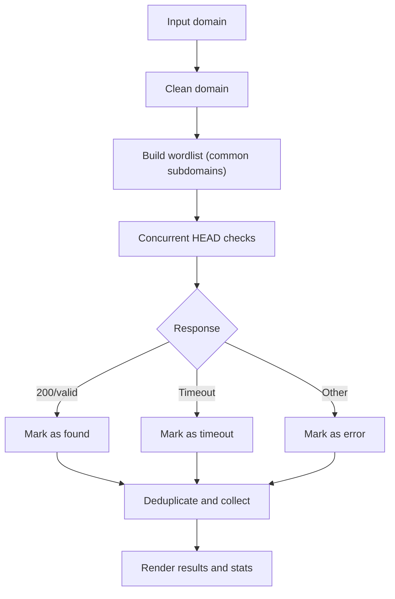
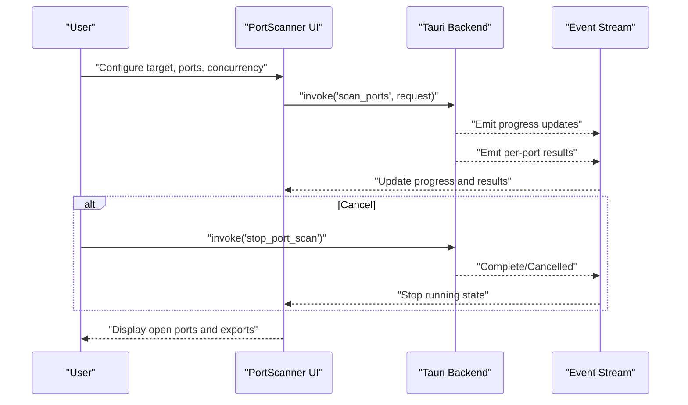
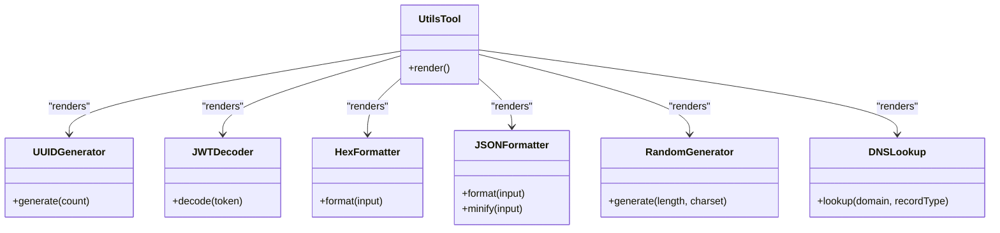
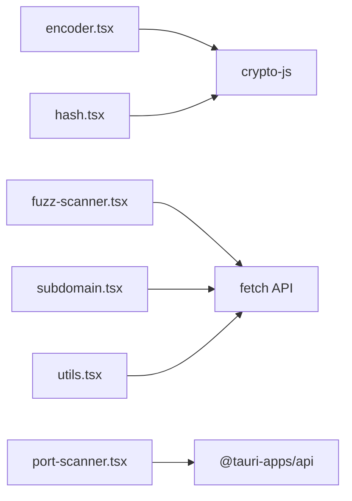

# Development Tools

<cite>
**Referenced Files in This Document**
- [index.tsx](file://src/pages/tools/index.tsx)
- [constants.ts](file://src/pages/tools/constants.ts)
- [types.ts](file://src/pages/tools/types.ts)
- [encoder.tsx](file://src/pages/tools/components/encoder.tsx)
- [hash.tsx](file://src/pages/tools/components/hash.tsx)
- [subdomain.tsx](file://src/pages/tools/components/subdomain.tsx)
- [port-scanner.tsx](file://src/pages/tools/components/port-scanner.tsx)
- [fuzz-scanner.tsx](file://src/pages/tools/components/fuzz-scanner.tsx)
- [utils.tsx](file://src/pages/tools/components/utils.tsx)
</cite>

## Table of Contents
1. [Introduction](#introduction)
2. [Project Structure](#project-structure)
3. [Core Components](#core-components)
4. [Architecture Overview](#architecture-overview)
5. [Detailed Component Analysis](#detailed-component-analysis)
6. [Dependency Analysis](#dependency-analysis)
7. [Performance Considerations](#performance-considerations)
8. [Troubleshooting Guide](#troubleshooting-guide)
9. [Conclusion](#conclusion)
10. [Appendices](#appendices)

## Introduction
This document describes AppRecon’s Development Tools suite, focusing on encoding/decoding utilities, hashing, fuzz scanning, port scanning, subdomain enumeration, GraphQL analysis, SQL injection helpers, and general utilities. It explains supported codecs, hash algorithms, fuzzing strategies, scanning workflows, and practical usage patterns for developers and penetration testers. Guidance is included for configuration, performance tuning, and integrating these tools into security testing processes.

## Project Structure
The Development Tools page is organized as a tabbed interface that hosts multiple specialized tools. Each tool is implemented as a self-contained React component with its own configuration, state, and result handling.

**Diagram sources**
- [index.tsx:15-48](file://src/pages/tools/index.tsx#L15-L48)

**Section sources**
- [index.tsx:1-49](file://src/pages/tools/index.tsx#L1-L49)
- [constants.ts:1-13](file://src/pages/tools/constants.ts#L1-L13)

## Core Components
- Encoder/Decoder: Supports URL, Base64, and Hex transformations with encode/decode modes and swap/copy/clear actions.
- Hash Tool: Computes MD5, SHA variants, SHA3 variants, and RIPEMD-160 using a cryptographic library.
- Subdomain Discovery: Brute-forces common subdomains against a target domain with concurrency and timeouts.
- Port Scanner: Asynchronous TCP scanning via Tauri backend with presets, concurrency, and optional banner grabbing.
- Fuzz Scanner: Directory/file discovery using configurable wordlists with filtering, export, and progress tracking.
- Utilities: UUID generation, JWT decoding, hex formatting, JSON formatting/minification, random string generation, and DNS lookup.

**Section sources**
- [encoder.tsx:1-207](file://src/pages/tools/components/encoder.tsx#L1-L207)
- [hash.tsx:1-126](file://src/pages/tools/components/hash.tsx#L1-L126)
- [subdomain.tsx:1-313](file://src/pages/tools/components/subdomain.tsx#L1-L313)
- [port-scanner.tsx:1-337](file://src/pages/tools/components/port-scanner.tsx#L1-L337)
- [fuzz-scanner.tsx:1-389](file://src/pages/tools/components/fuzz-scanner.tsx#L1-L389)
- [utils.tsx:1-465](file://src/pages/tools/components/utils.tsx#L1-L465)

## Architecture Overview
The tools are React components rendered inside a tabbed layout. Some tools integrate with a Rust backend via Tauri commands for heavy operations (e.g., port scanning), while others rely on browser APIs (e.g., fuzzing and DNS lookups).

**Diagram sources**
- [index.tsx:15-48](file://src/pages/tools/index.tsx#L15-L48)
- [port-scanner.tsx:83-103](file://src/pages/tools/components/port-scanner.tsx#L83-L103)

## Detailed Component Analysis

### Encoding/Decoding Utilities
- Supported codecs: URL, Base64, Hex.
- Modes: Encode and Decode with automatic conversion on input change.
- Features: Swap encode/decode, copy output, clear inputs, error reporting for invalid inputs.
- Implementation highlights:
  - Mode and type labels for UX clarity.
  - Dedicated encoder/decoder functions per codec.
  - URL decoding uses native decoding; Base64 and Hex use a cryptographic library.
  - Hex validator ensures even-length hex and valid characters.

**Diagram sources**
- [encoder.tsx:76-90](file://src/pages/tools/components/encoder.tsx#L76-L90)

**Section sources**
- [encoder.tsx:1-207](file://src/pages/tools/components/encoder.tsx#L1-L207)
- [types.ts:1-25](file://src/pages/tools/types.ts#L1-L25)

### Hash Functions
- Supported algorithms: MD5, SHA-1, SHA-224, SHA-256, SHA-384, SHA-512, SHA3-224, SHA3-256, SHA3-384, SHA3-512, RIPEMD-160.
- Behavior: On input change, computes the hash using a cryptographic library and displays the result.
- Features: Copy output, clear inputs.

**Diagram sources**
- [hash.tsx:37-51](file://src/pages/tools/components/hash.tsx#L37-L51)

**Section sources**
- [hash.tsx:1-126](file://src/pages/tools/components/hash.tsx#L1-L126)
- [types.ts:13-18](file://src/pages/tools/types.ts#L13-L18)

### Fuzz Scanner
- Purpose: Discover directories and files by brute-forcing paths against a base URL.
- Wordlists:
  - Quick: small subset of common paths.
  - Full: larger curated list.
  - Custom: upload a text file containing newline-separated paths.
- Execution:
  - Concurrency batching with controlled timeouts.
  - Tracks progress and aggregates results.
  - Distinguishes found vs. timeout vs. error outcomes.
- Results:
  - Filtering by status.
  - Export to CSV/JSON/TXT.
  - Copy URLs for found entries.

**Diagram sources**
- [fuzz-scanner.tsx:95-171](file://src/pages/tools/components/fuzz-scanner.tsx#L95-L171)

**Section sources**
- [fuzz-scanner.tsx:1-389](file://src/pages/tools/components/fuzz-scanner.tsx#L1-L389)
- [types.ts:42-49](file://src/pages/tools/types.ts#L42-L49)

### Subdomain Enumeration
- Purpose: Enumerate common subdomains for a given domain.
- Strategy:
  - Uses a curated list of common subdomains.
  - HEAD requests with concurrency and timeouts.
  - Deduplicates found URLs.
- Results:
  - Found vs. timeout vs. error.
  - Export to TXT/JSON and copy-to-clipboard.

**Diagram sources**
- [subdomain.tsx:50-139](file://src/pages/tools/components/subdomain.tsx#L50-L139)

**Section sources**
- [subdomain.tsx:1-313](file://src/pages/tools/components/subdomain.tsx#L1-L313)
- [types.ts:27-33](file://src/pages/tools/types.ts#L27-L33)

### Port Scanner
- Purpose: Scan TCP ports asynchronously with configurable concurrency and timeouts.
- Presets: Quick, Web, Top 100, Full; supports custom port ranges.
- Backend integration:
  - Invokes Tauri command to start scanning.
  - Listens to progress and result events.
  - Supports stopping scans mid-flight.
- Results:
  - Open ports with service hints and optional banners.
  - Export to JSON/CSV and copy open ports.

**Diagram sources**
- [port-scanner.tsx:53-103](file://src/pages/tools/components/port-scanner.tsx#L53-L103)

**Section sources**
- [port-scanner.tsx:1-337](file://src/pages/tools/components/port-scanner.tsx#L1-L337)
- [types.ts:59-69](file://src/pages/tools/types.ts#L59-L69)

### Utilities
- UUID Generator: Generates v4 UUIDs with batch counts.
- JWT Decoder: Parses header, payload, and signature; detects expiration.
- Hex Formatter: Validates and formats hex strings.
- JSON Formatter/Minifier: Toggle between format and minify modes with validation.
- Random String Generator: Configurable length and character sets.
- DNS Lookup: Queries public DNS resolver for A/AAAA/CNAME/MX/TXT records.

**Diagram sources**
- [utils.tsx:79-104](file://src/pages/tools/components/utils.tsx#L79-L104)

**Section sources**
- [utils.tsx:1-465](file://src/pages/tools/components/utils.tsx#L1-L465)

## Dependency Analysis
- Frontend dependencies:
  - React state and effects for UI logic.
  - UI primitives from a shared component library.
  - External libraries for cryptography and UI interactions.
- Backend dependencies:
  - Tauri commands for port scanning.
  - Browser APIs for fuzzing and DNS lookups.

**Diagram sources**
- [encoder.tsx](file://src/pages/tools/components/encoder.tsx#L9)
- [hash.tsx](file://src/pages/tools/components/hash.tsx#L15)
- [fuzz-scanner.tsx](file://src/pages/tools/components/fuzz-scanner.tsx#L125)
- [subdomain.tsx](file://src/pages/tools/components/subdomain.tsx#L76)
- [utils.tsx](file://src/pages/tools/components/utils.tsx#L407)
- [port-scanner.tsx:4-6](file://src/pages/tools/components/port-scanner.tsx#L4-L6)

**Section sources**
- [encoder.tsx:1-207](file://src/pages/tools/components/encoder.tsx#L1-L207)
- [hash.tsx:1-126](file://src/pages/tools/components/hash.tsx#L1-L126)
- [fuzz-scanner.tsx:1-389](file://src/pages/tools/components/fuzz-scanner.tsx#L1-L389)
- [subdomain.tsx:1-313](file://src/pages/tools/components/subdomain.tsx#L1-L313)
- [port-scanner.tsx:1-337](file://src/pages/tools/components/port-scanner.tsx#L1-L337)
- [utils.tsx:1-465](file://src/pages/tools/components/utils.tsx#L1-L465)

## Performance Considerations
- Concurrency and timeouts:
  - Fuzz scanner batches requests with a fixed concurrency and enforces per-request timeouts to avoid hangs.
  - Subdomain discovery uses a high concurrency with short timeouts to maximize throughput.
  - Port scanner allows configuring concurrency and per-request timeouts; adjust based on network conditions and target responsiveness.
- Network constraints:
  - Fuzzing and subdomain discovery use no-cors fetch; results reflect network availability and CORS policies.
  - Port scanning leverages the backend for reliable socket operations and cancellation.
- UI responsiveness:
  - Debounced conversions for encoding/decoding and hashing.
  - Batched updates for long-running scans to keep the UI interactive.

[No sources needed since this section provides general guidance]

## Troubleshooting Guide
- Invalid inputs:
  - Encoding/decoding shows explicit errors for malformed inputs (e.g., invalid Base64 or hex).
  - Hash tool displays generic errors if hashing fails.
- Network failures:
  - Fuzz scanner marks non-timeout failures as errors; verify URL scheme and accessibility.
  - Subdomain discovery reports timeouts for slow or non-responsive endpoints.
- Port scanning:
  - Ensure target and port range are valid; confirm backend permissions for privileged scans.
  - Use stop to cancel long-running scans; progress events indicate completion or cancellation.
- Utilities:
  - JWT decoding requires a valid three-part token; otherwise, an error is shown.
  - JSON formatter/minifier validates input and displays errors for invalid JSON.

**Section sources**
- [encoder.tsx:25-55](file://src/pages/tools/components/encoder.tsx#L25-L55)
- [hash.tsx:42-50](file://src/pages/tools/components/hash.tsx#L42-L50)
- [fuzz-scanner.tsx:117-158](file://src/pages/tools/components/fuzz-scanner.tsx#L117-L158)
- [subdomain.tsx:68-109](file://src/pages/tools/components/subdomain.tsx#L68-L109)
- [port-scanner.tsx:53-103](file://src/pages/tools/components/port-scanner.tsx#L53-L103)
- [utils.tsx:20-39](file://src/pages/tools/components/utils.tsx#L20-L39)

## Conclusion
AppRecon’s Development Tools provide a cohesive set of utilities for encoding/decoding, hashing, fuzzing, subdomain discovery, port scanning, and general developer utilities. The tools balance ease-of-use with powerful configuration options, enabling both rapid prototyping and repeatable security workflows. Backend integration for port scanning ensures robustness, while frontend-centric tools deliver immediate feedback for common development tasks.

[No sources needed since this section summarizes without analyzing specific files]

## Appendices

### Practical Workflows and Examples
- Encoding/Decoding:
  - Switch between URL/Base64/Hex modes; paste test payloads; swap encode/decode to validate round-trips.
- Hashing:
  - Select algorithm, paste secret or plaintext; copy hashes for logging or verification.
- Fuzz Scanner:
  - Start with Quick mode; export found URLs; refine with a custom wordlist for targeted targets.
- Subdomain Discovery:
  - Use common subdomains list to enumerate likely entry points; export results for further investigation.
- Port Scanner:
  - Choose preset (Quick/Web/Top 100/Full) or define custom ports; adjust concurrency and timeout; export open ports.
- Utilities:
  - Generate UUIDs for identifiers; decode JWT tokens to inspect claims; format/minify JSON for readability.

[No sources needed since this section provides general guidance]

### Configuration Tips
- Fuzz Scanner:
  - Increase concurrency cautiously; tune timeouts for unstable networks.
  - Prefer custom wordlists for domain-specific targets.
- Subdomain Discovery:
  - Adjust concurrency and timeouts for noisy environments.
- Port Scanner:
  - Lower concurrency for constrained systems; raise for high-throughput scanning.
  - Enable banner grabbing for service identification; disable for stealthier scans.
- Utilities:
  - Use appropriate character sets for random strings; validate JSON before formatting.

[No sources needed since this section provides general guidance]