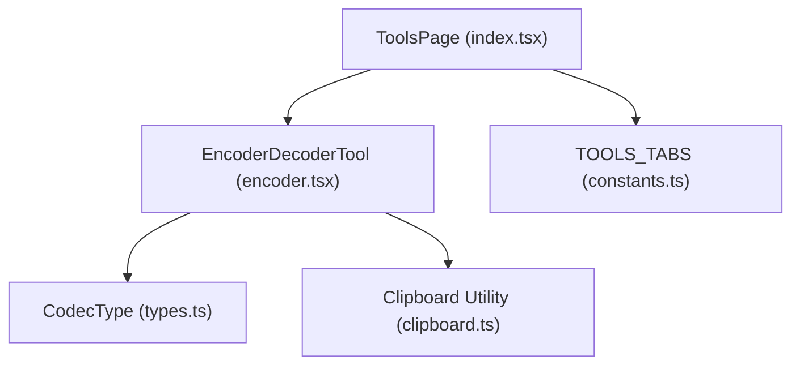
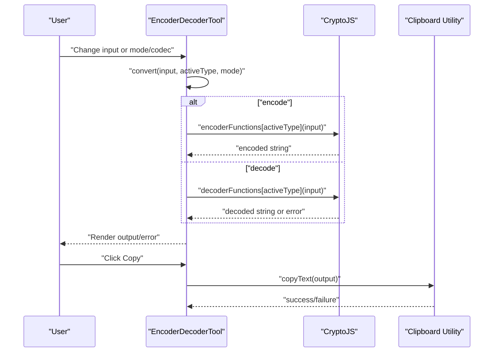
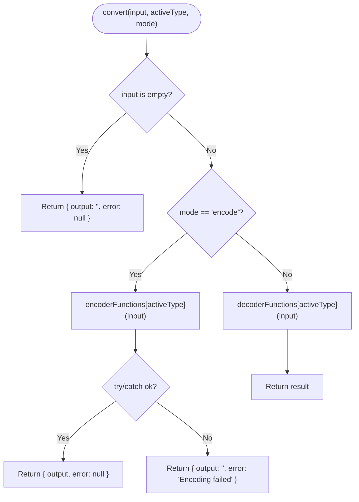
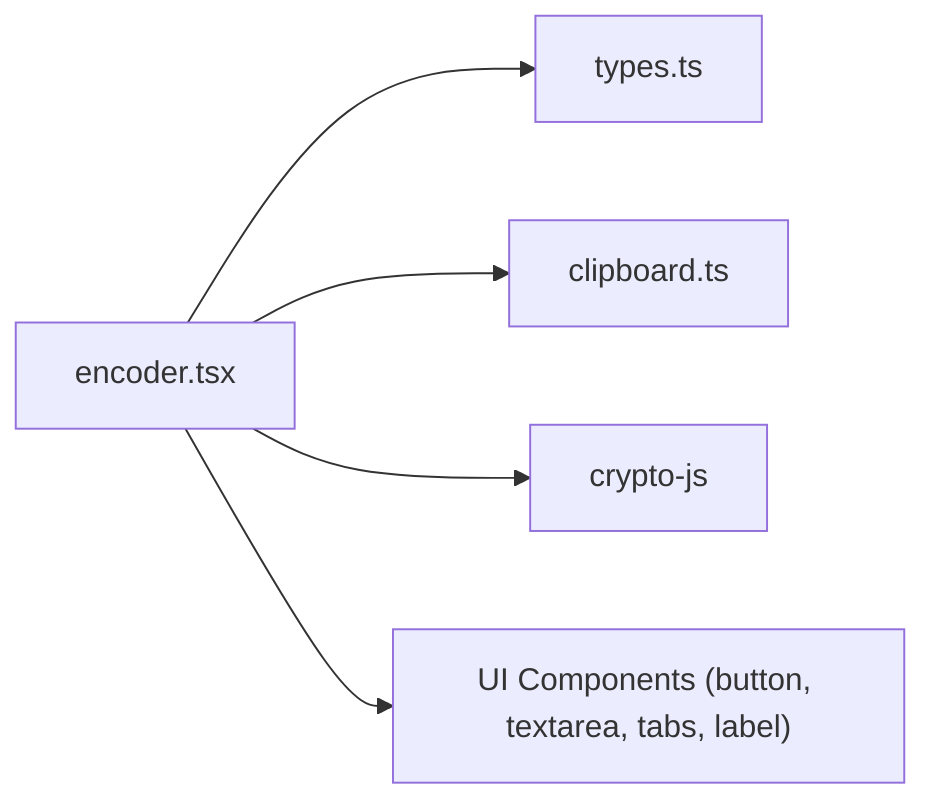

# Encoding/Decoding Utilities

<cite>
**Referenced Files in This Document**
- [encoder.tsx](file://src/pages/tools/components/encoder.tsx)
- [types.ts](file://src/pages/tools/types.ts)
- [index.tsx](file://src/pages/tools/index.tsx)
- [constants.ts](file://src/pages/tools/constants.ts)
- [clipboard.ts](file://src/lib/clipboard.ts)
</cite>

## Table of Contents
1. [Introduction](#introduction)
2. [Project Structure](#project-structure)
3. [Core Components](#core-components)
4. [Architecture Overview](#architecture-overview)
5. [Detailed Component Analysis](#detailed-component-analysis)
6. [Dependency Analysis](#dependency-analysis)
7. [Performance Considerations](#performance-considerations)
8. [Troubleshooting Guide](#troubleshooting-guide)
9. [Conclusion](#conclusion)
10. [Appendices](#appendices)

## Introduction
This document describes the Encoding/Decoding Utilities component in AppRecon. It supports three codec types—URL encoding/decoding, Base64 encoding/decoding, and Hex encoding/decoding—operating in dual mode: encode and decode. Users can switch between modes using a dedicated arrow button, and the component provides input/output workflows, validation logic, error handling, and clipboard integration for copying results. Practical examples and guidance are included for security testing workflows.

## Project Structure
The Encoding/Decoding Utilities resides under the Tools page and is integrated into the main Tools page layout. The component is implemented as a single self-contained React client component with TypeScript types and integrates with the global clipboard utility.

**Diagram sources**
- [index.tsx:15-48](file://src/pages/tools/index.tsx#L15-L48)
- [encoder.tsx:92-207](file://src/pages/tools/components/encoder.tsx#L92-L207)
- [types.ts:1-70](file://src/pages/tools/types.ts#L1-L70)
- [constants.ts:1-13](file://src/pages/tools/constants.ts#L1-L13)
- [clipboard.ts:1-26](file://src/lib/clipboard.ts#L1-L26)

**Section sources**
- [index.tsx:15-48](file://src/pages/tools/index.tsx#L15-L48)
- [constants.ts:1-13](file://src/pages/tools/constants.ts#L1-L13)

## Core Components
- EncoderDecoderTool: The primary UI and logic component for encoding/decoding. It manages state for input, active codec type, mode (encode/decode), output, and error messages. It exposes controls for swapping encode/decode, clearing input/output, and copying output to the clipboard.
- CodecType: A union type defining the supported codecs: url, base64, hex.
- Clipboard Utility: Provides cross-environment clipboard copy functionality with a Tauri-backed primary method and a DOM fallback.

Key responsibilities:
- Mode switching toggles encode/decode and swaps input/output values.
- Codec switching updates the active codec type.
- Validation ensures non-empty input for conversions and applies codec-specific checks.
- Error handling displays user-friendly messages for invalid inputs.

**Section sources**
- [encoder.tsx:12-17](file://src/pages/tools/components/encoder.tsx#L12-L17)
- [encoder.tsx:57-74](file://src/pages/tools/components/encoder.tsx#L57-L74)
- [encoder.tsx:92-207](file://src/pages/tools/components/encoder.tsx#L92-L207)
- [types.ts:1-4](file://src/pages/tools/types.ts#L1-L4)
- [clipboard.ts:1-26](file://src/lib/clipboard.ts#L1-L26)

## Architecture Overview
The component follows a unidirectional data flow:
- User interacts via tabs (mode and codec) and text areas.
- On change, the component computes the output using codec-specific encoder/decoder functions.
- Errors are captured and displayed inline.
- Clipboard integration writes the computed output to the system clipboard.

**Diagram sources**
- [encoder.tsx:76-90](file://src/pages/tools/components/encoder.tsx#L76-L90)
- [encoder.tsx:19-55](file://src/pages/tools/components/encoder.tsx#L19-L55)
- [clipboard.ts:3-25](file://src/lib/clipboard.ts#L3-L25)

## Detailed Component Analysis

### EncoderDecoderTool Component
- State:
  - input: Plain text or encoded text depending on mode.
  - activeType: Codec type (url/base64/hex).
  - mode: encode or decode.
  - output: Computed result.
  - error: Error message or null.
- Controls:
  - Mode tabs: Encode/Decode.
  - Codec tabs: URL/Base64/Hex.
  - Swap button: Switches mode and swaps input/output values.
  - Clear button: Resets input/output/error.
  - Copy button: Copies output to clipboard.
- Conversion logic:
  - encode: Uses encoderFunctions keyed by activeType.
  - decode: Uses decoderFunctions keyed by activeType with validation and error handling.
- Validation:
  - Empty input returns no error and empty output.
  - URL decode: Try/catch around decodeURIComponent.
  - Base64 decode: Try/catch around CryptoJS Base64 parse; rejects empty output.
  - Hex decode: Strips whitespace, validates hex digits and even length; then parses via CryptoJS.

**Diagram sources**
- [encoder.tsx:76-90](file://src/pages/tools/components/encoder.tsx#L76-L90)
- [encoder.tsx:19-55](file://src/pages/tools/components/encoder.tsx#L19-L55)

**Section sources**
- [encoder.tsx:92-207](file://src/pages/tools/components/encoder.tsx#L92-L207)
- [encoder.tsx:76-90](file://src/pages/tools/components/encoder.tsx#L76-L90)
- [encoder.tsx:19-55](file://src/pages/tools/components/encoder.tsx#L19-L55)

### Codec Type Definitions
- CodecType: Union of supported codecs used to index encoder/decoder functions.
- DecoderType and EncoderType aliases align with CodecType for consistency.

**Section sources**
- [types.ts:1-4](file://src/pages/tools/types.ts#L1-L4)

### UI Layout and Interactions
- Top area shows active codec and mode labels.
- Two tab groups:
  - Mode: Encode/Decode.
  - Codec: URL/Base64/Hex.
- Three-column layout:
  - Left: Source label and input text area.
  - Center: Swap button.
  - Right: Target label, optional error block, and output text area with copy button.
- Clear button resets all fields.
- Copy button invokes clipboard utility.

**Section sources**
- [encoder.tsx:128-207](file://src/pages/tools/components/encoder.tsx#L128-L207)

### Clipboard Integration
- Primary method: @tauri-apps/plugin-clipboard-manager writeText.
- Fallback: Programmatically selecting a hidden textarea and invoking document.execCommand('copy').
- Returns success or failure; the UI disables the copy button when there is no output.

**Section sources**
- [clipboard.ts:1-26](file://src/lib/clipboard.ts#L1-L26)
- [encoder.tsx:109-113](file://src/pages/tools/components/encoder.tsx#L109-L113)

## Dependency Analysis
- Internal dependencies:
  - encoder.tsx depends on:
    - CodecType from types.ts.
    - Clipboard utility from clipboard.ts.
    - UI primitives from '@/components/ui/*'.
    - CryptoJS for Base64 and Hex conversions.
- External dependencies:
  - crypto-js: Used for Base64 and Hex encoders/decoders.
  - lucide-react icons: ArrowLeftRight, Copy, Trash2.
  - @tauri-apps/plugin-clipboard-manager: Tauri clipboard plugin.

**Diagram sources**
- [encoder.tsx:1-11](file://src/pages/tools/components/encoder.tsx#L1-L11)
- [types.ts:1-4](file://src/pages/tools/types.ts#L1-L4)
- [clipboard.ts:1](file://src/lib/clipboard.ts#L1)

**Section sources**
- [encoder.tsx:1-11](file://src/pages/tools/components/encoder.tsx#L1-L11)

## Performance Considerations
- Encoding/decoding is CPU-bound and lightweight for typical text sizes.
- Base64 and Hex conversions rely on CryptoJS; avoid extremely large inputs to prevent UI blocking.
- Debounce or throttle long-running conversions if extended payloads are expected.
- Clipboard operations are asynchronous; keep the UI responsive by avoiding synchronous blocking after copy.

## Troubleshooting Guide
Common issues and resolutions:
- Invalid URL-encoded string:
  - Symptom: Error message indicating invalid URL-encoded string.
  - Cause: Malformed percent-encoding or unexpected characters.
  - Resolution: Ensure the input is a valid URL-encoded string and retry.
- Invalid Base64 string:
  - Symptom: Error message indicating invalid Base64 string.
  - Cause: Non-base64 characters, incorrect padding, or corrupted data.
  - Resolution: Verify Base64 validity and correct padding; remove extraneous characters.
- Invalid hex string:
  - Symptom: Error message indicating invalid hex string.
  - Cause: Non-hex characters or odd-length input.
  - Resolution: Remove spaces and ensure even length; confirm only hexadecimal digits are present.
- Empty input:
  - Symptom: No output or error.
  - Cause: No input provided.
  - Resolution: Enter text to encode or encoded text to decode.
- Copy fails:
  - Symptom: Copy button disabled or silent failure.
  - Cause: No output or clipboard permission denied.
  - Resolution: Ensure output exists; on web, enable clipboard permissions; on Tauri, verify plugin configuration.

**Section sources**
- [encoder.tsx:25-55](file://src/pages/tools/components/encoder.tsx#L25-L55)
- [encoder.tsx:109-113](file://src/pages/tools/components/encoder.tsx#L109-L113)
- [clipboard.ts:3-25](file://src/lib/clipboard.ts#L3-L25)

## Conclusion
The Encoding/Decoding Utilities component offers a clean, dual-mode interface for URL, Base64, and Hex transformations. Its robust validation and error handling, combined with clipboard integration, make it suitable for security testing tasks such as sanitizing payloads, decoding tokens, and preparing inputs for requests. The modular design and clear separation of concerns support maintainability and extensibility.

## Appendices

### Practical Examples
- URL Encode:
  - Input: "Hello World?param=value&other=test"
  - Action: Encode
  - Output: "Hello%20World%3Fparam%3Dvalue%26other%3Dtest"
- URL Decode:
  - Input: "Hello%20World%3Fparam%3Dvalue%26other%3Dtest"
  - Action: Decode
  - Output: "Hello World?param=value&other=test"
- Base64 Encode:
  - Input: "secret message"
  - Action: Encode
  - Output: "c2VjcmV0IG1lc3NhZ2U="
- Base64 Decode:
  - Input: "c2VjcmV0IG1lc3NhZ2U="
  - Action: Decode
  - Output: "secret message"
- Hex Encode:
  - Input: "hello"
  - Action: Encode
  - Output: "68656c6c6f"
- Hex Decode:
  - Input: "68656c6c6f"
  - Action: Decode
  - Output: "hello"

### Security Testing Guidance
- URL encoding:
  - Use to sanitize query parameters and path segments in HTTP requests.
  - Combine with URL decode to verify server-side handling of special characters.
- Base64:
  - Use to encode binary data or structured payloads for transport.
  - Decode to inspect embedded JSON or serialized data.
- Hex:
  - Use to represent raw bytes or obfuscate small payloads.
  - Decode to recover original text or binary data.