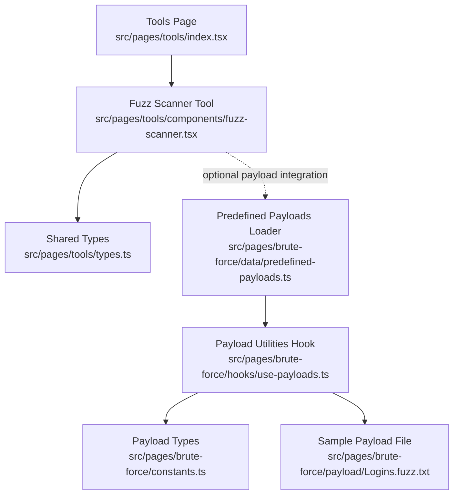
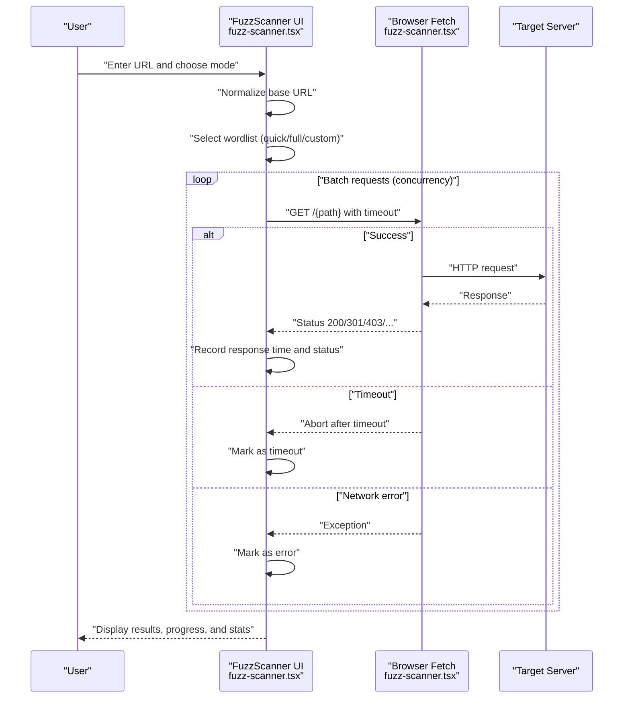
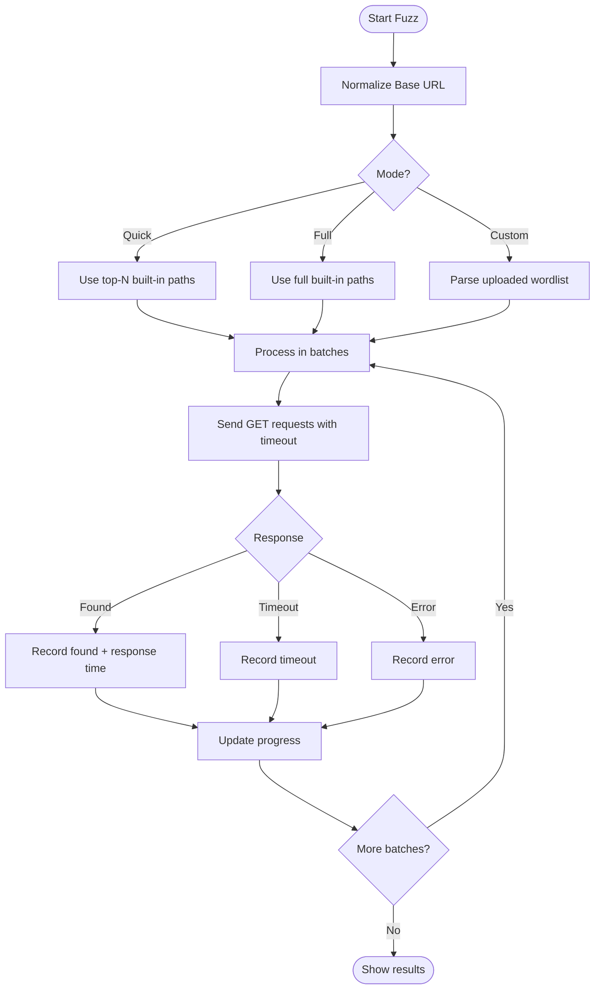
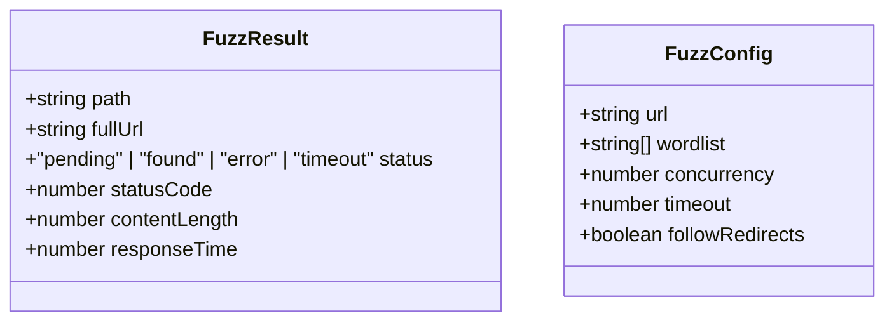
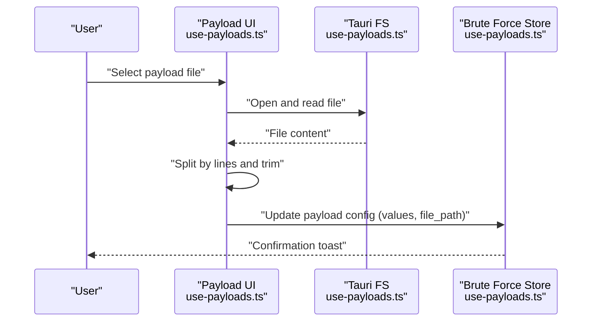
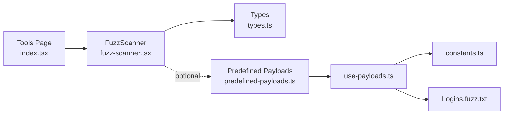

# Fuzz Scanner

<cite>
**Referenced Files in This Document**
- [fuzz-scanner.tsx](file://src/pages/tools/components/fuzz-scanner.tsx)
- [index.tsx](file://src/pages/tools/index.tsx)
- [types.ts](file://src/pages/tools/types.ts)
- [predefined-payloads.ts](file://src/pages/brute-force/data/predefined-payloads.ts)
- [use-payloads.ts](file://src/pages/brute-force/hooks/use-payloads.ts)
- [constants.ts](file://src/pages/brute-force/constants.ts)
- [Logins.fuzz.txt](file://src/pages/brute-force/payload/Logins.fuzz.txt)
</cite>

## Table of Contents
1. [Introduction](#introduction)
2. [Project Structure](#project-structure)
3. [Core Components](#core-components)
4. [Architecture Overview](#architecture-overview)
5. [Detailed Component Analysis](#detailed-component-analysis)
6. [Dependency Analysis](#dependency-analysis)
7. [Performance Considerations](#performance-considerations)
8. [Troubleshooting Guide](#troubleshooting-guide)
9. [Conclusion](#conclusion)
10. [Appendices](#appendices)

## Introduction
This document describes the Fuzz Scanner component used to discover hidden directories and resources by brute-forcing common paths against a target URL. It covers the fuzzing workflow from payload selection to result interpretation, including GET-based scanning, timeout and cancellation handling, filtering, exporting, and integration with predefined/custom payload lists. Practical examples illustrate how to apply the scanner for common tasks such as directory discovery, and guidance is provided for performance tuning and safe testing practices.

## Project Structure
The Fuzz Scanner is part of the Tools page and integrates with shared types and payload utilities. The Tools page hosts multiple security-focused tools and routes the fuzz scanner under the “fuzz” tab.

**Diagram sources**
- [index.tsx:15-48](file://src/pages/tools/index.tsx#L15-L48)
- [fuzz-scanner.tsx:1-389](file://src/pages/tools/components/fuzz-scanner.tsx#L1-L389)
- [types.ts:42-57](file://src/pages/tools/types.ts#L42-L57)
- [predefined-payloads.ts:1-48](file://src/pages/brute-force/data/predefined-payloads.ts#L1-L48)
- [use-payloads.ts:1-85](file://src/pages/brute-force/hooks/use-payloads.ts#L1-L85)
- [constants.ts:1-8](file://src/pages/brute-force/constants.ts#L1-L8)
- [Logins.fuzz.txt](file://src/pages/brute-force/payload/Logins.fuzz.txt)

**Section sources**
- [index.tsx:15-48](file://src/pages/tools/index.tsx#L15-L48)
- [fuzz-scanner.tsx:1-389](file://src/pages/tools/components/fuzz-scanner.tsx#L1-L389)
- [types.ts:42-57](file://src/pages/tools/types.ts#L42-L57)

## Core Components
- Fuzz Scanner UI and logic: Implements URL normalization, wordlist selection (quick, full, custom), concurrency batching, GET requests, timeout handling, progress tracking, filtering, and export.
- Shared types: Defines FuzzResult and FuzzConfig structures used across tools.
- Payload utilities: Provide mechanisms to load custom payload lists and integrate with predefined payload categories.

Key responsibilities:
- Wordlist management: quick (top N), full (large built-in list), or custom (uploaded file).
- Concurrency control: batches of concurrent requests with per-request timeouts.
- Result processing: categorization by status (found, timeout, error), response time collection, and filtering/export.

**Section sources**
- [fuzz-scanner.tsx:59-182](file://src/pages/tools/components/fuzz-scanner.tsx#L59-L182)
- [types.ts:42-57](file://src/pages/tools/types.ts#L42-L57)
- [predefined-payloads.ts:1-48](file://src/pages/brute-force/data/predefined-payloads.ts#L1-L48)
- [use-payloads.ts:1-85](file://src/pages/brute-force/hooks/use-payloads.ts#L1-L85)

## Architecture Overview
The Fuzz Scanner orchestrates a controlled brute-force loop over a wordlist. It normalizes the target URL, selects a wordlist based on mode, and sends GET requests with per-request timeouts. Responses are categorized and aggregated with progress updates.

**Diagram sources**
- [fuzz-scanner.tsx:95-171](file://src/pages/tools/components/fuzz-scanner.tsx#L95-L171)

## Detailed Component Analysis

### Fuzz Scanner UI and Workflow
- URL handling: Ensures scheme and trailing slash, normalizes base URL before building full URLs.
- Wordlist modes:
  - Quick: Top N entries from the built-in list.
  - Full: Larger built-in list.
  - Custom: Uploaded file parsed into lines, ignoring blank lines and comments.
- Concurrency and batching: Processes wordlist in batches with a fixed concurrency limit; updates progress after each batch.
- Timeout behavior: Per-request timeout aborts slow or hanging requests; results are marked accordingly.
- Status classification: Found (reachable), Timeout (exceeded per-request timeout), Error (other exceptions).
- Filtering and export: Filter by status, export to CSV/JSON/TXT, clear results, and copy URLs.

**Diagram sources**
- [fuzz-scanner.tsx:72-171](file://src/pages/tools/components/fuzz-scanner.tsx#L72-L171)

**Section sources**
- [fuzz-scanner.tsx:59-182](file://src/pages/tools/components/fuzz-scanner.tsx#L59-L182)
- [types.ts:42-49](file://src/pages/tools/types.ts#L42-L49)

### Result Data Model
FuzzResult captures essential attributes for each tested path, enabling filtering and export.

**Diagram sources**
- [types.ts:42-57](file://src/pages/tools/types.ts#L42-L57)

**Section sources**
- [types.ts:42-57](file://src/pages/tools/types.ts#L42-L57)

### Payload Integration and Customization
While the Fuzz Scanner currently focuses on directory discovery via GET requests, the payload infrastructure supports loading custom lists and integrating with predefined categories. This enables extending the scanner to include parameter-based payloads in future iterations.

- Loading custom payloads:
  - File upload parses newline-separated values, trims whitespace, and clears UI state.
  - Tauri filesystem APIs enable selecting and reading payload files.
- Predefined payloads:
  - Automatic discovery of payload files under the payload directory.
  - Categorization and metadata generation for organized selection.
- Example payload file:
  - Sample login fuzz list demonstrates the expected format.

**Diagram sources**
- [use-payloads.ts:44-78](file://src/pages/brute-force/hooks/use-payloads.ts#L44-L78)
- [predefined-payloads.ts:9-43](file://src/pages/brute-force/data/predefined-payloads.ts#L9-L43)
- [constants.ts:3-7](file://src/pages/brute-force/constants.ts#L3-L7)
- [Logins.fuzz.txt](file://src/pages/brute-force/payload/Logins.fuzz.txt)

**Section sources**
- [use-payloads.ts:1-85](file://src/pages/brute-force/hooks/use-payloads.ts#L1-L85)
- [predefined-payloads.ts:1-48](file://src/pages/brute-force/data/predefined-payloads.ts#L1-L48)
- [constants.ts:1-8](file://src/pages/brute-force/constants.ts#L1-L8)
- [Logins.fuzz.txt](file://src/pages/brute-force/payload/Logins.fuzz.txt)

### Practical Scenarios and Interpretation
- Directory discovery:
  - Use Quick or Full modes to enumerate common paths. Found entries indicate accessible resources.
  - Export results to CSV/JSON/TXT for reporting and further analysis.
- Parameter injection testing:
  - Current implementation focuses on path discovery via GET. To test parameters (e.g., SQL injection, XSS), extend the scanner to inject payloads into query parameters or bodies and compare responses.
  - Use the payload infrastructure to load targeted payloads and correlate anomalies (status changes, timing differences, content signatures).
- Response analysis:
  - Found vs. timeout vs. error statuses help distinguish availability, rate limiting, or blocking.
  - Response times can highlight server-side processing delays, useful for timing-based techniques.

[No sources needed since this section provides general guidance]

## Dependency Analysis
The Fuzz Scanner depends on shared types and optionally integrates with payload utilities for custom wordlists. The Tools page mounts the scanner under the “fuzz” tab.

**Diagram sources**
- [index.tsx:36-37](file://src/pages/tools/index.tsx#L36-L37)
- [fuzz-scanner.tsx:1-389](file://src/pages/tools/components/fuzz-scanner.tsx#L1-L389)
- [types.ts:42-57](file://src/pages/tools/types.ts#L42-L57)
- [predefined-payloads.ts:1-48](file://src/pages/brute-force/data/predefined-payloads.ts#L1-L48)
- [use-payloads.ts:1-85](file://src/pages/brute-force/hooks/use-payloads.ts#L1-L85)
- [constants.ts:1-8](file://src/pages/brute-force/constants.ts#L1-L8)
- [Logins.fuzz.txt](file://src/pages/brute-force/payload/Logins.fuzz.txt)

**Section sources**
- [index.tsx:36-37](file://src/pages/tools/index.tsx#L36-L37)
- [fuzz-scanner.tsx:1-389](file://src/pages/tools/components/fuzz-scanner.tsx#L1-L389)
- [types.ts:42-57](file://src/pages/tools/types.ts#L42-L57)

## Performance Considerations
- Concurrency: The scanner processes payloads in batches with a fixed concurrency limit. Adjusting this value impacts throughput and resource usage. Lower concurrency reduces server load; higher concurrency increases speed but risks rate limiting or blocking.
- Timeout: Per-request timeout controls responsiveness. Short timeouts reduce wait times but may misclassify slow endpoints; longer timeouts improve accuracy but increase total runtime.
- Wordlist size: Quick mode limits the number of requests; Full mode increases coverage at the cost of time and bandwidth.
- Export and filtering: Large result sets can be filtered and exported to external tools for deeper analysis, reducing in-app memory overhead.

[No sources needed since this section provides general guidance]

## Troubleshooting Guide
- No results appear:
  - Verify the base URL includes a scheme and trailing slash; the scanner normalizes the URL internally.
  - Try Full mode to expand the wordlist.
- Many timeouts:
  - Reduce concurrency or increase timeout to accommodate slower servers.
  - Check for rate limiting or WAF interference.
- Errors during file upload:
  - Ensure the file is a plain text list with one payload per line; blank lines and comment lines are ignored.
- Stopping scans:
  - Use the Stop button to abort ongoing scans; the UI reflects cancellation immediately.

**Section sources**
- [fuzz-scanner.tsx:95-171](file://src/pages/tools/components/fuzz-scanner.tsx#L95-L171)
- [use-payloads.ts:11-42](file://src/pages/brute-force/hooks/use-payloads.ts#L11-L42)

## Conclusion
The Fuzz Scanner provides a focused, efficient mechanism for discovering directories and resources via brute-force path testing. Its design emphasizes simplicity, progress visibility, and extensibility. By leveraging the existing payload infrastructure, future enhancements can incorporate parameter-based injection testing while maintaining safe, configurable operation.

[No sources needed since this section summarizes without analyzing specific files]

## Appendices

### Appendix A: How to Extend for Parameter Injection Testing
- Inject payloads into query parameters or request bodies.
- Compare responses using status codes, response times, and content signatures.
- Use predefined and custom payloads to cover common injection vectors (SQLi, XSS, SSTI).
- Integrate with the payload utilities to load and manage payload sets.

[No sources needed since this section provides general guidance]