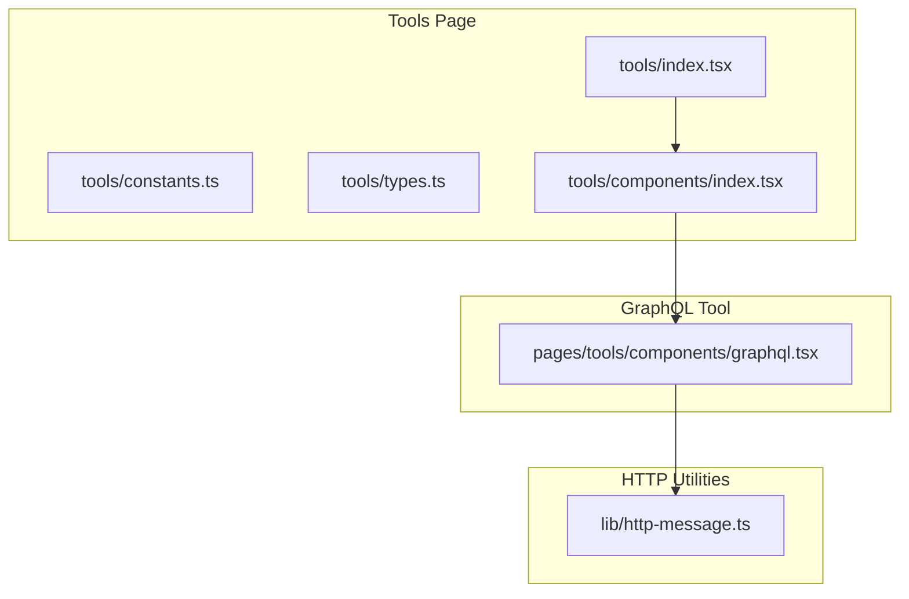
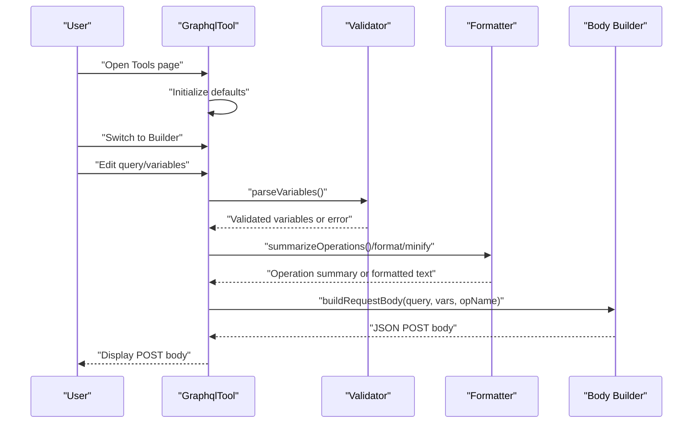
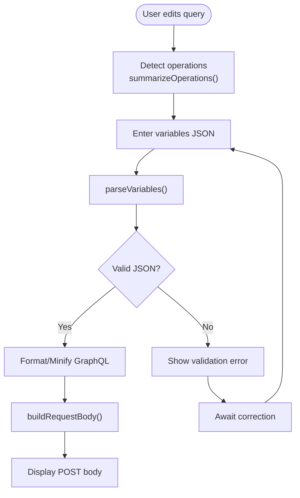
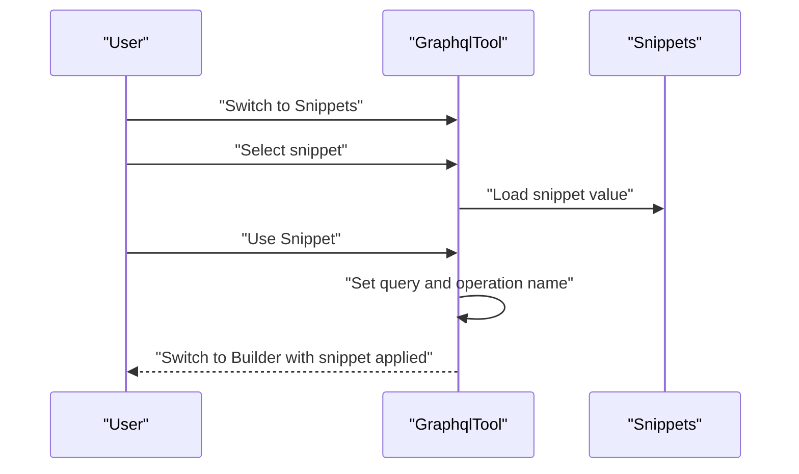
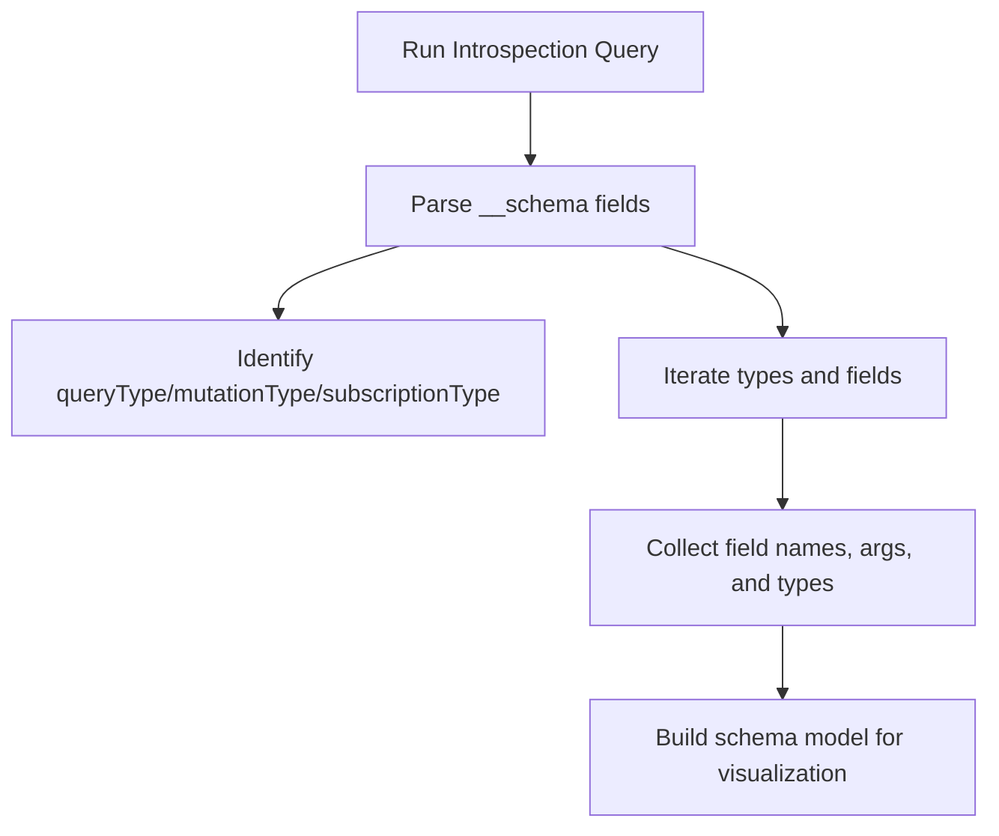
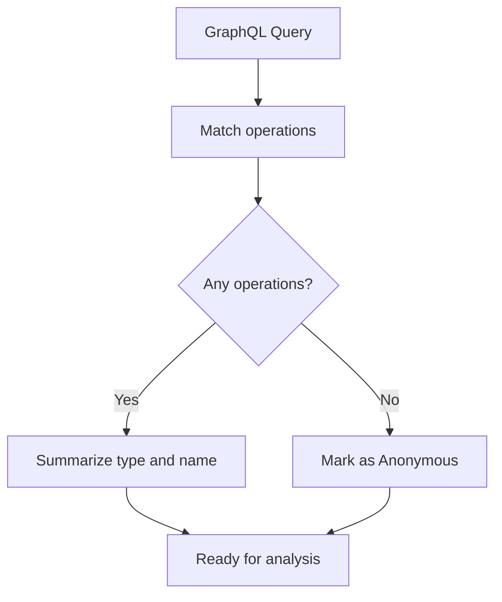
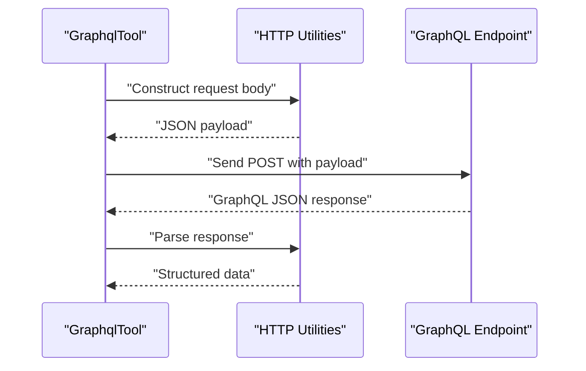
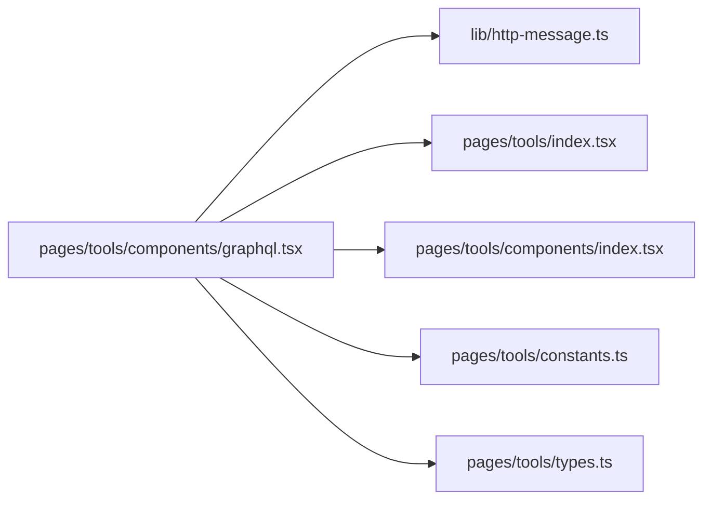

# GraphQL Analyzer

<cite>
**Referenced Files in This Document**
- [graphql.tsx](file://src/pages/tools/components/graphql.tsx)
- [http-message.ts](file://src/lib/http-message.ts)
- [index.tsx](file://src/pages/tools/index.tsx)
- [constants.ts](file://src/pages/tools/constants.ts)
- [types.ts](file://src/pages/tools/types.ts)
- [index.tsx](file://src/pages/tools/components/index.tsx)
</cite>

## Table of Contents
1. [Introduction](#introduction)
2. [Project Structure](#project-structure)
3. [Core Components](#core-components)
4. [Architecture Overview](#architecture-overview)
5. [Detailed Component Analysis](#detailed-component-analysis)
6. [Dependency Analysis](#dependency-analysis)
7. [Performance Considerations](#performance-considerations)
8. [Troubleshooting Guide](#troubleshooting-guide)
9. [Conclusion](#conclusion)
10. [Appendices](#appendices)

## Introduction
This document describes the GraphQL Analyzer tool within AppRecon. It focuses on GraphQL endpoint introspection, schema discovery, query analysis, and mutation detection. It explains how the analyzer executes introspection queries, visualizes schema information, explores the type system, and supports practical security testing scenarios such as endpoint enumeration, query optimization, and vulnerability assessment. It also covers integration with GraphQL endpoints, authentication handling, response parsing, and best practices for secure GraphQL API development.

## Project Structure
The GraphQL Analyzer is implemented as a React component integrated into the Tools page. It provides a builder mode for crafting GraphQL operations and variables, and a snippets mode for quick access to common introspection queries. Supporting utilities assist with HTTP request construction and response handling.

**Diagram sources**
- [index.tsx](file://src/pages/tools/index.tsx)
- [constants.ts](file://src/pages/tools/constants.ts)
- [types.ts](file://src/pages/tools/types.ts)
- [index.tsx](file://src/pages/tools/components/index.tsx)
- [graphql.tsx](file://src/pages/tools/components/graphql.tsx)
- [http-message.ts](file://src/lib/http-message.ts)

**Section sources**
- [index.tsx](file://src/pages/tools/index.tsx)
- [constants.ts](file://src/pages/tools/constants.ts)
- [types.ts](file://src/pages/tools/types.ts)
- [index.tsx](file://src/pages/tools/components/index.tsx)
- [graphql.tsx](file://src/pages/tools/components/graphql.tsx)
- [http-message.ts](file://src/lib/http-message.ts)

## Core Components
- GraphQL Builder: Interactive editor for writing GraphQL operations, variables, and generating a formatted POST body.
- Snippets: Predefined introspection queries for quick schema discovery and type exploration.
- Validation and Formatting: Utilities to validate variables, summarize operations, minify/format GraphQL, and construct HTTP request bodies.

Key responsibilities:
- Parse and validate variables as JSON.
- Detect operation types and names from the query.
- Minify and format GraphQL for readability.
- Build a JSON request body suitable for GraphQL endpoints.

**Section sources**
- [graphql.tsx:33-115](file://src/pages/tools/components/graphql.tsx#L33-L115)
- [graphql.tsx:117-150](file://src/pages/tools/components/graphql.tsx#L117-L150)
- [graphql.tsx:152-174](file://src/pages/tools/components/graphql.tsx#L152-L174)
- [graphql.tsx:245-256](file://src/pages/tools/components/graphql.tsx#L245-L256)

## Architecture Overview
The GraphQL Analyzer integrates with the Tools page and exposes two modes:
- Builder mode: Edit GraphQL query, operation name, and variables; see generated POST body.
- Snippets mode: Choose predefined introspection queries and copy them to the editor.

**Diagram sources**
- [graphql.tsx:117-150](file://src/pages/tools/components/graphql.tsx#L117-L150)
- [graphql.tsx:152-174](file://src/pages/tools/components/graphql.tsx#L152-L174)
- [graphql.tsx:245-256](file://src/pages/tools/components/graphql.tsx#L245-L256)

## Detailed Component Analysis

### GraphQL Builder Mode
- Query Editor: Text area for editing GraphQL operations.
- Operation Detection: Summarizes detected operations (query, mutation, subscription) and names.
- Variables Editor: Validates JSON and displays errors inline.
- Formatting Tools: Format and minify GraphQL for readability and compactness.
- Request Body Generation: Builds a JSON payload with query, variables, and optional operationName.

**Diagram sources**
- [graphql.tsx:138-150](file://src/pages/tools/components/graphql.tsx#L138-L150)
- [graphql.tsx:117-136](file://src/pages/tools/components/graphql.tsx#L117-L136)
- [graphql.tsx:152-174](file://src/pages/tools/components/graphql.tsx#L152-L174)
- [graphql.tsx:245-256](file://src/pages/tools/components/graphql.tsx#L245-L256)

**Section sources**
- [graphql.tsx:262-288](file://src/pages/tools/components/graphql.tsx#L262-L288)
- [graphql.tsx:305-388](file://src/pages/tools/components/graphql.tsx#L305-L388)

### Snippets Mode
- Predefined Queries: Introspection, Types, and Field Args queries.
- Selection and Application: Choose a snippet and apply it to the editor with an appropriate operation name.

**Diagram sources**
- [graphql.tsx:111-115](file://src/pages/tools/components/graphql.tsx#L111-L115)
- [graphql.tsx:279-283](file://src/pages/tools/components/graphql.tsx#L279-L283)

**Section sources**
- [graphql.tsx:389-428](file://src/pages/tools/components/graphql.tsx#L389-L428)

### Introspection Queries and Schema Discovery
The component defines three primary introspection queries:
- Introspection: Discovers schema types, query/mutation/subscription roots, and fields with arguments.
- Types: Lists schema types with kind and description.
- Field Args: Retrieves arguments for fields on the Query type.

These queries enable:
- Endpoint enumeration by discovering available operations.
- Type system exploration by listing kinds and descriptions.
- Mutation detection by inspecting mutationType and fields.

**Diagram sources**
- [graphql.tsx:45-83](file://src/pages/tools/components/graphql.tsx#L45-L83)
- [graphql.tsx:85-93](file://src/pages/tools/components/graphql.tsx#L85-L93)
- [graphql.tsx:95-109](file://src/pages/tools/components/graphql.tsx#L95-L109)

**Section sources**
- [graphql.tsx:45-109](file://src/pages/tools/components/graphql.tsx#L45-L109)

### Query Analysis and Mutation Detection
- Operation Summarization: Detects query, mutation, and subscription operations and their names.
- Anonymous Queries: Treats bare selection sets as anonymous operations.
- Mutation Detection: By inspecting mutationType and fields during introspection, mutations can be identified and enumerated.

**Diagram sources**
- [graphql.tsx:138-149](file://src/pages/tools/components/graphql.tsx#L138-L149)

**Section sources**
- [graphql.tsx:138-149](file://src/pages/tools/components/graphql.tsx#L138-L149)

### Authentication Handling and Response Parsing
- Authentication: The GraphQL tool generates a JSON request body compatible with typical GraphQL endpoints. Authentication is typically handled by the client or proxy layer before sending requests.
- Response Parsing: The HTTP utilities module provides helpers for constructing and parsing HTTP messages, which can be used to process GraphQL responses.

**Diagram sources**
- [graphql.tsx:245-256](file://src/pages/tools/components/graphql.tsx#L245-L256)
- [http-message.ts](file://src/lib/http-message.ts)

**Section sources**
- [graphql.tsx:245-256](file://src/pages/tools/components/graphql.tsx#L245-L256)
- [http-message.ts](file://src/lib/http-message.ts)

### Practical Applications in Security Testing
- Endpoint Enumeration: Use the introspection query to discover available operations and mutations.
- Query Optimization: Minify queries to reduce payload size and improve performance.
- Vulnerability Assessment: Enumerate fields and arguments to identify sensitive data exposure and potential injection vectors.

Common scenarios:
- Schema reconnaissance: Run the introspection query to understand the schema surface.
- Field discovery: Explore fields and arguments via the Types and Field Args queries.
- Permission testing: Send targeted queries to test access controls and identify unauthorized data exposure.

**Section sources**
- [graphql.tsx:45-109](file://src/pages/tools/components/graphql.tsx#L45-L109)

## Dependency Analysis
The GraphQL Analyzer depends on:
- Tools page routing and constants for integration.
- HTTP utilities for request/response handling.
- UI components for editor and formatting.

**Diagram sources**
- [graphql.tsx](file://src/pages/tools/components/graphql.tsx)
- [http-message.ts](file://src/lib/http-message.ts)
- [index.tsx](file://src/pages/tools/index.tsx)
- [index.tsx](file://src/pages/tools/components/index.tsx)
- [constants.ts](file://src/pages/tools/constants.ts)
- [types.ts](file://src/pages/tools/types.ts)

**Section sources**
- [graphql.tsx](file://src/pages/tools/components/graphql.tsx)
- [http-message.ts](file://src/lib/http-message.ts)
- [index.tsx](file://src/pages/tools/index.tsx)
- [index.tsx](file://src/pages/tools/components/index.tsx)
- [constants.ts](file://src/pages/tools/constants.ts)
- [types.ts](file://src/pages/tools/types.ts)

## Performance Considerations
- Query Minification: Use the minify utility to remove comments and whitespace, reducing payload size.
- Operation Summarization: Quickly identify operation types and names to avoid unnecessary processing.
- Large Schemas: Prefer targeted introspection queries (e.g., limit fields or types) to reduce response sizes.
- Result Interpretation: Cache and reuse parsed schema fragments to avoid repeated computation.

[No sources needed since this section provides general guidance]

## Troubleshooting Guide
- Invalid Variables JSON: The validator returns an error when variables are not a JSON object. Correct the JSON and retry.
- No Operations Detected: If the query starts with a selection set without an operation keyword, it is treated as anonymous.
- Copy Issues: The copy-to-clipboard action is disabled when variables are invalid.

Resolution steps:
- Validate variables JSON before building the request body.
- Ensure the query includes proper operation keywords (query, mutation, subscription).
- Use the formatting tools to clean up malformed queries.

**Section sources**
- [graphql.tsx:117-136](file://src/pages/tools/components/graphql.tsx#L117-L136)
- [graphql.tsx:138-149](file://src/pages/tools/components/graphql.tsx#L138-L149)
- [graphql.tsx:258-260](file://src/pages/tools/components/graphql.tsx#L258-L260)

## Conclusion
The GraphQL Analyzer provides a focused toolkit for introspection, schema exploration, and query analysis. It supports security testing workflows by enabling endpoint enumeration, mutation detection, and vulnerability assessment through structured introspection queries and robust request body generation. Combined with HTTP utilities and UI components, it offers a practical foundation for secure GraphQL API development and testing.

[No sources needed since this section summarizes without analyzing specific files]

## Appendices

### Example Workflows
- Schema Reconnaissance: Select the Introspection snippet, apply it, and analyze the returned schema metadata.
- Field Discovery: Use the Types and Field Args queries to enumerate fields and arguments.
- Permission Testing: Craft targeted queries to probe access controls and identify unauthorized data exposure.

[No sources needed since this section provides general guidance]