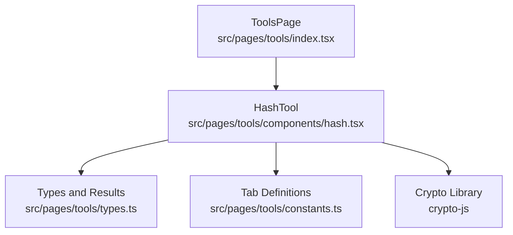
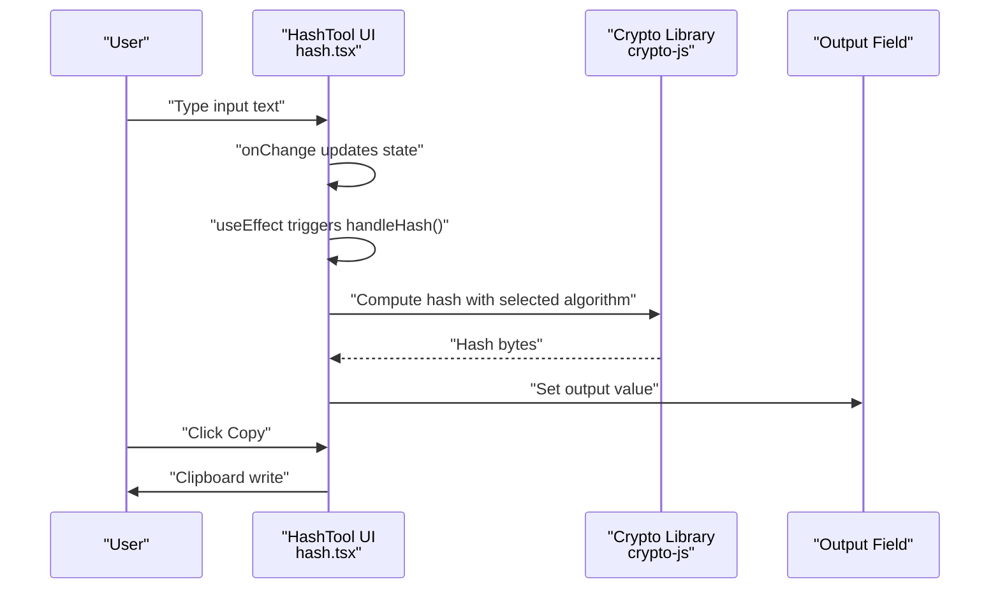
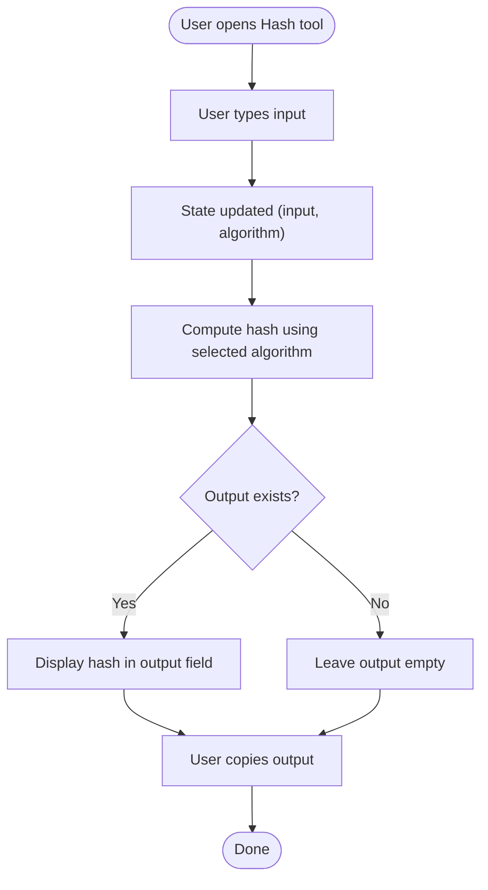
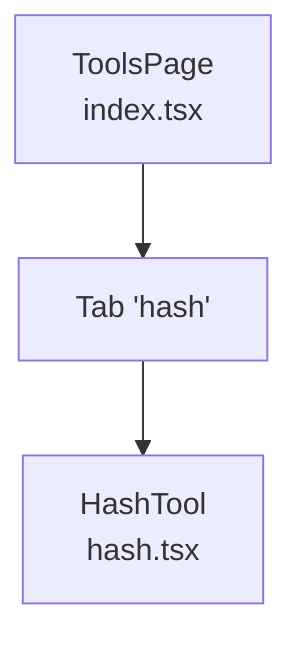
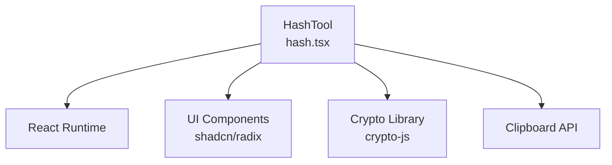

# Hash Calculator

<cite>
**Referenced Files in This Document**
- [hash.tsx](file://src/pages/tools/components/hash.tsx)
- [index.tsx](file://src/pages/tools/index.tsx)
- [types.ts](file://src/pages/tools/types.ts)
- [constants.ts](file://src/pages/tools/constants.ts)
- [package.json](file://package.json)
</cite>

## Table of Contents
1. [Introduction](#introduction)
2. [Project Structure](#project-structure)
3. [Core Components](#core-components)
4. [Architecture Overview](#architecture-overview)
5. [Detailed Component Analysis](#detailed-component-analysis)
6. [Dependency Analysis](#dependency-analysis)
7. [Performance Considerations](#performance-considerations)
8. [Troubleshooting Guide](#troubleshooting-guide)
9. [Conclusion](#conclusion)
10. [Appendices](#appendices)

## Introduction
This document describes the Hash Calculator tool within AppRecon. It explains supported hashing algorithms, the real-time calculation process as users type, and how to use the tool for hash verification workflows. Practical applications in security testing—such as password verification, file integrity checks, and digital forensics—are covered, along with guidance on algorithm selection and performance considerations for large inputs.

## Project Structure
The Hash Calculator is implemented as a React component integrated into the Tools page. The Tools page organizes multiple tools in tabs, with the Hash tool exposed under the "Hash" tab. The component uses a UI library for inputs and selects, and computes hashes via a cryptographic library.

**Diagram sources**
- [index.tsx:15-48](file://src/pages/tools/index.tsx#L15-L48)
- [hash.tsx:1-126](file://src/pages/tools/components/hash.tsx#L1-L126)
- [types.ts:1-70](file://src/pages/tools/types.ts#L1-L70)
- [constants.ts:1-13](file://src/pages/tools/constants.ts#L1-L13)

**Section sources**
- [index.tsx:15-48](file://src/pages/tools/index.tsx#L15-L48)
- [constants.ts:3-12](file://src/pages/tools/constants.ts#L3-L12)

## Core Components
- HashTool component: Provides a real-time hash generator with selectable algorithms, input and output text areas, copy-to-clipboard, and clear functionality.
- Tool routing: The Tools page renders the Hash tool within a tabbed layout.
- Types and results: Defines the HashType union and the HashResult shape used across the application.

Key capabilities:
- Real-time hash computation triggered by input changes.
- Support for multiple algorithms including MD5, SHA-1, SHA-224, SHA-256, SHA-384, SHA-512, SHA3 variants, and RIPEMD-160.
- Immediate output display in the result field.
- Copy and clear actions for convenience.

**Section sources**
- [hash.tsx:32-126](file://src/pages/tools/components/hash.tsx#L32-L126)
- [types.ts:1-25](file://src/pages/tools/types.ts#L1-L25)
- [index.tsx:24-26](file://src/pages/tools/index.tsx#L24-L26)

## Architecture Overview
The Hash Calculator follows a straightforward UI-driven architecture:
- UI state: Tracks input text, selected algorithm, and computed output.
- Event handling: On input change, the component recomputes the hash using the selected algorithm.
- Output: Displays the resulting hash in a read-only field with a copy action.

**Diagram sources**
- [hash.tsx:37-61](file://src/pages/tools/components/hash.tsx#L37-L61)

## Detailed Component Analysis

### HashTool Component
The HashTool component encapsulates the hashing workflow:
- State management: Stores input text, active algorithm, and output hash.
- Algorithm selection: Presents a dropdown of supported algorithms mapped to underlying cryptographic method names.
- Real-time computation: Recomputes the hash whenever input or algorithm changes.
- Clipboard integration: Copies the current output to the system clipboard.
- Clear functionality: Resets input and output fields.

**Diagram sources**
- [hash.tsx:37-61](file://src/pages/tools/components/hash.tsx#L37-L61)

Implementation highlights:
- Algorithm mapping: The component maintains a mapping from algorithm identifiers to cryptographic method names for the underlying library.
- Error handling: Catches exceptions during hashing and displays an error message in the output field.
- Clipboard: Uses the browser's clipboard API to copy the output.

Supported algorithms:
- MD5, SHA-1, SHA-224, SHA-256, SHA-384, SHA-512
- SHA3 variants: SHA3-224, SHA3-256, SHA3-384, SHA3-512
- RIPEMD-160

Note: The component defines a union of supported algorithm types and a result shape for hashing operations.

**Section sources**
- [hash.tsx:18-30](file://src/pages/tools/components/hash.tsx#L18-L30)
- [hash.tsx:37-51](file://src/pages/tools/components/hash.tsx#L37-L51)
- [hash.tsx:57-66](file://src/pages/tools/components/hash.tsx#L57-L66)
- [types.ts:1-25](file://src/pages/tools/types.ts#L1-L25)

### Tools Page Integration
The Tools page integrates the Hash tool into a tabbed interface. The "Hash" tab hosts the HashTool component, enabling users to switch between different tools seamlessly.

**Diagram sources**
- [index.tsx:24-26](file://src/pages/tools/index.tsx#L24-L26)

**Section sources**
- [index.tsx:15-48](file://src/pages/tools/index.tsx#L15-L48)
- [constants.ts:3-12](file://src/pages/tools/constants.ts#L3-L12)

## Dependency Analysis
The Hash Calculator relies on:
- React for UI state and effects.
- A UI component library for inputs, selects, and buttons.
- A cryptographic library for hash computations.
- Clipboard APIs for copying output.

**Diagram sources**
- [hash.tsx:3-16](file://src/pages/tools/components/hash.tsx#L3-L16)
- [package.json:59-59](file://package.json#L59-L59)

**Section sources**
- [hash.tsx:3-16](file://src/pages/tools/components/hash.tsx#L3-L16)
- [package.json:59-59](file://package.json#L59-L59)

## Performance Considerations
- Real-time hashing: The component recomputes the hash on every keystroke. For very large inputs, this can cause noticeable delays. Consider debouncing input changes to reduce recomputation frequency.
- Algorithm choice: SHA-256 and SHA-512 are generally preferred for modern security contexts. MD5 and SHA-1 are fast but cryptographically weak and unsuitable for security-sensitive tasks.
- Memory usage: Large inputs increase memory pressure during hashing. For extremely large data, consider streaming approaches or offloading to native modules if available.
- UI responsiveness: Keep the UI minimal while hashing large inputs to maintain interactivity.

## Troubleshooting Guide
Common issues and resolutions:
- Empty output: Occurs when input is empty or whitespace-only. Clearing the input resets the output.
- Error message in output: Indicates an exception during hashing. Verify the input and selected algorithm compatibility.
- Copy action disabled: The copy button is disabled when there is no output. Generate a hash first to enable copying.
- Algorithm mismatch: Ensure the selected algorithm matches the expected cryptographic method name used by the library.

Operational tips:
- Use the clear action to reset both input and output.
- Switch algorithms using the dropdown to compare outputs across different hash functions.

**Section sources**
- [hash.tsx:37-51](file://src/pages/tools/components/hash.tsx#L37-L51)
- [hash.tsx:57-66](file://src/pages/tools/components/hash.tsx#L57-L66)

## Conclusion
The Hash Calculator provides a simple, real-time hashing utility with support for multiple algorithms. Its integration into the Tools page makes it accessible alongside other security testing tools. For production security workflows, prefer stronger algorithms like SHA-256 or SHA-512, and apply performance optimizations for large inputs.

## Appendices

### Supported Algorithms Reference
- MD5
- SHA-1
- SHA-224
- SHA-256
- SHA-384
- SHA-512
- SHA3-224
- SHA3-256
- SHA3-384
- SHA3-512
- RIPEMD-160

These are defined in the component’s algorithm mapping and the HashType union.

**Section sources**
- [hash.tsx:18-30](file://src/pages/tools/components/hash.tsx#L18-L30)
- [types.ts:1-3](file://src/pages/tools/types.ts#L1-L3)

### Security Testing Applications
- Password verification: Compare computed hashes against stored values using a strong algorithm like SHA-256.
- File integrity checking: Compute and compare hashes of downloaded or received files to detect tampering.
- Digital forensics: Record hashes of evidence files to establish a chain of custody and detect alterations.

Guidance:
- Prefer SHA-256 or SHA-512 for integrity and verification tasks.
- Avoid MD5 and SHA-1 for security-sensitive scenarios due to known vulnerabilities.

[No sources needed since this section provides general guidance]