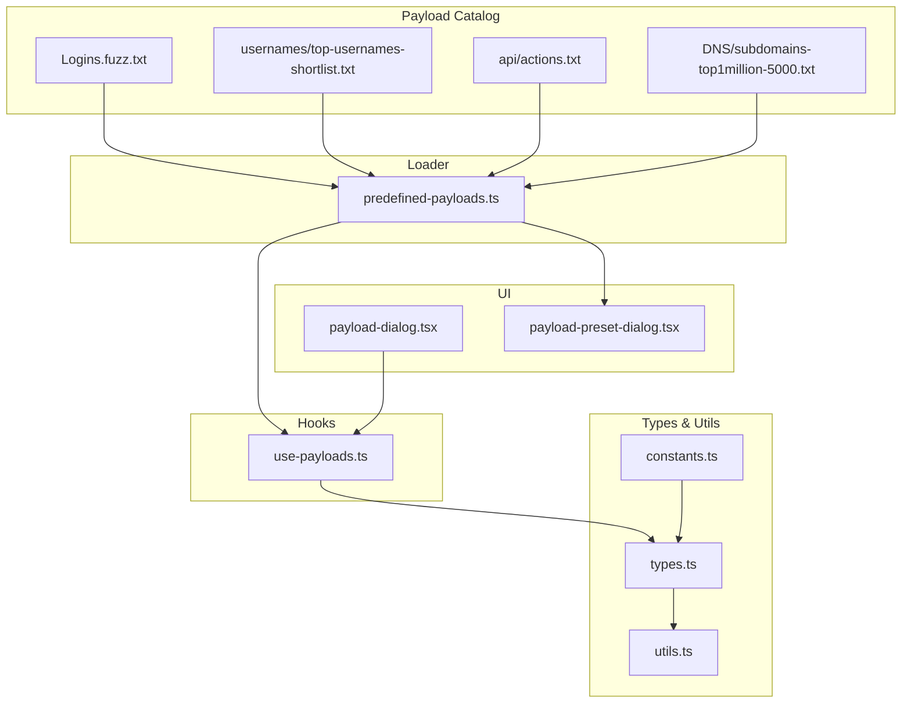
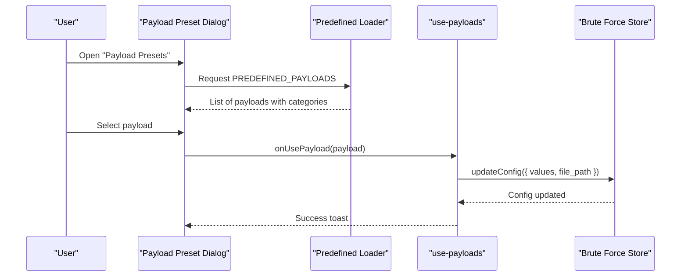
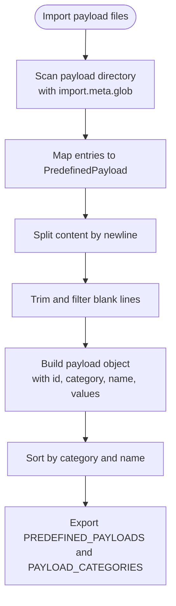
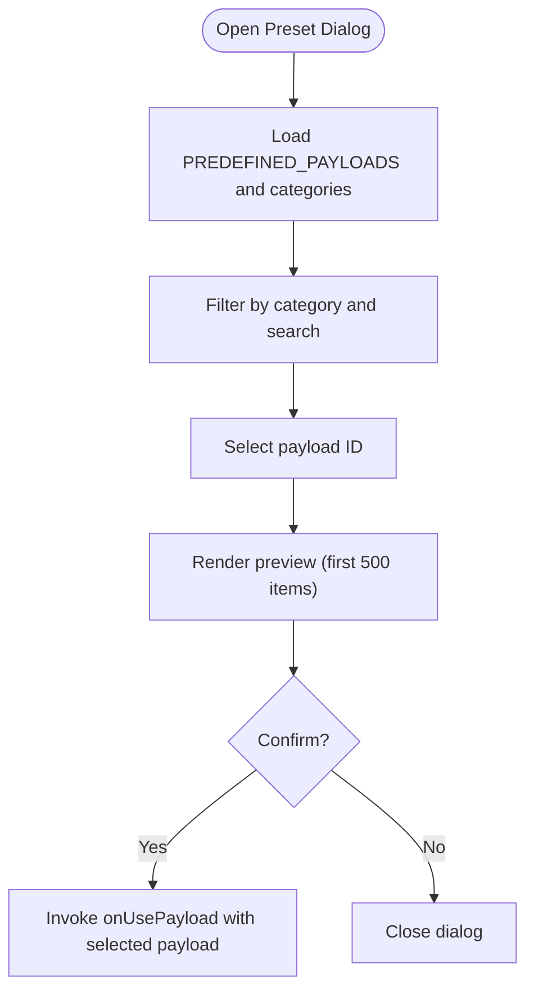
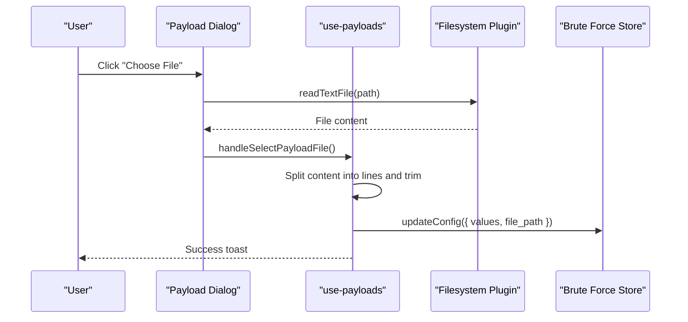
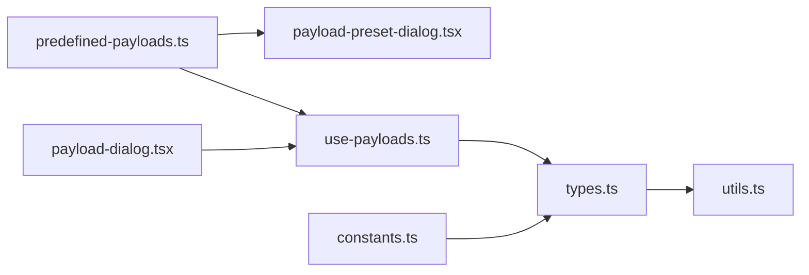

# Payload Management System

<cite>
**Referenced Files in This Document**
- [predefined-payloads.ts](file://src/pages/brute-force/data/predefined-payloads.ts)
- [use-payloads.ts](file://src/pages/brute-force/hooks/use-payloads.ts)
- [payload-dialog.tsx](file://src/pages/brute-force/components/payload-dialog.tsx)
- [payload-preset-dialog.tsx](file://src/pages/brute-force/components/payload-preset-dialog.tsx)
- [types.ts](file://src/pages/brute-force/types.ts)
- [constants.ts](file://src/pages/brute-force/constants.ts)
- [utils.ts](file://src/pages/brute-force/lib/utils.ts)
- [Logins.fuzz.txt](file://src/pages/brute-force/payload/Logins.fuzz.txt)
- [top-usernames-shortlist.txt](file://src/pages/brute-force/payload/usernames/top-usernames-shortlist.txt)
- [actions.txt](file://src/pages/brute-force/payload/api/actions.txt)
- [subdomains-top1million-5000.txt](file://src/pages/brute-force/payload/DNS/subdomains-top1million-5000.txt)
</cite>

## Table of Contents
1. [Introduction](#introduction)
2. [Project Structure](#project-structure)
3. [Core Components](#core-components)
4. [Architecture Overview](#architecture-overview)
5. [Detailed Component Analysis](#detailed-component-analysis)
6. [Dependency Analysis](#dependency-analysis)
7. [Performance Considerations](#performance-considerations)
8. [Troubleshooting Guide](#troubleshooting-guide)
9. [Conclusion](#conclusion)
10. [Appendices](#appendices)

## Introduction
This document describes AppRecon’s Payload Management System with a focus on the Brute Force module. It explains how predefined payload collections are organized, loaded, and consumed during attacks. It also covers payload testing workflows, custom payload creation, payload modification, and integration with brute force tools and security testing workflows. Examples illustrate credential stuffing, API enumeration, and web application testing scenarios. Guidance is included for payload maintenance, updates, customization, selection criteria, and creating domain-specific payload sets.

## Project Structure
The Payload Management System centers around:
- A predefined payload catalog under the payload directory
- A loader that discovers and parses payload files into structured lists
- UI dialogs for selecting and loading payloads
- Types and utilities that define payload configuration and processing steps
- Hooks that integrate payload loading into the brute force workflow



**Diagram sources**
- [predefined-payloads.ts:9-43](file://src/pages/brute-force/data/predefined-payloads.ts#L9-L43)
- [payload-dialog.tsx:8-36](file://src/pages/brute-force/components/payload-dialog.tsx#L8-L36)
- [payload-preset-dialog.tsx:30-197](file://src/pages/brute-force/components/payload-preset-dialog.tsx#L30-L197)
- [types.ts:14-41](file://src/pages/brute-force/types.ts#L14-L41)
- [constants.ts:3-7](file://src/pages/brute-force/constants.ts#L3-L7)
- [utils.ts:1-35](file://src/pages/brute-force/lib/utils.ts#L1-L35)
- [use-payloads.ts:7-84](file://src/pages/brute-force/hooks/use-payloads.ts#L7-L84)

**Section sources**
- [predefined-payloads.ts:1-48](file://src/pages/brute-force/data/predefined-payloads.ts#L1-L48)
- [payload-dialog.tsx:1-37](file://src/pages/brute-force/components/payload-dialog.tsx#L1-L37)
- [payload-preset-dialog.tsx:1-198](file://src/pages/brute-force/components/payload-preset-dialog.tsx#L1-L198)
- [types.ts:1-275](file://src/pages/brute-force/types.ts#L1-L275)
- [constants.ts:1-8](file://src/pages/brute-force/constants.ts#L1-L8)
- [utils.ts:1-35](file://src/pages/brute-force/lib/utils.ts#L1-L35)
- [use-payloads.ts:1-85](file://src/pages/brute-force/hooks/use-payloads.ts#L1-L85)

## Core Components
- Predefined payload loader: Scans the payload directory, reads raw text content, splits into lines, trims whitespace, filters blank lines, and builds structured payload entries with category, name, and values.
- Payload preset dialog: Allows browsing, filtering, and previewing predefined payloads by category and name.
- Payload file loader: Provides two ways to load custom payloads:
  - Drag-and-drop file input for quick text parsing
  - Native file picker to read files via filesystem plugin
- Payload types and processing: Defines payload types (simple list, runtime file, number range), processing steps (encoding/decoding, hashing), and utilities for request templating and payload insertion.

Key capabilities:
- Automatic discovery of payload files via glob import
- Category inference from directory structure
- Name formatting from filenames
- Runtime payload injection into HTTP requests
- Payload processing pipeline (URL encode, Base64, hashing, etc.)

**Section sources**
- [predefined-payloads.ts:9-43](file://src/pages/brute-force/data/predefined-payloads.ts#L9-L43)
- [payload-preset-dialog.tsx:41-74](file://src/pages/brute-force/components/payload-preset-dialog.tsx#L41-L74)
- [payload-dialog.tsx:16-35](file://src/pages/brute-force/components/payload-dialog.tsx#L16-L35)
- [use-payloads.ts:11-84](file://src/pages/brute-force/hooks/use-payloads.ts#L11-L84)
- [types.ts:14-41](file://src/pages/brute-force/types.ts#L14-L41)
- [constants.ts:3-7](file://src/pages/brute-force/constants.ts#L3-L7)

## Architecture Overview
The payload system integrates with the brute force workflow as follows:
- Predefined payloads are loaded at startup and presented in the preset dialog
- Users can choose a predefined payload or upload a custom list
- The chosen payload is applied to the active attack configuration
- During attack execution, payloads are injected into request templates according to configured positions and processing steps



**Diagram sources**
- [payload-preset-dialog.tsx:75-82](file://src/pages/brute-force/components/payload-preset-dialog.tsx#L75-L82)
- [predefined-payloads.ts:41-47](file://src/pages/brute-force/data/predefined-payloads.ts#L41-L47)
- [use-payloads.ts:27-34](file://src/pages/brute-force/hooks/use-payloads.ts#L27-L34)

## Detailed Component Analysis

### Predefined Payload Loader
Responsibilities:
- Discover payload files recursively under the payload directory
- Read raw content and split into non-empty lines
- Build structured entries with id, category, name, description, and values
- Provide sorted categories and a flat list of payloads

Design highlights:
- Uses Vite’s import.meta.glob with eager loading and raw query to fetch file contents
- Infers category from directory path and formats human-readable names
- Filters out empty lines and trims whitespace



**Diagram sources**
- [predefined-payloads.ts:9-47](file://src/pages/brute-force/data/predefined-payloads.ts#L9-L47)

**Section sources**
- [predefined-payloads.ts:1-48](file://src/pages/brute-force/data/predefined-payloads.ts#L1-L48)

### Payload Preset Dialog
Responsibilities:
- Display categories and filter by category and search term
- Preview payload contents and count
- Allow selection and application of a predefined payload to the active attack

Key behaviors:
- Maintains internal state for selected category, payload ID, and search query
- Computes visible payloads based on filters
- Shows a preview of up to 500 items and indicates hidden count



**Diagram sources**
- [payload-preset-dialog.tsx:41-82](file://src/pages/brute-force/components/payload-preset-dialog.tsx#L41-L82)

**Section sources**
- [payload-preset-dialog.tsx:1-198](file://src/pages/brute-force/components/payload-preset-dialog.tsx#L1-L198)

### Payload File Loader (Custom Payloads)
Responsibilities:
- Load custom payload lists from local files
- Two modes:
  - File input change handler: reads text content from input element
  - File picker: opens native dialog and reads via filesystem plugin

Behavior:
- Splits content by newline and trims lines
- Updates the active tab’s payload configuration
- Shows success/error notifications



**Diagram sources**
- [payload-dialog.tsx:23-26](file://src/pages/brute-force/components/payload-dialog.tsx#L23-L26)
- [use-payloads.ts:44-78](file://src/pages/brute-force/hooks/use-payloads.ts#L44-L78)

**Section sources**
- [payload-dialog.tsx:1-37](file://src/pages/brute-force/components/payload-dialog.tsx#L1-L37)
- [use-payloads.ts:1-85](file://src/pages/brute-force/hooks/use-payloads.ts#L1-L85)

### Payload Types and Processing Pipeline
Defines:
- Payload types: SimpleList, RuntimeFile, NumberRange
- Payload processing steps: UrlEncode, UrlDecode, Base64Encode, Base64Decode, Md5Hash, Sha1Hash, Sha256Hash
- Position markers in request templates and utilities to find and replace payload positions
- Utilities for building raw requests and parsing raw requests

Usage:
- Positions are marked with delimiters and discovered automatically
- Payload values are inserted into marked positions
- Optional processing steps transform values before injection

```mermaid
classDiagram
class PayloadConfig {
+payload_type
+values
+file_path
+number_start
+number_end
+number_step
+number_format
+processing
}
class PayloadProcessingStep {
<<enum>>
"UrlEncode"
"UrlDecode"
"Base64Encode"
"Base64Decode"
"Md5Hash"
"Sha1Hash"
"Sha256Hash"
}
class PayloadPosition {
+name
+start
+end
+default_value
}
class AttackConfig {
+base_request
+positions
+payload_config
+position_payloads
+concurrency
+delay_ms
+retries
+grep_match
+grep_extract
+session_handling
}
PayloadConfig --> PayloadProcessingStep : "uses"
AttackConfig --> PayloadConfig : "contains"
AttackConfig --> PayloadPosition : "references"
```

**Diagram sources**
- [types.ts:14-41](file://src/pages/brute-force/types.ts#L14-L41)
- [types.ts:25-30](file://src/pages/brute-force/types.ts#L25-L30)
- [types.ts:62-76](file://src/pages/brute-force/types.ts#L62-L76)

**Section sources**
- [types.ts:14-41](file://src/pages/brute-force/types.ts#L14-L41)
- [types.ts:104-149](file://src/pages/brute-force/types.ts#L104-L149)
- [types.ts:196-218](file://src/pages/brute-force/types.ts#L196-L218)
- [types.ts:258-275](file://src/pages/brute-force/types.ts#L258-L275)

### Payload Testing Workflows
Common workflows supported by the payload system:
- Credential stuffing: Use predefined login paths and usernames to probe authentication endpoints
- API enumeration: Use action/object lists to discover API endpoints and methods
- Web application testing: Use fuzzed paths and subdomains to enumerate attack surface

Example scenarios (described):
- Login path fuzzing: Feed a list of common admin and login paths to probe various backend entry points
- Username shortlist: Supply a curated list of likely usernames for brute force attempts
- API actions/objects: Inject verbs and nouns to infer API structure and endpoints
- DNS subdomains: Enumerate potential subdomains to expand target scope

These workflows rely on:
- Predefined payload categories and names
- Position markers in request templates
- Optional payload processing (encoding, hashing)
- Results filtering and formatting utilities

**Section sources**
- [Logins.fuzz.txt:1-90](file://src/pages/brute-force/payload/Logins.fuzz.txt#L1-L90)
- [top-usernames-shortlist.txt:1-18](file://src/pages/brute-force/payload/usernames/top-usernames-shortlist.txt#L1-L18)
- [actions.txt:1-225](file://src/pages/brute-force/payload/api/actions.txt#L1-L225)
- [subdomains-top1million-5000.txt:1-800](file://src/pages/brute-force/payload/DNS/subdomains-top1million-5000.txt#L1-L800)
- [utils.ts:13-34](file://src/pages/brute-force/lib/utils.ts#L13-L34)

## Dependency Analysis
High-level dependencies:
- The payload loader depends on the presence of payload files under the payload directory
- The preset dialog depends on the loader’s exported payload list and categories
- The file loader depends on the filesystem and dialog plugins
- The brute force store depends on payload configuration types and processing steps



**Diagram sources**
- [predefined-payloads.ts:41-47](file://src/pages/brute-force/data/predefined-payloads.ts#L41-L47)
- [payload-preset-dialog.tsx:18-22](file://src/pages/brute-force/components/payload-preset-dialog.tsx#L18-L22)
- [payload-dialog.tsx:5-6](file://src/pages/brute-force/components/payload-dialog.tsx#L5-L6)
- [use-payloads.ts:5-6](file://src/pages/brute-force/hooks/use-payloads.ts#L5-L6)
- [types.ts:1-10](file://src/pages/brute-force/types.ts#L1-L10)
- [constants.ts:1-7](file://src/pages/brute-force/constants.ts#L1-L7)
- [utils.ts:1-7](file://src/pages/brute-force/lib/utils.ts#L1-L7)

**Section sources**
- [predefined-payloads.ts:1-48](file://src/pages/brute-force/data/predefined-payloads.ts#L1-L48)
- [payload-preset-dialog.tsx:1-198](file://src/pages/brute-force/components/payload-preset-dialog.tsx#L1-L198)
- [payload-dialog.tsx:1-37](file://src/pages/brute-force/components/payload-dialog.tsx#L1-L37)
- [use-payloads.ts:1-85](file://src/pages/brute-force/hooks/use-payloads.ts#L1-L85)
- [types.ts:1-275](file://src/pages/brute-force/types.ts#L1-L275)
- [constants.ts:1-8](file://src/pages/brute-force/constants.ts#L1-L8)
- [utils.ts:1-35](file://src/pages/brute-force/lib/utils.ts#L1-L35)

## Performance Considerations
- Predefined payload loading uses eager glob import; keep payload files reasonably sized to avoid long initial load times
- Large payload previews are truncated to improve UI responsiveness
- Filtering and sorting are client-side; very large payload lists may impact UI performance
- Consider splitting very large lists into smaller files per category for faster browsing and selection

## Troubleshooting Guide
Common issues and resolutions:
- Empty or missing payloads after selection:
  - Verify the file contains non-empty lines and is saved with correct encoding
  - Ensure the file extension is supported (.txt, .lst, .wordlist)
- File picker errors:
  - Confirm filesystem permissions and that the selected file exists
  - Check for read errors and retry with a different file
- Payload not applied to attack:
  - Ensure payload positions are marked in the request template
  - Verify payload configuration has values or a file path
- Unexpected results:
  - Review payload processing steps (encoding/hash) and adjust as needed
  - Use result filtering utilities to narrow down interesting outcomes

**Section sources**
- [use-payloads.ts:37-38](file://src/pages/brute-force/hooks/use-payloads.ts#L37-L38)
- [use-payloads.ts:74-77](file://src/pages/brute-force/hooks/use-payloads.ts#L74-L77)
- [types.ts:166-172](file://src/pages/brute-force/types.ts#L166-L172)
- [utils.ts:13-34](file://src/pages/brute-force/lib/utils.ts#L13-L34)

## Conclusion
AppRecon’s Payload Management System provides a robust foundation for organizing, discovering, and applying payload lists in brute force and security testing workflows. Predefined payloads are categorized and browsable, while custom payloads can be loaded from local files. The system supports flexible payload insertion into request templates and optional transformations. By leveraging the provided types, utilities, and UI components, testers can efficiently configure attacks, iterate on payload sets, and tailor testing campaigns to specific domains and objectives.

## Appendices

### Payload Organization and Formats
- Directory structure:
  - Root payload directory contains category folders and files
  - Categories inferred from subdirectory names
  - Filenames become human-readable names with formatting applied
- File format:
  - Plain text, one payload per line
  - Blank lines are ignored; whitespace is trimmed
- Example categories present:
  - Logins
  - Usernames
  - API
  - DNS

**Section sources**
- [predefined-payloads.ts:22-39](file://src/pages/brute-force/data/predefined-payloads.ts#L22-L39)
- [Logins.fuzz.txt:1-90](file://src/pages/brute-force/payload/Logins.fuzz.txt#L1-L90)
- [top-usernames-shortlist.txt:1-18](file://src/pages/brute-force/payload/usernames/top-usernames-shortlist.txt#L1-L18)
- [actions.txt:1-225](file://src/pages/brute-force/payload/api/actions.txt#L1-L225)
- [subdomains-top1million-5000.txt:1-800](file://src/pages/brute-force/payload/DNS/subdomains-top1million-5000.txt#L1-L800)

### Payload Modification Capabilities
- Modify existing lists by editing files under the payload directory
- Create new category folders and files to extend coverage
- Combine multiple lists by concatenating files or using external tools
- Use processing steps to adapt payloads for specific targets (e.g., URL encoding, hashing)

**Section sources**
- [predefined-payloads.ts:22-39](file://src/pages/brute-force/data/predefined-payloads.ts#L22-L39)
- [types.ts:16-23](file://src/pages/brute-force/types.ts#L16-L23)

### Integration with Brute Force Tools and Security Testing
- Brute force configuration consumes payload values and applies them to request templates
- Position markers enable precise injection into URLs, headers, and bodies
- Processing steps support common obfuscation and normalization tasks
- Results filtering and formatting help triage outcomes quickly

**Section sources**
- [types.ts:196-218](file://src/pages/brute-force/types.ts#L196-L218)
- [types.ts:258-275](file://src/pages/brute-force/types.ts#L258-L275)
- [utils.ts:13-34](file://src/pages/brute-force/lib/utils.ts#L13-L34)

### Examples of Payload Usage
- Credential stuffing:
  - Use login fuzz paths and username shortlist to probe authentication endpoints
- API enumeration:
  - Inject action and object lists to discover endpoints and methods
- Web application testing:
  - Probe admin and login paths, and enumerate subdomains to expand scope

**Section sources**
- [Logins.fuzz.txt:1-90](file://src/pages/brute-force/payload/Logins.fuzz.txt#L1-L90)
- [top-usernames-shortlist.txt:1-18](file://src/pages/brute-force/payload/usernames/top-usernames-shortlist.txt#L1-L18)
- [actions.txt:1-225](file://src/pages/brute-force/payload/api/actions.txt#L1-L225)
- [subdomains-top1million-5000.txt:1-800](file://src/pages/brute-force/payload/DNS/subdomains-top1million-5000.txt#L1-L800)

### Payload Maintenance and Customization
- Keep payload lists current by updating files in the payload directory
- Add new domain-specific payloads by creating new files or categories
- Use the preset dialog to preview and select appropriate lists
- For large lists, consider splitting into smaller files for easier management

**Section sources**
- [payload-preset-dialog.tsx:118-156](file://src/pages/brute-force/components/payload-preset-dialog.tsx#L118-L156)
- [predefined-payloads.ts:41-47](file://src/pages/brute-force/data/predefined-payloads.ts#L41-L47)

### Selection Criteria and Effectiveness Evaluation
- Selection criteria:
  - Relevance to target technology stack and application surface
  - Breadth vs. depth: choose broad enumerations for reconnaissance and targeted lists for exploitation
  - Coverage of common misconfigurations and default paths
- Effectiveness evaluation:
  - Track response characteristics (status codes, response length, timing)
  - Use grep match/extract to identify meaningful responses
  - Filter results to focus on interesting outcomes

**Section sources**
- [types.ts:43-53](file://src/pages/brute-force/types.ts#L43-L53)
- [utils.ts:13-34](file://src/pages/brute-force/lib/utils.ts#L13-L34)