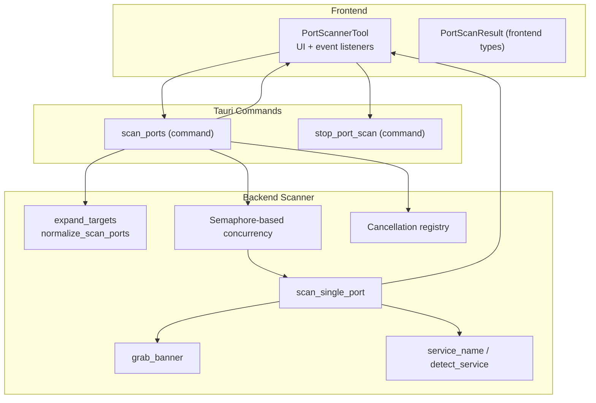
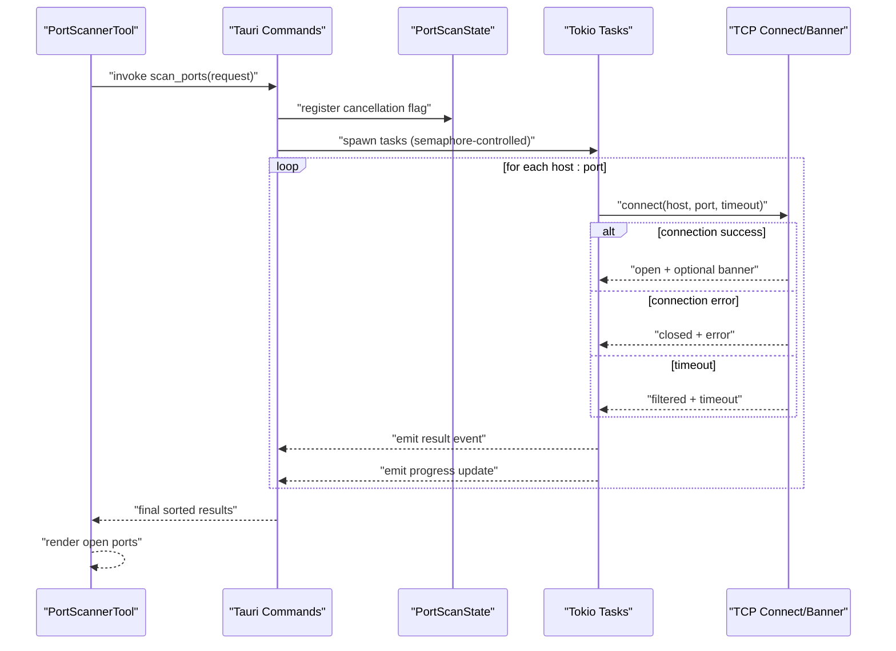
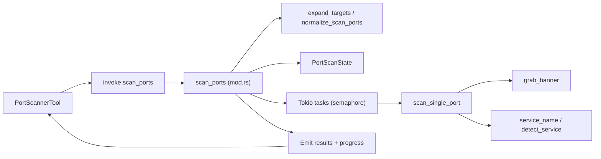

# Port Scanner

<cite>
**Referenced Files in This Document**
- [port-scanner.tsx](file://src/pages/tools/components/port-scanner.tsx)
- [types.ts](file://src/pages/tools/types.ts)
- [mod.rs](file://src-tauri/src/port-scanner/mod.rs)
- [scanner.rs](file://src-tauri/src/port-scanner/scanner.rs)
- [services.rs](file://src-tauri/src/port-scanner/services.rs)
- [banner.rs](file://src-tauri/src/port-scanner/banner.rs)
- [targets.rs](file://src-tauri/src/port-scanner/targets.rs)
- [types.rs](file://src-tauri/src/port-scanner/types.rs)
- [state.rs](file://src-tauri/src/port-scanner/state.rs)
</cite>

## Table of Contents
1. [Introduction](#introduction)
2. [Project Structure](#project-structure)
3. [Core Components](#core-components)
4. [Architecture Overview](#architecture-overview)
5. [Detailed Component Analysis](#detailed-component-analysis)
6. [Dependency Analysis](#dependency-analysis)
7. [Performance Considerations](#performance-considerations)
8. [Troubleshooting Guide](#troubleshooting-guide)
9. [Conclusion](#conclusion)
10. [Appendices](#appendices)

## Introduction
This document describes AppRecon’s Port Scanner utility, focusing on network discovery and reconnaissance. It covers how targets and port ranges are specified, how concurrent scanning is executed, how service enumeration and banner grabbing work, and how results are emitted and displayed. It also explains the integration between the frontend React component and the Rust backend Tauri commands, along with practical applications, performance tuning, and guidance for interpreting results.

## Project Structure
The Port Scanner spans two layers:
- Frontend (React): Provides the UI, parses user inputs, invokes Tauri commands, listens to progress and result events, and renders results.
- Backend (Rust/Tauri): Implements the scanning engine, concurrency control, cancellation, service detection, and banner grabbing.

**Diagram sources**
- [port-scanner.tsx:29-103](file://src/pages/tools/components/port-scanner.tsx#L29-L103)
- [mod.rs:20-139](file://src-tauri/src/port-scanner/mod.rs#L20-L139)
- [scanner.rs:11-61](file://src-tauri/src/port-scanner/scanner.rs#L11-L61)
- [banner.rs:5-41](file://src-tauri/src/port-scanner/banner.rs#L5-L41)
- [services.rs:1-92](file://src-tauri/src/port-scanner/services.rs#L1-L92)
- [targets.rs:3-22](file://src-tauri/src/port-scanner/targets.rs#L3-L22)
- [state.rs:4-7](file://src-tauri/src/port-scanner/state.rs#L4-L7)

**Section sources**
- [port-scanner.tsx:1-337](file://src/pages/tools/components/port-scanner.tsx#L1-L337)
- [types.ts:59-69](file://src/pages/tools/types.ts#L59-L69)
- [mod.rs:1-140](file://src-tauri/src/port-scanner/mod.rs#L1-L140)

## Core Components
- Frontend UI and orchestration:
  - Target specification: accepts hostnames, IP addresses, URLs, and CIDR ranges.
  - Port range configuration: presets (Quick, Web, Top 100, Full), custom ranges, and parsing logic.
  - Execution controls: concurrency, timeouts, banner grabbing toggle, start/stop/clear actions.
  - Results rendering: open ports table with host, port, state, service, response time, and banner.
  - Event-driven updates: listens to per-scan progress and result events.

- Backend scanning pipeline:
  - Command entry points: scan_ports and stop_port_scan.
  - Target expansion: expands CIDR ranges and normalizes single hosts.
  - Port normalization: deduplicates and sorts ports.
  - Concurrency control: semaphore-based worker pool.
  - Per-port scanning: TCP connect with timeout, optional banner grabbing, service detection.
  - Cancellation: per-scan cancellation flag registry.
  - Emission: real-time result and progress events to the frontend.

**Section sources**
- [port-scanner.tsx:16-138](file://src/pages/tools/components/port-scanner.tsx#L16-L138)
- [types.ts:59-69](file://src/pages/tools/types.ts#L59-L69)
- [mod.rs:20-139](file://src-tauri/src/port-scanner/mod.rs#L20-L139)
- [scanner.rs:11-61](file://src-tauri/src/port-scanner/scanner.rs#L11-L61)
- [banner.rs:5-41](file://src-tauri/src/port-scanner/banner.rs#L5-L41)
- [services.rs:64-92](file://src-tauri/src/port-scanner/services.rs#L64-L92)
- [targets.rs:3-22](file://src-tauri/src/port-scanner/targets.rs#L3-L22)
- [state.rs:4-7](file://src-tauri/src/port-scanner/state.rs#L4-L7)

## Architecture Overview
The Port Scanner uses a hybrid frontend/backend architecture:
- The frontend collects inputs, invokes Tauri commands, and streams results via events.
- The backend performs asynchronous TCP connects, optional banner probing, and emits structured results and progress updates.

**Diagram sources**
- [port-scanner.tsx:53-103](file://src/pages/tools/components/port-scanner.tsx#L53-L103)
- [mod.rs:20-139](file://src-tauri/src/port-scanner/mod.rs#L20-L139)
- [scanner.rs:11-61](file://src-tauri/src/port-scanner/scanner.rs#L11-L61)
- [banner.rs:5-41](file://src-tauri/src/port-scanner/banner.rs#L5-L41)

## Detailed Component Analysis

### Frontend: PortScannerTool
Responsibilities:
- Accepts target input supporting hostnames, IPs, URLs, and CIDR ranges.
- Applies port presets or parses custom ranges into normalized numeric arrays.
- Configures scan parameters: timeout, concurrency, banner grabbing, and scan type.
- Starts/stops scans, clears results, copies open ports, exports to JSON/CSV.
- Streams real-time progress and result events, aggregates open ports, and renders a sortable table.

Key behaviors:
- Preset selection updates the port list; custom mode allows freeform ranges.
- Ports are parsed into a sorted set to remove duplicates and enforce bounds.
- Progress and result events are scoped by a per-scan ID to avoid cross-scan interference.
- Banner grabbing is enabled by default; disabling reduces overhead.

Practical UI controls:
- Timeout: milliseconds applied to each connection attempt.
- Concurrency: maximum concurrent tasks.
- Banner grabbing: toggles protocol-specific probes and HTTP header summarization.
- Start/Stop/Clear: lifecycle controls for the scan.

**Section sources**
- [port-scanner.tsx:16-138](file://src/pages/tools/components/port-scanner.tsx#L16-L138)
- [types.ts:59-69](file://src/pages/tools/types.ts#L59-L69)

### Backend: scan_ports command
Responsibilities:
- Validates scan type (SYN is rejected; TCP connect is used).
- Expands targets and normalizes ports.
- Enforces limits: total checks capped at 65,535; CIDR range limited to 4,096 hosts.
- Initializes cancellation registry, semaphore, counters, and result buffer.
- Spawns tasks for each host:port pair, emitting per-result and progress events.
- Sorts final results and returns them to the caller.

Concurrency and cancellation:
- Semaphore controls concurrency; tasks check a shared cancel flag.
- Cancellation registry maps scan IDs to cancel flags; stop command flips the flag.

**Section sources**
- [mod.rs:20-139](file://src-tauri/src/port-scanner/mod.rs#L20-L139)

### Backend: scan_single_port
Responsibilities:
- Performs a single TCP connect with a per-attempt timeout.
- On success, optionally grabs a banner and detects service type.
- On failure, classifies as closed or filtered with appropriate metadata.
- Tracks response time and propagates errors.

Service detection:
- Uses a static mapping for common ports.
- If banner is present, applies heuristic matching for protocols like SSH, HTTP(S), SMTP, MySQL, PostgreSQL, Redis, MongoDB, FTP.

**Section sources**
- [scanner.rs:11-61](file://src-tauri/src/port-scanner/scanner.rs#L11-L61)
- [services.rs:1-92](file://src-tauri/src/port-scanner/services.rs#L1-L92)

### Backend: Banner Grabbing
Capabilities:
- For HTTPS ports, sends an HTTP HEAD with relaxed TLS and redirect policies, then summarizes status, server, and X-Powered-By headers.
- For common plaintext services, writes a small protocol probe (e.g., HTTP HEAD, SMTP EHLO, IMAP capability) and reads a short banner.
- Sanitizes and truncates banners to a bounded length and line count.

**Section sources**
- [banner.rs:5-161](file://src-tauri/src/port-scanner/banner.rs#L5-L161)

### Backend: Targets and Ports Normalization
- expand_targets:
  - Parses hostnames/IPs and supports CIDR notation for IPv4.
  - Enforces a maximum host count for CIDR ranges.
- normalize_scan_ports:
  - Deduplicates and sorts ports into a strict range.

**Section sources**
- [targets.rs:3-22](file://src-tauri/src/port-scanner/targets.rs#L3-L22)

### Backend: Types and Events
- PortScanRequest: carries scan_id, target, ports, timeout_ms, concurrency, banner_grab, scan_type.
- PortScanResult: includes host, port, state, service, optional banner, response_time_ms, optional error.
- PortScanProgress: Update/Complete/Cancelled events with counts.

Frontend consumption:
- Listens to per-scan result and progress channels.
- Emits only open ports to the UI until completion, then displays the full sorted set.

**Section sources**
- [types.rs:3-36](file://src-tauri/src/port-scanner/types.rs#L3-L36)
- [types.ts:59-69](file://src/pages/tools/types.ts#L59-L69)
- [port-scanner.tsx:64-103](file://src/pages/tools/components/port-scanner.tsx#L64-L103)

## Dependency Analysis
The frontend depends on Tauri APIs for command invocation and event listening. The backend composes several modules:
- Targets and ports normalization
- Concurrency and cancellation
- Single-port scanning
- Banner grabbing
- Service detection

**Diagram sources**
- [port-scanner.tsx:83-103](file://src/pages/tools/components/port-scanner.tsx#L83-L103)
- [mod.rs:20-139](file://src-tauri/src/port-scanner/mod.rs#L20-L139)
- [scanner.rs:11-61](file://src-tauri/src/port-scanner/scanner.rs#L11-L61)
- [banner.rs:5-41](file://src-tauri/src/port-scanner/banner.rs#L5-L41)
- [services.rs:64-92](file://src-tauri/src/port-scanner/services.rs#L64-L92)
- [targets.rs:3-22](file://src-tauri/src/port-scanner/targets.rs#L3-L22)
- [state.rs:4-7](file://src-tauri/src/port-scanner/state.rs#L4-L7)

**Section sources**
- [port-scanner.tsx:1-337](file://src/pages/tools/components/port-scanner.tsx#L1-L337)
- [mod.rs:1-140](file://src-tauri/src/port-scanner/mod.rs#L1-L140)

## Performance Considerations
- Concurrency:
  - Tune concurrency to balance throughput and resource usage. Values are clamped to a safe range in the backend.
  - Higher concurrency increases CPU and socket usage; adjust based on system capacity and target responsiveness.
- Timeouts:
  - Per-connection timeout affects responsiveness under latency and network congestion. Increase for remote networks; decrease for LAN scans.
- Rate limiting:
  - The semaphore enforces concurrency limits. Consider reducing concurrency for noisy networks or when interacting with rate-limited targets.
- CIDR and port range sizing:
  - Scans are limited to a total of 65,535 checks; CIDR ranges are limited to 4,096 hosts to prevent runaway resource usage.
- Banner grabbing:
  - Disabling banner grabbing reduces overhead and improves speed, especially on large scans.
- Network conditions:
  - Expect filtered results for high-latency or congested links; adjust timeouts accordingly.

[No sources needed since this section provides general guidance]

## Troubleshooting Guide
Common issues and resolutions:
- SYN scan unavailable:
  - The backend rejects SYN scans and suggests using TCP connect scan for now.
- Excessive concurrency or timeouts:
  - Reduce concurrency or increase timeouts to improve stability on slow networks.
- No results for certain ports:
  - Filtered classification indicates timeouts or firewall drops; verify network path and adjust timeouts.
- Large CIDR ranges:
  - Ensure the CIDR does not exceed the host limit; split into smaller ranges if needed.
- Canceling a scan:
  - Use the Stop action; the backend sets a cancellation flag and stops spawning new tasks.

Operational tips:
- Export results to JSON or CSV for further analysis.
- Copy open ports for downstream vulnerability scanning or service enumeration.

**Section sources**
- [mod.rs:26-31](file://src-tauri/src/port-scanner/mod.rs#L26-L31)
- [mod.rs:40-42](file://src-tauri/src/port-scanner/mod.rs#L40-L42)
- [targets.rs:93-95](file://src-tauri/src/port-scanner/targets.rs#L93-L95)
- [port-scanner.tsx:105-109](file://src/pages/tools/components/port-scanner.tsx#L105-L109)

## Conclusion
AppRecon’s Port Scanner combines a user-friendly frontend with a robust Rust/Tauri backend to deliver fast, configurable TCP port discovery. It supports flexible target specification, concurrency control, banner grabbing, and service hints, enabling practical network reconnaissance, vulnerability assessment, and continuous service monitoring.

[No sources needed since this section summarizes without analyzing specific files]

## Appendices

### Practical Applications
- Internal network audits:
  - Scan local subnets with moderate concurrency and timeouts; enable banner grabbing to identify services quickly.
- External security assessments:
  - Use larger timeouts and lower concurrency to avoid triggering rate limits; focus on common web and database ports.
- Service monitoring:
  - Schedule periodic scans against critical hosts and ports; export results for trend analysis.

[No sources needed since this section provides general guidance]

### Interpreting Results
- Open ports:
  - Focus on ports with service hints; correlate with organizational asset inventories.
- Response time:
  - Lower values indicate responsiveness; higher values may imply latency or throttling.
- Banner content:
  - Use summarized banners to confirm service versions and technologies for targeted assessments.

[No sources needed since this section provides general guidance]

### Example Scenarios
- Quick internal audit:
  - Target: 192.168.1.0/24; Preset: Quick; Concurrency: 100; Timeout: 800 ms; Banner: Enabled.
- External web assessment:
  - Target: example.com; Preset: Web; Concurrency: 50; Timeout: 2000 ms; Banner: Enabled.
- Full LAN baseline:
  - Target: 10.0.0.0/24; Preset: Full; Concurrency: 50; Timeout: 1000 ms; Banner: Disabled.

[No sources needed since this section provides general guidance]